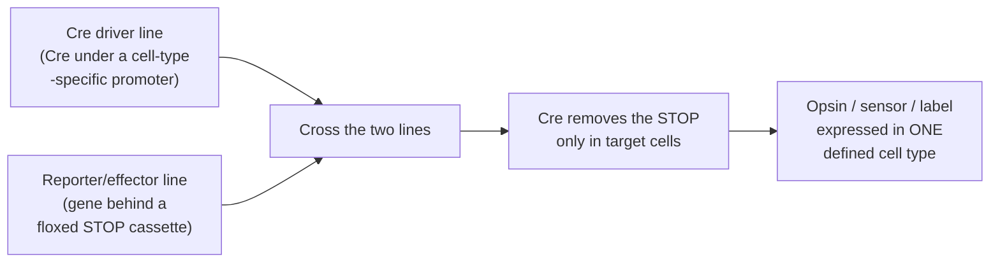
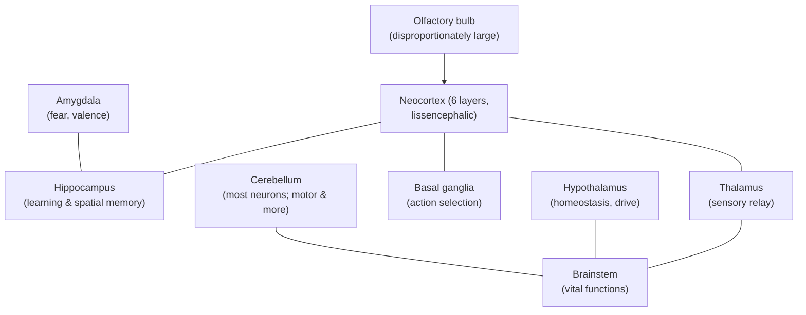
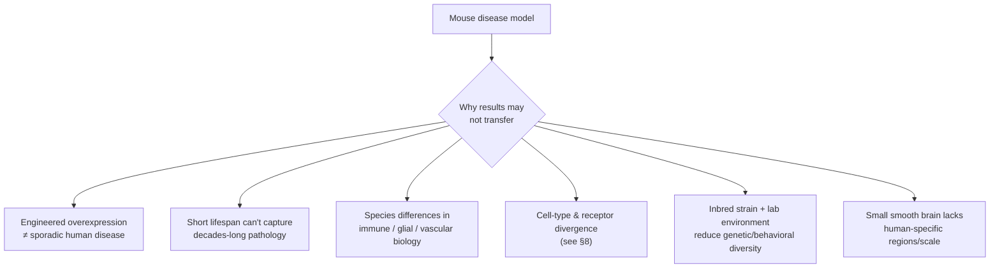

# The Mouse Brain (*Mus musculus*)

*The dominant mammalian model organism in modern neuroscience.*

---

## Introduction

No other animal has shaped our mechanistic understanding of the mammalian brain as
profoundly as the house mouse, *Mus musculus*. It is small (a whole brain weighs only
about 0.4–0.5 g, roughly 1/3000th of a human brain), inexpensive to house, breeds
rapidly, and — decisively — is the most genetically manipulable mammal on Earth. The
mouse is not studied because its brain is especially interesting in the way an octopus's
or an elephant's is; it is studied because it is a **tractable stand-in for the mammalian
brain in general**, including our own. Roughly 85% of protein-coding genes are shared as
orthologues between mouse and human, and the mouse brain reproduces, in miniature and
smooth-surfaced form, the same basic floor plan as the human brain: a six-layered
neocortex, a hippocampus, a thalamus, a cerebellum, basal ganglia, and brainstem.

This document surveys why the mouse came to dominate the field, how its brain is
organized, what it is exceptionally good at telling us, and — just as importantly — where
it misleads us. Throughout, claims that are genuinely contested in the literature are
explicitly flagged, because the gap between "works in mice" and "works in humans" is one
of the central problems of translational neuroscience.

> **A note on numbers.** Neuron counts, densities, and even brain mass vary with the
> counting method (stereology vs. the isotropic fractionator), the mouse strain, age, and
> sex. Figures here are representative central estimates, not fixed constants.

---

## Table of Contents

1. [Why the Mouse Dominates Neuroscience](#1-why-the-mouse-dominates-neuroscience)
2. [Gross Neuroanatomy and Organization](#2-gross-neuroanatomy-and-organization)
3. [The Whisker–Barrel System: A Model Within the Model](#3-the-whiskerbarrel-system-a-model-within-the-model)
4. [Sensory Specializations](#4-sensory-specializations)
5. [Landmark Tools and Discoveries Enabled by the Mouse](#5-landmark-tools-and-discoveries-enabled-by-the-mouse)
6. [Learning, Memory, and Behavioral Paradigms](#6-learning-memory-and-behavioral-paradigms)
7. [The Mouse as a Disease Model — and Its Translational Limits](#7-the-mouse-as-a-disease-model--and-its-translational-limits)
8. [Mouse vs. Human Brain: Homology and Divergence](#8-mouse-vs-human-brain-homology-and-divergence)
9. [Summary](#9-summary)
10. [Sources](#sources)

---

## 1. Why the Mouse Dominates Neuroscience

The mouse's dominance rests less on its brain and more on the **experimental control** it
offers. Four intertwined advantages compound one another.

### 1.1 Genetic tractability

The mouse was the first mammal in which researchers could routinely insert, delete, or
edit specific genes in the germline. Embryonic stem cell technology (gene targeting /
"knockouts"), pronuclear injection of transgenes, and now CRISPR/Cas9 mean that almost any
gene can be modified and the consequences studied in a living, behaving mammal. This lets
neuroscientists move from correlation ("this molecule is present in this circuit") to
causation ("removing it does this").

### 1.2 The Cre-*lox* system and cell-type access

The single most transformative tool is the **Cre-*loxP* recombinase system**. Cre is a
DNA recombinase that excises any sequence flanked by *loxP* sites. By expressing Cre under
a cell-type-specific promoter (a "**Cre driver line**"), researchers gain genetic access to
one defined population of neurons — say, only parvalbumin interneurons, or only
dopaminergic neurons of the midbrain. Hundreds of such Cre driver lines exist. Crossing a
driver line to a "reporter" or "effector" line — which carries a gene downstream of a
*loxP*-flanked stop cassette — switches that gene on *only* in the Cre-expressing cells.

### 1.3 Optogenetics and chemogenetics

Cell-type specificity becomes powerful when paired with tools that read out or drive
activity. **Optogenetics** places light-gated ion channels (channelrhodopsins for
activation, halorhodopsin/archaerhodopsin for silencing) into Cre-defined cells, so a
pulse of light can turn a population on or off on a millisecond timescale in an awake
mouse. **Chemogenetics** (DREADDs) does the same on a slower, drug-triggered timescale.
Genetically encoded calcium and voltage indicators (GCaMP, etc.) allow the same populations
to be *watched* during behavior. Because these effectors are delivered through the mouse's
own genetics, they inherit its cell-type precision — a synergy no other mammalian model
matches at scale.

### 1.4 Practical and economic factors

A ~2-month generation time, large litters, small size, standardized inbred strains (e.g.,
C57BL/6J) that minimize genetic variability, and a century of accumulated husbandry,
reagents, and antibodies make the mouse cheap and reproducible. The **community
infrastructure** — repositories such as The Jackson Laboratory, and reference atlases (see
§5) — lowers the barrier to entry further, creating a self-reinforcing cycle: tools are
built for mice because everyone uses mice, and everyone uses mice because the tools exist.

> **Flag — a real caveat, not just convenience.** Widely used transgenic/Cre lines can
> carry unintended phenotypes. CaMKIIα-iCre and nestin-Cre lines, for example, have been
> reported to cause aberrant glial activation and synaptic defects independent of the
> intended manipulation, and some driver lines show behavioral or cellular alterations from
> the transgene insertion itself. Good practice requires Cre-only and reporter-only
> controls. The mouse's tractability is powerful but not artifact-free.

---

## 2. Gross Neuroanatomy and Organization

### 2.1 Scale

| Feature | Mouse (representative) | Human (for comparison) |
|---|---|---|
| Brain mass | ~0.4–0.5 g | ~1,300–1,400 g |
| Total neurons | **~71 million** | ~86 billion |
| Neurons in cerebral cortex/isocortex | ~14 million | ~16 billion |
| Cortical surface | Smooth (**lissencephalic**) | Highly folded (**gyrencephalic**) |
| Brain as % of body mass | ~2% | ~2% |
| Neuron : non-neuronal cell ratio (whole brain) | ~roughly 1:1 | ~roughly 1:1 |

The ~71-million-neuron figure comes from the isotropic-fractionator work of
Herculano-Houzel and colleagues, who dissolved fixed brains into a homogeneous suspension
of nuclei and counted them. As with humans, the majority of the mouse's neurons live in
the **cerebellum** (dense granule cells), not the cortex — a point often missed. Different
methods (design-based stereology) give somewhat different totals, so treat 71 million as a
central estimate rather than an exact count.

### 2.2 The lissencephalic cortex

The defining macroscopic feature of the mouse brain is that its neocortex is **smooth** —
lissencephalic. There are no gyri or sulci. This is largely a consequence of scale: a small
cortex has little surface area to pack, so folding is unnecessary. Despite the smooth
surface, the mouse neocortex retains the canonical **six-layered** columnar architecture
(layers I–VI) with the same broad cell classes — excitatory pyramidal neurons and diverse
GABAergic interneurons — found in humans. The cortex is parcellated into functional areas
(primary sensory, motor, association) whose relative proportions and neuron densities
differ; primary sensory areas tend to be more densely packed with neurons than association
cortex.

### 2.3 Major structures

Two structures stand out in relative size compared with the human brain: the **olfactory
bulb**, which is proportionally enormous (see §4), and the smooth cortex, which occupies a
smaller *fraction* of total brain volume than in primates. The hippocampus, in contrast, is
a large, accessible, and well-defined structure — one reason so much memory research is
done in mice.

---

## 3. The Whisker–Barrel System: A Model Within the Model

If the mouse is neuroscience's model organism, the **whisker–barrel system** is the model
*circuit* within it — arguably the single best-studied piece of cortex in any mammal.

Mice actively sweep their large facial whiskers (vibrissae) to palpate their surroundings, a
behavior called **whisking**. Each whisker on the snout maps to a discrete anatomical unit
in layer 4 of the primary somatosensory cortex called a **barrel**. Crucially, the barrels
are arranged in a grid that mirrors the physical layout of the whiskers on the face — a
one-to-one, visible **somatotopic map** you can literally see under a microscope in stained
tissue. The same one-whisker-to-one-module organization repeats at every stage of the
pathway:

| Level | Structure | Module name |
|---|---|---|
| Brainstem (trigeminal nuclei) | sensory nuclei | **barrelettes** |
| Thalamus (VPM) | ventral posteromedial nucleus | **barreloids** |
| Cortex (S1, layer 4) | primary somatosensory cortex | **barrels** |

### Why it became a workhorse

- **Visible topography.** Each computational unit corresponds to an identifiable
  anatomical structure and a single, manipulable sensory input (one whisker).
- **Easy perturbation.** Trimming, plucking, or stimulating individual whiskers gives clean,
  reproducible input manipulations.
- **Robust plasticity.** Depriving or enriching whisker input reliably remodels the cortical
  map, making the barrel cortex the premier model of **experience-dependent cortical
  plasticity** and critical-period development.
- **Accessibility.** The barrel field sits on the dorsal surface, ideal for imaging and
  electrophysiology.

The barrel map is largely genetically specified and forms early in development, then is
refined by sensory experience — making it a natural laboratory for asking how genes and
activity jointly wire cortex.

---

## 4. Sensory Specializations

Mice are nocturnal, burrowing prey animals, and their sensory brain reflects a very
different ecological bet than ours: **chemical and tactile senses dominate; vision is
secondary.**

### 4.1 Olfaction — the dominant sense

Smell is the mouse's primary window on the world. Mice possess roughly **~1,000 functional
olfactory receptor genes**, compared with roughly ~400 in humans; olfactory receptors form
the largest gene family in the genome. The olfactory bulb is proportionally large, and mice
also have a functional **vomeronasal organ / accessory olfactory system** dedicated to
pheromones and social/sexual chemical signals — a system that is largely vestigial or
absent in humans. Much of mouse social behavior, mate choice, and territoriality is
olfactory.

### 4.2 Whisker somatosensation — active touch

As described in §3, the vibrissal system is a high-resolution active-touch sense. In near
darkness, a mouse "sees" texture, distance, and object shape largely through its whiskers.

### 4.3 Vision — comparatively poor

Mouse vision is low-acuity by human standards — on the order of ~0.5 cycles per degree,
perhaps ~50–100× coarser than human foveal acuity. Mice have **no fovea**, a
rod-dominated (dim-light-adapted) retina, and **dichromatic** color vision (two cone types,
sensitive to UV/green) rather than human trichromacy. They also have laterally placed eyes
giving a wide, panoramic field with little binocular overlap — good for detecting predators,
poor for fine discrimination. This is a genuine limitation for using mice to model human
high-acuity, foveated, color vision, even though the mouse **visual system** remains an
enormously productive circuit-level model (see MICrONS, §5).

### 4.4 Audition

Mice hear well into the **ultrasonic** range (well above the human upper limit of ~20 kHz)
and communicate using ultrasonic vocalizations, now widely used as a behavioral readout of
social state and of developmental/disease models.

---

## 5. Landmark Tools and Discoveries Enabled by the Mouse

### 5.1 The Allen Brain Atlases

The **Allen Mouse Brain Atlas** (gene-expression atlas, launched 2006) and the **Allen
Mouse Brain Connectivity Atlas** are foundational open-access resources. The gene-expression
atlas mapped genome-wide expression across the brain with cellular resolution; the
connectivity atlas is a **mesoscale connectome** — a brain-wide, quantitative map of axonal
projections in the standardized C57BL/6J mouse, built largely with Cre-dependent viral
tracing and registered into a common 3D coordinate framework. Together they turned "where is
this gene / where does this region project" from a lab-by-lab effort into a shared reference,
and they anchor the field's common coordinate frameworks and cell-type taxonomies.

### 5.2 Connectomics at synaptic resolution — MICrONS

In 2025 the **MICrONS** consortium published the largest synapse-resolution reconstruction
of mammalian cortex to date: a full **cubic millimeter of mouse visual cortex** imaged by
electron microscopy, reconstructing **>200,000 cells** and **~500 million synapses**, and —
uniquely — co-registered with two-photon calcium imaging of ~75,000 of those neurons *while
the mouse was awake and seeing*. This "functional connectomics" links wiring to activity and
revealed general rules such as like-responding neurons preferentially connecting. Electron-
microscopy connectomics was named *Nature Methods'* Method of the Year 2025. Only the mouse
combines the size feasibility and the genetic/functional toolkit to make such a dataset
possible in a mammal.

### 5.3 Place cells, grid cells, and the cognitive map

The neural basis of spatial navigation — **place cells** in the hippocampus (O'Keefe) and
**grid cells**, head-direction cells, and border cells in the entorhinal cortex
(the Mosers) — was worked out primarily in freely moving rodents (rats and mice), work
recognized by the 2014 Nobel Prize in Physiology or Medicine. Mouse genetics then allowed
these circuits to be dissected causally: silencing or activating defined cell types to test
what place and grid codes actually do for behavior and memory. Place/grid coding is now a
cornerstone example of an abstract "cognitive map" implemented in neural hardware.

### 5.4 Disease models and mechanistic tools

Beyond atlases, the mouse enabled: **engram** tagging and reactivation (labeling and
artificially triggering the specific neurons holding a memory); circuit-level dissection of
fear, reward, feeding, sleep, and social behavior; and a vast library of genetic
**disease models** (see §7). It is the default platform on which nearly every new molecular
neuroscience tool is first validated.

---

## 6. Learning, Memory, and Behavioral Paradigms

Because the mouse is a behaving mammal, its circuits can be tied to measurable behavior. A
handful of standardized paradigms recur across thousands of studies.

| Paradigm | What it measures | Key circuits | Notes |
|---|---|---|---|
| **Morris water maze** | Spatial learning/memory | Hippocampus | Devised by Richard G. Morris (early 1980s); mouse must learn a hidden platform's location from distal cues. "Gold standard" for spatial memory. |
| **Contextual & cued fear conditioning** | Associative emotional memory | Hippocampus (context), amygdala (cue) | Pairs a context/tone with a mild foot-shock; freezing is the readout. Fast, robust, circuit-mapped. |
| **Novel object recognition** | Recognition memory | Hippocampus/perirhinal cortex | Exploits innate preference for novelty; no aversive stimulus. |
| **Elevated plus maze / open field** | Anxiety-like behavior, locomotion | Amygdala, limbic | Approach–avoidance conflict. |
| **Fear extinction** | Inhibitory learning | Prefrontal cortex–amygdala | Model for exposure therapy / PTSD. |
| **Operant / lever tasks, 2-photon behavior** | Decision-making, learning rules | Cortex, striatum | Increasingly head-fixed for imaging. |

The **Morris water maze** deserves special mention: it exploits a mouse's aversion to water
and innate swimming to force reliance on spatial memory, and it was central to establishing
that hippocampal function and synaptic plasticity (LTP) underlie spatial learning.
**Fear conditioning** is prized because a single trial produces a durable, quantifiable
memory whose amygdala and hippocampal circuitry is now mapped in fine detail — making it the
substrate for much engram and memory-consolidation work.

> **Flag — interpretive caution.** These are *models of* human cognition and affect, not
> direct equivalents. "Anxiety-like behavior" in a maze is a behavioral proxy; equating it
> with human anxiety is an inference, and pharmacological results in these assays have a
> mixed record of predicting human efficacy.

---

## 7. The Mouse as a Disease Model — and Its Translational Limits

Genetic tractability makes the mouse the default vehicle for modeling human neurological and
psychiatric disease: Alzheimer's, Parkinson's, Huntington's, ALS, epilepsy, autism-spectrum
and neurodevelopmental disorders, and more. Human mutations can be knocked in, risk genes
deleted, and pathology tracked over the animal's life.

### 7.1 Alzheimer's disease as a case study

Common amyloid-based models such as **5xFAD** and **APP/PS1** overexpress mutant human
genes (APP and/or presenilin) to drive amyloid-β plaque deposition. These models
faithfully reproduce **amyloid plaques and neuroinflammation** and have been indispensable
for studying plaque biology, microglia, and blood–brain-barrier delivery.

But they illustrate the translational gap starkly:

- They typically **lack neurofibrillary tau tangles**, a defining human AD lesion, and show
  limited overt neurodegeneration.
- Their cognitive phenotype is **surprisingly weak** — some reports find 5xFAD mice show
  little robust, age-dependent cognitive deficit despite heavy plaque burden. *(This is an
  actively contested point; other studies do report deficits, and results depend heavily on
  the specific behavioral assay.)*
- Most importantly, **interventions that rescue pathology and memory in these mice have
  repeatedly failed to help human patients.** The high-profile failures of amyloid-lowering
  and BACE-inhibitor (e.g., verubecestat) trials — some worsening cognition — are the
  clearest evidence that "cures the mouse" ≠ "cures the patient."

### 7.2 Why translation fails — general reasons

The lesson is not that mouse models are useless — they are essential for mechanism — but
that they are **models, not miniatures**. They isolate one causal thread (a gene, a plaque,
a circuit) under conditions that omit much of what makes human disease human: aging,
comorbidity, genetic diversity, and species-specific brain features.

---

## 8. Mouse vs. Human Brain: Homology and Divergence

### 8.1 What is conserved

The deep architecture is remarkably shared. Mouse and human brains have the same major
divisions, a six-layered neocortex, homologous hippocampal and limbic circuits, and — per
large single-cell transcriptomic surveys (e.g., Hodge et al., 2019) — a **broadly conserved
set of cortical cell types** that can be matched one-to-one across ~75 million years of
evolutionary divergence. Neurotransmitter systems (glutamate, GABA, dopamine, serotonin,
etc.) and the genes encoding their core machinery are largely orthologous. This conservation
is *why* the mouse is informative at all.

### 8.2 What diverges

| Dimension | Mouse | Human | Consequence |
|---|---|---|---|
| Scale | ~71 million neurons | ~86 billion (~1,000×) | Human association cortex vastly expanded |
| Cortical surface | Lissencephalic (smooth) | Gyrencephalic (folded) | Human cortex has far more surface/area per volume |
| Cell-type details | Conserved *types*… | …but divergent proportions, laminar position, morphology, and gene expression | Homologous ≠ identical |
| Neuromodulator receptors | e.g., serotonin receptor genes highly divergent | — | Challenges mouse models of neuropsychiatric drugs acting on 5-HT |
| Glia | Rodent astrocytes simpler | Human astrocytes larger, more complex; some human-specific interneuron types | Human-specific circuit properties |
| Prefrontal/association cortex | Small, limited | Greatly expanded | Higher cognition hard to model |
| Dominant senses | Olfaction, whiskers | Vision | Different sensory brain emphasis |

A striking specific finding from the Hodge et al. comparison: even among conserved cell
types, **serotonin receptors were among the most divergent gene families** between mouse and
human — a direct warning about using mice to model serotonergic psychiatric drugs. More
broadly, homologous cell types differ in their relative abundance, where they sit across
cortical layers, their shapes, and their expression profiles.

### 8.3 The bottom line

The mouse brain captures the **conserved mammalian core** — canonical microcircuits,
neurotransmission, hippocampal memory, sensory and motor pathways — with extraordinary
experimental access. It **does not** capture human-specific scale, the massive expansion of
association and prefrontal cortex, gyrencephaly, several human-enriched or human-specific
cell types, and the divergent details of homologous cells. It is the right tool for
"how does a mammalian circuit work" and a frequently misleading tool for "will this drug fix
a human brain disease."

---

## 9. Summary

- The mouse dominates neuroscience because of **genetic tractability** — knockouts, CRISPR,
  the **Cre-*loxP*** system, and hundreds of cell-type-specific driver lines — combined with
  **optogenetics/chemogenetics**, low cost, and shared community infrastructure.
- Its brain (~0.4 g, **~71 million neurons**) is a **lissencephalic** but otherwise
  canonical mammalian brain: six-layered neocortex, hippocampus, thalamus, basal ganglia,
  and a neuron-rich cerebellum.
- The **whisker–barrel system** is the field's premier model of cortical topography and
  experience-dependent plasticity.
- Mice are **olfaction- and whisker-dominant** with comparatively **poor, dichromatic,
  low-acuity vision**.
- The mouse enabled landmark resources and discoveries: the **Allen Brain Atlases**, the
  **MICrONS** synapse-scale functional connectome, **place/grid-cell** navigation circuits,
  engram tagging, and a vast library of **disease models**.
- Standardized behavior (**Morris water maze**, **fear conditioning**) ties circuits to
  measurable learning and memory.
- As a **disease model** it is indispensable for mechanism but has real **translational
  limits** — vividly shown by Alzheimer's amyloid models whose successes did not transfer to
  patients.
- Mouse and human brains share a **conserved cellular and molecular core** but diverge sharply
  in **scale, folding, association-cortex expansion, and the fine details of homologous cell
  types** — so "works in mice" is a hypothesis about humans, not a conclusion.

---

## Sources

- [Herculano-Houzel et al. — Isotropic fractionator: a simple, rapid method for quantifying total cell and neuron numbers (J. Neurosci., 2005)](https://www.jneurosci.org/content/25/10/2518)
- [Herculano-Houzel — The Isotropic Fractionator (SfN Short Course chapter, PDF)](https://www.sfn.org/~/media/SfN/Documents/Short%20Courses/2014%20SC%202/SC%202%20Chapters/Suzana%20HerculanoHouzel.ashx)
- [Herculano-Houzel — Equal numbers of neuronal and nonneuronal cells make the human brain an isometrically scaled-up primate brain (J. Comp. Neurol., 2009)](https://onlinelibrary.wiley.com/doi/10.1002/cne.21974)
- [Distribution of neurons in functional areas of the mouse cerebral cortex (Front. Neuroanat., 2013)](https://www.frontiersin.org/journals/neuroanatomy/articles/10.3389/fnana.2013.00035/full)
- [Mouse transgenic approaches in optogenetics (PMC / NIH)](https://pmc.ncbi.nlm.nih.gov/articles/PMC3433654/)
- [Madisen et al. — A toolbox of Cre-dependent optogenetic transgenic mice (Nature Neuroscience)](https://www.nature.com/articles/nn.3078)
- [Next-generation transgenic mice for optogenetic analysis of neural circuits (Front. Neural Circuits)](https://www.frontiersin.org/articles/10.3389/fncir.2013.00160)
- [Aberrant glial activation and synaptic defects in CaMKIIα-iCre and nestin-Cre mice (PMC)](https://www.ncbi.nlm.nih.gov/pmc/articles/PMC9772212/)
- [Petersen — The Functional Organization of the Barrel Cortex (Neuron, 2007)](https://www.cell.com/fulltext/S0896-6273(07)00715-5)
- [How the Barrel Cortex Became a Working Model for Developmental Plasticity (J. Neurosci., 2020)](https://www.jneurosci.org/content/40/34/6460)
- [Whisker-related axonal patterns and plasticity of layer 2/3 neurons in mouse barrel cortex (J. Neurosci.)](https://www.jneurosci.org/content/30/8/3082)
- [Mouse olfactory sensory neurons express ~10,000 genes (J. Comp. Neurol., 2007)](https://onlinelibrary.wiley.com/doi/10.1002/cne.21365)
- [Loss of olfactory receptor genes coincides with full trichromatic vision in primates (PMC)](https://ncbi.nlm.nih.gov/sites/ppmc/articles/PMC314465)
- [Evolutionary dynamics of olfactory and other chemosensory receptor genes in vertebrates (J. Hum. Genet.)](https://www.nature.com/articles/jhg200678)
- [Allen Brain Atlas: an integrated spatio-temporal portal for exploring the CNS (PMC)](https://pmc.ncbi.nlm.nih.gov/articles/PMC3531093/)
- [Oh et al. — A mesoscale connectome of the mouse brain (Nature, 2014)](https://www.nature.com/articles/nature13186)
- [Allen Brain Connectivity Atlas — documentation](https://brain-map.org/support/documentation/api-allen-brain-connectivity-atlas)
- [MICrONS — Functional connectomics spanning multiple areas of mouse visual cortex (Nature, 2025)](https://www.nature.com/articles/s41586-025-08790-w)
- [MICrONS — Functional connectomics reveals a general wiring rule in mouse visual cortex (Nature, 2025)](https://www.nature.com/articles/s41586-025-08840-3)
- [Method of the Year 2025: electron microscopy-based connectomics (Nature Methods)](https://www.nature.com/articles/s41592-025-02988-6)
- [Grid Cells and Spatial Maps in Entorhinal Cortex and Hippocampus (NCBI Bookshelf)](https://www.ncbi.nlm.nih.gov/books/NBK435751/)
- [From A to Z: a potential role for grid cells in spatial navigation (PMC)](https://www.ncbi.nlm.nih.gov/pmc/articles/PMC3423065/)
- [Morris water navigation task (overview, Wikipedia)](https://en.wikipedia.org/wiki/Morris_water_navigation_task)
- [Morris Water Maze and Contextual Fear Conditioning to evaluate hippocampal neurogenesis (Front. Neurosci., 2021)](https://www.frontiersin.org/journals/neuroscience/articles/10.3389/fnins.2021.782947/full)
- [The 5XFAD mouse model displays age-dependent habituation deficits (PMC)](https://pmc.ncbi.nlm.nih.gov/articles/PMC10275951/)
- [5xFAD vs. APP/PS1 mice for Alzheimer's drug development (Biospective)](https://biospective.com/resources/5xfad-vs-app-ps1-mice)
- [Hodge et al. — Conserved cell types with divergent features in human versus mouse cortex (Nature, 2019)](https://www.nature.com/articles/s41586-019-1506-7)
- [Hodge et al. — full text (PMC)](https://pmc.ncbi.nlm.nih.gov/articles/PMC6919571/)
- [Evolutionary conservation of expression profiles between human and mouse orthologous genes (Mol. Biol. Evol.)](https://academic.oup.com/mbe/article/23/3/530/1110185)
