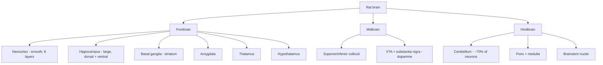
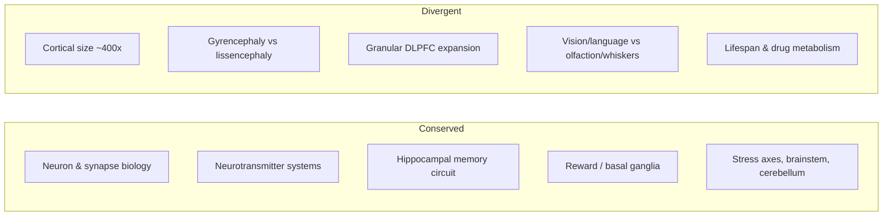

# The Rat Brain (*Rattus norvegicus*) — The Workhorse of Systems Neuroscience

> Part of the *Comparative Brains* series. Educational synthesis from
> web-researched, cross-verified sources; **not** medical or veterinary advice.
> Contested or debated claims are flagged inline.

For most of the twentieth century, when a psychologist or physiologist said
"the animal," they meant a rat. The Norway rat — the same brown rat that colonized
the world's cities — became the default laboratory mammal, and on its ~2-gram brain
much of what we know about learning, memory, reward, addiction, and spatial
navigation was first worked out. The rat is big enough to operate on and record
from with 1950s–1990s technology, cheap enough to run in the dozens, smart enough
to learn genuinely demanding tasks, and social enough to model behaviors we care
about. Even as the mouse overtook it in raw numbers (driven by genetics), the rat
remains the model of choice wherever **behavior, surgery, and electrophysiology**
meet.

---

## Table of contents

1. [Why the rat? A short history](#1-why-the-rat-a-short-history)
2. [The rat brain at a glance](#2-the-rat-brain-at-a-glance)
3. [Neuroanatomy](#3-neuroanatomy)
4. [Landmark discoveries made in rats](#4-landmark-discoveries-made-in-rats)
5. [Sensory and motor specializations](#5-sensory-and-motor-specializations)
6. [Learning, memory, and spatial cognition](#6-learning-memory-and-spatial-cognition)
7. [Higher cognition: metacognition and empathy](#7-higher-cognition-metacognition-and-empathy)
8. [Addiction and behavioral disease models](#8-addiction-and-behavioral-disease-models)
9. [Rat vs. mouse: choosing a rodent](#9-rat-vs-mouse-choosing-a-rodent)
10. [Rat vs. human: what transfers and what doesn't](#10-rat-vs-human-what-transfers-and-what-doesnt)
11. [Limitations and caveats](#11-limitations-and-caveats)
12. [Sources](#sources)

---

## 1. Why the rat? A short history

The laboratory rat is an **albino strain of the wild Norway rat** (*Rattus
norvegicus*), domesticated for science beginning in the late 1800s. The Wistar
Institute in Philadelphia standardized the first widely distributed stock (the
Wistar rat) around 1906, and by the 1920s–1950s the rat was the undisputed
protagonist of experimental psychology. Behaviorism was built on it: Edward
Thorndike's puzzle boxes, B. F. Skinner's operant chamber ("Skinner box"),
Clark Hull's drive-reduction theory, and Edward Tolman's maze work were all
rat programs.

Several practical properties made the rat dominant:

- **Body and brain size.** At ~250–500 g body weight and a ~2 g brain, a rat is
  large enough for reliable stereotaxic surgery, cannula and electrode
  implantation, multi-site recording, and repeated blood/CSF sampling — procedures
  that are fiddly or impossible in the much smaller mouse.
- **Rich, trainable behavior.** Rats learn complex operant and spatial tasks,
  tolerate handling, and perform demanding decision-making paradigms. Much of the
  classic behavioral toolkit (mazes, operant schedules, conditioned suppression)
  was designed around rat abilities.
- **Physiological tractability.** Cardiovascular, endocrine, and pharmacological
  measurements are easier at rat scale, which is why the rat is also the historical
  workhorse of pharmacology and toxicology.
- **Cost and standardization.** Cheap to house relative to primates, with
  decades of inbred/outbred strains (Sprague-Dawley, Wistar, Long-Evans,
  Fischer 344, Lewis) and a deep normative literature.

The rat's near-monopoly ended when **gene targeting** arrived: functional embryonic
stem cells and efficient knockout technology were developed in the *mouse* first
(1980s–1990s), and the field followed the genetics. But the rat never left — it
simply concentrated in the niches where its size and behavior matter most (see
[§9](#9-rat-vs-mouse-choosing-a-rodent)).

---

## 2. The rat brain at a glance

| Property | Rat | Human (for scale) |
|---|---|---|
| Brain mass | ~2 g | ~1,300–1,400 g |
| Brain volume | ~0.5–2 mL | ~1,200 cm³ |
| Total brain cells | ~330 million | ~170 billion |
| Neurons | ~200 million | ~86 billion |
| Fraction of neurons in cerebellum | ~70% | ~80% |
| Neocortex surface | **Lissencephalic** (smooth) | Highly gyrencephalic (folded) |
| Cortical thickness | ~1–2 mm | ~1–4.5 mm |
| Body : brain ratio | brain ≈ 0.4–0.9% of body mass | brain ≈ 2% of body mass |

Neuron counts come from Suzana Herculano-Houzel's "brain soup" (isotropic
fractionator) method, which dissolves the brain into a homogeneous suspension of
nuclei and counts them: **~200 million neurons** out of ~330 million total cells
in the adult rat brain, with the striking result that the great majority of those
neurons sit in the **cerebellum**, not the cortex. This cerebellum-heavy
distribution is a general mammalian pattern, not a rat quirk.

The single most consequential anatomical fact is that the rat cortex is **smooth
(lissencephalic)**. There are no gyri or sulci to fold extra sheet into the skull,
which both limits total cortical neuron number and makes the rat a poor model for
anything that depends on cortical folding — but also makes its cortex easier to
map and access experimentally.

---

## 3. Neuroanatomy

At the level of major divisions, the rat brain is a scaled-down, un-folded version
of the mammalian plan every reader of the human volumes will recognize:
brainstem, cerebellum, diencephalon (thalamus + hypothalamus), basal ganglia,
limbic structures, and a six-layered neocortex.

**What is proportionally *expanded* in the rat** compared with primates tells you
what the animal lives by:

- **Olfactory system.** The **olfactory bulbs are huge** relative to brain size,
  and the rat has a large accessory olfactory (vomeronasal) system for
  pheromones. Rats are macrosmatic ("smell-dominated") animals — the opposite
  weighting from vision-dominated primates.
- **Barrel cortex.** A large chunk of primary somatosensory cortex (S1) is
  devoted to the whiskers, arranged as discrete anatomical "barrels" (see
  [§5](#5-sensory-and-motor-specializations)).
- **Hippocampus.** Large, elongated, and curved along a dorsal-to-ventral axis —
  a functional gradient runs along it, with **dorsal (septal)** hippocampus more
  spatial/cognitive and **ventral (temporal)** hippocampus more emotional/
  motivational. Its accessibility and size are exactly why so much memory science
  happened here.

**What is proportionally *reduced***: the neocortex overall, and especially the
prefrontal cortex. Rats do have a **medial prefrontal cortex (mPFC)** and an
orbitofrontal cortex involved in flexible, goal-directed behavior, but there is
genuine debate about how well rodent "PFC" maps onto the granular dorsolateral
prefrontal cortex of primates — the rat lacks a clear granular DLPFC homolog.
*(Flagged as contested — homology of rodent vs. primate prefrontal areas is an
active, unresolved comparative-anatomy argument.)*

The rat is the animal for which the most detailed **stereotaxic atlases** exist —
Paxinos & Watson's *The Rat Brain in Stereotaxic Coordinates* is one of the most
cited works in all of science — precisely because a smooth, reproducibly shaped
brain of workable size lends itself to coordinate-based targeting.

---

## 4. Landmark discoveries made in rats

The rat's outsized place in neuroscience is easiest to appreciate through the
discoveries that happened *in* it (or in it alongside the rabbit and cat).

### 4.1 Place cells and the cognitive map (O'Keefe & Dostrovsky, 1971)

Recording from single hippocampal neurons in **freely moving rats**, John O'Keefe
and Jonathan Dostrovsky found cells that fired only when the animal occupied a
particular location in the environment — **place cells**. A cell might be near
silent (<1 Hz) everywhere except its "place field," where it fires briskly
(sometimes >100 Hz). The paper — *"The hippocampus as a spatial map. Preliminary
evidence from unit activity in the freely-moving rat,"* Brain Research 34(1),
1971 — launched the idea that the hippocampus builds an internal map, later
expanded in O'Keefe & Nadel's 1978 book *The Hippocampus as a Cognitive Map*.

This line of rat work led directly to the **2014 Nobel Prize in Physiology or
Medicine**, shared by O'Keefe with May-Britt and Edvard Moser, whose **grid cells**
in the entorhinal cortex (2005, also in rats) supply a metric coordinate system.
Together with head-direction cells and border cells, these form a rodent-derived
"GPS" whose principles appear to generalize across mammals, including humans.

### 4.2 Long-term potentiation (Bliss & Lømo, 1973)

The cellular candidate mechanism for memory — **long-term potentiation (LTP)** —
was first documented by Timothy Bliss and Terje Lømo in the **dentate gyrus of the
anaesthetized rabbit** (perforant-path stimulation), not the rat. But the rat (and
later the mouse and hippocampal slice) became the primary workhorse for
*characterizing* LTP: NMDA-receptor dependence, the Hebbian coincidence rule,
input specificity, and the link to spatial learning were largely built in rodents.

> **Flag:** it is a common textbook slip to credit LTP's discovery to the rat.
> The 1973 discovery was in **rabbit**; the rat's role is in the decades of
> mechanistic follow-up. LTP's status as *the* memory mechanism also remains a
> hypothesis with strong but not airtight causal support.

### 4.3 Brain-reward self-stimulation (Olds & Milner, 1954)

James Olds and Peter Milner, working with implanted electrodes in rat brains at
McGill, found that rats would press a lever thousands of times for nothing but a
brief pulse of electrical stimulation to certain sites (initially the septal
area). This **intracranial self-stimulation** revealed dedicated "reward"
circuitry in the brain and seeded the modern understanding of the mesolimbic
dopamine reward pathway that underlies motivation and addiction. Their paper —
*"Positive reinforcement produced by electrical stimulation of septal area and
other regions of rat brain"* (J. Comp. Physiol. Psychol., 1954) — is one of the
founding documents of behavioral neuroscience.

### 4.4 Cognitive maps and latent learning (Tolman, 1930s–1948)

Long before single-unit recording, **Edward Tolman** used rats running mazes to
argue — against strict stimulus-response behaviorism — that animals build an
internal **"cognitive map"** rather than merely chaining reflexes. His **latent
learning** experiments showed rats that explored a maze *without* reward still
learned its layout (revealed by a sudden performance jump once reward was
introduced). His essay *"Cognitive maps in rats and men"* (Psychological Review,
1948) named the concept that O'Keefe's place cells would later give a physical
substrate.

> **Flag:** a 2024 meta-analysis of Tolman's famous **"sunburst maze"**
> shortcutting result reported poor replicability and weak evidence that rats
> truly take a novel geometric shortcut. The broader cognitive-map framework is
> robust; the specific 1946 shortcut demonstration is now contested.

### 4.5 Reward, reinforcement, and the operant tradition

The rat is where operant conditioning was quantified: Skinner's schedules of
reinforcement, and later the pharmacology of reinforcement (dopamine, self-
administration), were mostly rat science. This tradition connects directly to
[§8](#8-addiction-and-behavioral-disease-models).

| Discovery | People | ~Year | Species | Why it mattered |
|---|---|---|---|---|
| Cognitive maps / latent learning | Tolman | 1930s–48 | Rat | Internal representations, vs. pure S-R |
| Brain self-stimulation ("reward centers") | Olds & Milner | 1954 | Rat | Dedicated reward circuitry |
| Long-term potentiation | Bliss & Lømo | 1973 | **Rabbit** | Synaptic memory mechanism (then refined in rat) |
| Place cells | O'Keefe & Dostrovsky | 1971 | Rat | Neural code for space → 2014 Nobel |
| Grid cells | Moser & Moser | 2005 | Rat | Metric coordinate system → 2014 Nobel |

---

## 5. Sensory and motor specializations

### 5.1 The whisker–barrel system

Rats are **nocturnal, burrow-dwelling tactile specialists**. They sweep their
large facial whiskers (mystacial vibrissae) back and forth several times per
second — **"whisking"** — to palpate surfaces, judge texture, aperture width, and
object location, much as a primate uses fingertips.

The elegance that made this system a neuroscience icon is its **one-to-one
anatomical map**. Thomas Woolsey and Hendrik Van der Loos (1970, originally in
mouse) described discrete cylindrical cell clusters in **layer 4 of primary
somatosensory cortex**, each corresponding to a single whisker and arranged in the
same grid as the whiskers on the snout. They named them **"barrels,"** and the
region is now universally called **barrel cortex**. Because you can see the map
anatomically, stimulate a known whisker, and record from its known cortical
barrel, the system became *the* model for:

- **Topographic maps** and columnar organization,
- **Developmental plasticity** and critical periods (trimming/removing a whisker
  in a young animal reorganizes the corresponding barrels),
- **Active sensing** — perception as a motor act, not passive reception.

The pathway runs whisker follicle → trigeminal ganglion → brainstem trigeminal
"barrelettes" → thalamic "barreloids" (VPM) → cortical **barrels**, preserving the
map at every stage.

### 5.2 Olfaction

Smell is arguably the rat's dominant sense. Large olfactory bulbs, a rich main
olfactory epithelium, and a functional **vomeronasal/accessory olfactory system**
support foraging, individual and kin recognition, and pheromonal communication.
Odor-guided tasks (odor discrimination, odor-place associations) are a core part
of the rat cognition toolkit and interface directly with hippocampal memory work.

### 5.3 Audition, vision, and ultrasonic communication

Rats hear well into the **ultrasonic** range and *emit* ultrasonic vocalizations
(USVs): ~22 kHz calls signal distress/aversive states, while ~50 kHz calls
accompany positive social interaction and play — the latter sometimes described,
cautiously, as **"laughter"** during tickling (Jaak Panksepp's work). Rat vision
is comparatively poor: low acuity, dichromatic, with sensitivity shifted toward
motion and dim light suited to a nocturnal lifestyle. This sensory weighting is
the mirror image of the human's, and matters when designing "fair" tasks.

---

## 6. Learning, memory, and spatial cognition

The rat is the canonical animal for **spatial and mnemonic** research, and the
apparatus names are practically a field glossary:

| Apparatus / paradigm | What it measures |
|---|---|
| **Morris water maze** | Spatial reference memory — find a hidden platform using distal cues |
| **Radial arm maze** | Working + reference memory across baited arms |
| **Barnes maze** | Spatial learning (dry-land alternative to water maze) |
| **T-maze / plus-maze alternation** | Working memory, spatial strategy, place-vs-response learning |
| **Fear conditioning** | Amygdala/hippocampus-dependent associative memory |
| **Novel object / object-in-place recognition** | Recognition and episodic-like memory |
| **Operant chambers** | Reinforcement schedules, decision-making, impulsivity |

Several conceptual advances came out of these:

- **Hippocampus = space + relational/episodic memory.** Place cells, plus lesion
  studies showing spatial-memory deficits, made the rat hippocampus the model
  system for episodic-like memory. Rats display **"what-where-when" memory** in
  some paradigms — an animal analog of episodic recall — though whether this
  entails human-like conscious recollection is unresolved and debated.
- **Replay and consolidation.** During rest and sleep, hippocampal place-cell
  sequences **replay** compressed versions of recent (and sometimes upcoming)
  trajectories, and disrupting sharp-wave ripples impairs memory. This rat work
  is foundational to the systems-consolidation theory of memory.
- **Place vs. response learning** in the T-maze dissects hippocampal ("where")
  from dorsal-striatal ("do this turn") memory systems — an influential
  multiple-memory-systems framework.

---

## 7. Higher cognition: metacognition and empathy

The rat has repeatedly forced upward revisions of how much "mind" a rodent has.
These are among the most interesting — and most contested — claims in the
literature, so treat them as *suggestive evidence*, not settled fact.

### 7.1 Metacognition ("knowing that you don't know")

Foote & Crystal (2007, *Current Biology*) trained rats on a duration-
discrimination task (classify a noise as "short" or "long"), with a twist:
before some trials the rat could **decline the test** for a small guaranteed
reward, or take it for a larger reward if correct (and nothing if wrong). Rats
declined more often on the *hardest* (near-boundary) durations, and their accuracy
was higher on tests they *chose* to take than on tests they were *forced* to
take — the signature pattern of **uncertainty monitoring**, i.e., behaving as if
they know when they don't know.

> **Flag — genuinely contested.** Critics (notably from Smith and colleagues'
> comparative-metacognition program) argue such patterns can arise from
> low-level associative or reward-rate strategies without true metacognition, and
> that the rat evidence is weaker than the primate evidence. Later studies
> (e.g., information-seeking paradigms, 2020s) have both supported and
> complicated the picture. The safe statement: rats show *behaviorally
> metacognitive-like* performance; whether it reflects introspective awareness is
> unresolved.

### 7.2 Empathy and pro-social behavior

Ben-Ami Bartal, Decety & Mason (2011, *Science*) placed a free rat in an arena
with a cagemate trapped in a restrainer. Over days, free rats learned to open the
restrainer and **liberate the trapped cagemate** — but did **not** open empty or
object-filled restrainers, and freed the cagemate even when doing so gave no
social-reunion reward. Given a choice between freeing a cagemate and a restrainer
full of chocolate, rats typically opened **both** and *shared* the chocolate.
Follow-up work showed the helping is modulated by social experience and group
familiarity (rats more readily help strangers of a familiar *type*), implicating
an empathy-like, motivationally driven response rather than a fixed reflex.

> **Flag.** "Empathy" here is contested terminology. Skeptics argue the free rat
> may be acting to reduce its *own* distress (emotional contagion) or seeking
> social contact, rather than out of concern for the other's state. The behavior
> is robust and replicated; its psychological interpretation is debated. Rat
> **emotional contagion** of pain and fear, by contrast, is well established.

Rats also display **regret-like** neural and behavioral signatures after making
poor foraging choices (Steiner & Redish, 2014), and juvenile **play** behavior
with its own 50 kHz "laughter" — further evidence of an emotionally and socially
textured inner life for a rodent.

---

## 8. Addiction and behavioral disease models

Because reward circuitry was discovered in rats ([§4.3](#43-brain-reward-self-stimulation-olds--milner-1954)),
the rat became the central model for **addiction**. Rats will voluntarily
**self-administer** most human drugs of abuse (cocaine, heroin, nicotine, alcohol,
amphetamine) by pressing a lever for intravenous or oral delivery, and they show
tolerance, escalation, bingeing, cue-induced craving, **reinstatement** (relapse)
after abstinence, and withdrawal — a behavioral repertoire that maps closely onto
human addiction and is the workhorse for testing anti-relapse treatments.

### The Rat Park studies (Alexander et al., 1978–1981)

Bruce Alexander's **Rat Park** experiments are the most culturally famous — and
most caveated — rat addiction studies. Rats housed alone in bare cages consumed
far more morphine solution than rats living in a large, enriched, **social**
"park." The interpretation: isolation and impoverished environment, not the drug's
pharmacology alone, drive compulsive use — addiction is partly a response to
social conditions.

> **Flag — overstated in popular retellings.** Rat Park had small samples, some
> results proved hard to replicate, and top journals rejected the original
> papers. The *direction* of the effect — environmental enrichment and social
> housing reduce drug intake — has substantial independent support, but the
> popularized claim that "environment is basically all that matters" goes well
> beyond what the data show. Pharmacology, genetics, and environment all
> contribute.

Beyond addiction, rats model a wide range of conditions: Parkinson's (6-OHDA and
α-synuclein lesions), stroke (middle-cerebral-artery occlusion), epilepsy,
depression/anxiety (chronic stress paradigms), PTSD (fear conditioning), and
neurodevelopmental and pain disorders. The rat's size makes it especially
valuable for **neurosurgical and device work** — deep-brain-stimulation targeting,
spinal-cord-injury and neuroprosthetics research, and brain–machine interfaces —
where you need room to implant hardware and record from many sites over months.

---

## 9. Rat vs. mouse: choosing a rodent

The two dominant lab rodents are not interchangeable. The decision usually comes
down to a trade-off between **genetic toolkits** (mouse) and **size + behavior**
(rat).

| Dimension | Rat | Mouse |
|---|---|---|
| Brain mass | ~2 g | ~0.4 g |
| Genetic toolkit | Historically limited; **catching up fast** (CRISPR, viral tools) | Vast: knockouts, Cre-lox, huge transgenic-line libraries, optogenetics-ready |
| Surgery / implants | Easier, more reliable at larger scale | Fiddly; less room for hardware |
| Electrophysiology & imaging | Preferred for chronic multi-site recording, larger structures | Feasible but tighter; strong for 2-photon imaging via transgenics |
| Behavioral repertoire | Richer, more robust in complex decision/cognitive tasks (often argued) | Capable, but complex-task performance is debated |
| Docility / handling | Generally calmer, more handleable | More skittish |
| Cost per animal | Higher (food, housing, drug doses) | Lower; scales to large *n* |
| Pharmacology / toxicology | Long-standing standard | Used, but rat is the classic tox model |

**Rule of thumb:** reach for the **mouse** when the question demands cell-type-
specific genetic access — labeling, silencing, or activating defined neurons
(optogenetics/chemogenetics), or modeling a specific gene. Reach for the **rat**
when the question demands **surgery, chronic large-scale recording, sophisticated
behavior, or drug self-administration**, and when body size or task complexity
would defeat a mouse. As rat genome-editing and viral tools mature, the historic
gap is narrowing, and some labs now port genetic approaches back into rats to get
"the best of both."

> **Flag.** The claim that rats are cognitively "smarter" or better at complex
> decision-making than mice is frequently asserted but genuinely debated; some
> head-to-head studies find **comparable** performance on adaptive decision tasks.
> Treat "rats are smarter" as a working impression, not an established fact.

---

## 10. Rat vs. human: what transfers and what doesn't

Rat and human brains share the mammalian ground plan — the same neuron types,
neurotransmitter systems, synaptic mechanisms, hippocampal memory circuitry,
basal-ganglia and reward pathways, brainstem and cerebellar organization, and the
six-layered neocortex. That deep conservation is *why* rat findings (LTP, place
cells, reward circuits, stress axes) have so often generalized to humans.

But the differences are equally important:

- **Scale.** ~86 billion vs. ~200 million neurons — roughly a **400-fold**
  difference, concentrated in neocortex.
- **Cortical expansion and folding.** The human neocortex is vastly larger and
  **gyrencephalic**; the rat's is smooth. Association cortices, and especially a
  granular dorsolateral prefrontal cortex, are expanded or newly elaborated in
  primates.
- **Sensory weighting.** Humans are vision- and language-dominated; rats are
  olfaction- and whisker-dominated. "Equivalent" tasks must respect this.
- **Lifespan and developmental timing.** Rats live ~2–3.5 years and develop on a
  compressed schedule, which changes how aging and development translate.
- **Metabolism and pharmacokinetics.** Drug metabolism, dosing, and clearance
  differ enough that dose-scaling between species is nontrivial — a major reason
  many rat-validated drugs fail in human trials.

---

## 11. Limitations and caveats

- **Not a mini-human.** The absence of a well-defined granular DLPFC homolog,
  the smooth cortex, and the ~400× neuron gap mean that high-level cognition,
  language, and many psychiatric phenomena have no faithful rat analog. Rat
  "models" of depression, schizophrenia, or autism capture *facets* (behaviors,
  circuits, molecules), not the disorders themselves.
- **Translational failure.** A large fraction of neuro/psychiatric drugs that
  work in rats fail in humans. Contributing factors include species differences,
  over-reliance on inbred strains, young healthy male animals, simplified
  environments, and historically weak experimental design (small samples, lack of
  blinding/randomization, publication bias).
- **Strain and sex effects.** Sprague-Dawley, Wistar, Long-Evans, and inbred
  strains differ in behavior, stress reactivity, and disease susceptibility, and
  results can hinge on strain. Female animals were historically under-studied,
  biasing the literature.
- **Anthropomorphism risk.** The most exciting rat findings — metacognition,
  empathy, regret, "laughter" — are exactly the ones where reading a human mind
  into rodent behavior is most tempting and most contested (see §7).
- **Ecological validity.** Standard lab housing is barren and social conditions
  artificial; behaviors measured in a small cage may not reflect the animal's
  natural capacities (a lesson Rat Park itself underscored).
- **Ethics.** Rats are sentient, social, and capable of suffering and (arguably)
  empathy — which sharpens rather than softens the ethical weight of their use and
  motivates the "3Rs" (replacement, reduction, refinement).

**Bottom line.** The rat is the animal on which systems and behavioral
neuroscience was built and continues to be built: big enough to operate on and
record from, smart and social enough to reveal genuine cognition, and conserved
enough that its lessons about memory, space, reward, and addiction reach all the
way up to us — provided we respect the ~400-fold gap and the places where a smooth
2-gram brain simply cannot stand in for a folded 1.4-kilogram one.

---

## Sources

**Place cells, grid cells, cognitive maps**
- [Place cell — Wikipedia](https://en.wikipedia.org/wiki/Place_cell)
- ["Place cells" discovered in the rat brain — British Psychological Society](https://www.bps.org.uk/research-digest/place-cells-discovered-rat-brain)
- [The Discovery of the Hippocampal Place Cells — *Hippocampus* (Wiley)](https://onlinelibrary.wiley.com/doi/10.1002/hipo.70066)
- [Nobel Prize in Physiology or Medicine 2014 — press release](https://www.nobelprize.org/prizes/medicine/2014/press-release/)
- [John O'Keefe — Britannica](https://www.britannica.com/biography/John-OKeefe)
- [The Hippocampus as a Cognitive Map — BrainFacts.org](https://www.brainfacts.org/brain-anatomy-and-function/anatomy/2014/the-hippocampus-as-a-cognitive-map-the-book)

**Long-term potentiation**
- [Bliss & Lømo 1973 — *J. Physiol.* (Wiley)](https://physoc.onlinelibrary.wiley.com/doi/10.1113/jphysiol.1973.sp010273)
- [Bliss & Lømo 1973 — PubMed](https://pubmed.ncbi.nlm.nih.gov/4727084/)
- [A Brief History of Long-Term Potentiation — *Neuron* (ScienceDirect)](https://www.sciencedirect.com/science/article/pii/S0896627316309576)

**Brain-reward self-stimulation**
- [Brain stimulation reward — Wikipedia](https://en.wikipedia.org/wiki/Brain_stimulation_reward)
- [Olds & Milner 1954 — PubMed](https://www.ncbi.nlm.nih.gov/pubmed/13233369)
- [Olds & Milner (1954) & Brain Stimulation Reward — OptimisedLife](https://www.optimisedlife.org/blog/olds-milner-1954-brain-stimulation-reward)

**Cognitive maps / latent learning (Tolman)**
- [Tolman, "Cognitive maps in rats and men" (1948) — PDF](http://mvhs-w-appsych.weebly.com/uploads/3/0/3/5/30351843/tolman_cognitive_maps.pdf)
- [Behaviorism, Latent Learning, and Cognitive Maps — PMC](https://pmc.ncbi.nlm.nih.gov/articles/PMC2223150/)
- [Tolman's Sunburst Maze 80 Years On: A Meta-Analysis (replicability) — PMC](https://www.ncbi.nlm.nih.gov/pmc/articles/PMC12766676/)
- [Latent learning / Tolman — Simply Psychology](https://www.simplypsychology.org/tolman.html)

**Barrel cortex & whisker system**
- [Neuronal Circuits in Barrel Cortex for Whisker Sensory Perception — *Physiological Reviews*](https://journals.physiology.org/doi/full/10.1152/physrev.00019.2019)
- [Sensorimotor processing in the rodent barrel cortex — *Nature Reviews Neuroscience*](https://www.nature.com/articles/s41583-019-0200-y)
- [How the Barrel Cortex Became a Working Model for Developmental Plasticity — *J. Neuroscience*](https://www.jneurosci.org/content/40/34/6460)
- [Whisker-Mediated Touch System in Rodents: From Neuron to Behavior — Frontiers](https://www.frontiersin.org/journals/systems-neuroscience/articles/10.3389/fnsys.2019.00040/full)

**Neuron counts & anatomy**
- [Changing numbers of neuronal and non-neuronal cells underlie postnatal brain growth in the rat — *PNAS*](https://www.pnas.org/doi/10.1073/pnas.0804650106)
- [Isotropic Fractionator ("brain soup") method — PMC](https://pmc.ncbi.nlm.nih.gov/articles/PMC6725175/)
- [Human–Rat Comparisons — NeuronDevelopment.org](https://neurondevelopment.org/human-rat-comparisons/)

**Metacognition & empathy**
- [Metacognition in the rat (Foote & Crystal, 2007) — PubMed](https://pubmed.ncbi.nlm.nih.gov/17346969/)
- [Rats adaptively seek information — *Scientific Reports* (2023)](https://www.nature.com/articles/s41598-023-41717-x)
- [Empathy and Pro-Social Behavior in Rats (Bartal et al., 2011) — *Science*](https://www.science.org/doi/10.1126/science.1210789)
- [Empathy and pro-social behavior in rats — PubMed](https://pubmed.ncbi.nlm.nih.gov/22158823/)
- [Pro-social behavior in rats is modulated by social experience — *eLife*](https://elifesciences.org/articles/01385)

**Addiction / Rat Park**
- [Rat Park — Wikipedia](https://en.wikipedia.org/wiki/Rat_Park)
- [Addiction: The View from Rat Park — Bruce K. Alexander](https://www.brucekalexander.com/articles-speeches/rat-park/148-addiction-the-view-from-rat-park)
- [This 38-year-old study is still spreading bad ideas about addiction (critique) — The Outline](https://theoutline.com/post/2205/this-38-year-old-study-is-still-spreading-bad-ideas-about-addiction)

**Rat vs. mouse as models**
- [Rodent models in neuroscience research: is it a rat race? — *Disease Models & Mechanisms*](https://journals.biologists.com/dmm/article/9/10/1079/3833/Rodent-models-in-neuroscience-research-is-it-a-rat)
- [Toward Standardization of Electrophysiology... Rodent Microelectrode Models — Frontiers/PMC](https://pmc.ncbi.nlm.nih.gov/articles/PMC7225268/)
- [Mice and rats achieve similar levels of performance in an adaptive decision-making task — Frontiers](https://www.frontiersin.org/journals/systems-neuroscience/articles/10.3389/fnsys.2014.00173/full)
- [Rats — An ideal animal model of human disease — Bio-Rad](https://www.bio-rad-antibodies.com/blog/rat-animal-model-of-human-disease.html)
