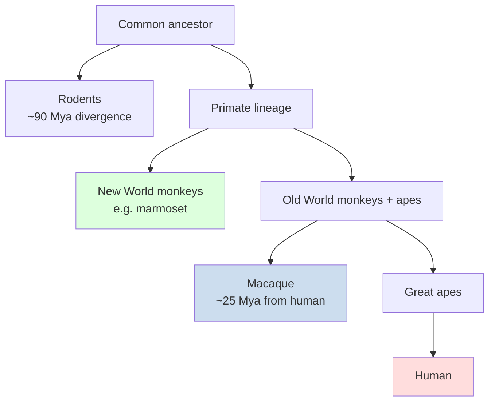
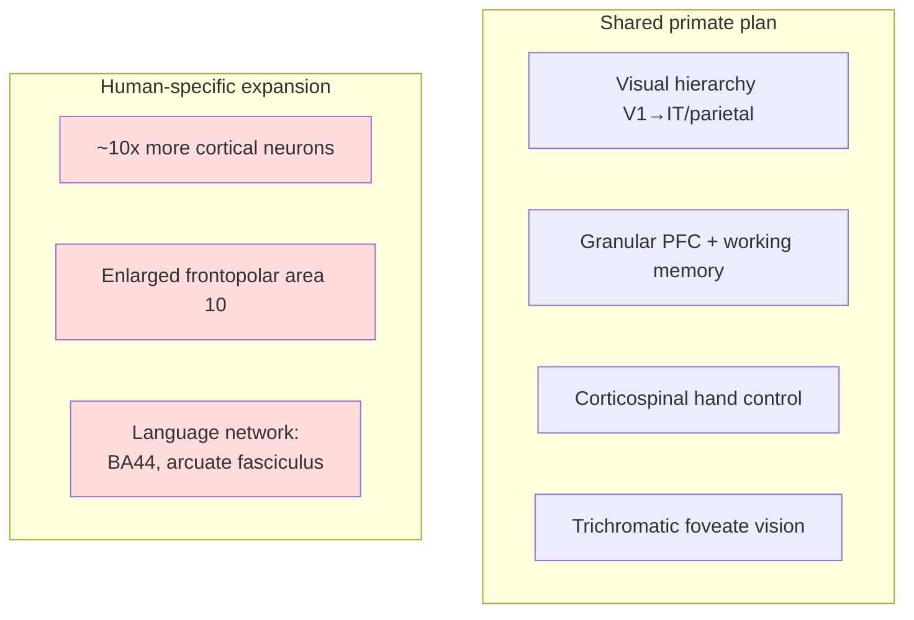

# The Macaque and Non-Human Primate Brain

*The rhesus macaque (Macaca mulatta) and its relatives are the closest experimentally tractable proxy we have for the human brain. Almost everything we know about how primate cortex computes vision, attention, memory, and decisions was first learned from a monkey holding still and looking at a screen.*

---

## Introduction

When a neuroscientist wants to understand how the *human* brain works at the level of single cells and circuits, they face a hard constraint: you cannot lower an electrode into a healthy person's cortex to ask what one neuron is computing. For most of the twentieth and twenty-first centuries, the answer to that constraint has been the monkey. The rhesus macaque in particular has been the workhorse of systems and cognitive neuroscience, because its brain is a genuinely *primate* brain — folded, large, and organized around a hypertrophied visual system and an elaborate prefrontal cortex — in a way that no rodent brain is.

This document explains why non-human primates (NHPs) remain essential despite the rise of mouse genetics and human neuroimaging; walks through macaque neuroanatomy, especially the exquisitely mapped visual hierarchy and prefrontal cortex; recounts the landmark discoveries that primate electrophysiology made possible (Hubel and Wiesel's cortical mapping, mirror neurons, the physiology of attention and working memory, the neural basis of decisions, and brain–machine interfaces); introduces the marmoset as a fast-emerging complementary model; surveys primate cognition and social behavior; and confronts the ethical questions and scientific limitations honestly. Where interpretations are genuinely contested — as with mirror neurons or exact neuron counts — the text flags the disagreement rather than papering over it.

> **A note on scope and certainty.** Comparative neuroscience is full of numbers that get repeated with more confidence than they deserve. This document distinguishes robust, replicated findings (e.g., the ventral/dorsal stream organization) from figures that vary by method or remain disputed (e.g., total cortical neuron counts). Contested claims are marked **[Contested]**.

---

## Table of Contents

1. [Why Non-Human Primates Are Essential](#1-why-non-human-primates-are-essential)
2. [The Macaque as a Species and Model](#2-the-macaque-as-a-species-and-model)
3. [Macaque Brain Neuroanatomy](#3-macaque-brain-neuroanatomy)
4. [The Visual Cortex Hierarchy: The Best-Mapped Piece of Cortex Anywhere](#4-the-visual-cortex-hierarchy)
5. [Prefrontal Cortex and Cognitive Control](#5-prefrontal-cortex-and-cognitive-control)
6. [Landmark Discoveries in Primate Neuroscience](#6-landmark-discoveries-in-primate-neuroscience)
7. [Brain–Machine Interfaces](#7-brainmachine-interfaces)
8. [The Marmoset: An Emerging Model](#8-the-marmoset-an-emerging-model)
9. [Cognition and Social Behavior](#9-cognition-and-social-behavior)
10. [Ethical Considerations](#10-ethical-considerations)
11. [How Close Is the Macaque to the Human Brain?](#11-how-close-is-the-macaque-to-the-human-brain)
12. [Limitations of the Model](#12-limitations-of-the-model)
13. [Summary](#13-summary)
14. [Sources](#sources)

---

## 1. Why Non-Human Primates Are Essential

Rodents are cheap, genetically manipulable, and abundant, and they have taught us enormous amounts about synapses, plasticity, and subcortical circuits. But the mouse brain is not a small primate brain — it is a different architecture. Several features make Old World monkeys uniquely suited to modeling the human brain:

**A gyrencephalic cortex.** The macaque cortex is *folded* (gyrencephalic), with sulci and gyri that broadly correspond to human ones. Folding is not cosmetic: it changes the biophysics of how current spreads during electrical or magnetic stimulation, how imaging signals mix across banks of a sulcus, and how columns and areas pack together. Mouse cortex is smooth (lissencephalic), so it cannot model these geometric realities of stimulating or imaging a human brain.

**A hypertrophied, primate-style visual system.** Primates are visual animals. The macaque devotes a large fraction of its cortex to vision, organized into a hierarchy of ~30+ areas that has direct homologues in humans (V1, V2, V4, MT/V5, inferotemporal cortex, and the parietal areas). Rodents have visual cortex, but nothing approaching this elaboration, and they lack a true fovea and the trichromatic color vision macaques share with us.

**Homologous motor systems.** Macaques and humans share a direct corticospinal projection onto spinal motor neurons that supports fine, fractionated finger movements — the substrate of dexterous hand use. This monosynaptic corticomotoneuronal connection is far weaker or absent in rodents and cats, making primates the only practical model for hand-control prosthetics and for many motor-recovery-after-stroke questions.

**A genuinely homologous prefrontal cortex.** Macaques possess a granular, well-differentiated prefrontal cortex with areas that map — with caveats — onto human dorsolateral, orbital, and cingulate prefrontal regions. Whether rodents even *have* a homologue of dorsolateral prefrontal cortex is genuinely disputed; whatever "prefrontal" rodent cortex exists is agranular and functionally different. For working memory, executive control, and abstract rule use, the macaque is often the *only* animal model with the relevant hardware.

**Close phylogeny and long life.** Macaques share roughly 93% of their genome with humans (frequently rounded to "~95%"), diverging from the human lineage on the order of ~25 million years ago. They live 25–40 years, permitting studies of aging, development, and chronic disease on time-courses closer to ours.



The practical upshot: for questions about cortical computation, primate cognition, and translational work aimed at the human brain, the macaque sits at a sweet spot of similarity-to-humans versus experimental tractability that neither rodents nor (for obvious reasons) humans can occupy.

---

## 2. The Macaque as a Species and Model

The genus *Macaca* contains around 20+ species, but the **rhesus macaque (*Macaca mulatta*)** dominates laboratory neuroscience, followed by the **long-tailed / cynomolgus macaque (*M. fascicularis*)** and the **Japanese macaque (*M. fuscata*)**. Rhesus macaques are Old World monkeys native to South, Central, and Southeast Asia, weighing roughly 5–8 kg (males larger than females), highly adaptable, and — importantly for research — behaviorally robust and trainable on demanding cognitive tasks over months.

Their attractiveness as models comes from a convergence of features: a large, folded, human-like brain; trichromatic foveate vision; a dexterous hand with an opposable thumb; a complex despotic social structure; and a deep base of prior anatomical and physiological knowledge (a "reference genome" of accumulated maps and atlases that makes each new experiment interpretable). The rhesus macaque was also, famously, the species in which the **Rh (rhesus) blood factor** was discovered, and it has served biomedicine well beyond neuroscience (polio vaccine development, reproductive biology, infectious disease).

---

## 3. Macaque Brain Neuroanatomy

The rhesus macaque brain weighs roughly **90–100 grams** — about 1/15th the mass of a ~1,350 g human brain — yet is organized on the same primate plan. Estimates of its total cortical neuron number vary substantially by method.

> **[Contested] Neuron counts.** Different techniques give different answers. Isotropic-fractionator work (Herculano-Houzel and colleagues) placed the rhesus cortex on the order of ~1.3–1.7 billion neurons within a whole-brain total often cited near ~6 billion, versus ~16 billion cortical (~86 billion whole-brain) neurons in humans. Some stereological studies and critics argue specific published figures are too high or too low for the measured cortical volume. The safe statement: the macaque cortex has on the order of *one to two billion* neurons — roughly an order of magnitude fewer than the human cortex — and, notably, packs them at *higher* density (~40,000 neurons/mm³ in macaque vs ~25,000–30,000/mm³ in human and gorilla cortex). Human brains are not denser; they are bigger, so scaling — not local packing — is a large part of the human advantage.

### 3.1 Gross organization

| Feature | Macaque | Human | Comment |
|---|---|---|---|
| Brain mass | ~90–100 g | ~1,300–1,400 g | ~14–15× larger in human |
| Cortex | Gyrencephalic | Gyrencephalic | Human far more folded/expanded |
| Cortical neurons | ~1–2 billion **[Contested]** | ~16 billion | ~10× more in human |
| Neuronal density | ~40,000/mm³ | ~25,000–30,000/mm³ | Denser in macaque |
| Visual cortex | ~30+ mapped areas | Homologous set | Best-mapped in macaque |
| Lifespan | ~25–40 yr | ~70–80 yr | Enables aging studies |
| Genome similarity | — | ~93% shared | Diverged ~25 Mya |

Major landmarks match human anatomy: a central sulcus dividing frontal (motor) from parietal (somatosensory) cortex; a lunate sulcus at the caudal pole overlying primary visual cortex; a superior temporal sulcus (STS) whose banks are packed with visual, multisensory, and social-processing areas; and an intraparietal sulcus (IPS) housing the parietal reach/saccade/attention areas. Subcortically, the macaque has the familiar thalamus (with a well-studied lateral geniculate nucleus, LGN, relaying retina to V1), basal ganglia, hippocampus, amygdala, and a laminated cerebellum.

### 3.2 Cytoarchitecture and the Brodmann tradition

The macaque cortex is parcellated using the same cytoarchitectonic logic Brodmann applied to humans, and indeed much of Brodmann's comparative framework rests on monkey material. Motor cortex (area 4) is agranular with giant Betz-like pyramidal cells; primary visual cortex (area 17 / V1) is strikingly granular with a thick, visible **stria of Gennari**; prefrontal areas 9, 46, 10, 11/12, and 13 are granular association cortex. Modern maps (e.g., cytoarchitectonic and receptor-density atlases of the frontal lobe) refine these boundaries and increasingly align them to connectivity fingerprints derived from tracing and diffusion imaging.

---

## 4. The Visual Cortex Hierarchy

The single greatest achievement of macaque neuroscience is the mapping of the visual system. No other piece of cortex, in any species, is understood in comparable structural and functional detail. The canonical synthesis is **Felleman and Van Essen's 1991** wiring diagram, which arranged ~30+ visual areas into a hierarchy based on the *laminar pattern* of their interconnections — feedforward projections originate in superficial layers and terminate in layer 4; feedback projections originate outside layer 4 and avoid it. From these rules a partial ordering of cortical areas emerges.

### 4.1 The ascending hierarchy

Signals enter cortex at **V1** (primary visual cortex, striate cortex), which the LGN feeds retinotopically. V1 projects onward to **V2**, and from there information fans out to **V3, V4, V6, and MT/V5**. Two broad processing streams then separate:

- **Ventral stream ("what"):** V1 → V2 → V4 → posterior inferotemporal (TEO) → anterior inferotemporal (TE). This pathway builds increasingly complex, position- and size-tolerant representations culminating in **inferotemporal (IT) cortex**, where single neurons respond selectively to objects, shapes, and — famously — faces. IT is the biological system that modern deep convolutional networks for object recognition were, in part, benchmarked against.
- **Dorsal stream ("where"/"how"):** V1 → V2/V3 → **MT (middle temporal area, V5)** → MST → parietal areas (LIP, VIP, MIP, AIP) in and around the intraparietal sulcus. This pathway represents motion, depth, spatial relationships, and the visual guidance of action (eye movements, reaching, grasping).

```mermaid
graph LR
    R[Retina] --> LGN[LGN thalamus]
    LGN --> V1
    V1 --> V2
    V2 --> V4
    V2 --> V3
    V1 --> MT
    V2 --> MT
    V4 --> TEO --> TE[IT / TE<br/>objects, faces]
    MT --> MST --> LIP[Parietal:<br/>LIP, VIP, AIP]
    subgraph Ventral stream — WHAT
        V4
        TEO
        TE
    end
    subgraph Dorsal stream — WHERE/HOW
        MT
        MST
        LIP
    end
    style TE fill:#fdd
    style LIP fill:#cde
```

The two-streams framework was articulated by **Ungerleider and Mishkin** (1982, the "what/where" formulation) and refined by **Goodale and Milner** (the "what/how" or vision-for-perception versus vision-for-action reframing). It remains one of the most influential organizing ideas in all of neuroscience — and, like any big idea, it is a simplification: the streams are richly cross-connected, not isolated pipes.

### 4.2 Feature areas and what they taught us

| Area | Stream | Signature response property |
|---|---|---|
| V1 | Input | Oriented edges, spatial frequency, ocular dominance, first color/motion signals |
| V2 | Both | Contours, illusory borders, texture, disparity |
| V4 | Ventral | Color, curvature, intermediate shape features, attention modulation |
| MT/V5 | Dorsal | Direction and speed of motion; disparity (depth) |
| MST | Dorsal | Optic flow, self-motion, smooth-pursuit eye movements |
| IT (TEO/TE) | Ventral | Whole objects, faces (face patches), view/size tolerance |
| LIP | Dorsal | Saccade target selection, spatial attention, evidence accumulation |

**MT** deserves special mention: it is nearly a "motion module," with a high concentration of direction-selective neurons organized into a columnar map of motion direction. This clean organization made MT the ideal place to test whether the firing of specific neurons *causes* perception — which leads directly to the decision-making work below.

---

## 5. Prefrontal Cortex and Cognitive Control

If the back of the macaque brain gave us vision, the front gave us a physiology of *thought*. The macaque **dorsolateral prefrontal cortex (dlPFC)**, especially **area 46** in and around the principal sulcus, is the tissue in which the cellular basis of working memory was discovered.

### 5.1 Goldman-Rakic and persistent activity

**Patricia Goldman-Rakic** and colleagues, from the 1970s through the 1990s, used the **oculomotor delayed-response task**: a monkey fixates, a target flashes briefly at one location, then disappears, and after a delay of several seconds the monkey must saccade to the remembered location. Recording in area 46 during the delay — when the cue is gone and no movement is yet allowed — they found neurons that fired *persistently* throughout the delay, and did so in a **spatially tuned** way: a given "delay cell" fired for its preferred remembered direction and fell silent for others. This persistent, stimulus-absent, content-specific activity is widely regarded as the cellular substrate of spatial working memory — an internal representation held "online."

Goldman-Rakic's group went further and showed the chemistry mattered: local injection of **D1 dopamine receptor antagonists** into dlPFC produced spatially specific, dose-dependent working-memory errors, and delay activity depends on an *optimal* level of D1 stimulation — an **inverted-U**, where too little or too much dopamine degrades the memory field. This linked a cognitive function to a molecule and a receptor, with direct implications for schizophrenia, ADHD, and age-related cognitive decline.

> **[Contested] Persistent activity vs. dynamic codes.** The classic "sustained firing = working memory" picture has been challenged. Some argue working memory can be maintained in "activity-silent" states (short-term synaptic changes) or in dynamic, time-varying population trajectories rather than steady persistent firing. The debate is active; persistent activity is real and important, but it is probably not the whole story.

### 5.2 The broader prefrontal picture

Beyond spatial working memory, macaque prefrontal cortex has been central to studies of abstract rule representation (neurons that encode a task rule rather than a stimulus), category learning, cognitive control, and the mixing of many task variables in single-neuron activity ("mixed selectivity," which gives PFC populations the dimensionality to support flexible behavior). Orbitofrontal and ventromedial areas encode reward value and drive economic choice, and anterior cingulate cortex tracks effort, errors, and the value of switching.

---

## 6. Landmark Discoveries in Primate Neuroscience

### 6.1 Hubel and Wiesel: from cat to monkey

**David Hubel and Torsten Wiesel** (Nobel Prize, 1981) are best known for their cat V1 recordings, but much of the mature theory of cortical vision — orientation columns, the pinwheel arrangement of orientation preference, and especially **ocular dominance columns** revealed by transneuronal tracing and deoxyglucose autoradiography — was worked out in the **macaque**. They also defined the critical period for visual development through monocular deprivation experiments in monkeys and kittens, establishing that cortical wiring is shaped by early experience. The macaque's human-like V1 made these findings directly relevant to human amblyopia and developmental vision.

### 6.2 Mirror neurons

In the early 1990s, **Giacomo Rizzolatti's** group at Parma recorded from ventral premotor **area F5** in macaques and found neurons that discharged both when the monkey *performed* a goal-directed hand action (grasping) and when it *watched* an experimenter perform the same action. They named these **mirror neurons**; similar cells were later reported in the inferior parietal lobule (area PF/PFG), forming a parieto-frontal mirror circuit. The finding was electrifying because it seemed to offer a direct neural mechanism for understanding others' actions, imitation, empathy, and even language evolution.

> **[Contested] What mirror neurons mean.** The *existence* of neurons with mirror properties in macaque F5 is not in serious dispute. The **interpretation is heavily contested.** Critics (e.g., Gregory Hickok's "Eight Problems," and Cecilia Heyes's associative-learning account) argue that:
> - Mirror activity may reflect **sensorimotor association learning** rather than an innate "action understanding" module.
> - Action *understanding* is dissociable from the motor system — patients with motor deficits can still understand actions.
> - Much of the strong "empathy" and "theory of mind" story was extrapolated to humans on thin single-unit evidence (direct single-neuron recordings of human mirror cells are rare and limited).
> - Some macaque F5 mirror neurons are corticospinal and may function in *suppressing* imitation rather than enabling understanding.
>
> Rizzolatti and Sinigaglia have responded (2010) distinguishing defensible from over-reaching claims. The current consensus is roughly: mirror-type neurons are real and contribute a *motor-resonance* component to social cognition, but they are one part of a distributed system (insula, superior temporal sulcus, prefrontal cortex) — not the singular seat of empathy or "the neuron that shaped civilization." Treat sweeping mirror-neuron claims with caution.

### 6.3 Attention

Macaque single-unit work established that **attention is not a metaphor but a measurable change in neuronal firing.** Directing a monkey's covert attention to a stimulus inside a V4 or MT neuron's receptive field increases that neuron's firing rate, sharpens its selectivity, and reduces noise correlations across the population — as if attention "turns up the gain" on the relevant sensory channel. The frontal eye field (FEF) and LIP were shown to be sources of the top-down signals that bias sensory cortex, grounding cognitive theories of attention in circuit physiology.

### 6.4 Perceptual decision-making: Newsome, Shadlen, and MT/LIP

**William Newsome, Michael Shadlen, and colleagues** turned the clean motion representation in MT into a platform for studying *decisions*. Using the **random-dot motion task** — a cloud of dots, some fraction moving coherently left or right, the rest randomly — they could dial task difficulty continuously and relate a monkey's choices to neural activity.

Two results became foundational:
1. **MT causes perception.** **Microstimulating** a column of direction-selective MT neurons biased the monkey's motion judgments toward that column's preferred direction — direct causal evidence that the activity of a small pool of sensory neurons *determines* perceptual choice.
2. **LIP accumulates evidence.** In area LIP, neurons ramped their firing up or down during the decision at a rate set by motion strength, reaching a threshold ("bound") just before the monkey committed to a saccade. This matched **drift-diffusion / bounded-accumulation** models from mathematical psychology, and microstimulation of LIP shifted choices and reaction times as those models predict. The work gave the abstract idea of "accumulating evidence to a threshold" a cellular address.

This program is one of the cleanest examples in neuroscience of linking single neurons → population dynamics → a computational model → behavior, and it was only possible in an animal that could be trained to report a percept over tens of thousands of trials.

---

## 7. Brain–Machine Interfaces

Macaques are the proving ground for **brain–machine interfaces (BMIs)** — because they have the human-like motor cortex and dexterous hands, and because they can be trained to attempt naturalistic reaching and grasping while arrays record from motor cortex.

Key strands:
- **Population vector and neural decoding.** Building on **Apostolos Georgopoulos's** finding that motor-cortex neurons are broadly tuned to movement *direction* (a "population vector" of many neurons codes the reach), researchers learned to *decode* intended movement from recorded populations.
- **Real-time cortical control.** **Miguel Nicolelis** (Duke) recorded from many neurons across frontal and parietal areas and had macaques control robotic arms; his work emphasized distributed, multi-area sampling and later bidirectional "brain–machine–brain" interfaces that fed artificial touch back into cortex.
- **Dexterous prosthetics.** **Andrew Schwartz** (Pittsburgh) demonstrated macaques using motor-cortex activity to control a robotic arm to reach, grasp, and self-feed — a landmark toward clinical anthropomorphic prosthetics.
- **Translation to humans.** This macaque foundation fed directly into **BrainGate** (John Donoghue, Leigh Hochberg and colleagues), in which people with tetraplegia used intracortical arrays to move cursors and robotic arms. The animal-to-human pipeline here is unusually direct and is one of the clearest translational payoffs of primate neuroscience.

---

## 8. The Marmoset: An Emerging Model

The **common marmoset (*Callithrix jacchus*)**, a small New World monkey (~300–450 g), is rapidly becoming a complementary primate model — not a replacement for the macaque but a different set of trade-offs.

**Why marmosets are attractive:**
- **Genetic tractability.** Short gestation (~140 days), frequent twin births, sexual maturity by ~15–18 months, and a sequenced genome make it feasible to establish **transgenic lines** — including the first germline-transmitting transgenic primates. This brings some of the molecular toolbox of mouse genetics into a primate.
- **A lissencephalic (smooth) cortex.** The marmoset cortex is nearly unfolded, so cortical areas sit exposed on the surface rather than buried in sulci. This is a huge practical advantage for **two-photon imaging, wide-field optical recording, and area-by-area manipulation**, which are extremely difficult in the folded macaque brain.
- **Rich social vocal behavior.** Marmosets are cooperative breeders that engage in **antiphonal vocal turn-taking** ("conversational" calling), making them a compelling model for the neuroscience of vocal communication and prosociality.
- **Small size and 3Rs benefits.** Lower housing cost and smaller drug/reagent quantities.

**The trade-off:** The very feature that helps imaging — a smooth cortex — makes marmosets a *worse* model of human cortical folding, and their brain and prefrontal cortex are smaller and less differentiated than the macaque's. They also have a shallower base of prior anatomical and behavioral data (though this is growing fast, e.g., coordinated brain-atlas and gene-atlas projects). The field increasingly treats macaque and marmoset as **complementary**: macaque for cognition and human-like cortex, marmoset for genetics, imaging, and vocal/social circuits.

| | Macaque (rhesus) | Marmoset |
|---|---|---|
| Origin | Old World | New World |
| Brain mass | ~90–100 g | ~7–8 g |
| Cortex | Gyrencephalic (folded) | Lissencephalic (smooth) |
| Genetics | Transgenics hard | Transgenic lines feasible |
| Imaging access | Sulci hide cortex | Cortex exposed — great for optics |
| Cognition/PFC | Rich, human-like | Simpler |
| Social hook | Despotic hierarchy | Cooperative breeding, vocal turn-taking |
| Best for | Cognition, vision, motor BMI | Genetics, imaging, vocal/social circuits |

---

## 9. Cognition and Social Behavior

Macaques are not simple. They live in large multi-male, multi-female groups structured by **matrilineal dominance hierarchies**, and rhesus macaques in particular are described as **despotic** — steep hierarchies, intense aggression, and formal submission signals — in contrast to more **tolerant** species like Barbary or Tonkean macaques with flatter hierarchies and more affiliative coalitions. This variation across the genus makes *Macaca* a natural laboratory for how social structure shapes the brain.

**Social cognition.** Macaques follow gaze, track others' knowledge states in some tasks, and attribute goals — components of "theory of mind," though whether they possess full human-style mental-state attribution remains debated. Comparative work finds that despotic and tolerant species can differ sharply in temperament while showing broadly *similar* theory-of-mind components, suggesting social tolerance and social cognition are somewhat dissociable.

**Neural correlates of status.** Neuroimaging in macaques has linked **social rank to brain structure**: gray-matter volume in specific circuits (including amygdala, hypothalamus, brainstem raphe, and parts of temporal and prefrontal cortex) covaries with an individual's dominance position, and connectivity within these circuits tracks social experience. Because status in male macaques depends both on winning fights *and* on forming bonds that sustain coalitions, at least one of these circuits appears tied to the social-bonding side rather than raw aggression.

**Numerical and abstract cognition.** Rhesus macaques have a robust **approximate number sense**: they discriminate and order numerosities following **Weber's law** (accuracy depends on the *ratio* between quantities), spontaneously perform approximate addition over sets, order novel numerosities, and even map number onto space — evidence that the human number-space association has deep evolutionary roots rather than being purely cultural. Parietal and prefrontal neurons that encode numerical quantity ("number neurons") have been recorded directly.

---

## 10. Ethical Considerations

Primate research carries an ethical weight that most people, including most scientists, take seriously precisely *because* macaques are so like us — the same closeness that makes them scientifically valuable makes their use morally fraught.

**The 3Rs.** Modern animal-research ethics is built on the **3Rs**, articulated by **William Russell and Rex Burch** in *The Principles of Humane Experimental Technique* (1959):
- **Replacement** — use non-animal or less-sentient alternatives where possible (cell culture, human imaging, computational models).
- **Reduction** — use the fewest animals that yield statistically valid results (in NHP work, often via extensive within-subject designs — one highly trained monkey contributing tens of thousands of trials, which is itself a reduction strategy).
- **Refinement** — minimize pain and distress and improve welfare (analgesia, positive-reinforcement training instead of restraint/deprivation, enriched social housing, better implant and headpost design).

**Regulation.** NHP research is among the most heavily regulated science. In the US it is governed by the Animal Welfare Act and PHS Policy with mandatory **IACUC** review; in Europe by **Directive 2010/63/EU** (which permits primate use only when no alternative exists and effectively bans great-ape research); and by institutional and funder oversight worldwide. Applying the 3Rs to NHPs raises specific tensions — e.g., reduction (fewer animals) can conflict with refinement or with statistical validity, and truly *replacing* primates for questions about primate-specific cortex is often not yet possible.

**The core tension.** Advocates argue that certain knowledge — the physiology of human-like cortex, dexterous BMI, some vaccine and neurological-disease work — cannot currently be obtained any other way, and that welfare can be held to a high standard. Critics argue the cognitive and emotional sophistication of macaques makes captivity and invasive procedures ethically unacceptable, and that alternatives are underfunded. Serious practitioners hold both: that the work has produced real human benefit, *and* that it demands continuous justification, minimization, and investment in replacement.

---

## 11. How Close Is the Macaque to the Human Brain?

**What is strongly conserved:**
- Overall cortical plan and lamination; a gyrencephalic, expanded cortex.
- The visual hierarchy — homologous V1, V2, V4, MT, IT, and parietal areas, with the same ventral/dorsal organization.
- A granular, differentiated prefrontal cortex supporting working memory and cognitive control.
- A direct corticospinal system for fine hand control.
- Trichromatic foveate vision, oculomotor control, and much of the subcortical machinery (basal ganglia, thalamus, hippocampus, amygdala).

**What differs — the human-specific expansions:**
- **Sheer scale.** The human cortex has ~10× more neurons and is far more folded and expanded, especially in association cortex.
- **Prefrontal and temporo-parietal expansion.** Frontopolar cortex (area 10) and lateral temporo-parietal association regions are disproportionately enlarged in humans; connectivity fingerprinting finds only partial macaque homologues, and some human prefrontal-opercular regions appear to lack a clear macaque counterpart.
- **Language circuitry.** Humans have a specialized left-lateralized language network (a hypertrophied BA44/Broca's area, a strongly developed arcuate fasciculus linking frontal and temporal cortex). Macaques process simple sequential structures but recruit different, less specialized circuits and cannot handle the hierarchical syntax humans do; the arcuate fasciculus is comparatively rudimentary.



The fair summary: the macaque is an excellent model of the *primate* brain and a very good model of most of the *human* brain's basic circuitry — and a poor model of the specific things that make humans human, above all language.

---

## 12. Limitations of the Model

1. **Not human.** The differences in section 11 are not trivial for translation. Drugs, disease mechanisms, and especially higher cognition (language, complex culture) may not transfer, and many CNS therapeutics that worked in monkeys have failed in human trials.
2. **Small sample sizes.** NHP electrophysiology typically uses very few animals (often 2–4 per study), raising concerns about generalizability and individual variability; cytoarchitectonic and connectional maps have historically rested on small n.
3. **Genetic intractability (macaque).** Making transgenic or knockout macaques is slow and costly relative to mice; the marmoset partly addresses this but at the cost of a less human-like cortex.
4. **Cost, time, and ethics.** Studies take years, cost is high, oversight is intensive, and the ethical burden constrains what experiments are permissible — appropriately, but it does limit scope.
5. **Behavioral artificiality.** Much of what we know comes from over-trained animals doing highly stereotyped tasks (fixate, wait, saccade) for reward — a narrow slice of natural primate behavior, which may not capture how these circuits work "in the wild." Efforts toward more naturalistic and freely-moving paradigms are underway.
6. **Interpretive over-reach.** As the mirror-neuron saga shows, striking single-unit findings can be over-generalized to human psychology on limited evidence. Healthy caution is warranted whenever a monkey result is used to explain human empathy, morality, or language.

---

## 13. Summary

The rhesus macaque earned its place as the premier model of the human-like brain by combining a genuinely primate architecture — folded cortex, a hypertrophied and homologous visual system, dexterous hands with direct corticospinal control, and a differentiated prefrontal cortex — with the tractability to record single neurons during sophisticated behavior. From this platform came the mapped visual hierarchy and the ventral/dorsal streams, the cellular basis of working memory and its dopaminergic tuning, the physiology of attention, the causal and computational account of perceptual decisions, and the brain–machine interfaces now reaching human patients. The marmoset is opening a complementary front with genetics and optical access, at the cost of a less human-like cortex. Throughout, two disciplines of thought are essential: **flagging what is contested** (neuron counts, the meaning of mirror neurons, whether persistent activity is the whole story of working memory) and **holding the ethics seriously** — the very kinship that makes these animals scientifically indispensable is what makes their use a genuine moral question. The macaque is the closest window we have onto the human brain; it is a window, not a mirror.

---

## Sources

- [Why non-human primates are needed for brain-stimulation and neuroscience research (arXiv review)](https://arxiv.org/pdf/2104.11844)
- [Non-human primate models to explore adaptive mechanisms after stroke (Frontiers in Systems Neuroscience)](https://www.frontiersin.org/journals/systems-neuroscience/articles/10.3389/fnsys.2021.760311/full)
- [Prefrontal cortex: from monkey to man (Brain, Oxford Academic)](https://academic.oup.com/brain/article/147/3/794/7424860)
- [Brain volumetrics across the lifespan of the rhesus macaque (PMC)](https://pmc.ncbi.nlm.nih.gov/articles/PMC10106431/)
- [Brain charts for the rhesus macaque lifespan (bioRxiv)](https://www.biorxiv.org/content/10.1101/2024.08.28.610193.full.pdf)
- [A single-cell multi-omic atlas of the adult rhesus macaque brain (Science Advances)](https://www.science.org/doi/10.1126/sciadv.adh1914)
- [Felleman & Van Essen tradition — Organization of visual areas in macaque and human cerebral cortex (Van Essen, PDF)](https://www.cns.nyu.edu/csh/csh04/Articles/Vanessen-03.pdf)
- [Anatomy of hierarchy: feedforward and feedback pathways in macaque visual cortex (PubMed)](https://pubmed.ncbi.nlm.nih.gov/23983048/)
- [Anatomy and physiology of macaque visual areas V1, V2, and V5/MT (Cerebral Cortex)](https://academic.oup.com/cercor/article/30/6/3483/5691251)
- [Corticocortical and thalamocortical information flow in the primate visual system (ScienceDirect)](https://www.sciencedirect.com/science/article/abs/pii/S0079612305490135)
- [D1 dopamine receptors in prefrontal cortex: involvement in working memory (Science)](https://www.science.org/doi/10.1126/science.1825731)
- [Functions of delay-period activity in the prefrontal cortex revisited (Frontiers in Systems Neuroscience)](https://www.frontiersin.org/journals/systems-neuroscience/articles/10.3389/fnsys.2015.00002/full)
- [Patricia Goldman-Rakic, 1937–2003 (Neuropsychopharmacology obituary)](https://www.nature.com/articles/1300325)
- [Dopamine's actions in primate prefrontal cortex: challenges for treating cognitive disorders (PMC)](https://pmc.ncbi.nlm.nih.gov/articles/PMC4485014/)
- [A dopamine gradient controls access to distributed working memory in the monkey cortex (Neuron)](https://www.cell.com/neuron/fulltext/S0896-6273(21)00621-8)
- [Rizzolatti & Sinigaglia — The functional role of the parieto-frontal mirror circuit: interpretations and misinterpretations (Nature Reviews Neuroscience)](https://www.researchgate.net/publication/41849536_Rizzolatti_G_Sinigaglia_C_The_functional_role_of_the_parieto-frontal_mirror_circuit_interpretations_and_misinterpretations_Nature_Rev_Neurosci_11_264-274)
- [Hickok — Eight problems for the mirror neuron theory of action understanding (PMC)](https://pmc.ncbi.nlm.nih.gov/articles/PMC2773693/)
- [Heyes — (Mis)understanding mirror neurons (Current Biology)](https://www.cell.com/current-biology/fulltext/S0960-9822(10)00650-0)
- [Corticospinal neurons in macaque ventral premotor cortex with mirror properties (PMC)](https://www.ncbi.nlm.nih.gov/pmc/articles/PMC2862290/)
- [Non-shared coding of observed and executed actions in macaque ventral premotor mirror neurons (eLife)](https://elifesciences.org/articles/77513)
- [Microstimulation of macaque area LIP affects decision-making in a motion discrimination task (Nature Neuroscience)](https://www.nature.com/articles/nn1683)
- [Neural activity in macaque parietal cortex reflects temporal integration of motion during perceptual decisions (Journal of Neuroscience)](https://www.jneurosci.org/content/25/45/10420)
- [Brain–machine interface review (PNAS)](https://www.pnas.org/doi/10.1073/pnas.1319310110)
- [Learning to control a brain–machine interface for reaching and grasping by primates (PLOS Biology)](https://journals.plos.org/plosbiology/article?id=10.1371%2Fjournal.pbio.0000042)
- [Active tactile exploration using a brain–machine–brain interface (Nature)](https://www.nature.com/articles/nature10489)
- [Marmosets: a neuroscientific model of human social behavior (Neuron)](https://www.cell.com/neuron/fulltext/S0896-6273(16)30007-1)
- [Marmosets as a neuroscientific model of human social behavior (PMC)](https://pmc.ncbi.nlm.nih.gov/articles/PMC4840471/)
- [Neuroscience research using non-human primate models and genome editing (Springer)](https://link.springer.com/chapter/10.1007/978-3-319-60192-2_7)
- [Marmoset Coordinating Center — learn resources (OHSU)](https://mcc.ohsu.edu/learn.html)
- [A neural circuit covarying with social hierarchy in macaques (PLOS Biology)](https://journals.plos.org/plosbiology/article?id=10.1371%2Fjournal.pbio.1001940)
- [Development of social systems neuroscience using macaques (PMC)](https://pmc.ncbi.nlm.nih.gov/articles/PMC6117490/)
- [Tolerant and despotic macaques show divergent temperament but similar theory of mind (Phil. Trans. R. Soc. B)](https://royalsocietypublishing.org/rstb/article/380/1929/20240121/234942/Tolerant-and-despotic-macaques-show-divergent)
- [Weber's law influences numerical representations in rhesus macaques (Animal Cognition)](https://link.springer.com/article/10.1007/s10071-006-0017-8)
- [Rhesus monkeys map number onto space (PMC)](https://pmc.ncbi.nlm.nih.gov/articles/PMC4031030/)
- [Number sense in animals (Wikipedia overview)](https://en.wikipedia.org/wiki/Number_sense_in_animals)
- [The human brain in numbers: a linearly scaled-up primate brain (Herculano-Houzel, PMC)](https://pmc.ncbi.nlm.nih.gov/articles/PMC2776484/)
- [Neuron densities vary across and within cortical areas in primates (PNAS)](https://www.pnas.org/doi/10.1073/pnas.1010356107)
- [Neuronal factors determining high intelligence (Phil. Trans. R. Soc. B)](https://royalsocietypublishing.org/rstb/article/371/1685/20150180/22710/Neuronal-factors-determining-high)
- [Morphological evolution of language-relevant brain areas (PLOS Biology)](https://journals.plos.org/plosbiology/article?id=10.1371%2Fjournal.pbio.3002266)
- [Cytoarchitectonic, receptor distribution and functional connectivity analyses of the macaque frontal lobe (eLife)](https://elifesciences.org/articles/82850)
- [The prefrontal operculum, a human-specific hub for cognitive control of speech (Communications Biology)](https://www.nature.com/articles/s42003-025-09110-8)
- [Applying the 3Rs to non-human primate research: barriers and solutions (PMC)](https://www.ncbi.nlm.nih.gov/pmc/articles/PMC7610428/)
- [Toward a common interpretation of the 3Rs principles in animal research (Lab Animal / Nature)](https://www.nature.com/articles/s41684-024-01476-2)
- [Ethical animal research — the 3Rs as guiding principles (American Physiological Society)](https://www.physiology.org/career/policy-advocacy/policy-statements/ethical-animal-research--the-3rs-as-guiding-principles)
