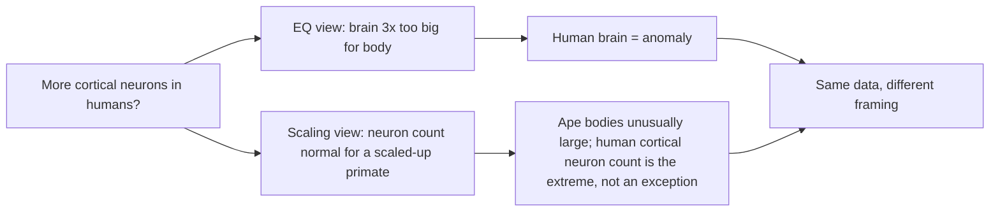
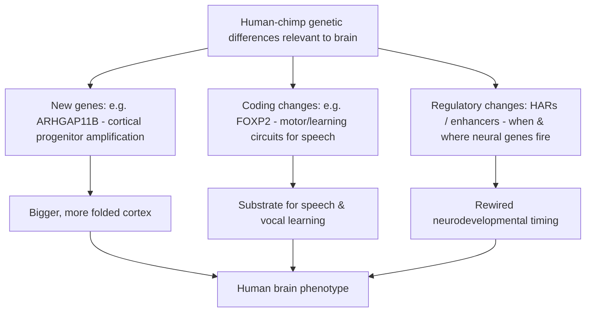

# The Great Ape Brain & Cognition

*Chimpanzees, bonobos, gorillas, and orangutans — and the mirror they hold up to the human mind*

---

## Introduction

No other animals sit as close to us on the tree of life as the great apes. The African apes — the common chimpanzee (*Pan troglodytes*), the bonobo (*Pan paniscus*), and the gorilla (*Gorilla* spp.) — together with the Asian orangutans (*Pongo* spp.) form the family Hominidae alongside humans. We share a last common ancestor with chimpanzees and bonobos roughly 6–7 million years ago, with gorillas around 8–9 million years ago, and with orangutans around 13–16 million years ago. Chimpanzees and bonobos themselves split only about 1–2 million years ago. At the level of DNA, humans and chimpanzees are nearly 99% identical across aligned protein-coding sequence.

This closeness is exactly what makes the great apes so valuable — and so easy to misread. Because they are so like us, every cognitive difference between an ape and a human is a candidate clue to what changed in the hominin lineage. And because they are so like us, we are perpetually tempted to over-read their behavior, to hear grammar in a gesture or a moral sense in a shared banana. The honest comparative story is a mixture of genuine, well-replicated continuity (tool cultures, self-recognition, cooperation, some forms of social prediction) and genuinely contested or overturned claims (ape "language," full-blown theory of mind, "photographic" memory superiority). This document tries to keep those two piles separate.

A note on tone: many of the most famous ape findings are single-subject anecdotes or small-sample studies that later failed to replicate or were reinterpreted. Where a claim is contested, this document says so explicitly rather than presenting the charismatic version as settled fact.

---

## Table of Contents

1. [The great apes at a glance](#1-the-great-apes-at-a-glance)
2. [Brain size, scaling, and encephalization](#2-brain-size-scaling-and-encephalization)
3. [Structural differences: cortex, prefrontal areas, and connectivity](#3-structural-differences-cortex-prefrontal-areas-and-connectivity)
4. [Von Economo neurons](#4-von-economo-neurons)
5. [What the comparison reveals about human brain evolution](#5-what-the-comparison-reveals-about-human-brain-evolution)
6. [Cognition and behavior](#6-cognition-and-behavior)
7. [The ape language studies and their controversies](#7-the-ape-language-studies-and-their-controversies)
8. [Self-awareness and the mirror test](#8-self-awareness-and-the-mirror-test)
9. [The genetics of brain differences](#9-the-genetics-of-brain-differences)
10. [Constraints on studying apes](#10-constraints-on-studying-apes)
11. [What apes tell us about what is — and isn't — uniquely human](#11-what-apes-tell-us-about-what-is--and-isnt--uniquely-human)
12. [Sources](#sources)

---

## 1. The great apes at a glance

| Species | Approx. body mass (M/F) | Brain (cranial cap.) | Divergence from human lineage | Social system |
|---|---|---|---|---|
| Chimpanzee (*Pan troglodytes*) | ~40–60 / ~30–45 kg | ~275–500 cm³ | ~6–7 Mya | Fission–fusion, male-bonded, hierarchical |
| Bonobo (*Pan paniscus*) | ~39 / ~31 kg | ~275–400 cm³ | ~6–7 Mya (bonobo/chimp split ~1–2 Mya) | Female-centered, socially tolerant |
| Gorilla (*Gorilla gorilla/beringei*) | ~160–200 / ~70–100 kg | ~340–750 cm³ | ~8–9 Mya | Harem groups, single dominant silverback |
| Orangutan (*Pongo* spp.) | ~75–90 / ~35–50 kg | ~275–500 cm³ | ~13–16 Mya | Semi-solitary, dispersed |
| Human (*Homo sapiens*) | ~70–80 / ~55–65 kg | ~1,300–1,500 cm³ (avg ~1,473) | — | Large-scale cooperative, symbolic |

The great apes are not a uniform group. Their social systems differ radically — the tense male politics of chimpanzees, the sex-and-tolerance social glue of bonobos, the polygynous simplicity of gorillas, the near-solitude of orangutans. That variation is itself a resource: it lets researchers ask which cognitive traits track social complexity rather than brain size alone.

---

## 2. Brain size, scaling, and encephalization

### Absolute size

In absolute terms the gap is large. Human brains average roughly 1,300–1,500 cm³ (about 1,300–1,400 g), while great ape brains cluster in the 300–500 cm³ range, with large gorillas reaching into the 600–750 cm³ zone. Even a big male gorilla — an animal heavier than any human — carries a brain roughly a third the size of ours.

### Encephalization quotient (EQ)

Absolute size is a poor measure across species of different body mass, so researchers use the **encephalization quotient (EQ)** — brain size relative to what is expected for a mammal of that body size. Humans are the outlier of the primate order:

| Species | Approx. EQ |
|---|---|
| Human | ~7.4–7.8 |
| Chimpanzee | ~1.7–2.5 |
| Orangutan | ~1.9 |
| Gorilla | ~1.5–1.6 |

By this metric the human brain is roughly 3× larger than expected for a primate of our body size, while apes are only modestly above the generic-mammal baseline.

### The counter-narrative: neuron counts and scaling rules

The EQ story implies humans are the anomaly. Work by **Suzana Herculano-Houzel** and colleagues complicates that. Using the *isotropic fractionator* method (dissolving a brain into a "soup" and counting nuclei), her lab established that:

- The human brain contains about **86 billion neurons**, of which roughly **16 billion are in the cerebral cortex** — not the frequently repeated "100 billion."
- A chimpanzee cortex holds roughly **6–7 billion** cortical neurons. The human cortex thus has ~2.5–2.7× more.
- Crucially, the human brain has *exactly the number of neurons expected* for a primate brain scaled up to its size. We are, in her phrasing, "a linearly scaled-up primate brain."

Gorilla and orangutan brains were separately shown to obey the same primate cellular scaling rules. This reframes the puzzle: perhaps humans are not the ones with a strangely oversized brain — perhaps the great apes have unusually *large bodies* for their brains, driven by the metabolic ceiling of a raw-plant diet. On this view, the human distinctiveness is not a violation of primate scaling but the largest realized instance of it: the highest cortical neuron count of any primate, achieved (Herculano-Houzel argues) partly because cooking unlocked the calories to feed it.

The disagreement between the "EQ says we're the outlier" and "scaling says we're expected" framings is a genuine, live tension in the field, and worth holding onto rather than resolving prematurely.

---

## 3. Structural differences: cortex, prefrontal areas, and connectivity

### Is the human prefrontal cortex "disproportionately" enlarged?

This is one of the most-debated points in comparative neuroanatomy, and the answer has shifted over the decades.

- The classic textbook claim was that the human **prefrontal cortex (PFC)** is disproportionately expanded — the seat of planning, inhibition, and abstract reasoning grown beyond primate expectations.
- **Katerina Semendeferi** and colleagues challenged the strongest form of this: measuring frontal lobe volume, they found the human frontal cortex takes up about the same *proportion* of the cortex as in the great apes. The frontal lobe is bigger in absolute terms because the whole brain is bigger, not disproportionately so.
- More recent quantitative work partially rehabilitates a milder version. By some measures the proportion of cortical gray matter occupied by PFC is around **24% larger in humans than in chimpanzees** (and up to ~86% larger than in macaques). And the difference is far more dramatic in **white matter**: prefrontal white matter is roughly **71% larger in humans than chimpanzees** (and ~140% larger than macaques).

The emerging synthesis is subtle: the raw *area* of prefrontal cortex may not be wildly out of proportion, but its **internal organization, wiring, and connectivity** are. It is *how* the human PFC is connected, more than how big a slice of cortex it occupies, that looks derived.

### Connectivity and association cortex

Two consistent findings point away from "bigger" and toward "differently wired":

1. **Expanded multimodal association cortex.** The cortical regions that integrate across senses and support abstract cognition (parietal, temporal, and prefrontal association areas) are proportionally expanded in humans relative to primary sensory and motor cortex. Cortical myelin maps from MRI show a greater extent of lightly myelinated (association-type) cortex in humans than in chimpanzees or macaques, while heavily myelinated primary sensorimotor areas differ far less between species.

2. **Enhanced long-range integration.** Comparative connectivity work (e.g., PNAS 2019) finds an evolutionary expansion of connectivity *between* multimodal association areas in humans relative to chimpanzees — a shift toward global integration of information and greater functional specialization. The human connectome appears to invest disproportionately in region-to-region communication, which is consistent with the outsized white-matter growth.

A useful mental model: chimpanzee and human brains are built from very similar parts, but the human version rewires those parts toward more integration hubs and more association tissue, and scales up the connective infrastructure faster than the gray matter it connects.

### Bonobo vs. chimpanzee: neural correlates of temperament

The two *Pan* species diverged only ~1–2 million years ago, yet differ sharply in temperament — bonobos more socially tolerant, playful, and sexually mediated in conflict resolution; chimpanzees more aggressive and hierarchical. Comparative neuroimaging finds correlates that fit these dispositions: relative to chimpanzees, bonobos show more gray matter in circuits linked to empathy and the perception of distress (including the anterior insula and amygdala) and a larger pathway between the amygdala and the ventral anterior cingulate cortex — connectivity associated with top-down control of aggression. This is a valuable natural experiment: two closely related brains, similar in size, tuned differently for social emotion. It cautions against treating "the ape brain" as a monolith.

### Other structural notes

- **Asymmetries and language-related areas.** Chimpanzees show a leftward asymmetry in the planum temporale (an area overlapping human Wernicke's region) and in some inferior-frontal regions overlapping Broca's area homologues — meaning the *anatomical scaffolding* often associated with language predates humans, even if the function does not.
- **Prefrontal expansion is an ape trend, not a human invention.** One line of work frames the human PFC as "the extreme of a lateralized ape trend" — great apes already show exceptional prefrontal expansion relative to monkeys, and humans push it further rather than inventing it.
- **Slow, prolonged wiring.** In humans, prefrontal white matter and myelination mature unusually late (into the third decade). Chimpanzee brain development is faster; the human pattern of extended, experience-dependent maturation is thought to be an important part of how culture is absorbed during a long childhood.

---

## 4. Von Economo neurons

**Von Economo neurons (VENs)**, also called spindle cells, are large, elongated bipolar projection neurons found principally in the **anterior cingulate cortex (ACC)** and **fronto-insular cortex (FI)** — regions tied to social awareness, interoception, empathy, error monitoring, and fast intuitive social judgment.

Their comparative distribution is striking:

| Species | Approx. VEN count (order of magnitude) |
|---|---|
| Human (adult) | ~80,000+ (one count: ~82,855) |
| Gorilla | ~16,700 |
| Bonobo | ~2,200 |
| Chimpanzee | ~1,800 |
| Orangutan | present, low |
| Monkeys (macaque etc.) | essentially absent in FI/LA |

Key points and cautions:

- VENs are shared by all great apes and humans but are **far more numerous and larger in humans**. They are not a purely human invention — but they are strongly amplified in the human lineage.
- They are **not unique to hominids**: comparable spindle neurons have since been documented in cetaceans (whales, dolphins), elephants, and even some songbirds — large-brained, socially complex animals. This convergence weakens any story that treats VENs as *the* signature of human uniqueness.
- Their function remains partly inferential. The leading hypothesis is that VENs support rapid, intuitive processing of complex social and emotional information — a "fast relay" in social-cognitive networks. Their selective vulnerability in frontotemporal dementia and their involvement in conditions affecting social behavior support (but do not prove) this role.

VENs are best treated as a real, quantifiable neural difference of degree between apes and humans — suggestive of enhanced social-cognitive machinery — rather than a decisive biological boundary.

---

## 5. What the comparison reveals about human brain evolution

Putting the anatomy together, the ape–human comparison suggests that human brain evolution was **not** a single "add a bigger brain" event but a bundle of changes:

- **More neurons, especially cortical ones** — achieved by scaling up a primate brain further than any other primate, plausibly enabled by dietary/metabolic changes (cooking, meat).
- **Reorganization over pure enlargement** — expansion of association cortex, disproportionate growth of white matter, and enhanced long-range connectivity, rather than a simple across-the-board scaling.
- **Extended development.** Human brains grow more slowly and for longer, with a protracted period of postnatal plasticity and juvenile learning. Great apes also have slow life histories, but humans stretch childhood further, buying more time for cultural learning.
- **Amplification of pre-existing features.** Prefrontal expansion, hemispheric asymmetries in language-area homologues, and Von Economo neurons are all present in apes and *amplified* in humans. Very few human brain traits appear to be truly novel; most are exaggerations of ape trends.

There is also a sobering finding on the flip side of our long-lived, large brain: comparative work suggests humans are unusually **vulnerable to brain aging** relative to great apes — conditions resembling Alzheimer's-type neurodegeneration appear to be far more pronounced in humans, possibly a cost of our particular neural expansion and longevity.

---

## 6. Cognition and behavior

### Tool use and culture

Jane Goodall's 1960 observation at Gombe of a chimpanzee stripping a twig to "fish" for termites famously forced a redefinition of "man the toolmaker." Since then, ape tool use and culture have become one of the best-supported areas of great ape cognition:

- **Chimpanzees** show the richest tool repertoire of any non-human: termite-fishing probes, ant-dipping wands, leaf sponges for drinking, and stone or wooden hammers and anvils for cracking nuts. Central African chimpanzees use coordinated *tool sets* (a stout puncturing stick plus a flexible fishing probe) to raid subterranean termite nests.
- **Cultural variation** is well documented. Different communities use different techniques and materials even where ecology is similar; a landmark synthesis (Whiten et al., 1999) catalogued dozens of behavioral traditions varying between chimpanzee populations. Even neighboring communities at Gombe (Kasekela vs. Mitumba) differ measurably in the raw materials and dimensions of their termite-fishing tools.
- **Cumulative refinement.** Work in the Taï Forest suggests nut-cracking hammer selection and technique have been refined across generations — a hint (still debated in strength) of cumulative culture, long thought to be uniquely human.
- **Social transmission.** Mothers adjust their termite-fishing demonstrations when infants are watching, and have been seen transferring tools to offspring — evidence of teaching-like behavior, though whether it constitutes "teaching" in the full human sense is contested.
- **Orangutans and gorillas** also have tool traditions (orangutans use sticks to extract seeds and insects, leaves as gloves and napkins), though generally less elaborate than chimpanzees.

Tool culture is arguably the *strongest* case for cognitive continuity: it is observed in the wild, replicated across sites, and varies socially rather than genetically.

### Planning and the future

A related but distinct question is whether apes plan for future needs rather than only responding to present ones. The best-known evidence is **Santino**, a chimpanzee at Furuvik Zoo (Sweden) documented by Mathias Osvath, who calmly gathered and cached stones in the morning — sometimes manufacturing concrete projectiles — for hurling at visitors hours later, when he was agitated. Because the collecting happened in a calm state, ahead of the aroused state in which the stones were used, it was argued to show pre-planning for a future, different mental state. As with most single-subject reports, interpretations vary, but controlled experiments (e.g., apes selecting and saving a tool for a task available only later) broadly support some capacity for future-oriented action in great apes.

### Memory: Ayumu and the "photographic memory" claim

At the Kyoto University Primate Research Institute, **Tetsuro Matsuzawa** and colleagues reported that a young chimpanzee named **Ayumu** could, after seeing numerals 1–9 flashed on a touchscreen for as little as ~210 milliseconds, recall their positions and tap them in order with roughly 80% accuracy — outperforming human university students, who scored around 40% on the hardest trials. Matsuzawa framed this as evidence for a chimpanzee eidetic ("photographic") memory and a possible **cognitive trade-off**: as the human lineage gained language and symbolic understanding, it may have sacrificed some rapid whole-image visual memory.

This is a genuinely striking, replicated-within-lab result — but the strong interpretation is contested:

- **Training asymmetry.** Ayumu had extensive practice with the apparatus; the human comparison subjects generally did not. Critics argue this is not a fair like-for-like comparison of memory capacity.
- **Failure to establish human ceiling.** At least one subsequent study found that humans given comparable extensive practice can match Ayumu's performance, undermining the claim of a categorical chimpanzee superiority.

The careful conclusion: Ayumu demonstrates impressive, fast visuospatial working memory in a chimpanzee — but "chimps beat humans at memory" and the trade-off hypothesis remain unproven and should be reported with caveats, not as settled fact.

### Theory of mind

Whether apes understand that others have *minds* — beliefs, knowledge, and (crucially) *false* beliefs — is one of the longest-running debates in comparative psychology, stretching back to Premack & Woodruff's original 1978 question, "Does the chimpanzee have a theory of mind?"

What is reasonably well supported:

- Apes track what others can **see** and **know**. Chimpanzees behave differently toward a competitor depending on whether the competitor has visual access to food — strong evidence they represent others' perception and knowledge states.

What is contested:

- **False-belief understanding**, long regarded as the "litmus test" of full theory of mind, was for decades something apes failed in explicit tasks. A 2016 study (**Krupenye, Kano, Hirata, Call & Tomasello**, *Science*) used non-invasive **anticipatory eye-tracking**: chimpanzees, bonobos, and orangutans watched videos in which an actor developed a false belief about where an object was hidden, and the apes' gaze **anticipated the actor searching in the location he falsely believed** the object to be. This paralleled results from human infants.
- **The deflationary reading.** Critics note that subjects could pass such tasks using a simpler behavioral rule — "agents look for things where they last saw them" — without representing beliefs at all. The authors themselves acknowledge the interpretive difficulty. A later PNAS study suggested apes may use their *own* past experience to anticipate others' actions, further muddying whether "belief" is truly represented.

The honest state of play: apes clearly have *some* implicit machinery for predicting others' behavior based on what those others have perceived, and 2016-era eye-tracking pushed this closer to false-belief territory than anyone expected. But whether this amounts to human-style, concept-driven theory of mind — or a powerful set of behavior-reading heuristics — is genuinely unresolved.

### Natural communication: gestures in the wild

The ape-language projects asked whether apes can be *taught* a human system. A quieter, arguably more revealing line of research asks what apes communicate *naturally*. Field studies (notably by Catherine Hobaiter and Richard Byrne) have catalogued a large repertoire of intentional **gestures** used by wild chimpanzees — dozens of distinct signals deployed flexibly to achieve specific goals (initiate travel, request grooming, invite play), with the signaler monitoring whether the recipient responds and persisting or elaborating if not. Many gestures appear broadly shared across chimpanzee populations, and some overlap with bonobo and human-infant gesturing. This natural gestural communication is *intentional* and *goal-directed* — hallmarks of genuine communication — even though it lacks the open-ended, recursive productivity of human language. It is a more solid foundation for thinking about language origins than the contested sign-language projects.

### Cooperation, fairness, and prosociality

- Apes cooperate: chimpanzees recruit partners for joint tasks, coordinate in hunts, and can solve problems requiring two individuals to pull together.
- But their cooperation looks different from the human variety. In **ultimatum-game** experiments, apes tend to behave as "rational maximizers" — proposers keep most of the reward and responders accept almost any non-zero offer — rather than showing the human-like sense of fairness that rejects unfair offers. (More recent work qualifies this: when responders have leverage or alternatives, apes do extract fairer offers, so the picture is not "no fairness at all.")
- **Shared intentionality.** Michael Tomasello and colleagues argue the key human difference is not raw intelligence but *shared intentionality* — the drive and ability to form joint goals and truly collaborate, dividing spoils fairly. In their studies, collaboration prompts human children to share equally, but does not produce the same equal-sharing in chimpanzees.
- **Bonobo–chimpanzee contrast.** Bonobos are markedly more socially tolerant and spontaneously prosocial in some sharing paradigms (e.g., voluntarily transferring tools to a partner), whereas chimpanzee helping is more constrained. This within-*Pan* difference is a caution against speaking of a single "ape mind."

---

## 7. The ape language studies and their controversies

Few chapters in comparative psychology are as contested — or as revealing about the pitfalls of the field — as the mid-20th-century attempts to teach apes language.

### The projects

| Subject | Species | Researchers | Medium | Headline claim |
|---|---|---|---|---|
| Washoe | Chimpanzee | Allen & Beatrix Gardner | American Sign Language | Learned 100+ signs; combined them |
| Koko | Gorilla | Francine Patterson | Modified ASL ("GSL") | ~1,000 signs claimed |
| Nim Chimpsky | Chimpanzee | Herbert Terrace | ASL | Intended to test for grammar |
| Kanzi | Bonobo | Sue Savage-Rumbaugh | Lexigram keyboard | Spontaneous comprehension of spoken English |

**Washoe** (from the 1960s) was the first non-human to acquire a substantial vocabulary of ASL signs and reportedly combined them into short strings. **Kanzi**, a bonobo, was notable for a different reason: rather than being drilled, he apparently *acquired* lexigram symbols incidentally while researchers taught his adoptive mother, and he showed impressive comprehension of novel spoken-English requests ("put the soap on the apple").

### The Terrace critique

Herbert **Terrace** set out to demonstrate ape grammar with **Nim Chimpsky** — pointedly named after Noam Chomsky, who held language to be uniquely human. On close analysis of his own videotapes, Terrace reached the opposite conclusion:

- Nim's "sentences" did not grow in length or complexity the way children's do.
- Most of Nim's signing was **prompted by or imitated from** the teachers immediately beforehand, and strung together to get rewards, rather than being spontaneous, rule-governed combinations.
- Terrace extended the critique to the other projects, arguing that Washoe's and Koko's apparent sentences were similarly products of unconscious prompting (a "Clever Hans" effect) and generous human interpretation — trainers reading grammar into what were really cued, reward-seeking gestures.

His 1979 conclusion ("Can an ape create a sentence?" — his answer, essentially *no*) triggered a lasting and heated dispute. Defenders of the projects countered that Nim's impoverished, revolving-door training conditions were not representative, and that Kanzi's *comprehension* data in particular are hard to explain away as mere cueing.

### Where the debate stands

There is **no consensus**, but a rough center of gravity has emerged:

- **Vocabulary/reference:** Apes can learn to use arbitrary symbols to refer to objects and actions and to make requests. This is genuine and impressive.
- **Comprehension:** Kanzi's comprehension of novel spoken instructions is the strongest evidence and is not easily dismissed.
- **Syntax/grammar:** The claim that apes command **recursive, generative syntax** — the productive, hierarchical combination that characterizes human language — is not well supported. Methodological problems (unrecorded sign order, prompting, over-interpretation, tiny samples, single subjects) plague the strongest grammatical claims.

The enduring lesson of the ape-language era is as much about *scientific method* — the dangers of experimenter cueing, anecdote, and wishful interpretation with beloved single subjects — as it is about apes.

---

## 8. Self-awareness and the mirror test

In 1970, **Gordon Gallup Jr.** introduced the **mark test**: anesthetize the animal, place an odorless mark somewhere it can only see in a mirror, and observe whether, on waking and seeing its reflection, it touches the mark on *its own body*. Doing so is taken as evidence of **mirror self-recognition (MSR)** — a proxy (contested) for some form of self-awareness.

Results:

- **Chimpanzees and orangutans** reliably pass, though not universally: MSR appears in roughly three-quarters of young-adult chimpanzees, dropping off in the very young and the elderly.
- **Bonobos** pass.
- **Gorillas** generally **fail** — a notable exception among the great apes. The famous signing gorilla Koko is a claimed exception. One leading explanation is social, not cognitive: gorillas avoid the sustained eye contact that examining a reflection requires, because direct staring is an aggressive threat signal in gorilla society. So gorilla failure may reflect testing conditions rather than a genuine absence of self-recognition.
- **Monkeys** show no compelling spontaneous MSR, though rhesus macaques have shown mirror-guided self-directed behavior *after explicit training* — which raises the question of what the test really measures.

Caveats worth stating plainly:

- MSR is heavily **vision-dependent** and may underestimate self-awareness in animals that lead with smell or hearing.
- Passing the mark test demonstrates recognition of one's own body in a mirror; equating that with rich, human-like *self-consciousness* is an inference, not a direct reading. The test is a useful, replicable behavioral marker — not a self-awareness meter.

---

## 9. The genetics of brain differences

The ~1% sequence difference between humans and chimpanzees hides a small number of changes that appear disproportionately relevant to the brain. Several categories stand out.

### Human-specific genes: ARHGAP11B

**ARHGAP11B** is a striking example of a gene essentially unique to the human lineage (shared with Neanderthals and Denisovans, absent in chimpanzees). It arose from a **partial duplication of ARHGAP11A** after the split from the chimpanzee lineage, with a subsequent single base substitution creating a novel, human-specific protein sequence.

Its effect, demonstrated by **Wieland Huttner's** lab and others:

- Expressed in the developing mouse or ferret or marmoset neocortex, ARHGAP11B **amplifies basal progenitor cells** in the subventricular zone — the neural stem cells whose proliferation drives cortical expansion.
- This produces **more upper-layer neurons**, a larger neocortex, and in some models **induces folding (gyrification)** of a normally smooth cortex.
- Mechanistically it localizes to **mitochondria** and alters progenitor metabolism (glutaminolysis), promoting the proliferative state.

ARHGAP11B is one of the clearest candidate "switches" for the sheer expansion of the human cortex — though it is one contributor among many, not a single master gene.

### FOXP2

**FOXP2** is a transcription-factor gene famously linked to speech and language: humans with disruptive mutations show severe speech and language impairments. Humans carry a **derived variant** with two amino-acid changes relative to the chimpanzee version, arising in the lineage since the ~4–6 Mya split from *Pan*.

Important corrections to the popular "language gene" story:

- FOXP2 is **not** a "gene for language." It is a highly conserved regulator active in many tissues and species; it shapes neural circuits (including striatal medium spiny neurons, synaptic plasticity, and motor learning) that language builds upon, rather than encoding language itself.
- The two human amino-acid changes are **shared with Neanderthals and Denisovans**, implying they were present at least ~400,000 years ago — so they cannot by themselves explain traits unique to *Homo sapiens*.
- Additionally, the **regulatory enhancers** around the FOXP2 locus show accelerated evolution in the human lineage, suggesting changes in *how* the gene is deployed may matter as much as the protein changes.

FOXP2 is best understood as a component of the motor-and-learning substrate on which speech relies — not a switch that turns language on.

### Human accelerated regions (HARs)

**Human accelerated regions (HARs)** are short stretches of DNA highly conserved across mammals — implying they matter — that suddenly accumulated many changes specifically in the human lineage after the split from chimpanzees. Most HARs are **non-coding regulatory elements** (enhancers), and many are active in **neurodevelopment**, tuning *when, where, and how strongly* neural genes are switched on.

- Roughly **~92% of HARs are shared with Neanderthals and Denisovans**, again pushing much of the relevant evolution back before *Homo sapiens*.
- Specific HARs (e.g., HARE5, an enhancer of the Wnt-pathway gene *Frizzled8*) have been shown in mice to **accelerate neural progenitor cycling and enlarge the developing cortex**, a concrete demonstration that a regulatory tweak can change brain size.

### Summary of the genetic picture

The consistent theme: the human brain was shaped less by a handful of dramatic new proteins than by **many regulatory tweaks to developmental timing and progenitor proliferation**, with a few notable exceptions like ARHGAP11B. And much of it predates *Homo sapiens*, shared with our archaic cousins.

---

## 10. Constraints on studying apes

Any confident statement about ape cognition should be read against real methodological and ethical limits.

- **Ethics and the near-end of invasive research.** Great apes' cognitive and emotional sophistication is precisely why invasive research on them is now widely regarded as unethical. The UK stopped licensing great-ape research in 1997; bans or severe restrictions followed across the EU, Australia, New Zealand, and Japan. In 2015 the US **NIH ended support for invasive chimpanzee research** and moved its research chimpanzees toward retirement in sanctuaries — effectively ending such work worldwide. A systematic review found more than three-quarters of relevant articles argued for restricting or banning great-ape research.
- **Small, non-random samples.** Cognitive studies typically involve a handful of captive individuals — sometimes a single celebrated subject (Ayumu, Kanzi, Washoe). Small *n*, individual personality differences, and publication bias toward positive results make single studies fragile. Reassuringly, recent work finds captive great-ape task performance is fairly *stable and reliable* at the individual level, and structured by consistent individual differences — but generalizing from a few zoo or sanctuary apes to the species remains hazardous.
- **Rearing and testing artifacts.** Human-reared ("enculturated") apes may perform differently from wild or mother-reared ones, confounding "what apes can do" with "what apes raised by humans can do." Training histories (as in the Ayumu debate) can make cross-species comparisons unfair.
- **Anthropomorphism and cueing.** As the ape-language saga showed, unconscious experimenter cueing (Clever Hans effects) and generous interpretation of ambiguous behavior are persistent hazards, especially with charismatic, long-known subjects.
- **Wild vs. captive trade-offs.** Wild observation captures natural behavior and culture but cannot control variables; captive experiments control variables but in unnatural settings. Neither alone settles most questions.

The upshot: great ape cognition is a field where the *strength of evidence* varies enormously from claim to claim, and where the ethical narrowing of research is (rightly) making the strongest experimental designs harder to run.

---

## 11. What apes tell us about what is — and isn't — uniquely human

The comparative record supports a middle path between "humans are just clever apes" and "humans are categorically apart."

### An evidence-strength scorecard

Not all "apes can do X" claims stand on equal footing. A rough triage:

| Claim | Strength of evidence | Notes |
|---|---|---|
| Tool use and regional tool cultures | Strong | Wild, replicated, socially transmitted |
| Mirror self-recognition (chimp, bonobo, orangutan) | Strong | Robust mark-test data; gorillas an informative exception |
| Tracking what others see/know | Strong | Well-replicated competitive paradigms |
| Future-oriented planning | Moderate | Santino + controlled studies; interpretation debated |
| Anticipating others' false beliefs | Moderate / contested | 2016 eye-tracking is suggestive; "behavior rule" reading unresolved |
| Symbol learning and comprehension (Kanzi) | Moderate | Reference and comprehension solid; not generative grammar |
| Cumulative "ratcheting" culture | Weak / emerging | Hints (Taï nut-cracking); far weaker than in humans |
| Chimp memory superiority over humans (Ayumu) | Weak / contested | Training asymmetry; humans can match with practice |
| Recursive, generative language | Not supported | The central failure of the ape-language projects |

**Continuities — traits once thought uniquely human that apes clearly share (at least in kind):**

- Tool manufacture and use, and socially transmitted **tool cultures** with regional variation.
- **Mirror self-recognition** (in chimpanzees, bonobos, orangutans), implying some concept of "self as object."
- Tracking others' perception and knowledge; some implicit **anticipation of false beliefs**.
- **Cooperation**, coalition politics, and — variably — spontaneous prosociality (strongest in bonobos).
- Symbol learning and, in comprehension, aspects of language-like understanding (Kanzi).
- The **neural scaffolding**: prefrontal expansion, language-area asymmetries, and Von Economo neurons all present in apes.

**Differences — where humans appear to go further, or differ in kind rather than degree:**

- **Cumulative culture** with a reliable "ratchet" — culture that builds on itself over generations to reach complexity no individual could invent. Apes show hints; humans do it pervasively.
- **Shared intentionality and norm-driven fairness** — the drive to form joint goals, collaborate, and enforce fairness, which Tomasello argues is the crux of the human difference.
- **Recursive, generative language** — the one claim the ape-language projects most conspicuously failed to establish.
- **Scale of cooperation** with non-kin strangers, sustained by norms and institutions.
- **Quantitative neural extremes** — the highest cortical neuron count of any primate, disproportionate white-matter and association-cortex expansion, and amplified Von Economo populations.

Perhaps the most important lesson the apes teach is a **deflationary** one. Trait after trait once nominated as the essence of humanity — tool use, culture, self-awareness, mind-reading, teaching, a sense of fairness — turns out to have roots or rudiments in our closest relatives. What remains distinctly human looks less like a single magic ingredient and more like the **compounding of many amplified ape capacities**: a slightly bigger, more integrated, longer-developing brain plugged into an unprecedented engine of shared intentionality, cumulative culture, and language. The great apes are the control group for the experiment of being human — and they keep telling us that we are a difference of degree that, somewhere along the way, became a difference of kind.

---

## Sources

- [Gorilla and Orangutan Brains Conform to the Primate Cellular Scaling Rules: Implications for Human Evolution (PMC)](https://pmc.ncbi.nlm.nih.gov/articles/PMC3064932/)
- [Encephalization Quotient — overview (ScienceDirect Topics)](https://www.sciencedirect.com/topics/neuroscience/encephalization-quotient)
- [Brain size (Wikipedia)](https://en.wikipedia.org/wiki/Brain_size)
- [The human brain in numbers: a linearly scaled-up primate brain (PMC / Herculano-Houzel)](https://pmc.ncbi.nlm.nih.gov/articles/PMC2776484/)
- [Total number of neurons — not enlarged prefrontal region — hallmark of human brain (Vanderbilt)](https://news.vanderbilt.edu/2016/08/09/total-number-of-neurons-not-enlarged-prefrontal-region-hallmark-of-human-brain/)
- [Our 86 Billion Neurons: She Showed It (NY Review of Books)](https://www.nybooks.com/articles/2016/11/24/86-billion-neurons-herculano-houzel/)
- [The uniqueness of human vulnerability to brain aging in great ape evolution (PMC)](https://www.ncbi.nlm.nih.gov/pmc/articles/PMC11352902/)
- [A Quantitative Assessment of Prefrontal Cortex in Humans Relative to Nonhuman Primates (PNAS)](https://www.pnas.org/doi/10.1073/pnas.1721653115)
- [Exceptional Evolutionary Expansion of Prefrontal Cortex in Great Apes and Humans (Current Biology / ScienceDirect)](https://www.sciencedirect.com/science/article/pii/S0960982217300209)
- [Primate Prefrontal Cortex Evolution: Human Brains Are the Extreme of a Lateralized Ape Trend (Karger)](https://karger.com/bbe/article/77/2/67/326182/Primate-Prefrontal-Cortex-Evolution-Human-Brains)
- [Evolutionary expansion of connectivity between multimodal association areas in the human brain compared with chimpanzees (PNAS)](https://www.pnas.org/doi/10.1073/pnas.1818512116)
- [Von Economo neuron (Wikipedia)](https://en.wikipedia.org/wiki/Von_Economo_neuron)
- [The von Economo neurons in fronto-insular and anterior cingulate cortex (PMC)](https://pmc.ncbi.nlm.nih.gov/articles/PMC3140770/)
- [Von Economo (Spindle) Cells Number and Size (CARTA)](https://carta.anthropogeny.org/moca/topics/von-economo-spindle-cells-number-and-size)
- [Working memory of numerals in chimpanzees (Current Biology — Inoue & Matsuzawa)](https://www.sciencedirect.com/science/article/pii/S096098220702088X)
- [Chimps trump university students at memory task (National Geographic)](https://www.nationalgeographic.com/science/article/chimps-trump-university-students-at-memory-task)
- [Chimpanzee Rapidly Memorizes, Locates Numbers on a Screen (Snopes — critique of the comparison)](https://www.snopes.com/fact-check/chimpanzee-rapidly-memorizes-locates-numbers-on-a-screen/)
- [Great apes anticipate that other individuals will act according to false beliefs (Science — Krupenye et al. 2016)](https://www.science.org/doi/10.1126/science.aaf8110)
- [Great apes use self-experience to anticipate an agent's action in a false-belief test (PNAS)](https://www.pnas.org/doi/10.1073/pnas.1910095116)
- [Chimps May Be Capable of Comprehending the Minds of Others (Scientific American)](https://www.scientificamerican.com/article/chimps-may-be-capable-of-comprehending-the-minds-of-others/)
- [Cultural variation between neighbouring communities of chimpanzees at Gombe (Scientific Reports)](https://www.nature.com/articles/s41598-019-44703-4)
- [Termite-fishing chimpanzees provide clues to the evolution of technology (University of Miami)](https://news.miami.edu/stories/2020/08/termite-fishing-chimpanzees-provide-clues-to-the-evolution-of-technology.html)
- [Tool use in primates (Wikipedia)](https://en.wikipedia.org/wiki/Tool_use_in_primates)
- [Six Talking Apes (Smithsonian Magazine)](https://www.smithsonianmag.com/science-nature/six-talking-apes-48085302/)
- [Nim Chimpsky (Wikipedia)](https://en.wikipedia.org/wiki/Nim_Chimpsky)
- [A 'talking' ape's death signals the end of an era (Science News)](https://www.sciencenews.org/article/talking-apes-death-language-experiments)
- [Words matter: Reflections on language projects with chimpanzees and their implications (PubMed)](https://pubmed.ncbi.nlm.nih.gov/32830339/)
- [Self-recognition in chimpanzees and orangutans, but not gorillas (ScienceDirect)](https://www.sciencedirect.com/science/article/abs/pii/S0047248481800164)
- [Mirror self-recognition in gorillas: a review and evaluation of mark test replications (PMC)](https://www.ncbi.nlm.nih.gov/pmc/articles/PMC9334443/)
- [Mirror test (Wikipedia)](https://en.wikipedia.org/wiki/Mirror_test)
- [Human-specific gene ARHGAP11B promotes basal progenitor amplification and neocortex expansion (Science — Florio et al.)](https://www.science.org/doi/10.1126/science.aaa1975)
- [Human-specific ARHGAP11B induces hallmarks of neocortical expansion in developing ferret neocortex (eLife)](https://elifesciences.org/articles/41241)
- [Human-Specific ARHGAP11B Acts in Mitochondria to Expand Neocortical Progenitors by Glutaminolysis (Neuron / ScienceDirect)](https://www.sciencedirect.com/science/article/pii/S0896627319310360)
- [The Derived FOXP2 Variant of Modern Humans Was Shared with Neandertals (Current Biology / ScienceDirect)](https://www.sciencedirect.com/science/article/pii/S0960982207020659)
- [Transcriptional Enhancers in the FOXP2 Locus Underwent Accelerated Evolution in the Human Lineage (MBE)](https://academic.oup.com/mbe/article/36/11/2432/5540333)
- [FOXP2 variation in great ape populations offers insight into the evolution of communication skills (Scientific Reports)](https://www.nature.com/articles/s41598-017-16844-x)
- [A Human Accelerated Region participates in early human forebrain patterning and expansion (bioRxiv)](https://www.biorxiv.org/content/10.1101/777235.full.pdf)
- [Chimpanzees and bonobos use social leverage in an ultimatum game (Proceedings B / PMC)](https://www.ncbi.nlm.nih.gov/pmc/articles/PMC8564605/)
- [The coordination of attention and action in great apes and humans (Phil. Trans. R. Soc. B)](https://royalsocietypublishing.org/doi/10.1098/rstb.2021.0093)
- [Should biomedical research with great apes be restricted? A systematic review of reasons (BMC Medical Ethics)](https://link.springer.com/article/10.1186/s12910-021-00580-z)
- [The ethics of research on great apes (Nature)](https://www.nature.com/articles/437027a)
- [Great ape cognition is structured by stable cognitive abilities and predicted by developmental conditions (PMC)](https://www.ncbi.nlm.nih.gov/pmc/articles/PMC10250201/)

---

*Compiled as part of a comparative-neuroscience series. Contested claims (ape language, theory of mind, memory superiority, Von Economo function) are flagged as such in the text; readers should treat single-subject and small-sample findings with appropriate caution.*
