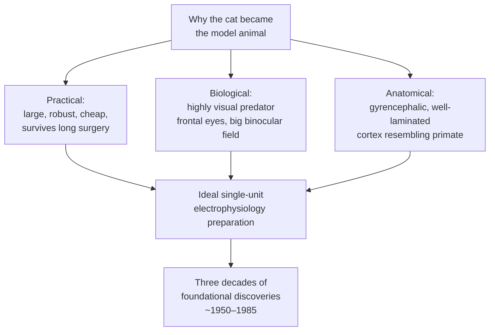
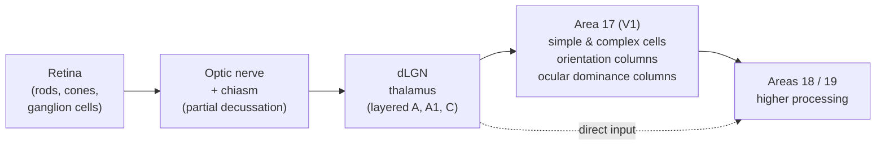
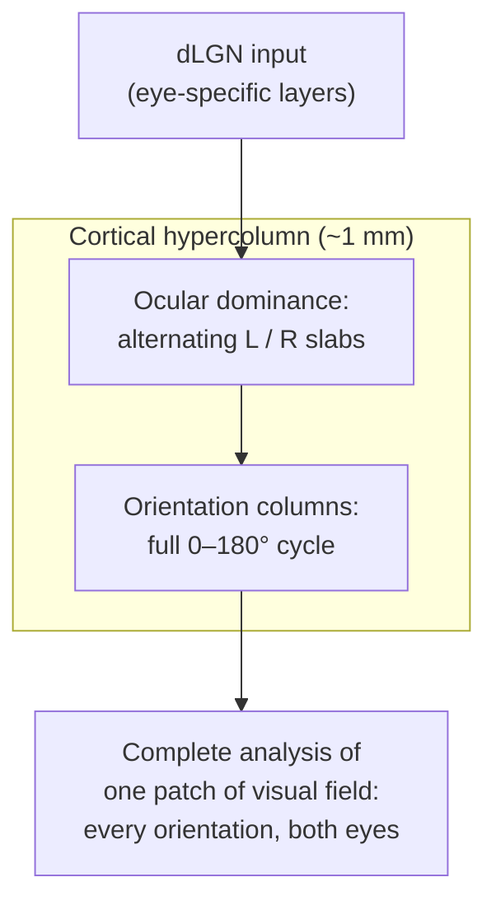
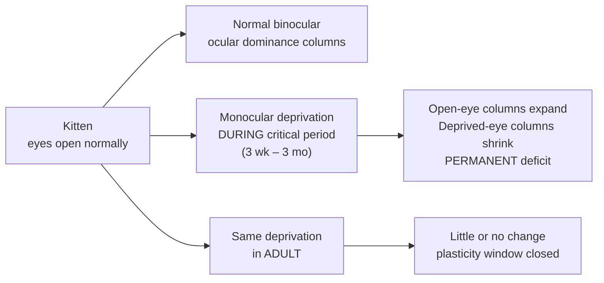
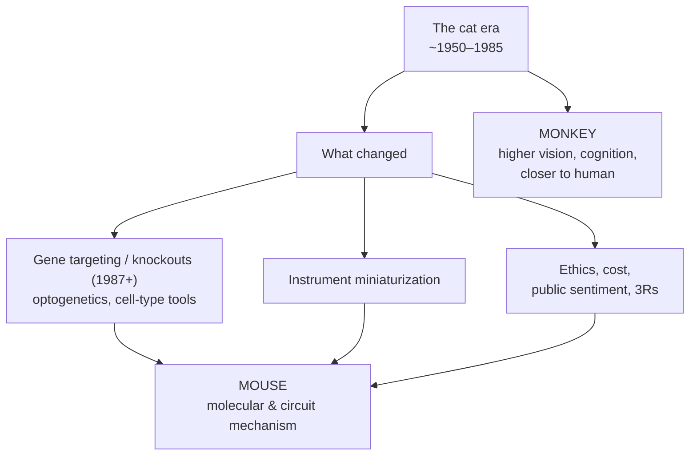

# The Cat Brain (*Felis catus*): The Classic Model of the Mammalian Visual System

> *"The brain is a machine, but a machine that we still barely understand — and we came to understand what little we do largely by watching cells in the cat's cortex answer to a bar of light."*

For roughly three decades — from the early 1950s to the mid-1980s — the domestic cat was the single most important experimental animal in systems neuroscience. It was in the anesthetized cat that the cellular code of vision was first read out; it was in the cat that the arousing "engine" of the brainstem was localized; it was in the pontine cat that dreaming sleep was pried apart from waking and from deep sleep; and it was in the decerebrate cat that the spinal cord was shown to walk on its own. Few animals have contributed as much foundational knowledge to our picture of how the mammalian brain works. This chapter tells that story, explains the landmark experiments, and asks why the cat — once the workhorse of the field — was quietly retired in favor of mice and monkeys.

---

## Table of Contents

1. [Why the Cat?](#1-why-the-cat)
2. [Cat Brain Neuroanatomy](#2-cat-brain-neuroanatomy)
3. [The Feline Visual Pathway](#3-the-feline-visual-pathway)
4. [Hubel and Wiesel: Reading the Cortical Code](#4-hubel-and-wiesel-reading-the-cortical-code)
5. [The Critical Period and Monocular Deprivation](#5-the-critical-period-and-monocular-deprivation)
6. [Beyond Vision: The Cat's Other Great Contributions](#6-beyond-vision-the-cats-other-great-contributions)
7. [Why the Cat Was Superseded](#7-why-the-cat-was-superseded)
8. [Comparison to the Human Brain](#8-comparison-to-the-human-brain)
9. [Limitations of the Cat Model](#9-limitations-of-the-cat-model)
10. [Summary](#10-summary)
11. [Sources](#sources)

---

## 1. Why the Cat?

The cat's dominance in mid-20th-century neurophysiology was not an accident of affection — it was a matter of practical engineering constraints layered on top of biological suitability.

**Practical reasons.** The neurophysiology of the era was a physically demanding craft. Recording from single neurons meant lowering a metal microelectrode into an exposed, anesthetized, paralyzed brain and holding it steady for hours. This required an animal that was:

- **Large enough** to accommodate the bulky stereotaxic frames, amplifiers, and micromanipulators of the day, and to expose a substantial, accessible cortical surface.
- **Robust enough** to survive the extensive, hours-long surgeries and the maintained-anesthesia preparations these experiments demanded.
- **Inexpensive and available**, often sourced from pounds and shelters — a fact that later became the ethical fault line under the whole enterprise.

**Biological reasons.** The cat is a highly visual predator. Its eyes are large and frontally placed, giving a wide **binocular overlap** (essential for studying stereopsis and the interaction of the two eyes), and its visual cortex is disproportionately large and well laminated. In short, if you wanted to study vision in a mammal whose brain was organized recognizably like our own — folded, layered, and visually dominated — the cat was the obvious choice. The monkey was better still for primate-specific questions but was far more expensive and ethically fraught; the cat was the sweet spot.

---

## 2. Cat Brain Neuroanatomy

The cat brain is a small but genuinely **gyrencephalic** (folded) mammalian brain — a miniature of the primate plan far more than the smooth-brained rodent is.

### 2.1 Gross measures

| Measure | Approximate value | Note |
|---|---|---|
| Brain mass | ~25–30 g | ~0.9% of body mass |
| Total neurons | ~760 million | Herculano-Houzel isotropic-fractionator estimates |
| Cortical neurons | ~200 million (≈250 M in some counts) | Compare mouse ~14 M, human ~16 billion |
| Cerebral cortex | Gyrencephalic (folded) | Well-defined sulci and gyri |
| Neuron density, area 17 | ~50,000 neurons/mm³ | Dense primary visual cortex |
| Encephalization quotient | ~1.0 | Roughly "expected" for its body size |

The cat's roughly 200 million cortical neurons dwarf the mouse's ~14 million and give it far richer cortical circuitry, even though it falls far short of primates. Crucially, unlike the lissencephalic (smooth) rodent cortex, the cat's folded cortex allowed experimenters to map functional structure — such as columns — across a two-dimensional cortical sheet in a way that generalized readily to human and monkey.

### 2.2 The folded cortex and its areas

Because the cortex is folded, feline visual areas are conventionally numbered in the Brodmann-like scheme that framed decades of work:

- **Area 17** — primary visual cortex (V1 / striate cortex), the main target of Hubel and Wiesel.
- **Area 18** — a large second visual area (roughly V2), heavily interconnected with 17.
- **Area 19** — a third, higher-order visual area.
- Plus a constellation of extrastriate areas (e.g., the lateral suprasylvian / **PMLS** areas) devoted to motion and higher processing.

A striking feature of the cat, and part of why it became the visual model, is that areas 17, 18, and even 19 each receive **direct thalamic input from the lateral geniculate nucleus (LGN)** — a more distributed, parallel arrangement than the strongly V1-funneled primate system. The cat visual cortex is organized as a densely interconnected hub-and-spoke network of specialized areas, an architecture that anticipated modern "connectome" thinking.

### 2.3 Overall organization

Structurally the cat brain follows the canonical mammalian plan: paired cerebral hemispheres over a diencephalon (thalamus, hypothalamus), a midbrain, a well-developed cerebellum, and a brainstem continuous with the spinal cord. What distinguishes it as a research model is the combination of **primate-like cortical lamination and folding** with **experimental tractability** — a combination that no other affordable mammal offered.

---

## 3. The Feline Visual Pathway

To appreciate the Hubel–Wiesel work, one must understand the visual pathway they were probing.

### 3.1 Retina to thalamus

Light captured by the retina is relayed by retinal ganglion cells whose axons form the optic nerve. At the **optic chiasm**, fibers partially cross so that each hemisphere receives input corresponding to the opposite half of the visual field from **both** eyes — the anatomical basis for binocular vision and stereopsis. In the cat, ganglion cells were classified physiologically into **X, Y, and W** types (a scheme developed largely in the cat by Enroth-Cugell, Robson, and others), representing parallel channels for fine detail, motion, and other features — a foundational idea about parallel processing.

### 3.2 The lateral geniculate nucleus (LGN)

The dorsal LGN of the thalamus is the visual relay. In the cat it is neatly **laminated** (layers A, A1, and C), with each layer driven predominantly by one eye. This monocular segregation in the thalamus is the substrate that, when it reaches the cortex, produces ocular dominance structure. The cat LGN was itself a major object of study for **thalamocortical processing**: how the thalamus gates, filters, and rhythmically modulates the flow of sensory information to cortex, including the generation of sleep spindles and the burst/tonic firing modes of relay cells.

---

## 4. Hubel and Wiesel: Reading the Cortical Code

The central chapter in the cat's scientific biography belongs to **David Hubel** and **Torsten Wiesel**, who from 1958 onward (first at Johns Hopkins, then at Harvard) recorded from single neurons in the cat's area 17. Their work earned them a share of the **1981 Nobel Prize in Physiology or Medicine** (with Roger Sperry) "for their discoveries concerning information processing in the visual system." Much of it is regarded as among the most elegant experimental work in the history of neuroscience.

### 4.1 The accidental discovery

Hubel and Wiesel projected spots of light onto a screen in front of an anesthetized cat, expecting cortical cells to respond to spots the way retinal and LGN cells do. Frustratingly, the cells were nearly silent. The breakthrough came, by their own account, almost by accident: as they slid a glass slide into their projector, the **moving edge of the slide** — a faint moving line — suddenly drove a cortical cell into a vigorous burst of firing. The cells did not care about spots. They cared about **oriented edges and bars**, and often about the **direction** in which those edges moved.

### 4.2 Simple cells

Systematically mapping receptive fields, they identified a class they called **simple cells**. A simple cell responds best to a bar or edge of a **particular orientation** placed at a **particular position** in its receptive field. Its receptive field has distinct, adjacent "on" and "off" subregions arranged in parallel stripes; a properly oriented bar aligned with the "on" region drives it strongly, while the wrong orientation or position elicits little response. Hubel and Wiesel proposed that a simple cell's oriented receptive field could be built by summing the inputs of several LGN cells whose circular receptive fields lie in a row — a beautifully concrete, testable model of how a new feature (orientation) is *constructed* from the feed-forward wiring.

### 4.3 Complex cells

A second class, **complex cells**, also preferred a specific orientation but — crucially — responded to a correctly oriented bar **anywhere within a larger receptive field**, showing position invariance. Many complex cells were also **direction-selective**, firing to motion one way but not the reverse. Hubel and Wiesel proposed a **hierarchy**: complex cells pool the outputs of many simple cells of the same preferred orientation but different positions, thereby achieving orientation tuning that is tolerant to exact location.

This hierarchical, feature-building scheme — simple → complex, each stage extracting a more abstract feature — became one of the most influential ideas in all of neuroscience and directly inspired the architecture of **convolutional neural networks** in modern artificial intelligence.

| Property | Simple cell | Complex cell |
|---|---|---|
| Preferred stimulus | Oriented bar/edge | Oriented bar/edge |
| Position sensitivity | High — needs precise placement | Low — responds across the field |
| Receptive field structure | Distinct on/off subregions | Overlapping, no clear subregions |
| Direction selectivity | Sometimes | Often |
| Proposed input | Rows of LGN cells | Many simple cells, same orientation |

### 4.4 Columnar organization

By advancing their electrode at different angles through the cortex, Hubel and Wiesel discovered that area 17 is organized into **columns**:

- **Orientation columns** — cells encountered in a vertical penetration (perpendicular to the surface) share nearly the same preferred orientation; moving tangentially across the surface, preferred orientation shifts smoothly, cycling through all angles over a small distance.
- **Ocular dominance columns** — cells are grouped by which eye drives them more strongly, forming alternating left-eye / right-eye slabs across the cortex.

They synthesized these into the idea of the **"hypercolumn"** or cortical module: a small patch of cortex (~1 mm) containing a full set of orientation columns for both eyes, i.e., all the machinery needed to analyze every orientation for one small region of the visual field. This modular, repeating architecture became a template for thinking about cortex generally.

---

## 5. The Critical Period and Monocular Deprivation

If the receptive-field work explained how the adult cortex computes, the **developmental** work explained how that machinery is wired up — and how experience shapes it. This is arguably the more medically consequential half of the Nobel-winning research.

### 5.1 The monocular deprivation experiment

Hubel and Wiesel sutured shut **one eye** of a young kitten for a period of weeks (monocular deprivation, MD). The deprived eye remained anatomically healthy — its retina and optics were fine. Yet when they later recorded from the cortex, they found something dramatic: almost **no cortical neurons could be driven by the deprived eye**. Cortical territory had been captured overwhelmingly by the eye that had remained open. The ocular dominance columns serving the deprived eye had **shrunk**, and those serving the open eye had **expanded**, at their expense. This atrophy was mirrored downstream in the LGN, where neurons in the layers serving the deprived eye were physically shrunken.

The key interpretation: the two eyes **compete** for cortical territory during development, and activity-dependent competition — "cells that fire together wire together," and inputs that fall silent lose their synapses — sculpts the final connectivity. Deprivation does not just fail to build connections; it causes the **active loss** of connections serving the weaker input.

### 5.2 The critical (sensitive) period

The most striking finding was that this plasticity was **gated by age**. Hubel and Wiesel defined a **critical period** — in the kitten, roughly from **3 weeks to 3 months** postnatally, peaking near 4 weeks — during which the cortex was exquisitely sensitive to visual experience. At the height of the critical period, as little as **3–4 days** of eye closure could permanently reshape ocular dominance. The **same deprivation imposed on an adult cat produced little or no effect** — the adult cortex had lost this form of plasticity. Reopening the deprived eye after the critical period did **not** restore normal vision: the loss was largely permanent.

### 5.3 Strabismus, amblyopia, and clinical impact

The relevance to human medicine was immediate and profound. **Amblyopia** ("lazy eye") — reduced acuity and loss of binocular vision in a structurally normal eye — is exactly what MD produces in the cat. Hubel and Wiesel also studied **strabismus** (misaligned eyes) by surgically inducing squint; this broke down the normal correlated firing of the two eyes, decoupling their inputs and yielding cortices with almost no binocular cells, each neuron driven by one eye or the other.

These findings rewrote pediatric ophthalmology. They provided the scientific rationale for **treating congenital cataracts and strabismus in human infants as early as possible**, before the critical period closes, and for patching therapy in amblyopia. The abstract concept of a developmental "window" — now applied to language acquisition, auditory development, and beyond — was crystallized in the sutured eye of a kitten.

---

## 6. Beyond Vision: The Cat's Other Great Contributions

The cat's scientific legacy extends well past the visual cortex. Several other pillars of modern neuroscience rest on feline preparations.

### 6.1 The reticular activating system (arousal)

In **1949**, **Giuseppe Moruzzi** and **Horace Magoun**, working with cats, made one of the defining discoveries about consciousness and arousal. They found that **electrical stimulation of the brainstem reticular formation** (near the midbrain–pons junction) **desynchronized and activated the cortical EEG**, converting the slow, synchronized waves of sleep into the fast, low-voltage pattern of alert waking — mimicking natural arousal. Conversely, damaging this region produced coma. This established the **ascending reticular activating system (ARAS)** as the brain's general "on switch," a diffuse brainstem system that maintains cortical wakefulness. It remains central to how we understand consciousness, sleep–wake regulation, anesthesia, and clinical concepts of coma and brain death.

### 6.2 Sleep neurophysiology and the discovery of REM

The neurophysiology of sleep — and especially of dreaming sleep — was largely worked out in cats, above all by **Michel Jouvet** in Lyon in the late 1950s and early 1960s. Jouvet characterized a paradoxical brain state during sleep in which the **EEG looks awake** (fast, activated), the eyes move rapidly, yet the postural muscles are completely **atonic** (paralyzed). He named it **paradoxical sleep** — what English-language researchers call **REM sleep**.

His most powerful evidence came from the **"pontine cat"** preparation: when everything above the brainstem was removed, leaving only the pons and below, the animal still cycled into the paradoxical state, showing that the **generator of REM sleep lives in the pons**, not the forebrain. Jouvet went further and localized a **dorsal pontine region responsible for the muscle atonia** of REM. When he lesioned it, cats entered REM sleep but **acted out their dreams** — walking, pouncing, and displaying predatory behaviors while asleep. This was the experimental discovery of what is now recognized in humans as **REM sleep behavior disorder**, and it pinned down the brainstem circuitry that normally paralyzes us while we dream.

| Sleep discovery | Preparation | Key finding |
|---|---|---|
| Cortical arousal switch | Cat, brainstem stimulation | ARAS activates/desynchronizes EEG (Moruzzi & Magoun, 1949) |
| Paradoxical / REM sleep | Cat EEG + EMG | Activated cortex + eye movements + muscle atonia (Jouvet) |
| REM generator localized | "Pontine cat" | REM arises in the pons independent of forebrain |
| Muscle atonia mechanism | Pontine lesions | Dorsal pons enforces atonia; lesion → dream enactment |

### 6.3 Spinal locomotion and central pattern generators

Long before the visual work, the cat spinal cord answered one of physiology's deepest questions: *does rhythmic movement require the brain, or a continuous stream of sensory feedback, or neither?*

Early in the 20th century, **Thomas Graham Brown** — a student of the great **Charles Sherrington** — studied **decerebrate cats** (in which the forebrain is disconnected). He showed that a spinal cord isolated from the brain, and even deprived of sensory feedback, could still generate the **alternating, rhythmic pattern of stepping**. This demolished the prevailing "chain-reflex" view (that each step is merely a reflex triggered by the previous one) and established the concept now called the **central pattern generator (CPG)**: a self-contained spinal neural network that produces the basic rhythm and pattern of locomotion intrinsically.

The cat remained the premier model for decades of follow-up work: researchers mapped the **mesencephalic locomotor region (MLR)** in the midbrain, whose stimulation drives a decerebrate cat to walk, trot, and gallop on a treadmill (speed scaling with stimulation intensity), and traced its descending pathways through the medullary reticular formation to the spinal CPG. This body of work is the intellectual foundation of modern efforts in **spinal-cord-injury rehabilitation**, including epidural spinal stimulation to restore stepping in paralyzed patients.

### 6.4 Thalamocortical processing

Finally, the cat's laminated LGN and its cortical targets made it the classic system for studying **thalamocortical dynamics**: how thalamic relay neurons switch between **tonic** (faithful relay) and **burst** (detection) firing modes, how the **thalamic reticular nucleus** gates transmission, and how thalamocortical loops generate the **spindles and slow oscillations** of sleep. Much of what is now framed in terms of cortical rhythms and states was first characterized in the cat by Mircea Steriade and colleagues.

---

## 7. Why the Cat Was Superseded

By the mid-1980s the cat's reign was ending. Cat neuroscience did not collapse for lack of results — it declined because the tools, economics, and ethics of the field all shifted at once, decisively favoring other species.

### 7.1 The genetic revolution (the decisive factor)

The single biggest driver was **genetics**. In **1987–1989**, Mario Capecchi, Martin Evans, and Oliver Smithies developed **gene targeting in mouse embryonic stem cells**, producing the first **knockout mice**. Suddenly it was possible to delete, add, or tag specific genes in a mammal — to ask what any given molecule does in the intact brain, to label defined cell types, and later to switch neurons on and off with light (**optogenetics**). None of this was practical in the cat, whose genetics, breeding time, and cost made it a genetic dead end. The proportion of neuroscience research using **mice roughly doubled** (from ~20% in the 1970s–80s toward ~50% in recent decades), tracking almost exactly the arrival of transgenic technology. The mouse offered *mechanistic and molecular* access that no amount of elegant cat electrophysiology could match.

### 7.2 Miniaturization

The original practical case for the cat — that only a large animal could carry the bulky recording gear — evaporated as electronics **miniaturized**. Microdrives, multi-electrode arrays, and later two-photon imaging shrank to fit the mouse and even smaller animals. The cat's size advantage became irrelevant.

### 7.3 Ethics, cost, and public sentiment

The cat is a beloved companion animal, and experiments involving cats — especially those historically sourced from shelters, and invasive survival procedures — drew intense public and political opposition. Rising standards under animal-welfare law, the growing influence of the **3Rs** (Replacement, Reduction, Refinement), higher housing costs, and reputational risk all pushed institutions away from cats and toward rodents, which face (rightly or wrongly) less public objection and lower cost.

### 7.4 Where each successor won

The field bifurcated. **Mice** inherited the mechanistic questions — genes, cell types, circuits. **Non-human primates** inherited the questions where closeness to the human brain mattered most — higher-order vision, attention, and cognition, where the monkey's foveal, primate-organized visual system is a better match than the cat's. The cat, sitting between them, lost its comparative advantage on both fronts.

### 7.5 A quiet second act

Interestingly, the cat is now finding niche relevance again as a **natural model of neurodegeneration**: aged cats spontaneously develop both **β-amyloid plaques and hyperphosphorylated tau tangles** — the twin hallmarks of Alzheimer's disease — a co-occurrence rare among non-human animals. For questions about how these pathologies arise naturally, the cat may yet have something to offer.

---

## 8. Comparison to the Human Brain

The whole reason the cat was such a productive model is that its brain is a **scaled-down but faithfully organized** version of the primate/human plan — far more so than the rodent's. But the differences are real and important.

| Feature | Cat | Human |
|---|---|---|
| Brain mass | ~25–30 g | ~1,300–1,400 g |
| Total neurons | ~760 million | ~86 billion |
| Cortical neurons | ~200 million | ~16 billion |
| Cortex | Gyrencephalic (folded) | Gyrencephalic (highly folded) |
| Visual cortex organization | Orientation & ocular dominance columns | Orientation & ocular dominance columns (very similar) |
| Retinal specialization | *Area centralis* (no true fovea) | True fovea (high-acuity central pit) |
| Thalamic input to cortex | Areas 17, 18, 19 all get direct LGN input | Strongly funneled through V1 |
| Color vision | Dichromatic (limited) | Trichromatic |
| Visual acuity | Lower (~20/100–20/200 equivalent) | High |
| Night/low-light vision | Superior (tapetum lucidum, rod-rich) | Inferior |
| Frontal cortex / cognition | Modest | Greatly expanded |

**What transfers well.** The columnar architecture of primary visual cortex, the simple/complex hierarchy, ocular dominance, binocular competition, the critical period, the ARAS and sleep–wake control, and the spinal CPG are all shared, deeply conserved mammalian features. Discoveries about them in the cat generalized to humans with remarkable fidelity — which is exactly why they were Nobel-worthy and clinically transformative.

**What differs.** The cat has no true **fovea** (it has an *area centralis* instead), is essentially **dichromatic**, and has far lower acuity but far better low-light vision — it is optimized as a crepuscular predator, not a daylight detail-reader like us. Its thalamocortical wiring is more parallel and less V1-centric than the primate's. And its association and frontal cortex are modest, so the cat was never a good model for higher cognition — a role that fell to primates.

---

## 9. Limitations of the Cat Model

Even at its height, the cat model carried important caveats — some scientific, some ethical.

- **Not a primate.** For foveal vision, color, attention, and cognition, the cat's organization diverges from the human's; conclusions about *higher* vision required monkeys.
- **Anesthesia confounds.** Most classic cat electrophysiology was done under anesthesia and paralysis. This buys stability but distorts brain state — it suppresses the top-down, attentional, and behavioral-state modulation that shapes real perception. Some "settled" facts from anesthetized cats were later nuanced by awake-behaving recordings.
- **No genetic access.** The fatal practical limitation. Without transgenic tools, the cat cannot answer molecular or cell-type-specific questions — the questions that came to define modern neuroscience.
- **Cost, breeding, and welfare.** Long generation times, high housing costs, and acute ethical sensitivity (cats as companion animals; historical shelter sourcing) made large-scale, systematic studies difficult and increasingly untenable.
- **Structure over molecule.** The cat era produced a magnificent map of cortical *architecture and physiology* but comparatively little about the underlying *molecular machinery* — precisely the gap the mouse was brought in to fill.

None of these diminish the historical achievement. They explain why the cat was the right tool for one set of questions (the systems-level organization of sensory cortex and brainstem) and the wrong tool for the next.

---

## 10. Summary

The domestic cat was the animal in which systems neuroscience grew up. In its visual cortex, Hubel and Wiesel discovered orientation-selective **simple and complex cells**, the **hierarchical** construction of visual features, and the **columnar** (orientation and ocular dominance) architecture of cortex — then showed, through **monocular deprivation** during a **critical period**, that this architecture is sculpted by experience, work that earned the **1981 Nobel Prize** and reshaped pediatric ophthalmology. In the cat brainstem, Moruzzi and Magoun localized the **reticular activating system** of arousal; Jouvet used **pontine cats** to discover and dissect **REM sleep** and its muscle atonia. In the cat spinal cord, Graham Brown and successors established the **central pattern generator** for locomotion. And the cat's laminated LGN anchored our understanding of **thalamocortical processing**.

The cat then yielded its throne — not because it failed, but because **genetics** made the mouse indispensable, **miniaturization** erased the cat's size advantage, and **ethics and cost** turned sentiment away from a companion animal. The mechanistic future went to the mouse; the cognitive frontier went to the monkey. What remains is a body of foundational knowledge — the columns, the hierarchy, the critical period, the arousal system, the sleep switch, the spinal rhythm generator — so robust that it still frames how we think about the brain, and even how we build artificial ones.

---

## Sources

- [From Cats to the Cortex: Unravelling the Hierarchical Processing System of Vision and Brain Plasticity (PMC)](https://pmc.ncbi.nlm.nih.gov/articles/PMC11445666/)
- [A Nobel Partnership: Hubel & Wiesel — Harvard University Brain Tour](https://braintour.harvard.edu/archives/portfolio-items/hubel-and-wiesel)
- [David H. Hubel — Wikipedia](https://en.wikipedia.org/wiki/David_H._Hubel)
- [Six classic papers by Wiesel and Hubel (Journal of Neurophysiology)](https://journals.physiology.org/doi/pdf/10.1152/jn.00061.2008)
- [For one-time Hopkins researchers, accidental discovery led to Nobel Prize-winning breakthrough (JHU Hub)](https://hub.jhu.edu/2015/07/14/golden-goose-award-wiesel-hubel/)
- [Effects of Visual Deprivation on Ocular Dominance — Neuroscience, NCBI Bookshelf](https://www.ncbi.nlm.nih.gov/books/NBK10880/)
- [Development and Plasticity of the Primary Visual Cortex (PMC)](https://www.ncbi.nlm.nih.gov/pmc/articles/PMC3612584/)
- [Monocular deprivation — Wikipedia](https://en.wikipedia.org/wiki/Monocular_deprivation)
- [Early monocular deprivation reduces the capacity for neural plasticity in the cat visual system (Cerebral Cortex Communications)](https://academic.oup.com/cercorcomms/article/4/3/tgad017/7244027)
- [Correction of amblyopia in cats and mice after the critical period (eLife)](https://elifesciences.org/articles/70023)
- [The visual system of the cat (Attention, Perception, & Psychophysics)](https://link.springer.com/article/10.3758/BF03204283)
- [Geniculate input to cat visual cortex: a comparison of area 19 with areas 17 and 18 (J. Neurophysiology)](https://journals.physiology.org/doi/abs/10.1152/jn.1980.44.4.804)
- [Cat intelligence — Wikipedia (neuron counts, gyrencephalic cortex)](https://en.wikipedia.org/wiki/Cat_intelligence)
- [Giuseppe Moruzzi — Wikipedia](https://en.wikipedia.org/wiki/Giuseppe_Moruzzi)
- [Physiology of arousal: Moruzzi and Magoun's ascending reticular activating system (PubMed)](https://pubmed.ncbi.nlm.nih.gov/7626973/)
- [The reticular activating system: a narrative review of discovery, evolving understanding, and relevance to brain death (Can. J. Anesthesia)](https://link.springer.com/article/10.1007/s12630-023-02421-6)
- [Michel Jouvet — Wikipedia](https://en.wikipedia.org/wiki/Michel_Jouvet)
- [Michel Jouvet, from the discovery of paradoxical sleep and muscle atonia to the role of neuropeptides (PubMed)](https://pubmed.ncbi.nlm.nih.gov/31829929/)
- [The Biology of REM Sleep (PMC)](https://pmc.ncbi.nlm.nih.gov/articles/PMC5846126/)
- [Evaluating the Evidence Surrounding Pontine Cholinergic Involvement in REM Sleep Generation (Frontiers in Neurology)](https://www.frontiersin.org/journals/neurology/articles/10.3389/fneur.2015.00190/full)
- [Central Pattern Generator for Locomotion: Anatomical, Physiological, and Pathophysiological Considerations (PMC)](https://www.ncbi.nlm.nih.gov/pmc/articles/PMC3567435/)
- [The mammalian central pattern generator for locomotion (ResearchGate)](https://www.researchgate.net/publication/222866547_The_mammalian_central_pattern_generator_for_locomotion)
- [Control of locomotion in the decerebrate cat (PubMed)](https://www.ncbi.nlm.nih.gov/pubmed/8895997)
- [Rodent models in neuroscience research: is it a rat race? (Disease Models & Mechanisms)](https://journals.biologists.com/dmm/article/9/10/1079/3833/Rodent-models-in-neuroscience-research-is-it-a-rat)
- [Animals in Neuroscience Research — International Animal Research Regulations, NCBI Bookshelf](https://www.ncbi.nlm.nih.gov/books/NBK100126/)
- [Mice in translational neuroscience: What R we doing? (ScienceDirect)](https://www.sciencedirect.com/science/article/pii/S0301008222001162)
- [Stress and the domestic cat: have humans accidentally created an animal mimic of neurodegeneration? (Frontiers in Neurology)](https://www.frontiersin.org/journals/neurology/articles/10.3389/fneur.2024.1429184/full)
