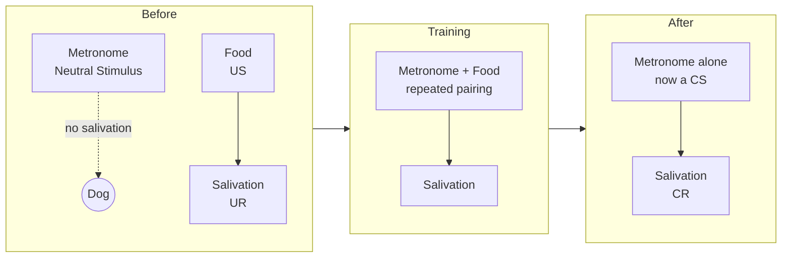
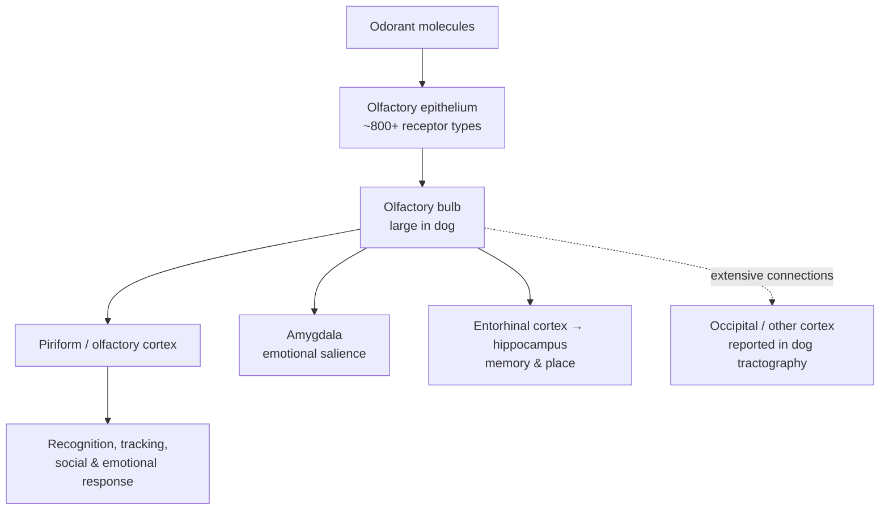
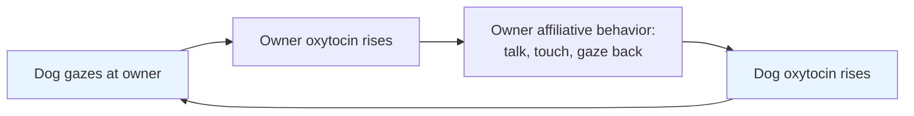

# The Dog Brain (*Canis familiaris*)

### A model for social cognition, olfaction, and — historically — the very idea of learning

> The dog is the only large animal that volunteered for domestication, and, more than a
> century later, the only one that has volunteered — untethered and unsedated — to lie inside
> an MRI scanner and let us watch it think. No other species has been simultaneously the
> founding subject of learning theory (Pavlov), a workhorse of classical reflex physiology
> (Sherrington), a champion of interspecies social cognition, and a living instrument for
> olfactory science. This makes the dog brain unusually rich as a comparative model: not
> because it is the most complex brain we study, but because it is the one most entangled
> with our own.

---

## Table of contents

1. [Why the dog brain matters](#1-why-the-dog-brain-matters)
2. [The dog in the history of neuroscience](#2-the-dog-in-the-history-of-neuroscience)
   - [Pavlov and classical conditioning](#21-pavlov-and-classical-conditioning)
   - [Sherrington and the integrative action of the nervous system](#22-sherrington-and-the-integrative-action-of-the-nervous-system)
3. [Neuroanatomy: the dog brain in numbers](#3-neuroanatomy-the-dog-brain-in-numbers)
4. [The extraordinary olfactory system](#4-the-extraordinary-olfactory-system)
5. [Awake-dog fMRI: watching a dog think](#5-awake-dog-fmri-watching-a-dog-think)
6. [Social cognition and the human bond](#6-social-cognition-and-the-human-bond)
7. [Breed differences in brain structure](#7-breed-differences-in-brain-structure)
8. [Dog vs. human: a side-by-side](#8-dog-vs-human-a-side-by-side)
9. [Limitations, ethics, and the consent question](#9-limitations-ethics-and-the-consent-question)
10. [Key takeaways](#10-key-takeaways)
11. [Sources](#sources)

---

## 1. Why the dog brain matters

Most comparative neuroscience picks its model organisms for tractability (the mouse), for
evolutionary proximity to humans (the macaque), or for some spectacular specialization (the
electric fish, the echolocating bat). The dog earns its place for a different reason: **it
evolved, over roughly 15,000–40,000 years, inside the human social niche.** Selection did not
merely tame the wolf; it appears to have re-tuned the dog's brain toward reading, tracking, and
bonding with a second species — us.

That gives the dog a unique triple identity as a research subject:

- **A cognitive model of cross-species social bonding** — dogs attend to human faces, voices,
  gaze, and pointing gestures in ways that even our closest primate relatives do not.
- **A sensory model of olfaction** — the dog's nose is one of the most sensitive chemical
  detectors in the mammalian world, backed by a brain heavily invested in smell.
- **A historically pivotal model of learning and reflex** — the dog is the animal in which the
  conditioned reflex was discovered and in which the logic of the spinal reflex was worked out.

The dog is also, importantly, *cooperative*. It can be trained with positive reinforcement to
hold still, awake and unrestrained, inside a scanner — which has opened a window on the intact,
behaving, socially engaged mammalian brain that is very hard to get any other way.

---

## 2. The dog in the history of neuroscience

### 2.1 Pavlov and classical conditioning

Ivan Petrovich Pavlov (1849–1936) was a Russian **physiologist**, not a psychologist — a
distinction he insisted on his whole life. He won the **Nobel Prize in Physiology or Medicine
in 1904** for work on the physiology of digestion, using dogs with surgically implanted fistulae
to measure secretions. It was inside *that* project, in the 1890s, that he stumbled onto the
phenomenon that would outlast all his digestive work.

**The accidental discovery.** Pavlov's dogs, unsurprisingly, salivated when food was placed in
their mouths. But he noticed they also began salivating *before* the food arrived — at the sight
of the food bowl, at the lab assistant's footsteps, at cues that merely *predicted* feeding. He
first called these anticipatory responses "psychic secretions," then set out to strip the
mysticism away and study them as physiology.

**The experiment.** Pavlov systematized the logic that is still taught today:

| Term | Definition | In Pavlov's setup |
|---|---|---|
| Unconditioned Stimulus (US) | Naturally triggers a response | Food |
| Unconditioned Response (UR) | The innate reaction to the US | Salivation to food |
| Neutral Stimulus (NS) | Initially triggers nothing relevant | A metronome / buzzer / bell |
| Conditioned Stimulus (CS) | Former NS, after pairing with US | Metronome that now predicts food |
| Conditioned Response (CR) | Learned reaction to the CS | Salivation to the metronome alone |

> ⚠️ **Contested detail — the "bell."** Popular culture fixed on "Pavlov's bell," but Pavlov
> more often used a metronome, buzzer, tuning fork, electric shock, or a rotating disk, and some
> historians argue a *bell* specifically was rarely if ever his primary cue (partly a translation
> and popularization artifact). The *principle* is not in doubt; the iconic bell is a simplification.

By repeatedly pairing the neutral cue with food, Pavlov could make the cue alone elicit
salivation. He then mapped the surrounding phenomena with unusual rigor:

He described **acquisition** (learning the pairing), **extinction** (the CR fades if the CS is
repeatedly presented without the US), **spontaneous recovery** (the extinguished CR returns after
a rest), **generalization** (similar tones also elicit the CR), and **discrimination** (the dog
learns to respond only to the reinforced tone). This entire vocabulary, laid out in his 1927
book *Conditioned Reflexes*, is still standard.

**Why it lasted.** Pavlov's work matters far beyond dogs for several reasons:

- **It made learning objective.** Before Pavlov, "association of ideas" was the domain of
  introspective philosophy. He turned it into something you could measure in drops of saliva —
  a physiological event with a time course, a threshold, and a decay curve.
- **It grounded behaviorism.** John B. Watson and, later, the whole American behaviorist program
  built on the conditioned reflex as the atom of learning. B. F. Skinner's *operant* conditioning
  is a deliberate contrast to (and extension of) Pavlov's *classical/respondent* conditioning.
- **It seeded the neuroscience of learning and memory.** Modern work on **fear conditioning** —
  the amygdala-dependent learning that a tone predicts a shock — is Pavlovian conditioning by
  another name, and it is one of the best-understood learning circuits in the brain (LeDoux and
  others). **Reward-prediction-error** models of dopamine (Schultz) are, at heart, a computational
  account of *why* Pavlovian cues acquire their power. Clinically, Pavlovian principles underlie
  **exposure therapy** and **systematic desensitization** for phobias and PTSD, **cue-reactivity**
  models of **addiction and relapse**, and even conditioned immune and nausea responses (e.g.,
  anticipatory nausea in chemotherapy).

In short: the dog is where the idea that *the brain learns predictable statistical relationships
about the world* first became an experimental science.

### 2.2 Sherrington and the integrative action of the nervous system

If Pavlov used the dog to found the psychology of learning, **Sir Charles Scott Sherrington**
(1857–1952) used it (alongside cats and monkeys) to found the physiology of the reflex — and won
the **1932 Nobel Prize** (shared with Edgar Adrian) for it. Sherrington coined the word
**"synapse"** and gave us the framework that still organizes systems neuroscience.

- **The scratch reflex in the spinal dog.** In a classic 1906 study (*Observations on the
  scratch-reflex in the spinal dog*, *Journal of Physiology*), Sherrington transected the spinal
  cord in the thoracic region and showed that a light, sustained irritation of the flank still
  drove the hindlimb into a rhythmic scratching movement — *without any input from the brain.*
  The reflex, therefore, is generated **within the spinal cord itself**. (This is the same
  circuit behind the "kick" many dogs make when you scratch a certain spot — the *scratch reflex*
  every vet knows.)
- **Decerebrate rigidity.** By transecting the brainstem between the colliculi, Sherrington
  produced the classic **decerebrate preparation** and characterized decerebrate rigidity,
  isolating brainstem and spinal function from the forebrain.
- **Concepts that endured.** From these preparations he articulated the **reflex arc**,
  **reciprocal innervation** (when one muscle contracts, its antagonist relaxes — "Sherrington's
  law"), the **final common path** (many inputs converging on one motor neuron), spatial and
  temporal **summation**, and **central excitatory/inhibitory states**. He gathered these into
  *The Integrative Action of the Nervous System* (1906), arguing that the nervous system's job is
  to *integrate* competing inputs into coherent behavior — a thesis that still frames how we think
  about neural computation.

> The dog and cat spinal cord were, for Sherrington, "the simplest portion of the mammalian
> nervous system" that nonetheless "displays examples of all its synaptic functions" — a
> convenient laboratory for the general logic of neural integration.

---

## 3. Neuroanatomy: the dog brain in numbers

The dog brain is a small, lissencephalic-leaning-to-moderately-gyrified carnivore brain. It
follows the standard mammalian plan — cerebral hemispheres, cerebellum, brainstem, limbic system
— but with proportions tuned by the dog's ecology and, later, by human breeding.

| Feature | Dog | Human | Notes |
|---|---|---|---|
| Brain mass | ~50–120 g (breed-dependent) | ~1,300–1,400 g | Dog brain is a small fraction of ours |
| Brain : body mass | ~1:125 (rough) | ~1:40 | Humans devote far more mass to brain |
| Encephalization quotient (EQ) | ~1.2 | ~7.4–7.8 | EQ = brain size vs. expected for body mass; 1 = average mammal |
| Cortical neurons (total brain) | ~2.2–2.3 billion | ~86 billion | Herculano-Houzel lab estimates |
| Cortical folding (gyrification) | Moderate; fewer folds | High | Folding scales largely with brain size |
| Frontal lobe share | ~10% of cortex | ~front third of cortex | Often cited; see caveat below |
| Olfactory bulb | Large, prominent | Small, relatively reduced | See §4 |

> ⚠️ **Contested / soft numbers.** Several of these figures are approximate and vary by source
> and breed. EQ formulas for dogs specifically have been revised because standard EQ equations
> were built for interspecies comparison and fit dogs poorly given their extreme within-species
> body-size range (a Chihuahua and a Great Dane are the *same species*). The oft-repeated "frontal
> lobe is only 10%" and "humans have far more prefrontal cortex" claims capture a real difference
> in degree but are frequently overstated in popular writing; treat exact percentages skeptically.

A few structural themes matter for the rest of this document:

- **The dog is a macrosmatic mammal** — its brain allocates a large share of tissue and wiring to
  smell (§4), in stark contrast to the vision-dominated, microsmatic primate brain.
- **The caudate nucleus** (part of the striatum, a reward/valuation hub) is a recurring
  protagonist in dog fMRI — it is anatomically accessible and functionally informative (§5).
- **The temporal cortex** houses face- and voice-sensitive regions, echoing (but not identical to)
  the primate temporal lobe's social-perception machinery (§5, §6).
- **Interoception, emotion, and reward** run through a limbic system — amygdala, hippocampus,
  striatum, cingulate — organized on the same plan as ours, which is a large part of why dogs are
  useful comparative models of emotion and bonding at all.

---

## 4. The extraordinary olfactory system

If there is one domain where the dog brain outclasses the human brain outright, it is smell. The
dog is a **macrosmatic** animal: olfaction is not a supplementary sense but a primary channel onto
the world.

### 4.1 The peripheral hardware

| Metric | Dog | Human | Approx. ratio |
|---|---|---|---|
| Olfactory sensory neurons / receptors | ~200 million – 1 billion (breed-dependent; ~300M often cited) | ~5–6 million | ~40–200× |
| Functional olfactory receptor (OR) *genes* | ~800–870 (of ~1,090 total; ~20% pseudogenes) | ~400 (of ~800; ~half pseudogenes) | ~2× |
| Olfactory epithelium area | ~"handkerchief"-sized (tens of cm²) | ~"postage-stamp"-sized (a few cm²) | large |
| Olfactory bulb | Prominent, absolutely and relatively large | Small, relatively reduced | see caveat |

The often-cited "**~2 orders of magnitude more receptors**" refers to the count of *olfactory
sensory neurons* (hundreds of millions vs. ~5 million). Note that at the *gene* level the gap is
much smaller — dogs have roughly **twice** the number of functional OR genes, not a hundred times.
Both statistics are true; they measure different things (molecular *variety of detectable odors*
vs. raw *number of detector cells*). Popular articles routinely blur these two.

> ⚠️ **Contested detail — olfactory bulb size ratio.** Sources put the dog's olfactory bulb at
> anywhere from ~3× to ~30–40× the size of the human's, depending on whether the comparison is
> absolute, relative to brain mass, or relative to body mass. The bulb is unambiguously large and
> important in dogs, but the exact multiplier is not settled — cite it with a range, not a single
> number.

Two anatomical features amplify the dog's advantage:

- **Airflow separation.** A dog's nasal architecture splits inhaled air into a respiratory stream
  and a dedicated olfactory stream routed to the sensory epithelium, and dogs can sniff and breathe
  quasi-independently — sampling odor almost continuously.
- **The vomeronasal organ (VNO).** Dogs retain a functional VNO (Jacobson's organ) for detecting
  pheromones and other social/chemical signals, with its own accessory olfactory bulb. Curiously,
  at the gene level the canine VNO repertoire is *reduced* — only ~8–9 intact V1R pheromone-receptor
  genes and a fully pseudogenized V2R family — yet the organ is anatomically present and behaviorally
  relevant (a nice reminder that gene counts and functional importance are not the same thing).

### 4.2 The central wiring

Olfaction is neurologically special because it is the one sensory modality that **partly bypasses
the thalamus** on its way to cortex, projecting directly into the piriform (olfactory) cortex and
adjacent limbic structures (amygdala, entorhinal cortex). In dogs, tractography and dissection
studies have revealed that the **olfactory pathway is even more extensively connected than
previously thought**, with projections reaching not only limbic targets but occipital (visual)
regions — a possible neural substrate for how smell and spatial/visual information may be
integrated in a scent-tracking animal.

**Functional consequences.** This hardware turns the dog into a chemical analyzer of remarkable
sensitivity and utility:

- **Detection thresholds** for certain compounds are estimated to reach parts per trillion —
  detecting a substance diluted to the equivalent of a drop in many Olympic swimming pools (a
  figure that is illustrative rather than precise, and varies by odorant).
- **Applied olfaction:** tracking and search-and-rescue, explosives and narcotics detection,
  and **biomedical detection** — dogs have been trained to signal cancers, low blood sugar in
  diabetics, seizures, and (in various studies) viral infections including SARS-CoV-2. ⚠️ Many
  medical-detection claims are promising but **not yet robustly validated at clinical scale** —
  treat headlines cautiously.
- **In the scanner:** Berns' team showed that odors of familiar humans specifically activate the
  **caudate** (reward region), not just the olfactory bulb — meaning smell is a route straight to
  the dog's valuation and social-bonding machinery (§5).

---

## 5. Awake-dog fMRI: watching a dog think

For most of neuroscience history, imaging an animal brain meant anesthetizing or restraining the
animal — which is useless for studying *cognition*, because an unconscious brain is not thinking,
and a terrified restrained one is not thinking *normally*. The breakthrough of the 2010s was the
demonstration that dogs can be **trained with positive reinforcement to enter an MRI scanner and
hold their heads still, awake, unsedated, and unrestrained**, long enough for functional imaging.

**Gregory Berns** and colleagues at Emory University (the "**Dog Project**") published the first
awake, unrestrained canine fMRI in 2012 (Berns, Brooks & Spivak, *PLOS ONE*). Comparable programs
were developed independently, notably **Attila Andics, Ádám Miklósi** and colleagues in Budapest.
Key requirements: custom chin-rests and head coils, **hearing protection** (dogs' hearing is more
sensitive than ours and scanners are extremely loud), and weeks-to-months of shaping with treats
and praise.

### What awake-dog fMRI has shown

| Finding | Region | Interpretation | Key source |
|---|---|---|---|
| Reward-predicting cues raise activity | Ventral **caudate** | Dogs form value expectations like other mammals | Berns et al. 2012–13 |
| **Praise ≈ or > food** in reward value | Caudate | In 13 of 15 dogs, social praise was as/more rewarding than food | Cook et al. 2016 |
| Scent of *familiar human* is special | Caudate (not just olfactory bulb) | The bond is encoded in reward circuitry, even when the person is absent | Berns et al. 2015 |
| A **face-sensitive region** in temporal cortex | Temporal lobe | Dogs have specialized face-processing machinery | Dilks et al. 2015 |
| **Separate** human-face and dog-face areas | Left temporal cortex (HFA vs. DFA) | Distinct processing for our faces vs. conspecific faces | Thompkins et al. 2018 |
| **Voice-sensitive** regions; sensitivity to emotional prosody | Temporal cortex | A voice area analogous to the primate one; dogs process *how* we say things | Andics et al. 2014 |

Two results deserve emphasis:

1. **Praise can rival food.** That the *caudate* — a core reward hub shared across mammals —
   responds to a human's verbal praise as strongly as to food, and does so *per individual dog* in
   a way that predicts that dog's behavioral choice between owner and food bowl, is about as close
   as neuroscience has come to a biological signature of the dog–human bond being genuinely
   *rewarding* to the dog, not merely food-instrumental.

2. **The bond survives the person's absence.** When dogs smelled the scent of a familiar human
   (collected on a cloth; the person was *not* in the room), the caudate lit up more than for any
   other scent — including familiar dogs. The reward system responds to the *idea* of the person,
   encoded in odor. That is a striking parallel to how human reward/attachment systems respond to
   loved ones.

> ⚠️ **Interpretive caution.** These are small-sample studies (often 10–20 dogs), reverse-inference
> from a region to a mental state is always risky, and canine fMRI responses show real
> heterogeneity across individuals and sessions (a point the researchers themselves published).
> The *direction* of these findings has replicated across labs, but strong quantitative claims
> ("dogs love praise 2× more than food") outrun the data.

---

## 6. Social cognition and the human bond

The dog's headline cognitive talent is **reading humans**. This is the domain where dogs
outperform even chimpanzees, and where the domestication story becomes a neuroscience story.

### 6.1 Following the point

In the **object-choice task**, an experimenter hides food under one of two containers and then
*points* at the correct one. Dogs — including young puppies with little human exposure —
spontaneously follow human pointing to find the food.

- Dogs **outperform wolves** raised under comparable conditions, and famously **outperform
  chimpanzees**, our closest relatives, on this human-communicative task (Hare, Tomasello, and
  others).
- This is the empirical backbone of the **domestication hypothesis** (Brian Hare, Ádám Miklósi):
  selection during domestication produced dogs pre-disposed to treat human gestures as
  *communicative*, socially relevant signals.

> ⚠️ **Genuine ongoing debate.** The domestication hypothesis is contested. Monique Udell,
> Clive Wynne, and colleagues have shown that **intensively hand-reared, socialized wolves** can
> follow human points at dog-like levels, arguing that *lifetime experience and rearing* — not a
> hard-wired domestication endowment — do much of the work ("two-stage" / lifetime-learning
> accounts). Most researchers now favor an interactionist view: domestication lowered reactivity
> and biased attention toward humans, and ontogeny (early socialization) builds the rest. This is
> not a settled question.

### 6.2 Gaze, and the oxytocin loop

Dogs make **eye contact** with humans in an affiliative, human-like way — something wolves largely
do not. The landmark study is **Nagasawa et al. (2015, *Science*)**:

- When dogs and owners engaged in mutual gazing, **both** showed rising **urinary oxytocin** — the
  same neuropeptide central to mother–infant bonding.
- Nasally administering oxytocin to (female) dogs increased their gazing at owners, which in turn
  raised the owners' oxytocin — closing a **positive feedback loop**.
- Crucially, **hand-raised wolves did not** produce this gaze-mediated oxytocin loop with humans.

The authors argue this **interspecies oxytocin-gaze loop** was co-opted from the mammalian
parent–offspring bonding system during domestication — the dog effectively hijacks (or was
selected to engage) the neurochemistry we use to bond with our own infants.

> ⚠️ **Replication caveat.** The oxytocin literature broadly — in humans and animals — is plagued
> by small samples, publication bias, assay variability, and mixed replications. The Nagasawa
> finding is influential and biologically plausible, and a commentary/replication debate exists.
> Treat the *loop* as a compelling hypothesis with meaningful support, not an established law.

### 6.3 Voices, words, and emotion

Andics, Miklósi and colleagues (Budapest) used fMRI to show that dogs have **voice-sensitive
temporal-cortex regions** and are sensitive to **emotional prosody** — the emotional tone of a
voice. A later, widely discussed study reported that dogs process **lexical (word) and intonational
(tone) information in partly separable pathways**, with a left-hemisphere bias for word meaning and
right-hemisphere processing of intonation, and reward-region activation when praise words *and*
praising tone coincided — a rough echo of the human division of labor between *what* is said and
*how* it is said. ⚠️ The strong "dogs understand words like we do" framing is contested; the more
defensible claim is that dogs discriminate familiar words from tone and integrate the two.

---

## 7. Breed differences in brain structure

Domestic dogs are the **most morphologically and behaviorally diverse mammal species on Earth** —
a single species spanning Chihuahuas to Mastiffs, sighthounds to scent-hounds, herders to lapdogs.
Does that behavioral diversity show up in the *brain*?

**Hecht et al. (2019, *Journal of Neuroscience*)** — the Harvard Canine Brains Project (Erin Hecht)
— gave the clearest answer to date. Using MRI scans of **62 neurologically healthy purebred dogs
across 33 breeds**, they built an average-brain template and measured how each breed deviated from it.

Findings:

- **Brain anatomy varies significantly across breeds**, and the variation is **not** simply
  explained by overall brain size, body size, or skull shape.
- Variation is **organized into networks**, and those networks **correlate with behavioral
  specializations** for which breeds were selected — e.g.:

| Behavioral specialization | Associated network (broad strokes) |
|---|---|
| Sight hunting / coursing | Vision, eye movement, spatial navigation |
| Scent hunting | Olfaction, and reward/limbic regions |
| Guarding / defense | Regions tied to fear, aggression, social action |
| Companionship / bonding | Regions tied to social reward and emotion |
| Sport fighting, police/war work, herding | Distinct regional signatures |

- A **phylogenetic analysis** showed most anatomical change is concentrated in the **terminal
  branches** of the dog family tree — i.e., **recent, strong selection within individual breeds**,
  consistent with the intense modern breeding of the last few centuries.

The interpretation: human selection for *behavior* (pointing, herding, guarding, retrieving)
reshaped **regional brain structure**, not just body and coat. This is a rare, almost experimental
demonstration of behavior-driven neuroanatomical evolution playing out on a human timescale.

> ⚠️ **Caveats.** These are correlational, cross-breed structural (not functional) data from pet
> dogs scanned clinically; behavioral "specialization" is assigned from breed-club function, which
> is a coarse proxy for what any individual dog actually does. Structure–behavior links at the
> breed level should not be read down to individuals ("this breed's brain makes it aggressive" is
> an overreach). Skull shape (brachycephaly) also physically distorts brain orientation and must be
> controlled for.

---

## 8. Dog vs. human: a side-by-side

| Dimension | Dog | Human | Comment |
|---|---|---|---|
| Brain mass | ~50–120 g | ~1,350 g | ~10–25× larger in humans |
| Cortical/total neurons | ~2.2 billion | ~86 billion | ~40× more in humans |
| EQ | ~1.2 | ~7.4 | Humans far above expected-for-body-size |
| Cortical folding | Modest | Extensive | Scales largely with size |
| Dominant sensory modality | **Olfaction** | Vision | Fundamentally different *Umwelt* |
| Olfactory receptor neurons | Hundreds of millions | ~5 million | Dog vastly superior |
| Functional OR genes | ~800+ | ~400 | ~2× — smaller gap than neuron counts imply |
| Face-processing cortex | Temporal region, less specialized | Fusiform face area + network | Analogous, not homologous in detail |
| Voice/prosody processing | Temporal voice-sensitive areas | Superior temporal voice areas | Convergent social-perception machinery |
| Reward/valuation | Caudate/striatum (well-conserved) | Caudate/striatum + rich PFC | Shared core; humans elaborate control |
| Language | No syntax/productive language | Full language | Dogs read *cues*, don't have language |
| Cross-species social reading | **Exceptional** (points, gaze, emotion) | (species-typical) | Dogs' standout trait |

The honest summary: **the human brain is larger, more neuron-dense, and more cortically elaborated,
especially in association and prefrontal cortex.** The dog brain is smaller and simpler in those
respects — but it is *not* a scaled-down human brain. It is a carnivore brain re-tuned for a
smell-dominated world and, uniquely, for reading a second species. On its home turf — olfaction and
human-social attunement — the dog is not merely competitive with us; on smell it far exceeds us,
and on cross-species communication it exceeds even our fellow apes.

---

## 9. Limitations, ethics, and the consent question

Dog neuroscience carries a set of limitations and an unusually pointed ethical dimension.

### 9.1 Scientific limitations

- **Small samples.** Awake-dog fMRI cohorts are typically 10–20 animals (training is slow and
  hard), limiting statistical power and generalizability.
- **Self-selection.** Scanner dogs are, almost by definition, the calmest, most cooperative,
  most owner-bonded, highly-trained individuals — a biased sample of *dogkind*.
- **Reverse inference.** Concluding a mental state ("the dog feels love") from a region's activity
  ("the caudate lit up") is a known logical trap; regions are multi-functional.
- **Heterogeneity.** Canine fMRI responses vary substantially across individuals and sessions —
  something the field has documented honestly.
- **Motion and resolution.** Even trained dogs move; head motion, small brain size, and field
  strength constrain spatial resolution.
- **Anthropomorphism pull.** The subject is a beloved pet; the temptation to over-read human
  emotions into the data is stronger here than for, say, a zebrafish.

### 9.2 The ethics and "consent" of awake cooperative scanning

Here the dog is a genuinely novel ethical case in neuroscience. Traditional animal
neurophysiology — including some of Pavlov's and Sherrington's own work — involved surgery,
restraint, and terminal experiments that would be constrained or disallowed under modern welfare
standards. Awake-dog fMRI was deliberately designed as the ethical opposite:

- **No sedation, no restraint.** The dog is trained, not forced, and — this is the key design
  principle — **is free to leave the scanner at any time.** Willing participation *is* the method:
  a dog that won't hold still simply produces no usable data, so coercion is self-defeating as well
  as unethical.
- **Positive reinforcement only.** Training uses treats and praise; distress or refusal ends the
  session.
- **Hearing protection.** Because dogs' hearing is more acute than ours, ear protection and
  desensitization to scanner noise are central welfare measures.
- **An explicit welfare-first charter.** Berns and colleagues articulated the concern that
  **"dogs will do almost anything humans ask of them,"** which makes them *especially vulnerable to
  exploitation*, and proposed that the animal's welfare must **override** the research goal — a
  proposed ethical template for the field.

This is why Berns and others have framed cooperative scanning in the vocabulary of **"consent"** —
not legal or verbal consent, but **behavioral assent**: a subject that can, and is permitted to,
opt out at any moment. It is an imperfect analogy (a dog cannot understand a study's purpose), and
some ethicists push back on the "consent" framing as anthropomorphic. But operationally, *the dog's
freedom to walk away is built into the experiment* — a standard most animal research has never met,
and one that raises interesting questions for how we treat cooperative animal subjects generally.

> ⚠️ **Contested framing.** "Consent" is used here in a deliberately loose, welfare-oriented sense
> (voluntary participation / assent). Whether an animal can meaningfully "consent" is philosophically
> unsettled; the defensible, concrete claim is that these protocols make participation *voluntary
> and revocable*, which is ethically significant regardless of what we call it.

---

## 10. Key takeaways

- **Historically foundational.** The dog is where **classical conditioning** (Pavlov) and the
  **spinal reflex / integrative action** (Sherrington) were established — two pillars of modern
  neuroscience, each anchored by a Nobel Prize.
- **A nose with a brain attached.** Dogs are macrosmatic: hundreds of millions of olfactory
  neurons (~2 orders of magnitude more than humans) and ~2× the functional receptor genes, feeding
  an enlarged olfactory bulb wired straight into limbic and reward circuitry.
- **Awake fMRI opened the intact social brain.** Trained, unrestrained dogs revealed **caudate**
  reward responses in which **praise can rival food**, a special caudate response to a **familiar
  human's scent**, and **face- and voice-sensitive temporal regions** — parallels to primate social
  perception.
- **Champion of cross-species social cognition.** Dogs follow human **pointing** and **gaze** better
  than chimpanzees and wolves, and engage an **oxytocin–gaze feedback loop** with humans — the
  neurochemistry of bonding, turned outward to another species.
- **Behavior reshaped the anatomy.** Breed-level MRI shows **structured neuroanatomical variation**
  tracking behavioral specializations, driven by **recent, strong selection** — behavior-driven brain
  evolution on a human timescale.
- **A new ethical model.** Cooperative, welfare-first, opt-out-at-any-time scanning offers a template
  for humane animal neuroscience — while carrying real limits: small, self-selected samples and the
  ever-present pull of anthropomorphism.
- **Flag the soft numbers.** Olfactory-bulb size ratios, EQ, frontal-lobe percentages, and the
  strongest bonding/word-understanding claims are all either contested or approximate. The dog brain
  is genuinely remarkable without the exaggerations.

---

## Sources

**Pavlov & classical conditioning**
- [Classical Conditioning — StatPearls, NCBI Bookshelf](https://www.ncbi.nlm.nih.gov/books/NBK470326/)
- [Pavlov's Dogs & Pavlovian Conditioning — Simply Psychology](https://www.simplypsychology.org/pavlov.html)
- [Pavlov's Classical Conditioning: Timeline and Impact — Neurolaunch](https://neurolaunch.com/when-did-pavlov-discover-classical-conditioning/)

**Sherrington & reflex physiology**
- [Observations on the Scratch-Reflex in the Spinal Dog — Sherrington, 1906, J. Physiology (PDF)](https://static.physoc.org/app/uploads/2019/04/22193251/Observations-on-the-scratch-reflex-in-the-spinal-dog.pdf)
- [Sherrington's *Integrative Action*: a centenary notice — PMC](https://pmc.ncbi.nlm.nih.gov/articles/PMC1079269/)
- [Insights into the life and work of Sir Charles Sherrington — Univ. of Oxford (PDF)](https://www.neuroscience.ox.ac.uk/files/about/insights-into-the-life-and-work.pdf)

**Neuroanatomy & encephalization**
- [Modified formulas for calculation of encephalization quotient in dogs — BMC Research Notes](https://link.springer.com/article/10.1186/s13104-021-05638-0)
- [Quantitative analysis of gyrification of cerebral cortex in dogs — PubMed](https://pubmed.ncbi.nlm.nih.gov/9200135/)
- [Canine Brain Anatomy — Harvard Canine Brains Project](https://sites.harvard.edu/caninebrainsproject/canine-brain-anatomy/)

**Olfaction**
- [Extensive Connections of the Canine Olfactory Pathway Revealed by Tractography and Dissection — J. Neuroscience / PMC](https://pmc.ncbi.nlm.nih.gov/articles/PMC9398547/)
- [The dog and rat olfactory receptor repertoires — PMC](https://www.ncbi.nlm.nih.gov/pmc/articles/PMC1257466/)
- [Evolutionary dynamics of olfactory and other chemosensory receptor genes in vertebrates — PMC](https://pmc.ncbi.nlm.nih.gov/articles/PMC1850483/)
- [The Role of Olfaction in Dogs: Evolution, Biology, and Human-Oriented Work — Animals (MDPI)](https://www.mdpi.com/2076-2615/16/3/427)
- [Dog sense of smell — Wikipedia (overview/entry points)](https://en.wikipedia.org/wiki/Dog_sense_of_smell)

**Awake-dog fMRI (reward, faces, scent, voice)**
- [Functional MRI in Awake Unrestrained Dogs — Berns, Brooks & Spivak, PLOS ONE](https://journals.plos.org/plosone/article?id=10.1371/journal.pone.0038027)
- [Awake canine fMRI predicts dogs' preference for praise vs food — Cook et al., SCAN / PMC](https://pmc.ncbi.nlm.nih.gov/articles/PMC5141954/)
- [Scent of the Familiar: fMRI of canine brain responses to familiar/unfamiliar scents — Berns et al.](https://www.wellbeingintlstudiesrepository.org/soccog/17/)
- [Awake fMRI reveals a specialized region in dog temporal cortex for face processing — Dilks et al., PMC](https://www.ncbi.nlm.nih.gov/pmc/articles/PMC4540004/)
- [Separate brain areas for processing human and dog faces (awake fMRI) — Thompkins et al., Learning & Behavior](https://link.springer.com/article/10.3758/s13420-018-0352-z)
- [Replicability and Heterogeneity of Awake Unrestrained Canine fMRI Responses — PLOS ONE](https://journals.plos.org/plosone/article?id=10.1371/journal.pone.0081698)
- [Functional MRI of the Domestic Dog: Research, Methodology, and Conceptual Issues — PMC](https://pmc.ncbi.nlm.nih.gov/articles/PMC5813826/)

**Social cognition, oxytocin, communication**
- [Oxytocin-gaze positive loop and the coevolution of human–dog bonds — Nagasawa et al., Science](https://www.science.org/doi/10.1126/science.1261022)
- [Commentary: Oxytocin-Gaze Positive Loop... — Frontiers in Psychology](https://www.frontiersin.org/journals/psychology/articles/10.3389/fpsyg.2015.01845/full)
- [The domestication hypothesis for dogs' skills with human communication (Hare et al., response) — Duke (PDF)](https://evolutionaryanthropology.duke.edu/sites/evolutionaryanthropology.duke.edu/files/site-images/hare-et-al-2010-the-domestication-hypothesis-for-dogs-skills-with-human-communication-a-response-to-udell-et-al-2008-and-wynne-et-al-2008.original.pdf)
- [Explaining Dog–Wolf Differences in Utilizing Human Pointing Gestures — PLOS ONE](https://journals.plos.org/plosone/article?id=10.1371/journal.pone.0006584)

**Breed differences**
- [Significant Neuroanatomical Variation Among Domestic Dog Breeds — Hecht et al., J. Neuroscience](https://www.jneurosci.org/content/39/39/7748)
- [Significant Neuroanatomical Variation Among Domestic Dog Breeds — PMC full text](https://pmc.ncbi.nlm.nih.gov/articles/PMC6764193/)
- [Harvard researcher finds canine brains vary based on breed — Harvard Gazette](https://news.harvard.edu/gazette/story/2019/09/harvard-researcher-finds-canine-brains-vary-based-on-breed/)

**Ethics & methodology of awake scanning**
- [Training pet dogs for eye-tracking and awake fMRI — Behavior Research Methods](https://link.springer.com/article/10.3758/s13428-019-01281-7)
- [Clinical Findings in Dogs Trained for Awake-MRI — Frontiers in Veterinary Science](https://www.frontiersin.org/journals/veterinary-science/articles/10.3389/fvets.2018.00209/full)

*Note: figures marked ⚠️ (olfactory-bulb size ratios, EQ, frontal-lobe percentages, oxytocin-loop
replication, "praise > food," "dogs understand words," medical-detection efficacy, and the
domestication-vs-lifetime-learning debate) are approximate or actively contested in the literature
and are flagged as such in the text above.*
