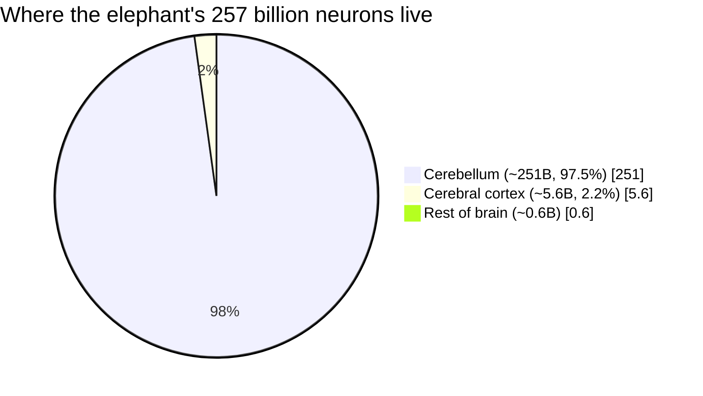
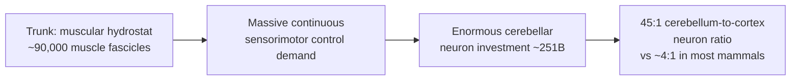
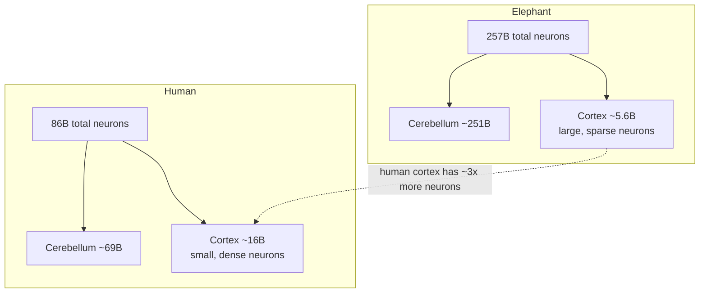

# The Elephant Brain: Biggest on Land, and a Lesson in Why Size Isn't Everything

> Part 7 of the comparative neuroscience series. Genera *Loxodonta* (African bush and forest elephants) and *Elephas* (Asian elephant).

## Introduction

The elephant carries the largest brain of any land animal that has ever lived: a convoluted, roughly 4.5–5.5 kg organ that dwarfs the ~1.3–1.4 kg human brain. For most of the twentieth century this fact sat comfortably alongside a folk assumption — big brain, big mind — and elephants were slotted near the top of the intelligence hierarchy on the strength of their sheer neural bulk plus a rich behavioral repertoire: apparent grief, decades-long memory, mirror self-recognition, cooperation, and tool use.

Then, in 2014, neuroscientist Suzana Herculano-Houzel and colleagues actually *counted* the neurons in an elephant brain. The result upended the tidy story. The elephant brain does hold an astonishing number of neurons — about **257 billion**, roughly three times the human count — but the overwhelming majority of them (~98%) sit in the **cerebellum**, a structure specialized for motor coordination and, almost certainly, for running the extraordinary machine that is the trunk. The part most associated with flexible cognition, the **cerebral cortex**, contains only ~5.6 billion neurons — about a third of the human cortex's ~16 billion.

This article synthesizes what is known about the elephant brain: its size and cellular composition, its distinctive neuroanatomy (the enormous temporal lobes and hippocampus, the highly folded cortex, Von Economo neurons, and the vast neural real estate devoted to the trunk), the behaviors that make elephants a byword for intelligence, and — crucially — why "more neurons" turned out not to mean "more mind." Throughout, contested and uncertain claims are flagged, because elephant neuroscience is built on a painfully small number of specimens.

---

## Table of Contents

1. [The Numbers: Brain Size and Neuron Counts](#the-numbers-brain-size-and-neuron-counts)
2. [The Cerebellum Puzzle and the Trunk](#the-cerebellum-puzzle-and-the-trunk)
3. [Distinctive Neuroanatomy](#distinctive-neuroanatomy)
4. [Cognition and Behavior](#cognition-and-behavior)
5. [Communication: Infrasound and Seismic Signaling](#communication-infrasound-and-seismic-signaling)
6. [Comparison to Humans: Why More Neurons ≠ More Intelligence](#comparison-to-humans-why-more-neurons--more-intelligence)
7. [Limitations of Studying Elephant Brains](#limitations-of-studying-elephant-brains)
8. [Key Takeaways](#key-takeaways)
9. [Sources](#sources)

---

## The Numbers: Brain Size and Neuron Counts

### Gross size

An adult African elephant brain weighs roughly **4.5–5.5 kg** (often cited around 5 kg), making it the largest brain of any extant land animal and larger than that of any primate. Only some cetaceans — sperm whales (~7–9 kg) and some other large whales — exceed it. For scale, the human brain averages ~1.3–1.5 kg.

But absolute size is a weak predictor of anything, because brains scale with body size. Elephants weigh 3,000–6,000 kg, so their brain-to-body ratio is modest. The **encephalization quotient (EQ)** — brain mass relative to what would be expected for a mammal of that body size — places elephants well below humans:

| Measure | African elephant | Asian elephant | Human |
|---|---|---|---|
| Brain mass | ~4.6–5.5 kg | ~4.0–5.0 kg | ~1.3–1.5 kg |
| Encephalization quotient (EQ) | ~1.4–1.7 | ~2.1–2.3 | ~7.4–7.8 |
| Total brain neurons | ~257 billion | (not separately counted) | ~86 billion |
| Cerebral cortex neurons | ~5.6 billion | — | ~16 billion |
| Cerebellar neurons | ~251 billion | — | ~69 billion |

> **Flag — EQ figures vary.** Published EQ estimates for elephants range from roughly 1.1 to 2.4 depending on the body-mass and brain-mass values used and the reference equation. Asian elephants generally score higher than African, partly because they are somewhat smaller-bodied. Human EQ is variously given as ~7 to ~7.8. Treat all EQ numbers as order-of-magnitude comparisons, not precise constants.

### The neuron count that changed the story

The landmark data come from Herculano-Houzel, Kamilla Avelino-de-Souza, Kleber Neves and colleagues, "The elephant brain in numbers" (*Frontiers in Neuroanatomy*, 2014). Using the **isotropic fractionator** — a method that dissolves a brain region into a homogeneous "soup" of cell nuclei, stains the neuronal nuclei (with the marker NeuN), and counts them in a sample to estimate the total — they analyzed the brain of a single adult male African elephant.

Headline findings:

- **~257 billion total neurons** — about 3× the ~86 billion in a human brain.
- **~251 billion (97.5%) of those neurons are in the cerebellum.**
- The **cerebral cortex**, despite having roughly *twice the mass* of the human cortex, holds only **~5.6 billion neurons** — about one-third of the human cortex's ~16 billion.
- **Non-neuronal cells** roughly matched neurons in number overall, but the cortex in particular had a high glia-to-neuron ratio, consistent with large, sparsely packed neurons.

The single most consequential number is not the 257 billion — it is the **5.6 billion cortical neurons**. If cortical neuron count tracks with the kind of flexible, general intelligence humans prize, then the elephant, for all its brain mass, is working with far fewer such neurons than a human, and fewer even than a great ape in the cortex. This is the crux of the "paradox of the elephant brain."

---

## The Cerebellum Puzzle and the Trunk

### An outlier ratio

In most mammals, including humans, there are roughly **4 cerebellar neurons for every cortical neuron**. In the elephant, that ratio is about **45 to 1** — a dramatic outlier. Something is pushing enormous numbers of neurons into the elephant cerebellum.

The leading explanation is the **trunk**. The elephant trunk is a boneless muscular hydrostat of extraordinary dexterity — capable of uprooting a tree and of picking up a single blade of grass or peeling a banana. Estimates of its musculature vary widely and are frequently mis-cited:

> **Flag — the "40,000 muscles" claim.** The popular figure of "40,000 muscles" in the trunk is a mischaracterization. Anatomically, the trunk is built from a much smaller number of *named* muscles organized into a very large number of **muscle fascicles** — recent work (Michael Brecht's lab) counts on the order of **~90,000 muscle fascicles**. "40,000 muscles" should be treated as folklore; "tens of thousands of muscle fascicles / units of independent control" is the defensible statement.

Controlling such a hydrostat in real time — fine-graded, continuous, high-degree-of-freedom motor output combined with rich tactile feedback — is exactly the kind of sensorimotor computation the cerebellum specializes in. The hypothesis that the trunk drives the elephant's cerebellar neuron explosion is well-motivated but remains an **inference**, not a directly demonstrated causal link.

### The trigeminal and facial nuclei — the trunk's brainstem

Beyond the cerebellum, the trunk claims a striking share of the brainstem:

- The **trigeminal nerve/ganglion** (sensory, from the face and trunk) is extraordinarily enlarged. The **infraorbital nerve** carrying touch information from the trunk is reportedly **thicker than the elephant's spinal cord** — a vivid measure of how much tactile bandwidth the trunk demands.
- Brecht's group mapped the **elephant trigeminal brainstem nucleus** and found it organized into repeating **facial modules**, most prominently a **trunk module**, plus nostril and lower-jaw modules. The folds of the trunk are represented in the nucleus in a remarkable **isomorphic (map-like) pattern** revealed by myelin "stripes."
- The **trunk module** contains large neuron numbers — on the order of **~740,000 in African** versus **~640,000 in Asian** elephants — and the two species show different enlargements corresponding to how they use their trunks (Asian elephants wrap objects; African elephants have two "fingers" at the tip and pinch).
- Neural **magnification factors** shift from roughly **1000:1** at the proximal trunk to about **5:1** at the sensitive trunk "finger," so the tip is massively over-represented — the elephant equivalent of the outsized hands and lips on the human sensory homunculus.
- The **facial nucleus** (motor control of the trunk musculature) is likewise very large with elaborate cellular architecture.

The takeaway: a huge fraction of the elephant brain is, in effect, dedicated *trunk hardware*. This is a body-plan story as much as a cognition story.

---

## Distinctive Neuroanatomy

Beyond raw counts, the elephant brain has several notable structural features.

### A large, deeply folded cortex

The elephant neocortex is **highly gyrified** (folded), and by some measures offers the greatest cortical *volume* of any land mammal. High folding packs more surface area into the skull. Importantly, though, the elephant cortex is **thick but sparsely populated**: its neurons are large and relatively far apart, which is why twice the human cortical mass yields only a third of the neurons. Big cortex, big neurons, low density.

### Enormous temporal lobes and a large hippocampus

Elephants have **strikingly large temporal lobes** — proportionally larger and more convoluted than in humans — which some researchers have linked (speculatively) to memory and to the storage of the vast social and ecological knowledge elephants accumulate over long lives.

The **hippocampus** (central to spatial and episodic-like memory) is large and has been described in detail for *Loxodonta africana* (Patzke et al., 2013). Alongside a comparatively large **amygdala** and its subnuclei, this has been read as an anatomical substrate for the strong interplay of **emotion and memory** in elephant social life. These structure-to-function links are biologically plausible but should be read as **hypotheses**, not established mechanisms — large size alone doesn't prove functional specialization.

### Von Economo neurons (spindle neurons)

**Von Economo neurons (VENs)** are large, elongated, spindle-shaped projection neurons with a simplified dendritic tree. First described in humans in the anterior cingulate and frontoinsular cortex, they were long thought to be a hallmark of great apes and humans — brain regions implicated in social awareness, empathy, and rapid intuitive decision-making.

Hakeem, Allman and colleagues (2009) reported VENs in **African and Asian elephants**, most abundant in the **frontoinsular cortex (area FI)** and present at lower density in the **anterior cingulate cortex**. They are also found in some cetaceans. The striking pattern is that VENs appear in exactly the lineages with **very large brains and complex sociality** — hominids, elephants, cetaceans — which are not closely related. This is a textbook case of likely **convergent evolution**: the researchers proposed VENs as a specialization for **fast relay of socially relevant information across a large brain**.

> **Flag — VEN function is not settled.** The link between Von Economo neurons and empathy/social cognition is a well-supported hypothesis, not a proven function. VENs are also implicated in certain neuropsychiatric conditions, and their exact computational role remains under active investigation. Their mere presence in elephants does not demonstrate human-like empathy.

### Summary table of distinctive features

| Feature | Elephant | Functional interpretation (with confidence) |
|---|---|---|
| Cerebellum | ~251B neurons, 97.5% of total | Trunk sensorimotor control — **strong inference** |
| Cortical neuron density | Low (large, spaced neurons) | Explains low cortical count despite mass — **established** |
| Cortical folding (gyrification) | High; large cortical volume | More surface area — **established structurally** |
| Temporal lobes | Very large, convoluted | Memory/social knowledge — **plausible hypothesis** |
| Hippocampus + amygdala | Large, well-developed | Emotion–memory integration — **plausible hypothesis** |
| Von Economo neurons | Present in FI and ACC | Social info relay — **hypothesis; convergent** |
| Trigeminal/facial nuclei | Hugely enlarged; isomorphic trunk map | Dedicated trunk hardware — **established** |

---

## Cognition and Behavior

Whatever the neuron accounting, elephants demonstrably do sophisticated things. The behavioral evidence is genuinely impressive, though — as always in animal cognition — vulnerable to over-interpretation.

### Memory

Elephant memory is more than a cliché. Karen McComb and colleagues (University of Sussex) showed that **older matriarchs act as repositories of social and ecological knowledge**:

- Families led by matriarchs older than ~55 years responded **more appropriately to threats** — for example, showing stronger, better-calibrated defensive bunching to the roars of male lions (the more dangerous sex) than younger-led families.
- Older females were **better at discriminating the contact calls** of familiar versus unfamiliar family groups, tracking a large social network by voice.
- Matriarchs can apparently **recall the locations of distant water sources** visited long ago, an advantage that becomes life-or-death during droughts — consistent with (though not proof of) exceptional long-term spatial memory.

### Mirror self-recognition

In a 2006 study, Joshua Plotnik, Frans de Waal, and Diana Reiss reported that an Asian elephant named **Happy** at the Bronx Zoo passed the **mark test**: presented with a large mirror and an (odorless, feelable-only-visually) mark on her head, she repeatedly touched the mark on *her own* head while watching her reflection. This places elephants in the small club — with great apes, dolphins, and (contested) magpies — that show behavioral evidence of self-recognition.

> **Flag — one of three.** Only one of the three tested elephants passed in that study, and mark-test results are famously noisy and hard to replicate across individuals. The finding is widely cited and broadly accepted as suggestive, but a single passing individual is thin evidence, and mirror-test methodology itself is debated.

### Body awareness

A 2017 study (Dale & Plotnik) found that elephants understand **their own body as an obstacle**: asked to hand an object to an experimenter while standing on a mat attached to that object, elephants stepped off the mat far more often when it impeded the task — a form of self-awareness distinct from the mirror test.

### Tool use and problem solving

- Elephants **use and modify tools**: breaking branches to swat flies, dropping objects on electric fences, plugging waterholes.
- A widely reported 2011 study (Foerder et al.) described an Asian elephant, **Kandula**, showing apparent **insight**: he moved a cube to stand on and reach suspended fruit, arguably solving the problem cognitively rather than by trial and error.

> **Flag — insight is a strong word.** "Insight" (sudden mental solution) is difficult to distinguish from rapid learning or prior experience. The Kandula result is intriguing but individual and debated.

### Empathy, consolation, and responses to death

- Plotnik and de Waal (2014) documented **consolation-like behavior**: when one elephant was distressed, others approached, touched them with the trunk, put trunk-tips in the distressed animal's mouth, and gave soft vocalizations — behavior functionally similar to consolation in great apes.
- Elephants show **repeated, striking interest in dead conspecifics** — approaching, touching, and investigating carcasses and even bleached bones, sometimes revisiting over weeks. Shifra Goldenberg's Samburu observations and broader reviews (e.g., in *Primates*, 2019) document this across all three elephant species and across decay stages.

> **Flag — "grief" and "mourning" are interpretive labels.** The *behaviors* (investigation, attention to the dead, gentle contact) are well documented. Whether they reflect grief in the human emotional sense, curiosity, confusion, or an olfactory pull toward a former herd-mate is genuinely uncertain. Comparative thanatology treats these as open questions, and careful scientists avoid asserting human-like mourning as fact.

### Social intelligence

Elephants live in **fluid, multi-tiered fission-fusion societies** built around related females and their young, with bulls more peripheral. They cooperate on tasks, recognize dozens to hundreds of individuals, distinguish human ethnic groups and ages by voice and scent (associating some with danger), and transmit knowledge across generations — a substrate often described as culture.

---

## Communication: Infrasound and Seismic Signaling

One of the most remarkable elephant adaptations is **long-distance communication below the range of human hearing**.

- In the 1980s, **Katy Payne**, later joined by **Joyce Poole** and others, discovered that elephants produce powerful **infrasonic "rumbles"** with fundamental frequencies below ~20 Hz — too low for most humans to hear. These low frequencies travel far through air (potentially several kilometers).
- These calls also couple into the ground as **seismic (Rayleigh) surface waves**. Work led by **Caitlin O'Connell-Rodwell** and collaborators showed elephants can **detect ground vibrations** — through bone conduction and specialized mechanoreceptors (e.g., Pacinian corpuscles) in the feet and trunk — and may use them for detection and possibly localization of distant events.
- The seismic channel's effective range under favorable conditions is estimated at **~2 km** (with air-borne infrasound reaching farther); elephants appear able to combine acoustic and seismic cues to extract direction and content.

> **Flag — the seismic-communication story is partly demonstrated, partly inferred.** That elephants *produce* seismic waves and *can detect* ground vibration is supported experimentally. Exactly how much they *use* seismic signals for communication in the wild, and how precisely they localize them, remains an active and not fully settled research question.

---

## Comparison to Humans: Why More Neurons ≠ More Intelligence

The elephant is the clearest natural experiment showing that **total brain size and total neuron count are poor proxies for intelligence**. The distribution matters.

### The core comparison

| Region | Elephant | Human | Notes |
|---|---|---|---|
| Total brain neurons | ~257 billion | ~86 billion | Elephant ~3× more overall |
| Cerebellar neurons | ~251 billion (97.5%) | ~69 billion (~80%) | Elephant cerebellum dominates |
| **Cerebral cortex neurons** | **~5.6 billion** | **~16 billion** | **Human has ~3× more cortical neurons** |
| Cerebellum : cortex neuron ratio | ~45 : 1 | ~4 : 1 | Elephant is a dramatic outlier |
| Cortical mass | ~2× human | baseline | Elephant cortex is bigger but sparser |

The pattern Herculano-Houzel emphasizes: **the primate cortex packs neurons far more densely** than the elephant cortex. A human cortex of modest mass holds ~16 billion neurons; the much larger elephant cortex holds only ~5.6 billion because its neurons are large and widely spaced. If flexible, general cognition scales with **absolute cortical neuron number** (Herculano-Houzel's proposed correlate), then humans, not elephants, come out ahead — despite the elephant's overall neuron advantage.

### Why the old assumption failed

1. **Brains scale with bodies.** Big animals need big brains just to run big bodies; much of the elephant brain is body-management (a very large fraction is trunk hardware), not extra "thinking" capacity.
2. **Neuron density differs by lineage.** Primate cortex is unusually neuron-dense; elephant (and, generally, non-primate) cortex is not. Mass is a misleading currency; you have to count cells.
3. **Where the neurons sit matters.** 97.5% of elephant neurons run a motor/sensorimotor structure. Cerebellar neurons are not interchangeable with cortical association neurons.

### An important caveat in both directions

None of this proves elephants are "dumb." They are clearly among the most cognitively sophisticated animals by behavioral measures, and 5.6 billion cortical neurons is still a very large number (comparable to some primates). The lesson is narrower and more interesting: **you cannot read intelligence off brain mass, and even neuron counts must be broken down by region and cell type.** The elephant retired the lazy syllogism "biggest brain = smartest animal." Whether *cortical neuron number* is itself the right single currency for intelligence is also debated — cognition depends on connectivity, neuromodulation, and organization, not a single tally.

---

## Limitations of Studying Elephant Brains

Elephant neuroscience carries unusually severe methodological constraints, and every claim above should be read with them in mind.

- **Tiny sample sizes.** The "elephant brain in numbers" neuron counts come from essentially **a single individual**. Anatomical studies routinely rely on one, two, or a handful of brains, often from zoo animals or culls. Individual variation cannot be estimated from n=1.
- **Specimen quality.** Elephants are huge; a brain begins to autolyze (degrade) quickly after death, and obtaining well-preserved, whole, perfusion-fixed brains is extremely difficult. Much tissue comes from opportunistic sources (natural deaths, culls, zoos) of unknown health and history.
- **No experimental neuroscience.** Ethical and practical realities preclude the invasive electrophysiology, lesion, and imaging protocols used in rodents or primates. There is essentially **no functional recording** from behaving elephant brains, so structure-to-function claims lean on anatomy plus behavior, not direct measurement.
- **Species conflation.** African bush (*Loxodonta africana*), African forest (*L. cyclotis*), and Asian (*Elephas maximus*) elephants differ in body size, trunk morphology, and likely neuroanatomy, but findings are often generalized across all three.
- **Interpretation gap.** Rich behavior (mourning-like acts, "insight," empathy) is easy to describe and hard to explain. Anthropomorphic language ("funerals," "grief") can outrun the evidence; conversely, over-cautious behaviorism can under-credit genuine capacities. The honest position on many elephant cognition claims is *well-documented behavior, contested mechanism.*
- **EQ and neuron-count proxies are themselves contested** as measures of intelligence, so even the comparative framing has caveats.

---

## Key Takeaways

- The elephant has the **largest brain of any land animal** (~5 kg) and the **most total neurons of any mammal measured (~257 billion)** — but **~98% are in the cerebellum**.
- Its **cerebral cortex holds only ~5.6 billion neurons**, about **a third of the human cortex's ~16 billion**, despite being twice the mass — because elephant cortical neurons are large and sparse.
- The extreme **45:1 cerebellum-to-cortex neuron ratio** (vs ~4:1 typical) is best explained by the computational demands of the **trunk**, which also commandeers hugely enlarged **trigeminal and facial nuclei** and a map-like brainstem representation.
- Distinctive features include **large convoluted cortex, big temporal lobes and hippocampus**, and **Von Economo neurons** convergent with those in apes and cetaceans.
- Behaviorally, elephants show **long-term memory, mirror and body self-awareness, tool use, cooperation, consolation, striking attention to the dead**, and **infrasonic + seismic communication** — though labels like "grief," "insight," and "mourning" outrun what the evidence strictly establishes.
- The overarching lesson: **brain size — and even total neuron count — does not equal intelligence.** Distribution, density, and organization are what matter, which is exactly why the elephant became the poster child for retiring the "bigger brain, smarter animal" assumption.

---

## Sources

**Neuron counts and brain composition**
- [Herculano-Houzel et al., "The elephant brain in numbers," *Frontiers in Neuroanatomy* (2014) — PMC full text](https://www.ncbi.nlm.nih.gov/pmc/articles/PMC4053853/)
- [Same paper — Frontiers in Neuroanatomy](https://www.frontiersin.org/journals/neuroanatomy/articles/10.3389/fnana.2014.00046/full)
- [Same paper — PubMed abstract](https://pubmed.ncbi.nlm.nih.gov/24971054/)
- ["If Elephants Have Bigger Brains, Why Are They Not Smarter than Us?" — The Neuroscience School (Herculano-Houzel summary)](https://neuroscienceschool.com/2017/07/04/elephants-bigger-brains-not-smarter/)
- ["The Paradox of the Elephant Brain" — Nautilus (Herculano-Houzel)](https://nautil.us/the-paradox-of-the-elephant-brain-235882)
- [Suzana Herculano-Houzel — author's page for the 2014 paper](http://www.suzanaherculanohouzel.com/2014-herculano-houzel-et-al-fr/)

**Trunk, trigeminal system, and somatosensory representation**
- [Purkart/Brecht et al., "A Myelin Map of Trunk Folds in the Elephant Trigeminal Nucleus" — eLife reviewed preprint](https://elifesciences.org/reviewed-preprints/94142)
- [Same — bioRxiv preprint](https://www.biorxiv.org/content/10.1101/2023.11.15.567239v1)
- [Purkart et al., "Trigeminal ganglion and sensory nerves suggest tactile specialization of elephants," *Current Biology* (2022)](https://www.cell.com/current-biology/fulltext/S0960-9822(21)01738-3)
- [Same — PubMed](https://pubmed.ncbi.nlm.nih.gov/35063122/)

**Neuroanatomy: hippocampus, Von Economo neurons**
- [Patzke et al., "Organization and chemical neuroanatomy of the African elephant hippocampus," PubMed (2013)](https://pubmed.ncbi.nlm.nih.gov/23728481/)
- [Hakeem, Allman et al., "Von Economo Neurons in the Elephant Brain," *The Anatomical Record* (2009)](https://anatomypubs.onlinelibrary.wiley.com/doi/10.1002/ar.20829)
- [Von Economo neuron — Wikipedia overview](https://en.wikipedia.org/wiki/Von_Economo_neuron)
- [Shoshani, Kupsky & Marchant, "Elephant brain," *Brain Research Bulletin* (2006) — PDF](https://drnissani.net/mnissani/ElephantCorner/ElephantBrain_shoshani.pdf)
- [ElephantVoices — "The Elephant Brain"](https://www.elephantvoices.org/the-elephant-brain)

**Cognition and behavior**
- [Plotnik, de Waal & Reiss, "Self-recognition in an Asian elephant" (2006) — PDF](https://ccconservation.org/wp-content/uploads/2019/11/self-recognition-in-an-Asian-elephant.pdf)
- [Dale & Plotnik, "Elephants know when their bodies are obstacles to success" (2017) — PMC](https://pmc.ncbi.nlm.nih.gov/articles/PMC5389349/)
- [Foerder et al., "Insightful Problem Solving in an Asian Elephant," *PLOS ONE* (2011)](https://journals.plos.org/plosone/article?id=10.1371%2Fjournal.pone.0023251)
- [Elephant cognition — Wikipedia overview](https://en.wikipedia.org/wiki/Elephant_cognition)
- [McComb et al., "Matriarchs as repositories of social knowledge in African elephants" — PubMed (2001)](https://pubmed.ncbi.nlm.nih.gov/11313492/)
- [University of Sussex — Mammal Communication & Cognition: elephant sociocultural knowledge](https://www.sussex.ac.uk/research/labs/mammal-communication-and-cognition/research/elephants-sociocultural-knowledge)

**Responses to death / comparative thanatology**
- [Goldenberg & Wittemyer, "Elephant behavior toward the dead: a review and insights from field observations," *Primates* (2019) — Springer](https://link.springer.com/article/10.1007/s10329-019-00766-5)
- [Same — PubMed](https://pubmed.ncbi.nlm.nih.gov/31713106/)

**Infrasound and seismic communication**
- [O'Connell-Rodwell, "Keeping an 'Ear' to the Ground: Seismic Communication in Elephants," *Physiology* (2007)](https://journals.physiology.org/doi/full/10.1152/physiol.00008.2007)
- ["Scientists unravel the secret world of elephant communication" — Phys.org (Payne, Poole, O'Connell-Rodwell)](https://phys.org/news/2005-05-scientists-unravel-secret-world-elephant.html)
- ["Seismic localization of elephant rumbles as a monitoring approach" — PMC (2021)](https://pmc.ncbi.nlm.nih.gov/articles/PMC8277467/)

**Encephalization and general context**
- [ElephantVoices — "Elephants are large-brained"](https://www.elephantvoices.org/elephant-sense-a-sociality-4/elephants-are-large-brained.html)
- [Encephalization quotient — ScienceDirect Topics overview](https://www.sciencedirect.com/topics/neuroscience/encephalization-quotient)

> **Note on reliability:** Primary peer-reviewed sources (Herculano-Houzel 2014; Plotnik 2006; McComb 2001; Brecht-lab trigeminal work; Hakeem/Allman 2009) are the backbone of this article. Secondary summaries (Wikipedia, Nautilus, ElephantVoices, news outlets) were used for orientation and cross-checking only. All numeric claims were drawn from or reconciled against the primary literature; where figures conflict across sources (EQ, muscle counts), the disagreement is flagged in-text rather than papered over.
