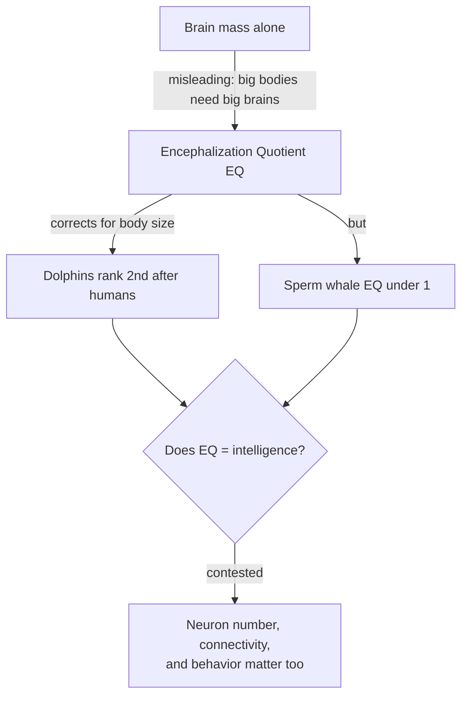
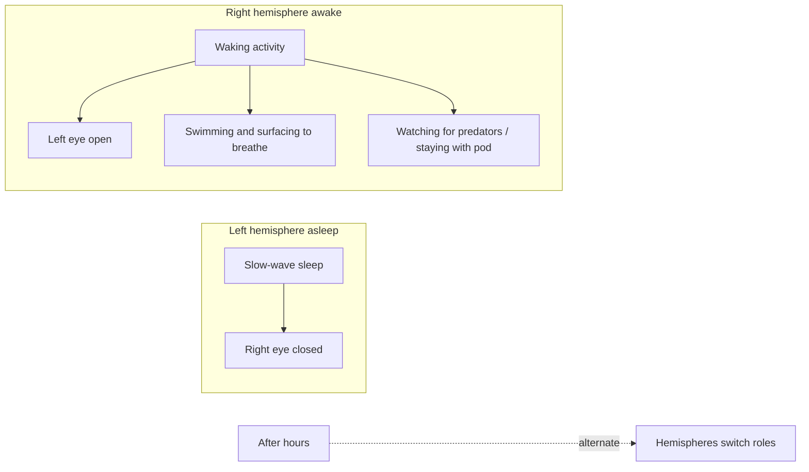

# The Cetacean Brain: Dolphins, Whales, and the Puzzle of the Ocean's Big-Brained Minds

Cetaceans — the whales, dolphins, and porpoises — are mammals that returned to the sea roughly 50 million years ago and, along the way, evolved some of the largest and strangest brains on Earth. A sperm whale carries the heaviest brain of any animal that has ever lived. A bottlenose dolphin's brain outweighs a human's. Yet these brains are built on a cortical blueprint so different from our own — thin, cell-sparse, folded to an extreme, and lacking a layer that anatomists once thought essential — that they force us to ask an uncomfortable question: does a big brain always mean a big mind?

This article surveys what is genuinely known about cetacean neuroanatomy, the remarkable adaptation of sleeping one hemisphere at a time, the acoustic world their brains are built to process, and their social and cognitive lives. It also takes seriously the honest scientific debate over how intelligent these animals really are — a debate in which reasonable experts disagree, and in which both breathless overclaiming and hard-nosed skepticism have distorted the public picture.

---

## Table of Contents

1. [Brain Size and Encephalization](#1-brain-size-and-encephalization)
2. [A Radically Different Cortex](#2-a-radically-different-cortex)
3. [Von Economo Neurons and Cell Types](#3-von-economo-neurons-and-cell-types)
4. [Unihemispheric Slow-Wave Sleep](#4-unihemispheric-slow-wave-sleep)
5. [An Acoustic Brain: Echolocation and Hearing](#5-an-acoustic-brain-echolocation-and-hearing)
6. [Cognition and Social Behavior](#6-cognition-and-social-behavior)
7. [The Honest Debate Over Dolphin Intelligence](#7-the-honest-debate-over-dolphin-intelligence)
8. [Comparison to the Human Brain](#8-comparison-to-the-human-brain)
9. [Why This Is So Hard to Study](#9-why-this-is-so-hard-to-study)
10. [Summary](#10-summary)
11. [Sources](#sources)

---

## 1. Brain Size and Encephalization

Cetacean brains are large by any measure, but "large" needs careful unpacking, because absolute size, relative size, and neuron count tell three different stories.

### Absolute size

The **sperm whale (*Physeter macrocephalus*)** has the largest brain of any animal, living or extinct — roughly **7.8 kg**, about six times the mass of a human brain. The **bottlenose dolphin (*Tursiops truncatus*)** brain averages around **1.5–1.7 kg**, noticeably heavier than the human average of about **1.3–1.4 kg**. On raw mass alone, several cetaceans surpass us.

### Encephalization Quotient (EQ)

Absolute mass is misleading because bigger bodies need bigger brains just to run basic housekeeping. The **encephalization quotient (EQ)** corrects for this: it is the ratio of an animal's actual brain mass to the mass predicted for a "typical" mammal of its body size. An EQ of 1 is average; higher means more brain than body size alone predicts.

| Species | Approx. brain mass | Approx. EQ |
|---|---|---|
| Human (*Homo sapiens*) | 1.3–1.4 kg | ~7.0–7.8 |
| Bottlenose dolphin (*Tursiops*) | 1.5–1.7 kg | ~4.1–5.3 |
| Northern right whale dolphin | ~1.0 kg | ~5.5 |
| Long-finned pilot whale | ~2.7 kg | ~2–3 |
| Sperm whale | ~7.8 kg | ~0.6 |
| Chimpanzee | ~0.4 kg | ~2.2–2.5 |
| Elephant | ~4.8 kg | ~1.3–2.3 |

Two lessons jump out. First, some dolphins have the **second-highest EQ of any animal**, behind only humans — well above the great apes. Second, the sperm whale, despite its record-breaking brain, has an EQ *below 1*: its brain is small relative to its enormous body. Absolute size and relative size can point in opposite directions, which is exactly why no single number settles the intelligence question.

### Neuron number

A third metric complicates things further. A 2014 stereological study by Mortensen and colleagues found the **long-finned pilot whale (*Globicephala melas*)** neocortex contains roughly **37 billion neurons** — nearly twice the ~16 billion in the human neocortex. Yet these neurons are spread through a far larger, lower-density cortex. Crucially, the same authors noted that this does *not* make pilot whales "smarter" than humans; neuron count in cetaceans does not track cognitive performance in any simple way. Density, wiring, glial ratios, and cortical architecture all differ profoundly — which brings us to the cortex itself.

---

## 2. A Radically Different Cortex

If you only knew cetacean brains from photographs, you would call them hyper-developed: the surface is spectacularly convoluted, with more gyri and sulci (folds) than the human brain. But the microscope tells a different, stranger story.

### Thin but extremely folded

The cetacean neocortex is **highly gyrified yet unusually thin** — often around 1.3–1.8 mm thick, compared with roughly 2.5–3 mm in humans. Extreme folding maximizes surface area, but the sheet itself is shallow. The brain is also relatively **cell-sparse**: neuron density in the cortex is lower than in most terrestrial mammals, so a given volume of cetacean cortex contains fewer neurons than the same volume of primate cortex.

### An unusual laminar architecture

Mammalian neocortex classically has six layers. Cetacean cortex departs from this template in ways that were, historically, read as "primitive":

- A **thick, prominent, highly cellular layer I** (the outermost molecular layer), far more populated than in terrestrial mammals.
- **Absence of a distinct granular layer IV** — the input layer that, in primates, receives much of the incoming sensory information from the thalamus. Cetacean cortex is described as **agranular**.
- A **large layer V** rich in big pyramidal and spindle neurons.

For decades this agranular, thin organization was taken as evidence of a "simple" or reptile-like cortex. The modern view is more careful: this is a **divergent** architecture, not necessarily an inferior one. It is the endpoint of ~50 million years of evolution in a lineage that split from other mammals long ago and never had a six-layered granular neocortex to begin with — cetaceans retained and elaborated an ancestral pattern rather than degrading a primate-like one.

### Concentric limbic / paralimbic / supralimbic tiers

One of the most distinctive features of the cetacean brain is its organization into three sharply defined concentric arcs on the medial wall of each hemisphere: a **limbic tier**, a **supralimbic tier**, and — sandwiched uniquely between them — a **paralimbic lobe** found in no other mammalian order. This paralimbic lobe is covered by a specialized sensorimotor-type cortex. Whatever its function (it may integrate emotional, sensory, and motor processing), it is a genuine cetacean signature, and the cleavage between these tiers is clearer here than in any other mammal brain.

| Feature | Cetacean cortex | Human cortex |
|---|---|---|
| Cortical thickness | ~1.3–1.8 mm (thin) | ~2.5–3.0 mm |
| Gyrification (folding) | Extreme, higher than human | High |
| Neuron density | Low (cell-sparse) | Higher |
| Granular layer IV | Absent (agranular) | Present, well developed |
| Layer I | Thick, very cellular | Thin |
| Distinctive lobes | Paralimbic lobe (unique) | — |
| Glia-to-neuron ratio | Very high | Lower |

---

## 3. Von Economo Neurons and Cell Types

Among the most cited findings in cetacean neuroscience is the presence of **Von Economo neurons (VENs)**, also called spindle neurons — large, elongated projection neurons in layer V. In humans they populate the **anterior cingulate cortex** and **frontoinsular cortex**, regions tied to social awareness, empathy, intuition, and rapid decision-making in complex social settings.

VENs were long thought to be an exclusive hallmark of humans and great apes. They have since been found in **elephants** and in a range of cetaceans — bottlenose and Risso's dolphins, beluga, humpback, fin, sperm, and killer whales. Strikingly, some cetaceans possess VENs in **greater absolute numbers** than humans, and in some species they appeared earlier in evolutionary history.

The key interpretive point is **convergent evolution**: humans, elephants, and cetaceans are only distantly related and last shared a common ancestor that lacked these cells. The independent appearance of VENs in three big-brained, long-lived, socially sophisticated lineages suggests they may be a recurring solution to the demands of large brains and complex societies — the "social brain." The caveat: the *function* of VENs is inferred largely from where they sit and what disorders deplete them in humans. Finding the same cell type is suggestive of shared cognitive pressures, but it is not, on its own, proof of shared cognitive abilities.

---

## 4. Unihemispheric Slow-Wave Sleep

Perhaps the single most remarkable feature of the cetacean brain is *how it sleeps*. Dolphins and whales practice **unihemispheric slow-wave sleep (USWS)**: one cerebral hemisphere enters deep, slow-wave sleep while the other stays awake and alert. They never — as far as we can tell — put the whole brain to sleep at once, and they show little or no conventional REM sleep.

### Why they must do this

A dolphin cannot afford full unconsciousness. The reasons are life-or-death:

- **Breathing is voluntary.** Cetaceans are conscious breathers — each breath is a deliberate act of surfacing and opening the blowhole. There is no autonomic "breathe while unconscious" reflex like ours. A fully sleeping dolphin could drown.
- **Thermoregulation and movement.** Staying gently swimming helps maintain body temperature in cold water and prevents water from being aspirated at the blowhole.
- **Vigilance.** The ocean has predators (sharks, killer whales) and the pod must stay coordinated. Half a brain remains on watch.

### How it works

The awake hemisphere keeps the animal swimming, surfacing to breathe, and monitoring the environment. Because each eye connects mainly to the *opposite* hemisphere, the pattern shows up externally: when the **left** hemisphere sleeps, the **right** eye tends to close, and vice versa. The open eye typically faces toward the rest of the pod or toward the direction of potential threat. Hemispheres alternate over the course of hours so that both eventually get their slow-wave "rest." Captive dolphins have been documented going largely without bilateral sleep for extended periods with no obvious cognitive deficit — a resilience that would devastate a human deprived of sleep.

USWS is not unique to cetaceans — eared seals and some birds do versions of it — but in cetaceans it is obligatory and lifelong, an elegant illustration of how the demands of an aquatic, air-breathing existence reshaped the fundamental architecture of sleep.

---

## 5. An Acoustic Brain: Echolocation and Hearing

Vision is limited in the ocean; sound is supreme. Water carries sound roughly five times faster and much farther than air. Toothed whales (odontocetes — dolphins, porpoises, sperm whales, belugas, killer whales) responded by evolving **biosonar (echolocation)**, and their brains are organized around it to a degree that has no parallel among land mammals.

### The auditory system dominates the brain

In dolphins, the auditory pathway is enormous. The **inferior colliculus** and **medial geniculate** (auditory relays) are massively enlarged, and estimates suggest that up to **a third of the cortex may be auditory-dominated**, dwarfing the visual areas. Diffusion-tensor imaging has revealed a **direct auditory projection to the temporal lobe** — an arrangement distinct from that of terrestrial mammals — alongside auditory representation high on the suprasylvian gyrus near the vertex of the hemispheres. In short, the dolphin brain is, to a first approximation, a brain built to hear.

### How echolocation works

An echolocating dolphin generates rapid click trains in nasal air passages beneath the blowhole. These are focused into a forward beam by the **melon**, a fatty acoustic lens in the forehead. Returning echoes are received chiefly through fat-filled channels in the **lower jaw** and conducted to the ears. The brain then performs real-time analysis of:

- **Echo delay** → distance to target
- **Amplitude and spectral shape** → size, shape, and material (echolocation can distinguish objects by density and internal structure)
- **Doppler and frequency modulation** → relative motion

From this the animal reconstructs a detailed three-dimensional "acoustic image" of its surroundings — able to detect a small object hundreds of meters away, or the internal structure of a buried fish. This is genuine perceptual computation on a scale and speed that demands significant neural real estate, and it is a large part of why cetacean brains are so big. A meaningful fraction of that formidable brain is devoted not to abstract reasoning but to the extraordinary sensory task of *seeing with sound*.

---

## 6. Cognition and Social Behavior

Setting anatomy aside, what do these animals actually *do*? The behavioral evidence — much of it robust — places several cetaceans among the most cognitively capable non-human animals studied.

### Mirror self-recognition

In a landmark 2001 study, **Diana Reiss and Lori Marino** showed that bottlenose dolphins pass the **mirror self-recognition (MSR) test**: marked with temporary dye, dolphins swam to a mirror and maneuvered to inspect the marked body parts. This made them the **first non-primates** to pass MSR, a benchmark often (if controversially) linked to self-awareness. Because dolphins are so phylogenetically distant from apes, the finding is a striking case of **cognitive convergence** — self-directed behavior evolving independently in a lineage with a radically different brain. A later study reported that dolphins may develop self-recognition even earlier in life than human children do.

### Signature whistles — do dolphins have "names"?

Each bottlenose dolphin develops a unique **signature whistle**, a distinctive frequency-modulated contour that it invents (via **vocal learning**) usually within its first year and uses to broadcast its identity. The work of **Vincent Janik, Stephanie King**, and colleagues has shown several remarkable things:

- Dolphins extract identity from a signature whistle **even after voice/timbre cues are removed** — it is the *contour* that carries the identity, an abstraction akin to a name rather than a mere voice.
- Dolphins **copy** the signature whistles of specific companions, and a dolphin hearing a copy of *its own* whistle tends to respond — behavior consistent with one animal **addressing** another by its "name."
- Vocal learning here is lifelong and social, unusual among mammals.

The cautious framing: signature whistles function *like* names in that they are learned, individually specific vocal labels used to address individuals. Whether this constitutes "language" in any deeper sense is not established — but as referential, learned vocal labeling it is genuinely rare in the animal kingdom.

### Cooperation, tool use, and culture

- **Tool use:** In Shark Bay, Australia, some dolphins tear off marine **sponges** and wear them over their rostrums to protect against abrasion while foraging on the seafloor — "sponging." The behavior is **socially transmitted**, passing mainly from mothers to daughters, a textbook example of an animal cultural tradition.
- **Cooperation:** Dolphins hunt cooperatively (e.g., herding fish, "mud-ring" feeding), and some populations cooperate with human fishers. They show coordinated alliances among males that can be layered into alliances-of-alliances — among the most complex social structures known outside humans.
- **Culture:** Hal Whitehead and Luke Rendell have argued extensively that cetaceans have **culture** — socially learned, group-specific traditions. **Killer whale ecotypes** maintain stable vocal **dialects** transmitted across generations (persisting six generations or more), have distinct prey preferences and hunting techniques, and sperm whales form vocal clans with shared codas. Killer whales teaching young to wash seals off ice floes, or the spread of novel behaviors (like the 1980s "salmon hat" fad, or coordinated wave-washing) illustrate transmission that is learned rather than genetic.

These findings converge on a picture of animals living in information-rich, relationship-dense societies where much of what an individual "knows" is acquired socially — the kind of ecological setting that theorists link to the evolution of large brains.

---

## 7. The Honest Debate Over Dolphin Intelligence

Dolphin intelligence is one of the most mythologized topics in animal science, and a responsible account has to present both the strong evidence *and* the serious skepticism.

### The cultural baggage

Modern public fascination traces largely to **John C. Lilly** in the 1960s, whose claims — dolphins with a rich "language" (dolphinese), quasi-mystical intelligence, even LSD experiments and attempts at interspecies communication — were scientifically unfounded and later disavowed by mainstream researchers. This legacy left a residue of overclaiming: healing powers, telepathy, "smarter than humans." Almost none of it survives scrutiny, and it has made careful scientists wary of the whole subject.

### The skeptical case

Two strands of skepticism deserve attention:

- **Justin Gregg**, in *Are Dolphins Really Smart? The Mammal Behind the Myth*, argues not that dolphins are dumb but that "intelligence" as a single ranking is an unscientific, anthropomorphic frame. On many cognitive tests dolphins perform comparably to great apes and corvids — but so do several other animals, and dolphins are not uniquely or supremely gifted. The myth outruns the data.
- **Paul Manger** advanced a stronger, more controversial claim. Noting the cetacean brain's **very high glia-to-neuron ratio**, simple neuron morphology, and absence of a granular layer IV, he proposed the **thermogenesis hypothesis**: that large cetacean brains evolved substantially to *generate heat* in the cooling Oligocene oceans, with abundant glia keeping a modest number of neurons warm — not primarily to power advanced cognition. Manger argued cetaceans are considerably less intelligent than popularly believed and that their behavior can be explained without invoking exceptional cognition.

### The rebuttal

Manger's thermogenesis hypothesis has been sharply contested. **Lori Marino and a large group of co-authors** published a detailed reply ("A claim in search of evidence") arguing that Manger used **incorrect water-temperature data** for several species, that heat production is not a plausible primary driver of brain expansion, and that the behavioral and neuroanatomical evidence for complex cognition (culture, MSR, vocal learning, social complexity, VENs) is substantial and cannot be explained away. The mainstream view remains that cetacean brains are large primarily under **social and ecological selection pressures**, consistent with the "social brain" hypothesis.

### Where the honest middle lies

A defensible summary:

| Claim | Status |
|---|---|
| Dolphins pass the mirror test | Well supported |
| Signature whistles are learned individual vocal labels ("names") | Well supported |
| Cetaceans have socially transmitted culture (dialects, tool use) | Strongly supported |
| Dolphins have great-ape / corvid-level cognition on many tasks | Supported |
| Dolphins have human-like *language* | Not established |
| Dolphins are "as smart as" or "smarter than" humans | Not established; likely a category error |
| Large brains evolved mainly for heat (thermogenesis) | Fringe; heavily criticized |
| Larger brain automatically means higher intelligence | False as a general rule |

The reasonable position is that several cetaceans are genuinely cognitively sophisticated — among the most impressive non-human minds we know — while the popular idea of dolphins as near-human super-intellects is unsupported. Both the hype and the strongest skepticism overshoot; the science sits in a rich, uncertain middle.

---

## 8. Comparison to the Human Brain

Cetacean and human brains are both large and both support complex behavior, but they are products of separately evolved architectures and answer different problems.

| Dimension | Human | Cetacean (dolphin/large whale) |
|---|---|---|
| Absolute brain mass | ~1.3–1.4 kg | 1.5 kg (dolphin) to 7.8 kg (sperm whale) |
| EQ | ~7.0–7.8 (highest) | ~4–5.5 (some dolphins; 2nd highest) |
| Cortical thickness | Thick (~2.5–3 mm) | Thin (~1.3–1.8 mm) |
| Cortical folding | High | Higher (more gyrified) |
| Neuron density | Higher | Low (cell-sparse) |
| Granular layer IV | Present | Absent (agranular) |
| Glia:neuron ratio | Lower | Very high |
| Dominant sensory system | Vision | Audition (echolocation) |
| Sleep | Bilateral, with REM | Unihemispheric slow-wave, little/no REM |
| Von Economo neurons | Yes (ACC, frontoinsula) | Yes (convergent; sometimes more) |
| Prefrontal cortex | Very large, granular | Different organization; frontal areas not homologous |

Two cautions frame any comparison. First, **homology is weak**: cetaceans lack a prefrontal cortex organized like ours, so we cannot map function region-to-region. Cognitive capacities that we localize to granular prefrontal cortex may be handled by different territory in a cetacean brain. Second, these are **convergent, not parallel, solutions**: where humans and dolphins land on similar behaviors (self-recognition, vocal labels, culture), they arrived by different neural routes — which is precisely what makes the comparison scientifically valuable, and what makes naive "who's smarter" rankings meaningless.

---

## 9. Why This Is So Hard to Study

Confidence about cetacean minds is limited by profound practical and ethical obstacles.

- **The animals are enormous and oceanic.** Whole large-whale brains are rarely obtained fresh; specimens often come from strandings and may be degraded, complicating neuroanatomy. No large whale has undergone the kind of dense connectomic mapping done in mice.
- **Wild behavior is hard to observe.** Cetaceans spend most of their lives underwater and out of sight, range over vast distances, and live for decades. Establishing something like "culture" requires following identified individuals for many years across generations — an enormous investment, and even then inference-heavy.
- **Captive studies trade validity for control.** Most cognition experiments come from marine parks and labs, where conditions are controllable but artificial. Critics note this **limits external validity** (a trained tank dolphin may not reflect wild cognition) and raises serious **welfare and ethical concerns** — captivity is linked to abnormal behavior, stress, and shortened lifespans in these wide-ranging, socially complex animals. This has driven a push toward **non-captive and collaborative research** with free-ranging, consenting individuals.
- **Interpretive traps.** The field is unusually prone to **anthropomorphism** (reading human meaning into behavior) and to **confirmation bias** driven by public affection for dolphins. Distinguishing genuine capacity from trained artifact, or from our own wishful projection, is a constant methodological challenge.

The result is a science that is real and advancing but perpetually under-determined: the brains are spectacular, the behavior is often impressive, and yet the bridge between the two remains, for now, only partly built.

---

## 10. Summary

The cetacean brain is a genuine marvel and a genuine puzzle. It is huge — the sperm whale's is the largest ever evolved, and dolphins outrank every animal but humans on encephalization — yet it is built on a thin, agranular, cell-sparse, hyper-folded cortex with a unique paralimbic lobe and a glia-rich composition unlike anything in the primate line. It sleeps one half at a time so it can keep breathing and watching, and it devotes a vast share of its tissue to the acoustic task of echolocation. Behaviorally, several species clear high bars — mirror self-recognition, learned vocal "names," tool traditions, and multi-generational culture — that place them among the most cognitively sophisticated animals known.

At the same time, the honest verdict resists both extremes. The dolphin-as-superhuman mythology, born with John Lilly, is unsupported; so is the strongest deflationary claim that these giant brains are mainly radiators. What remains is a rich middle ground: convergently evolved, socially driven, genuinely complex minds, running on hardware so different from ours that the very question "how smart are they?" has to be asked with humility. The cetacean brain is less a mirror of human intelligence than a reminder that intelligence has evolved more than once, and need not look like us.

---

## Sources

- [Cetacean intelligence — Wikipedia](https://en.wikipedia.org/wiki/Cetacean_intelligence)
- [What Animal Has the Largest Brain? — Biology Insights](https://biologyinsights.com/what-animal-has-the-largest-brain/)
- [Comparison of Dolphins' Body and Brain Measurements — PMC](https://pmc.ncbi.nlm.nih.gov/articles/PMC5348735/)
- [Marino, "Dolphin cognition" — Current Biology](https://www.cell.com/current-biology/fulltext/S0960-9822(04)00799-7)
- [Cetaceans Have Complex Brains for Complex Cognition — PLOS Biology (Marino et al.)](https://journals.plos.org/plosbiology/article?id=10.1371%2Fjournal.pbio.0050139)
- [Hof & Van der Gucht, "Cortical complexity in cetacean brains" — The Anatomical Record](https://anatomypubs.onlinelibrary.wiley.com/doi/10.1002/ar.a.20258)
- [Structure of the cerebral cortex of the humpback whale — The Anatomical Record](https://anatomypubs.onlinelibrary.wiley.com/doi/10.1002/ar.20407)
- [Mortensen et al., "Quantitative relationships in delphinid neocortex" — Frontiers in Neuroanatomy](https://www.frontiersin.org/journals/neuroanatomy/articles/10.3389/fnana.2014.00132/full)
- [Total number and volume of Von Economo neurons in the cerebral cortex of cetaceans — Journal of Comparative Neurology](https://onlinelibrary.wiley.com/doi/10.1002/cne.22055)
- [Evolutionary appearance of von Economo's neurons in the mammalian cerebral cortex — PMC](https://www.ncbi.nlm.nih.gov/pmc/articles/PMC3953677/)
- [Unihemispheric slow-wave sleep — Wikipedia](https://en.wikipedia.org/wiki/Unihemispheric_slow-wave_sleep)
- [Unihemispheric sleep and asymmetrical sleep — PMC review](https://pmc.ncbi.nlm.nih.gov/articles/PMC4948738/)
- [Meet the Animals That Literally Sleep with One Eye Open — Scientific American](https://www.scientificamerican.com/article/meet-the-animals-that-literally-sleep-with-one-eye-open/)
- [Berns et al., "Diffusion tensor imaging of dolphin brains reveals direct auditory pathway to temporal lobe" — Proceedings of the Royal Society B](https://royalsocietypublishing.org/doi/10.1098/rspb.2015.1203)
- [Dolphin Echolocation — Encyclopedia MDPI](https://encyclopedia.pub/entry/59132)
- [Reiss & Marino, "Mirror self-recognition in the bottlenose dolphin" — PNAS (2001)](https://www.pnas.org/doi/10.1073/pnas.101086398)
- [Precocious development of self-awareness in dolphins — PLOS One](https://journals.plos.org/plosone/article?id=10.1371%2Fjournal.pone.0189813)
- [King & Janik, "Bottlenose dolphins can use learned vocal labels to address each other" — PNAS](https://www.pnas.org/doi/10.1073/pnas.1304459110)
- [Signature whistle — Wikipedia](https://en.wikipedia.org/wiki/Signature_whistle)
- [Whitehead & Rendell, *The Cultural Lives of Whales and Dolphins* — University of Chicago Press](https://press.uchicago.edu/ucp/books/book/chicago/C/bo12789830.html)
- [Marino et al., "A claim in search of evidence: Reply to Manger's thermogenesis hypothesis" — St Andrews Research Portal](https://research-portal.st-andrews.ac.uk/en/publications/a-claim-in-search-of-evidence-reply-to-mangers-thermogenesis-hypo/)
- [Marino et al. reply to Manger (full PDF) — McGill](https://biology.mcgill.ca/faculty/lefebvre/articles/Marino_etal_BiolRev2008.pdf)
- ["Why Question the Idea of Dolphin Intelligence?" — Paul Manger interview, The Global Herald](https://theglobalherald.com/science/environment/why-question-the-idea-of-dolphin-intelligence-professor-paul-manger/)
- [Whale and dolphin brains are special, but for heat production — Wits University](https://www.wits.ac.za/news/latest-news/research-news/2021/2021-03/whale-and-dolphin-brains-are-special-but-for-heat-production-not-for-intelligence.html)
- [Justin Gregg, *Are Dolphins Really Smart? The Mammal Behind the Myth* — Oxford University Press](https://www.amazon.com/Are-Dolphins-Really-Smart-mammal/dp/019966045X)
- [Marino et al., "Towards a New Paradigm of Non-Captive Research on Cetacean Cognition" — PLOS One](https://journals.plos.org/plosone/article?id=10.1371%2Fjournal.pone.0024121)
- [Scientific Evidence for Whale and Dolphin Rights — Whale & Dolphin Conservation](https://us.whales.org/whale-culture/scientific-evidence-for-whale-and-dolphin-rights/)
