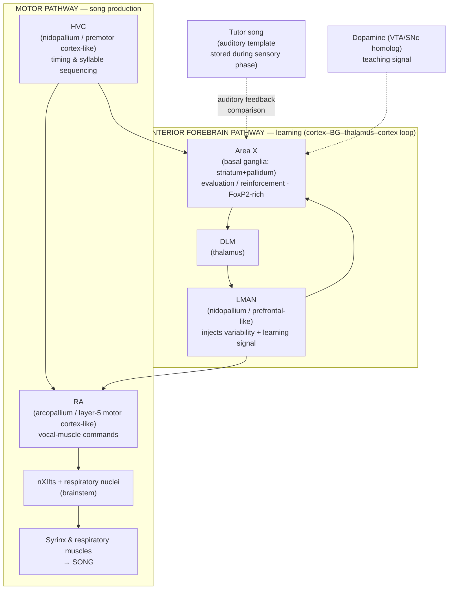
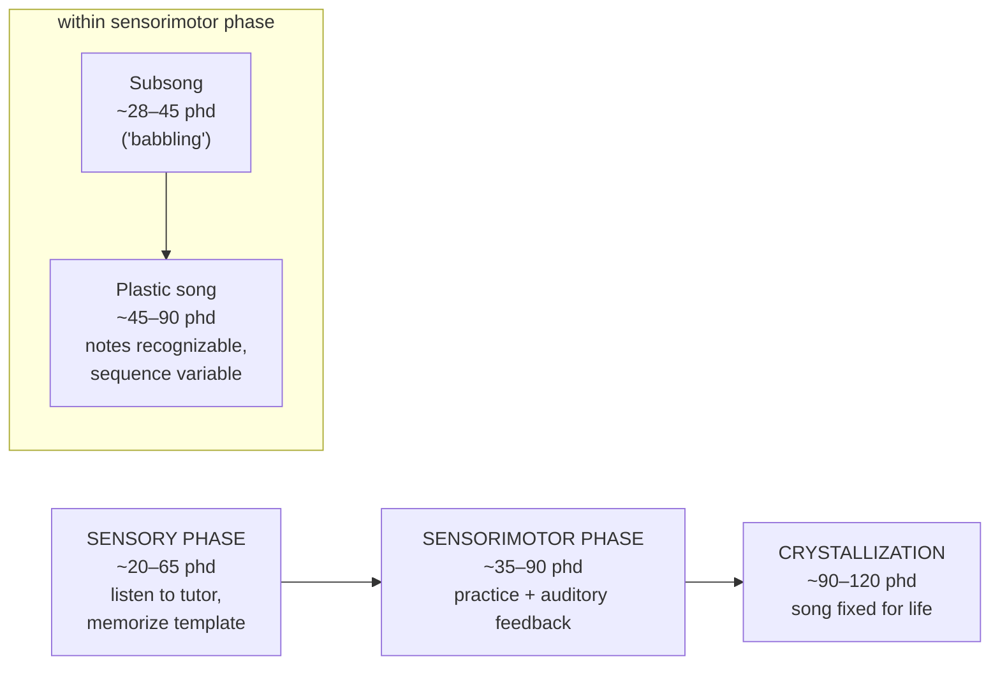

# The Songbird Brain: The Premier Model for Vocal Learning

> *"The bird a nest, the spider a web, man friendship."* — William Blake. But among all these builders, only a handful of animals build their communication signals the way a human child builds speech: by listening, imitating, practicing, and refining. The songbird is the animal that taught neuroscience how that is done in a brain.

## Introduction

Most animal vocalizations are innate. A chicken raised in silence still clucks; a dog raised among cats still barks. These sounds are wired in, produced correctly the first time without any model to copy. **Vocal learning** — the capacity to acquire vocalizations by imitating a heard model, and to modify them through auditory feedback — is spectacularly rare. Among mammals it is found only in humans, cetaceans, some bats, elephants, and pinnipeds. Among birds it evolved independently in three groups: the **oscine songbirds**, the **parrots**, and the **hummingbirds**.

Of all these, the songbird has become the single most productive model system for understanding how a brain learns to produce a complex, sequential motor behavior from a sensory template. There are three reasons. First, songbird vocal learning is behaviorally and developmentally *parallel to human speech acquisition* to a degree no other animal offers. Second, the neural machinery for song is packaged into a small set of discrete, well-defined brain nuclei — a **"song system"** — that can be lesioned, recorded, imaged, and molecularly dissected with a precision impossible for the diffuse language circuitry of the human brain. Third, three iconic species — the **zebra finch** (*Taeniopygia guttata*), the **Bengalese finch** (*Lonchura striata domestica*), and the **canary** (*Serinus canaria*) — are hardy, cheap, breed readily in captivity, and learn on a convenient timescale.

The study of this system has done more than illuminate birdsong. It **overturned one of the most entrenched dogmas in twentieth-century neuroscience** — that the adult brain produces no new neurons — and it **rewrote the textbook picture of the bird brain itself**, revealing that birds possess a genuine pallium (cortex-equivalent), not a glorified reptilian lump of basal ganglia. This document surveys the song-control circuitry, the learning process, the neurogenesis discovery, the FoxP2 gene, sexual dimorphism, the human-speech analogy, the avian-brain nomenclature revision of 2004–2005, and the limits of the model.

---

## Table of Contents

1. [Why Songbirds Are the Leading Vocal-Learning Model](#1-why-songbirds-are-the-leading-vocal-learning-model)
2. [The Song-Control System: Two-Pathway Architecture](#2-the-song-control-system-two-pathway-architecture)
   - [The Motor Pathway](#the-motor-pathway-production)
   - [The Anterior Forebrain Pathway](#the-anterior-forebrain-pathway-learning)
   - [Circuit Diagram](#circuit-diagram)
3. [Sensorimotor Learning: Template, Practice, Crystallization](#3-sensorimotor-learning-template-practice-crystallization)
4. [Adult Neurogenesis: How the Canary Broke a Dogma](#4-adult-neurogenesis-how-the-canary-broke-a-dogma)
5. [FoxP2: A Shared Gene for Vocal Learning](#5-foxp2-a-shared-gene-for-vocal-learning)
6. [Sexual Dimorphism of the Song System](#6-sexual-dimorphism-of-the-song-system)
7. [Analogy to Human Speech and Cortico–Basal Ganglia Loops](#7-analogy-to-human-speech-and-corticobasal-ganglia-loops)
8. [Rewriting the Bird Brain: The 2004–2005 Nomenclature Revision](#8-rewriting-the-bird-brain-the-20042005-nomenclature-revision)
9. [Limitations of the Model](#9-limitations-of-the-model)
10. [Sources](#sources)

---

## 1. Why Songbirds Are the Leading Vocal-Learning Model

Vocal learning is defined by a specific set of properties, and songbirds exhibit nearly all of them in a form that mirrors human speech development:

| Feature of vocal learning | Human speech | Songbird song | Innate caller (e.g., dove, chicken) |
|---|---|---|---|
| Requires exposure to a model (tutor) | Yes | Yes | No |
| Critical / sensitive period in development | Yes | Yes | — |
| Early "babbling" stage of unstructured sound | Yes (babbling) | Yes (**subsong**) | No |
| Auditory feedback needed to develop & maintain | Yes | Yes | No |
| Deafening disrupts development | Yes | Yes | No |
| Dedicated forebrain circuit distinct from innate calls | Yes | Yes | — |
| Dialects / individual & regional variation | Yes | Yes (esp. canaries, sparrows) | No |

Songbirds are **oscine passerines** — roughly 4,000–5,000 species, about half of all living birds. Within the lab, three species dominate for complementary reasons:

- **Zebra finch** — the workhorse. A **closed-ended (age-limited) learner**: it learns one song from a tutor during a fixed juvenile window and then sings essentially that same short, stereotyped "motif" for the rest of its life. This stereotypy is a gift to neuroscience: a crystallized zebra-finch song is so reproducible from rendition to rendition that neural activity can be aligned to the millisecond, making it ideal for studying the *neural code* for a learned motor sequence.
- **Bengalese finch** (also called the society finch) — favored for studying **song syntax** and the role of **auditory feedback**. Its song has probabilistic branch points in note sequencing (variable "syntax"), and adults rapidly degrade their song when deafened, making it a premier model for feedback-dependent maintenance and for reinforcement-learning studies of song.
- **Canary** — an **open-ended learner** that modifies and adds new song syllables seasonally, year after year. This seasonal plasticity, driven by hormones and accompanied by seasonal brain growth, was the entry point to the discovery of adult neurogenesis.

The behavior can be manipulated cleanly (tutoring, isolation, deafening, live vs. tape tutors, operant song-triggered playback), the circuit is discrete and stereotyped across individuals, and the animals are experimentally tractable. No other vocal learner combines all three advantages.

---

## 2. The Song-Control System: Two-Pathway Architecture

The song system is a set of interconnected forebrain and brainstem nuclei discovered and mapped by Fernando Nottebohm and colleagues beginning in the 1970s. Its central design principle is a **division of labor between two pathways that both originate in the nucleus HVC** and reconverge on the premotor nucleus RA:

1. A **posterior motor pathway** that directly *produces* song (the "how-to-sing" circuit).
2. An **anterior forebrain pathway (AFP)** — a cortico–basal-ganglia–thalamo–cortical loop — that is required to *learn* and *adaptively modify* song but not to produce already-learned song (the "how-to-learn / fine-tune" circuit).

A note on names: **HVC** is now used as a proper name, no longer an acronym; it historically stood for "high vocal center" or "hyperstriatum ventrale, pars caudale." **RA** is the *robust nucleus of the arcopallium*. **Area X** is a song-dedicated nucleus of the basal ganglia (striatopallidum). **LMAN** is the *lateral magnocellular nucleus of the anterior nidopallium*. **DLM** is the *medial nucleus of the dorsolateral thalamus*.

### Nuclei at a glance

| Nucleus | Brain division (new nomenclature) | Mammalian analog | Pathway | Primary role |
|---|---|---|---|---|
| **HVC** | Nidopallium (pallium/"cortex") | Premotor / higher-order cortex | Both (branch point) | Master clock; sequences syllables; splits into two projection cell types |
| **RA** | Arcopallium (pallium) | Layer-5 motor cortex | Motor | Encodes moment-to-moment vocal-muscle commands |
| **Area X** | Medial striatum + pallidum (basal ganglia) | Striatum + globus pallidus | AFP | Basal-ganglia computation; reinforcement/evaluation; FoxP2-rich |
| **DLM** | Dorsal thalamus | Motor thalamus (VA/VL) | AFP | Thalamic relay back to cortex-equivalent |
| **LMAN** | Nidopallium (pallium) | Prefrontal / premotor cortex | AFP output | Injects vocal variability ("exploration"); carries learning signal to RA |
| **nXIIts** | Brainstem (medulla) | Hypoglossal motor nucleus | Motor output | Motor neurons driving the **syrinx** (avian vocal organ) |
| **RAm/PAm** | Brainstem | Respiratory premotor | Motor output | Coordinate expiration/inspiration with vocalization |

### The Motor Pathway (Production)

The motor pathway is a descending, largely feed-forward chain:

**HVC → RA → nXIIts (and respiratory nuclei RAm/PAm) → syrinx & respiratory muscles.**

- **HVC** acts as the timekeeper. Its RA-projecting neurons fire in an extraordinarily sparse, precise pattern: each such neuron produces a single brief burst at one specific moment in the song, and the population tiles the entire motif like a chain of dominoes. This "synfire-chain"-like sequence is widely interpreted as the clock that drives song timing.
- **RA** transforms HVC's sparse timing signal into the detailed, muscle-by-muscle motor commands. RA neurons are the songbird analog of layer-5 cortical motor-output neurons.
- **nXIIts** (the tracheosyringeal part of cranial nerve XII) drives the **syrinx**, the bird's uniquely avian vocal organ located at the junction of the bronchi, which has two independently controllable sound sources — allowing some songbirds to sing two notes at once.

Lesioning any link in this chain in an adult abolishes or grossly distorts song immediately. This is the circuit that *is* the learned program.

### The Anterior Forebrain Pathway (Learning)

The AFP is a loop that branches off HVC and eventually feeds back onto RA:

**HVC → Area X (basal ganglia) → DLM (thalamus) → LMAN (pallium) → RA** (and LMAN also loops back to Area X).

This is homologous, region-by-region, to the mammalian **cortex → striatum → thalamus → cortex** loop. Its defining property is revealed by lesions:

- Lesioning the AFP (e.g., LMAN or Area X) in a **juvenile** devastates song learning — the bird fails to imitate its tutor and its song crystallizes prematurely and abnormally.
- Lesioning the AFP in an **adult** with already-crystallized song has little immediate effect on the song itself.

So the AFP is not needed to *play back* a learned song; it is needed to *acquire and adaptively adjust* it. Two of its jobs are now well established:

1. **Generating exploratory variability.** LMAN's output to RA actively injects trial-to-trial variability into song — the neural equivalent of the "noise" an actor-critic reinforcement-learning algorithm needs to explore the space of possible motor outputs. When LMAN is inactivated, an immature or plastic song becomes suddenly more stereotyped; the variability was being *added* by LMAN, not merely tolerated.
2. **Carrying an instructive/evaluative signal.** Area X (basal ganglia) is thought to evaluate song against the memorized template using auditory feedback, computing something like a reward-prediction error, and the loop biases future motor output toward better matches. Dopaminergic input to Area X (from the ventral tegmental area/substantia nigra homolog) supplies the teaching signal, exactly as dopamine does in mammalian basal-ganglia reinforcement learning.

### Circuit Diagram

Solid arrows = direct projections; dotted = modulatory/feedback influences. The two pathways share the entry point **HVC** and the exit point **RA**, but only the AFP passes through the basal ganglia and thalamus.

---

## 3. Sensorimotor Learning: Template, Practice, Crystallization

Song learning unfolds in overlapping phases that map remarkably well onto human speech development. The timeline below is for the zebra finch (measured in **post-hatch days, phd**); canaries and other species differ in duration and open-endedness.

### The phases

1. **Sensory (template-acquisition) phase (~20–65 phd).** The juvenile listens to a tutor (its father, in the wild) and forms a stored auditory memory — the **template** — of the target song. Crucially, *no singing is required yet*: the bird can memorize the template weeks before it attempts to reproduce it. Isolating a bird from any tutor during this window produces an abnormal, impoverished **"isolate song."**

2. **Sensorimotor (practice) phase (~35–90 phd), overlapping the sensory phase.** The bird now sings and uses **auditory feedback** to iteratively match its own output to the stored template. This phase itself has sub-stages:
   - **Subsong (~28–45 phd)** — soft, rambling, highly variable vocalizations with no clear structure. This is the direct analog of human infant **babbling**, and like babbling it depends on the variability-generating AFP (LMAN).
   - **Plastic song (~45–90 phd)** — recognizable syllable types begin to emerge, but their ordering, duration, and acoustic details remain variable and are progressively refined toward the template.

3. **Crystallization (~90–120 phd).** Song becomes **stereotyped and stable**, "locked in" as the adult motif. In closed-ended learners like the zebra finch this is permanent; the sensitive period closes and the template can no longer be replaced. In open-ended learners like the canary, plasticity re-opens seasonally and new syllables are added year after year.

### Feedback and the role of the two pathways in learning

- **Deafening** a juvenile before crystallization prevents normal song from developing at all — proof that the bird is matching its output to a *heard* target, not executing a fixed genetic program.
- **Deafening an adult** slowly degrades even a crystallized song over weeks to months (dramatically in Bengalese finches), showing that auditory feedback continues to *maintain* the motor program.
- The **AFP generates the exploratory variability** (via LMAN) that the practice phase needs, and **evaluates** feedback against the template (via Area X and dopaminergic reinforcement). As crystallization proceeds, the motor pathway becomes increasingly autonomous, and LMAN's variable drive to RA wanes.

This decomposition — **memorize a target, generate variable attempts, evaluate against the target with a reinforcement signal, and consolidate the successful pattern** — is precisely the logic of trial-and-error reinforcement learning, and it is one of the clearest biological instantiations of an actor–critic learning architecture known.

---

## 4. Adult Neurogenesis: How the Canary Broke a Dogma

For most of the twentieth century, neuroscience held as near-axiom the doctrine attributed to Santiago Ramón y Cajal: in the adult brain, *"everything may die, nothing may be regenerated."* The mammalian brain, it was believed, is furnished with its full complement of neurons early in life and produces no new ones thereafter.

The songbird demolished this dogma.

Fernando Nottebohm, studying **canaries** at Rockefeller University, was drawn by a striking natural phenomenon: canaries learn new songs each breeding season, and their song-control nuclei (HVC and RA) **grow and shrink seasonally** — larger in spring when males sing complex courtship song, smaller afterward. Investigating the cellular basis of this seasonal plasticity, Nottebohm and his colleagues made a series of landmark observations in the early-to-mid 1980s:

- **Goldman & Nottebohm (1983)** used tritiated-thymidine labeling to show *neuronal production, migration, and differentiation in the HVC of the adult female canary brain* — brand-new neurons being born, migrating in, and maturing in a fully adult brain.
- **Paton & Nottebohm (1984)** demonstrated that these newly generated cells were **functional neurons**, firing action potentials and becoming incorporated into working circuits — not glia, not inert cells.
- Subsequent work showed that new neurons are continuously **added and turned over** in HVC throughout adult life, born in the ventricular zone lining the lateral ventricle and migrating along glial guides into the nucleus, where they **replace older neurons of the same type** (specifically the HVC→RA projection neurons of the motor pathway) that die off.

### Why it mattered

This was the first rigorous, widely accepted demonstration of **adult neurogenesis in a vertebrate**, and it directly challenged the "no new neurons" dogma. It reframed the adult brain as a structure capable of large-scale cellular renewal, and it created the intellectual and methodological groundwork for the later (initially controversial, now accepted) findings of adult neurogenesis in the **mammalian** hippocampus (dentate gyrus) and olfactory bulb. The songbird supplied both the proof of principle and the demonstration that new neurons could be *behaviorally relevant* — plausibly tied to learning and seasonally changing song.

| Milestone | Year (approx.) | Contribution |
|---|---|---|
| Song nuclei mapped; sexual dimorphism described (Nottebohm & Arnold) | 1976 | Discrete "song system"; HVC ~8× larger in males |
| Seasonal size changes of song nuclei | early 1980s | Adult structural plasticity linked to seasonal singing |
| Neuronal birth in adult canary HVC (Goldman & Nottebohm) | 1983 | First strong evidence of adult neurogenesis |
| New cells shown to be functional neurons (Paton & Nottebohm) | 1984 | New neurons integrate into working circuits |
| Neuronal replacement / turnover in HVC | mid-1980s | New neurons replace dying ones of the same type |

A subtle later twist — sometimes called the **"zebra finch paradox"** — is that in zebra finches the number of HVC neurons roughly *doubles* over the animal's life even though the crystallized song barely changes, showing that ongoing neuron addition is not always about acquiring *new* song, and that its function is still being worked out.

---

## 5. FoxP2: A Shared Gene for Vocal Learning

**FOXP2** is a transcription factor famous as the first gene implicated in a heritable human **speech and language disorder**. Members of the human "KE family" carrying a mutation in FOXP2 show **developmental verbal dyspraxia** — profound difficulty coordinating the fine orofacial movements of speech — alongside broader language deficits. FOXP2 is not a "language gene" in any simple sense, but it is essential to the neural systems that support learned vocal-motor control.

The songbird provides the key comparative evidence that FoxP2's role in vocal learning is **deep and conserved**:

- In songbirds, **FoxP2 is strongly enriched in Area X**, the basal-ganglia nucleus of the learning pathway — precisely the striatal region homologous to the human anterior striatum where FOXP2 is prominent.
- FoxP2 expression in Area X is **developmentally regulated**: it is elevated during the juvenile sensitive period when song is being learned and declines around sexual maturity as learning ends.
- FoxP2 is also **behaviorally regulated on a fast timescale**: when a bird practices singing, FoxP2 in Area X is *acutely downregulated*, and this dip is associated with increased vocal variability — consistent with FoxP2 gating the plasticity/exploration needed for practice.
- **Experimental knockdown of FoxP2 in Area X** (via viral RNA interference, work led by Constance Scharff and colleagues) produced birds that **imitated their tutor song incompletely and inaccurately**, with imprecise and variable syllable copying. Conversely, *over*-expressing FoxP2 to block its normal practice-driven downregulation *also* disrupted accurate imitation. Thus both the level *and* the dynamic regulation of FoxP2 must be right for normal learning.

FOXP2 acts on downstream targets governing dendritic spine density, synaptic plasticity, and neurite growth — the cellular substrates of learning. The convergence is striking: the **same transcription factor**, in the **same basal-ganglia region**, is required for learned vocal-motor imitation in a bird and in a human. FoxP2 is one of the clearest molecular bridges between birdsong and human speech.

---

## 6. Sexual Dimorphism of the Song System

In most temperate songbirds, including the zebra finch, **males sing and females (largely) do not** — and the song system is one of the most dramatically **sexually dimorphic** neural circuits known in vertebrates.

- Nottebohm and Arnold's foundational **1976** paper reported that **HVC is roughly 8–10× larger in male zebra finches** than in females, with corresponding differences in RA and Area X. Female zebra-finch HVC and RA have fewer and smaller neurons, and RA neurons have less extensive dendritic arbors.
- These differences are established during development and are heavily influenced by **hormones**. In a now-classic and somewhat paradoxical finding, **estradiol (an estrogen)**, not testosterone, is the potent **masculinizing** agent for the developing zebra-finch song system: treating hatchling females with estrogen early in life, followed by testosterone in adulthood, can **masculinize** the song nuclei and enable these females to sing male-like courtship song. Even a brief early estrogen pulse can cause females to *retain* a functional vocal-learning system into adulthood rather than letting it regress.
- The song nuclei richly express **androgen and estrogen receptors**, and this steroid sensitivity underlies both the developmental dimorphism and the **seasonal** growth and shrinkage of song nuclei in open-ended learners like the canary.

Not all songbirds fit the "only males sing" pattern. In many tropical species, and in duetting songbirds, **females sing too**, and the sex difference in song-nucleus size is correspondingly reduced or absent — a reminder that the zebra-finch pattern, though canonical in the lab, is not universal. Female song is increasingly recognized as ancestral in songbirds, with male-biased singing a derived specialization in some lineages.

The song system has therefore doubled as a premier model for studying how **sex differences in the brain** arise from the interplay of genes (including sex-chromosome genes) and steroid hormones.

---

## 7. Analogy to Human Speech and Cortico–Basal Ganglia Loops

The songbird is valuable *because* of a set of deep analogies to the human speech system — and it is important to be precise about which parallels are homologies (shared inheritance) and which are convergences (independent evolution of similar solutions).

### The two-pathway parallel

Humans, like songbirds, appear to have **two vocal pathways**:

- A **posterior motor pathway**: (song) HVC → RA → brainstem vocal motor neurons ≈ (speech) face/laryngeal motor cortex → brainstem/spinal vocal motor neurons. This drives the actual production of vocalization.
- An **anterior learning pathway** running through the **basal ganglia and thalamus**: (song) HVC → Area X → DLM → LMAN → RA ≈ (speech) a strip of premotor/prefrontal cortex → anterior striatum → anterior thalamus → cortex. This is required for *learning* and *fine motor control*.

### Cortico–basal-ganglia–thalamo–cortical loops

The AFP is a genuine **cortex → basal ganglia → thalamus → cortex loop**, structurally and functionally homologous (as loop architecture) to the mammalian circuits that underlie motor-skill and reinforcement learning. Key shared features:

- **Dopaminergic teaching signals** into the striatal component (Area X ↔ mammalian striatum) drive reinforcement learning.
- The basal-ganglia loop supports **trial-and-error refinement** of a motor skill against an internal goal — song against template, speech against a heard word.
- The loop **injects and then withdraws motor variability** across development, an exploration–exploitation trade-off common to skill learning generally.

### Molecular convergence

Comparative transcriptomics (Erich Jarvis, Andreas Pfenning, and colleagues) has revealed **convergent gene-expression specializations** in the song-motor nucleus **RA** and the human **laryngeal motor cortex** — independently evolved brain regions that nonetheless up- and down-regulate an overlapping set of genes. Because vocal learning arose separately in songbirds, parrots, hummingbirds, and humans, these shared molecular signatures suggest there are only a limited number of ways for a brain to build a learned-vocalization circuit.

### Where the analogy is convergent, not homologous

Songbirds and humans last shared a common ancestor over 300 million years ago, an animal that was certainly *not* a vocal learner. So the *song system as a specialized circuit* is a case of **convergent evolution**: similar circuits built independently on a shared vertebrate brain plan. The value of the model rests on the fact that convergent solutions to the *same computational problem* (learn a motor sequence from a sensory template using feedback) reveal general principles — including "mirror-neuron"-like auditory–motor neurons in HVC that respond both when the bird hears a song and when it sings it, echoing sensorimotor mirror systems proposed for human speech.

| Aspect | Homology or convergence? | Notes |
|---|---|---|
| Overall vertebrate brain plan (pallium, basal ganglia, thalamus) | Homology | Shared inheritance |
| Basal-ganglia–thalamo-cortical *loop architecture* | Homology | Ancient vertebrate circuit motif |
| The dedicated *song/speech* nuclei themselves | Convergence | Evolved independently in each vocal-learning lineage |
| Molecular specializations of RA vs. laryngeal motor cortex | Convergence | Independent recruitment of overlapping genes |
| FoxP2's role in striatal vocal-motor learning | Deep conservation | Same gene, same region, same behavioral requirement |

---

## 8. Rewriting the Bird Brain: The 2004–2005 Nomenclature Revision

To appreciate this section you must know the old, wrong picture. For roughly a century, the standard names for bird-brain regions — set largely by Ludwig Edinger around 1900 — encoded a **false theory of evolution**. Edinger believed the vertebrate brain evolved by adding layers, with the "old" reptilian/avian brain being essentially all **basal ganglia (striatum)** and only mammals evolving a true cortex. Accordingly, most of the bird's telencephalon was given names containing the root **"striatum"** — *neostriatum, hyperstriatum, archistriatum, paleostriatum* — implying it was primitive, instinct-driven basal ganglia, incapable of the flexible cognition and learning associated with cortex.

This was **profoundly incorrect**, and by the late twentieth century the evidence against it was overwhelming: developmental origin, connectivity, neurochemistry, and gene-expression data all showed that the great bulk of the avian telencephalon derives from and functions like **pallium (cortex-equivalent)**, not striatum. The song system was a prime exhibit — HVC and RA behave like premotor and motor *cortex*, not like basal ganglia.

In **2004**, a large international consortium — the **Avian Brain Nomenclature Forum**, with **Anton Reiner, Erich Jarvis, Harvey Karten** and many others — published a **revised nomenclature** (*Reiner et al., 2004; Jarvis et al., 2005, "Avian brains and a new understanding of vertebrate brain evolution," Nature Reviews Neuroscience*). The revision:

- **Abolished the misleading "striatum" names** for pallial regions and replaced them with **"-pallium"** terms.
- Recognized that the bird forebrain has a genuine **pallium** organized into the dorsal **hyperpallium** (the Wulst) and, forming the large **dorsal ventricular ridge (DVR)**, the **mesopallium, nidopallium, and arcopallium**. The true basal ganglia (striatum and pallidum) are a comparatively small ventral region.

Song-system relabeling under the new scheme:

| Old name | New name | Division |
|---|---|---|
| HVC (hyperstriatum ventrale, caudal) | **HVC** (retained as proper name) | Nidopallium (pallium) |
| RA — *robustus archistriatalis* | **RA** — *robust nucleus of the arcopallium* | Arcopallium (pallium) |
| Area X (within paleostriatum) | **Area X** | Striatopallidum (true basal ganglia) |
| LMAN (in neostriatum) | **LMAN** — lateral magnocellular nucleus of **anterior nidopallium** | Nidopallium (pallium) |

The conceptual payoff is large. The revision **retired the "primitive bird brain" idea** and established that birds possess a functional cortex-equivalent capable of sophisticated learning and cognition — precisely what the song system demonstrates. It also *clarified* the human-speech analogy: HVC/RA/LMAN are the bird's **pallial (cortex-like)** components, while Area X is its genuine **basal ganglia**, so the AFP really is a cortex–basal-ganglia–thalamus–cortex loop, not (as the old names implied) an all-basal-ganglia circuit. Far from being an embarrassing footnote about naming, the revision realigned bird neuroanatomy with a modern understanding of vertebrate brain evolution.

---

## 9. Limitations of the Model

The songbird is powerful but not a miniature human. Its limits should be stated plainly:

- **Song is not language.** Birdsong has learned acoustic structure and sequencing ("phonological syntax"), but it lacks **semantics** and **compositional grammar**: syllables do not combine to encode meanings the way words and morphemes do. Song is closer to the *articulatory-phonological* and *vocal-learning* substrate of speech than to language proper. Claims that map birdsong onto human syntax should be treated cautiously.

- **Convergent, not homologous, specialized circuits.** Because the song system evolved independently, specific wiring details may reflect avian-particular solutions rather than principles that generalize to mammals. The parallels are strongest at the level of *computational strategy* and *loop architecture*, weaker at the level of one-to-one nucleus correspondence.

- **Species idiosyncrasies limit generalization.** The zebra finch's convenient, ultra-stereotyped, one-motif song is exactly what makes it experimentally powerful — and also atypical. Its closed-ended learning, extreme sexual dimorphism, and single crystallized song differ markedly from open-ended learners (canaries), variable-syntax singers (Bengalese finches), large-repertoire species, and duetting tropical songbirds. What is true of one species' song system is not automatically true of another's.

- **Sex bias.** Because females of the classic lab species sing little or not at all, most song-system neuroscience is built on **males**, and female neural circuitry (and female song, which is ancestral and widespread) has been comparatively neglected — a gap now being actively corrected.

- **Adult neurogenesis does not transfer cleanly to mammals.** The songbird proved adult neurogenesis is real and can be large-scale, but the *extent* and *functional role* of adult neurogenesis in the human brain remains actively debated and is clearly far more restricted than in the avian song system. The bird overturned a dogma; it did not settle the mammalian details.

- **FoxP2 is not a "language gene."** FoxP2's conserved role in vocal-motor learning is genuine and important, but it is a broadly acting transcription factor involved in many tissues and behaviors; the songbird evidence constrains, rather than simplifies, our picture of the genetics of speech.

- **The template is a black box.** A central abstraction of the field — the stored auditory "template" against which song is matched — has been enormously fruitful but is still not fully localized or mechanistically explained at the circuit level. Much of the learning theory rests on this inferred entity.

Held within these bounds, the songbird remains the most complete animal model of vocal learning available — the system in which a learned, sequential, feedback-dependent motor skill can be traced from a defined circuit, through identified cell types and molecules, to the note-by-note behavior it produces.

---

## Sources

**Song-control circuitry and two-pathway architecture**
- [Anatomy of a songbird basal ganglia circuit essential for vocal learning and plasticity (PMC)](https://pmc.ncbi.nlm.nih.gov/articles/PMC2822067/)
- [Song Control System — overview (ScienceDirect Topics)](https://www.sciencedirect.com/topics/medicine-and-dentistry/song-control-system)
- [High Vocal Center — overview (ScienceDirect Topics)](https://www.sciencedirect.com/topics/medicine-and-dentistry/high-vocal-center)
- [Songbird Neuroanatomy (Univ. of Illinois Neuroproteomics)](https://neuroproteomics.scs.illinois.edu/songbird/neuroanatomy.html)
- [Corticobasal ganglia projecting neurons are required for juvenile vocal learning but not for adult vocal plasticity (PNAS)](https://www.pnas.org/doi/10.1073/pnas.1913575116)
- [Neural mechanisms for learned birdsong (Learning & Memory)](https://learnmem.cshlp.org/content/16/11/655.full)

**Learning phases: template, sensorimotor practice, crystallization**
- [The Development of Birdsong (Nature Scitable)](https://www.nature.com/scitable/knowledge/library/the-development-of-birdsong-16133266/)
- [Quantifying song bout production during zebra finch sensory-motor learning suggests a sensitive period for vocal practice (PMC)](https://pmc.ncbi.nlm.nih.gov/articles/PMC4264566/)
- [Mechanisms and time course of vocal learning and consolidation in the adult songbird (PMC)](https://pmc.ncbi.nlm.nih.gov/articles/PMC3191835/)
- [The Neural Basis of Birdsong (PLOS Biology)](https://journals.plos.org/plosbiology/article?id=10.1371%2Fjournal.pbio.0030164)

**Adult neurogenesis (Nottebohm and colleagues)**
- [Discovering Nerve Cell Replacement in the Brains of Adult Birds (Rockefeller Centennial)](https://centennial.rucares.org/index.php?page=Brain_Generates_Neurons)
- [Goldman, S. A. & Nottebohm, F. (1983), Neuronal production, migration, and differentiation in a vocal control nucleus of the adult female canary brain, PNAS 80:2390–2394 (ResearchGate)](https://www.researchgate.net/publication/16623296_Goldman_S_A_Nottebohm_F_Neuronal_production_migration_and_differentiation_in_a_vocal_control_nucleus_of_the_adult_female_canary_brain_Proc_Natl_Acad_Sci_USA_80_2390-2394)
- [The History of Discovery of Adult Neurogenesis (Owji, 2020, Clinical Anatomy)](https://onlinelibrary.wiley.com/doi/10.1002/ca.23447)
- [Why Are Some Neurons Replaced in Adult Brain? (Journal of Neuroscience)](https://www.jneurosci.org/content/22/3/624)
- [The Zebra Finch Paradox: Song Is Little Changed, But Number of Neurons Doubles (PMC)](https://pmc.ncbi.nlm.nih.gov/articles/PMC6621147/)

**FoxP2 and vocal learning**
- [Incomplete and Inaccurate Vocal Imitation after Knockdown of FoxP2 in Songbird Basal Ganglia Nucleus Area X (PLOS Biology)](https://journals.plos.org/plosbiology/article?id=10.1371%2Fjournal.pbio.0050321)
- [Behavior-Linked FoxP2 Regulation Enables Zebra Finch Vocal Learning (Journal of Neuroscience)](https://www.jneurosci.org/content/35/7/2885)
- [FoxP2 isoforms delineate spatiotemporal transcriptional networks for vocal learning in the zebra finch (PMC)](https://www.ncbi.nlm.nih.gov/pmc/articles/PMC5826274/)
- [Young and intense: FoxP2 immunoreactivity in Area X varies with age, song stereotypy, and singing (Frontiers)](https://www.frontiersin.org/journals/neural-circuits/articles/10.3389/fncir.2013.00024/full)

**Sexual dimorphism and hormones**
- [Estrogen and sex-dependent loss of the vocal learning system in female zebra finches (PMC)](https://pmc.ncbi.nlm.nih.gov/articles/PMC7996629/)
- [Sex Difference in the Size of the Neural Song Control Regions in a Duetting Songbird (Journal of Neuroscience)](https://www.jneurosci.org/content/18/3/1124)
- [Using Digital Images of the Zebra Finch Song System as a teaching tool (CBE—Life Sciences Education)](https://www.lifescied.org/doi/pdf/10.1187/cbe.11-01-0002)

**Human-speech analogy and convergent evolution**
- [Analogies of human speech and bird song: from vocal learning behavior to its neural basis (PMC)](https://pmc.ncbi.nlm.nih.gov/articles/PMC9992734/)
- [Learned Birdsong and the Neurobiology of Human Language (PMC)](https://pmc.ncbi.nlm.nih.gov/articles/PMC2485240/)
- [Convergent transcriptional specializations in the brains of humans and song-learning birds (PMC)](https://pmc.ncbi.nlm.nih.gov/articles/PMC4385736/)
- [Evolution of vocal learning and spoken language (Science)](https://www.science.org/doi/10.1126/science.aax0287)

**Avian brain nomenclature revision (2004–2005)**
- [Revised nomenclature for avian telencephalon and some related brainstem nuclei (PubMed — Reiner et al., 2004)](https://pubmed.ncbi.nlm.nih.gov/15116397/)
- [Organization and evolution of the avian forebrain (Reiner, 2005, Anatomical Record)](https://anatomypubs.onlinelibrary.wiley.com/doi/10.1002/ar.a.20253)
- [Avian pallium (Wikipedia overview)](https://en.wikipedia.org/wiki/Avian_pallium)
- [As above, so below: molecular similarities between avian dorsal and ventral pallial subdivisions (PMC)](https://pmc.ncbi.nlm.nih.gov/articles/PMC8251894/)
