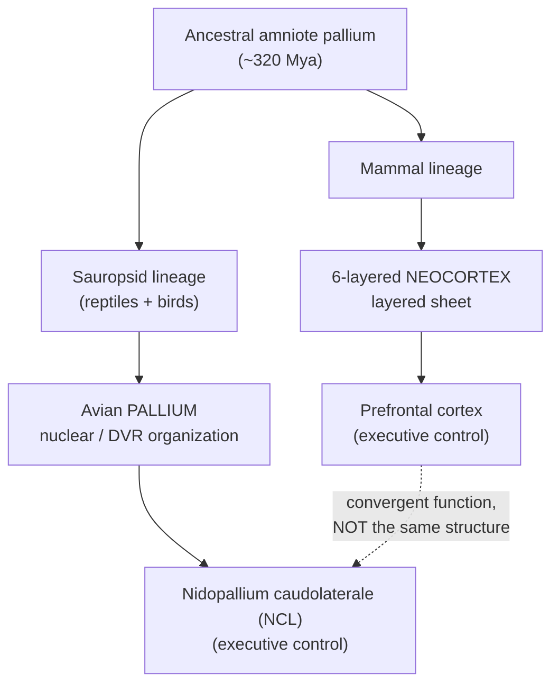
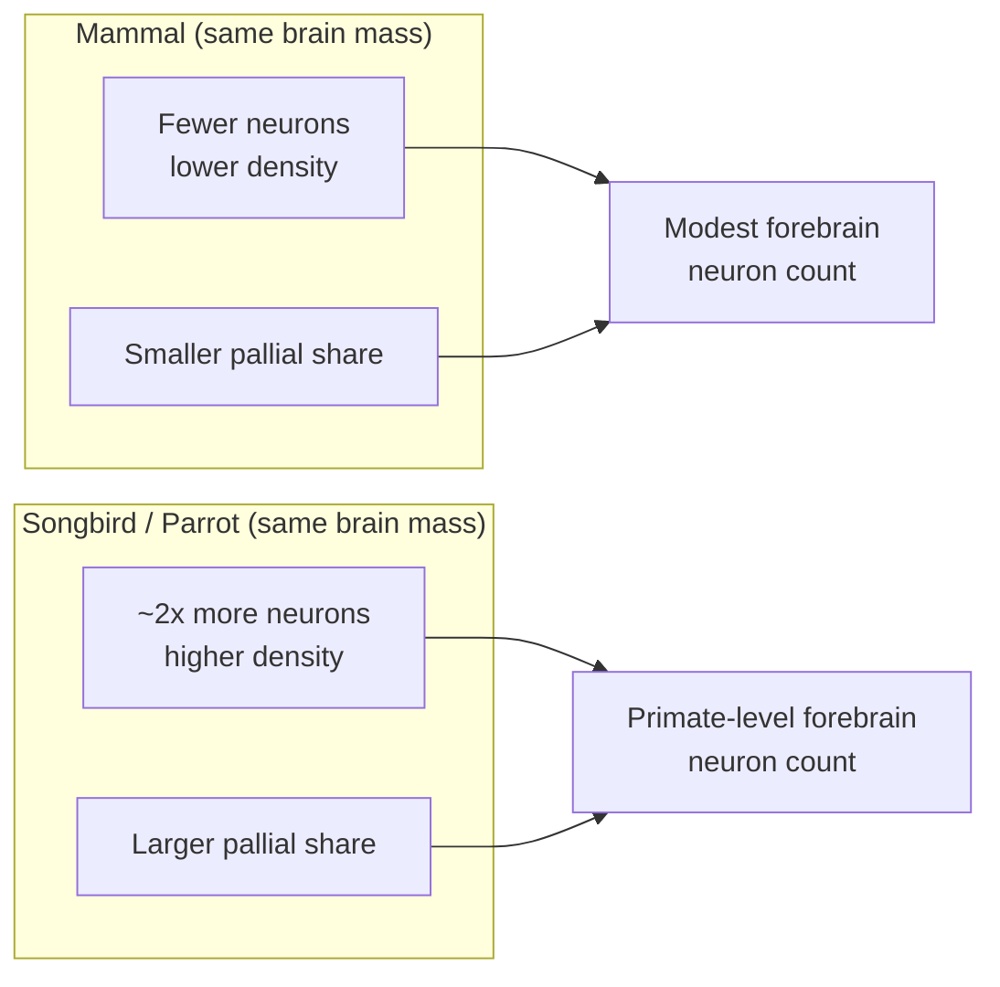
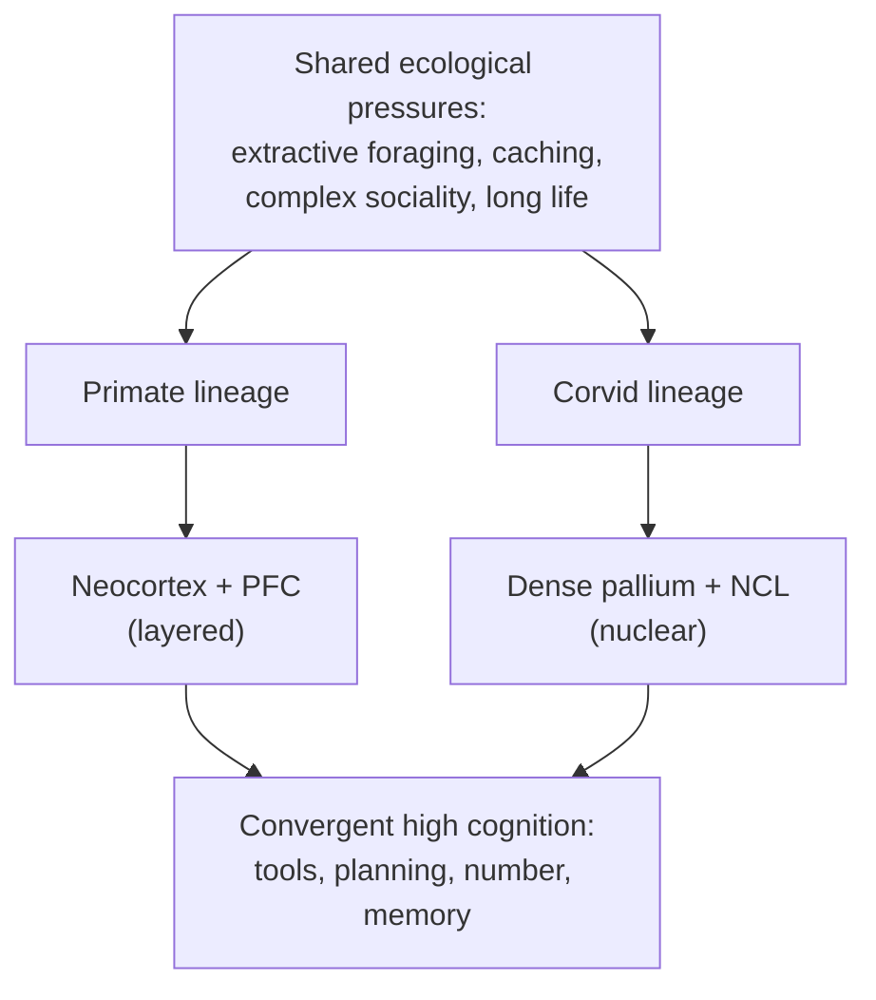

# The Corvid Brain & Cognition: The "Feathered Apes"

> How crows, ravens, jays, and magpies rival great apes on cognitive tests — with brains the size of a walnut and no neocortex at all.

## Introduction

For most of the twentieth century, "bird-brained" was an insult. The prevailing view held that the avian forebrain was little more than an overgrown basal ganglia — a machine for instinct and reflex, incapable of the flexible, reasoned behavior we associate with the mammalian cerebral cortex. That view is now dead.

Corvids — the family Corvidae, comprising crows, ravens, jays, magpies, jackdaws, rooks, and nutcrackers — routinely pass cognitive tests once thought diagnostic of great-ape or even young-child intelligence. New Caledonian crows manufacture hooked tools and combine parts into novel compound tools. Western scrub-jays remember *what* they cached, *where*, and *how long ago*, and adjust retrieval accordingly. Ravens plan for events hours in the future and barter with self-control. Rooks and crows solve water-displacement puzzles straight out of Aesop. And single neurons in a crow's forebrain track not just what the bird sees but what it *reports* seeing — a possible neural signature of conscious perception.

This is startling because corvids achieve all of this with a brain that weighs only a few grams and, crucially, has **no neocortex** — no six-layered sheet of cells that in mammals is the seat of higher cognition. The corvid story is therefore one of the most compelling cases of **convergent evolution** in biology: two lineages that last shared a common ancestor roughly **320 million years ago** independently evolved brains capable of similar feats, built from very different parts. This document surveys why that happened, the neuroanatomy that makes it possible, the landmark cognitive findings, and — importantly — the limits and interpretive hazards of the strong claims.

---

## Table of Contents

1. [Why "Feathered Apes"?](#1-why-feathered-apes)
2. [The Avian Brain Is Not a Primitive Brain](#2-the-avian-brain-is-not-a-primitive-brain)
3. [The Nidopallium Caudolaterale: An Avian Prefrontal Cortex](#3-the-nidopallium-caudolaterale-an-avian-prefrontal-cortex)
4. [Neuron Density: Packing Primate Numbers Into a Walnut](#4-neuron-density-packing-primate-numbers-into-a-walnut)
5. [A Cortex-Like Circuit Without a Cortex](#5-a-cortex-like-circuit-without-a-cortex)
6. [Landmark Cognition Findings](#6-landmark-cognition-findings)
7. [A Neural Correlate of Consciousness?](#7-a-neural-correlate-of-consciousness)
8. [Convergent vs. Homologous Intelligence](#8-convergent-vs-homologous-intelligence)
9. [Limitations and Over-Interpretation Risks](#9-limitations-and-over-interpretation-risks)
10. [Summary](#10-summary)
11. [Sources](#sources)

---

## 1. Why "Feathered Apes"?

The phrase "feathered apes" (popularized by Nathan Emery and Nicola Clayton) captures a genuine empirical convergence: on a range of tasks, corvids and great apes perform comparably, despite ~300 million years of independent evolution and radically different brain architectures.

The behavioral repertoire that earns corvids the label includes:

| Cognitive domain | Corvid demonstration | Primate parallel |
|---|---|---|
| **Tool manufacture** | New Caledonian crows bend hooks, craft compound tools | Chimpanzee termite-fishing, nut-cracking |
| **Causal reasoning** | Aesop's-fable water displacement | Great-ape tube tasks |
| **Episodic-like memory** | Scrub-jays recall what/where/when of caches | Recollective memory in apes |
| **Future planning** | Ravens save tools/tokens for later use | Ape planning, self-control |
| **Social cognition** | Cache-protection, re-caching when watched | Tactical deception, gaze-following |
| **Self-recognition** | Magpie mark test (contested) | Great-ape mirror self-recognition |
| **Number sense** | Abstract numerosity neurons, "zero" concept | Primate parietal/prefrontal number neurons |

Two caveats up front, both developed later in this document. First, "comparable performance" does not entail "identical underlying mechanism" — a bird and an ape can reach the same answer by different cognitive routes. Second, several of these claims (self-recognition, theory of mind) remain genuinely contested. The interest of the corvid case lies precisely in forcing us to separate *behavioral capacity* from *neural implementation* from *conscious mechanism*.

---

## 2. The Avian Brain Is Not a Primitive Brain

### 2.1 The old, wrong picture

Early comparative neuroanatomists, working with names coined by Ludwig Edinger around 1900, assumed the vertebrate forebrain evolved in successive layers of increasing sophistication, with mammals adding the crowning neocortex on top. Birds, lacking that layered cortex, were assumed to run mostly on a hypertrophied **striatum** (basal ganglia) — hence the old suffix "-striatum" plastered across avian brain regions (neostriatum, hyperstriatum, archistriatum, and so on). The implication: birds were instinct machines.

This was an error of homology, not of observation. The avian forebrain is large and elaborate; it was simply *mislabeled* as basal ganglia when it is in fact mostly **pallium** — the same embryological tissue that gives rise to the mammalian cortex.

### 2.2 The 2004–2005 nomenclature revision

At the **Avian Brain Nomenclature Forum** (Duke University, 2002; published by Reiner, Jarvis, and colleagues in 2004–2005), the field formally purged the misleading "striatum" terminology. The bulk of the avian telencephalon was reclassified as pallial. The modern map divides the avian pallium into major territories:

| Avian pallial region | Rough functional character |
|---|---|
| **Hyperpallium** (the Wulst) | Primary visual & somatosensory processing; dorsal |
| **Mesopallium** | Associative processing |
| **Nidopallium** | Large associative/sensory integration territory (contains the NCL) |
| **Arcopallium** | Premotor / output, amygdala-like components |
| **Entopallium, Field L, etc.** | Primary sensory input zones (visual, auditory) |

Much of this ventral pallial mass forms the **dorsal ventricular ridge (DVR)** — a nuclear (blob-like), rather than layered, organization that birds and reptiles share.

### 2.3 The homology question is still open

Critically, the 2004 revision established that avian pallium is *pallium* — but it did **not** settle *which* mammalian structures each avian region corresponds to. Whether the DVR is homologous to specific parts of the neocortex, to the claustrum/amygdala, or to nothing in particular remains actively debated. The safest summary:

- The avian pallium is **homologous** to the mammalian pallium at the level of the whole tissue (shared developmental origin).
- The *fine-grained* correspondence between avian nuclei and mammalian cortical areas/layers is **contested**, and much cognitive similarity is best described as **functional convergence** rather than one-to-one homology.

---

## 3. The Nidopallium Caudolaterale: An Avian Prefrontal Cortex

If there is a single anatomical hero in the corvid-cognition story, it is the **nidopallium caudolaterale (NCL)** — a region at the back-and-side of the nidopallium that behaves, functionally, like the mammalian **prefrontal cortex (PFC)**.

### 3.1 Why the NCL looks like a PFC

The PFC is the mammalian brain's executive hub: it integrates information across all senses, holds items in working memory, weighs rewards, exercises cognitive control, and guides goal-directed behavior. The NCL shows a strikingly parallel profile:

- **Multimodal convergence.** The NCL receives input from *all* sensory modalities — the endpoint of the highest-order sensory pathways — rather than from a single sense.
- **Motor output.** It projects to premotor and motor structures (via the arcopallium), so it can steer behavior.
- **Dopaminergic modulation.** The NCL is densely innervated by dopamine and is the avian region with the highest density of dopaminergic fibers — mirroring the PFC's dopamine-dependent working-memory and reward machinery.
- **Limbic and memory connections.** It interacts with limbic, visceral, and memory-related structures.
- **Receptor architecture.** Comparisons of pigeon NCL with rat and human frontal cortex show *differences* in receptor distribution but also **conserved** features — comparable densities of GABA-A, muscarinic M2, nicotinic, and D1-like dopamine receptors — suggesting a common neurochemical substrate for executive processing.

### 3.2 The decisive point: different origin, same job

Here lies the elegance of the convergence argument. The mammalian PFC sits in the **dorsal** pallium (part of the layered neocortex). The avian NCL sits in the **ventral** pallium (part of the nuclear DVR). Developmentally, they arise from *different* pallial territories. Yet they arrived at the same functional solution — an executive integration hub — independently. The NCL is a **functional analog**, not a homolog, of the PFC. It is convergent evolution operating at the level of a brain region.

Recent tract-tracing work (2024) mapping the input and output connections of the *crow* NCL specifically — not just the pigeon — confirms this hub-like connectivity in a corvid, and researchers argue the sheer number of associative NCL neurons may be a driver of advanced corvid behaviors such as tool use and future planning.

### 3.3 The NCL as a recording site

Almost all of the single-neuron electrophysiology in behaving crows (Nieder lab and others) targets the NCL. This is where researchers have found:

- Neurons tuned to **abstract number** (discussed in §6.6).
- Neurons holding stimuli in **working memory** across delays.
- Neurons whose activity predicts the crow's **perceptual report** (§7).
- Neurons encoding **rules** and abstract categories.

The NCL is, in effect, the crow's cognitive workbench.

---

## 4. Neuron Density: Packing Primate Numbers Into a Walnut

A brain region is only as powerful as the neurons it contains. The 2016 study by **Olkowicz, Kocourek, Lučan and colleagues** (PNAS) — using the *isotropic fractionator*, a method that dissolves brain tissue into a "soup" and counts cell nuclei — resolved a long-standing paradox: how can such small brains do so much?

### 4.1 The headline result

Birds — especially parrots and songbirds (which include corvids) — pack **far more neurons into a given brain mass** than mammals do. On average, parrot and songbird brains contain **about twice as many neurons as primate brains of the same mass**, and *many* times more than rodent brains of the same mass.

Because avian neurons are smaller and more densely packed, a walnut-sized corvid brain can hold a number of neurons that in a mammal would require a much larger brain.

### 4.2 Representative neuron counts

Approximate figures from the isotropic-fractionator literature (Olkowicz et al. 2016 and related work). Counts are pallial/telencephalic neurons unless noted; treat as order-of-magnitude, method-dependent estimates:

| Species | Approx. pallial neurons | Note |
|---|---|---|
| Goldcrest (tiny songbird) | ~0.06 billion (~64 million) | ~5× the *whole* mouse pallium |
| Blue-and-yellow macaw | ~1.9 billion | Parrot; exceeds many primates |
| Common raven (*Corvus corax*) | ~1.2 billion | Largest corvid |
| Macaque monkey | ~1.7 billion (cortex) | Far larger brain overall |
| Mouse (whole pallium) | ~0.01 billion (~14 million) | For scale |

The point is not that a raven out-counts a macaque neuron-for-neuron in absolute terms — the macaque's cortex still holds more — but that the raven achieves a **primate-league forebrain neuron count in a brain a fraction of the size**.

### 4.3 Two multipliers, not one

Corvids and parrots benefit from *two* compounding advantages:

1. **Higher packing density** — more neurons per gram than mammals.
2. **A larger share of neurons in the pallium.** Corvids and parrots devote a much higher *proportion* of their total brain neurons to the pallial telencephalon (the "thinking" tissue) than most mammals do — in large parrots and corvids, forebrain neuron counts equal or exceed those of primates with far larger brains.

### 4.4 Why it matters

Neuron count is a plausible currency of information-processing capacity. If cognition scales (roughly) with the number of pallial/associative neurons — as it appears to across primates — then corvids are not "punching above their weight" at all once you count correctly. Their small brains are **dense, forebrain-heavy processors**. This reframes the puzzle: the mystery was never "how do so few neurons do so much?" but rather "how did we ever think there were so few?"

---

## 5. A Cortex-Like Circuit Without a Cortex

Neuron count explains *capacity*. But could the nuclear, unlayered avian pallium actually *compute* like a cortex? Two 2020 *Science* papers (published back-to-back on 25 September 2020) suggested the answer is closer to "yes" than anyone expected.

### 5.1 Stacho et al. (2020): a canonical circuit

Using **3D polarized light imaging** of fiber architecture plus tract tracing in pigeons and owls, Stacho and colleagues found that the avian sensory pallium is built from an **iteratively repeated, column-like circuit**:

- **Radial fibers** run perpendicular to the surface, linking the "layer-like" nuclear subdivisions into vertical processing modules — analogous to the vertical connectivity of a mammalian **cortical column**.
- **Tangential fibers** run parallel to the surface, connecting neighboring columns and linking them to higher associative and motor areas.

In the mammalian neocortex, this orthogonal radial-plus-tangential wiring is the "canonical microcircuit" thought to underlie cortical computation. Finding the same organizational *motif* in a brain that looks, at the gross level, nothing like a cortex is striking. It suggests that the *circuit logic* of cortex-like computation can be implemented in a nuclear architecture — the anatomy differs, the wiring principle converges.

### 5.2 A note of caution on the "column" claim

The Stacho interpretation is influential but not unchallenged. Critics note that:

- The avian "columns" are not cell-body columns in the mammalian sense; the claim is about *fiber* organization.
- "Canonical circuit" is a strong theoretical term, and whether the avian circuit performs the same computations as the mammalian one is inferred, not demonstrated.

Still, combined with the connectivity of the NCL and the neuron-density data, the picture is coherent: the avian pallium has both the **hardware** (dense neurons) and a plausible **circuit architecture** for sophisticated computation.

---

## 6. Landmark Cognition Findings

### 6.1 New Caledonian crow tool manufacture

*Corvus moneduloides*, the New Caledonian crow, is the most accomplished non-human tool *maker* known.

- In the wild, they craft **hooked tools** from twigs and stepped-cut **pandanus-leaf tools** to extract grubs.
- The famous captive crow **"Betty"** (Oxford, 2002) spontaneously bent a straight piece of wire into a hook to retrieve food — an apparently insightful act (later work showed wild NC crows also bend plant material, so bending is within their natural repertoire, tempering the "spontaneous invention" reading).
- **Meta-tool use:** NC crows can use a short tool to obtain a longer tool, which is then used to reach food — using a tool *on* another tool, a hallmark of hierarchical means-end reasoning.

### 6.2 Compound tool construction

In a 2018 study (von Bayern, Rutz, Kacelnik and colleagues, *Scientific Reports*), NC crows **combined otherwise non-functional parts** — inserting one hollow segment into another to make a longer, functional reaching tool — with no training and no prior exposure to the assembled form. Constructing a novel functional object from separate elements had previously been documented only in humans and great apes. Some crows assembled tools from **three or four** parts.

### 6.3 Aesop's-fable water displacement

Based on the fable "The Crow and the Pitcher," this paradigm tests causal understanding of water displacement: a floating reward in a tube can be raised by dropping in stones.

- **Bird & Emery (2009)** showed captive **rooks** spontaneously dropped stones to raise the water level, preferentially chose **large over small** stones, chose stones over sawdust, and dropped only as many as needed.
- **New Caledonian crows** (Jelbert et al., 2014) reproduced the core results: they preferred **sinking over floating** objects, **solid over hollow** objects, a **water-filled over a sand-filled** tube, and a **high over a low** starting water level.
- Performance on these tasks has been likened to that of a **5–7-year-old child** — though (see §9) crows notably **fail** the counterintuitive "U-tube" version, which reveals the limits of their causal understanding: they may be tracking perceptual cues ("water rises when I drop things") rather than grasping a mechanical model.

### 6.4 Scrub-jay episodic-like memory

**Clayton & Dickinson (1998, *Nature*)** provided the first solid evidence of **episodic-like memory** in a non-human animal. Western scrub-jays (*Aphelocoma californica*) cache both perishable (wax-worm) and non-perishable (peanut) food, then:

- Recover **worms first** when little time has passed (worms are preferred but perish), but
- Switch to **peanuts** after a longer delay, once the worms would have degraded.

To do this they must integrate **what** was cached, **where**, and **when** — the three ingredients of an episodic memory, minus any claim about conscious re-experiencing (hence "episodic-*like*"). It was a landmark because episodic memory had been argued to be uniquely human.

### 6.5 Planning for the future

Two strands show corvids acting for future, not just present, needs — challenging the "Bischof-Köhler hypothesis" that only humans can act for a future motivational state:

- **Raby et al. (2007, *Nature*):** scrub-jays that learned they would be hungry in a particular room the next morning **cached food there the evening before**, and cached a *variety* of food where only one type would otherwise be available — pre-provisioning for a future need.
- **Kabadayi & Osvath (2017, *Science*):** **ravens** selected and saved a **tool** (for a later apparatus task) or a **token** (for later bartering) over an immediate lesser reward, across delays of **up to 17 hours**, exercising self-control and weighing temporal distance. On the tool task they matched apes; on bartering with self-control, they arguably **exceeded** apes and four-year-old children. Crucially, the planning generalized to contexts (bartering) **unrelated to food caching**, undercutting the objection that corvid "planning" is just a caching-specific instinct.

### 6.6 Number sense and a "zero" concept

The **Nieder lab** has documented a genuine number sense with an identified neural substrate:

- **Ditz & Nieder (2015):** individual neurons in the crow **NCL** are tuned to **abstract numerosity** — a neuron might fire maximally for "three items" regardless of the items' size, shape, color, or arrangement. Behaviorally, crows show the same signatures (Weber's law, the numerical distance and magnitude effects) seen in monkeys and humans.
- **Zero as a quantity (2021):** crows treat the **empty set** as a numerical value on the low end of the number line — and NCL neurons encode it as such — a level of numerical abstraction once thought advanced even for young children.

The behavioral and neuronal numerosity signatures in crows mirror those in the primate association cortex so closely that researchers conclude **distantly related brains converged on the same neuronal solution** for representing quantity.

### 6.7 Social cognition, caching, and (contested) theory of mind

Food-caching corvids face a social problem: **pilferers**. Their counter-strategies are cognitively rich:

- Jays cache **behind barriers**, in **shade**, and **far from observers**.
- Experienced birds that have themselves *been thieves* **re-cache** — moving food to new sites once out of a watcher's sight — but naive birds do not, hinting they use their own thieving experience to anticipate a rival ("it takes a thief to know a thief").

Whether this reflects genuine **theory of mind** (attributing mental states) is debated. A well-developed **"prior learning" / behavioral-rule account** (and explicit computational models) reproduces re-caching **without** mental-state attribution — a caution revisited in §9.

### 6.8 Mirror self-recognition (contested)

**Prior, Schwarz & Güntürkün (2008, *PLoS Biology*)** reported that **magpies** with a colored mark on the throat (visible only in a mirror) engaged in **mark-directed self-scratching** — the classic "mark test," previously passed only by great apes, dolphins, elephants. It was the first such report in a bird. However, **replication has been inconsistent**: a 2020 multi-species corvid study failed to find convincing mark-directed behavior, leaving avian mirror self-recognition an **open, contested** question.

---

## 7. A Neural Correlate of Consciousness?

The most philosophically provocative corvid finding is **Nieder, Wagener & Rinnert (2020, *Science*): "A neural correlate of sensory consciousness in a corvid bird."**

### 7.1 The experiment

Two carrion crows were trained on a **visual detection task**. Faint visual stimuli near the perceptual threshold were presented; the crow reported (via a rule-dependent response) whether it had **seen** the stimulus. Because stimuli hovered at threshold, *identical physical stimuli* were sometimes reported "seen" and sometimes "not seen." This lets the experimenter separate the **physical stimulus** from the **subjective percept**. Meanwhile, single neurons in the **NCL** were recorded.

### 7.2 The two-stage result

Neural activity unfolded in **two temporal stages**:

1. An **early** component that tracked the **physical stimulus intensity** — bottom-up sensory registration.
2. A **later** component that tracked the crow's **subjective report**: it was elevated when the crow reported "seen" and suppressed when it reported "not seen," even for physically identical stimuli.

That later, report-predicting activity is the kind of signature that, in humans and monkeys, is interpreted as a **neural correlate of conscious perception** — activity that reflects *what the subject experiences*, not merely *what hits the retina*.

### 7.3 Why it's a big deal — and how to read it carefully

The evolutionary implication is dramatic: if the crow's pallium supports a neural correlate of sensory consciousness, and the crow lineage split from ours ~320 million years ago **before the neocortex evolved**, then either the substrate for sensory consciousness is very ancient, or it **evolved independently** in birds. Either way, **a six-layered cerebral cortex is not required** for this marker of conscious experience.

Necessary caveats:

- A **neural correlate** of a report is not the same as **proof of subjective experience** (the "hard problem" is untouched).
- The finding is a *correlate of the crow's report*; equating "report-predicting activity" with "consciousness" imports a theoretical framework (global-workspace / higher-order theories) that is itself contested.
- Sample size is small (two birds), as is typical for demanding electrophysiology.

The paper is best read as: *the neural machinery associated with conscious perception in mammals has a functional counterpart in the bird pallium* — a strong and important claim, but one about **markers and mechanisms**, not a solved metaphysics of avian sentience.

---

## 8. Convergent vs. Homologous Intelligence

The corvid case is a natural experiment in how intelligence can be built. Distinguishing *homology* from *convergence* (analogy) is central to interpreting it.

| | **Homology** | **Convergence / analogy** |
|---|---|---|
| Definition | Shared trait inherited from a common ancestor | Similar trait evolved independently |
| Example (limbs) | Bat wing & human arm (same bones) | Bird wing & insect wing (different origins) |
| Avian vs. mammal pallium | Pallium-as-tissue is **homologous** | PFC ⇄ NCL function is **convergent** |
| Cognition | — | Tool use, planning, number sense: largely **convergent** |

Three levels must be kept separate:

1. **Tissue level — homologous.** Bird pallium and mammal pallium descend from the same ancestral amniote pallium. This is genuine homology.
2. **Region/function level — convergent.** The *executive hub* function landed in the dorsal pallium in mammals (PFC) and the ventral pallium in birds (NCL). Same job, different real estate — convergence.
3. **Behavior level — convergent.** Tool manufacture, episodic-like memory, and planning appear independently in the corvid and primate lineages, driven by similar ecological pressures (extractive foraging, complex sociality, generalist problem-solving in variable environments).

The deep lesson: **intelligence is substrate-flexible.** Given enough associative neurons, a hub for integration and control, and cortex-like circuit logic, higher cognition can be assembled from a layered sheet (mammals) *or* a cluster of nuclei (birds). Evolution found more than one road to a "smart" brain. This is why corvids (and parrots) are so valuable — they let us ask which features of intelligent brains are *necessary* versus merely *the way mammals happened to do it*.

---

## 9. Limitations and Over-Interpretation Risks

Enthusiasm for corvid cognition must be tempered with methodological rigor. The strongest claims are also the most fragile.

### 9.1 Same behavior ≠ same mechanism

Passing an ape-designed test does not prove a bird uses ape-like cognition. Two salient examples:

- **Aesop's-fable "U-tube" failure.** Crows that ace the standard water-displacement task **fail** when the tube that rises is connected by a hidden pipe to a separate tube they drop stones into — a configuration that violates surface appearances. Their success may rest on **learned perceptual associations** ("dropping objects makes water rise, and food comes up") rather than an abstract mechanical model of displacement.
- **Re-caching without theory of mind.** The "it takes a thief" re-caching data are compatible with **associative/behavioral rules** ("when a conspecific was present, later move the cache"), and computational models reproduce the pattern **without** mental-state attribution. Theory of mind is *one* interpretation, not the only one.

### 9.2 Small samples and elite subjects

Single-neuron studies often involve **two or three** intensively trained birds; behavioral tool studies sometimes hinge on a handful of individuals (or one famous one, like Betty). Findings can reflect **exceptional individuals** or thousands of trials of training, not species-typical spontaneous ability. Replication is uneven (magpie mirror test being the prime example).

### 9.3 Clever Hans and cueing

Any task in which a human is present risks **inadvertent cueing** (the "Clever Hans" effect). Well-designed corvid studies control for this, but the risk demands automated setups and blind scoring.

### 9.4 Anthropomorphism and loaded language

Terms like "planning," "consciousness," "insight," and "mental time travel" carry heavy human connotations. Researchers deliberately hedge with "-like" suffixes ("episodic-*like*") for good reason. The **neural correlate of consciousness** result is a correlate of a **report**, not a window into subjective experience; the hard problem of consciousness is untouched.

### 9.5 Ecological validity vs. abstraction

Corvids may excel at tasks tied to their natural niche (caching, extractive foraging) while performing unremarkably on abstract tasks divorced from ecology. Generalizing from "brilliant at cache management" to "generally ape-like intelligence" risks over-extrapolation. The honest position is **domain-by-domain**: strong, replicated evidence in some areas (episodic-like memory, number neurons, tool manufacture, future planning), genuinely open questions in others (self-recognition, full theory of mind, phenomenal consciousness).

### 9.6 Balanced bottom line

The corvid literature is a rare success in demonstrating that (a) impressive cognition does **not** require a neocortex, and (b) neuron count and circuit logic, not gross morphology, track cognitive capacity. But the field's own leading figures are the first to insist on the mechanism/behavior distinction. The corvid brain is genuinely remarkable **and** many of the boldest headlines outrun the evidence.

---

## 10. Summary

- Corvids ("feathered apes") match great apes on many cognitive tasks despite tiny brains and **no neocortex** — a premier case of **convergent evolution** across a ~320-million-year gap.
- The avian forebrain was long **mislabeled** as basal ganglia; the 2004–2005 nomenclature revision established it is mostly **pallium**, homologous (as tissue) to the mammalian cortex.
- The **nidopallium caudolaterale (NCL)** is a multimodal, dopamine-rich, motor-connected executive hub — a **functional analog of the prefrontal cortex** that evolved in a *different* part of the pallium (convergence at the level of a brain region).
- **Olkowicz et al. (2016):** bird forebrains pack **~2× the neurons of primate brains** at equal mass and devote a larger share to the pallium — so corvids have **primate-league forebrain neuron counts** in walnut-sized brains. Capacity, not miracle.
- **Stacho et al. (2020):** the avian pallium contains a **cortex-like canonical circuit** (radial + tangential fibers), suggesting cortex-like *computation* in a non-cortical architecture.
- **Cognition:** NC crow tool manufacture and meta-/compound-tool use; scrub-jay **episodic-like memory** (Clayton & Dickinson 1998); **future planning** in jays (Raby 2007) and ravens (Kabadayi & Osvath 2017); **Aesop's-fable** causal tasks (Bird & Emery 2009); **abstract number neurons** and a **zero concept** (Ditz & Nieder).
- **Nieder et al. (2020):** NCL neurons carry a **two-stage** signal whose late component predicts the crow's **perceptual report** — a **neural correlate of sensory consciousness** without a cerebral cortex.
- **Caveats:** same behavior ≠ same mechanism (U-tube failure; re-caching without theory of mind), small/elite samples, contested self-recognition, and the gap between a neural *correlate* and subjective *experience*. The strong claims deserve both admiration and scrutiny.

---

## Sources

### Neuroanatomy — neuron density & pallium
- [Olkowicz et al. (2016), *Birds have primate-like numbers of neurons in the forebrain*, PNAS](https://www.pnas.org/doi/full/10.1073/pnas.1517131113)
- [Olkowicz et al. (2016) — PMC full text](https://pmc.ncbi.nlm.nih.gov/articles/PMC4932926/)
- [ScienceDaily summary — birds have more neurons ounce-for-ounce](https://www.sciencedaily.com/releases/2016/06/160613153411.htm)
- [Reiner et al. (2004), *Revised nomenclature for avian telencephalon* — PubMed](https://pubmed.ncbi.nlm.nih.gov/15116397/)
- [Avian Brain Nomenclature Forum (Terminology for a New Century) — PMC](https://pmc.ncbi.nlm.nih.gov/articles/PMC2713747/)
- [Avian pallium — Wikipedia overview](https://en.wikipedia.org/wiki/Avian_pallium)

### The NCL as a prefrontal analog
- [Nieder (2017), *Inside the corvid brain — probing the physiology of cognition in crows* (PDF)](https://homepages.uni-tuebingen.de/andreas.nieder/Nieder%20(2017)%20COBS.pdf)
- [Herold et al. (2011), *Receptor architecture of the pigeon NCL: an avian analogue to the mammalian PFC* — PubMed](https://pubmed.ncbi.nlm.nih.gov/21293877/)
- [*Input and Output Connections of the Crow Nidopallium Caudolaterale* (2024), eNeuro — PMC](https://pmc.ncbi.nlm.nih.gov/articles/PMC11064124/)
- [*Nidopallium* overview — ScienceDirect Topics](https://www.sciencedirect.com/topics/neuroscience/nidopallium)

### Cortex-like circuitry
- [Stacho et al. (2020), *A cortex-like canonical circuit in the avian forebrain*, Science](https://www.science.org/doi/10.1126/science.abc5534)
- [Stacho et al. (2020) — postprint PDF (FZ Jülich)](https://juser.fz-juelich.de/record/875386/files/Stacho%20et%20al_Sciene_2020_postprint.pdf)
- [Luo Lab commentary — *Bird brains: more like ours than we thought*](https://luolab.stanford.edu/news/bird-brains-they-are-more-ours-we-thought)

### Consciousness
- [Nieder, Wagener & Rinnert (2020), *A neural correlate of sensory consciousness in a corvid bird*, Science](https://www.science.org/doi/10.1126/science.abb1447)
- [Nieder et al. (2020) — full-text PDF (gwern mirror)](https://gwern.net/doc/psychology/animal/bird/neuroscience/2020-nieder.pdf)
- [*The conscious crow* — commentary, PMC](https://pmc.ncbi.nlm.nih.gov/articles/PMC7979642/)
- [Max Planck / phys.org — conscious processes in birds' brains](https://phys.org/news/2020-09-conscious-birds-brains.html)

### Tool use & causal cognition
- [von Bayern et al. (2018), *Compound tool construction by New Caledonian crows*, Scientific Reports](https://www.nature.com/articles/s41598-018-33458-z)
- [University of Oxford — NC crows can create tools from multiple parts](https://www.ox.ac.uk/news/2018-10-24-new-caledonian-crows-can-create-tools-multiple-parts)
- [Jelbert et al. (2014), *Aesop's Fable paradigm & water displacement in NC crows*, PLOS ONE](https://journals.plos.org/plosone/article?id=10.1371/journal.pone.0092895)
- [*Investigating animal cognition with the Aesop's Fable paradigm* (review) — Taylor & Francis](https://www.tandfonline.com/doi/full/10.1080/19420889.2015.1035846)
- [National Geographic — rooks use stones to raise water (Bird & Emery)](https://www.nationalgeographic.com/science/article/confirming-aesop-rooks-use-stones-to-raise-the-level-of-water-in-a-pitcher)

### Memory, planning & social cognition
- [Clayton & Dickinson (1998), *Episodic-like memory during cache recovery by scrub jays*, Nature (PDF)](https://www.nickyclayton.com/pdfs/C%20&%20D%20Nature.pdf)
- [Raby et al. (2007), *Planning for the future by western scrub-jays* (PDF)](https://bec.ucla.edu/wp-content/uploads/sites/108/archive/papers/Clayton_4.25.07a.pdf)
- [Kabadayi & Osvath (2017), *Ravens parallel great apes in flexible planning for tool-use and bartering*, Science](https://www.science.org/doi/10.1126/science.aam8138)
- [Clayton et al., *Social cognition by food-caching corvids: the western scrub-jay as a natural psychologist* — PMC](https://pmc.ncbi.nlm.nih.gov/articles/PMC2346514/)
- [*Corvid re-caching without 'theory of mind': a model*, PLOS ONE](https://journals.plos.org/plosone/article?id=10.1371/journal.pone.0032904)

### Number sense
- [Ditz & Nieder (2015), *Neurons selective to the number of visual items in the corvid songbird endbrain*, PNAS](https://www.pnas.org/doi/10.1073/pnas.1504245112)
- [*Behavioral and Neuronal Representation of Numerosity Zero in the Crow*, Journal of Neuroscience](https://www.jneurosci.org/content/41/22/4889)
- [*Neuroethology of number sense across the animal kingdom*, J. Experimental Biology](https://journals.biologists.com/jeb/article/224/6/jeb218289/237916/Neuroethology-of-number-sense-across-the-animal)

### Mirror self-recognition (contested)
- [Prior, Schwarz & Güntürkün (2008), *Mirror-induced behavior in the magpie: evidence of self-recognition*, PLoS Biology](https://journals.plos.org/plosbiology/article?id=10.1371/journal.pbio.0060202)
- [*A comparative study of mirror self-recognition in three corvid species* (2020) — PMC](https://pmc.ncbi.nlm.nih.gov/articles/PMC9876878/)
