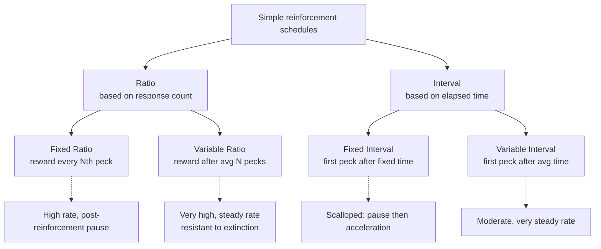
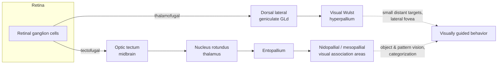
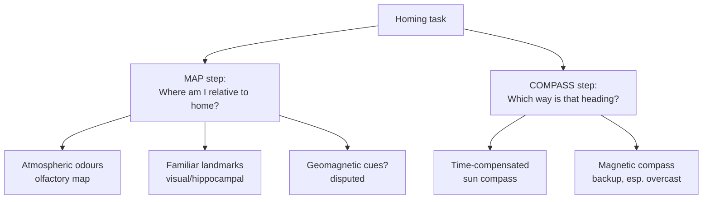

# The Pigeon Brain (*Columba livia*): Learning, Vision, and the Navigating Mind

> Part of the comparative-neuroscience companion to the human-brain reference.
> Educational, not veterinary or medical advice. Contested claims — above all the
> mechanism of magnetoreception — are flagged as unresolved rather than smoothed over.

## Introduction

Few animals have shaped the study of the mind as thoroughly as the common rock
pigeon. It is at once the humblest of city birds and one of the most
consequential laboratory animals in the history of psychology. From the 1940s
onward the pigeon was the workhorse of B. F. Skinner's experimental analysis of
behavior — the animal in the "Skinner box" whose key-pecks built the modern
science of **operant conditioning**. Decades later the same species turned out to
be a startlingly capable **visual cognizer**, able to sort Monet from Picasso and,
in a widely reported study, to spot cancer in medical images with near-expert
accuracy. And for the better part of a century the pigeon has been the central
model for one of biology's great open problems: how a **homing** animal finds its
way across hundreds of kilometres of unfamiliar terrain.

What makes the pigeon so useful is a combination of tractability and surprising
cognitive depth. Its brain weighs only a couple of grams, yet it packs neurons at
densities that rival or exceed those of primates, and it runs a visual system of
extraordinary acuity through a pallial architecture built on a completely
different floor-plan from the mammalian cortex. The pigeon therefore does double
duty in comparative neuroscience: it is a model of *how brains learn* and a model
of *how very different brains can arrive at similar cognition* — a natural
experiment in convergent evolution.

This document walks through four domains — learning, vision, navigation, and
neuroanatomy — then compares the pigeon brain to the mammalian one and closes with
an honest accounting of the limits of what pigeons can tell us.

---

## Table of Contents

1. [The pigeon at a glance](#1-the-pigeon-at-a-glance)
2. [The pigeon and the psychology of learning](#2-the-pigeon-and-the-psychology-of-learning)
   - 2.1 [Operant conditioning and the Skinner box](#21-operant-conditioning-and-the-skinner-box)
   - 2.2 [Schedules of reinforcement](#22-schedules-of-reinforcement)
   - 2.3 [The "superstition" experiment](#23-the-superstition-experiment)
   - 2.4 [Autoshaping and sign-tracking](#24-autoshaping-and-sign-tracking)
   - 2.5 [Project Pigeon and ORCON](#25-project-pigeon-and-orcon)
3. [Pigeon visual cognition](#3-pigeon-visual-cognition)
   - 3.1 [Concept and category learning](#31-concept-and-category-learning)
   - 3.2 [Art, letters, and medical images](#32-art-letters-and-medical-images)
   - 3.3 [How pigeons categorize: mechanism](#33-how-pigeons-categorize-mechanism)
4. [The pigeon visual system](#4-the-pigeon-visual-system)
5. [Navigation and magnetoreception](#5-navigation-and-magnetoreception)
   - 5.1 [The map-and-compass framework](#51-the-map-and-compass-framework)
   - 5.2 [The sun compass](#52-the-sun-compass)
   - 5.3 [Olfactory and landmark navigation](#53-olfactory-and-landmark-navigation)
   - 5.4 [Magnetoreception: an unresolved mechanism](#54-magnetoreception-an-unresolved-mechanism)
6. [Pigeon brain neuroanatomy in brief](#6-pigeon-brain-neuroanatomy-in-brief)
7. [Comparison to mammals and humans](#7-comparison-to-mammals-and-humans)
8. [Limitations](#8-limitations)
9. [Sources](#sources)

---

## 1. The pigeon at a glance

| Feature | Pigeon (*Columba livia*) | Note |
|---|---|---|
| Brain mass | ~2 g | Roughly 1–2% of body mass |
| Forebrain neurons | ~300+ million (order of magnitude) | High neuronal *density* relative to brain size |
| Neuron packing | Up to ~2× the density of a similarly sized mammal | Small, tightly packed neurons |
| Metabolic cost | Avian neurons use ~3× less glucose than mammalian neurons | Cheap-to-run brain |
| Dominant visual pathway | Tectofugal (midbrain route) | Opposite emphasis to primates |
| Eyes | Laterally placed; two foveae per eye | Panoramic field, high acuity |
| Cortex-equivalent | Nuclear pallium (no six-layer cortex) | Convergent, not homologous, organization |
| Signature abilities | Operant learning, visual categorization, homing | The three domains of this document |

Two facts frame everything below. First, the pigeon brain is small but *neuron-rich*
and *cheap to run*: birds pack many small neurons at low metabolic cost, which
helps explain how a walnut-sized brain supports primate-like cognition. Second,
the pigeon pallium is **not** a layered cortex. Birds and mammals last shared a
common ancestor over 300 million years ago, and their forebrains elaborated
independently. Wherever a pigeon does something "cortical" — categorize, plan,
remember a route — it is doing so with a differently wired machine. That is
precisely what makes it scientifically valuable.

---

## 2. The pigeon and the psychology of learning

### 2.1 Operant conditioning and the Skinner box

The pigeon is the emblematic animal of **operant** (or instrumental) conditioning —
learning driven by the *consequences* of behavior rather than by the pairing of
stimuli that defines Pavlovian conditioning. B. F. Skinner formalized the approach
in the 1930s–1950s using an **operant chamber** ("Skinner box"): a sound-attenuated
enclosure with a response manipulandum (for pigeons, an illuminated disc or "key"
to peck) and an automated reinforcer (a grain hopper presented for a few seconds).

The pigeon suited this paradigm almost perfectly. It pecks naturally, tirelessly,
and at high rates; it works readily for small grain rewards; and its behavior can
be recorded automatically as key-peck counts. By reducing a bird to roughly
**75–85% of its free-feeding body weight** to establish food as a reliable
reinforcer, an experimenter could shape and maintain thousands of responses per
session. The key dependent variable Skinner championed — **response rate** — became
the field's standard currency, plotted on the *cumulative record* whose slope
reads directly as rate of responding.

The core vocabulary of operant learning was largely worked out on pigeons and rats
in parallel:

- **Reinforcement** (positive/negative) strengthens the behavior it follows.
- **Punishment** weakens it.
- **Shaping** builds a novel response by reinforcing successive approximations.
- **Extinction** is the decline of a response when reinforcement stops.
- **Stimulus control / discrimination** — responding differently to different
  cues — is the doorway to the visual-cognition work in Section 3.

### 2.2 Schedules of reinforcement

Skinner's most enduring technical contribution, developed with Charles Ferster in
*Schedules of Reinforcement* (1957), was the systematic study of **intermittent
reinforcement**: what happens when only *some* responses are rewarded, according to
a rule. The four basic simple schedules each generate a characteristic, highly
reliable pattern of pigeon behavior — patterns so stable they are used to this day
to assay drug effects and neural manipulations.

| Schedule | Rule | Typical pigeon pattern | Everyday analogue |
|---|---|---|---|
| **Fixed Ratio (FR)** | Reward after every *N* responses | Fast bursts with a post-reinforcement pause | Piecework pay |
| **Variable Ratio (VR)** | Reward after an *average* of *N* responses | Highest, steadiest rates; very extinction-resistant | Slot machines |
| **Fixed Interval (FI)** | Reward for first response after fixed time | "Scallop": pause then acceleration near the deadline | Cramming before an exam |
| **Variable Interval (VI)** | Reward for first response after variable time | Moderate, extremely steady | Checking for a reply |

The practical upshot — that **variable-ratio** schedules produce the most
persistent behavior — became one of psychology's most cited findings and a staple
of discussions about gambling and habit.

### 2.3 The "superstition" experiment

In a famous and much-debated 1948 paper, *"'Superstition' in the Pigeon,"* Skinner
delivered food to hungry pigeons on a **fixed-time schedule** — at regular
intervals *regardless of what the bird was doing*. There was no contingency at all
between behavior and food. Yet six of eight birds developed idiosyncratic,
repetitive rituals: one turned counter-clockwise around the cage, another repeatedly
thrust its head into a corner, others bobbed or swung the head pendulum-fashion.

Skinner's interpretation was **adventitious reinforcement**: whatever the bird
happened to be doing just before food arrived was strengthened by the accidental
temporal pairing, making it more likely to recur — and thus more likely to be
"caught" by the next delivery. He drew an explicit analogy to human superstition
(the ballplayer's ritual, the lucky charm), arguing that behavior can be shaped by
coincidental consequences.

> **Contested interpretation.** The *phenomenon* is robust; the *explanation* is
> not settled. Staddon and Simmelhag's influential 1971 reanalysis argued that the
> behaviors are better understood as **interim** and **terminal** responses tied to
> the food-delivery rhythm — species-typical anticipatory behaviors (pecking,
> pacing) organized by an internal clock — rather than idiosyncratic responses
> accidentally stamped in. Modern accounts often treat "superstitious" behavior as
> a blend of adventitious reinforcement and built-in temporal/foraging programs.
> The label survives; the mechanism remains argued over.

### 2.4 Autoshaping and sign-tracking

A discovery that quietly undermined a strict operant reading of the pigeon came
from **Brown and Jenkins (1968)**. They found they did not need to shape the
key-peck at all. If a key was simply lit for a few seconds and then food was
delivered — a purely **Pavlovian** stimulus-then-food pairing, with the peck
irrelevant to whether food came — pigeons spontaneously began to **approach and peck
the lit key** anyway. They called it **autoshaping**; the broader phenomenon is
**sign-tracking** (the animal tracks the *signal* for reward).

Autoshaping matters theoretically because it blurs the operant/Pavlovian line: a
"voluntary" instrumental-looking response (pecking) emerges from a
stimulus-outcome (Pavlovian) contingency. The clincher is **negative automaintenance**
(Williams and Williams, 1969): even when pecking the key *cancels* the food that
would otherwise arrive, many pigeons keep pecking — behaving against their own
interest because the lit key has become a Pavlovian signal for food. Sign-tracking
is now an important model in the neuroscience of **incentive salience** and
addiction, where cues acquire motivational "pull" of their own.

### 2.5 Project Pigeon and ORCON

The pigeon's operant trainability had one of the stranger applications in the
history of science. During World War II, Skinner proposed — and the U.S. government
funded — a **pigeon-guided missile**. In **Project Pigeon** (begun ~1940; funded from
1943 via a ~$25,000 U.S. government contract routed through **General Mills**), pigeons
were trained to peck at the image of a target projected onto a screen in the nose
of a glide bomb (the "Pelican"). The screen was gimbal-mounted; as the bird pecked
to keep the target centred, the movements were translated into steering signals for
the bomb's control surfaces. To improve reliability, the design used **three pigeons
in parallel**, effectively "voting" on the target's position.

The pigeons performed impressively in tests — unbothered by noise, vibration,
g-forces, and altitude — but the military brass could not bring themselves to stake
a weapon on live birds, and the program was cancelled in 1944 as radar and
electronic guidance matured. The U.S. Navy briefly revived it as **Project ORCON**
("organic control") from 1948 until it was shelved around 1953. Project Pigeon
never saw combat, but Skinner regarded it as the crucible in which he perfected the
shaping techniques he would use for the rest of his career — and it stands as a
vivid demonstration of just how much behavioral control operant methods can achieve.

---

## 3. Pigeon visual cognition

If the learning literature made the pigeon famous, the **visual-cognition**
literature made it respected. Pigeons turn out to be among the most sophisticated
visual categorizers in the animal kingdom — a finding all the more striking given
their reputation as feathered simpletons.

### 3.1 Concept and category learning

The foundational study is **Herrnstein and Loveland (1964)**, *"Complex Visual
Concept in the Pigeon."* Pigeons were reinforced for pecking at photographs that
*contained a human being* and not for photos without one. The images varied
enormously — people clothed and nude, partly hidden, at any distance, in any
setting. The birds not only learned the discrimination across hundreds of varied
photos but **transferred it to entirely novel images**, correctly sorting pictures
they had never seen. This is **open-ended categorization**: the pigeon had abstracted
something like the *category* "person," not memorized specific pictures.

Later work from Herrnstein's laboratory showed the ability was not limited to
familiar things. Pigeons formed categories for **trees**, **bodies of water**, a
**particular individual person**, and even **underwater photographs of fish** — a
category no pigeon could have any evolutionary or personal familiarity with. The
paradigm has since been extended to abstract categories (natural vs. artificial),
same/different relations, and rudimentary numerical discrimination.

### 3.2 Art, letters, and medical images

The most quoted demonstrations come from **Shigeru Watanabe** and colleagues:

- **Monet vs. Picasso (Watanabe, Sakamoto and Wakita, 1995).** Pigeons learned to
  discriminate Monet's paintings from Picasso's, then **generalized** correctly to
  *novel* paintings by each artist — and further generalized from Monet to other
  **Impressionists** (Cézanne, Renoir) and from Picasso to other **Cubists**
  (Braque, Matisse). They had extracted style-level regularities, not memorized
  individual canvases. Show the Monet-trained birds an upside-down or scrambled
  Impressionist image and performance collapses — evidence they use both color and
  spatial structure.
- **"Good" vs. "bad" paintings.** In later studies, pigeons learned to sort
  children's paintings that adult judges had rated beautiful vs. ugly, again
  generalizing to new examples — using cues such as color and possibly complexity.

Pigeons have also been trained to discriminate **letters of the alphabet** and
human-word from non-word strings (orthographic-like discrimination), and to tell
apart faces from scrambled faces. But the study that reached the popular press was
medical:

> **Levenson et al. (2015), *PLOS ONE* — "Pigeons as Trainable Observers of
> Pathology and Radiology Breast Cancer Images."** Trained with food reinforcement,
> pigeons learned to classify **benign vs. malignant** breast **histopathology**
> images and **generalized to novel cases**, reaching around **85% accuracy
> individually** and higher when the responses of a **flock of birds were pooled**
> (a "flock-sourcing" effect). They also learned to detect cancer-relevant
> **microcalcifications** on mammograms.
>
> **Important caveat, honestly stated.** On the harder task of classifying
> suspicious mammographic **masses**, the pigeons appeared to **memorize** the
> training images rather than learn a generalizable rule — they *failed* to
> generalize to novel masses. The headline "pigeons diagnose cancer" oversells a
> nuanced result: pigeons are excellent, generalizing categorizers for *some*
> medical-image problems and mere memorizers for others. The study's real point was
> methodological — pigeons as a cheap surrogate model for studying how image
> features drive human observer performance and for validating imaging displays.

### 3.3 How pigeons categorize: mechanism

How does a bird with no neocortex do this? The leading view treats pigeon
categorization not as human-style rule abstraction but as a powerful **feature-based
associative** process — closer in spirit to a statistical pattern classifier than
to symbolic reasoning.

- Pigeons appear to learn **collections of local visual features** (colors,
  textures, edge statistics, region relationships) that are diagnostic of a
  category, and to **weight and sum** them, an operation that maps naturally onto
  the layered, convergent processing of the tectofugal visual stream.
- This predicts both their strengths (robust generalization when the diagnostic
  features recur) and their failures (breaking down when categories can't be
  separated by such features, or when only rote memorization is possible — as with
  the mammographic masses).
- The parallel to modern **deep convolutional networks** is not lost on
  researchers: like a trained CNN, a pigeon can be a superb category discriminator
  while lacking any human-like conceptual understanding of what it sees. One study
  even used **transfer-learning** framing to explain the pigeons' histopathology
  performance.

The through-line: pigeon vision is proof that sophisticated categorization does
**not** require a mammalian cortex — it can be built on a nuclear avian pallium fed
by a midbrain-dominated visual pathway.

---

## 4. The pigeon visual system

Vision dominates the pigeon brain. Its eyes are enormous relative to its skull, set
laterally for a near-panoramic field, and each retina carries **two foveae** — a
central (deep) fovea aimed laterally for high-acuity monocular scanning and a shallow
temporal fovea for the small **frontal binocular** field used in close work like
pecking grain. Pigeons see into the **ultraviolet**, discriminate colors humans
cannot, and detect flicker at higher rates than we do.

As in all birds, two ascending visual pathways carry retinal information to the
forebrain, and — crucially — their relative emphasis is the **reverse** of the
primate arrangement:

| Pathway | Route | Rough mammalian counterpart | Role in the pigeon |
|---|---|---|---|
| **Tectofugal** (dominant) | retina → optic **tectum** → nucleus **rotundus** → **entopallium** → association pallium | Extrageniculate / colliculo-pulvinar-extrastriate stream | The pigeon's main workhorse for **object, motion, and pattern vision** — and the substrate for the categorization feats in Section 3 |
| **Thalamofugal** | retina → **GLd** (dorsal geniculate complex) → visual **Wulst** (hyperpallium) | Geniculostriate (retina → LGN → V1) stream | Retinotopic; implicated in fine **pattern vision for small, distant targets** in the lateral field, and in binocular/spatial functions |

In primates the geniculostriate (thalamofugal-equivalent) route to V1 dominates; in
the pigeon the **tectofugal** route is king. The **optic tectum** is a large, richly
laminated midbrain structure with unusually high neuron density in the pigeon, and
the **entopallium** is its pallial target. Downstream, tectofugal information reaches
visual **association areas** in the nidopallium and mesopallium, where single-unit
recordings find neurons that respond selectively to complex objects, and even
distinguish **faces from scrambled faces** — the physiological correlate of the
behavioral categorization. Visual processing in pigeons is also markedly
**lateralized** (the two eyes/hemispheres specialize), a well-studied model of brain
asymmetry.

---

## 5. Navigation and magnetoreception

The homing pigeon — a selectively bred *Columba livia* — can be transported hundreds
of kilometres in a covered box to a site it has never seen and still fly home. How
it does so is one of the oldest unsolved problems in sensory biology, and the honest
answer is that **no single mechanism fully accounts for it**; pigeons appear to use
several cues redundantly and flexibly.

### 5.1 The map-and-compass framework

The organizing idea, from **Gustav Kramer (1953)**, is that homing requires two
distinct capacities:

1. A **"map"** — a way to determine *where you are* relative to home (position/displacement).
2. A **"compass"** — a way to determine and hold a *direction* once the map has set a
   heading.

A compass alone gets you nowhere without a map, and vice versa. Much of the
century-long debate is really about **what supplies the map**, because the compass
side is comparatively well understood.

### 5.2 The sun compass

The best-established compass in pigeons is the **time-compensated sun compass**.
Pigeons read direction from the sun's **azimuth**, correcting for its movement across
the sky using their **circadian clock**. The classic proof is the **clock-shift**
experiment: house a pigeon under artificial light cycles advanced or delayed by
several hours, release it under sun, and it departs in a **predictably wrong
direction** by an angle corresponding to the shift. Under **overcast** skies, when
the sun compass is unavailable, pigeons fall back on a **magnetic compass** — one of
the clearest pieces of evidence that they possess magnetic sensing of *some* kind
(see 5.4).

### 5.3 Olfactory and landmark navigation

The most contentious part of the *map* is **olfaction**. Beginning with **Floriano
Papi** and colleagues in Italy in the early 1970s, a large body of work argues that
pigeons build an **olfactory map**: at the home loft they learn to associate
**wind-borne odours** with the directions the winds come from, and at a release site
they infer the direction of displacement from the local smell-scape. The signature
result is dramatic: pigeons whose olfactory input is blocked (by nasal anaesthesia,
zinc-sulphate lesion, or section of the olfactory nerves) are severely impaired at
homing from unfamiliar sites, while controls return normally.

> **Contested.** The olfactory-navigation hypothesis is supported by decades of
> experiments (largely from Gagliardo, Wallraff, and colleagues) but has long drawn
> skeptics who question whether the atmosphere carries a stable enough odour
> gradient over the required distances, and whether anosmia impairs *navigation
> specifically* or general motivation/activity. The mainstream position today is
> that olfaction is a **genuine and important** component of the pigeon map for
> unfamiliar terrain, without claiming it is the whole story.

Closer to home, over **familiar terrain**, pigeons increasingly rely on **visual
landmarks** — roads, coastlines, field edges — and can follow habitual routes.
GPS-tracking shows individual birds develop idiosyncratic, repeatable route
preferences. This landmark navigation depends on the **hippocampal formation** (see
Section 6): hippocampal-lesioned pigeons show normal initial orientation from
distant sites (their sun compass and map still set a heading) but are **impaired at
using familiar landmarks** and at the final approach to the loft.

### 5.4 Magnetoreception: an unresolved mechanism

That pigeons and other birds can sense the Earth's magnetic field is not in serious
doubt — behavioral evidence (the overcast magnetic-compass fallback, effects of
attached magnets and altered fields) is strong. **What is genuinely unresolved,
after 40+ years, is the receptor and mechanism.** This is the single most contested
claim in the pigeon-navigation literature, and it deserves to be presented as an
open question with competing hypotheses.

| Hypothesis | Proposed receptor / site | Type of information | Status / problems |
|---|---|---|---|
| **Radical-pair / cryptochrome** | **Cryptochrome** proteins in the **retina** (photoreceptors) | Light-dependent magnetic **compass** (direction/inclination) | Strong for compass in migratory songbirds; cryptochromes (e.g. Cry1b, Cry4) localized in bird retina, but a definitive causal chain in pigeons is unproven |
| **Magnetite-based** | Iron-mineral (**magnetite**) particles | Could encode field **intensity/inclination** → possible **map** component | Long centred on the **upper beak**; badly shaken when a 2012 study showed the "beak magnetoreceptor" cells were **iron-rich macrophages**, not neurons |
| **Vestibular / inner-ear (lagena)** | Inner-ear structures | Magnetic input to the brain | Supported by some brain-activation and lesion work; not a settled receptor |
| **Trigeminal / beak (neural)** | Ophthalmic branch of the **trigeminal nerve** | Possible magnetic **intensity** signal | Some evidence of magnetic responses; entangled with the magnetite-macrophage controversy |
| **Recent, provisional** | **Superparamagnetic macrophages** (proposed in the **liver**; 2025) | Possible **map** signal under overcast conditions | New, single-lab hypothesis; testable but **far from confirmed** |

Two competing crystallizations are worth stating plainly. Many researchers favour a
**dual model**: a **light-dependent cryptochrome/radical-pair compass** in the eye
handling *direction*, plus a **magnetite-based magnetometer** handling *intensity* as
part of the *map*. The trouble is that the leading physical candidate for the
magnetite magnetometer — the iron-rich cells in the pigeon's beak — turned out in
**Treiber et al. (2012, *Nature*)** to be **macrophages** (immune cells), not sensory
neurons, deflating one of the field's central pillars. Where the map-sense
magnetometer actually resides is, as of this writing, **not known**. A 2025 proposal
relocating superparamagnetic macrophages to the **liver** as an overcast-condition
map sensor is intriguing but preliminary and unreplicated.

> **Bottom line, stated honestly.** Pigeons *can* sense magnetic fields; a
> light-dependent magnetic **compass** is well supported; but the **receptor(s) and
> transduction mechanism — especially for any magnetic map — remain unresolved and
> actively contested.** Beware any source that presents "magnetite crystals in the
> beak let pigeons navigate" as established fact; that specific claim was
> substantially undermined in 2012.

---

## 6. Pigeon brain neuroanatomy in brief

The pigeon brain (~2 g) has the standard vertebrate divisions — **telencephalon,
diencephalon, midbrain, cerebellum, brainstem** — but its telencephalon is organized
on the **avian plan**: a large **pallium** built from **nuclear clusters** (not the
six-layer sheet of mammalian neocortex), sitting above the **subpallium** (striatum,
pallidum). Modern avian-brain nomenclature (adopted 2004–2005) renamed the old
"striatal" terms to reflect that most of the avian forebrain is **pallial**, not
striatal.

| Structure | What it is | Rough mammalian analogue | Notes |
|---|---|---|---|
| **Hyperpallium (Wulst)** | Dorsal pallium; contains visual Wulst | **Neocortex / V1** (partly) | Thalamofugal target; retinotopic |
| **Nidopallium** | Large pallial region; part of the dorsal ventricular ridge (DVR) | Portions of neocortex (associative) | Termination field for ascending sensory pathways |
| **Nidopallium caudolaterale (NCL)** | Caudal patch of nidopallium | **Prefrontal cortex** (analogue, not homologue) | Densely **dopaminergic**; executive functions |
| **Mesopallium** | Pallial region above nidopallium | Associative cortex | Learning/memory, including visual association |
| **Entopallium** | Sensory pallial nucleus | Extrastriate visual cortex | Main **tectofugal** target |
| **Arcopallium** | Ventral/caudal pallium | Amygdala + motor cortex (mixed) | Premotor/limbic output |
| **Hippocampal formation** | Medial pallium | **Hippocampus** (homologous) | Spatial memory; homing over familiar terrain |
| **Optic tectum (TeO)** | Midbrain roof | **Superior colliculus** | Enlarged, dense; hub of dominant visual pathway |
| **Cerebellum** | Highly foliated | Cerebellum (homologous) | Motor coordination, flight |

Three structures deserve emphasis for this document's themes:

- **The NCL — an avian "prefrontal cortex."** The **nidopallium caudolaterale** is a
  multimodal, heavily **dopamine-innervated** region that behaves functionally like
  the mammalian prefrontal cortex despite an entirely different developmental origin
  and architecture. NCL lesions impair **working memory, reversal learning, response
  selection, and delayed-alternation** performance while sparing sensory
  discrimination and movement — the classic prefrontal profile. It is a textbook case
  of **functional convergence**: two very different forebrains independently evolving
  an executive controller. NCL neurons also encode stimulus–response–outcome
  associations and contribute to **goal-directed navigation**.
- **The hippocampal formation** is **homologous** to the mammalian hippocampus and is
  the pigeon's spatial-memory engine. Lesions selectively degrade **landmark-based
  navigation** and map learning, while leaving compass orientation intact — dissociating
  the "map" and "compass" systems anatomically (Section 5). LFP recordings during
  actual homing flights confirm hippocampal engagement in real-world navigation.
- **The optic tectum** is disproportionately large and neuron-dense, the anatomical
  expression of how visually dominated the pigeon is.

A note on cellular scale: work by **Olkowicz et al. (2016, *PNAS*)** established that
bird forebrains pack **primate-like numbers of neurons** at higher density than
mammals, and later work shows **avian neurons run on ~3× less glucose** than
mammalian ones. The pigeon thus achieves a lot of cognition per gram and per
calorie — a different engineering solution from the mammalian large-brain strategy.

---

## 7. Comparison to mammals and humans

| Dimension | Pigeon | Human / typical mammal |
|---|---|---|
| Forebrain architecture | **Nuclear** pallium (clusters) | **Laminar** six-layer neocortex |
| Homology of "cortex" | Mostly **convergent/analogous** (NCL↔PFC); hippocampus **homologous** | Baseline |
| Dominant visual route | **Tectofugal** (midbrain) | **Geniculostriate** (thalamus→V1) |
| Neuron density | **Very high**; small neurons | Lower density; larger neurons |
| Metabolic cost per neuron | ~**3× cheaper** | Baseline |
| Executive control | NCL (dopaminergic) | Prefrontal cortex (dopaminergic) |
| Spatial navigation | Hippocampal formation + sun/olfactory/magnetic cues | Hippocampus + entorhinal grid/place cells |
| Signature cognition | Visual **categorization**, homing, operant learning | Language, abstract reasoning, tool culture |

The comparison's real payoff is the concept of **convergent evolution of cognition**.
Birds and mammals built their most sophisticated forebrain functions — executive
control, categorization, spatial memory — on **independently evolved** hardware.
Where the substrates are truly ancient and shared (the hippocampus, the basal
ganglia, the cerebellum, the tectum/colliculus), we find **homology**. Where the
function is "higher-order" and cortical-seeming (an executive controller, an
object-recognition hierarchy), we find **analogy** — the same computational problem
solved twice with different wiring. The pigeon is therefore a natural control
experiment for a deep question in neuroscience: *which features of intelligent brains
are inevitable, and which are accidents of the mammalian floor-plan?* That birds
categorize images, plan, and remember routes without a neocortex is strong evidence
that the **neocortical sheet is one solution, not the only one**.

At the same time, the differences are real and cognitively meaningful. Pigeons show
no convincing evidence of language, and their impressive categorization is best read
as powerful feature-based statistical learning rather than human-style conceptual
abstraction (Section 3.3).

---

## 8. Limitations

A candid account of what the pigeon model does **not** deliver:

- **Anthropomorphism and over-reading.** "Pigeons appreciate art" and "pigeons
  diagnose cancer" are catchy but misleading. The birds perform **feature-based
  discriminations**; they do not have aesthetic experiences, and their medical-image
  performance **generalized in some tasks and was mere memorization in others**
  (the mammographic-mass failure). Behavioral success is not evidence of human-like
  understanding.
- **The superstition explanation is not settled.** The behavior is real; whether it
  reflects **adventitious reinforcement** or built-in **interim/terminal** temporal
  programs remains debated (Section 2.3).
- **Magnetoreception mechanism is unknown.** The single largest caveat in this
  document. Pigeons sense magnetic fields, but the **receptor and transduction
  pathway — especially for a magnetic map — are unresolved**, and a former central
  claim (magnetite in the beak) was **overturned** in 2012 (Section 5.4). Treat
  confident mechanistic statements with suspicion.
- **Olfactory navigation is important but contested.** Strong evidence supports an
  olfactory component to the pigeon map, but its sufficiency and the interpretation
  of anosmia experiments are still argued (Section 5.3).
- **Homing pigeons are a selected strain.** Racing/homing pigeons are the product of
  intensive artificial selection; their navigational prowess may not generalize to
  all *Columba livia*, and laboratory pigeons are typically not homing-selected.
- **Welfare and method.** Much operant work relied on **food deprivation** to
  ~75–85% of free-feeding weight, and lesion/manipulation studies are invasive.
  These methods raise ethical considerations and can constrain which behaviors are
  observed (a very hungry bird is not a neutral cognizer).
- **Translation caution.** Convergent similarity (e.g., NCL↔PFC) is powerful for
  identifying *general principles* of forebrain function, but analogy is not
  identity — the pigeon is not a small feathered mammal, and mechanistic details
  (receptors, microcircuits, molecular markers) often differ.

Used with these caveats, the pigeon remains one of comparative neuroscience's most
informative subjects: a small, cheap, neuron-dense brain that learns, sees, and
navigates well enough to keep rewriting our sense of what brains without a neocortex
can do.

---

## Sources

**Learning, operant conditioning, and schedules**

- [B. F. Skinner, "'Superstition' in the Pigeon" (1948), *J. Exp. Psychol.* — original PDF](https://psychclassics.yorku.ca/Skinner/Pigeon/) — and mirror at [Hanover College](https://psych.hanover.edu/classes/learning/papers/Skinner%20Superstion%20(1948%20orig).pdf)
- [All About Psychology — "Superstition in the Pigeon" (overview + original text)](https://www.all-about-psychology.com/superstition-in-the-pigeon.html)
- [Staddon & Simmelhag reanalysis discussion — "Superstition revisited," *Behavioural Processes* (2019/2020)](https://pubmed.ncbi.nlm.nih.gov/31722232/)
- [Simply Psychology — Operant Conditioning (Skinner)](https://www.simplypsychology.org/operant-conditioning.html)
- [B. F. Skinner, Harvard Department of Psychology profile](https://psychology.fas.harvard.edu/people/b-f-skinner)
- [Bridging laboratory and applied research on response-independent schedules, *PMC*](https://www.ncbi.nlm.nih.gov/pmc/articles/PMC10099982/)

**Autoshaping / sign-tracking**

- [Brown & Jenkins (1968), "Auto-shaping of the pigeon's key-peck," *JEAB*](https://onlinelibrary.wiley.com/doi/10.1901/jeab.1968.11-1)
- [Autoshaping / sign-tracking — Springer reference entry](https://link.springer.com/referenceworkentry/10.1007/978-3-319-55065-7_1500)
- [Negative automaintenance and sign tracking, *PMC*](https://pmc.ncbi.nlm.nih.gov/articles/PMC2643130/)

**Project Pigeon / ORCON**

- [Project Pigeon — Wikipedia](https://en.wikipedia.org/wiki/Project_Pigeon)
- [Smithsonian Magazine — "B.F. Skinner's Pigeon-Guided Rocket"](https://www.smithsonianmag.com/smithsonian-institution/bf-skinners-pigeon-guided-rocket-53443995/)
- [B. F. Skinner Foundation — Project Pigeon](https://www.bfskinner.org/project-pigeon/)
- [NIST — "The Saga of the Bird-Brained Bombers"](https://www.nist.gov/blogs/taking-measure/saga-bird-brained-bombers)

**Visual cognition and categorization**

- [Herrnstein & Loveland (1964), "Complex Visual Concept in the Pigeon," *Science*](https://www.science.org/doi/10.1126/science.146.3643.549)
- [Watanabe, Sakamoto & Wakita (1995), "Pigeons' discrimination of paintings by Monet and Picasso," *JEAB*](https://onlinelibrary.wiley.com/doi/abs/10.1901/jeab.1995.63-165)
- [Scientific American — "The Pigeon as Art Critic"](https://www.scientificamerican.com/article/the-pigeon-as-art-critic/)
- [Levenson et al. (2015), "Pigeons (Columba livia) as Trainable Observers of Pathology and Radiology Breast Cancer Images," *PLOS ONE*](https://journals.plos.org/plosone/article?id=10.1371/journal.pone.0141357) — [PMC mirror](https://pmc.ncbi.nlm.nih.gov/articles/PMC4651348/)
- [Smithsonian Magazine — "Pigeons Can Spot Breast Cancer in Medical Images"](https://www.smithsonianmag.com/science-nature/pigeons-can-spot-breast-cancer-medical-images-180957323/)
- [Pigeons and lung-abnormality detection in CT, *Animal Cognition* (2026)](https://link.springer.com/article/10.1007/s10071-026-02048-2)
- [Transfer learning and pigeon histopathology performance, *Bioinspiration & Biomimetics*](https://iopscience.iop.org/article/10.1088/1748-3190/ad6825)
- [The neuroscience of perceptual categorization in pigeons: a mechanistic hypothesis, *Learning & Behavior*](https://link.springer.com/article/10.3758/s13420-018-0321-6)

**Visual system and neuroanatomy**

- [Neurons in the pigeon visual network discriminate faces vs. scrambled faces, *Scientific Reports*](https://www.nature.com/articles/s41598-021-04559-z)
- [3D reconstruction of the avian visual thalamofugal pathway, *Scientific Reports* (2024)](https://www.nature.com/articles/s41598-024-58788-z)
- [Definition and connections of the entopallium in the pigeon](https://www.researchgate.net/publication/7703290_Definition_and_novel_connections_of_the_entopallium_in_the_pigeon_Columba_livia)
- [Nidopallium — overview (ScienceDirect Topics)](https://www.sciencedirect.com/topics/neuroscience/nidopallium)
- [The receptor architecture of the pigeon NCL: an avian analogue to mammalian prefrontal cortex, *Brain Struct. Funct.*](https://link.springer.com/article/10.1007/s00429-011-0301-5)
- [Avian NCL mediates decision-making during goal-directed navigation, *J. Integr. Neurosci.*](https://www.imrpress.com/journal/JIN/20/4/10.31083/j.jin2004095)
- [Olkowicz et al. (2016), "Birds have primate-like numbers of neurons in the forebrain," *PNAS*](https://www.pnas.org/doi/10.1073/pnas.1517131113)
- [Avian neurons consume three times less glucose than mammalian neurons, *Current Biology* (2022)](https://www.cell.com/current-biology/fulltext/S0960-9822(22)01219-2)
- [The avian brain — *Current Biology* primer](https://www.cell.com/current-biology/fulltext/S0960-9822(22)01221-0)

**Navigation, hippocampus, and magnetoreception**

- [Forty years of olfactory navigation in birds (Gagliardo), *J. Exp. Biol.*](https://journals.biologists.com/jeb/article/216/12/2165/11389/Forty-years-of-olfactory-navigation-in-birds)
- [Olfactory navigation — Wikipedia (entry point)](https://en.wikipedia.org/wiki/Olfactory_navigation)
- [Cues indicating location in pigeon navigation, *J. Comp. Physiol. A*](https://link.springer.com/article/10.1007/s00359-015-1027-2)
- [Pigeons combine compass and landmark guidance in familiar route navigation, *PNAS*](https://www.robots.ox.ac.uk/~sjrob/Pubs/pnasPaper.pdf)
- [Homing pigeon navigational ontogeny (2024), *Animal Behaviour* / PMC](https://www.ncbi.nlm.nih.gov/pmc/articles/PMC11512678/)
- [Homing pigeons: role of the hippocampal formation in representing landmarks, *J. Neurosci.* / PMC](https://pmc.ncbi.nlm.nih.gov/articles/PMC6782352/)
- [Hippocampal LFP responses during pigeon homing flight outdoors, *J. Neurosci.* (2025)](https://www.jneurosci.org/content/45/30/e0185252025)
- [Treiber et al. (2012), iron-rich "beak magnetoreceptor" cells are macrophages — magnetite-based receptors review, *PMC*](https://www.ncbi.nlm.nih.gov/pmc/articles/PMC3552369/)
- [Cryptochrome 1b localization in retinae of migratory birds and homing pigeons, *PMC*](https://www.ncbi.nlm.nih.gov/pmc/articles/PMC4783096/)
- [Magnetoreception and its use in bird navigation, *Current Opinion in Neurobiology*](https://www.sciencedirect.com/science/article/abs/pii/S0959438805000942)
- [Homing pigeon navigation relies on superparamagnetic macrophages under overcast conditions (2025), *Science*](https://www.science.org/doi/10.1126/science.ady2486)

---

*Written from synthesized, cross-verified sources for the comparative-neuroscience
companion. Contested topics — the mechanism of magnetoreception above all, plus the
superstition explanation and the sufficiency of olfactory navigation — are flagged
in-text as unresolved. Educational, not veterinary or medical advice.*
