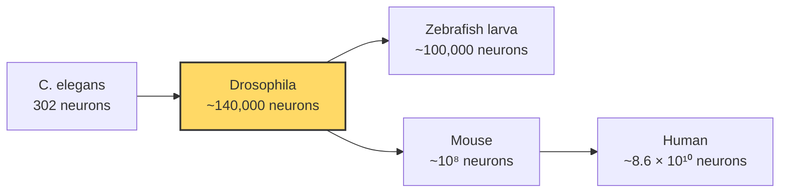
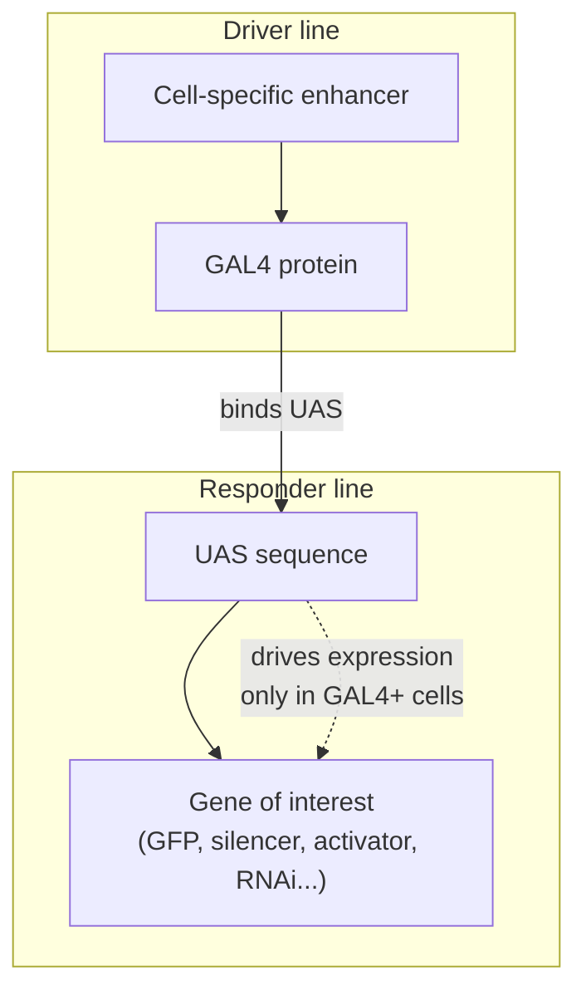
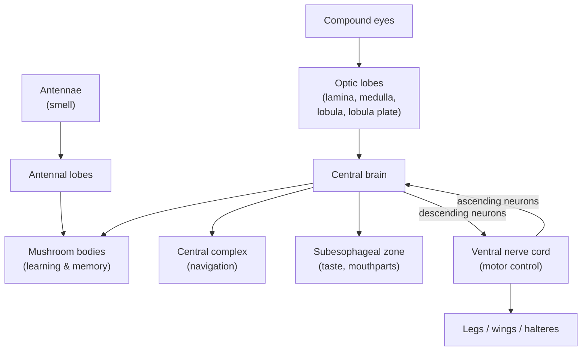
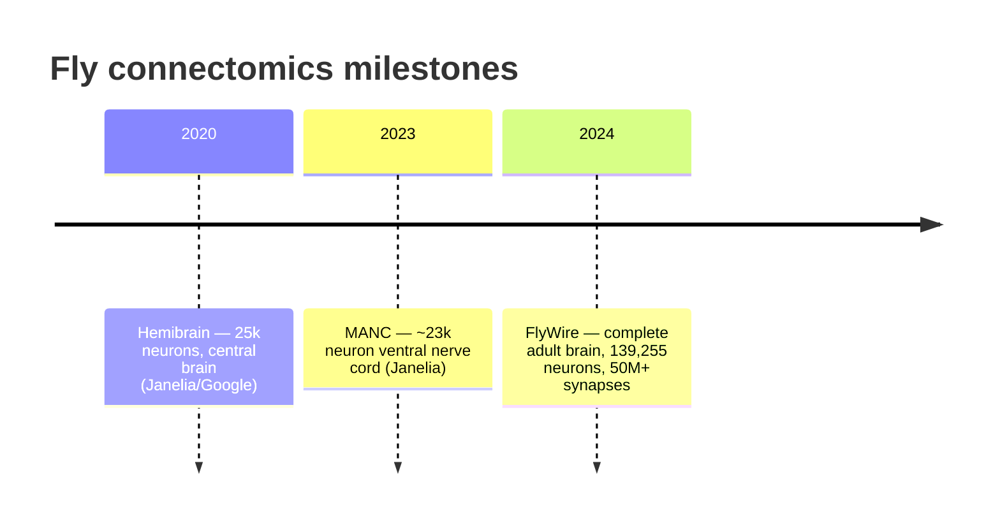
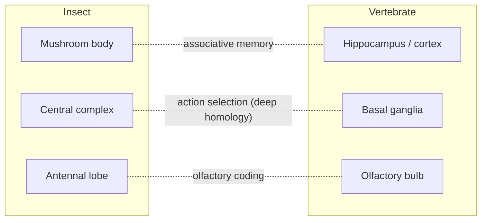

# The Fruit Fly Nervous System (*Drosophila melanogaster*)

*The genetic powerhouse of neuroscience — and the first adult animal to have its entire brain wired diagram completed.*

---

## Introduction

For more than a century, a two-millimetre insect with a red-eyed, four-day life cycle has quietly driven some of biology's largest revolutions. *Drosophila melanogaster* — the common fruit fly — has been the workhorse of genetics since Thomas Hunt Morgan's "Fly Room" at Columbia around 1910, and it is now equally central to neuroscience. In 2024 the fly became the **first adult animal to have a complete brain connectome** — a synapse-resolution wiring diagram of all ~140,000 neurons — a milestone that no vertebrate, and no other complex animal, has yet reached.

Why the fly? It occupies a rare sweet spot. Its brain is small enough (roughly the volume of a poppy seed) to reconstruct neuron-by-neuron from electron microscopy, yet large enough to generate genuinely complex behaviour: learning, navigation, courtship, sleep, decision-making, and circadian timekeeping. Crucially, it comes with a genetic toolkit unmatched by any other animal, allowing researchers to switch individual, genetically-defined neurons on or off in a living, behaving fly. The result is a system where **structure (the connectome), function (physiology and behaviour), and causation (genetic manipulation) can all be studied in the same brain** — a combination no mammal offers.

This document surveys why *Drosophila* holds this position, the layout of its nervous system, the landmark connectome achievements, the discoveries flies have made possible, how insect and vertebrate brains compare, and — importantly — where the fly's usefulness as a human model ends.

---

## Table of Contents

1. [Why *Drosophila* Is a Top Model Organism](#1-why-drosophila-is-a-top-model-organism)
2. [The Genetic Toolkit](#2-the-genetic-toolkit)
3. [Neuroanatomy: Brain and Ventral Nerve Cord](#3-neuroanatomy-brain-and-ventral-nerve-cord)
4. [Key Neuropils and Their Functions](#4-key-neuropils-and-their-functions)
5. [The Connectome Achievements](#5-the-connectome-achievements)
6. [Discoveries Enabled by Flies](#6-discoveries-enabled-by-flies)
7. [Insect vs Vertebrate Brain Organization](#7-insect-vs-vertebrate-brain-organization)
8. [What Flies Can and Cannot Model for Humans](#8-what-flies-can-and-cannot-model-for-humans)
9. [Limitations](#9-limitations)
10. [Summary](#10-summary)
11. [Sources](#sources)

---

## 1. Why *Drosophila* Is a Top Model Organism

The fruit fly's dominance rests on a convergence of practical advantages, each individually useful, but collectively transformative.

| Feature | Detail | Consequence for research |
|---|---|---|
| **Short generation time** | ~10 days egg-to-adult at 25 °C | Dozens of generations per year; rapid crosses |
| **High fecundity** | A single female lays hundreds of eggs | Large sample sizes, powerful genetic screens |
| **Small, compact genome** | ~4 chromosome pairs, ~14,000 genes, fully sequenced (2000) | Manageable genetics; easy mapping |
| **Tractable brain size** | ~140,000 neurons in the brain (vs. ~86 billion in humans) | Whole-brain reconstruction is feasible |
| **Rich behavioural repertoire** | Learning, memory, navigation, courtship, sleep, aggression | Complex neuroscience with a simple substrate |
| **Deep conservation** | ~60–75% of human disease-associated genes have fly orthologs | Findings translate to human biology |
| **Low cost & ethics** | Cheap husbandry, minimal regulatory burden | Enables screens of thousands of genotypes |

### The scale sweet spot

The fly's ~135,000–140,000 neurons place it, on a logarithmic scale, roughly midway between the roundworm *Caenorhabditis elegans* (302 neurons) and the mouse (~10⁸ neurons). This is deliberately the point where a nervous system becomes complex enough to be interesting but still small enough to map completely.

The single most decisive advantage, though, is not any one of these — it is the genetic toolkit, which converts the small brain into a system that can be *manipulated* with cellular precision.

---

## 2. The Genetic Toolkit

More than any other model, the fly lets researchers reach into a living brain and switch defined cell populations on or off. Three pillars underpin this.

### 2.1 The GAL4/UAS binary expression system

Introduced by Brand and Perrimon in 1993, GAL4/UAS is the backbone of fly neurogenetics. It is a two-part ("binary") system borrowed from yeast:

- A **driver line** expresses the yeast transcription factor **GAL4** under the control of a chosen tissue- or cell-specific promoter/enhancer.
- A **responder line** carries a gene of interest downstream of a **UAS** (Upstream Activating Sequence), the DNA element GAL4 binds.

Crossing the two brings GAL4 and UAS together, so the gene of interest is expressed *only where GAL4 is active*. By swapping responders, the same driver can be used to:

- Visualize neurons (UAS-GFP)
- Silence them (UAS-Kir2.1, UAS-shibire^ts)
- Activate them (UAS-CsChrimson for optogenetics, UAS-TrpA1 for thermogenetics)
- Knock genes down or out (UAS-RNAi, UAS-Cas9)

**Split-GAL4** refines this further: GAL4 is divided into two non-functional halves, each under a different enhancer, so functional GAL4 reconstitutes *only* in cells where both enhancers are active — achieving exquisitely specific, often single-cell-type, labelling.

### 2.2 Mosaic analysis (MARCM)

**MARCM** (Mosaic Analysis with a Repressible Cell Marker), developed by Lee and Luo, combines GAL4/UAS with the FLP/FRT recombination system and the GAL4 repressor **GAL80**. FLP recombinase triggers mitotic recombination in dividing cells; daughter cells that lose their GAL80 copy become homozygous for a recessive mutation *and* are simultaneously labelled by GAL4-driven marker. This allows researchers to generate and positively mark **single mutant clones** in an otherwise normal brain — indispensable for tracing lineages and studying gene function cell-autonomously.

### 2.3 Large-scale resources

- **Forward-genetic screens**: Because flies are cheap and fecund, researchers can mutagenize thousands of animals and screen for behavioural phenotypes — the strategy Seymour Benzer pioneered to find the first learning and clock mutants.
- **Stock centres**: Vast public collections (Bloomington, VDRC, Janelia FlyLight, gene-specific T2A-GAL4 libraries, genome-wide RNAi lines) give any lab off-the-shelf access to drivers and mutants for essentially any gene.
- **CRISPR/Cas9**: Now routinely combined with UAS for tissue-specific knockout.

Together these tools mean a specific hypothesis — "does this identified neuron drive this behaviour?" — can be tested causally in weeks.

---

## 3. Neuroanatomy: Brain and Ventral Nerve Cord

The adult fly central nervous system (CNS) has two major parts, connected by the neck (cervical) connective:

| Structure | Rough analogy | Function | Neuron count |
|---|---|---|---|
| **Brain** (supraesophageal + subesophageal) | Brain | Sensory integration, learning, navigation, decision-making | ~140,000 |
| **Ventral nerve cord (VNC)** | Spinal cord | Motor control of legs, wings, halteres; local reflexes | ~15,000–23,000 |

The **brain** sits in the head capsule and is dominated by the paired **optic lobes** (visual processing) flanking a **central brain**. Within the central brain lie the higher-order neuropils: the **mushroom bodies**, the **central complex**, the antennal lobes, and the subesophageal zone (which handles taste and controls mouthparts).

The **VNC** is the insect analogue of the spinal cord: it contains the motor circuits and central pattern generators that drive walking, flight, and grooming, receiving descending commands from the brain and sending ascending sensory information back up.

---

## 4. Key Neuropils and Their Functions

### 4.1 The mushroom bodies — learning, memory, and olfactory association

The **mushroom bodies (MBs)** are the fly's premier centre for associative learning and memory, especially of odours. Each MB is built from ~2,000 intrinsic neurons called **Kenyon cells (KCs)**, whose parallel axon fibres form the characteristic stalk-and-cap "mushroom" shape.

The canonical olfactory-learning circuit works as a three-element system:

1. **Input (odour identity)**: Olfactory **projection neurons** relay odour information from the antennal lobes to the KC dendrites in the MB **calyx**. Any given odour activates a small, sparse subset of KCs — a sparse code that makes odours highly separable.
2. **Teaching signal (value)**: **Dopaminergic neurons** convey reinforcement — reward (sugar) or punishment (shock, bitter) — onto the KC axons in the MB **lobes**, compartment by compartment.
3. **Output (behavioural choice)**: **Mushroom body output neurons (MBONs)** read out the modified KC activity and bias the fly toward approach or avoidance.

When an odour (KC activity) coincides with a dopaminergic teaching signal, the strength of the KC→MBON synapse is modified — the physical trace of the memory. This coincidence detection is where the *dunce* and *rutabaga* genes (below) act biochemically. Silencing KC output blocks memory *retrieval* without erasing acquisition or storage — evidence that the memory is stored in these synapses.

The MB is often described as the insect's functional analogue of the vertebrate **hippocampus/cortex** for associative memory, and its sparse-coding architecture is strikingly reminiscent of the cerebellum.

### 4.2 The central complex — navigation and spatial orientation

The **central complex (CX)** is a set of midline neuropils — the **ellipsoid body**, **fan-shaped body**, **protocerebral bridge**, and **noduli** — dedicated to spatial orientation, motor coordination, and navigation.

Its most celebrated feature is a neural **compass**: a "bump" of activity in ring neurons of the ellipsoid body tracks the fly's heading direction, functioning much like the head-direction cells of the mammalian limbic system. The fan-shaped body integrates this heading signal with goals and internal state to steer locomotion. The CX is also implicated in visual place learning, sleep regulation, and action selection.

### 4.3 The optic lobes — vision and motion detection

The **optic lobes** occupy roughly half the brain by volume and process input from the ~800 unit eyes (ommatidia) of each compound eye. Visual information passes through successive retinotopic layers:

**Lamina → Medulla → Lobula / Lobula plate**

A landmark achievement of fly vision research was working out the **elementary motion detector**: direction-selective **T4** (ON-edge) and **T5** (OFF-edge) neurons compute motion by comparing signals from neighbouring points in space after a time delay, implementing a decades-old theoretical model (the Hassenstein–Reichardt detector) in identified cells. Connectomic reconstruction of the optic medulla was pivotal in nailing down this circuit.

### 4.4 The antennal lobes — the first olfactory relay

The **antennal lobes** are the insect analogue of the vertebrate **olfactory bulb**. Odorant receptor neurons converge onto ~50 spherical **glomeruli**, each corresponding largely to one receptor type — a labelled-line organization that has made the fly a premier system for understanding **olfactory coding**.

---

## 5. The Connectome Achievements

A **connectome** is a complete map of neurons and their synaptic connections. The fly has been the proving ground for large-scale connectomics, culminating in the first whole-brain map of any adult animal.

### 5.1 Timeline of major fly connectomes

| Year | Dataset | Scope | Approx. neurons | Approx. synapses |
|---|---|---|---|---|
| 2020 | **Hemibrain** (Janelia FlyEM + Google) | Central brain, one hemisphere | ~25,000 | ~20 million |
| 2023 | **MANC** (male adult nerve cord) | Ventral nerve cord | ~23,000 | ~74 million post-synaptic densities |
| 2024 | **FlyWire / FAFB** | **Entire adult brain** | **139,255** | **50+ million** |

### 5.2 The hemibrain (2020)

Released by Janelia's **FlyEM** team in collaboration with Google, the **hemibrain** connectome densely reconstructed roughly 25,000 neurons of the central brain and their ~20 million chemical synapses, described in a large multi-author paper in *eLife* (2020). It deliberately targeted the region containing the mushroom bodies, central complex, and clock circuits — unlocking circuit-level analysis of learning, navigation, and sleep. It was the largest synapse-resolution wiring diagram of its time and transformed the field, but it covered only part of one hemisphere.

### 5.3 The ventral nerve cord (MANC, 2023)

The **Male Adult Nerve Cord (MANC)** connectome extended dense reconstruction to the fly's "spinal cord," mapping ~23,000 neurons — the first complete connectome of an adult animal's nerve cord and a prerequisite for understanding how brain commands become leg and wing movements.

### 5.4 FlyWire: the complete adult brain (2024)

In October 2024, the **FlyWire Consortium** — a collaboration of more than 200 people across dozens of labs, led from Princeton (Sebastian Seung, Mala Murthy) with many partners — published the first **complete connectome of an adult brain** in a nine-paper package in *Nature*. Built from the **Full Adult Fly Brain (FAFB)** electron-microscopy volume, and combining AI-based automated segmentation with massive community proofreading, it comprises:

- **139,255 proofread neurons**
- **50+ million synaptic connections**, annotated with predicted neurotransmitter identity
- **8,453 annotated cell types** — of which ~3,643 matched types proposed from the hemibrain and ~4,581 were entirely new, mostly from brain regions the hemibrain never covered
- A companion **whole-brain annotation** and **network-statistics** analysis, plus **Codex**, a public search engine for querying neurons, connectivity, and neurotransmitters

**Why it matters:** For the first time, researchers have a full parts list *and* wiring diagram for a brain that produces rich behaviour. It lets scientists trace complete sensory-to-motor pathways, generate mechanistic hypotheses testable with the genetic toolkit, and even build biologically-grounded network simulations. It is a proof of concept for the far harder goal of mapping mammalian brains.

---

## 6. Discoveries Enabled by Flies

The fly's influence on neuroscience and biology is out of all proportion to its size. Several discoveries reshaped whole fields — a number of them recognized by Nobel Prizes.

### 6.1 Circadian clock genes (Nobel Prize 2017)

Perhaps the fly's most famous neuroscience contribution. In 1971 Seymour Benzer and Ronald Konopka isolated fly mutants with abnormal daily rhythms and named the responsible gene ***period* (*per*)**. Decades of work by **Jeffrey C. Hall, Michael Rosbash, and Michael W. Young** dissected the molecular clockwork:

- The *period* gene (cloned 1984) and *timeless* (*tim*) encode proteins that **accumulate at night and are degraded during the day**.
- PER and TIM proteins feed back to **inhibit their own genes' transcription**, creating a self-sustaining ~24-hour **transcription–translation feedback loop**.
- Young identified additional components (e.g. *doubletime*) controlling the timing of protein degradation.

This transcription–translation feedback loop turned out to be the **universal blueprint for animal circadian clocks**, including humans. The three shared the **2017 Nobel Prize in Physiology or Medicine**.

### 6.2 Learning and memory mutants: *dunce* and *rutabaga*

Benzer and colleagues (notably Chip Quinn, Yadin Dudai, and William "Duncan" Byers) pioneered **forward-genetic screens for learning-defective flies**, discovering:

- ***dunce*** — encodes a **cAMP-specific phosphodiesterase** (which degrades cAMP)
- ***rutabaga*** — encodes a **Ca²⁺/calmodulin-responsive adenylyl cyclase** (which synthesizes cAMP)

Both disrupt short-term memory, and both act in the **cAMP second-messenger cascade**. Rutabaga's adenylyl cyclase is a molecular **coincidence detector** — activated maximally when odour-driven neural activity (Ca²⁺) and the dopaminergic reinforcement signal arrive together — providing the biochemical basis for associative learning in the mushroom body. These findings, later extended to PKA and CREB, established the **cAMP–PKA–CREB pathway** as a conserved core mechanism of memory shared with *Aplysia* and mammals.

### 6.3 Olfactory coding

The fly (alongside mouse) underpinned modern understanding of how smells are encoded: the labelled-line logic of receptor neurons → glomeruli, the sparse combinatorial representation in Kenyon cells, and how value is attached to odours in the mushroom body. Richard Axel — a Nobel laureate for olfactory-receptor work in mammals — also drove foundational *Drosophila* olfaction research.

### 6.4 Foundational developmental genes

Though developmental rather than strictly neuroscientific, these fly discoveries define modern biology and directly shaped how nervous systems are built:

- **Homeotic / Hox genes**: The **1995 Nobel Prize** (Edward B. Lewis, Christiane Nüsslein-Volhard, Eric Wieschaus) honoured work in flies that revealed how master genes lay out the body plan — genes with direct, conserved human counterparts.
- **Signalling pathways**: Much of the molecular logic of the **Notch, Hedgehog, Wnt, and BMP** pathways — central to neural development and implicated in human disease — was first elucidated in *Drosophila*.

| Discovery | Fly gene(s) | Field impact | Nobel |
|---|---|---|---|
| Circadian clock | *period*, *timeless* | Universal molecular clock model | 2017 |
| Learning/memory | *dunce*, *rutabaga* | cAMP/PKA/CREB memory cascade | — |
| Body-plan patterning | Hox / *bicoid* / segmentation genes | Developmental genetics | 1995 |
| Cell-signalling logic | *Notch*, *hedgehog*, *wingless* | Development & disease | — |

---

## 7. Insect vs Vertebrate Brain Organization

Insects and vertebrates last shared a common ancestor over 500 million years ago, and their brains look profoundly different at first glance. Yet comparative work reveals a mixture of **deep homologies** (shared ancestral programs) and **independent solutions** (convergent evolution) to the same computational problems.

### 7.1 Gross architecture differences

| Property | Insect (fly) | Vertebrate (mammal) |
|---|---|---|
| Overall layout | Ventral nerve cord, brain in head, ganglionic | Dorsal spinal cord, brain, layered |
| Cell bodies | Rind/cortex on outside; **neuropil** (synapses) in centre | Grey matter (cell bodies + synapses) and white matter (tracts) |
| Neuron count | ~140,000 (brain) | ~10⁸ (mouse) to ~10¹¹ (human) |
| Neurons | Mostly **unipolar** | Mostly **multipolar** |
| Myelin | Absent (glial wrapping differs) | Present (saltatory conduction) |
| Individual identity | Many neurons are **uniquely identifiable and stereotyped** across animals | Statistical populations; few named cells |

### 7.2 Deep homologies and functional analogies

Recent molecular and developmental evidence suggests some insect and vertebrate brain centres are not merely analogous but share an ancient genetic ground plan:

- **Central complex ↔ basal ganglia**: Strausfeld and Hirth argued these arise from equivalent embryonic forebrain lineages specified by a **conserved genetic program**, and both use GABAergic (inhibitory) and dopaminergic (modulatory) circuits to perform **action selection** — the "deep homology" hypothesis.
- **Mushroom body ↔ pallium/hippocampus**: Both are higher-order **associative multimodal centres** supporting learning and memory. Whether this is homology or convergence is debated, but the functional parallel is strong; the MB's sparse coding also parallels the cerebellum.
- **Antennal lobe ↔ olfactory bulb**: Strikingly similar glomerular architecture for processing smell — a likely case of **convergent** design driven by common computational demands.

The broad lesson from comparative neuroscience is that **high-level cognition repeatedly evolves the same architectural motif** — dense, ordered associative networks (mushroom bodies in insects, pallium in birds, cerebral cortex in mammals) — whether by shared ancestry or independent invention.

---

## 8. What Flies Can and Cannot Model for Humans

### 8.1 What flies model well

- **Conserved molecular machinery**: With ~60–75% of human disease genes having fly orthologs, the fly is a superb platform for dissecting **gene function** and **signalling pathways**.
- **Neurodegenerative disease mechanisms**: Fly models exist for **Parkinson's, Alzheimer's, Huntington's, ALS, and many rare disorders**, illuminating mitochondrial dynamics, protein aggregation/proteostasis, RNA toxicity, and synaptic dysfunction.
- **Fundamental circuit principles**: Sparse coding, coincidence detection, motion detection, head-direction "compass" cells, and reinforcement learning all generalize toward vertebrate brains.
- **Circadian and sleep biology**: The core molecular clock is essentially universal; flies sleep and show conserved sleep regulation.
- **Rapid genetic screening**: Flies can screen candidate disease-modifier genes or drugs at a throughput impossible in mammals.

### 8.2 What flies cannot model

- **Human-specific cognition**: Language, abstract reasoning, and the sheer scale of the human neocortex have no fly counterpart.
- **Adaptive immunity, blood–brain barrier specifics, vascular biology**: Fly physiology differs substantially.
- **Anatomically faithful disease pathology**: A fly "Alzheimer's" model reproduces molecular cascades, not the exact human anatomy or clinical course.
- **Behaviours requiring vertebrate-specific structures**: e.g. cortical-dependent tasks, complex social cognition.
- **Pharmacokinetics and dosing**: Drug metabolism, delivery, and blood chemistry are not directly transferable.

The fly is thus best understood as a **discovery engine for conserved mechanisms**, not a miniature human. Findings are typically validated up a ladder — fly → mouse → human.

---

## 9. Limitations

Even within its domain, the fly has caveats worth stating plainly:

- **Evolutionary distance**: ~500+ million years of divergence means many human genes, pathways, and cell types have no fly equivalent, and some fly-specific biology has no human relevance.
- **Connectome ≠ function**: A wiring diagram is a static map. It does not capture synaptic strengths in real time, neuromodulatory states, gap junctions comprehensively, or how connectivity changes with learning, age, and experience.
- **Single-specimen anatomy**: The FlyWire brain is one (female) individual; MANC is one male. Individual variation, sexual dimorphism, and plasticity require multiple specimens to characterize — a major current frontier.
- **Neurotransmitter predictions**: Much transmitter annotation is *predicted* from morphology/expression, not directly measured for every synapse.
- **Behavioural repertoire is limited**: Flies cannot model higher cognition, and some "learning" paradigms are simple relative to mammalian behaviour.
- **Scaling laws may not hold**: Principles that work in a 140,000-neuron brain may not extrapolate cleanly to 10¹¹-neuron brains.
- **Genetic tools carry artefacts**: Overexpression, off-target RNAi, and thermo-/optogenetic activation can produce non-physiological effects that require careful controls.

---

## 10. Summary

*Drosophila melanogaster* is the animal where genetics and neuroscience meet most productively. Its ~140,000-neuron brain is large enough to learn, navigate, and remember, yet small enough that in 2024 it became the **first adult animal with a complete synapse-resolution connectome** (FlyWire), following the pioneering hemibrain (2020) and nerve-cord (2023) maps. Its unrivalled genetic toolkit — GAL4/UAS, split-GAL4, MARCM, vast mutant and driver collections, CRISPR — lets researchers move from *observing* circuits to *controlling* them in behaving animals.

The payoff has been extraordinary: the molecular circadian clock (Nobel 2017), the cAMP–PKA–CREB memory cascade (*dunce*, *rutabaga*), the logic of olfactory and motion coding, a heading-direction compass, and the foundational signalling and patterning genes of all animal development. Comparative work reveals **deep homologies** (central complex ↔ basal ganglia) and **convergent solutions** (antennal lobe ↔ olfactory bulb) linking insect and vertebrate brains. The fly cannot model human-specific cognition or anatomy, and a connectome is only a scaffold for understanding — but as a **discovery engine for conserved neural mechanisms**, no animal has taught us more per neuron.

---

## Sources

- [Neuronal wiring diagram of an adult brain (FlyWire) — *Nature* immersive feature](https://www.nature.com/immersive/d42859-024-00053-4/index.html)
- [Whole-brain annotation and multi-connectome cell typing of *Drosophila* — *Nature* (2024)](https://www.nature.com/articles/s41586-024-07686-5)
- [Network statistics of the whole-brain connectome of *Drosophila* — *Nature* (2024)](https://www.nature.com/articles/s41586-024-07968-y)
- [Complete wiring map of an adult fruit fly brain — NIH Research Matters](https://www.nih.gov/news-events/nih-research-matters/complete-wiring-map-adult-fruit-fly-brain)
- [Mapping an entire (fly) brain — Princeton News](https://www.princeton.edu/news/2024/10/02/mapping-entire-fly-brain-step-toward-understanding-diseases-human-brain)
- [Researchers Create First Adult Fruit Fly Brain Connectome — BrainFacts.org](https://www.brainfacts.org/neuroscience-in-society/supporting-research/2024/researchers-create-first-adult-fruit-fly-brain-connectome-110724)
- [FlyWire project site](https://flywire.ai/)
- [A connectome and analysis of the adult *Drosophila* central brain (hemibrain) — *eLife* (2020)](https://elifesciences.org/articles/57443)
- [FlyEM / Hemibrain — Janelia Research Campus](https://www.janelia.org/project-team/flyem/hemibrain)
- [Unveiling the Biggest and Most Detailed Map of the Fly Brain Yet — Janelia](https://www.janelia.org/news/unveiling-the-biggest-and-most-detailed-map-of-the-fly-brain-yet)
- [Janelia scientists unveil fruit fly nerve cord connectome (MANC) — Janelia](https://www.janelia.org/news/janelia-scientists-and-collaborators-unveil-fruit-fly-nerve-cord-connectome)
- [MANC connectome — Janelia project team](https://www.janelia.org/project-team/flyem/manc-connectome)
- [Connectome-driven neural inventory of a complete visual system — PMC](https://pmc.ncbi.nlm.nih.gov/articles/PMC11042306/)
- [A visual motion detection circuit suggested by *Drosophila* connectomics — PMC](https://pmc.ncbi.nlm.nih.gov/articles/PMC3799980/)
- [GAL4/UAS system — Wikipedia overview](https://en.wikipedia.org/wiki/GAL4/UAS_system)
- [The *Drosophila* Split-GAL4 System for Neural Circuit Mapping — PMC](https://pmc.ncbi.nlm.nih.gov/articles/PMC7680822/)
- [A genetic mosaic approach for neural circuit mapping in *Drosophila* (MARCM) — PNAS](https://www.pnas.org/doi/10.1073/pnas.1004669107)
- [Activity of Defined Mushroom Body Output Neurons Underlies Learned Olfactory Behavior — PMC](https://www.ncbi.nlm.nih.gov/pmc/articles/PMC4416108/)
- [Reward signaling in a recurrent circuit of dopaminergic neurons and Kenyon cells — PMC](https://www.ncbi.nlm.nih.gov/pmc/articles/PMC6629635/)
- [The Nobel Prize in Physiology or Medicine 2017 — NobelPrize.org](https://www.nobelprize.org/prizes/medicine/2017/summary/)
- [Nobel Prize awarded for circadian rhythm discoveries — AASM](https://aasm.org/nobel-prize-awarded-circadian-rhythm-discoveries/)
- [The *Drosophila* learning gene *rutabaga* encodes a Ca²⁺/calmodulin-responsive adenylyl cyclase — ScienceDirect](https://www.sciencedirect.com/science/article/pii/009286749290185F)
- [Learning and memory using *Drosophila melanogaster*: advances in the fifth decade — *Genetics* (Oxford)](https://academic.oup.com/genetics/article/224/4/iyad085/7175195)
- [Deep Homology of Arthropod Central Complex and Vertebrate Basal Ganglia — *Science*](https://www.science.org/doi/10.1126/science.1231828)
- [Convergent evolution of complex brains and high intelligence — PMC](https://pmc.ncbi.nlm.nih.gov/articles/PMC4650126/)
- [The power of *Drosophila* in modeling human disease mechanisms — PMC](https://pmc.ncbi.nlm.nih.gov/articles/PMC8990083/)
- [Recent advances in using *Drosophila* to model neurodegenerative diseases — PMC](https://pmc.ncbi.nlm.nih.gov/articles/PMC3045821/)
- [Modelling neurodegenerative diseases in *Drosophila*: a fruitful approach? — *Nature Reviews Neuroscience*](https://www.nature.com/articles/nrn751)
