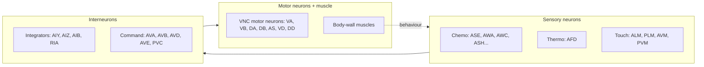
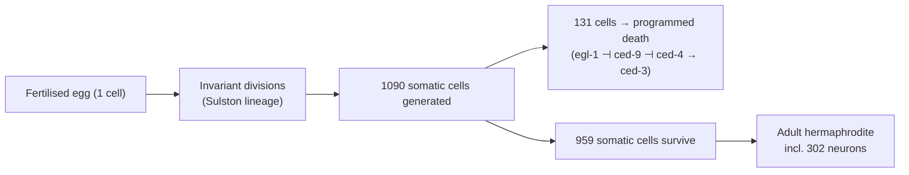
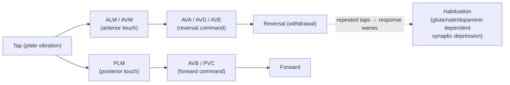

# The *C. elegans* Nervous System: The First Complete Connectome

> *"The mind of a worm."* — the informal title White, Southgate, Thomson and Brenner gave to the 1986 monograph that, for the first time in history, drew the complete wiring diagram of an animal's nervous system.

*Caenorhabditis elegans* is a free-living, soil-dwelling roundworm about a millimetre long. It is transparent, self-fertilising, and grows from egg to adult in roughly three days on a lawn of *E. coli*. It is also the only animal whose nervous system has been reconstructed neuron-by-neuron, synapse-by-synapse, from one end to the other — twice over, and now for both sexes. For that reason it occupies a singular place in neuroscience: it is the organism where we finally got to ask the question "if we knew *everything* about the wiring, could we predict behaviour?" — and where we learned that the honest answer is "not quite."

This chapter traces why a nematode became the founding model of connectomics, what its 302-neuron nervous system actually looks like, how the connectome was built and rebuilt, what circuits and behaviours it supports, and the hard, clarifying lesson that a complete map of connections is necessary but not sufficient to explain a mind.

---

## Table of Contents

1. [Why *C. elegans*?](#1-why-c-elegans)
2. [The Nervous System at a Glance](#2-the-nervous-system-at-a-glance)
3. [The 1986 Connectome: "The Mind of a Worm"](#3-the-1986-connectome-the-mind-of-a-worm)
4. [Corrections and the 2019 Whole-Animal Connectomes](#4-corrections-and-the-2019-whole-animal-connectomes)
5. [The Invariant Cell Lineage and Programmed Cell Death](#5-the-invariant-cell-lineage-and-programmed-cell-death)
6. [Behaviours and Their Circuits](#6-behaviours-and-their-circuits)
7. [The Tap-Withdrawal Circuit and Habituation Learning](#7-the-tap-withdrawal-circuit-and-habituation-learning)
8. [Connectome ≠ Function: The Hard Lesson](#8-connectome--function-the-hard-lesson)
9. [OpenWorm and Whole-Animal Simulation](#9-openworm-and-whole-animal-simulation)
10. [Relevance to Human Neuroscience](#10-relevance-to-human-neuroscience)
11. [Limitations](#11-limitations)
12. [Sources](#sources)

---

## 1. Why *C. elegans*?

In the early 1960s Sydney Brenner went looking for a metazoan simple enough to be understood *completely* — down to genes, cells and connections — yet complex enough to have real behaviour. He settled on *C. elegans* in 1963, and by 1974 had published the genetic foundations of the field. The choice proved inspired for a cluster of reasons that still make the worm a workhorse today.

| Feature | Why it matters |
|---|---|
| **Small and transparent** | ~1 mm long; every cell can be watched *in vivo* under a light microscope through the entire life cycle. |
| **Fixed cell number (eutely)** | The adult hermaphrodite has exactly **959 somatic cells** (plus the germ line); the male has **1,031**. Cell number is essentially invariant between individuals. |
| **Invariant cell lineage** | Every cell division from the fertilised egg to the adult was mapped and is the *same* in every animal — so any cell can be identified by name and history. |
| **Rapid, cheap culture** | ~3-day generation time; thousands of worms per plate; can be frozen and revived. |
| **Self-fertilising hermaphrodite** | Produces genetically identical offspring, making mutant lines trivial to maintain; occasional males allow crosses. |
| **Powerful genetics** | Forward and reverse genetics, RNAi by feeding, transgenics, and (in 1998) the *first* multicellular animal genome ever fully sequenced (~100 Mb, ~20,000 genes). |
| **Compact, mapped nervous system** | Few enough neurons to reconstruct exhaustively by electron microscopy. |

No other animal combined *all* of these. The worm is small enough to reconstruct in full but genetically and behaviourally rich enough to be worth reconstructing. That combination is what made the connectome project thinkable in the first place.

---

## 2. The Nervous System at a Glance

The adult hermaphrodite nervous system contains **exactly 302 neurons** — a number so stereotyped it is quoted like a physical constant. Those neurons are grouped into **118 morphological "classes,"** where a class is a set of neurons with essentially identical shape and connectivity (often bilateral left/right pairs, or radially symmetric groups of two, three, four or six).

The 302 neurons are split between two anatomically and developmentally near-independent nervous systems:

| Sub-system | Neurons | Role |
|---|---|---|
| **Somatic nervous system** | 282 | Sensation, integration, locomotion, egg-laying, most behaviour. |
| **Pharyngeal nervous system** | 20 | A semi-autonomous "gut brain" that drives rhythmic feeding (pharyngeal pumping); connected to the somatic system through a single pair of gap-junction neurons (RIP). |

Neurons fall into three broad functional types:

- **Sensory neurons** (~identified by named endings) — detect chemicals, temperature, touch, oxygen, humidity and light.
- **Interneurons** — integrate and route signals; a handful of "command interneurons" (AVA, AVB, AVD, AVE, PVC) set forward vs. backward locomotion.
- **Motor neurons** — drive the body-wall muscles and organs, largely along the ventral nerve cord.

Most neurons sit in **ganglia** clustered in the head (around the **nerve ring**, the worm's largest neuropil and closest thing to a brain), with additional ganglia in the tail and cell bodies strung along the ventral cord. The whole system is wired by roughly **7,000 synaptic connections**, comprising **~5,000 chemical synapses**, **~2,000 neuromuscular junctions**, and **~600 gap junctions** (electrical synapses).

Two features stand out compared with vertebrate brains:

1. **No action potentials in the classical sense (mostly).** Most *C. elegans* neurons are **isopotential and largely non-spiking**, signalling with graded, analogue voltage changes rather than all-or-none spikes. (A few neurons, e.g. AWA and AVL, have since been shown to fire calcium-based action potentials.) Neurons are also tiny and electrically compact.
2. **Anatomical determinism.** Because the lineage is invariant, neuron *N* in one worm is genuinely "the same" neuron as *N* in another, which is what makes a single canonical wiring diagram meaningful at all.

---

## 3. The 1986 Connectome: "The Mind of a Worm"

The reconstruction was a monumental feat of manual labour spanning more than a decade at the MRC Laboratory of Molecular Biology in Cambridge. **John White, Eileen Southgate, J. Nichol Thomson and Sydney Brenner** cut adult hermaphrodites into thousands of ultrathin (~50 nm) serial sections, imaged each by transmission **electron microscopy**, and then traced every neuronal process by hand across the entire stack — following each thin "wire" from section to section and marking every point where two membranes formed a chemical synapse or a gap junction.

The results appeared in 1986 in *Philosophical Transactions of the Royal Society B* as **"The Structure of the Nervous System of the Nematode *Caenorhabditis elegans*,"** a ~340-page monograph nicknamed **"The Mind of a Worm."**

What it delivered:

- The **morphology of all 302 neurons** and a **standardised naming scheme** (ASE, AVA, PLM, etc.) still universally used.
- Criteria for recognising chemical synapses and gap junctions in EM.
- A near-complete **adjacency and connectivity matrix** — the first complete wiring diagram of *any* nervous system.

Its importance is hard to overstate: it created the very idea of a **connectome** decades before the word existed (Sporns and Hagmann independently coined "connectome" in 2005), and it seeded network neuroscience, computational modelling and the entire field of connectomics. The Scientific American headline years later — *"Is Mapping the Mind of a Worm Worth It?"* — captured both the ambition and the ongoing debate.

**Important caveats about the original data:**

- It was **not truly one complete animal.** The reconstruction stitched together several worms — a well-imaged adult for most of the body, plus other specimens (including an L4 larva) to fill gaps, especially in the ventral cord and tail.
- It was **incomplete and error-containing.** Some regions were reconstructed only partially; weak/uncertain synapses were hard to score; and manual tracing over years inevitably introduced mistakes and gaps. White and colleagues were explicit that the map was a working draft, not gospel.

Those honest limitations set up the next thirty years of correction.

---

## 4. Corrections and the 2019 Whole-Animal Connectomes

The 1986 diagram was refined repeatedly. Two efforts stand out.

**Varshney, Chen, Paniagua, Hall & Chklovskii (2011)** digitised, curated and re-analysed the White data into a clean, publicly usable connectivity dataset, applying network science (small-world structure, hubs, motifs, rich clubs) to the somatic wiring.

**Cook, Jarrell, Emmons and colleagues (2019)**, in *Nature*, produced the landmark update: **whole-animal connectomes of *both* sexes.** Working from both new and re-examined electron micrographs (including the difficult tail and the male-specific circuitry), the Emmons and Hall groups reconstructed:

- the **adult hermaphrodite**, and
- the **adult male**,

as complete, **quantitative** wiring diagrams running from sensory input all the way to end-organ (muscle/gland) output — with connection *weights* estimated from the number and size of synaptic contacts, not just presence/absence.

Key numbers and findings:

| Quantity | Hermaphrodite | Male |
|---|---|---|
| Total neurons | 302 | **~385** (older counts: ~381–383) |
| Sex-specific neurons | 8 hermaphrodite-specific | ~91 male-specific (esp. mating circuitry in the tail) |
| Neuron classes | 118 | additional male classes |

- The two sexes **share ~294 neurons**, but a large fraction of the *shared* neurons are **sexually dimorphic in connectivity** — same cells, rewired. Sex-specific circuits (especially the male's elaborate tail apparatus for mating) feed into the shared "central" circuitry at identifiable convergence points.
- The updated hermaphrodite map revised many synapse calls relative to 1986 and provided consistent quantitative weights.

> **Note on the male neuron count.** The male is commonly cited as **383** neurons (the number carried from the older Sulston/Hodgkin lineage work) and as **385** in more recent complete reconstructions; the small discrepancy reflects revised scoring of a few cells. Both figures appear in the literature. The hermaphrodite's 302 has proven far more stable.

Related work (Witvliet, Zhen and colleagues, 2021) went on to reconstruct the connectome across **eight developmental stages**, showing how wiring matures from L1 larva to adult — revealing that the connectome is not static but grows and remodels along stereotyped rules.

---

## 5. The Invariant Cell Lineage and Programmed Cell Death

Parallel to the wiring project, **John Sulston** traced the worm's **complete cell lineage** — the full genealogical tree of every cell division from the single-celled zygote to the adult. Because the transparent embryo could be watched directly, Sulston (with Horvitz, Schierenberg, Kimble and others, culminating around 1983) established that the lineage is **essentially invariant**: the same sequence of divisions produces the same cells in the same positions in every animal.

Two facts from the lineage are central to neuroscience:

- The hermaphrodite generates **1,090 somatic cells** during development, of which exactly **131 undergo programmed cell death**, leaving the adult's 959 somatic cells. A large share of those deaths are of cells in the neuronal lineage.
- Because death is *programmed* — the same cells die every time, at the same point in development — Sulston and Horvitz realised cell death is an **actively controlled genetic process**, not passive damage.

Robert Horvitz's group turned this into molecular genetics, identifying the core **cell-death ("ced") genes** — *ced-3* and *ced-4* as executioners of apoptosis, *ced-9* as a protector that blocks them, and *egl-1* upstream — and showing this pathway is **evolutionarily conserved**: *ced-3* is a caspase, *ced-9* is the counterpart of human **Bcl-2**, and the worm pathway maps directly onto the machinery of apoptosis in humans.

For this body of work — the genetic regulation of organ development and programmed cell death — **Brenner, Sulston and Horvitz shared the 2002 Nobel Prize in Physiology or Medicine.** The discovery reframed apoptosis as fundamental to development, tissue homeostasis and disease (its failure contributes to cancer; its excess to neurodegeneration).

---

## 6. Behaviours and Their Circuits

Despite only 302 neurons, *C. elegans* has a real behavioural repertoire: it forages, navigates gradients, avoids danger, feeds, mates, lays eggs, sleeps (a lethargus state), and modifies its behaviour with experience. Because each neuron is identifiable and can be **laser-ablated** (or, later, silenced/activated with genetics and optogenetics), researchers can map specific behaviours onto specific cells with a precision impossible in larger animals.

### 6.1 Locomotion and the command interneurons

The worm moves by propagating dorso-ventral bends along its body. Direction is set by a small set of **command interneurons**: **AVB and PVC** promote forward crawling, while **AVA, AVD and AVE** promote backward (reversal) crawling. These drive the ventral-cord motor neuron classes (VA/DA for backward, VB/DB for forward; VD/DD as GABAergic inhibitors that coordinate the bend). Ablating the command interneurons abolishes coordinated movement — a clean structure-to-function result.

### 6.2 Chemotaxis

Worms navigate chemical gradients (attractants like salts and amino acids; repellents) using sensory neurons in the head **amphid** organs, especially the **ASE** pair (salt/ion sensing, with left/right functional asymmetry), **AWA** and **AWC** (volatile attractants), and **ASH** (nociception/avoidance). Navigation uses two complementary strategies:

- **Klinokinesis (biased random walk / "pirouettes"):** the worm suppresses turns when conditions improve and increases turn frequency when they worsen — a run-and-tumble strategy.
- **Klinotaxis (weathervaning):** during forward runs it makes small, gradual steering corrections up the gradient.

Sensory signals converge on interneurons **AIY, AIZ, AIB and RIA**, which bias the forward/reverse and steering circuitry.

### 6.3 Thermotaxis

*C. elegans* remembers the temperature at which it was recently fed and migrates toward it on a thermal gradient (thermotactic memory). The principal thermosensor is the **AFD** neuron pair, working with **AWC**; AFD signals to **AIY** and **AIZ** and then **RIA**. Laser ablation of AFD disrupts thermotaxis, and the AFD→AIY→RIA pathway is a textbook example of a defined sensorimotor circuit whose function is reconfigured by feeding state.

### 6.4 Gentle touch

Soft touch to the body is sensed by six **touch receptor neurons** — **ALM** and **AVM** (anterior) and **PLM** and **PVM** (posterior) — which use specialised mechanotransduction channels (the MEC/DEG-ENaC complex, a foundational discovery in mechanosensation). Anterior touch drives reversal (via the backward command interneurons); posterior touch drives acceleration/forward escape. This circuit is the substrate for the learning example below.

| Behaviour | Key sensory neurons | Key interneurons | Output |
|---|---|---|---|
| Forward/reverse locomotion | (touch, chemo inputs) | AVB, PVC / AVA, AVD, AVE | VNC motor neurons → muscle |
| Chemotaxis | ASE, AWA, AWC, ASH | AIY, AIZ, AIB, RIA | steering + turn frequency |
| Thermotaxis | AFD, AWC | AIY, AIZ, RIA | migration to preferred T |
| Gentle touch / escape | ALM, AVM, PLM, PVM | AVA/AVD (rev), AVB/PVC (fwd) | reversal or acceleration |
| Feeding | pharyngeal sensory (e.g. NSM, MC, I-neurons) | pharyngeal net | pharyngeal pumping |

---

## 7. The Tap-Withdrawal Circuit and Habituation Learning

The worm's best-studied learning paradigm is **habituation of the tap-withdrawal response**, developed largely by **Catharine Rankin** and colleagues.

**The behaviour.** Tapping the side of the Petri plate delivers a non-localised mechanical vibration; the worm responds by reversing (crawling backward a short distance). If the tap is repeated, the reversal response **wanes** — the animal habituates. This is genuine **non-associative learning**: it is stimulus-specific, reversible (dishabituation restores it), and shows both **short-term** memory (minutes) and, with spaced training, **long-term** memory (hours, requiring new protein synthesis and CREB).

**The circuit.** The tap-withdrawal circuit is one of the best-mapped learning circuits in any animal because every element is a named, identified neuron. It is built from the touch receptors and the command interneurons already described:

- **Sensory:** anterior touch cells **ALM/AVM** favour reversal; posterior touch cells **PLM** favour forward acceleration. A tap excites both, and the net behaviour reflects competition between the two.
- **Interneurons:** the forward (**AVB, PVC**) and backward (**AVA, AVD, AVE**) command interneurons integrate the sensory drive.

**The mechanism.** The primary sites of plasticity are the **glutamatergic synapses between the touch neurons and the command interneurons.** Habituation depends on **glutamate signalling** (the vesicular glutamate transporter **EAT-4** is required — *eat-4* mutants habituate abnormally while leaving the reflex itself intact) and is **modulated by dopamine**, which links the animal's mechanosensory experience to its feeding/food-context state. This makes tap-withdrawal a rare case where a form of memory can be traced to identified synapses between named neurons, with defined molecules — a miniature analogue of *Aplysia* gill-withdrawal habituation, but in an animal with a fully mapped connectome.

---

## 8. Connectome ≠ Function: The Hard Lesson

Here is the philosophical payoff — and the surprise. *C. elegans* was supposed to be the proof of concept that **knowing the wiring means understanding the behaviour.** We have the full parts list (302 neurons), the full wiring diagram (~7,000 synapses), the genome, and identifiable cells. And yet **we still cannot, from the connectome alone, predict what the worm will do.** The wiring diagram turned out to be *necessary but far from sufficient.* Why?

**1. The connectome is anatomy, not sign or strength.** An EM reconstruction tells you *that* neuron A contacts neuron B, and roughly how large the contact is — but not whether the synapse is **excitatory or inhibitory**, what **neurotransmitter/receptor** pair is used, or the dynamic **weight** and time-course. The same anatomical link can do opposite things depending on the receptor expressed post-synaptically.

**2. Extrasynaptic "wireless" signalling is everywhere.** Neurons also communicate by releasing **neuropeptides and monoamines** (dopamine, serotonin, octopamine, tyramine) that diffuse and act on **receptors on cells they never physically touch.** Barry Bentley and colleagues mapped this **"wireless" connectome** and found it barely overlaps the wired (synaptic) one, yet has its own rich topology — a broadcast-like monoamine network and a densely recurrent neuropeptide network. The 2023 **neuropeptidergic connectome** (Ripoll-Sánchez, Schafer and colleagues) estimated a *dense* peptide signalling network layered on top of the synaptic wiring — potentially connecting most of the nervous system by chemistry rather than contact. A synaptic wiring diagram simply cannot see any of this.

**3. Neuromodulation reconfigures circuits on the fly.** The *same* anatomical circuit produces *different* behaviour depending on internal state — hunger, arousal, recent experience. Feeding state, for instance, functionally rewires the thermosensory circuit. So a static connectome describes one frozen configuration of a circuit that is, in practice, many circuits.

**4. Signal propagation defies anatomy.** When researchers directly stimulated single neurons and measured which downstream neurons actually responded (Randi, Leifer and colleagues, "neural signal propagation atlas," 2023), the pattern of *functional* influence **did not match** what the anatomical connectome predicted — precisely because of extrasynaptic modulation and unmapped receptor expression.

**5. Individuality and non-neuronal factors.** Even with an invariant lineage, gene-expression differences, gap-junction plasticity, and the state of muscles and the body itself shape behaviour.

The lesson generalised across neuroscience: a connectome is a **scaffold** — an indispensable map — but a map of roads is not a map of traffic. To predict function you must overlay the **molecular identity** of each connection, the **neuromodulatory chemistry**, and the **dynamics of activity.** *C. elegans* is where the field learned this most cleanly, precisely because here the "we have everything" claim could actually be tested.

---

## 9. OpenWorm and Whole-Animal Simulation

If the connectome plus enough biophysics could reproduce behaviour, you should be able to **simulate the whole worm in a computer.** That is the explicit goal of **OpenWorm**, an open-science, distributed collaboration founded around 2011.

OpenWorm's architecture stitches together several modules:

| Component | What it does |
|---|---|
| **c302** | A framework (in Python, exporting to **NeuroML 2**) that builds network models of all ~302 neurons and the musculature from the connectivity data, at tunable levels of biophysical detail. |
| **Sibernetic** | A soft-body physics engine (C++/OpenCL, PCISPH fluid + biomechanics) that simulates the worm's body and its interaction with the surrounding fluid/agar, so simulated neural output can drive simulated movement. |
| **Geppetto** | A web-based platform for visualising and running the integrated multi-scale simulation. |
| **Data/curation (WormBase, etc.)** | Feeds anatomical, connectivity and physiological parameters into the models. |

OpenWorm has genuine achievements — it reproduced worm-like crawling waves from a connectome-driven model and built reusable, open simulation infrastructure. But its own leaders are candid that the project has **not** produced a biologically faithful virtual worm. The reasons are exactly the "connectome ≠ function" gaps from §8: the model needs **physiological parameters** (synaptic signs, strengths, dynamics, ion-channel properties, neuromodulatory state) that the anatomical connectome does not supply and that have been measured for only a fraction of the neurons. As the project has stated, the current level of biophysical detail remains **inadequate for biological research**, and closing the gap requires far more experimental constraint. OpenWorm is thus both a proof that the reductionist dream is *approachable* and a running demonstration of how much a wiring diagram leaves unspecified.

---

## 10. Relevance to Human Neuroscience

Why should anyone studying the human brain care about a millimetre-long worm with 302 neurons? Because the **molecules and mechanisms are deeply conserved**, and the worm lets you interrogate them with a speed and completeness impossible in mammals.

- **Shared genes.** Roughly **40%** of *C. elegans* protein-coding genes have a recognisable human ortholog (OrthoList 2 catalogues ~7,900 such genes, ~41% of the worm genome), and a large fraction of known human disease genes have worm counterparts.
- **Founding discoveries with human impact.** Apoptosis and the Bcl-2/caspase pathway (§5); **RNA interference** (Fire & Mello, Nobel 2006) discovered in the worm; **green fluorescent protein** first expressed as a transgenic reporter in *C. elegans* (Chalfie, Nobel 2008); microRNAs (*lin-4*) discovered in the worm (foundational to the 2024 Nobel work on gene regulation). Each reshaped human cell and neurobiology.
- **Neurodegeneration models.** Because worm neurons are identifiable and the animal is transparent, researchers express human disease proteins and watch specific neurons degenerate in a living animal, over days, at genome-wide screening scale:
  - **Alzheimer's:** worm orthologs *apl-1* (APP-like), *ptl-1* (tau-like), *sel-12*/*hop-1* (presenilins); transgenics expressing human Aβ or tau show paralysis and neuronal dysfunction.
  - **Parkinson's:** models of dopaminergic-neuron loss (the worm's 8 dopamine neurons are easily scored) using human **α-synuclein**, plus conserved *pink-1*, *djr-1.1/1.2* (DJ-1), *lrk-1* (LRRK2), *catp-6* (ATP13A2).
  - **Huntington's:** polyglutamine (polyQ) expansion models showing length-dependent aggregation and toxicity.
  - **ALS/FTD:** human **SOD1, TDP-43, FUS** and C9orf72-related models.
- **Basic principles.** Mechanotransduction (MEC channels), axon guidance (netrin/UNC-6, which *is* the worm), synaptic vesicle biology (UNC-13, UNC-18), and network-science concepts (small-world architecture, hubs, rich clubs) were all developed or validated in the worm and carry over to human neuroscience.

The worm is not a model of the human *brain* — it has no cortex, no myelin, and mostly graded rather than spiking signalling. It is a model of the **conserved molecular and cellular logic** those brains are built from, and a testbed for connectomics methods now being scaled to the fly, the mouse and, ultimately, the human.

---

## 11. Limitations

A clear-eyed accounting of what the *C. elegans* connectome is *not*:

- **A wiring diagram is not a function table.** It lacks synaptic sign, transmitter/receptor identity, weight dynamics, and all extrasynaptic (peptide/monoamine) signalling — the very things needed to predict activity (§8).
- **It is (mostly) a static average.** The canonical connectome is one snapshot; real circuits are reconfigured by state, experience and development, and vary somewhat between individuals despite the invariant lineage.
- **Historical data were composite and imperfect.** The 1986 map merged several animals (including larvae) and contained gaps and errors; even the 2019 reconstructions involve interpretation of weak/ambiguous synapses.
- **Male-count and scoring uncertainty.** Even the neuron *count* of the male is quoted variably (~383–385), reflecting genuine ambiguity in classifying a few cells.
- **Physiology lags anatomy.** Direct electrophysiology is hard in such tiny, isopotential cells; whole-animal calcium imaging helps but does not fully substitute. Many synapses have never been characterised functionally.
- **The nervous system is unusual.** Small, largely non-spiking, gap-junction-rich, with a pharyngeal "second nervous system." Some findings are worm-specific and do not transfer to spiking vertebrate circuits.
- **Simulation remains unfinished.** OpenWorm shows the parts list is not enough; a predictive virtual worm does not yet exist.

None of this diminishes the achievement. *C. elegans* remains the only animal whose complete connectome we possess for both sexes, the organism where connectomics was invented, and the clearest demonstration both of how much a wiring diagram gives you — and of exactly what it leaves out.

---

## Sources

- White JG, Southgate E, Thomson JN, Brenner S (1986). "The Structure of the Nervous System of the Nematode *Caenorhabditis elegans*." *Philosophical Transactions of the Royal Society B* — [Royal Society commentary (Emmons, 2015)](https://royalsocietypublishing.org/rstb/article/370/1666/20140309/22515/The-beginning-of-connectomics-a-commentary-on) · [PubMed](https://pubmed.ncbi.nlm.nih.gov/25750233/)
- [White et al. 1986 — OpenWorm Connectome Toolbox](http://openworm.org/ConnectomeToolbox/White_1986/)
- Cook SJ, Jarrell TA, Brittin CA, et al. (2019). "Whole-animal connectomes of both *Caenorhabditis elegans* sexes." *Nature* 571:63–71 — [Nature](https://www.nature.com/articles/s41586-019-1352-7) · [PubMed](https://pubmed.ncbi.nlm.nih.gov/31270481/) · [WormBase record](https://wormbase.org/resources/paper/WBPaper00056982)
- [Reconstructing worm connectomes by sex — *Lab Animal* news (2019)](https://www.nature.com/articles/s41684-019-0384-9)
- Witvliet D, Zhen M, et al. (2021). "Connectomes across development reveal principles of brain maturation." *Nature* — [Nature](https://www.nature.com/articles/s41586-021-03778-8)
- [The Connectome Debate: Is Mapping the Mind of a Worm Worth It? — *Scientific American*](https://www.scientificamerican.com/article/c-elegans-connectome/)
- [WormWiring (Emmons lab connectome data portal)](https://wormwiring.org/)
- [WormAtlas — Hermaphrodite Nervous System, General Overview](https://www.wormatlas.org/hermaphrodite/nervous/Neuroframeset.html)
- [The Nobel Prize in Physiology or Medicine 2002 — Press release (Brenner, Sulston, Horvitz)](https://www.nobelprize.org/prizes/medicine/2002/press-release/)
- [Sulston JE — "C. elegans: The Cell Lineage and Beyond," Nobel Lecture 2002 (PDF)](https://www.nobelprize.org/uploads/2018/06/sulston-lecture.pdf)
- ["Men are but worms": neuronal cell death in *C. elegans* and vertebrates — *Cell Death & Differentiation*](https://www.nature.com/articles/4401352)
- [Analyses of Habituation in *Caenorhabditis elegans* — *Learning & Memory* (Rankin)](https://learnmem.cshlp.org/content/8/2/63.full.html)
- [Mechanisms of plasticity in a *C. elegans* mechanosensory circuit — *Frontiers in Physiology* / PMC](https://pmc.ncbi.nlm.nih.gov/articles/PMC3750945/)
- [*eat-4* mutations affect habituation of the tap–withdrawal response — PMC](https://pmc.ncbi.nlm.nih.gov/articles/PMC6772661/)
- Wicks SR, Rankin CH. "Integration of mechanosensory stimuli in *C. elegans*." *J Neurosci* — [J Neurosci](https://www.jneurosci.org/content/15/3/2434)
- Iino Y, et al. "A circuit for navigation in *Caenorhabditis elegans*." *PNAS* — [PMC](https://pmc.ncbi.nlm.nih.gov/articles/PMC546636/)
- [Feeding state functionally reconfigures a sensory circuit (thermosensory plasticity) — *eLife*](https://elifesciences.org/articles/61167)
- [The role of the AFD neuron in *C. elegans* thermotaxis (laser ablation) — PMC](https://www.ncbi.nlm.nih.gov/pmc/articles/PMC1450292/)
- Bentley B, et al. "The Multilayer Connectome of *Caenorhabditis elegans*." *PLOS Comput Biol* — [PLOS](https://journals.plos.org/ploscompbiol/article?id=10.1371%2Fjournal.pcbi.1005283) · [PMC](https://pmc.ncbi.nlm.nih.gov/articles/PMC5215746/)
- Ripoll-Sánchez L, Schafer WR, et al. "The neuropeptidergic connectome of *C. elegans*." *Neuron* (2023) — [Cell/Neuron](https://www.cell.com/neuron/fulltext/S0896-6273(23)00756-0) · [PMC](https://pmc.ncbi.nlm.nih.gov/articles/PMC7615469/)
- Randi F, Leifer AM, et al. "Neural signal propagation atlas of *C. elegans*" — [arXiv](https://arxiv.org/pdf/2208.04790)
- [OpenWorm: overview and recent advances in integrative biological simulation — PMC](https://pmc.ncbi.nlm.nih.gov/articles/PMC6158220/)
- Gleeson P, et al. "c302: a multiscale framework for modelling the nervous system of *C. elegans*." *Phil Trans R Soc B* — [Royal Society](https://royalsocietypublishing.org/rstb/article/373/1758/20170379/42135/c302-a-multiscale-framework-for-modelling-the) · [OpenWorm docs](https://docs.openworm.org/Projects/c302/)
- [OpenWorm — Wikipedia](https://en.wikipedia.org/wiki/OpenWorm)
- [Modeling neurodegeneration in *Caenorhabditis elegans* — PMC](https://pmc.ncbi.nlm.nih.gov/articles/PMC7648605/)
- [Use of *C. elegans* as a model to study Alzheimer's and other neurodegenerative diseases — PMC](https://pmc.ncbi.nlm.nih.gov/articles/PMC4155875/)
- [Revisiting Neuronal Cell Type Classification in *Caenorhabditis elegans* — ScienceDirect](https://www.sciencedirect.com/science/article/pii/S096098221631212X)
