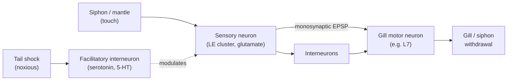
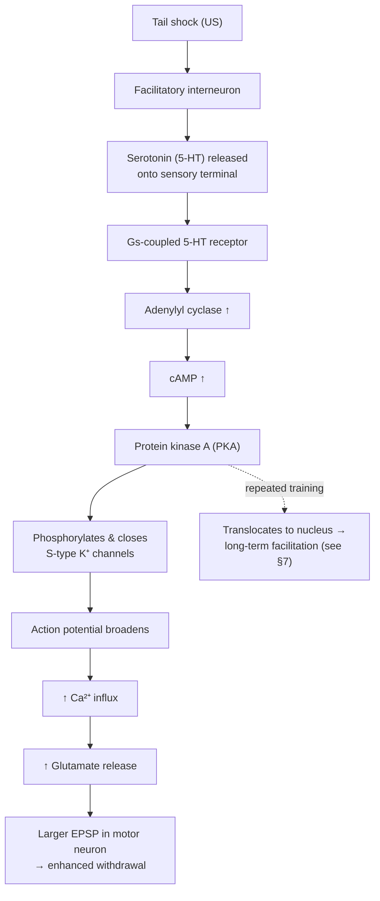
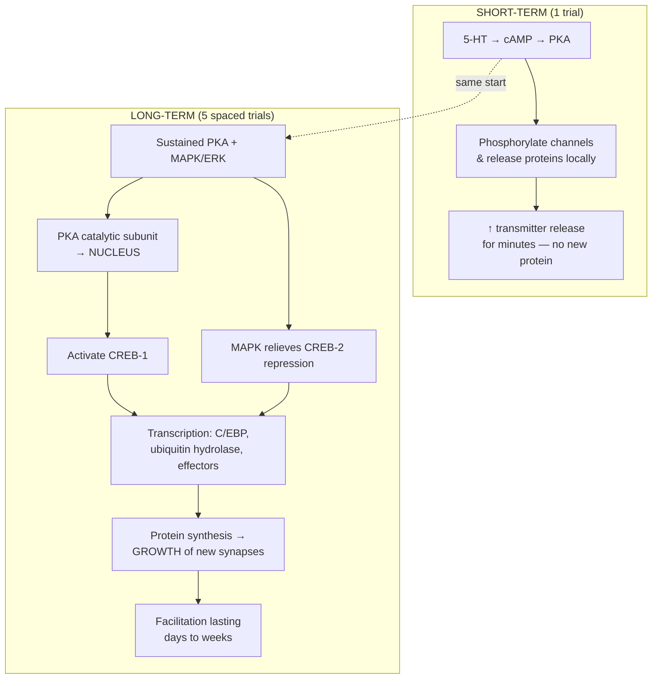

# Aplysia, the Sea Slug: How a Snail Revealed the Cellular Basis of Learning

> *Model organism dossier — Aplysia californica, the California sea hare.*
> Part of the **Claude-Lens** comparative-neuroscience series. Cross-references the human account in [`../docs/04-learning-and-memory.md`](../docs/04-learning-and-memory.md).

## Introduction

For most of the twentieth century, the question "what physically changes in the brain when we learn?" was answered only with metaphor. Learning was somewhere between the stimulus and the response, hidden inside a black box of billions of anonymous, densely tangled neurons. The decisive move that opened the box was not a better microscope or a cleverer theory — it was a change of animal. In the early 1960s a young psychiatrist-turned-neuroscientist, **Eric Kandel**, made a deliberate and, at the time, heretical bet: that the deepest secrets of memory would yield faster in a marine snail than in a mammal.

That snail is *Aplysia californica*, a hand-sized, sluggish herbivore of the Pacific tide pools. Its nervous system contains roughly **20,000 neurons** — against the human brain's ~86 billion — organized into a handful of ganglia. Crucially, many of those neurons are **enormous** (up to a millimetre across, visible to the naked eye, often pigmented) and **individually identifiable**: the same cell, with the same connections and the same job, can be found in animal after animal and given a name (R2, L7, the LE sensory cluster). In a mammalian cortex no two neurons are reliably "the same cell." In *Aplysia* they are. That single fact — reproducible, nameable, recordable cells — turned learning from a statistical abstraction into a problem you could impale on a microelectrode.

Over the following four decades, Kandel and his collaborators used a simple defensive reflex in this animal to work out, molecule by molecule, what happens at a synapse when an animal habituates, becomes sensitized, and forms associations — and, most importantly, **what distinguishes a memory that lasts minutes from one that lasts weeks**. That last distinction — short-term memory as *covalent modification of existing proteins*, long-term memory as *gene transcription and the physical growth of new synapses* — is the centerpiece of this document and one of the load-bearing pillars of modern neuroscience. It earned Kandel a share of the **2000 Nobel Prize in Physiology or Medicine**.

## Table of Contents

1. [Why Aplysia? The Logic of the Simple System](#1-why-aplysia-the-logic-of-the-simple-system)
2. [Eric Kandel's Program and the 2000 Nobel Prize](#2-eric-kandels-program-and-the-2000-nobel-prize)
3. [The Gill- and Siphon-Withdrawal Reflex as a Model System](#3-the-gill--and-siphon-withdrawal-reflex-as-a-model-system)
4. [Habituation: Learning to Ignore](#4-habituation-learning-to-ignore)
5. [Sensitization: Learning to Fear](#5-sensitization-learning-to-fear)
6. [Classical Conditioning: Learning an Association](#6-classical-conditioning-learning-an-association)
7. [The Centerpiece: Short-Term vs. Long-Term Memory](#7-the-centerpiece-short-term-vs-long-term-memory)
8. [Maintaining the Trace: CPEB and the Prion-Like Switch](#8-maintaining-the-trace-cpeb-and-the-prion-like-switch)
9. [From Sea Slug to Mammal: How the Findings Generalized](#9-from-sea-slug-to-mammal-how-the-findings-generalized)
10. [Limits of the Model: What a Snail Reflex Cannot Tell Us](#10-limits-of-the-model-what-a-snail-reflex-cannot-tell-us)
11. [The Molecular Cast: A Quick Glossary](#11-the-molecular-cast-a-quick-glossary)
12. [Summary](#12-summary)
13. [Sources](#sources)

---

## 1. Why Aplysia? The Logic of the Simple System

Kandel's choice rested on a strategic argument that was as much philosophy of science as biology: **the elementary properties of learning are likely to be conserved across evolution, so it is legitimate — and vastly more efficient — to study them in the simplest available nervous system that still learns.** If the molecular logic of memory is ancient, then a snail's synapse and a human's synapse should share the same core machinery. This is the classic *reductionist* strategy, and *Aplysia* offered a near-perfect substrate for it.

The animal's advantages compound one another:

| Feature | *Aplysia californica* | Mammalian brain |
|---|---|---|
| Total neurons | ~20,000 | ~86 billion (human) |
| Ganglia | ~9 (abdominal, cerebral, pleural, pedal, etc.) | one integrated brain |
| Cell size | Up to ~1 mm; visible, pigmented | Typically 4–100 µm |
| Identifiability | Individual neurons named and re-found across animals | Statistically defined populations |
| Recording | Stable intracellular recording from a *known* cell | Cell identity usually inferred |
| Circuit | Reflex mediated by a few dozen countable cells | Millions of cells per reflex arc |
| Behavior | Simple, quantifiable reflexes that nonetheless *learn* | Rich but hard to reduce |

The key methodological unlock is **identified neurons wired into a knowable circuit**. Because you can record from the *same* sensory neuron and the *same* motor neuron in every preparation — and even reconstitute the sensory-to-motor synapse in a dish as a two-cell "circuit in a culture dish" — you can ask a question no mammalian preparation of the era could answer cleanly: *when the animal's behavior changes with experience, does the strength of this specific, identified synapse change, and by exactly what molecular mechanism?* The black box between stimulus and response shrank to a single, interrogable connection.

A further gift: *Aplysia* exhibits genuine **learning** — habituation, dishabituation, sensitization, and both classical and operant conditioning — despite its tiny nervous system. It is complex enough to be interesting and simple enough to be solvable. That is the sweet spot every model organism aspires to.

---

## 2. Eric Kandel's Program and the 2000 Nobel Prize

Kandel began in the late 1950s studying the mammalian **hippocampus** — the structure that patient **H.M.** had by then implicated in human memory (see [`../docs/04-learning-and-memory.md`](../docs/04-learning-and-memory.md#61-the-case-of-hm)). But he grew convinced that the cellular mechanisms of memory would never be cracked in so complex a tissue, and — against the advice of senior colleagues who thought a "lower" invertebrate could reveal nothing about human memory — he switched to *Aplysia*.

The program unfolded in logical stages over roughly forty years:

1. **Map the circuit.** Identify the neurons of the gill-withdrawal reflex and their synaptic connections (1960s).
2. **Localize the change.** Show that a *behavioral* change (habituation, sensitization) corresponds to a *physiological* change at identified synapses (late 1960s–1970s).
3. **Find the mechanism of short-term change.** Trace sensitization to serotonin, cAMP, and PKA-mediated modulation of ion channels (1970s–1980s).
4. **Find the mechanism of long-term change.** Show that repeated training recruits gene transcription (CREB) and the growth of new synapses (1980s–1990s).
5. **Generalize.** Return to the mammalian hippocampus and mouse genetics to show the same molecular switches operate there (1990s onward).

In **2000**, Kandel received the **Nobel Prize in Physiology or Medicine** "for their discoveries concerning signal transduction in the nervous system," shared with **Arvid Carlsson** (dopamine) and **Paul Greengard** (dopamine and slow synaptic transmission / protein phosphorylation cascades). Kandel's specific contribution was the demonstration that **learning changes the strength of synapses**, that **short- and long-term memory use distinct molecular mechanisms**, and that **long-term memory requires gene expression and structural growth**. His later popular memoir, *In Search of Memory* (2006), narrates the intellectual arc.

### 2.1 Landmark Experiments at a Glance

| Era | Advance | Significance |
|---|---|---|
| Early 1960s | Kandel leaves the hippocampus for *Aplysia* | Strategic bet on the simple system |
| Late 1960s | Circuit of the gill-withdrawal reflex mapped (with Kupfermann, Castellucci) | Identified sensory, motor, and interneurons |
| 1970 | Habituation localized to homosynaptic depression | Behavior ↔ identified synapse, directly linked |
| 1970s–80s | Sensitization traced to 5-HT → cAMP → PKA → K⁺-channel closure | First complete molecular chain for learning |
| 1983 | Activity-dependent presynaptic facilitation (Hawkins et al.) | Cellular mechanism of classical conditioning |
| Mid-1980s | Sensory-motor synapse reconstituted **in culture** | Two cells + serotonin = a learning "circuit" |
| Late 1980s–90s | Long-term facilitation shown to need CREB and protein synthesis | Short→long memory is a transcriptional switch |
| 1990s | New synaptic varicosities grow with long-term facilitation | Memory as anatomical, not just functional, change |
| 2003–2010 | CPEB found to be prion-like and self-sustaining (Si, Kandel) | Candidate mechanism for memory *persistence* |

---

## 3. The Gill- and Siphon-Withdrawal Reflex as a Model System

*Aplysia* breathes through a **gill** housed in the mantle cavity, protected by a flap called the **mantle shelf** and drained by a fleshy spout, the **siphon**. When the siphon or mantle is touched, the animal reflexively retracts gill and siphon into the cavity for protection — the **gill- and siphon-withdrawal reflex (GWR)**. It is defensive, graded, robust, and — decisively — **plastic**: its magnitude changes with experience.

### 3.1 The Circuit

The reflex is mediated by a compact, countable circuit in the **abdominal ganglion**:

- **Sensory neurons** — a cluster of ~**24 mechanosensory neurons** (the "LE" cells) innervating the siphon skin; they release the excitatory transmitter **glutamate**.
- **Motor neurons** — a small set of ~**6 gill motor neurons** (the best-studied is **L7**) and siphon motor neurons that contract the muscle.
- **Interneurons** — excitatory and inhibitory interneurons that feed into the motor neurons in parallel with the direct pathway.
- **Facilitatory (modulatory) interneurons** — critically, cells that release **serotonin (5-HT)** onto the sensory neurons' terminals; these are the substrate of sensitization.

The sensory neurons connect to the motor neurons **monosynaptically** (a direct sensory→motor synapse) *and* polysynaptically (via interneurons). The monosynaptic connection is the workhorse of the entire research program: it is a single, identified, glutamatergic synapse whose strength (measured as the **excitatory postsynaptic potential, EPSP**, in the motor neuron) can be tracked before, during, and after learning.

### 3.2 What Makes It a Model

The reflex expresses at least four distinct forms of learning, letting a single preparation cover a large slice of the learning taxonomy:

| Form of learning | Behavioral definition | Stimulus arrangement |
|---|---|---|
| **Habituation** | Reflex *weakens* with repetition of a harmless stimulus | Repeated gentle siphon touch |
| **Dishabituation** | A habituated reflex is *restored* by a strong stimulus | Tail shock after habituation |
| **Sensitization** | Reflex is *enhanced* to many stimuli after a noxious one | Tail shock alone |
| **Classical conditioning** | Reflex to a specific weak stimulus is *selectively* enhanced when that stimulus predicted a shock | Siphon touch (CS) *paired* with tail shock (US) |

Each of these maps onto a specific, traceable change at the sensory-to-motor synapse — which is exactly why the reflex became the "hydrogen atom" of learning research.

---

## 4. Habituation: Learning to Ignore

**Habituation** is the simplest form of learning: an animal learns to stop responding to a repeated, inconsequential stimulus. Touch the siphon gently, again and again, and the gill withdrawal shrinks and eventually all but disappears. This is not fatigue or sensory adaptation — the animal will respond fully to a different stimulus — it is a genuine, storable decrement.

### 4.1 Mechanism: Homosynaptic Depression

The change is **presynaptic and homosynaptic** (it occurs in the very pathway that was stimulated). With each repeated action potential in the sensory neuron, **less glutamate is released** onto the motor neuron, so the EPSP progressively shrinks. The immediate cause is a **decrease in the number of transmitter vesicles released per impulse** — attributable to reduced Ca²⁺ influx and/or depletion of the readily-releasable vesicle pool at the sensory terminal. The postsynaptic motor neuron's sensitivity is essentially unchanged; the deficit is on the *sending* side.

### 4.2 Short- vs. Long-Term Habituation

A single training session of ~10 stimuli produces habituation lasting **minutes**. But **repeated sessions spaced over days** (e.g., four sessions of ten stimuli) produce habituation that persists for **weeks**. And here the first hint of the great dichotomy appears: long-term habituation is accompanied by a **structural change** — a *reduction* in the number of synaptic connections (active zones/varicosities) between sensory and motor neurons. Short-term habituation adjusts release probability at existing synapses; long-term habituation physically prunes the connection. Prolonged habituation also depends on **protein synthesis, protein phosphatase activity, and postsynaptic glutamate receptors**, showing it is not merely the passive decay of the sensitized state.

### 4.3 Dishabituation Is Not Just "Un-Habituation"

A subtle but historically important point: when a strong stimulus (tail shock) is applied to an animal whose reflex has been *habituated*, the reflex is **restored** — this is **dishabituation**. It is tempting to read dishabituation as the mechanical reversal of habituation, as if the shock simply "erased" the depression. Kandel's group showed it is nothing of the kind. **Dishabituation and sensitization are the same process** — the serotonin-driven **presynaptic facilitation** of §5 — superimposed on the synapse. In the habituated (depressed) synapse it *looks* like restoration; in a naïve synapse the identical process *looks* like sensitization above baseline. Facilitation and depression are **independent, superimposable** modifications of the same terminal, acting through different molecular routes (5-HT/cAMP/PKA enhancement versus reduced-release depression). Recognizing that a single facilitatory mechanism accounted for both dishabituation *and* sensitization was a key simplification that pointed the whole program toward the cAMP cascade.

---

## 5. Sensitization: Learning to Fear

**Sensitization** is the mirror image of habituation: after a noxious stimulus (a shock to the tail), the animal becomes hyper-responsive, withdrawing its gill more vigorously to even gentle touches. It is a form of non-associative learning — a generalized "the world is dangerous now" state — and it is the process in which Kandel's team worked out the canonical molecular cascade.

### 5.1 The Presynaptic Facilitation Cascade

Tail shock activates **facilitatory interneurons** that release **serotonin (5-HT)** onto the *terminals* of the siphon sensory neurons. What follows is a beautifully linear signal-transduction chain — **presynaptic facilitation** — that increases glutamate release from the sensory neuron onto the motor neuron:

1. **Serotonin** binds a **G-protein-coupled receptor** on the sensory neuron terminal.
2. The G-protein (Gs) activates **adenylyl cyclase**, raising intracellular **cyclic AMP (cAMP)**.
3. cAMP activates **protein kinase A (PKA)**.
4. PKA **phosphorylates target proteins**, notably the **S-type K⁺ channel** (and other substrates), *closing* these potassium channels.
5. With less K⁺ current available to repolarize the membrane, the sensory neuron's **action potential broadens** (its duration increases).
6. A broader action potential keeps voltage-gated **Ca²⁺ channels open longer**, so **more Ca²⁺ enters** the terminal.
7. More presynaptic Ca²⁺ drives **more glutamate release** → a larger EPSP in the motor neuron → a stronger reflex.

A second kinase, **protein kinase C (PKC)**, contributes a parallel arm that mobilizes vesicles to release sites (important when the synapse is depressed). The net effect is the same: enhanced transmitter release from an identified synapse, produced by covalently modifying proteins that are *already there*.

### 5.2 Facilitation In a Dish

A landmark simplification: this whole process can be reconstituted with a **single sensory neuron and a single motor neuron grown in culture**, with serotonin applied by pipette. **One pulse of 5-HT** produces facilitation lasting **minutes** (short-term). **Five spaced pulses of 5-HT** produce facilitation lasting **more than 24 hours** (long-term). This reduction of a behavior to two cells and a drug is what made the short-term/long-term mechanism dissectable — the subject of §7.

---

## 6. Classical Conditioning: Learning an Association

Sensitization is non-associative — the tail shock enhances responses to *everything*. **Classical (Pavlovian) conditioning** is associative and *specific*: pair a weak touch to the siphon (the **conditioned stimulus, CS**) with a tail shock (the **unconditioned stimulus, US**), and the reflex to *that* CS grows selectively — more than it would from the shock alone, and more than to an unpaired control stimulus. The animal has learned that the touch *predicts* danger.

### 6.1 Activity-Dependent Presynaptic Facilitation

The elegant discovery (Hawkins, Kandel, and colleagues) is that conditioning is a **refinement of the sensitization machinery**. Tail shock produces *greater* facilitation of a sensory neuron's synapse **if that sensory neuron has just fired** (because the CS activated it) than if it fired at an unrelated time. This is **activity-dependent presynaptic facilitation**, and the mechanism is:

- CS-driven spiking in the sensory neuron admits a pulse of **Ca²⁺** into the terminal.
- That Ca²⁺ (via **calmodulin**) **primes adenylyl cyclase**, so when serotonin from the US arrives moments later, the cyclase produces an **amplified cAMP** response.
- The result is **more PKA, more channel phosphorylation, more facilitation** — but *only* at the synapse whose activity preceded the shock.

Adenylyl cyclase thus behaves as a **molecular coincidence detector**: it reads out the conjunction of "sensory neuron just fired" (Ca²⁺) *and* "shock is happening" (5-HT), and it fires strongly only when both are present in the right order. This gives conditioning its hallmark **temporal specificity** — the CS must slightly *precede* the US.

### 6.2 A Hebbian, Postsynaptic Component Too

Later work showed the story is not purely presynaptic. Conditioning also recruits a **postsynaptic, Hebbian, NMDA-receptor-dependent** form of potentiation in the motor neuron — strengthened when pre- and postsynaptic cells are active together — which then feeds back onto the presynaptic terminal via a **retrograde signal**. The two mechanisms are **required together and interact**. This matters enormously for §9: it means the *Aplysia* synapse uses the **same NMDA-receptor coincidence-detection logic** later found to underlie LTP in the mammalian hippocampus. The coincidence detector for the *content* of the association (which synapse) is the NMDA receptor; the coincidence detector for the *timing* is adenylyl cyclase. (Compare the mammalian NMDA-receptor coincidence detector in [`../docs/04-learning-and-memory.md`](../docs/04-learning-and-memory.md#82-ltp-induction-the-nmda-receptor-as-coincidence-detector).)

### 6.3 Operant Conditioning, Too

The reflexive gill withdrawal is *classical* (stimulus-driven) conditioning, but *Aplysia* also supports **operant conditioning**, in which the animal learns from the *consequences of its own behavior*. In a well-studied paradigm, gill withdrawal (or, in a related preparation, feeding behavior mediated by the buccal ganglion) is reinforced contingent on the animal's own action, and the probability of that action changes accordingly. Operant learning in *Aplysia* engages an overlapping but partly distinct molecular logic — again converging on **cAMP/PKA signaling** and, for the feeding circuit, dopamine as the reinforcement signal. That a single small animal can be pushed to demonstrate habituation, sensitization, *and* both major forms of associative conditioning is precisely what made it such an economical laboratory for the general principles of learning.

---

## 7. The Centerpiece: Short-Term vs. Long-Term Memory

Here is the conceptual heart of the *Aplysia* story and its most transferable lesson: **short-term and long-term memory are not the same memory of different durations — they are mechanistically different phenomena that share a beginning and then diverge.** The dividing line is the **nucleus**. Short-term memory modifies proteins that already exist at the synapse; long-term memory changes which genes are read and physically rebuilds the synapse.

### 7.1 The Divergence Point

Everything begins the same way — serotonin, cAMP, PKA. What differs is **how much training** and therefore **whether PKA stays at the synapse or travels to the nucleus**.

| Property | **Short-term memory / facilitation** | **Long-term memory / facilitation** |
|---|---|---|
| Induction | One tail shock / **one** pulse of 5-HT | ~Five spaced shocks / **five** pulses of 5-HT |
| Duration | Minutes to <1 hour | Days to weeks (≥24 h in culture) |
| Site of action | Existing synaptic proteins | Cell nucleus → whole synapse |
| Core event | **Covalent modification (phosphorylation)** of channels/release proteins by PKA & PKC | **Gene transcription** driven by CREB |
| Protein synthesis? | **Not required** | **Required** (de novo mRNA and protein) |
| Structural change? | None — same synapses, modulated | **Growth of new synaptic varicosities/connections** |
| Reversibility | Decays as phosphates are removed | Structurally stabilized |

### 7.2 Short-Term Memory: Modifying What Already Exists

A single training trial produces just enough cAMP/PKA to phosphorylate ion channels and release machinery **locally at the terminal**, as described in §5. Transmitter release is enhanced for minutes; as protein phosphatases strip the phosphate groups off again, the synapse relaxes to baseline and the memory fades. No new proteins are made; nothing is built. Short-term memory is, quite literally, a **transient chemical modification of pre-existing molecules** — fast, cheap, and impermanent.

### 7.3 Long-Term Memory: Changing Gene Expression and Building New Synapses

With **repeated, spaced** training, the cascade crosses a threshold. Two things change:

**(a) The kinases go nuclear.** Sustained cAMP/PKA signaling — reinforced by the **MAPK/ERK** pathway — causes the **catalytic subunit of PKA to translocate from the synapse into the nucleus**. There it, and MAPK, phosphorylate and activate the transcription factor **CREB-1** (cAMP-response-element-binding protein) bound to **CRE** promoter elements.

**(b) A repressor is lifted.** CREB activity is held in check by an antagonist, **CREB-2** (a repressor). MAPK **phosphorylates and relieves CREB-2 repression**. Only when the activator (CREB-1) is switched on *and* the repressor (CREB-2) is switched off does the gene program run. This dual gate is why long-term memory needs *repeated* training: a single trial cannot both drive CREB-1 and de-repress CREB-2. Strikingly, **experimentally removing CREB-2 lets even a single pulse of serotonin — normally good for only minutes — produce long-lasting facilitation and new synapse growth.** The threshold is a molecular decision, not a fixed law.

**(c) Genes fire, and the synapse grows.** Activated CREB-1 switches on **immediate-early genes**, including the transcription factor **C/EBP** and a **ubiquitin C-terminal hydrolase** (which degrades the regulatory subunit of PKA, making the kinase persistently active — a positive feedback loop). Downstream effector genes drive **local protein synthesis and the physical growth of new presynaptic varicosities**: sensory neurons undergoing long-term facilitation roughly **double their number of synaptic terminals** onto the motor neuron. The memory is now embodied not as a modulated synapse but as **more synapses**. (Recall that long-term *habituation* does the opposite — it *prunes* connections. Structural change is bidirectional.)

### 7.4 Temporal Phases and Timescales

The two-state picture is really a continuum of at least three phases, each cleanly demonstrable in *Aplysia*:

| Phase | Typical induction | Duration | Dependency |
|---|---|---|---|
| **Short-term (STM)** | 1 tail shock | < ~30 min | Covalent modification only |
| **Intermediate-term (ITM)** | few trials | ~90 min – 3 h | Persistent kinase activity (e.g. PKC); some local protein synthesis |
| **Long-term (LTM)** | 4–5 spaced trials (ISI ~15 min) | Onset ~10 h, lasts ~1–5 days (recall fades ~1 wk; "savings" ~2 wk) | Gene transcription + new protein + structural growth |

The **spacing** of training is not incidental: massed trials favor short-lived memory, whereas *spaced* trials cross the transcription threshold and build lasting structure — the cellular basis of the "spacing effect" familiar from human learning.

**The synthesis:** short-term memory is a *functional* change (a synapse turned up); long-term memory is an *anatomical* change (a synapse rebuilt), and the switch between them is thrown in the nucleus by CREB. This single result reframed memory as, at bottom, **a problem of gene regulation and synaptic growth**.

---

## 8. Maintaining the Trace: CPEB and the Prion-Like Switch

A deep puzzle remained even after CREB: proteins turn over in days, yet memories last years. How does a synapse *remember which of its terminals* was strengthened, long after the transcription burst is over and the CREB signal has decayed? Kandel's group (with Kausik Si) proposed a startling answer involving **CPEB** (cytoplasmic polyadenylation element binding protein), a regulator of **local, synapse-specific protein synthesis**.

The neuronal isoform of *Aplysia* CPEB has a **prion-like domain**. Like a prion, it can adopt a **self-perpetuating, aggregated (multimeric) conformation** — and, unusually, the **aggregated form is the *active* one** that promotes translation of dormant mRNAs at the synapse. Serotonin (the sensitizing signal) **enhances conversion of CPEB to the active multimeric state** at activated synapses. Once seeded, the aggregate **recruits newly made CPEB into the same active state**, sustaining local protein synthesis at that specific terminal indefinitely — a **self-sustaining biochemical memory** that outlives any individual protein molecule. An antibody blocking the multimeric form blocks the *persistence* of long-term facilitation without preventing its induction.

This converts a normally pathological trick (prion self-templating, as in mad-cow disease) into a **physiological memory-maintenance device**: a molecular latch, thrown at the tagged synapse, that keeps the "on" state on. It offers a candidate solution to the storage-stability paradox and remains one of the most influential ideas to emerge from the *Aplysia* program.

---

## 9. From Sea Slug to Mammal: How the Findings Generalized

Kandel's reductionist bet paid off: the *Aplysia* molecular logic proved to be **broadly conserved**, and it returned to illuminate the very mammalian hippocampus he had abandoned. The mammalian counterpart of *Aplysia* facilitation is **long-term potentiation (LTP)** — discovered by Bliss and Lømo (1973) — and the parallels are striking. (Full mammalian account: [`../docs/04-learning-and-memory.md`](../docs/04-learning-and-memory.md#8-the-synaptic-and-cellular-basis-of-memory-ltp-and-ltd).)

| Principle | *Aplysia* (sensitization / facilitation) | Mammalian hippocampus (LTP / memory) |
|---|---|---|
| Learning = synaptic change | Sensory→motor synapse strength changes | CA3→CA1 synapse strength changes |
| Coincidence detection | NMDA receptor (content) + adenylyl cyclase (timing) | **NMDA receptor** as coincidence detector |
| Second messengers | cAMP, Ca²⁺, PKA, PKC, MAPK | Ca²⁺, CaMKII, PKA, PKC, MAPK |
| Short vs. long term | Covalent modification vs. transcription | **Early-LTP** (post-translational) vs. **Late-LTP** (transcription) |
| The master switch | **CREB** converts short→long | **CREB** converts early→late LTP |
| Long-term substrate | Growth of new synaptic varicosities | Spine enlargement, new synaptic contacts |
| Protein-synthesis dependence | LTF blocked by transcription/translation inhibitors | Late-LTP blocked by the same |

The single most important transferable discovery is **CREB as a conserved molecular switch** for converting short-term into long-term memory. Blocking CREB (or protein synthesis) after learning spares short-term but abolishes long-term memory in *Aplysia*, in *Drosophila*, and in mice — an evolutionary through-line from mollusc to mammal. The demonstration that an **NMDA-receptor-dependent, Hebbian LTP** operates at the *Aplysia* sensory-motor synapse further dissolved the old dogma that invertebrate learning was "presynaptic" and vertebrate learning "postsynaptic": both use both. Kandel closed the loop personally, using **transgenic mice** to show CREB and PKA govern hippocampal LTP and spatial memory, uniting the two halves of his career.

---

## 10. Limits of the Model: What a Snail Reflex Cannot Tell Us

The power of the *Aplysia* preparation comes from radical simplification, and simplification always costs. Honest extrapolation requires naming the gaps.

- **A reflex is not a memory palace.** The GWR is **implicit, non-declarative, procedural** learning — the modification of a defensive reflex. It is silent about **declarative memory** (facts and events), the domain of the human hippocampus and patient H.M. A snail cannot tell us how we remember a face or a fact, only how a synapse changes.
- **Simple circuits, distributed truths.** Even the "simple" reflex turned out to be more complex than first drawn: peripheral (non-central) plasticity, interneuronal contributions, and multiple parallel pathways all matter. The clean sensory→motor synapse is a *major* site of learning, not the *sole* site.
- **Molecular conservation ≠ behavioral equivalence.** Sharing CREB, cAMP, and NMDA receptors shows deep homology of *mechanism*, but a mollusc's few days of sensitization is not the functional equal of a mammal's lifelong autobiographical memory. Conserved parts can be assembled into very different cognitive machines.
- **The correlation problem.** Because the *Aplysia* synapse is directly in the reflex arc, changes there **are** the learning. In the mammalian hippocampus, LTP can only be *loosely correlated* with a behavior like Morris-water-maze performance — the link from synapse to behavior is inferential, not identity. The very cleanliness that makes *Aplysia* persuasive is missing upstairs.
- **Not uniquely simple anymore.** Many "simple" invertebrates (*Drosophila*, *C. elegans*, *Hermissenda*, honeybees) also learn, and modern mammalian tools (optogenetics, engram tagging, in-vivo imaging) now allow causal memory experiments once possible only in a snail. *Aplysia*'s historical role as *the* window onto the cellular basis of learning is secure; its role as the *only* such window has passed.

None of this diminishes the achievement. The correct reading is the one Kandel intended: *Aplysia* revealed the **elementary alphabet** of synaptic memory — depression, facilitation, coincidence detection, the phosphorylation-to-transcription switch, structural growth. Mammalian brains write far longer and stranger sentences, but they do so with the same letters.

---

## 11. The Molecular Cast: A Quick Glossary

| Player | What it is | Role in the Aplysia story |
|---|---|---|
| **Glutamate** | Excitatory neurotransmitter | Released by sensory neurons; its *amount* is what habituation and facilitation tune |
| **Serotonin (5-HT)** | Neuromodulator | The sensitizing signal, released by facilitatory interneurons onto sensory terminals |
| **Adenylyl cyclase** | Enzyme making cAMP | Timing **coincidence detector** in conditioning (Ca²⁺/calmodulin + 5-HT sensitive) |
| **cAMP** | Second messenger | Rises with 5-HT; activates PKA |
| **PKA** | cAMP-dependent protein kinase | Phosphorylates channels (short-term); translocates to nucleus (long-term) |
| **PKC** | Protein kinase C | Parallel arm mobilizing vesicles; sustains intermediate-term memory |
| **S-type K⁺ channel** | Potassium channel | Closed by PKA phosphorylation → spike broadening → more Ca²⁺ |
| **MAPK / ERK** | Kinase cascade | Reinforces nuclear signaling; relieves CREB-2 repression |
| **CREB-1** | Transcription activator | The **master switch** turning short-term into long-term memory |
| **CREB-2** | Transcription repressor | Gate that must be *lifted* for long-term memory; its removal lowers the threshold |
| **C/EBP** | Immediate-early transcription factor | CREB-1 target driving the long-term growth program |
| **CPEB** | Local-translation regulator | Prion-like latch that **maintains** long-term facilitation at tagged synapses |
| **NMDA receptor** | Glutamate receptor / coincidence detector | Postsynaptic, Hebbian component of conditioning (bridge to mammalian LTP) |

---

## 12. Summary

- *Aplysia californica* offered ~20,000 large, individually identifiable neurons in a knowable circuit — the ideal substrate for reducing learning to events at a single, named synapse.
- **Eric Kandel** used the **gill- and siphon-withdrawal reflex** to prove that learning changes synaptic strength, winning a share of the **2000 Nobel Prize**.
- **Habituation** = presynaptic *depression* (less glutamate released); **sensitization** = presynaptic *facilitation* via serotonin → cAMP → PKA → K⁺-channel closure → broader spike → more Ca²⁺ → more transmitter; **classical conditioning** = *activity-dependent* facilitation, with adenylyl cyclase as a timing coincidence detector and an NMDA-receptor Hebbian component.
- The **centerpiece**: short-term memory is **covalent modification (phosphorylation) of existing proteins**, needs no new protein, and lasts minutes; long-term memory requires **PKA/MAPK signaling to the nucleus, CREB-driven gene transcription (with CREB-2 de-repression), new protein synthesis, and the physical growth of new synapses**, lasting days to weeks. **CPEB**, a prion-like protein, may latch the change in place for the long haul.
- These principles — CREB as the short→long switch, NMDA coincidence detection, transcription-dependent structural growth — **generalized to mammalian LTP and memory**, though a defensive reflex remains a limited stand-in for declarative memory.

---

## Sources

- [Nobel Prize in Physiology or Medicine 2000 — Eric Kandel (facts)](https://www.nobelprize.org/prizes/medicine/2000/kandel/facts/)
- [Eric Kandel — Britannica](https://www.britannica.com/biography/Eric-Kandel)
- [Aplysia gill and siphon withdrawal reflex — Wikipedia](https://en.wikipedia.org/wiki/Aplysia_gill_and_siphon_withdrawal_reflex)
- [Kupfermann & Kandel, "Neuronal Mechanisms of Habituation and Dishabituation of the Gill-Withdrawal Reflex in Aplysia" — Science (1970)](https://www.science.org/doi/10.1126/science.167.3926.1745)
- [Antonov et al., "A Simplified Preparation for Relating Cellular Events to Behavior… Habituation, Dishabituation, and Sensitization of the Aplysia Gill-Withdrawal Reflex" — J. Neuroscience (1997)](https://www.jneurosci.org/content/17/8/2886)
- ["Prolonged Habituation of the Gill-Withdrawal Reflex… Protein Synthesis, Protein Phosphatase Activity, and Postsynaptic Glutamate Receptors" — J. Neuroscience (2003)](https://www.jneurosci.org/content/23/29/9585)
- [Hawkins et al., "A Cellular Mechanism of Classical Conditioning in Aplysia: Activity-Dependent Amplification of Presynaptic Facilitation" — Science (1983)](https://www.science.org/doi/10.1126/science.6294833)
- [Antonov et al., "Activity-Dependent Presynaptic Facilitation and Hebbian LTP Are Both Required and Interact during Classical Conditioning in Aplysia" — Neuron (2003)](https://www.cell.com/fulltext/S0896-6273(02)01129-7)
- [Kandel, "The molecular biology of memory: cAMP, PKA, CRE, CREB-1, CREB-2, and CPEB" — Molecular Brain (2012)](https://link.springer.com/article/10.1186/1756-6606-5-14)
- [Kandel, Dudai & Mayford, "The Molecular and Systems Biology of Memory" / "Synapses and Memory Storage" — PMC](https://pmc.ncbi.nlm.nih.gov/articles/PMC3367555/)
- [Si et al., "Aplysia CPEB Can Form Prion-like Multimers in Sensory Neurons that Contribute to Long-Term Facilitation" — Cell (2010)](https://www.cell.com/fulltext/S0092-8674(10)00009-7)
- ["A Neuronal Isoform of the Aplysia CPEB Has Prion-Like Properties" — Cell (2003)](https://www.sciencedirect.com/science/article/pii/S0092867403010201)
- [Wainwright et al., "Interaction between Amount and Pattern of Training in the Induction of Intermediate- and Long-Term Memory for Sensitization in Aplysia" — PMC](https://www.ncbi.nlm.nih.gov/pmc/articles/PMC155928/)
- [Molecular Mechanisms of Memory: Aplysia — MSU Introduction to Neuroscience (open textbook)](https://openbooks.lib.msu.edu/introneuroscience1/chapter/molecular-mechanisms-of-memory-aplysia/)
- [Roberts & Glanzman, "Learning in Aplysia: looking at synaptic plasticity from both sides" — Trends in Neurosciences (2003)](https://www.cell.com/trends/neurosciences/abstract/S0166-2236(03)00333-3)

*Companion reading in this series: [`../docs/04-learning-and-memory.md`](../docs/04-learning-and-memory.md) (the human learning & memory account — LTP, CREB, the engram, and patient H.M.).*
