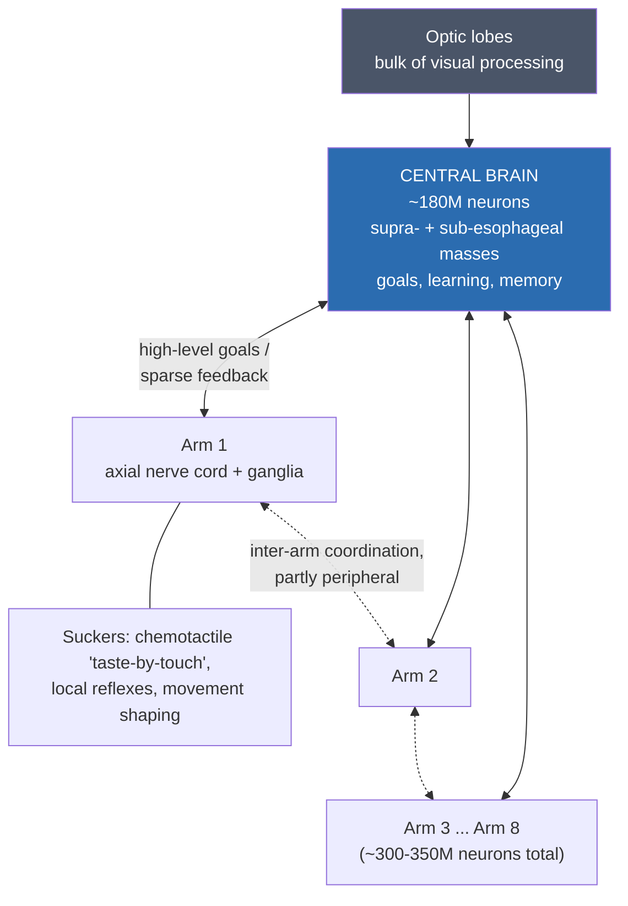
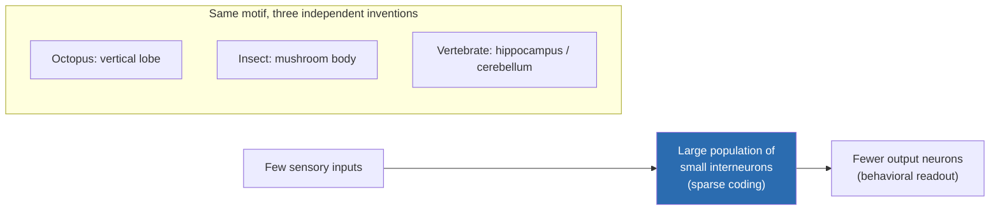

# The Octopus & Cephalopod Nervous System: A Second Experiment in Building a Mind

> *"If we want to understand other minds, the minds of cephalopods are the most other of all."* — a paraphrase of the sentiment behind much of the modern literature on cephalopod cognition.

## Introduction

The octopus is the closest thing to an intelligent alien that Earth has produced. It is a mollusk — kin to snails, clams, and slugs — yet it solves mazes, opens childproof jars, recognizes individual human faces, uses tools, and rewrites its own camouflage in a fraction of a second. It does all this with a nervous system built on a completely different plan from ours, assembled by a completely independent evolutionary experiment.

The last common ancestor of humans and octopuses lived more than **500 million years ago** and was almost certainly a small, flattened, worm-like creature with a scattered nerve net and, at most, light-sensitive eye-spots. Everything we recognize as a "brain" — in us and in the octopus — was invented *after* that split, on two separate branches of the tree of life. Where vertebrates centralized their neurons into a single brain behind a bony skull, coleoid cephalopods (octopuses, squid, and cuttlefish) did something stranger: they built a large central brain **and** distributed most of their neurons into eight semi-autonomous arms. The result is a "body that thinks."

This document surveys that radically different nervous system: its distributed architecture, its lobed central brain and hippocampus-like vertical lobe, its foundational role in the history of neuroscience through the squid giant axon, its remarkable cognition and behavior, its unusual reliance on RNA editing for neural plasticity, and the deep questions it raises about consciousness, welfare, and what minds can be.

> **A note on scope.** "Cephalopod" spans nautiluses, cuttlefish, squid, and octopuses. The intelligence discussed here is a property of the **coleoids** (the shell-less or internal-shelled group: octopus, squid, cuttlefish). Nautiluses, with far simpler brains, are a separate and much more ancient lineage. Most quantitative claims below come from *Octopus vulgaris* and a handful of lab species; generalizing across ~800 living cephalopod species should be done cautiously.

---

## Table of Contents

1. [The distributed nervous system: a body that thinks](#1-the-distributed-nervous-system-a-body-that-thinks)
2. [The central brain: lobes, layers, and the vertical lobe](#2-the-central-brain-lobes-layers-and-the-vertical-lobe)
3. [The squid giant axon: the wire that built modern neuroscience](#3-the-squid-giant-axon-the-wire-that-built-modern-neuroscience)
4. [Intelligence and behavior](#4-intelligence-and-behavior)
5. [Camouflage: a cognitive and visual feat by a colorblind animal](#5-camouflage-a-cognitive-and-visual-feat-by-a-colorblind-animal)
6. [RNA editing: plasticity written in the transcriptome](#6-rna-editing-plasticity-written-in-the-transcriptome)
7. [The independent evolution of a mind](#7-the-independent-evolution-of-a-mind)
8. [Consciousness, sentience, and animal welfare](#8-consciousness-sentience-and-animal-welfare)
9. [Comparison to vertebrate brains](#9-comparison-to-vertebrate-brains)
10. [Limitations and open questions](#10-limitations-and-open-questions)
11. [Sources](#sources)

---

## 1. The distributed nervous system: a body that thinks

### The headline numbers

A common octopus (*Octopus vulgaris*) has on the order of **~500 million neurons** — roughly comparable to a dog, and vastly more than any other invertebrate. But the striking fact is *where* those neurons are.

| Location | Approx. neuron count | Approx. share | Primary role |
|---|---|---|---|
| Central brain (supra- + sub-esophageal masses) | ~180 million | ~1/3 | Learning, memory, decision-making, motor command, visceral control |
| The eight arms (axial nerve cords + ganglia) | ~300–350 million | ~2/3 | Local sensing, movement, chemotactile "taste-by-touch" |
| Optic lobes (part of the central mass, sometimes counted separately) | large fraction of the central brain | — | Visual processing |

> **Flag — the numbers are approximate.** The widely cited "~500 million total, ~2/3 in the arms, ~180 million central" figures trace back to careful but limited counts (notably work associated with Bernhard Budelmann and later reviews) in *O. vulgaris*. They are order-of-magnitude estimates, they vary by species and body size, and the exact split is often quoted with more precision than the underlying data warrant. Treat "about two-thirds in the arms" as a robust qualitative truth and the specific millions as ballpark.

Each of the eight arms carries an **axial nerve cord** — a chain of interconnected ganglia running its length — that contains something like 40+ million neurons. That is more neurons in a *single arm* than in the entire body of many small vertebrates.

### What "semi-autonomous" actually means

The arms are not merely richly innervated; they can act with meaningful independence:

- **Local reflexes and pattern generation.** A severed octopus arm (in experimental settings) will still recoil from noxious stimuli and can execute reaching-and-grasping-like movements. The neural circuitry to shape a movement lives in the arm, not only in the brain.
- **Chemotactile sensing — "taste by touch."** The suckers are studded with chemoreceptors. Recent work (Bellono, van Giesen, and colleagues) identified novel cephalopod-specific chemotactile receptors in the suckers that let an arm literally taste what it touches, detecting molecules that don't dissolve well in water. Much of this sensing and its first-pass processing is handled peripherally.
- **A division of labor with the brain.** The central brain appears to issue high-level goals ("reach toward that") while delegating the moment-to-moment details of how ~2,000 suckers and a boneless, infinitely flexible limb execute the motion. The octopus arm reduces the "degrees of freedom" problem locally — for example by forming temporary quasi-joints to make a bend-and-reach motion more arm-like.

A vivid illustration: an octopus can be working one arm through a maze or unscrewing a jar lid while another arm, out of sight on the far side of the body, independently explores or manipulates something else. There is no single bottleneck routing every motor command through one cortex.

> **Flag — contested: do the arms "have minds of their own"?** Popular framing ("nine brains") overstates the autonomy. Newer connectivity studies (e.g., long-range chemotactile pathways traced from periphery to brain) show the arms and central brain are extensively integrated, not isolated. The consensus is *distributed but coordinated control*, not eight independent minds plus a ninth. The arm ganglia lack the associative, learning-and-memory machinery of the central brain.

---

## 2. The central brain: lobes, layers, and the vertical lobe

### Gross organization

The octopus central brain is a dense ring of nervous tissue wrapped around the esophagus (the gut literally passes *through* the brain). It is conventionally divided into three parts, and contains **more than 30 anatomically distinct lobes** — a level of regional differentiation with no parallel among other invertebrates:

| Division | Location | Function |
|---|---|---|
| **Supraesophageal mass** | Above the esophagus | Higher-order integration; learning and memory (contains the vertical and frontal lobe systems) |
| **Subesophageal mass** | Below the esophagus | Motor control of arms/mantle, visceral and respiratory coordination, lower-level sensory processing |
| **Optic lobes** (paired) | Behind each eye, flanking the brain | Visual processing and visual memory; together they make up roughly two-thirds of the *central* brain tissue |

The two large optic lobes are a reminder that the octopus is an intensely *visual* animal, and much of its central neural real estate is devoted to seeing.

### The vertical lobe: an independently evolved memory center

The star of cephalopod neuroanatomy is the **vertical lobe (VL)**, part of the supraesophageal mass. It is the octopus's dedicated learning-and-memory structure, and it is one of the best examples in all of biology of **convergent evolution of a brain circuit**.

Key facts:

- **It is required for learning, not for living.** Classic lesion experiments showed that removing the vertical lobe leaves an octopus's general behavior intact but cripples its ability to acquire *new* learned associations. Lesioned animals will, for instance, keep attacking a crab even after being taught (via mild shock) to avoid it — the learning fails to stick.
- **Its wiring matches other memory networks.** The VL uses a **fan-out → fan-in** architecture: a small number of inputs diverge onto a very large population of small interneurons (the "amacrine" cells; the VL contains a large majority of the entire central brain's neurons in some counts), which then converge onto a smaller set of output neurons. This *divergence-then-convergence* motif for sparse coding is the same design principle found in the **insect mushroom body** and the **vertebrate hippocampus and cerebellum**.
- **It has vertebrate-like synaptic plasticity.** The VL exhibits activity-dependent **long-term potentiation (LTP)** — the same broad class of use-strengthens-the-synapse mechanism that underlies memory in mammals — reached by a *different* molecular route. Connectomic reconstruction of the *O. vulgaris* VL (2023) revealed both conserved principles and novel features unique to the octopus.

The punchline: three phylogenetically remote lineages — mollusks, insects, vertebrates — independently arrived at strikingly similar circuit blueprints for associative learning. That convergence is strong evidence that these architectural features are, in some sense, *good solutions* that evolution rediscovers whenever it builds a learning machine.

> **Analogous, not homologous.** The vertical lobe is *not* an evolutionary cousin of the hippocampus — the two share no memory-organ ancestor. The resemblance is functional and architectural convergence. Calling the VL "the octopus hippocampus" is a useful analogy about *role*, not a claim of shared descent.

---

## 3. The squid giant axon: the wire that built modern neuroscience

Cephalopods gave neuroscience one of its most important experimental gifts, and it came not from the octopus's brain but from the squid's escape system.

### The accidental supernerve

Squid (especially *Loligo*) power their jet-propulsion escape by contracting the whole mantle at once. To fire that muscle in a single synchronized pulse, they evolved **giant axons** — nerve fibers of extraordinary diameter, up to about **0.5–1 mm** across (hundreds of times wider than a typical mammalian axon, and visible to the naked eye). Big axons conduct faster; for an escape reflex, speed is survival.

For decades biologists had mistaken this structure for a blood vessel. In **1936, the British zoologist J. Z. Young** correctly identified it as a single, enormous nerve fiber and championed it as an experimental preparation. Its size was transformative: it was thick enough to thread electrodes *inside* the axon, to inject and swap out its internal fluid, and to record from it directly — impossible with ordinary nerves of the era.

### Hodgkin, Huxley, and the ionic theory of the action potential

Working largely at the **Marine Biological Association laboratory in Plymouth, England** (and building on parallel work by **Kenneth Cole and Howard Curtis** in the United States, who showed membrane conductance rises during an impulse), **Alan Hodgkin and Andrew Huxley** used the squid giant axon to answer the central question of neurophysiology: *what actually is a nerve impulse?*

Their tool was the **voltage clamp**, which lets an experimenter hold the membrane at a chosen voltage and measure the currents flowing across it. Using the squid axon, they showed (published in a landmark series of papers in **1952**) that the action potential is not a passive discharge but a precisely choreographed dance of ions:

1. A depolarization opens voltage-gated channels; **sodium (Na⁺) rushes in**, driving the membrane sharply positive (the spike's upstroke).
2. Slightly later and more slowly, **potassium (K⁺) flows out**, repolarizing the membrane (the downstroke).
3. The channels' voltage- and time-dependence make the whole event self-propagating and all-or-nothing.

They distilled this into the **Hodgkin–Huxley model**, a set of coupled differential equations that quantitatively reproduce the action potential. It remains the foundational mathematical model of the neuron and the ancestor of all of computational neuroscience.

For this work, **Hodgkin and Huxley shared the 1963 Nobel Prize in Physiology or Medicine** with **John Eccles** (who worked out synaptic inhibition), "for their discoveries concerning the ionic mechanisms involved in excitation and inhibition in the peripheral and central portions of the nerve cell membrane."

> **Why this matters historically.** Essentially everything we understand about how neurons signal — in every animal, including in human medicine, epilepsy, anesthesia, and drug design targeting ion channels — rests on a foundation laid by experiments on a squid's escape nerve. The cephalopod nervous system is thus not only a fascinating object of study but a load-bearing pillar of the entire field. It is a satisfying irony that the animal now studied as an alternative kind of *mind* first became famous as a piece of unusually convenient *wiring*.

---

## 4. Intelligence and behavior

Octopuses and their relatives display a behavioral repertoire that, in a mammal or bird, we would unhesitatingly call intelligent.

### Problem-solving and manipulation

- **Opening jars,** including unscrewing lids from the outside and, in some experiments, from the *inside* of a closed container — a task requiring dexterity, persistence, and memory of the solution.
- **Escape and mischief.** Octopuses squeeze through gaps barely larger than their eye (the only rigid part of the body is the beak), dismantle aquarium plumbing, and have been documented turning off lab lights by squirting jets of water at them, and escaping tanks to raid neighboring ones.
- **Navigation and spatial memory,** including learning mazes and remembering the locations of dens and food.

### Tool use and foraging

- The **veined octopus (*Amphioctopus marginatus*)** collects discarded coconut-shell halves, carries them (an awkward, costly "stilt-walking" gait) across open seafloor, and later reassembles them into a portable shelter. Carrying a currently useless object for *future* benefit is often cited as evidence of a form of planning or foresight — a capacity long thought rare outside great apes and corvids.

### Learning from others, and individuality

- **Social/observational learning:** cuttlefish and octopuses can learn faster after observing another individual solve a task, and cuttlefish have passed versions of the **"marshmallow test"** (delaying gratification, waiting for a preferred food).
- **Distinct personalities:** individual octopuses reliably differ in boldness, reactivity, and problem-solving style; different individuals invent different solutions to the same puzzle, suggesting flexibility and even a kind of creativity rather than fixed instinct.
- **Play:** octopuses have been observed repeatedly pushing floating objects (like a pill bottle) into an aquarium water jet so they bounce back — object manipulation with no obvious survival payoff, one of the behavioral markers of play.

### Memory systems

Cephalopods have both short- and long-term memory and, in cuttlefish, evidence of **episodic-like memory** (remembering *what* food was eaten *where* and *how long ago*) — a capacity that in humans is tied to conscious recollection. This has been shown to remain intact even in old cuttlefish, unlike the memory decline seen with aging in many vertebrates.

> **Flag — publication and welfare bias.** Much of the "octopus genius" literature rests on charismatic anecdotes and small samples. Skeptics rightly note that dramatic single-animal stories (the light-squirting octopus, the escape artist) are memorable but not controlled experiments. The *controlled* evidence (reversal learning, observational learning, delayed gratification, spatial memory) is nonetheless solid and points to genuine flexible cognition, even if individual viral stories should be taken with caution.

---

## 5. Camouflage: a cognitive and visual feat by a colorblind animal

Cephalopod camouflage is arguably the most sophisticated appearance-changing system in nature, and it hides a genuine paradox.

### The machinery

The skin is a real-time display driven directly by the nervous system:

- **Chromatophores** — tens of thousands of tiny elastic pigment sacs, each ringed by muscles under *direct neural control*. When the brain fires the muscles, the sac expands and its pigment (yellow, red, brown/black) shows; relax, and it shrinks to a dot. This makes color change essentially instantaneous.
- **Iridophores and leucophores** — deeper reflective cells that produce structural blues/greens/silvers (iridophores) and scatter ambient light to broadband white (leucophores), letting the animal match the local background's brightness and hue.
- **Papillae** — the skin can also erupt into 3D bumps and spikes to mimic textures like coral or algae.

Together these let an octopus or cuttlefish match not just the color but the *pattern, brightness, and texture* of its surroundings within a second, and to run dynamic displays (like the mesmerizing "passing cloud" of moving dark bands).

### The paradox: they are almost certainly colorblind

Here is the strange part. With a single well-studied exception, cephalopods have only **one type of photoreceptor** (one visual pigment). By the standard logic of color vision — which requires comparing signals from two or more receptor types tuned to different wavelengths — they should be **colorblind**, seeing the world in shades of a single hue. Yet they match colored backgrounds with uncanny accuracy.

Several non-exclusive explanations are on the table:

| Mechanism | Idea | Status |
|---|---|---|
| **Chromatic aberration + weird pupils** | A lens focuses different wavelengths at slightly different depths; the octopus/cuttlefish/squid's off-axis, U- or dumbbell-shaped pupils could exploit this "defect," so the animal extracts color by *where* light comes into focus (Stubbs & Stubbs, PNAS 2016). | Plausible, modeled; not fully confirmed behaviorally |
| **Polarization vision** | Cephalopod photoreceptors are exquisitely sensitive to the *polarization* of light (their microvilli are arranged orthogonally). This gives a second, color-independent channel of contrast that helps break camouflage and read the environment. | Well established that they see polarization |
| **Dermal light sensing** | Octopus *skin itself* contains opsins (light-sensitive proteins) and may sense light independently of the eyes, potentially contributing to background matching. | Demonstrated skin photosensitivity; role in matching still unclear |

> **Flag — genuinely unresolved.** How a one-photoreceptor animal produces color-accurate camouflage is an open scientific question, not a settled story. The chromatic-aberration hypothesis is elegant and increasingly cited (and even inspired MIT event-camera engineering in 2025), but direct behavioral proof that cephalopods use it to *discriminate colors* remains incomplete.

Either way, camouflage is a **cognitive** feat, not merely a reflex: the animal must (1) perceive its background, (2) select an appropriate body pattern from a repertoire, and (3) drive the skin to render it — a full perception-to-action loop, executed continuously, largely through the optic lobes and specialized motor centers.

---

## 6. RNA editing: plasticity written in the transcriptome

Cephalopods have a molecular trick that sets them apart from nearly all other animals and may be tied to their neural sophistication.

### What A-to-I RNA editing is

Cells transcribe DNA into messenger RNA, which is then translated into protein. **A-to-I RNA editing** is a step in between: an enzyme (an ADAR) chemically converts specific **adenosine (A)** bases in the RNA into **inosine (I)**, which the cell reads as **guanosine (G)**. Because this can change a codon, it can change the resulting *protein* — without changing the underlying DNA. It is, in effect, a way to make many different protein versions from a single gene, and to adjust the mix on the fly.

Most animals barely use recoding editing. In humans and flies, well under 1% of relevant transcripts carry a protein-changing edit.

### Cephalopods do it at an extraordinary scale

Coleoid cephalopods (octopus, squid, cuttlefish) recode **a large fraction — on the order of 60% or more — of their neural transcripts**, at tens of thousands of conserved sites, heavily concentrated in genes for nervous-system function (ion channels, synaptic proteins, cytoskeletal motors). Editing is especially rich in the brain and nervous tissue.

### It responds to the environment — including temperature

Editing is not static; cephalopods retune it in response to conditions. A 2023 study (Rosenthal, Eisenberg, and colleagues) showed **temperature-dependent editing**: when octopuses are exposed to cold, editing at thousands of sites shifts within *hours*, and these shifts have functional consequences. Two documented examples:

- **Synaptotagmin** (a sensor for calcium-triggered neurotransmitter release) is edited in ways that alter its calcium binding.
- **Kinesin-1** (a motor protein that hauls cargo along axons) is edited so that, in the cold, it moves more slowly and stalls more often — a plausible compensation to keep neural machinery working across temperatures.

This makes RNA editing a candidate mechanism for **acclimation and neural plasticity on a physiological timescale**, letting the animal reconfigure its neural proteome to match its circumstances.

### The evolutionary trade-off

There is a catch, revealed by the same research group in 2017. To keep an editing site working, the surrounding DNA sequence must be conserved (it forms the double-stranded structure the editing enzyme recognizes). Preserving *tens of thousands* of such sites appears to **freeze the local genome**, slowing the accumulation of ordinary DNA mutations nearby. Coleoid cephalopods seem to have **traded some capacity for conventional genome evolution in exchange for prolific, flexible transcriptome editing.**

> **Flag — an appealing but unproven link to intelligence.** It is tempting to draw a straight line from "smartest invertebrates" to "most prolific RNA editors." The correlation is real and provocative, and the concentration of editing in neural genes is suggestive. But a *causal* role for recoding in cephalopod cognition has not been demonstrated. It may be primarily about physiological robustness (e.g., temperature) rather than intelligence per se. This is an active, and genuinely exciting, research frontier.

---

## 7. The independent evolution of a mind

### Two experiments, one problem

Perhaps the deepest reason cephalopods matter is philosophical as much as biological. Nervous systems complex enough to support flexible learning, memory, and problem-solving evolved **at least twice, independently**: once on the vertebrate line (leading to fish, birds, mammals, us) and once on the coleoid cephalopod line.

The two lineages diverged in the **Cambrian, ~500–600 million years ago**. Their last common ancestor was a simple bilaterian — likely a small worm-like animal with a diffuse nerve net or nerve cords and, at best, primitive light-sensing spots. It had **no brain** in any meaningful sense. Therefore:

> Every sophisticated feature the octopus brain shares with ours — centralized processing, image-forming camera eyes, dedicated memory circuits with LTP, sophisticated visual cognition — was **invented separately, from scratch**, on the two branches. The octopus is, in a real sense, a **second, independent experiment in how to build a mind.**

This is why octopuses are so often described as our best available model of "alien intelligence": studying them is the closest we can come to asking which features of cognition are universal necessities versus historical accidents of the vertebrate path.

### Convergences (nature repeating itself)

| Feature | Vertebrates | Coleoid cephalopods |
|---|---|---|
| Camera-type eye (lens, retina, iris) | Yes | Yes — famously convergent (though with a "cleaner," un-inverted retina and no blind spot) |
| Centralized brain | Yes | Yes (built around the esophagus) |
| Dedicated learning/memory circuit with LTP | Hippocampus / cerebellum | Vertical lobe |
| Sparse-coding fan-out→fan-in memory architecture | Yes | Yes |
| Expansion of neural microRNAs | Yes | Yes (independent expansion — 2022 finding) |
| Closed circulatory system, large body, active lifestyle | Yes | Yes |

### Divergences (the road not taken)

- **Distributed vs. centralized control** — the ~2/3-of-neurons-in-the-arms design has no vertebrate equivalent.
- **No myelin.** Cephalopods never evolved the myelin insulation vertebrates use to speed conduction; they used sheer axon diameter instead (hence the giant axon).
- **The gut runs through the brain,** which physically constrains how big any single brain lobe can get.
- **Neurons and molecules differ** — even where the circuit logic converges, the cell types and molecular machinery were assembled independently.
- **A short, solitary, semelparous life.** Most octopuses live only ~1–2 years, are largely solitary, and typically die shortly after reproducing (females starve while guarding eggs; a maternal optic-gland "self-destruct" program drives senescence). This means an octopus builds its formidable brain essentially from scratch, learns fast, and gets almost no chance to pass knowledge to offspring — a very different evolutionary bargain from long-lived, social, culture-transmitting vertebrates. Peter Godfrey-Smith and others have noted the puzzle: why evolve such expensive intelligence in so short and solitary a life?

---

## 8. Consciousness, sentience, and animal welfare

### Do octopuses feel?

Cephalopods have become central to the modern debate over which animals are **sentient** — capable of subjective experiences such as pain, distress, or pleasure. The case for cephalopod sentience rests on a convergence of evidence:

- **Nociception and beyond.** They detect and respond to noxious stimuli, show wound-tending and protective behavior, and — importantly — display signs of *affective* pain states (learned avoidance of places associated with harm, and preference for places associated with relief), which goes beyond mere reflex.
- **Flexible, integrative cognition** — the learning, memory, and problem-solving above imply centralized processing of information rather than pure reflex.
- **Complex central nervous system** — a large, differentiated brain is one of the classic hallmarks used to infer a capacity for feeling.

### The policy landmark: UK recognition (2021–2022)

In 2021, the UK government commissioned a review led by **Jonathan Birch** at the **London School of Economics**, which assessed **~300+ scientific studies** against eight criteria for sentience (nociceptors, integrative brain regions, analgesia responses, motivational trade-offs, etc.). The review concluded there is **strong evidence of sentience in cephalopod mollusks and decapod crustaceans**.

As a direct result, the **Animal Welfare (Sentience) Act 2022** — enacted after amendment in late 2021 — formally recognized **octopuses (and other cephalopods), lobsters, crabs, and other decapods as sentient beings** in UK law, extending the legal presumption of sentience beyond vertebrates for the first time.

Cephalopods were already the **only invertebrates covered by EU laboratory-animal welfare legislation** (Directive 2010/63/EU), which requires that cephalopods used in research be protected on the same principles as vertebrates.

### Live controversies

- **Octopus farming.** Plans for commercial octopus aquaculture have drawn intense criticism precisely because these are solitary, cognitively complex, likely-sentient animals whose welfare needs (and humane slaughter) are poorly understood; the Birch review explicitly cautioned against high-welfare-risk practices.
- **The hard problem remains hard.** We can compile strong *behavioral and neural* evidence for sentience, but we cannot directly verify subjective experience in a creature whose brain is organized so differently from ours. The distributed nervous system even raises exotic questions — is experience, if present, unified in the central brain, or is there some sense in which the arms have their own perspective? These questions are genuinely open and philosophically fraught.

> **Flag — a values-and-evidence boundary.** "Sentient" as used in the UK law and the Birch review means *capable of feelings*, a deliberately cautious, precautionary standard. It is **not** a claim that octopuses have human-like self-awareness or rich conscious inner lives. Stronger claims about octopus "consciousness" are scientifically live but far more contested, and should be clearly separated from the (comparatively well-supported) case for basic sentience and pain.

---

## 9. Comparison to vertebrate brains

| Dimension | Human / typical mammal | Octopus (coleoid cephalopod) |
|---|---|---|
| Total neurons | ~86 billion (human) | ~500 million |
| Architecture | Highly centralized in one brain | Central brain **plus** ~2/3 of neurons in the arms |
| Memory circuit | Hippocampus, cerebellum; LTP | Vertical lobe; LTP (independently evolved) |
| Circuit motif for memory | Fan-out → fan-in sparse coding | Same motif, convergent |
| Eyes | Camera eye, inverted retina, blind spot | Camera eye, **non-inverted** retina, no blind spot |
| Color vision | Trichromatic (typical human) | Likely monochromatic / "colorblind" (single photoreceptor) |
| Axon speed strategy | Myelin insulation | **No myelin;** giant-diameter axons |
| Skin | Passive | Active neural display (chromatophores, iridophores, papillae) |
| Protein diversification | Mostly at the genome/splicing level | Extensive **A-to-I RNA recoding** (~60%+ of neural transcripts) |
| Lifespan / sociality | Often long-lived, social, cultural transmission | Usually ~1–2 years, solitary, semelparous; little/no knowledge transfer |
| Evolutionary distance | — | Last common ancestor ~500+ Mya, a brainless worm |

The comparison drives home a single lesson: **similar cognitive capacities were reached by different structural means.** Convergence on the *functions* (learning, memory, vision, flexible behavior) coexists with deep divergence in the *implementation* (distribution of neurons, molecular tools, life history). The octopus is a natural experiment showing that "a mind" is not a single blueprint but a problem with more than one solution.

---

## 10. Limitations and open questions

Honest caveats about the state of the science:

- **Quantitative counts are soft.** The famous "500 million / two-thirds in the arms / 180 million central" figures are estimates from limited counts in one or a few species and are frequently cited with unwarranted precision. Species vary enormously (a tiny octopus and a giant squid are not directly comparable).
- **Most data come from a handful of species.** *Octopus vulgaris*, a few other octopuses, the cuttlefish *Sepia*, and *Loligo* squid dominate the literature. Generalizations across ~800 cephalopod species are risky.
- **Connectomics is only just beginning.** Full wiring diagrams (as exist for the fruit fly or the nematode *C. elegans*) do not yet exist for any cephalopod brain; recent work has mapped the vertical lobe and macroscale connectivity but the whole-brain connectome is a work in progress.
- **The RNA-editing-to-intelligence link is unproven.** Correlation and suggestive localization in neural genes are not causation; editing's primary role may be physiological (temperature acclimation) rather than cognitive.
- **Camouflage's color problem is unsolved.** How a colorblind animal achieves color-accurate matching remains genuinely open (chromatic aberration, polarization, dermal opsins are hypotheses, not conclusions).
- **Consciousness claims outrun the evidence when overstated.** The precautionary case for basic sentience is strong; claims of rich, human-like consciousness are not established and probably not resolvable with current methods.
- **Anthropomorphism and anecdote.** Charismatic single-animal stories drive public perception more than controlled data; the field must constantly separate the two.
- **Difficult study subjects.** Octopuses are short-lived, solitary, escape-prone, and stressed by captivity, making rigorous, replicated, large-sample experiments hard to run.

Despite all this, the central claims are robust: cephalopods are the most cognitively sophisticated invertebrates known; they run a genuinely distributed nervous system unlike anything in vertebrates; their brains gave neuroscience its foundational preparation; and they represent an independent evolutionary origin of complex cognition — the nearest thing we have to a second sample of what a mind can be.

---

## Sources

**Distributed nervous system & neuron counts**
- [Octopus Brain Anatomy: A Decentralized Nervous System — Biology Insights](https://biologyinsights.com/octopus-brain-anatomy-a-decentralized-nervous-system/)
- [The autonomous arms of the octopus — Lab Animal (Nature)](https://www.nature.com/articles/laban.615)
- [Do octopuses' arms have a mind of their own? — ScienceDaily](https://www.sciencedaily.com/releases/2020/11/201102120027.htm)
- [Octopus Brains — Wu Tsai Neurosciences Institute, Stanford](https://neuroscience.stanford.edu/news/octopus-brains)
- [Long-range neural pathways for octopus chemotactile processing (periphery-to-brain microCT), bioRxiv](https://www.biorxiv.org/content/10.64898/2026.01.02.697341.full.pdf)

**Central brain organization & the vertical lobe**
- [A Brain Atlas of the Long Arm Octopus, *Octopus minor* — PMC](https://pmc.ncbi.nlm.nih.gov/articles/PMC6120969/)
- [Cephalopod Brains: An Overview of Current Knowledge to Facilitate Comparison With Vertebrates — Frontiers in Physiology](https://www.frontiersin.org/journals/physiology/articles/10.3389/fphys.2018.00952/full)
- [Connectomics of the *Octopus vulgaris* vertical lobe — eLife (2023)](https://elifesciences.org/articles/84257)
- [The vertical lobe of cephalopods: understanding the evolution of advanced learning and memory systems — J. Comp. Physiol. A (Springer)](https://link.springer.com/article/10.1007/s00359-015-1023-6)
- [Cellular and synaptic organization of the Octopus vertical lobe — PMC](https://www.ncbi.nlm.nih.gov/pmc/articles/PMC11838284/)

**Squid giant axon & Hodgkin–Huxley**
- [Hodgkin–Huxley model — Wikipedia](https://en.wikipedia.org/wiki/Hodgkin%E2%80%93Huxley_model)
- [A brief historical perspective: Hodgkin and Huxley — PMC](https://pmc.ncbi.nlm.nih.gov/articles/PMC3424716/)
- [The generation of the action potential in nerves — AnimalResearch.info (Nobel Prizes)](https://www.animalresearch.info/en/medical-advances/nobel-prizes/the-generation-of-action-potential-nerves/)
- [Squids, Axons, and Action Potentials — History of the Marine Biological Laboratory](https://history.archives.mbl.edu/browse/exhibits/squids-axons-and-action-potentials-stories-neurobiological-discovery)

**Intelligence & behavior**
- [Meet the animal that solves puzzles, uses tools and plans ahead — Forbes (2025)](https://www.forbes.com/sites/scotttravers/2025/12/14/meet-the-animal-that-solves-puzzles-uses-tools-and-plans-ahead-hint-its-not-a-primate/)
- [Octopus Intelligence: Problem Solving, Play, Prey, Predators and Consciousness — Facts and Details](https://ioa.factsanddetails.com/article/entry-266.html)
- [How Octopuses Use Tools — and What That Says About Intelligence](https://snappy-facts.com/science-nature/octopus-tool-use-animal-intelligence/)

**Camouflage & vision**
- [Spectral discrimination in color-blind animals via chromatic aberration and pupil shape — Stubbs & Stubbs, PNAS (2016)](https://www.pnas.org/doi/full/10.1073/pnas.1524578113)
- [Octopuses Are Colorblind. Here's How They See the World — Scientific American](https://www.scientificamerican.com/article/octopuses-are-colorblind-heres-how-they-see-the-world/)
- [Spatial Contrast Sensitivity to Polarization and Luminance in Octopus — PMC](https://www.ncbi.nlm.nih.gov/pmc/articles/PMC7212343/)
- [Seeing like a Cephalopod: Colour Vision with a Monochrome Event Camera (MIT-associated, 2025) — arXiv](https://arxiv.org/pdf/2504.10984)

**RNA editing & the genome trade-off**
- [Temperature-dependent RNA editing in octopus extensively recodes the neural proteome — Cell (2023)](https://www.cell.com/cell/fulltext/s0092-8674(23)00523-8)
- [Chilling with cephalopods: Temperature-responsive RNA editing — Cell preview (2023)](https://www.cell.com/cell/fulltext/S0092-8674(23)00540-8)
- [Trade-off between Transcriptome Plasticity and Genome Evolution in Cephalopods — Cell (2017)](https://www.sciencedirect.com/science/article/pii/S0092867417303446)
- ["Smart" Cephalopods Trade Off Genome Evolution for Prolific RNA Editing — Marine Biological Laboratory](https://www.mbl.edu/news/smart-cephalopods-trade-genome-evolution-prolific-rna-editing)

**Independent evolution of cognition**
- [Do octopus brains work like humans' — or is there another way to be smart? — Scientific American](https://www.scientificamerican.com/article/do-octopus-brains-work-like-humans-or-is-there-another-way-to-be-smart/)
- [Octopus Brains Are Solving Problems the Same Way Vertebrates Do — MarineBio](https://www.marinebio.org/octopus-brains-are-solving-problems-the-same-way-vertebrates-do/)
- [Grow Smart and Die Young: Why Did Cephalopods Evolve Intelligence? — Trends in Ecology & Evolution (ScienceDirect)](https://www.sciencedirect.com/science/article/pii/S0169534718302672)
- [Embryonic development of a centralised brain in coleoid cephalopods — PMC](https://www.ncbi.nlm.nih.gov/pmc/articles/PMC11191162/)

**Consciousness, sentience & welfare**
- [Lobsters, octopus and crabs recognised as sentient beings — GOV.UK](https://www.gov.uk/government/news/lobsters-octopus-and-crabs-recognised-as-sentient-beings)
- [Sentience in Cephalopod Molluscs and Decapod Crustaceans (LSE / Birch review) — overview](https://www.cnr-bea.fr/en/2021/11/15/sentience-cephalopod-molluscs-decapod-crustaceans/)
- [UK Sentience Bill passes final stages to recognise cephalopod sentience — Eurogroup for Animals](https://www.eurogroupforanimals.org/news/uk-sentience-bill-passes-final-stages-recognise-decapod-and-cephalopod-sentience-law)
- [Animal Welfare (Sentience) Act 2022 — explanatory notes, legislation.gov.uk](https://www.legislation.gov.uk/ukpga/2022/22/notes/division/3/index.htm)
- [Animal welfare risks from commercial practices involving cephalopods and decapods — PMC](https://www.ncbi.nlm.nih.gov/pmc/articles/PMC12056426/)
