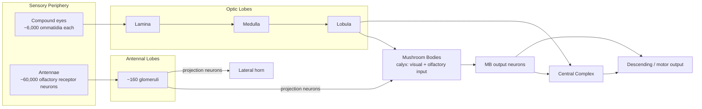

# The Honeybee Brain (*Apis mellifera*): Sophisticated Cognition in ~1 Million Neurons

> A brain smaller than a sesame seed, weighing about a milligram and holding on the order of a million nerve cells, nonetheless supports symbolic communication, celestial navigation, rapid associative learning, and — more controversially — abstract concepts such as "same," "different," and even "zero." The honeybee is the classic demonstration that cognitive sophistication is not a simple function of brain size.

---

## Table of Contents

1. [Why the Honeybee Is a Leading Invertebrate Model](#1-why-the-honeybee-is-a-leading-invertebrate-model)
2. [Brain Neuroanatomy: A Sub-Cubic-Millimeter Powerhouse](#2-brain-neuroanatomy-a-sub-cubic-millimeter-powerhouse)
   - [2.1 The Optic Lobes: Visual Processing](#21-the-optic-lobes-visual-processing)
   - [2.2 The Antennal Lobes: Olfaction](#22-the-antennal-lobes-olfaction)
   - [2.3 The Mushroom Bodies: Learning, Memory, and Multimodal Integration](#23-the-mushroom-bodies-learning-memory-and-multimodal-integration)
   - [2.4 The Central Complex: Spatial Orientation](#24-the-central-complex-spatial-orientation)
3. [The Waggle Dance: Symbolic Communication](#3-the-waggle-dance-symbolic-communication)
4. [Navigation: Compasses, Odometers, and Maps](#4-navigation-compasses-odometers-and-maps)
5. [Associative Learning Paradigms: The PER Workhorse](#5-associative-learning-paradigms-the-per-workhorse)
6. [Higher Cognition Claims — With Caution](#6-higher-cognition-claims--with-caution)
7. [Comparison to Vertebrate Learning Systems](#7-comparison-to-vertebrate-learning-systems)
8. [Limitations and Open Questions](#8-limitations-and-open-questions)
9. [Sources](#sources)

---

## 1. Why the Honeybee Is a Leading Invertebrate Model

For over a century the Western honeybee (*Apis mellifera*) has been one of the most productive systems in all of neuroethology — the study of the neural basis of natural behavior. Several features converge to make it exceptional:

- **A rich, natural behavioral repertoire.** Foraging bees learn the colors, shapes, scents, locations, and daily availability of flowers; they navigate over kilometers and return to a hive entrance a few centimeters wide; and — uniquely among insects — they communicate the location of resources to nestmates through a symbolic "dance language." This gives researchers an unusually large menu of complex, quantifiable behaviors to interrogate.
- **A tractable, numerically modest brain.** The whole brain occupies less than one cubic millimeter and contains roughly **950,000–1,000,000 neurons** — about a hundred-thousandth of the human count. That small size makes it feasible to identify individual neurons, map circuits, and relate cellular events to behavior in ways impossible in a mammalian cortex.
- **Powerful laboratory paradigms.** The proboscis extension reflex (PER) allows a harnessed bee to be classically conditioned on the lab bench, giving experimenters precise control over stimuli and reinforcement while enabling parallel electrophysiological, pharmacological, and molecular measurements.
- **Amenability across levels of analysis.** The same learning event can be studied behaviorally, at the level of identified neurons (e.g., the octopaminergic **VUMmx1** neuron that signals reward), and molecularly (cAMP/PKA, CREB-dependent long-term memory), making the honeybee a genuine "magic well" — a phrase used by Randolf Menzel, one of the field's founders, to describe how much it keeps yielding.
- **Comparative leverage.** Because insects and vertebrates last shared an ancestor over 500 million years ago, honeybee cognition offers a natural experiment: which features of learning and memory are deeply conserved, and which are convergent solutions to shared ecological problems?

**A century of milestones.** The honeybee's status as a cognition model was built incrementally:

| Era | Milestone | Significance |
|---|---|---|
| 1910s–1960s | von Frisch decodes the dance language | First symbolic communication described outside humans |
| 1960s | Odor-conditioning of PER established as a bench assay | Turns learning into a controlled, repeatable experiment |
| 1970s | Nobel Prize (1973); sun-compass & time-compensation worked out | Field validated; navigation mechanisms mapped |
| 1980s–90s | Michelsen's robot bee; identified reward neuron (VUMmx1) | Dance shown to carry real spatial information; reward circuit found |
| 2000s | Relational concepts (same/different); map-like memory debate opens | Abstract cognition and cognitive-map controversy |
| 2010s–2020s | Numerosity & "zero"; social learning of the dance; bumblebee tool-like tasks | Frontier claims about number and culture (with active debate) |

A caution worth stating up front: much of the most eye-catching "insect cognition" work of the last decade — string-pulling, ball-rolling "play," object manipulation, puzzle-box culture — was done in **bumblebees** (*Bombus terrestris*), a close relative, not in the honeybee. Where those results are relevant they are flagged as such below rather than silently folded into the honeybee story.

---

## 2. Brain Neuroanatomy: A Sub-Cubic-Millimeter Powerhouse

The honeybee brain is organized, like other insect brains, into discrete **neuropils** — dense regions of synaptic connections — linked by tracts of axons. Four functional territories dominate: the paired optic lobes (vision), the paired antennal lobes (olfaction), the paired mushroom bodies (learning, memory, multimodal integration), and the midline central complex (spatial orientation and motor control).

**The brain at a glance:**

| Property | Value / description |
|---|---|
| Volume | < 1 mm³ (smaller than a grain of rice) |
| Mass | ~1 mg (roughly a millionth of a human brain) |
| Total neurons | ~950,000–1,000,000 |
| Fraction that are Kenyon cells | ~40% of all neurons |
| Antennal-lobe glomeruli | ~160–165 per lobe |
| Olfactory receptor neurons per antenna | ~60,000 |
| Compound-eye ommatidia | ~4,000–6,000 per eye (worker) |
| Neuron classes exploited by researchers | Individually identifiable in many cases (e.g., VUMmx1) |

A note on caste and plasticity: the brain is not static. Foraging experience and age drive measurable **growth of the mushroom body neuropil**, and the sensory emphasis differs across castes and tasks — a reminder that even this tiny brain is experience-dependent.

*Signal flow is schematic; many pathways are reciprocal and modulatory.*

### 2.1 The Optic Lobes: Visual Processing

Honeybees are highly visual animals, and the optic lobes are correspondingly large, occupying a substantial fraction of the brain. Each compound eye feeds a stack of three retinotopic neuropils:

| Neuropil | Position | Principal role |
|---|---|---|
| **Lamina** | Outermost | First-order processing; contrast, temporal filtering |
| **Medulla** | Middle | Color processing, motion, spatial detail; the largest optic neuropil |
| **Lobula** | Innermost | Higher motion and feature extraction; relays to central brain |

The optic lobes extract color (bees are trichromats sensitive into the ultraviolet), motion, and — critically for navigation — **skylight polarization patterns**, detected by a specialized **dorsal rim area** of the eye whose photoreceptors are aligned to sense the sky's polarization. Visual information is passed forward both to the central complex (for orientation) and to the mushroom body calyces (for visual learning).

### 2.2 The Antennal Lobes: Olfaction

Odor is central to a bee's life — flower scents, hive odors, and a battery of pheromones. Each antenna carries on the order of **60,000 olfactory receptor neurons**, whose axons converge into the antennal lobe, the insect analogue of the vertebrate olfactory bulb.

- The antennal lobe is organized into roughly **160–165 spherical synaptic units called glomeruli** (estimates cluster around 160), each a discrete processing node.
- Receptor neurons expressing the same receptor type converge onto the same glomerulus, so an odor is represented as a spatial *pattern of glomerular activation* — a "combinatorial code."
- Local interneurons sharpen and normalize this code; a smaller population of **projection neurons** (second-order output cells) then carries the processed odor representation to two targets: the **mushroom bodies** (for learning and memory) and the **lateral horn** (for innate, hard-wired olfactory responses).

This dual pathway — one plastic and learning-related, one innate — is a recurring theme of insect olfaction and closely parallels the vertebrate arrangement.

### 2.3 The Mushroom Bodies: Learning, Memory, and Multimodal Integration

The **mushroom bodies (MBs)** are the honeybee's signature structure — paired, prominent neuropils named for their cap-and-stalk shape. They are the site most strongly associated with associative learning and memory, and in bees (and other hymenopterans) they are especially large and elaborate.

**Intrinsic neurons — the Kenyon cells.** The MBs are built from vast numbers of tiny intrinsic neurons called **Kenyon cells (KCs)**. Estimates in the honeybee range widely across methods and whether counts are per hemisphere or per brain — older figures near **170,000** and more recent counts up toward **~340,000–370,000** appear in the literature — but the consensus point is that Kenyon cells make up on the order of **40% of all neurons in the brain**. Honeybee KCs come in several subtypes (large-, middle-, and small-type class-I cells, plus class-II cells); this subtype diversity is greater in hymenopterans than in many other insects and appears to correlate with behavioral sophistication.

**Architecture and why it matters.** The MB has a beautiful three-part logic:

1. **The calyx (input region).** A dual (paired) cup that receives *convergent, multimodal* input — olfactory projection neurons from the antennal lobes plus visual input from the optic lobes, and mechanosensory and gustatory inputs. This convergence makes the MB a genuine multisensory integration center, not merely an olfactory memory store.
2. **The Kenyon cells (expansion layer).** A small number of input channels fan out onto a huge number of KCs, each of which listens to a sparse, near-random subset of inputs. This "expansion recoding" produces a **sparse, high-dimensional representation** in which almost any combination of sensory features can be discriminated — the same mathematical trick used by the vertebrate cerebellum's granule cells and, in machine learning, by wide random projections.
3. **The lobes and output neurons.** KC axons form the vertical (α) and medial (β) lobes, where a comparatively small set of **mushroom body output neurons (MBONs)** read out the KC activity and drive behavior. Learning works by adjusting the KC→MBON synapses: **dopaminergic** neurons deliver reinforcement signals that, coincident with KC activity, reweight these synapses. Appetitive (reward) learning is classically associated with **octopamine** (the VUMmx1 neuron), while aversive (punishment) learning is mediated by **dopamine** — a division of labor well characterized in bees.

Long-term memory formation leaves a physical trace here: repeated training produces measurable **synaptic reorganization of the microglomeruli** in the mushroom body calyx, one of the clearer "memory trace" localizations in any invertebrate brain.

```mermaid
flowchart TD
    PN[Antennal-lobe projection neurons<br/>+ optic-lobe visual input] --> CAL[Calyx<br/>convergent multimodal input]
    CAL --> KC[~170k–370k Kenyon cells<br/>SPARSE high-dim recoding]
    KC --> LOBES[Vertical &#40;&#945;&#41; + medial &#40;&#946;&#41; lobes]
    LOBES --> MBON[MB output neurons &#40;few&#41;]
    DA[Dopaminergic reinforcement neurons] -.reweight KC&#8594;MBON.-> MBON
    OA[Octopaminergic VUMmx1<br/>reward signal] -.appetitive.-> CAL
    MBON --> BEH[Behavioral output]
```

### 2.4 The Central Complex: Spatial Orientation

Straddling the midline, the **central complex** is a set of neuropils (protocerebral bridge, central body, and paired noduli) that functions as the brain's spatial-orientation and navigation hub. It houses a **compass representation of heading** built partly from polarized-light and sun-azimuth cues relayed from the optic lobes, and it is implicated in **path integration** (see §4). In the honeybee it is a strong candidate site for computing and holding the vectors that the waggle dance ultimately expresses.

---

## 3. The Waggle Dance: Symbolic Communication

The honeybee's most famous cognitive achievement is the **waggle dance**, decoded by **Karl von Frisch**, who shared the **1973 Nobel Prize in Physiology or Medicine** with Konrad Lorenz and Nikolaas Tinbergen for founding the modern study of animal behavior. The dance is one of very few known cases of *symbolic, abstract communication* outside humans: a successful forager encodes the **direction and distance** to a resource and transmits it to nestmates, who then fly out and find it.

**The two dances.** A returning forager first performs a dance on the vertical face of the comb, in the dark of the hive:

- For a **nearby** resource (roughly within tens of meters — the exact threshold varies by subspecies/"dialect"), she performs a **round dance**, circling in alternating directions. This conveys "food is close" without precise directional content.
- For a **distant** resource she performs the **waggle dance** proper: a repeated **figure-eight**. In the central segment (the **waggle run**) she runs in a straight line while vibrating her body side to side and buzzing her wings, then loops back — alternating left and right returns — to repeat the run.

**Encoding direction.** Because the dance is performed on a *vertical* comb in *darkness*, the bee uses **gravity as a stand-in for the sun**. The angle of the waggle run relative to straight up equals the angle between the direction to the food and the current **azimuth of the sun**:

- Waggle run pointing **straight up** → fly **toward the sun**.
- Waggle run pointing **straight down** → fly **away from the sun**.
- A run **60° to the right of vertical** → fly at **60° to the right of the sun's azimuth**.

Remarkably, the bee **continuously updates this angle** as the sun moves across the sky, and can produce the correct solar reference even for a food source visited hours earlier — evidence that she has internalized the sun's daily path.

**Encoding distance.** The **duration of the waggle run** encodes distance: longer waggling means a farther source. As a rough rule of thumb, roughly **one second of waggling corresponds to about one kilometer**, though the precise calibration is a nonlinear function and differs between honeybee races (a "dialect"). The distance itself is measured not in meters flown but in **optic flow** — the amount of visual motion streaming across the eyes during the outbound flight (see §4), so headwinds, detours, and visually cluttered routes all affect the reported distance.

```mermaid
flowchart LR
    subgraph "On the vertical comb (dark hive)"
      UP[Up = toward sun]
      RUN["Waggle run angle &#952; from vertical"]
      DUR["Waggle duration &#8776; distance<br/>(~1 s per km, dialect-dependent)"]
    end
    subgraph "Out in the field"
      SUN[Sun azimuth]
      DIR["Fly at angle &#952; from sun"]
      DIST[Fly that far]
    end
    RUN --> DIR
    UP --> SUN
    DUR --> DIST
```

**How we know it is truly informational.** Von Frisch's interpretation was challenged in the 1960s–70s by **Adrian Wenner** and colleagues, who argued that recruits actually located food by following **odor plumes** rather than decoding the dance. The debate was substantially resolved in favor of the dance-language hypothesis by **Axel Michelsen and colleagues (1989–90s)**, who built a **mechanical "robot bee"** that could be commanded to dance; recruits flew to the direction and distance the robot indicated, even to empty locations, showing the spatial information is genuinely carried by the dance. This does not mean odor is irrelevant — scent is a strong additional cue — but the symbolic vector is real.

**A recent twist — social learning of the dance.** Work published in *Science* in 2023 (Dong, Nieh and colleagues) showed that young bees deprived of the chance to follow experienced dancers early in life produce **disordered dances with persistent errors** in distance and directional encoding — evidence that the dance, though largely innate, is **refined by social learning**, a form of "culture" in the transmission of an animal signal.

---

## 4. Navigation: Compasses, Odometers, and Maps

The dance only works because the bee that produces it has already solved a hard navigational problem. Honeybees combine several mechanisms:

| Mechanism | What it provides | Neural / sensory basis |
|---|---|---|
| **Sun (celestial) compass** | Absolute directional reference | Sun azimuth + time-compensation for the sun's movement (internal clock) |
| **Polarized-light compass** | Directional reference when the sun is hidden | Dorsal rim area of the eye → optic lobes → central complex |
| **Optic-flow odometer** | Distance flown | Accumulated image motion across the eye during flight |
| **Path integration** | Continuous "home vector" (direction + distance back to hive) | Integration of compass heading × distance, likely in the central complex |
| **Landmark memory** | Recognition of visual scenes / "snapshots" | Learned views, matched during return; calibrates the odometer |
| **Backup cues** | Orientation under overcast skies | Memory of the sun's course relative to landmarks; possible magnetic sense (debated) |

**Path integration** is the workhorse: throughout an outbound trip the bee keeps a running vector pointing back home, so it can return in a straight line even after a meandering search. Landmarks and remembered "snapshots" of the visual scene refine and correct this vector, and the sun compass ties it to the wider world.

**The cognitive-map controversy.** A genuinely contested question is whether honeybees possess a **map-like ("cognitive map") spatial memory** — an internal representation of the relations *between* places that would let them compute novel shortcuts between locations they have never traveled directly. Randolf Menzel and colleagues have argued, from **displacement experiments** (capturing bees and releasing them at unexpected sites, where they nonetheless take appropriate homeward or feeder-ward courses), that bees do use such a map-like memory. Critics — notably **Cheung, Cheeseman, Cruse, Wehner and colleagues** — counter that these results can be explained more parsimoniously by **path integration plus learned views and route memories**, without invoking a true map ("**no need for a cognitive map: decentralized memory**"). The exchange in *PNAS* (2014) captures the two camps directly. The prudent summary: honeybees clearly have rich, flexible spatial memory that supports novel homing from displacement, but whether that memory is a unified metric "map" or a collection of vectors and remembered views remains **genuinely unresolved**.

---

## 5. Associative Learning Paradigms: The PER Workhorse

The single most important laboratory tool in honeybee neuroscience is olfactory conditioning of the **proboscis extension reflex (PER)** — a Pavlovian paradigm now with more than fifty years of use.

**The reflex.** When sucrose touches a hungry bee's antennae, it reflexively extends its **proboscis** (tongue) to feed. This is an unconditioned response to an unconditioned stimulus (sugar).

**The conditioning.** A bee is gently harnessed in a small tube so only its antennae and mouthparts move. An initially neutral **odor (the conditioned stimulus, CS)** is presented, followed a moment later by a **sucrose reward (the unconditioned stimulus, US)** to the antennae/proboscis. After pairing, the bee extends its proboscis to the *odor alone* — it has formed an odor→reward association.

**Why it is so powerful:**

- **Fast and robust.** A single CS–US pairing can produce a lasting memory; a few trials produce memory that can last days to essentially the bee's lifetime.
- **Quantitative and controlled.** The experimenter controls stimulus identity, timing, order, and number of trials, and reads out a clean binary response.
- **Multi-level.** Because the animal is fixed and accessible, PER can be combined with **electrophysiology, calcium imaging, pharmacology, and molecular assays**, linking behavior to identified neurons (e.g., the reward-signaling **VUMmx1** neuron) and to molecular cascades (cAMP/PKA and CREB-dependent **long-term memory**). It has been used to dissect the phases of memory — short-term, mid-term, and protein-synthesis-dependent long-term memory — much as in *Aplysia* and *Drosophila*.

**Distinct phases of memory.** PER conditioning has been used to show that a honeybee memory is not one thing but a *sequence of overlapping traces*, each with its own biochemistry — a scheme closely paralleling findings in *Drosophila*, *Aplysia*, and mammals:

| Phase | Approximate window | Key properties |
|---|---|---|
| **Short-term memory (STM)** | Seconds to minutes | Depends on transient signaling; no new protein synthesis |
| **Mid-term memory (MTM)** | Minutes to hours | Bridges STM and LTM; sensitive to interference |
| **Early long-term memory (eLTM)** | ~Hours to ~1 day | Translation-dependent (uses existing mRNA) |
| **Late long-term memory (lLTM)** | Days to lifetime | **Transcription-dependent**; requires cAMP/PKA → CREB-driven gene expression |

The number of learning trials and their spacing determines which phases form — **spaced** training produces stronger, longer-lasting memory than **massed** training, another effect shared with vertebrates.

**The aversive counterpart — SER.** Learning is not only about reward. In the **sting extension response (SER)** paradigm, a harnessed bee learns to associate an odor with a mild **electric shock** and comes to extend its **sting** to the punished odor. This appetitive/aversive pairing revealed a clean neurochemical dissociation: **octopamine** mediates *reward* learning, while **dopamine** mediates *punishment* learning — a finding with clear parallels (and instructive differences) to reinforcement signaling in vertebrates.

**Free-flying assays.** Beyond harnessed bees, much cognition work uses **free-flying foragers** trained to fly to a Y-maze or an array of targets for a sucrose reward, allowing tests of color, pattern, and rule learning under more natural conditions. This is the setup behind most of the higher-cognition claims in the next section.

---

## 6. Higher Cognition Claims — With Caution

Over the last two decades, honeybees (and their bumblebee relatives) have been credited with capacities once reserved for vertebrates. These findings are real and carefully done, but they attract strong claims, and several deserve caveats. Below, each is stated with its evidence and its caution.

### 6.1 Concept learning: "same" and "different"

In a landmark 2001 *Nature* study, **Giurfa and colleagues** trained free-flying bees on **delayed matching-to-sample (DMTS)** and **non-matching-to-sample** tasks. A bee was shown a sample stimulus, then had to choose the matching (or, in the other version, the *non*-matching) option to be rewarded. Bees not only learned this but **transferred the rule to entirely novel stimuli** — even across sensory modalities (e.g., from colors to scents) — implying they had abstracted the *relational concepts* "sameness" and "difference" rather than memorizing specific stimuli. This is one of the strongest cases for abstract, relational concept learning in an invertebrate.

*Caution:* the sample sizes typical of bee experiments are small, and relational-concept results in animals generally invite debate over whether simpler associative or feature-based strategies could produce the same choices. Independent replication and mechanistic accounts remain an active area.

### 6.2 Numerical cognition and a "concept of zero"

Bees can be trained to discriminate the **number** of elements in a display (up to about four to six) largely independent of size, spacing, or shape. Building on this, **Howard, Avargues-Weber, Dyer and colleagues (2018, *Science*)** trained bees on "greater than" / "less than" rules and found they then **placed an empty set (zero) at the low end of the numerical scale** — treating "nothing" as a quantity smaller than one. A follow-up (2019) reported rudimentary **addition and subtraction**. Placing zero on a number line is cognitively demanding; before this, only some primates and a grey parrot had shown it.

*Caution:* these are among the most contested results in insect cognition. Critics have argued that bees might solve "less than" tasks using **low-level cues** (total edge length, contrast, spatial frequency, area) that co-vary with number, rather than counting *per se*, and some attempts to control or replicate these effects have produced mixed results. The findings are important and provocative but should be presented as **suggestive, not settled**, evidence for genuine numerical abstraction.

### 6.3 Tool-use-like behavior, play, and social learning

This is where the honeybee/bumblebee distinction matters most. Much of the celebrated "insect intelligence" of recent years comes from **bumblebees** (*Bombus terrestris*), not honeybees:

- **String-pulling** to reach an out-of-reach reward, spreadable to naïve bees by observation ("cultural transmission") — *bumblebees* (Alem, Chittka et al., 2016).
- **Ball-rolling** to a goal for reward, improved upon after watching a demonstrator, and later shown to occur spontaneously in a way meeting behavioral criteria for **play** — *bumblebees* (Loukola et al., 2017; Galpayage Dona et al., 2022).
- **Puzzle-box** solutions acquired socially, with different "cultures" of technique — *bumblebees*.

These are legitimately astonishing, but they are **object manipulation** rather than classic tool use, and calling the manipulated ball a "tool" is deliberately avoided by the authors. For the **honeybee specifically**, the best-supported "cultural"/social-learning result is the **refinement of the waggle dance by learning from experienced dancers** (Dong et al., 2023, §3). Honeybees also readily learn socially *which flowers to visit* by following successful foragers. Sweeping claims that honeybees "use tools" or "play" outrun the honeybee-specific evidence and should be attributed carefully to the correct species.

### 6.4 Other flexible behaviors

Honeybees show **latent learning**, **contextual and reversal learning**, **generalization and categorization** of visual patterns, **attention-like** selective processing, and even physiological markers that have been interpreted (cautiously) as **emotion-like states** (e.g., pessimistic biases after being shaken). Each is a real behavioral phenomenon; the interpretive language ("emotion," "consciousness") is where restraint is warranted.

| Claim | Species where best shown | Strength of evidence | Main caveat |
|---|---|---|---|
| Odor→reward associative memory | Honeybee | Very strong | — (foundational) |
| Rule transfer: same/different | Honeybee | Strong | Small n; alternative strategies debated |
| Numerosity discrimination | Honeybee | Moderate–strong | Low-level cue confounds |
| "Concept of zero" | Honeybee | Suggestive/contested | Replication & cue controls disputed |
| Addition/subtraction | Honeybee | Suggestive/contested | Same as above |
| String-pulling, cultural spread | **Bumblebee** | Strong (in *Bombus*) | Not a honeybee result |
| Ball-rolling / "play" | **Bumblebee** | Strong (in *Bombus*) | Not tool use; not honeybee |
| Social learning of the dance | Honeybee | Strong (2023) | Recent; awaiting broad replication |
| Emotion-like states | Honeybee/bumblebee | Suggestive | Interpretive language contested |

---

## 7. Comparison to Vertebrate Learning Systems

Insects and vertebrates diverged more than half a billion years ago, yet both evolved dedicated brain centers for learning and memory. Comparing them illuminates what is conserved, what is convergent, and what is genuinely different.

**Mushroom body ↔ hippocampus (and cerebellum).** The honeybee mushroom body is most often compared to the mammalian **hippocampus**: both are crucial for certain forms of learning and memory, both show **structural synaptic plasticity** with learning (the MB's f-actin-rich microglomerular spines resemble, functionally, hippocampal dendritic spines), and both integrate multimodal information relevant to context and place. Some anatomists have gone further, noting parallels between the evolutionary **inversion/transposition** of the mushroom body and that of the hippocampus. But the resemblance is best read as **convergent evolution** — independent solutions to shared computational problems — rather than shared ancestry, and the debate over deep homology across phyla is unresolved. In its *circuit logic* (a few inputs → massive sparse expansion layer → few output cells, taught by neuromodulatory reinforcement) the MB actually resembles the **cerebellum** (mossy fibers → granule cells → Purkinje cells) as much as the hippocampus.

| Feature | Honeybee mushroom body | Mammalian hippocampus | Mammalian cerebellum |
|---|---|---|---|
| Core role | Associative learning, multimodal memory | Declarative/spatial memory, context | Motor timing, associative (e.g., eyeblink) learning |
| "Expansion" cells | Kenyon cells (huge, sparse) | Dentate granule cells | Cerebellar granule cells |
| Teaching signal | Dopamine (aversive), octopamine (reward) | Dopamine, ACh, theta-modulated | Climbing-fiber (inferior olive) error |
| Plasticity substrate | KC→MBON synapses; microglomerular remodeling | Synaptic LTP/LTD; spine dynamics | Parallel-fiber→Purkinje LTD |
| Conserved molecules | cAMP/PKA, CREB → long-term memory | cAMP/PKA, CREB → long-term memory | cAMP/PKA, CREB |
| Relationship | — | **Convergent**, not homologous | **Convergent**, similar wiring logic |

**Deeply conserved molecules.** Despite independent origins of the *structures*, the *molecular machinery* of memory is strikingly shared. The **cAMP/PKA signaling cascade** and **CREB-dependent transcription** required to convert short-term into protein-synthesis-dependent **long-term memory** operate in honeybees just as in mice, fruit flies, and *Aplysia*. This conservation suggests the biochemistry of forming a durable memory was in place very early in animal evolution, and that brains have repeatedly built new *architectures* around the same molecular core.

**Antennal lobe ↔ olfactory bulb.** The olfactory pathways are also convergent parallels: glomerular organization, combinatorial odor codes, and a split into a plastic (learning) and an innate pathway all recur in both lineages.

**The headline contrast: efficiency.** The honeybee performs sun-compass navigation, symbolic communication, rapid associative learning, and flexible discrimination with **~10⁶ neurons**; the mammalian systems it is compared to sit within brains of **10⁸–10¹¹**. Whatever the honeybee is doing, it is doing it with radically fewer, and mostly *smaller and cheaper*, neurons — which is precisely why it is such a valuable model for asking how much cognition a compact circuit can support.

---

## 8. Limitations and Open Questions

A balanced account has to be candid about what the honeybee model cannot (yet) do and where its most exciting claims are fragile:

- **Small samples, big claims.** Bee cognition experiments are labor-intensive and often run with tens of individuals. The most striking results (zero, arithmetic, relational concepts) rest on modest data, and the field has active disputes about replication and about whether **low-level perceptual cues** can mimic "conceptual" performance. These findings are best cited as *promising and contested*, not established fact.
- **Species conflation.** Popular accounts routinely attribute **bumblebee** feats (tool-like manipulation, play, puzzle-box culture) to "bees" generically. The honeybee's own strongest cognitive claims are the dance language, navigation, and associative/relational learning — not object play.
- **Genetic tractability lags.** Unlike *Drosophila*, the honeybee has historically lacked easy transgenic tools (though CRISPR and RNAi are changing this). Much circuit inference is therefore anatomical, pharmacological, and physiological rather than causal-genetic, which limits how cleanly specific neurons can be shown *necessary* for a behavior.
- **The map question is open.** Whether spatial memory is a true metric "cognitive map" or a bundle of vectors and views is unresolved and methodologically hard, because displacement experiments admit multiple interpretations.
- **From correlation to mechanism.** The mushroom body's *role* in learning is well established, but a fully worked-out account of *how* a specific memory (say, a particular odor→reward association) is written into identified KC→MBON synapses and later read out to drive a specific behavior is still being assembled — further along in *Drosophila* connectomics than in the bee.
- **Interpretive restraint.** Terms like "language," "concept," "culture," "play," and "emotion" are borrowed from human/vertebrate psychology. They can be operationally justified in specific experiments, but they carry connotations that outrun the data. The honeybee's genuine marvel — sophisticated, flexible behavior from a sub-millimeter brain — does not need inflation.

**Bottom line.** The honeybee remains the premier invertebrate model for learning, memory, and navigation because it couples a naturally rich behavioral repertoire with a brain small enough to dissect. Its solidly established achievements — symbolic dance communication, celestial and path-integration navigation, and fast, durable associative learning built on a mushroom-body circuit that converges (independently) on the same molecular memory machinery as the vertebrate brain — are astonishing on their own terms. Its more spectacular claims about numbers, zero, and abstract concepts are scientifically serious and worth pursuing, but should be held with the caution that small samples and clever confounds demand.

---

## Sources

**Neuroanatomy — brain, mushroom bodies, Kenyon cells**
- [Menzel (2007), *Behavioral and neural analysis of associative learning in the honeybee: a taste from the magic well* — J. Comp. Physiol. A](https://link.springer.com/article/10.1007/s00359-007-0235-9)
- [The Digital Bee Brain: Integrating and Managing Neurons in a Common 3D Reference System — Frontiers in Systems Neuroscience (2010)](https://pmc.ncbi.nlm.nih.gov/articles/PMC2935790/)
- [3D atlas of cerebral neuropils in the honey bee brain — J. Comp. Neurol. (2023)](https://onlinelibrary.wiley.com/doi/10.1002/cne.25486)
- [Gene expression profiles and neural activities of Kenyon cell subtypes — Zoological Letters (2016)](https://link.springer.com/article/10.1186/s40851-016-0051-6)
- [Increased complexity of mushroom body Kenyon cell subtypes and behavioral evolution in Hymenoptera — PMC](https://www.ncbi.nlm.nih.gov/pmc/articles/PMC5653845/)
- [What do the mushroom bodies do for the insect brain? Twenty-five years of progress — PMC (2024)](https://pmc.ncbi.nlm.nih.gov/articles/PMC11199942/)
- [Long-Term Memory Leads to Synaptic Reorganization in the Mushroom Bodies: A Memory Trace in the Insect Brain? — PMC](https://pmc.ncbi.nlm.nih.gov/articles/PMC6632731/)
- [Are Bigger Brains Better? — Chittka & Niven, Current Biology (2009)](https://www.sciencedirect.com/science/article/pii/S0960982209015978)

**Antennal lobes and olfaction**
- [The Circuitry of Olfactory Projection Neurons in the Brain of the Honeybee — PMC](https://www.ncbi.nlm.nih.gov/pmc/articles/PMC5040750/)
- [Structural plasticity of identified glomeruli in the antennal lobes of the honey bee — PubMed](https://pubmed.ncbi.nlm.nih.gov/8822183/)

**The waggle dance and dance-language communication**
- [The Honey Bee Dance Language — NC State Extension](https://content.ces.ncsu.edu/honey-bee-dance-language)
- [Waggle Dance overview — ScienceDirect Topics](https://www.sciencedirect.com/topics/veterinary-science-and-veterinary-medicine/waggle-dance)
- [Honey bees communicate distance via non-linear waggle duration functions — PMC](https://pmc.ncbi.nlm.nih.gov/articles/PMC8029670/)
- [The Waggle Dance as an Intended Flight: A Cognitive Perspective — PMC](https://pmc.ncbi.nlm.nih.gov/articles/PMC6955924/)
- [Dong et al. (2023), *Social signal learning of the waggle dance in honey bees* — Science](https://www.science.org/doi/10.1126/science.ade1702)
- [Navigation and dance communication in honeybees: a cognitive perspective — J. Comp. Physiol. A (2023)](https://link.springer.com/article/10.1007/s00359-023-01619-9)

**Navigation, compasses, path integration, and the cognitive-map debate**
- [Menzel et al. (2005), *Honey bees navigate according to a map-like spatial memory* — PNAS](https://www.pnas.org/doi/10.1073/pnas.0408550102)
- [Spatial Memory and Navigation by Honeybees on the Scale of the Foraging Range — J. Exp. Biol. (1996)](https://journals.biologists.com/jeb/article/199/1/147/7394/Spatial-Memory-and-Navigation-by-Honeybees-on-the)
- [Cruse & Wehner, *No Need for a Cognitive Map: Decentralized Memory for Insect Navigation* — PLOS Comp. Biol.](https://journals.plos.org/ploscompbiol/article?id=10.1371%2Fjournal.pcbi.1002009)
- [*Still no convincing evidence for cognitive map use by honeybees* (Cheung et al.) — PNAS (2014)](https://www.pnas.org/doi/10.1073/pnas.1413581111)
- [*Reply to Cheung et al.: The cognitive map hypothesis remains the best interpretation* — PNAS (2014)](https://www.pnas.org/doi/10.1073/pnas.1415738111)
- [Transmedulla Neurons in the Sky Compass Network of the Honeybee — PMC](https://www.ncbi.nlm.nih.gov/pmc/articles/PMC4667876/)

**PER / SER associative learning**
- [*Invertebrate learning and memory: Fifty years of olfactory conditioning of the proboscis extension response in honeybees* — Learning & Memory (2012)](https://learnmem.cshlp.org/content/19/2/54.full)
- [Proboscis Extension Reflex overview — ScienceDirect Topics](https://www.sciencedirect.com/topics/neuroscience/proboscis-extension-reflex)
- [The PER to evaluate learning and memory in honeybees: some caveats — Naturwissenschaften (2012)](https://link.springer.com/article/10.1007/s00114-012-0955-8)
- [Vergoz et al., *Aversive Learning Revealed by Olfactory Conditioning of the Sting Extension Reflex* — PLOS ONE (2007)](https://journals.plos.org/plosone/article?id=10.1371%2Fjournal.pone.0000288)
- [*Rules and mechanisms of punishment learning in honey bees* (aversive SER conditioning) — J. Exp. Biol. (2013)](https://journals.biologists.com/jeb/article/216/16/2985/11524/Rules-and-mechanisms-of-punishment-learning-in)

**Higher cognition**
- [Giurfa et al. (2001), *The concepts of 'sameness' and 'difference' in an insect* — Nature (PubMed record)](https://pubmed.ncbi.nlm.nih.gov/11309617/)
- [*Learning of sameness/difference relationships by honey bees: performance, strategies and ecological context* — PubMed (2022)](https://pubmed.ncbi.nlm.nih.gov/35083374/)
- [Howard et al. (2018), *Numerical ordering of zero in honey bees* — Science](https://www.science.org/doi/10.1126/science.aar4975)
- [Howard et al. (2019), *Addition and subtraction by honeybees* — Learning & Behavior](https://link.springer.com/article/10.3758/s13420-019-00382-9)
- [*Associative Mechanisms Allow for Social Learning and Cultural Transmission of String Pulling in an Insect* (bumblebees) — PLOS Biology (2016)](https://journals.plos.org/plosbiology/article?id=10.1371%2Fjournal.pbio.1002564)
- [Loukola et al. (2017), *Bumblebees show cognitive flexibility by improving on an observed complex behavior* — Science](https://www.science.org/doi/10.1126/science.aag2360)
- [Galpayage Dona et al. (2022), *Do bumble bees play?* — Animal Behaviour](https://www.sciencedirect.com/science/article/pii/S0003347222002366)

**Comparative: mushroom body vs. hippocampus/cortex**
- [*Evolution of mushroom body inversion and associated gyriform neuropils parallel the transposition of the mammalian hippocampus* — bioRxiv](https://www.biorxiv.org/content/10.1101/2020.11.06.371492v1.full)
- [Mushroom bodies — Wikipedia (overview and references)](https://en.wikipedia.org/wiki/Mushroom_bodies)
- [Genealogical Correspondence of Mushroom Bodies across Invertebrate Phyla — Current Biology](https://www.cell.com/current-biology/fulltext/S0960-9822(14)01358-X)

*Prepared July 2026. This synthesis draws on peer-reviewed literature and reputable science communication; where claims are contested (cognitive maps, numerical concepts, "zero"), the disagreement is presented rather than resolved.*
