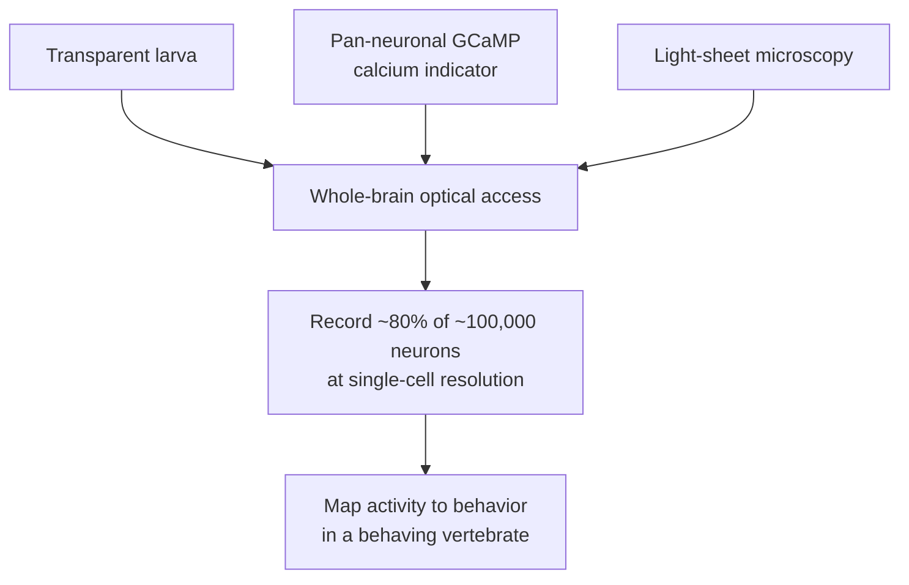
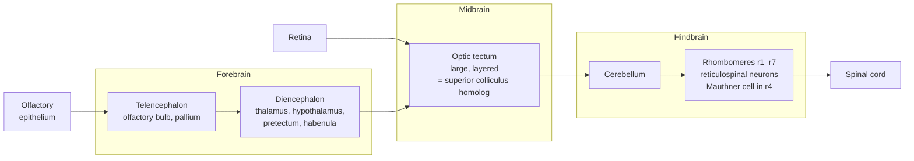
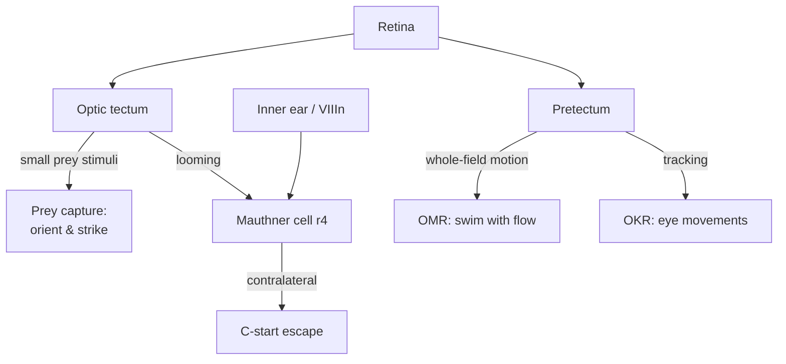

# The Zebrafish Brain (*Danio rerio*): A Window Into the Living Vertebrate Nervous System

> *A three-millimeter-long, see-through fish that lets scientists watch nearly every neuron in a whole vertebrate brain fire in real time — while the animal hunts, flees, and swims.*

## Introduction

Most of what we know about how brains work has been pieced together from fragments: an electrode in one cortical column, a two-photon window over a patch of mouse cortex, a functional MRI voxel averaging over a million cells. The vertebrate brain has been, for most of neuroscience's history, an object we sample rather than one we see whole. The **larval zebrafish** is the great exception.

Because zebrafish embryos develop **outside the mother** and their larvae are **optically transparent**, and because a mature genetic toolkit lets researchers paint every neuron with a fluorescent **calcium indicator**, the zebrafish larva is — arguably — the *only* vertebrate in which you can record the activity of **nearly every single neuron, at single-cell resolution, in an intact, behaving animal**. When light-sheet microscopy was combined with genetically encoded GCaMP indicators around 2013, it became possible to image ~**80% of the roughly 100,000 neurons** in a larval brain, volume by volume, several times per minute. No other vertebrate model comes close to that completeness.

This document explains why the zebrafish occupies such a singular position: its biology and genetic tractability, the layout of its brain, the landmark circuits and screens that made it famous, its remarkable — and, for a vertebrate, unusual — ability to **regenerate CNS neurons**, and finally what it does and does not tell us about our own brains.

---

## Table of Contents

1. [Why Zebrafish Are Uniquely Powerful](#why-zebrafish-are-uniquely-powerful)
2. [The Animal: Development, Genetics, and Husbandry](#the-animal-development-genetics-and-husbandry)
3. [Neuroanatomy of the Zebrafish Brain](#neuroanatomy-of-the-zebrafish-brain)
4. [Whole-Brain Imaging: Watching Every Neuron Fire](#whole-brain-imaging-watching-every-neuron-fire)
5. [Landmark Circuits and Behaviors](#landmark-circuits-and-behaviors)
6. [Developmental Genetics and the Great Mutant Screens](#developmental-genetics-and-the-great-mutant-screens)
7. [Disease Models and CNS Regeneration](#disease-models-and-cns-regeneration)
8. [Comparison to Mammals and Humans](#comparison-to-mammals-and-humans)
9. [Limitations](#limitations)
10. [Summary](#summary)
11. [Sources](#sources)

---

## Why Zebrafish Are Uniquely Powerful

The zebrafish's dominance in developmental and systems neuroscience rests on a rare *convergence* of properties. Each one is useful; together they are transformative.

| Property | What it enables |
|---|---|
| **Optically transparent larvae** | Live, non-invasive imaging of internal organs and the whole brain with light microscopy — no surgery, no skull, no cranial window |
| **External fertilization & development** | Embryos are accessible from the single-cell stage; every step of neural development can be watched and manipulated |
| **Small brain (~100,000 neurons in larva)** | The entire brain fits in a microscope's field of view and can be imaged in its entirety |
| **High fecundity (hundreds of eggs/clutch)** | Large-scale genetic screens and statistically powerful behavioral experiments |
| **Rapid development** | Most organ primordia form within 24 hours; the larva is swimming and hunting by ~5 days |
| **Vertebrate body plan & ~70% gene homology to humans** | Findings are far more translatable than in flies or worms |
| **Mature genetic toolkit** | Transgenesis, GAL4-UAS, CRISPR, and optogenetics allow precise labeling and control of defined neurons |

The single most important consequence of transparency plus genetics is this: a zebrafish larva expressing a **calcium indicator in every neuron** is effectively a brain you can *see through and read out*. In a mouse, recording even a few thousand neurons requires implanted optics and typically restricts you to the surface of cortex. In a larval zebrafish, the whole brain — forebrain to hindbrain, surface to core — is on the table at once.

---

## The Animal: Development, Genetics, and Husbandry

### A prolific, fast-developing vertebrate

*Danio rerio* is a small (3–4 cm adult) freshwater cyprinid minnow native to South Asia. A single gravid female can release **hundreds to over a thousand eggs** at a time, and generation time is short (~3 months to sexual maturity). This fecundity is not a trivia point — it is what made **large-scale forward genetic screens** feasible in a vertebrate for the first time.

Fertilization is **external**: eggs and sperm are shed into the water, so every embryo is accessible from the moment of fertilization. Development is famously fast:

| Time post-fertilization | Landmark |
|---|---|
| ~0–3 hpf | Cleavage; the embryo is a mound of cells on the yolk |
| ~10 hpf | Gastrulation complete; body axis established |
| **~24 hpf** | Most tissues and organ primordia formed; tadpole-like body; heartbeat begins |
| ~48–72 hpf | Hatching from the chorion into a free larva |
| ~5 dpf | Larva is free-swimming, visually guided, and hunting prey |

*(hpf = hours post-fertilization; dpf = days post-fertilization.)*

### Transparency — natural and engineered

Zebrafish embryos and early larvae are naturally translucent. As the animal matures, pigment cells (melanophores, iridophores) develop and obscure the view. Two solutions keep the window open:

- **Chemical:** treating embryos with PTU (1-phenyl-2-thiourea) suppresses pigmentation.
- **Genetic:** the **`casper`** line — a double mutant (`roy⁻/⁻`, `nacre⁻/⁻`) — lacks both melanophores and iridophores and remains **transparent throughout life**, enabling imaging even in adults.

### A deep genetic toolkit

Zebrafish sit in a genetic sweet spot: vertebrate biology with near-invertebrate manipulability.

- **Tol2 transposon transgenesis** — a transposon originally from medaka, injected as transposase mRNA plus a donor plasmid, integrates transgenes into the germ line with high efficiency. This is the workhorse for making stable transgenic lines.
- **GAL4-UAS system** — imported from *Drosophila*, it allows a driver line (GAL4 expressed in a defined cell type) to be crossed to any UAS-effector line (a fluorophore, a calcium indicator, an optogenetic actuator, a cell-killing toxin). This modularity means one driver can be combined with many tools.
- **CRISPR/Cas9, TALENs** — for targeted gene knockout and knock-in; CRISPR has largely replaced earlier methods for making mutants.
- **Morpholino oligonucleotides** — antisense reagents for transient gene knockdown in embryos (now used more cautiously because of off-target effects, but historically central to "reverse genetics").
- **Optogenetics & chemogenetics** — channelrhodopsins and related tools let researchers *drive or silence* identified neurons with light, closing the loop from observation to causal test.

The **zebrafish reference genome** has been sequenced and richly annotated, and community infrastructure (the Zebrafish Information Network, ZFIN) curates genes, mutants, and expression data.

---

## Neuroanatomy of the Zebrafish Brain

### The basic vertebrate bauplan

A crucial point for comparative neuroscience: despite being a fish, the zebrafish brain is built on the **same fundamental vertebrate plan** as ours. The neural tube regionalizes into **forebrain (prosencephalon), midbrain (mesencephalon), and hindbrain (rhombencephalon)**, each subdividing into homologous structures. The genes that pattern this axis — *otx*, *hox*, *pax*, *shh*, and their relatives — are largely shared across vertebrates. So the zebrafish is not an alien nervous system but a **simplified, accessible version of the vertebrate one**.

### Key structures

- **Telencephalon (forebrain).** Includes the **olfactory bulbs** and the **pallium** (dorsal telencephalon). Notably, the teleost pallium develops by *eversion* (folding outward) rather than the *evagination* (folding inward) seen in mammals, which complicates one-to-one mapping of pallial subregions to mammalian cortex, amygdala, and hippocampus — though functional homologies (e.g., a hippocampus-like and amygdala-like region) are supported by lesion and imaging studies.
- **Diencephalon.** Houses the **thalamus, hypothalamus, habenula** (a conserved node in aversive/reward processing, prominently asymmetric in fish), and the **pretectum**, a small but functionally pivotal visual area (see circuits below).
- **Optic tectum (midbrain).** The **dominant sensory structure** of the fish brain and the primary target of the retina. It is a beautifully layered, retinotopically organized structure — the homolog of the mammalian **superior colliculus** — and is central to vision-guided behaviors like prey capture. Because it sits near the surface and is highly ordered, it has become a favorite substrate for studying **retinotopic map formation** and visual computation.
- **Cerebellum.** Present and conserved in circuit architecture (Purkinje cells, granule cells, climbing/parallel fibers), used to study motor learning.
- **Hindbrain.** Organized into segmental **rhombomeres**, each a repeating module. It contains large, individually **identifiable reticulospinal neurons** — most famously the **Mauthner cell** in rhombomere 4 — that drive fast motor programs. The hindbrain's segmental clarity makes it one of the best-understood pieces of vertebrate motor circuitry.

### Scale

The larval brain contains on the order of **100,000 neurons** — five to six orders of magnitude fewer than a human brain (~86 billion), and roughly a thousandfold fewer than a mouse (~70 million). This smallness is the whole point: it is what makes *complete* observation tractable.

---

## Whole-Brain Imaging: Watching Every Neuron Fire

### The technology stack

Three ingredients combine to produce the zebrafish's signature capability:

1. **Genetically encoded calcium indicators (GECIs).** GCaMP is a fusion of green fluorescent protein, the calcium-binding protein calmodulin, and a peptide. When a neuron fires, intracellular calcium rises and the sensor brightens. Expressed pan-neuronally (e.g., under the *elavl3*/HuC promoter), GCaMP turns spiking into light throughout the brain.
2. **Light-sheet (selective plane illumination) microscopy.** Instead of illuminating the whole volume, a thin *sheet* of laser light excites one plane at a time while a camera perpendicular to the sheet captures it. Sweeping the sheet through the brain builds a 3D volume with low phototoxicity and high speed.
3. **Transparency.** With no pigment and no bone in the way, the light sheet reaches every depth of the larval brain.

### The landmark result

In **2013, Ahrens, Keller and colleagues** (Nature Methods) demonstrated **whole-brain functional imaging at cellular resolution** in the larval zebrafish. Using GCaMP5G and light-sheet microscopy, they recorded activity across a volume of roughly **600 × 800 × 200 µm** — the entire brain — capturing **more than 80% of all neurons at single-cell resolution**, imaging the whole brain at about **0.8 Hz** (once every ~1.3 seconds). For the first time, a substantial fraction of an *entire vertebrate brain* could be watched in action.

Subsequent methods pushed further and in different directions:
- **Two-photon / 3D scanning multiphoton** microscopy with GCaMP6 reconstructs activity from ~45,000–52,000 cells with better depth penetration and optical sectioning.
- **Light-field microscopy (including XLFM)** captures whole volumes in a single camera snapshot, trading resolution for speed — fast enough to approach imaging in **freely swimming** larvae rather than restrained ones.

| Imaging approach | Neurons captured | Notable trade-off |
|---|---|---|
| Light-sheet (GCaMP5/6) | >80% of ~100,000; ~0.8 Hz whole-brain | Larva usually embedded/restrained |
| 3D multiphoton | ~45,000–52,000 cells | Slower, but deeper and less scatter-prone |
| Light-field / XLFM | Whole volume per snapshot | Lower spatial resolution; enables freely-behaving imaging |

### Why it matters

This is the crux of the zebrafish's value proposition. In a behaving vertebrate you can now ask **brain-wide** questions — where does a sensory signal go, how is a decision distributed, which populations precede a movement — and get an answer that spans the *whole* brain rather than a biopsy of it. Combined with "**virtual reality**" setups (a restrained larva viewing a visual scene while its intended swimming is read out from motor nerves — *fictive behavior*), researchers can map perception, decision, and action across every region simultaneously, and standardized **brain atlases** (Z-Brain, ZBB/Zebrafish Brain Browser, mapzebrain) let different labs register their data into a common coordinate frame down to roughly single-cell precision.

---

## Landmark Circuits and Behaviors

The larval zebrafish comes equipped with a repertoire of robust, stereotyped, visually and mechanically guided behaviors — each a tractable handle on a defined circuit.

### The Mauthner cell and the escape (C-start)

The **Mauthner cell** is a pair of giant reticulospinal neurons in **rhombomere 4** of the hindbrain, among the most-studied identified neurons in all of neuroscience. A single action potential in *one* Mauthner cell triggers the **C-start**: the fastest, shortest-latency motor response in vertebrates, in which the body bends into a C-shape away from a threat and the animal darts off.

- **Inputs:** acoustic/vestibular signals arrive via the eighth cranial nerve from inner-ear hair cells; visual **looming** stimuli (an approaching predator) are relayed, in part, via the optic tectum.
- **Output:** the Mauthner axon crosses the midline and runs the length of the spinal cord, exciting **contralateral** motor neurons so the tail flips away from the stimulus.
- **Homologs:** the segmental partners **MiD2cm and MiD3cm** form a small escape network, allowing graded and directional escapes.

The Mauthner system is a textbook example of a **command neuron**: a single, identifiable cell whose firing is sufficient to launch a complete, life-saving behavior.

### Prey capture

By ~5 dpf, larvae **hunt** — they detect small moving targets (paramecia), orient toward them, and execute capture swims. The circuit runs largely through the **optic tectum**, which detects small prey-like stimuli in the **upper nasal visual field** (exactly where prey appear during hunting). Tectal output is relayed to hindbrain and spinal motor centers via premotor structures (the nucleus of the medial longitudinal fasciculus and reticular formation). Identified reticulospinal neurons downstream of the tectum convert "prey there" into "turn and strike." GABAergic **intertectal neurons** help integrate the two tectal halves so that prey entering the binocular strike zone triggers a capture swim.

### The optomotor and optokinetic responses (OMR / OKR)

These two reflexes stabilize the animal against visual motion and are staples of visual neuroscience:

- **OMR (optomotor response):** the larva swims in the direction of whole-field motion, as if to hold station in a current.
- **OKR (optokinetic response):** the eyes track moving stripes, producing smooth pursuit and reset saccades.

Crucially, these are handled by the **pretectum**, not the tectum. **Ablating the optic tectum leaves OMR and OKR intact**, while the pretectum is *necessary and sufficient* for the OKR and integrates monocular signals into the binocular representation the OMR needs. This clean functional dissociation — prey capture in the tectum, optic-flow reflexes in the pretectum — is a model example of parallel visual processing streams in a vertebrate.

### Phototaxis and other behaviors

Larvae also show **phototaxis** (movement toward or away from light), **dark-avoidance**, **thermal and chemical preferences**, **prey/predator discrimination**, sleep-like states, and simple forms of **learning and habituation** (e.g., the escape response habituates to repeated non-threatening looms via defined hindbrain circuits). Because these behaviors are quantifiable and high-throughput, they can be run on hundreds of larvae for genetic and pharmacological screens.

---

## Developmental Genetics and the Great Mutant Screens

The zebrafish first rose to prominence not in neuroscience but in **developmental biology**, precisely because its transparent, externally developing embryos let researchers *see* the consequences of mutations directly.

In the early-to-mid 1990s, two enormous **forward genetic screens** — one led by **Christiane Nüsslein-Volhard in Tübingen**, the other by **Wolfgang Driever in Boston** — used the chemical mutagen **ENU (N-ethyl-N-nitrosourea)** to induce random mutations across the genome, then screened thousands of embryos for visible developmental defects. The results were published in **1996 in a landmark special issue of the journal *Development* containing 37 papers** — still the largest single issue in that journal's history. Together the screens identified on the order of **~1,500 mutations in more than 400 genes** affecting body patterning, organ formation, axon guidance, pigmentation, and behavior.

This was a watershed: it was the first time the **saturating, unbiased genetic dissection** that had revolutionized *Drosophila* and *C. elegans* development could be applied to a **vertebrate**. Many genes and pathways central to vertebrate development — and to human disease — were first pinned down in these fish. Later **insertional mutagenesis** screens (using viral or transposon insertions) made it far easier to *clone* the disrupted gene, and reverse-genetic tools (TILLING, then TALENs and CRISPR) let researchers go straight from a human gene of interest to a fish mutant.

For neuroscience specifically, these screens delivered mutants in **axon pathfinding, retinotectal map formation, motor behavior, and neural patterning**, seeding decades of circuit and developmental work.

---

## Disease Models and CNS Regeneration

### Modeling human disease

With ~**70% of human genes** having at least one zebrafish ortholog and ~**84% of human disease–associated genes** having a fish counterpart, zebrafish are widely used to model human conditions: cardiovascular disease, cancer, blood and kidney disorders, and a growing list of **neurological and neurodevelopmental diseases** — epilepsy (whole-brain imaging can capture seizure dynamics at single-cell resolution), neurodegeneration, and neurodevelopmental syndromes. Because larvae absorb small molecules directly from the water and are cheap to produce in large numbers, they are also a premier platform for **behavioral and phenotypic drug screening**.

### Regeneration: a defining contrast with mammals

One of the most scientifically important facts about zebrafish is that, **unlike mammals, they robustly regenerate central-nervous-system neurons**. Where a severed mammalian spinal cord forms a permanent glial scar and the injury is essentially irreversible after birth, the **adult zebrafish** can:

- **Regenerate the spinal cord** — regrow severed axons, replace lost neurons via injury-induced neurogenesis, and recover swimming function.
- **Regenerate the retina** — Müller glia dedifferentiate and act as stem cells to replace lost photoreceptors *and* retinal ganglion cells.
- **Regenerate brain tissue and the optic nerve**, and even the **heart** with little scarring.

The mechanistic basis is a key research target. Zebrafish maintain populations of **radial glia / ependymoglia** that, after injury, switch on a **restorative neurogenic program**, while the animal actively **resolves inflammation and the glial scar** rather than making them permanent. Mammals largely lack this pro-regenerative response. Understanding *why* the fish can do it — which signals, which glial states, which immune interactions — is one of the central hopes for translating fish biology into human **CNS repair** strategies. (A cautionary comparison: the closely related medaka regenerates far less, showing that regeneration is not a generic teleost trait but depends on specific programs that can be dissected.)

---

## Comparison to Mammals and Humans

### What is conserved

| Feature | Shared with mammals? |
|---|---|
| Basic brain regionalization (fore/mid/hindbrain) | **Yes** — same neural-tube plan and patterning genes |
| Major neuron types & neurotransmitters (glutamate, GABA, dopamine, serotonin, ACh) | **Yes**, largely conserved |
| Cerebellar microcircuit (Purkinje/granule cells) | **Yes** |
| Superior colliculus (as optic tectum) | **Yes**, homologous |
| Hippocampus- and amygdala-like pallial regions | **Functional homology** (with anatomical caveats) |
| Core disease genes | **~84%** have zebrafish orthologs |

### What is different

- **No neocortex.** The zebrafish has no six-layered isocortex. The elaborate mammalian cortex — seat of much high-level cognition — has no direct fish equivalent, and the teleost pallium develops by an inside-out *eversion* that resists tidy one-to-one mapping to mammalian cortical areas.
- **Tectum-dominant, not cortex-dominant.** In fish, the **optic tectum** rather than the cortex is the principal integrative visual/sensorimotor hub.
- **Teleost genome duplication.** Zebrafish underwent an **extra whole-genome duplication** early in teleost evolution. Consequently many human genes have **two** zebrafish paralogs (roughly a quarter of orthologous genes), which often split the ancestral function or provide redundancy — a complication for making clean loss-of-function mutants, since both copies may need to be disrupted.
- **Simpler body physiology.** A **two-chambered heart** (one atrium, one ventricle), gill-based respiration, ectothermy, and differences in **lipid and drug metabolism** limit how directly some physiological and pharmacological findings translate.

### The bottom line for translation

Zebrafish are outstanding for **conserved, evolutionarily ancient processes**: early development, organogenesis, axon guidance, basic sensorimotor circuits, gene function, and the *principles* of how vertebrate circuits generate behavior. They are far weaker for anything that depends specifically on **mammalian neocortex**, advanced cognition, or mammal-specific physiology. Used for the right questions, the fish is unmatched; used as a stand-in for a human cortex, it is the wrong tool.

---

## Limitations

- **No cortex, limited higher cognition.** Questions about neocortical computation, complex reasoning, or richly layered cortical circuits cannot be asked in zebrafish.
- **Larval ≠ adult.** The near-total optical access applies to **larvae**; the adult brain is larger, pigmented (except in `casper`), and far harder to image whole. Much of what's imaged is a juvenile nervous system.
- **Restraint for the best imaging.** The highest-resolution whole-brain recordings usually require the larva to be **embedded/immobilized** (with fictive behavior read from motor output). Freely-behaving whole-brain imaging exists but trades away resolution.
- **Gene duplication complicates genetics.** Redundant paralogs from the teleost genome duplication can mask phenotypes and demand double knockouts.
- **Calcium imaging is indirect and slow.** GCaMP reports calcium, a proxy for spiking, with slower kinetics than true electrophysiology; fast spike timing and subthreshold events are blurred, and whole-brain volume rates (~1 Hz) are coarse relative to neural dynamics.
- **Evolutionary distance.** ~400+ million years separate fish and humans; conservation is strong for core biology but weakens for lineage-specific genes, physiology, and behavior.
- **Behavioral repertoire is limited.** The larva's rich but *finite* set of reflexive behaviors does not capture the full range of mammalian behavior and learning.

---

## Summary

The zebrafish earns its place in modern neuroscience through an almost lucky pile-up of advantages: a **transparent, externally developing** vertebrate embryo; a **~100,000-neuron** brain small enough to image whole; **high fecundity** that powered the historic **ENU mutant screens** and today's drug screens; and a **deep genetic toolkit** (Tol2, GAL4-UAS, CRISPR, GECIs, optogenetics) laid over a **conserved vertebrate brain plan** with ~70% gene homology to humans. The payoff is a genuinely unique capability — **light-sheet whole-brain calcium imaging** that lets researchers watch **nearly every neuron fire in a behaving vertebrate**, mapping circuits for escape (the **Mauthner** C-start), **prey capture** (optic tectum), and optic-flow reflexes (**OMR/OKR** in the pretectum). Add its striking, mammal-unlike capacity to **regenerate CNS neurons**, and the zebrafish becomes both a window into how vertebrate brains are built and run, and a living clue to how damaged ones might be repaired — provided one respects its limits: no cortex, a juvenile-larval window, and hundreds of millions of years of evolution between it and us.

---

## Sources

- [Ahrens et al., *Whole-brain functional imaging at cellular resolution using light-sheet microscopy*, Nature Methods (2013) — PubMed](https://pubmed.ncbi.nlm.nih.gov/23524393/)
- [Ahrens et al. (2013) — full text PDF, Janelia](https://www.janelia.org/sites/default/files/Library/Ahrens%202013_4.pdf)
- [Whole-brain functional imaging at cellular resolution — Nature Methods](https://www.nature.com/articles/nmeth.2434)
- [Whole brain functional recordings at cellular resolution with 3D scanning multiphoton microscopy — Scientific Reports](https://www.nature.com/articles/s41598-021-90335-y)
- [Rapid whole-brain imaging of neural activity in freely behaving larval zebrafish — eLife](https://elifesciences.org/articles/28158)
- [Whole Brain Network Dynamics of Epileptic Seizures at Single Cell Resolution — arXiv](https://arxiv.org/pdf/2212.05874)
- [Brain-wide Organization of Neuronal Activity and Convergent Sensorimotor Transformations in Larval Zebrafish — Cell/ScienceDirect](https://www.sciencedirect.com/science/article/pii/S0896627318308444)
- [Neural circuits underlying visually evoked escapes in larval zebrafish — PMC](https://pmc.ncbi.nlm.nih.gov/articles/PMC4742414/)
- [A circuit motif in the zebrafish hindbrain for a two-alternative behavioral choice — eLife](https://elifesciences.org/articles/16808)
- [Neural circuits underlying habituation of visually evoked escape behaviors — eLife](https://elifesciences.org/articles/82916)
- [Visual Prey Capture in Larval Zebrafish Is Controlled by Identified Reticulospinal Neurons Downstream of the Tectum — Journal of Neuroscience](https://www.jneurosci.org/content/25/40/9294)
- [Mauthner cell — Wikipedia](https://en.wikipedia.org/wiki/Mauthner_cell)
- [Mauthner Cell — overview, ScienceDirect Topics](https://www.sciencedirect.com/topics/neuroscience/mauthner-cell)
- [The Visual Systems of Zebrafish — Annual Review of Neuroscience](https://www.annualreviews.org/content/journals/10.1146/annurev-neuro-111020-104854)
- [Fourier Motion Processing in the Optic Tectum and Pretectum of the Zebrafish Larva — Frontiers in Neural Circuits](https://www.frontiersin.org/journals/neural-circuits/articles/10.3389/fncir.2021.814128/full)
- [An interhemispheric neural circuit allowing binocular integration in the optic tectum — Nature Communications](https://www.nature.com/articles/s41467-019-13484-9)
- [Regeneration of the CNS — principles from brain regeneration in adult zebrafish — PMC](https://ncbi.nlm.nih.gov/pmc/articles/PMC7031763)
- [Regeneration of Zebrafish CNS: Adult Neurogenesis — Neural Plasticity (Wiley)](https://onlinelibrary.wiley.com/doi/10.1155/2016/5815439)
- [Unique advantages of zebrafish larvae as a model for spinal cord regeneration — PMC](https://www.ncbi.nlm.nih.gov/pmc/articles/PMC9489991/)
- [Differential Regenerative Capacity of the Optic Tectum of Adult Medaka and Zebrafish — Frontiers](https://www.frontiersin.org/journals/cell-and-developmental-biology/articles/10.3389/fcell.2021.686755/full)
- [Large-scale mutagenesis in the zebrafish (Nüsslein-Volhard) — PubMed](https://pubmed.ncbi.nlm.nih.gov/7922324/)
- [The zebrafish issue: 25 years on — Development (Company of Biologists)](https://journals.biologists.com/dev/article/148/24/dev200343/273753/The-zebrafish-issue-25-years-on)
- [ZFIN Lab: Nüsslein-Volhard Lab](https://zfin.org/ZDB-LAB-971209-4)
- [A large-scale insertional mutagenesis screen in zebrafish — PMC](https://pmc.ncbi.nlm.nih.gov/articles/PMC317115/)
- [The zebrafish reference genome sequence and its relationship to the human genome — Nature](https://www.nature.com/articles/nature12111)
- [The zebrafish reference genome — PMC](https://pmc.ncbi.nlm.nih.gov/articles/PMC3703927/)
- [Effectiveness of zebrafish models in understanding human diseases — PMC](https://pmc.ncbi.nlm.nih.gov/articles/PMC10025926/)
- [Zebrafish: A Versatile and Powerful Model for Biomedical Research — BioEssays (Wiley)](https://onlinelibrary.wiley.com/doi/10.1002/bies.70080)
- [Tol2-mediated transgenesis, gene trapping, and the Gal4-UAS system — ScienceDirect](https://www.sciencedirect.com/science/article/abs/pii/S0091679X16000121)
- [The Tol2-mediated Gal4-UAS method for gene and enhancer trapping in zebrafish — PMC](https://pmc.ncbi.nlm.nih.gov/articles/PMC2764541/)
- [High-precision registration between zebrafish brain atlases (Z-Brain / ZBB) — GigaScience](https://academic.oup.com/gigascience/article/6/8/gix056/4085311)
- [Z-Brain Atlas — Zebrafish Explorer](https://zebrafishexplorer.zib.de/)
- [Development of a Transparent Transgenic Zebrafish (casper roy⁻/⁻, nacre⁻/⁻) — PMC](https://www.ncbi.nlm.nih.gov/pmc/articles/PMC10377570/)
- [Life Cycle of Zebrafish — Harvard/MEEI](https://face.meei.harvard.edu/life-cycle-of-zebrafish)
- [Early Development in Fish — Developmental Biology (NCBI Bookshelf)](https://www.ncbi.nlm.nih.gov/books/NBK10100/)
- [Little Fish, Big Data: Zebrafish as a Model for Cardiovascular and Metabolic Disease — Physiological Reviews](https://journals.physiology.org/doi/full/10.1152/physrev.00038.2016)
- [On Zebrafish Disease Models and Matters of the Heart — PMC](https://pmc.ncbi.nlm.nih.gov/articles/PMC6466020/)
