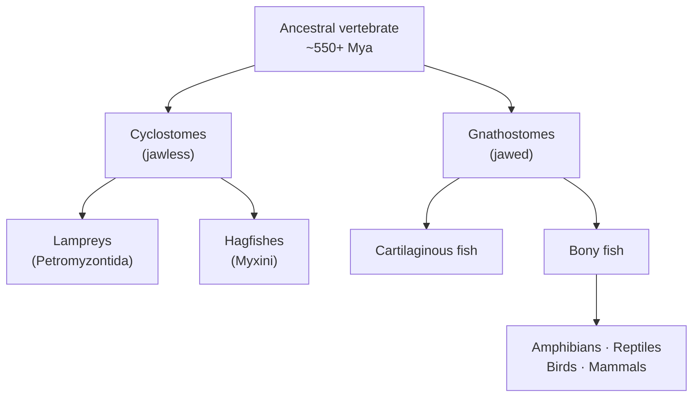
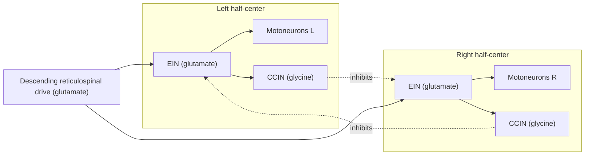
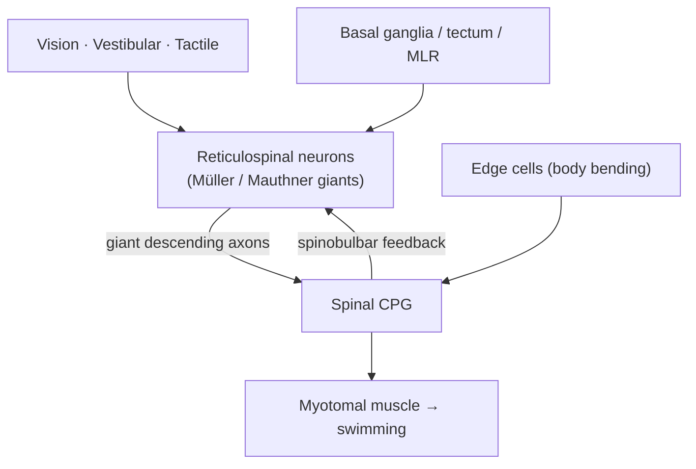
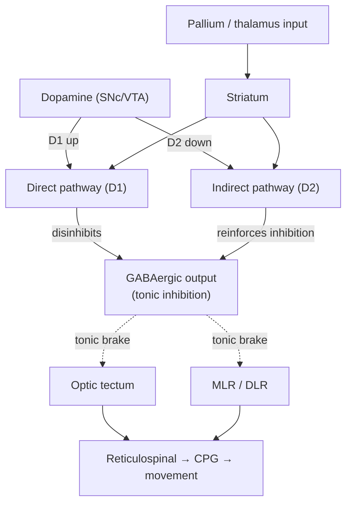

# The Lamprey & the Basal Vertebrate Nervous System

*A window into the ancestral vertebrate brain*

---

## Introduction

If you want to know what the first vertebrate brains were doing half a billion years ago, you cannot dig one up — soft nervous tissue does not fossilize. The next best thing is to study a living animal whose lineage split from ours near the very base of the vertebrate tree and then changed remarkably little. The **lamprey** is exactly that animal.

Lampreys are jawless fishes — eel-shaped, boneless, with a sucker-like oral disc lined by horny teeth. Together with hagfishes they form the **cyclostomes** (literally "round-mouths"), the only surviving **agnathans** (jawless vertebrates). Their lineage diverged from the ancestors of every jawed vertebrate — every shark, frog, bird, and mammal — somewhere around **500–560 million years ago**, before jaws, before paired fins, before the cerebral cortex as we know it. And yet the lamprey brain is unmistakably a *vertebrate* brain: forebrain, midbrain, hindbrain, spinal cord, an optic tectum, a habenula, a hypothalamus, a basal ganglia.

That combination — deep phylogenetic position plus a fully recognizable vertebrate body plan — is why the lamprey has become one of neuroscience's most instructive "model organisms of the deep past." When a circuit motif is found in both lamprey and mouse, the most parsimonious conclusion is that the motif was already present in their **last common ancestor** and has been conserved ever since. The lamprey thus lets us draw a rough blueprint of the **ancestral vertebrate brain** and, by subtraction, work out which features of *our* brains are ancient inheritances and which are late evolutionary additions.

This article surveys what the lamprey has taught us: the best-understood vertebrate motor circuit (the spinal locomotor central pattern generator), the startling discovery of a fully modern basal ganglia in a 500-million-year-old body plan, the reticulospinal command system built around giant identified neurons, the lamprey's near-miraculous capacity to regenerate its spinal cord, and what all of this reveals about the evolutionary ground plan of the brain. It closes with related developmental/evolutionary context — Sperry's chemoaffinity work in frogs — and with the important caveats that keep "basal" from being mistaken for "ancestral."

---

## Table of Contents

1. [Why the Lamprey Is a Key Model](#1-why-the-lamprey-is-a-key-model)
2. [The Spinal Locomotor Central Pattern Generator](#2-the-spinal-locomotor-central-pattern-generator)
3. [The Reticulospinal Command System and Giant Cells](#3-the-reticulospinal-command-system-and-giant-cells)
4. [An Ancient Basal Ganglia](#4-an-ancient-basal-ganglia)
5. [Spinal Cord Regeneration](#5-spinal-cord-regeneration)
6. [Ancient vs. Recent: Reading the Vertebrate Ground Plan](#6-ancient-vs-recent-reading-the-vertebrate-ground-plan)
7. [Comparative Context: Sperry, Frogs, and Chemoaffinity](#7-comparative-context-sperry-frogs-and-chemoaffinity)
8. [Limitations and Caveats](#8-limitations-and-caveats)
9. [Sources](#sources)

---

## 1. Why the Lamprey Is a Key Model

### Phylogenetic position

Cyclostomes (lampreys + hagfishes) are the **sister group** to all jawed vertebrates (gnathostomes). Their divergence is dated to roughly **500–560 million years ago**, in or near the Cambrian. Because they sit just above the origin of vertebrates on the tree, any trait shared between a lamprey and a mammal was very probably present in the ancestral vertebrate — this is the logic of the **phylogenetic bracket**.

Lampreys have also been morphologically conservative: fossil lampreys from the Devonian (~360 million years ago) already look strikingly like modern ones. This stability is part of why lamprey circuits are treated as reasonable proxies for early vertebrate design.

### A life cycle in two acts

Lampreys develop through a long **larval (ammocoete) stage** — blind, jawless filter-feeders that burrow in riverbed sediment for **2–8 years**. Because the larva has immature eyes, its **optic tectum** (the principal visual midbrain center in non-mammalian vertebrates) also stays undeveloped. At **metamorphosis**, the animal transforms into an active, often parasitic predator with functional eyes and a mature, layered optic tectum. This built-in "before and after" makes the lamprey a natural laboratory for how sensory experience and structure co-develop.

### Why neuroscientists love it at the bench

The lamprey's practical virtues are as important as its phylogenetic ones:

| Feature | Why it matters |
|---|---|
| **Large, individually identifiable neurons** | The same cell (e.g., a specific Müller or Mauthner cell) can be found and recorded in animal after animal, enabling cell-by-cell circuit analysis. |
| **Isolated brainstem–spinal cord preparation** | The whole CNS survives for hours to days in a dish, still generating organized motor output. |
| **"Fictive swimming"** | An immobilized or isolated cord produces the full rhythmic motor pattern of swimming, readable directly from motor nerves — behavior without a body. |
| **Simple, unmyelinated CNS** | Few cell classes and a relatively transparent, small cord make circuits tractable. |
| **Robust regeneration** | The cord functionally recovers after complete transection, a rare gift among vertebrates. |

The upshot: the lamprey offers a *complete* vertebrate nervous system that is simple enough to reverse-engineer, yet old enough that its answers speak to origins.

---

## 2. The Spinal Locomotor Central Pattern Generator

The lamprey spinal **central pattern generator (CPG) for locomotion** is arguably the best-understood vertebrate motor circuit in existence. Much of the foundational work is associated with **Sten Grillner** and colleagues from the 1970s onward.

### The behavior to be explained

A swimming lamprey throws a **traveling wave of body curvature** from head to tail. The mechanics are elegant: the phase coupling between body segments is tuned so that roughly **one full wavelength** fits on the body at essentially *any* swimming speed. Underlying this are two coordination rules the nervous system must implement:

1. **Left–right alternation** — the muscles on one side of a segment contract while the other side relaxes.
2. **Rostro-caudal phase lag** — each segment's burst is slightly delayed relative to the one ahead of it, producing the backward-traveling wave that pushes water and drives the animal forward.

### The circuit is intrinsic to the cord

A landmark finding: the isolated spinal cord, with the brain removed and the muscles absent, will still generate the alternating, rostrocaudally-delayed bursting pattern when chemically excited — **fictive swimming**. The rhythm therefore does not require the brain or sensory feedback; it is generated *within the cord itself*. The brain's descending drive turns it on and sets its intensity; sensors shape and correct it.

### The building blocks

The lamprey CPG is built from a small set of interneuron classes plus motoneurons. In the classic scheme:

| Element | Transmitter | Role |
|---|---|---|
| **EIN** — excitatory interneurons | Glutamate | Drive ipsilateral motoneurons and other interneurons; provide the excitatory "engine" of the rhythm. |
| **CCIN** — crossed caudal inhibitory interneurons | Glycine | Project across the midline to silence the *contralateral* half-segment, enforcing left–right alternation. |
| **LIN** — lateral inhibitory interneurons | Glycine | Inhibit ipsilateral CCINs, helping terminate bursts and control phase. |
| **Motoneurons** | — | Read out the pattern to the myotomal muscles. |
| **Edge cells** | — | Intraspinal stretch receptors (see below). |

### How the rhythm is made: reciprocal inhibition + intrinsic properties

The organizing principle is the **half-center oscillator**: two pools of neurons (left and right) that each excite themselves and reciprocally inhibit the other through the glycinergic crossing interneurons. When one side is active it suppresses the other; when its own activity wanes, the opposite side is released and takes over — producing self-sustaining alternation.

Two extra ingredients make it work reliably:

- **NMDA-receptor-dependent membrane oscillations.** Under NMDA activation, individual neurons can produce voltage-dependent, TTX-resistant intrinsic oscillations, giving cells pacemaker-like tendencies that reinforce the network rhythm.
- **Burst termination via calcium-activated potassium (K_Ca) currents.** Calcium entering during a burst slowly opens K⁺ channels that hyperpolarize the cell and end the burst — an intrinsic "off switch" that sets burst duration and helps hand activity to the other side.

### From one segment to a swimming wave

Each short length of cord contains a segmental oscillator capable of rhythm on its own. The full cord is a **chain of coupled oscillators**. Asymmetric coupling between neighboring segments imposes a fixed **phase lag** (on the order of ~1% of the cycle per segment) so that the head-to-tail timing produces exactly one wavelength on the body regardless of frequency. Change the descending drive and the frequency changes; the phase relationships hold.

### Sensory feedback: the edge cells

The cord is not a blind clock. **Edge cells** are mechanoreceptor neurons in the lateral margin of the spinal cord that sense the **bending of the body** as the animal swims. Grillner's group showed that imposing sinusoidal bending on a curarized cord/notochord preparation causes the fictive swimming rhythm to **phase-lock ("entrain")** to the imposed movement. This intraspinal proprioception lets the actual body mechanics feed back into and stabilize the motor rhythm — a closed loop between neural command and body movement.

### Why it matters

Because every element — the neuron types, their transmitters, the reciprocal-inhibition architecture, the intrinsic currents, and the sensory feedback — has been identified, the lamprey CPG is a *complete worked example* of how a vertebrate spinal cord builds coordinated movement. It has become the reference model for spinal locomotor networks generally (including mammalian ones), for computational neuroscience, and for bio-inspired swimming robots.

---

## 3. The Reticulospinal Command System and Giant Cells

A CPG can generate a rhythm, but something must **command** it — start it, stop it, speed it up, steer it. In the lamprey, as in fish generally, that job falls to the **reticulospinal (RS) system**: neurons in the brainstem reticular formation whose axons descend the spinal cord to drive and steer the CPG. This is the principal descending motor pathway in the lamprey; there is no corticospinal tract.

### Müller and Mauthner cells

The lamprey RS system famously includes **giant identified neurons**:

- **Müller cells** — large reticulospinal command neurons in the mesencephalon and rhombencephalon. Each extends a **single giant axon that runs the entire length of the spinal cord**, making monosynaptic or disynaptic connections onto motoneurons and onto excitatory and inhibitory interneurons of the CPG. A single such neuron can therefore influence coordinated activity across many segments at once. These are among the oldest command neurons known: agnathans had evolved Müller-type RS neurons more than 500 million years ago.
- **Mauthner cells** — the archetypal escape command neuron, most famous in teleost fish (where they trigger the C-start escape), but present in lamprey as well. Their crossed, fast, giant axons are built for rapid, whole-body startle responses.

### A command-and-integration hub

The RS neurons are not simple triggers; they are **integrators**. They collect visual, vestibular, and tactile information and convert it into graded locomotor commands. During fictive swimming, Müller and Mauthner cells show strong depolarizations and rhythmic firing that last for the whole swim episode — i.e., they are both drivers of and participants in the rhythm. Asymmetric activation of left vs. right RS neurons produces turns; strong bilateral activation produces escape or acceleration.

Feedback also runs the other way. Compared with mammals, the lamprey's ascending pathway is unusually **direct**: **spinobulbar** neurons make monosynaptic excitatory and inhibitory connections back onto the RS neurons, closing a tight loop between the spinal rhythm and the brainstem command layer.

The higher motor centers — optic tectum, the **mesencephalic locomotor region (MLR)**, the **diencephalic locomotor region (DLR)**, and the basal ganglia — ultimately act *through* this reticulospinal bottleneck. The MLR, when stimulated, sends graded descending input to RS neurons, which relay a scalable "go" signal to the spinal CPG. This tectum/MLR → RS → CPG architecture is itself conserved across vertebrates.

---

## 4. An Ancient Basal Ganglia

Perhaps the single most influential discovery to come from lamprey neuroscience — largely from Grillner's group and collaborators including Marcus Stephenson-Jones, Brita Robertson, and Andreas Ericsson — is that the lamprey already possesses a **basal ganglia with essentially the same circuitry as ours**. This pushes the origin of the vertebrate action-selection system back to the **dawn of vertebrates (~560 million years ago)**.

### The same parts list

The mammalian basal ganglia is a set of interconnected nuclei that select and gate actions. Component by component, the lamprey has homologs of all of them:

| Mammalian component | Lamprey homolog | Function |
|---|---|---|
| **Striatum** (input) | Present, with D1- and D2-expressing neurons | Receives cortical/pallial and thalamic input; entry point for action selection. |
| **Globus pallidus (external, GPe)** | Present | Node of the indirect pathway. |
| **Globus pallidus internal / SNr** (output) | GABAergic output nucleus present | Tonic inhibitory output that gates downstream motor centers. |
| **Subthalamic nucleus (STN)** | Present | Excitatory node of the indirect/hyperdirect pathways. |
| **Substantia nigra pars compacta (SNc) / VTA** | Dopaminergic cell group present | Supplies dopamine to the striatum (and downstream). |

### The same wiring: direct and indirect pathways

Crucially, the lamprey has **both the direct and the indirect pathway**, wired the same way as in mammals:

- **Direct pathway** — striatal neurons expressing **dopamine D1 receptors** project straight to the GABAergic output nucleus. Their activity *reduces* output inhibition — i.e., **disinhibits** and thereby *facilitates* a selected movement.
- **Indirect pathway** — striatal neurons expressing **dopamine D2 receptors** route through the pallidum and subthalamic nucleus to *increase* output inhibition — i.e., *suppress* competing movements.

The **segregated expression of D1 (direct) and D2 (indirect)** receptors — a hallmark of the mammalian system — is already present in this most basal vertebrate. And **dopamine acts the same way**: it raises the excitability of the direct (D1) pathway that promotes movement and lowers the excitability of the indirect (D2) pathway that suppresses it, biasing the system toward action. This is the identical push-pull logic disrupted in Parkinson's disease.

### Action selection by disinhibition

The output logic is also conserved. The GABAergic output neurons provide **tonic inhibition at rest** onto downstream motor centers — the optic tectum, the MLR, and the DLR. To perform an action, the relevant striatal channel transiently *releases* the corresponding output neurons' brake — **selection by disinhibition**. The tectum's own output neurons in lamprey receive precisely this combination of inhibitory (basal ganglia) and excitatory (sensory/forebrain) input, so the basal ganglia can pick which orienting or evasive movement the tectum is allowed to execute.

### Evaluation as well as selection

More recent lamprey work shows the system is not only a *selector* but an *evaluator*: there are partly independent circuits — involving the pallidum and the **habenula** — concerned with the *value* of actions (reward/punishment) as distinct from the mechanics of choosing among them. The dual architecture of "which action" and "is it worth it" appears to be ancient too.

### Not just ascending — descending dopamine

A twist that lamprey work helped reveal: dopamine's motor role is **not only** via ascending projections to the striatum. In lamprey, dopaminergic neurons of the meso-diencephalic region also project **directly downstream** to the MLR and even to reticulospinal neurons, where D1 activation promotes locomotion. This descending dopaminergic control has since been confirmed in mammals — an example of the lamprey pointing to a feature that was overlooked in "higher" models.

**Bottom line:** the basal ganglia is not a mammalian or even a gnathostome invention. It is a **founding feature of the vertebrate brain**, conserved in circuitry, neurochemistry, and function for over half a billion years — a remarkably stable solution to the universal problem of choosing one action at a time.

---

## 5. Spinal Cord Regeneration

In humans and other mammals, a complete spinal cord transection causes permanent paralysis: severed central axons do not regrow across the injury. The lamprey does something mammals cannot — it **functionally recovers**.

### The phenomenon

After a **complete spinal cord transection**, a lamprey is initially paralyzed below the lesion. Over the following weeks it progressively recovers, and by roughly **10–12 weeks** it swims again with near-normal coordination. Recovery is accompanied by tissue repair at the lesion, and by **regeneration of axons and synapses** across the gap. Remarkably, the cord can recover even after **repeated** transection.

### What the giant neurons revealed

Because the lamprey has ~**18 pairs of large, individually identified reticulospinal neurons**, researchers could track regeneration *cell by cell* — something impossible in a mammalian cord. Key findings:

- After transection, RS axons initially **retract** over the first ~2 weeks, then many regrow toward and across the lesion by ~4 weeks; by ~11 weeks roughly **50% of descending RS axons** have regenerated several millimeters past the injury.
- Individual identified neurons are reproducibly **"good" or "bad" regenerators** — a given cell has a characteristic probability of regrowing its axon.
- Neurons that **fail** to regenerate their axon tend to undergo a **delayed, caspase-mediated (apoptotic) cell death** — linking regenerative failure to a programmed death pathway, a finding with clear relevance to injury biology in mammals.

### A surprise about "how much is enough"

One might assume full behavioral recovery requires full reconstruction of the original wiring. It does not. Studies of regenerated **giant RS synapses** found them to be **sparse and small** — regenerated axons form comparatively few synapses — *even at a time when behavioral recovery was nearly complete*. The nervous system apparently recovers useful function with only a **partial** restoration of connectivity, presumably because the spinal CPG below the lesion is intact and needs only enough descending drive to be re-engaged. This reframes a therapeutic goal: perhaps re-establishing *some* functional descending input, rather than perfect anatomical repair, is what recovery actually requires.

### Why lamprey and not us?

The contrast with mammals is instructive rather than magical. Contributing factors in lamprey include a permissive glial/extracellular environment and an **unmyelinated CNS** (mammalian myelin debris carries potent axon-growth inhibitors). Notably, lampreys **also possess** some of the same inhibitory molecules implicated in mammalian regeneration failure — for example, the receptor **PTPσ** and chondroitin-sulfate-proteoglycan signaling — yet still regenerate; knocking down PTPσ actually *impairs* lamprey RS axon regeneration and neuronal survival. So the lamprey is not simply "missing the brakes." It is a system in which the *balance* of pro- and anti-regenerative signals tips toward regrowth, making it a valuable comparison point for understanding why the mammalian balance does not.

| | Lamprey CNS | Mammalian CNS |
|---|---|---|
| Functional recovery after complete transection | Yes (~10–12 weeks) | No (permanent deficit) |
| RS axon regrowth across lesion | ~50% by 11 weeks | Essentially none |
| Restored connectivity needed for recovery | Partial / sparse suffices | — |
| Myelin | Largely unmyelinated | Myelinated; debris inhibits growth |
| Identified-cell tracking possible | Yes (giant RS neurons) | No |

---

## 6. Ancient vs. Recent: Reading the Vertebrate Ground Plan

Putting the pieces together, the lamprey lets us sort features of the vertebrate brain into **deep inheritances** and **later elaborations**. Modern single-cell approaches have sharpened this: a **lamprey neural cell-type atlas** (single-cell RNA sequencing plus spatial mapping), compared against mouse and other vertebrates, has been used to reconstruct ancestral cell types and confirm which brain regions are built from conserved neuronal identities.

### What is ancient (present already in the basal vertebrate)

- **The basic brain bauplan** — telencephalon, diencephalon (with thalamus, hypothalamus, and **habenula/epithalamus**), midbrain with **optic tectum**, hindbrain, and spinal cord.
- **The basal ganglia** and its dopamine-based **action-selection** machinery (Section 4).
- **Spinal CPGs** for rhythmic locomotion and their reciprocal-inhibition logic (Section 2).
- **The reticulospinal command system** and giant command neurons (Section 3).
- **Core neuromodulatory systems** — dopaminergic, serotonergic, and others.
- **A pallium** (the forebrain sheet that in mammals becomes cortex) in basic form, plus **olfactory** and **hypothalamic** systems, and **cerebellum-like** circuitry.

### What is derived (later additions on the gnathostome/mammalian line)

- **The six-layered neocortex** and its massive expansion.
- **The corticospinal tract** — direct cortex-to-cord motor control (the lamprey commands movement only through the brainstem RS bottleneck).
- **Extensive CNS myelination** (a jawed-vertebrate innovation) — with consequences for both conduction speed and, as it happens, regeneration failure.
- **An elaborated cerebellum**, jaws, and paired appendages with their associated circuitry.

The through-line is striking: the **fundamental control architecture of the vertebrate brain** — select an action in the basal ganglia, command it through reticulospinal neurons, execute it via spinal CPGs, correct it with proprioceptive feedback — was **already in place at the origin of vertebrates**. What the jawed lineage largely added was a vast new *forebrain* apparatus (cortex) layered on top of, and eventually partly bypassing, that ancient core. Our sophistication is substantially a story of **elaboration of the front end**, not reinvention of the machine.

---

## 7. Comparative Context: Sperry, Frogs, and Chemoaffinity

The lamprey speaks to **evolution** — which circuits are old. A complementary classical literature, chiefly in **frogs and newts**, speaks to **development and regeneration** — how a circuit's precise wiring is specified in the first place, and why some vertebrates rewire after injury while others do not. The two themes meet in the work of **Roger W. Sperry** (Nobel laureate, 1981).

### The chemoaffinity hypothesis

Sperry's central experiments used the **retinotectal system** — the orderly, topographic map that retinal ganglion cells make onto the optic tectum. In amphibians (and fish), the **optic nerve regenerates** after being cut (again, a capacity mammals lack). Sperry cut the optic nerve and, in some experiments, **surgically rotated the eye 180°**. When the axons regrew, the animal exhibited **systematically inverted, maladaptive vision**: presented with a lure above it, a frog would strike *downward*. The behavior never corrected with experience.

The interpretation was decisive. If regenerating axons simply reconnected at random and the animal *learned* to see, vision would have recovered normally. Instead, each axon regrew to its **original, "correct" target** as defined *before* the rotation — producing vision that was now upside-down because the eye had been flipped. Connections were being specified by **fixed molecular matching**, not by activity or learning.

From this Sperry proposed the **chemoaffinity hypothesis**: neurons bear **specific molecular tags**, and axons find their targets by matching complementary chemical identities — the wiring diagram is, indirectly, encoded in the genome. To avoid needing a unique label per cell, he proposed **orthogonal, graded** tags giving each position a kind of molecular **"latitude and longitude."** Decades later this was vindicated at the molecular level by the discovery of **Eph receptor / ephrin gradients** that guide retinotectal mapping — the physical embodiment of Sperry's gradients.

### Xenopus and the refinements

The **African clawed frog, *Xenopus laevis***, became a workhorse for testing and refining these ideas — e.g., studies of how **partial ("quarter-eye") retinas** project to the tectum, and experiments routing regenerating optic axons through foreign nerve roots to see whether vision could still be restored. This work established that the final map reflects **chemoaffinity, neural activity, and competition** acting together, rather than rigid tags alone.

### Why it belongs here

Two connections tie the frog work to the lamprey story:

1. **Regeneration as a comparative axis.** Frog optic nerve regenerates, lamprey spinal cord regenerates, and the mammalian CNS does neither. Studying the animals that *can* regrow central connections — and the developmental rules (chemoaffinity gradients) that guide axons to the right place — is exactly what a mammal-only neuroscience would miss. The lamprey and the frog are two windows onto the same lesson: robust CNS regeneration is a real vertebrate capacity that the mammalian lineage largely lost.
2. **A shared logic of conserved specification.** Sperry's insight that connectivity is molecularly pre-specified, and the lamprey's demonstration that whole *circuits* are evolutionarily pre-specified, are complementary faces of the same principle — much of the vertebrate nervous system is built to a **deeply conserved genetic and molecular plan**.

---

## 8. Limitations and Caveats

The lamprey is a powerful lens, but it is not a literal photograph of our ancestor. Several caveats are essential:

- **"Basal" is not "ancestral."** The lamprey is a *living, modern* animal with its own ~500 million years of independent evolution since the split. Its brain is a mosaic of retained ancestral traits *and* lamprey-specific specializations (and losses). Any given feature could be primitive, derived, or secondarily simplified — that must be argued, not assumed.
- **Absence can be loss, not primitiveness.** If a structure is missing in lamprey, it may have been lost on the cyclostome line rather than never having existed. Hagfish/lamprey comparisons and outgroups are needed to distinguish the two.
- **Genome complications.** Cyclostome genomes have their own history of gene duplication, gene loss, and unusual features (including programmed genome rearrangement in the soma), complicating one-to-one gene homology with mammals.
- **Homology debates.** Some of the most interesting comparisons remain contested — notably the exact correspondence between lamprey **pallial** subdivisions and the mammalian cortex/amygdala. "Conserved" claims vary in strength from very solid (basal ganglia circuitry) to still-argued (specific pallial homologies).
- **A small, unmyelinated CNS.** The very features that make the lamprey tractable (few cell types, large neurons, no myelin) also limit extrapolation. Its permissive regenerative environment, in particular, differs from the mammalian one in ways that mean lamprey recovery cannot be transplanted wholesale as therapy.
- **Larva vs. adult.** Ammocoete and adult lampreys differ dramatically (e.g., tectal maturation at metamorphosis); results depend on life stage and must be interpreted accordingly.
- **Fictive vs. real behavior.** Isolated-cord "fictive swimming" is an invaluable readout, but the intact, freely behaving animal integrates sensory, mechanical, and higher-order inputs that reduced preparations omit.

Used with these caveats, the lamprey remains one of neuroscience's most valuable reference points: a full vertebrate nervous system, old enough to inform origins and simple enough to understand, whose lessons — a conserved basal ganglia, a solved spinal CPG, a regenerating cord — reshape how we think about which parts of our own brains are ancient inheritance and which are recent invention.

---

## Sources

- [The Basal Ganglia Over 500 Million Years — Current Biology review (Grillner & Robertson)](https://www.cell.com/current-biology/pdf/S0960-9822(16)30680-7.pdf)
- [Evolutionary Conservation of the Basal Ganglia as a Common Vertebrate Mechanism for Action Selection (Stephenson-Jones et al., Current Biology)](https://www.cell.com/current-biology/fulltext/S0960-9822(11)00528-8)
- [The evolutionary origin of the vertebrate basal ganglia and its role in action selection (Grillner & Robertson, J. Physiol.)](https://physoc.onlinelibrary.wiley.com/doi/10.1113/jphysiol.2012.246660)
- [Dopamine Differentially Modulates the Excitability of Striatal Neurons of the Direct and Indirect Pathways in Lamprey (J. Neurosci.)](https://www.jneurosci.org/content/33/18/8045)
- [The Dopamine D2 Receptor Gene in Lamprey, Its Expression in the Striatum and Cellular Effects of D2 Receptor Activation (PLOS ONE)](https://journals.plos.org/plosone/article?id=10.1371/journal.pone.0035642)
- [The Basal Ganglia Downstream Control of Action — An Evolutionarily Conserved Strategy (PubMed)](https://pubmed.ncbi.nlm.nih.gov/37563813/)
- [Independent circuits in the basal ganglia for the evaluation and selection of actions (PNAS)](https://www.pnas.org/doi/10.1073/pnas.1314815110)
- [Dopamine and the Brainstem Locomotor Networks: From Lamprey to Human (Frontiers in Neuroscience)](https://www.frontiersin.org/journals/neuroscience/articles/10.3389/fnins.2017.00295/full)
- [Descending Dopaminergic Inputs to Reticulospinal Neurons Promote Locomotor Movements (J. Neurosci.)](https://www.jneurosci.org/content/40/44/8478)
- [Intersegmental coordinating system of the lamprey central pattern generator for locomotion (J. Comp. Physiol. A)](https://link.springer.com/article/10.1007/BF00609725)
- [Understanding Locomotor Rhythm in the Lamprey Central Pattern Generator (Springer)](https://link.springer.com/chapter/10.1007/978-3-319-34139-2_6)
- [Features of entrainment of spinal pattern generators for locomotor activity in the lamprey spinal cord (PubMed)](https://pubmed.ncbi.nlm.nih.gov/2828561/)
- [Entrainment of the spinal pattern generators for swimming by mechano-sensitive elements — edge cells (PubMed)](https://pubmed.ncbi.nlm.nih.gov/7248795/)
- [Central Pattern Generator for Locomotion: Anatomical, Physiological, and Pathophysiological Considerations (Frontiers in Neurology)](https://www.frontiersin.org/journals/neurology/articles/10.3389/fneur.2012.00183/full)
- [Central pattern generator (Wikipedia overview)](https://en.wikipedia.org/wiki/Central_pattern_generator)
- [Mechanosensory Feedback in Lamprey Swimming Models and Applications in Spinal Cord Regeneration (Integr. Comp. Biol.)](https://academic.oup.com/icb/article/63/2/464/7207401)
- [The role of curvature feedback in the energetics and dynamics of lamprey swimming: a closed-loop model (PMC)](https://www.ncbi.nlm.nih.gov/pmc/articles/PMC6114910/)
- [Reticulospinal Systems for Tuning Motor Commands (Frontiers in Neural Circuits)](https://www.frontiersin.org/journals/neural-circuits/articles/10.3389/fncir.2018.00030/full)
- [Spinal locomotor inputs to individually identified reticulospinal neurons in the lamprey (J. Neurophysiol. / PMC)](https://pmc.ncbi.nlm.nih.gov/articles/PMC3214102/)
- [The Spinobulbar System in Lamprey (PMC)](https://pmc.ncbi.nlm.nih.gov/articles/PMC2246055/)
- [Mauthner cell (Wikipedia overview)](https://en.wikipedia.org/wiki/Mauthner_cell)
- [Regenerated Synapses in Lamprey Spinal Cord Are Sparse and Small Even After Functional Recovery From Injury (PMC)](https://pmc.ncbi.nlm.nih.gov/articles/PMC4533873/)
- [Regenerative capacity in the lamprey spinal cord is not altered after a repeated transection (PLOS ONE / PMC)](https://pmc.ncbi.nlm.nih.gov/articles/PMC6353069/)
- [PTPσ Knockdown in Lampreys Impairs Reticulospinal Axon Regeneration and Neuronal Survival After Spinal Cord Injury (PMC)](https://www.ncbi.nlm.nih.gov/pmc/articles/PMC7096546/)
- [Source of Early Regenerating Axons in Lamprey Spinal Cord Revealed by Wholemount Optical Clearing (PMC)](https://pmc.ncbi.nlm.nih.gov/articles/PMC7694618/)
- [Dopamine-sensitive neurons in the mesencephalic locomotor region control locomotion initiation, stop, and turns (Cell Reports / PMC)](https://pmc.ncbi.nlm.nih.gov/articles/PMC11157412/)
- [The role of the optic tectum for visually evoked orienting and evasive movements (PNAS / PMC)](https://pmc.ncbi.nlm.nih.gov/articles/PMC6660747/)
- [A lamprey neural cell type atlas illuminates the origins of the vertebrate brain (Nature Ecology & Evolution)](https://www.nature.com/articles/s41559-023-02170-1)
- [Development and Organization of the Lamprey Telencephalon with Special Reference to the GABAergic System (Frontiers in Neuroanatomy / PMC)](https://pmc.ncbi.nlm.nih.gov/articles/PMC3062466/)
- [The Lamprey Forebrain – Evolutionary Implications (Brain, Behavior and Evolution, Karger)](https://karger.com/bbe/article/96/4-6/318/821601/The-Lamprey-Forebrain-Evolutionary-Implications)
- [Evolutionary crossroads in developmental biology: cyclostomes (lamprey and hagfish) (Development)](https://journals.biologists.com/dev/article/139/12/2091/45059/Evolutionary-crossroads-in-developmental-biology)
- [The evolution of lamprey (Petromyzontida) life history and the origin of metamorphosis (ResearchGate)](https://www.researchgate.net/publication/327308965_The_evolution_of_lamprey_Petromyzontida_life_history_and_the_origin_of_metamorphosis)
- [Lamprey (Wikipedia overview)](https://en.wikipedia.org/wiki/Lamprey)
- [Roger Wolcott Sperry (1913–1994) (Embryo Project Encyclopedia)](https://embryo.asu.edu/pages/roger-wolcott-sperry-1913-1994)
- [Chemoaffinity hypothesis (Wikipedia overview)](https://en.wikipedia.org/wiki/Chemoaffinity_hypothesis)
- [Retinal specificity in eye fragments: retinotectal projections of quarter-eyes in *Xenopus laevis* (Exp. Brain Res.)](https://link.springer.com/article/10.1007/BF00227514)
- [Visual recovery following regeneration of the optic nerve through the oculomotor nerve root in Xenopus (ScienceDirect)](https://www.sciencedirect.com/science/article/abs/pii/0014488667900313)
