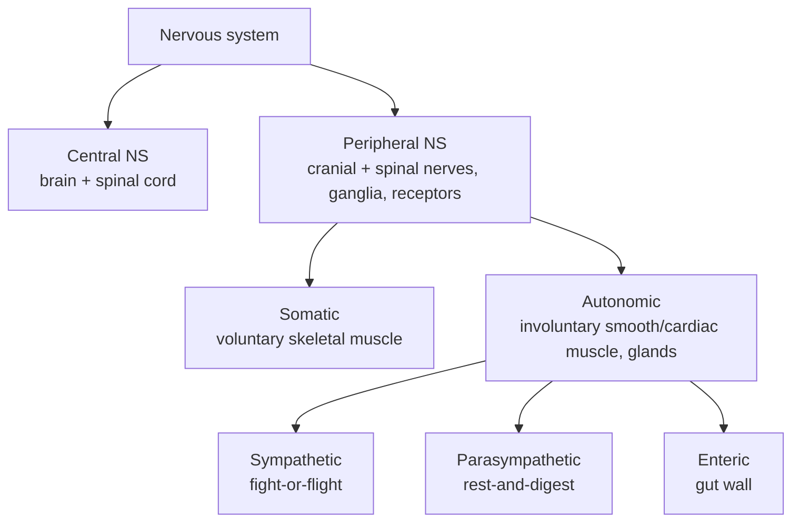
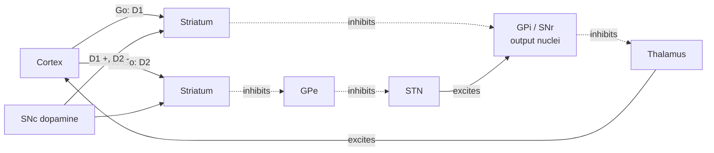

# Brain Anatomy and Organization

*A technical reference on the structural and functional organization of the human nervous system, from the gross division of central and peripheral systems down to the laminar microstructure of the cortex and its large-scale networks.*

## Introduction

The human brain contains on the order of 86 billion neurons and a comparable number of glial cells, packed into roughly 1.3–1.4 kg of tissue. Its organization is hierarchical and deeply conserved: peripheral nerves feed sensory information into the spinal cord and brainstem; the brainstem and diencephalon relay, filter, and modulate that traffic; and the cerebral cortex performs the highest-order integration. Understanding neuroanatomy means holding several complementary maps in mind at once — a *gross anatomical* map of lobes and nuclei, a *microstructural* map of layers and cell types, a *vascular and fluid* map of how the tissue is supplied and cleared, and a *connectional* map of tracts and functional networks.

This document works through those maps in turn. It begins with the broadest organizational dichotomies (central vs. peripheral, somatic vs. autonomic, afferent vs. efferent), covers the protective and supply systems (meninges, ventricles, cerebrospinal fluid, blood supply, blood–brain barrier), then moves rostrally from the brainstem up through the cerebellum, diencephalon, basal ganglia, limbic system, and cortex, and closes with lateralization, white-matter connectomics, and topographic maps.

## Table of Contents

1. [Overview: The Organization of the Nervous System](#1-overview-the-organization-of-the-nervous-system)
2. [Protection and Fluid Systems: Meninges, Ventricles, and CSF](#2-protection-and-fluid-systems-meninges-ventricles-and-csf)
3. [The Blood–Brain Barrier](#3-the-bloodbrain-barrier)
4. [Cerebral Blood Supply and Brain Metabolism](#4-cerebral-blood-supply-and-brain-metabolism)
5. [The Brainstem](#5-the-brainstem)
6. [The Cerebellum](#6-the-cerebellum)
7. [The Diencephalon](#7-the-diencephalon)
8. [The Basal Ganglia](#8-the-basal-ganglia)
9. [The Limbic System](#9-the-limbic-system)
10. [The Cerebral Cortex](#10-the-cerebral-cortex)
11. [The Four Lobes and Key Functional Areas](#11-the-four-lobes-and-key-functional-areas)
12. [Hemispheric Lateralization and the Corpus Callosum](#12-hemispheric-lateralization-and-the-corpus-callosum)
13. [White-Matter Tracts, Connectomics, and Functional Networks](#13-white-matter-tracts-connectomics-and-functional-networks)
14. [Topographic Maps](#14-topographic-maps)
15. [Sources](#sources)

---

## 1. Overview: The Organization of the Nervous System

### Central vs. Peripheral

The nervous system is conventionally divided into the **central nervous system (CNS)** and the **peripheral nervous system (PNS)**.

- The **CNS** comprises the brain and the spinal cord. It is the site of integration and processing — where sensory input is interpreted, decisions are made, and motor commands originate. CNS tissue is protected by bone (skull and vertebral column), the meninges, and cerebrospinal fluid, and it is chemically insulated by the blood–brain barrier.
- The **PNS** comprises everything else: the cranial nerves (except the optic nerve, which is a CNS tract), the spinal nerves, the peripheral ganglia, and the sensory receptors. Its job is to carry information to and from the CNS. Peripheral axons are myelinated by Schwann cells (rather than the oligodendrocytes of the CNS) and, unlike central axons, can regenerate to a limited degree.

### Somatic vs. Autonomic

The PNS is functionally split into somatic and autonomic divisions:

- The **somatic nervous system** governs voluntary control of skeletal muscle and carries conscious sensation (touch, proprioception, pain, temperature) from the body wall and limbs. A somatic motor pathway is typically a single motor neuron running from the CNS directly to the muscle.
- The **autonomic nervous system (ANS)** governs involuntary control of smooth muscle, cardiac muscle, and glands — heart rate, digestion, pupil diameter, glandular secretion. Autonomic motor pathways use a two-neuron chain (preganglionic and postganglionic) relayed through an autonomic ganglion. The ANS is further divided into the **sympathetic** ("fight-or-flight," thoracolumbar outflow, generally catabolic and arousing), the **parasympathetic** ("rest-and-digest," craniosacral outflow, generally restorative), and the **enteric** nervous system, a semi-autonomous network embedded in the gut wall.

### Afferent vs. Efferent

A cross-cutting distinction describes the *direction* of information flow relative to the CNS:

- **Afferent** (sensory) fibers carry signals *toward* the CNS — from receptors in skin, muscle, viscera, and sense organs.
- **Efferent** (motor) fibers carry signals *away* from the CNS — toward effectors (muscles and glands).

These terms combine with the somatic/autonomic axis (e.g., somatic afferents carry conscious touch; visceral efferents drive smooth muscle), giving a compact vocabulary for classifying any nerve fiber.

| Axis | One end | Other end |
|---|---|---|
| Location | Central (brain, spinal cord) | Peripheral (nerves, ganglia, receptors) |
| Control | Somatic (voluntary, skeletal muscle) | Autonomic (involuntary, smooth/cardiac muscle, glands) |
| Direction | Afferent (sensory, toward CNS) | Efferent (motor, away from CNS) |
| Autonomic tone | Sympathetic (arousing) | Parasympathetic (restorative) |

The structural (CNS/PNS) and functional (somatic/autonomic) divisions nest as follows:

---

## 2. Protection and Fluid Systems: Meninges, Ventricles, and CSF

### The Meninges

Three connective-tissue membranes, the **meninges**, envelop the brain and spinal cord. From outside in:

1. **Dura mater** — a tough, two-layered outer membrane. Its periosteal layer adheres to the inner skull; its meningeal layer folds inward to form partitions such as the *falx cerebri* (between the hemispheres) and the *tentorium cerebelli* (between cerebrum and cerebellum). Between and within its layers run the dural venous sinuses that drain cerebral venous blood.
2. **Arachnoid mater** — a delicate, avascular middle membrane. Beneath it lies the **subarachnoid space**, a fluid-filled compartment spanned by web-like trabeculae and containing the major cerebral arteries and CSF.
3. **Pia mater** — a thin, vascular membrane that follows every gyrus and sulcus, adhering directly to the brain surface.

Clinically important potential spaces sit at the interfaces: the **epidural** space (external to dura, site of arterial epidural hematomas), the **subdural** space (site of venous subdural hematomas from torn bridging veins), and the **subarachnoid** space (site of subarachnoid hemorrhage, often from ruptured aneurysms).

### The Ventricular System

The brain contains four interconnected cavities lined by ependymal cells and filled with CSF:

- Two **lateral ventricles** (one per hemisphere), each with anterior, posterior, and inferior horns.
- The **third ventricle**, a narrow midline slit in the diencephalon, connected to the lateral ventricles by the paired **interventricular foramina of Monro**.
- The **cerebral aqueduct (of Sylvius)**, a thin channel through the midbrain.
- The **fourth ventricle**, between the pons/medulla and the cerebellum, continuous with the central canal of the spinal cord.

### Cerebrospinal Fluid: Production, Circulation, and Function

**Production.** CSF is a clear, colorless ultrafiltrate of plasma. Roughly **80%** is actively secreted by the **choroid plexus** — specialized vascular tufts of modified ependyma projecting into each ventricle — with the remaining ~20% derived from the ependyma and brain interstitium across the blood–brain barrier. Total volume is about **125–150 mL** at any moment, but production runs at roughly **500 mL per day**, so the entire volume turns over about **3–4 times daily** (approximately every 7–8 hours).

**Circulation.** The bulk flow follows the ventricular system rostral-to-caudal:

> Lateral ventricles → foramina of Monro → third ventricle → cerebral aqueduct → fourth ventricle → out into the subarachnoid space via the median aperture (**foramen of Magendie**) and the two lateral apertures (**foramina of Luschka**).

From the subarachnoid space CSF bathes the whole CNS surface and is reabsorbed into the venous blood of the dural sinuses, classically through **arachnoid granulations** (villi projecting into the superior sagittal sinus) and, as increasingly recognized, along perineural and meningeal lymphatic routes. This circulation is coupled to the **glymphatic system**, a perivascular clearance pathway that flushes metabolic waste (including amyloid-β) from brain interstitium, especially during sleep.

**Functions.**
- **Buoyancy** — CSF reduces the brain's effective weight from ~1,400 g to under 50 g, preventing it from crushing its own base and vessels.
- **Cushioning** — it absorbs mechanical shocks.
- **Homeostasis** — it stabilizes the ionic microenvironment and carries away metabolites.
- **Immune and signaling functions** — it transports immune cells, hormones, and signaling molecules through the CNS.

Obstruction of flow or impaired absorption causes **hydrocephalus** — CSF accumulation and raised intracranial pressure.

---

## 3. The Blood–Brain Barrier

The **blood–brain barrier (BBB)** is a highly selective interface between circulating blood and the brain's extracellular fluid. Its structural core is the layer of **capillary endothelial cells**, which differ from peripheral capillaries in three ways:

1. **Continuous tight junctions** seal the clefts between adjacent endothelial cells, blocking the paracellular diffusion of polar solutes, ions, and proteins.
2. **Minimal pinocytosis / no fenestrations**, sharply limiting bulk transcellular transport.
3. **Dense enzymatic and transporter machinery** that controls exactly what crosses.

These endothelial cells are wrapped by a basement membrane, **pericytes**, and the **end-feet of astrocytes**, whose perivascular processes induce and maintain barrier properties. Together this ensemble is called the **neurovascular unit**.

Consequences of the barrier:
- **Lipophilic, small molecules** (O₂, CO₂, ethanol, many anesthetics) cross freely by diffusion.
- **Essential polar nutrients** require dedicated carriers — notably **GLUT1** for glucose and **LAT1** for large neutral amino acids.
- **Large or charged molecules, most drugs, and pathogens** are largely excluded, which protects the brain but complicates CNS pharmacology.

A few regions — the **circumventricular organs** (e.g., area postrema, median eminence, posterior pituitary) — deliberately lack a tight BBB so that neurons can sample blood-borne hormones and toxins or secrete hormones into the circulation.

---

## 4. Cerebral Blood Supply and Brain Metabolism

### Two Feeding Systems and the Circle of Willis

The brain is supplied by two paired arterial systems that converge into a protective anastomotic ring:

- The **internal carotid arteries** (anterior circulation) supply most of the cerebral hemispheres.
- The **vertebral arteries** merge to form the **basilar artery** (posterior circulation), supplying the brainstem, cerebellum, and posterior cerebrum.

At the base of the brain these systems join in the **circle of Willis**, a ring in the subarachnoid space around the optic chiasm and pituitary stalk. Its components:

| Vessel | Role in the circle |
|---|---|
| Anterior cerebral arteries (ACA) | Form the anterolateral arc |
| Anterior communicating artery (ACom) | Single midline vessel bridging the two ACAs |
| Internal carotid arteries (ICA) | Feed into the ring laterally |
| Posterior communicating arteries (PCom) | Connect each ICA to the ipsilateral PCA |
| Posterior cerebral arteries (PCA) | Form the posterior arc (from the basilar tip) |

The **middle cerebral artery (MCA)**, though the largest ICA branch, is *not* part of the ring — it continues laterally to supply most of the lateral hemisphere.

The circle's purpose is **collateral redundancy**: if one feeding vessel is occluded, flow can be redistributed around the ring, protecting against ischemia. In practice the circle is anatomically complete in only a minority of people; variants are common and influence stroke risk.

### The Three Major Cerebral Arteries and Their Territories

| Artery | Territory | Classic deficit if occluded |
|---|---|---|
| **Anterior cerebral artery (ACA)** | Anteromedial cortex; medial frontal and parietal lobes | Contralateral leg > arm weakness/sensory loss |
| **Middle cerebral artery (MCA)** | Most of the lateral hemisphere; also deep structures via lenticulostriate branches | Contralateral face/arm weakness; aphasia (dominant side); neglect (non-dominant) |
| **Posterior cerebral artery (PCA)** | Occipital lobe, inferomedial temporal lobe, thalamus | Contralateral homonymous hemianopia (visual field loss) |

Venous drainage runs the opposite way: cortical veins empty into the **dural venous sinuses** (superior sagittal, transverse, sigmoid), which converge on the internal jugular veins.

### Why the Brain Is Metabolically Expensive

Although it is only about **2% of body mass**, the brain consumes roughly **20% of the body's resting oxygen and glucose**. The reasons:

- **Glucose is the near-exclusive fuel.** Under normal conditions the brain oxidizes glucose almost completely, and its glucose metabolism accounts for nearly all of its oxygen consumption. It stores essentially no fuel, so it depends on continuous delivery — a few minutes of interrupted flow causes irreversible damage.
- **Ion pumping dominates the bill.** The largest energy cost is running the Na⁺/K⁺-ATPase pumps that restore ion gradients after every action potential and synaptic event, plus the reuptake and recycling of neurotransmitters. Signaling, not mere maintenance, is what makes neural tissue expensive.
- **No anaerobic reserve.** Neurons rely on oxidative phosphorylation and tolerate hypoxia poorly, which is why cerebral blood flow is so tightly autoregulated and locally coupled to activity (the basis of the BOLD signal in fMRI).

---

## 5. The Brainstem

The **brainstem** connects the cerebrum and diencephalon above to the spinal cord below. It consists, from top to bottom, of the **midbrain, pons, and medulla oblongata**. It performs three broad jobs: (1) it is a conduit for essentially all ascending sensory and descending motor tracts; (2) it houses the nuclei of cranial nerves **III–XII**; and (3) it contains the reticular formation governing arousal and vital autonomic reflexes.

### Midbrain (Mesencephalon)

The most rostral segment. Landmarks and nuclei:
- **Tectum** ("roof") with the **corpora quadrigemina**: the **superior colliculi** (visual reflexes, orienting gaze) and **inferior colliculi** (auditory relay).
- **Cerebral peduncles / crus cerebri** carrying descending corticospinal and corticobulbar fibers.
- Cranial nerve nuclei of **oculomotor (III)** and **trochlear (IV)** — controlling most eye movements and pupillary constriction (miosis).
- **Substantia nigra** and **red nucleus** — extrapyramidal motor structures (the substantia nigra is discussed further under the basal ganglia).

### Pons

A prominent ventral bulge whose name means "bridge." It relays information between the cerebrum and cerebellum via the massive **middle cerebellar peduncles** and the pontine nuclei. It contains the nuclei of the **trigeminal (V)**, **abducens (VI)**, **facial (VII)**, and **vestibulocochlear (VIII)** nerves, plus pontine respiratory centers (the pneumotaxic/apneustic centers) that fine-tune the breathing rhythm set by the medulla.

### Medulla Oblongata

The most caudal segment, continuous with the spinal cord. It is the seat of the body's autonomic "vital centers":
- **Cardiovascular center** — regulates heart rate and blood-vessel tone.
- **Respiratory rhythm center** — sets the basic breathing rhythm.
- Reflex centers for **swallowing, coughing, vomiting, and sneezing**.
- Cranial nerve nuclei of **glossopharyngeal (IX)**, **vagus (X)**, **accessory (XI)**, and **hypoglossal (XII)**.
- The **pyramids** (descending motor tracts) and their **decussation**, where corticospinal fibers cross to the opposite side — the anatomical reason each hemisphere controls the contralateral body.

### Reticular Formation

Threaded through the entire brainstem core is the **reticular formation**, a diffuse network of neurons. Its **ascending reticular activating system (ARAS)** projects to the thalamus and cortex to control **arousal, wakefulness, and consciousness** — damage here produces coma. Its descending components (reticulospinal tracts) modulate posture, muscle tone, and autonomic function.

---

## 6. The Cerebellum

The **cerebellum** ("little brain") sits dorsal to the pons and medulla, tucked under the occipital lobe. Though it holds only ~10% of brain volume, it contains **more than half of all the brain's neurons**, owing to the extraordinary density of its granule cells.

**Structure.** It has two hemispheres joined by a midline **vermis**, an outer folded **cortex** of gray matter (its fine folds are called *folia*), an interior of white matter (the *arbor vitae*, "tree of life"), and deep nuclei (dentate, emboliform, globose, fastigial) that form its output. It connects to the brainstem through three pairs of **cerebellar peduncles** (superior to midbrain, middle to pons, inferior to medulla). Functionally it divides into the **vestibulocerebellum** (balance/eye movements), **spinocerebellum** (body/limb coordination and tone), and **cerebrocerebellum** (planning and timing of skilled movement).

The cerebellar cortex has a stereotyped three-layer circuit built around the giant **Purkinje cells**, which receive two input systems — **climbing fibers** (from the inferior olive, one per Purkinje cell, carrying error/timing signals) and **mossy fibers → granule cells → parallel fibers** (carrying contextual input). This architecture is the substrate for cerebellar learning.

**Function.** The cerebellum does not initiate movement; it **coordinates, times, and calibrates** it. It compares intended movements with actual performance and issues corrective adjustments, producing smooth, accurate, well-timed action. It is central to **motor learning** — acquiring skills and adapting reflexes (e.g., recalibrating the vestibulo-ocular reflex). Increasingly it is also implicated in non-motor **cognitive and affective** functions. Damage produces **ataxia**: uncoordinated gait, intention tremor, dysmetria (misjudged distances), and dysarthria — errors of coordination rather than paralysis.

---

## 7. The Diencephalon

The **diencephalon** is the central core of the brain between the brainstem and the cerebral hemispheres, surrounding the third ventricle. Its principal components are the thalamus, hypothalamus, and epithalamus (plus the subthalamus).

### Thalamus

The **thalamus** is a pair of large egg-shaped gray-matter masses forming the walls of the third ventricle. It is the brain's **great relay station**: with the sole exception of olfaction, essentially **all sensory information is relayed through the thalamus before reaching the cortex**, and it also relays motor and limbic signals. It contains roughly **60 nuclei**, grouped into anterior, medial, and lateral clusters. Key **relay nuclei**:

| Nucleus | Relays | To |
|---|---|---|
| **Lateral geniculate nucleus (LGN)** | Vision (from retina) | Primary visual cortex |
| **Medial geniculate nucleus (MGN)** | Hearing (from inferior colliculus) | Primary auditory cortex |
| **Ventral posterolateral (VPL)** | Body somatosensation | Somatosensory cortex |
| **Ventral posteromedial (VPM)** | Face somatosensation/taste | Somatosensory cortex |
| **Ventral lateral / anterior (VL/VA)** | Motor signals (from cerebellum, basal ganglia) | Motor cortex |
| **Anterior nuclei** | Limbic (from mammillary bodies via the mammillothalamic tract; also directly from hippocampus via the fornix) | Cingulate cortex |

Beyond relay, the thalamus regulates **consciousness, sleep, arousal, and attention** through its reticular and intralaminar nuclei, gating which signals reach the cortex.

### Hypothalamus

Below the thalamus, the **hypothalamus** is small (about the size of an almond) but is the master controller of **homeostasis**. It maintains the internal milieu through three output channels:
1. **Autonomic** — commanding sympathetic and parasympathetic tone (heart rate, blood pressure, digestion).
2. **Endocrine** — controlling the **pituitary gland**: releasing hormones act on the anterior pituitary via the hypophyseal portal system, while the posterior pituitary directly stores/releases hypothalamic oxytocin and vasopressin.
3. **Behavioral** — driving motivated behaviors.

Specific functions include **thermoregulation, hunger and satiety, thirst and fluid balance, circadian rhythm** (via the suprachiasmatic nucleus, the master clock), **sleep–wake cycling, sexual and reproductive behavior**, and **emotional/stress responses** (via the HPA axis). It is the hinge linking the nervous and endocrine systems.

### Epithalamus and Pineal Gland

The **epithalamus**, on the roof of the third ventricle, includes the **pineal gland**, which secretes **melatonin** to regulate circadian and seasonal rhythms in response to the light/dark cycle (information reaching it from the retina via the suprachiasmatic nucleus). The epithalamus also contains the **habenula**, involved in reward, aversion, and the modulation of monoaminergic systems.

---

## 8. The Basal Ganglia

The **basal ganglia** are a set of interconnected subcortical nuclei that regulate the **initiation, selection, and scaling of voluntary movement**, and also participate in **reward, habit learning, and motivation**. Core components:

- **Striatum** = **caudate nucleus** + **putamen** (the input stage).
- **Globus pallidus**, with an **external segment (GPe)** and **internal segment (GPi)** — the putamen + globus pallidus together form the *lentiform (lenticular) nucleus*.
- **Subthalamic nucleus (STN)**.
- **Substantia nigra**, with a *pars compacta (SNc)* (dopamine neurons) and *pars reticulata (SNr)* (output).

The GPi and SNr are the main **output nuclei**; at rest they tonically **inhibit** the thalamus, holding movement in check. Cortex drives movement by transiently releasing this brake through two opposing circuits:

- **Direct ("Go") pathway:** cortex → striatum (D1 neurons) → *inhibits* GPi/SNr → *disinhibits* thalamus → **facilitates** movement. Net effect: excitatory to cortex.
- **Indirect ("No-Go") pathway:** cortex → striatum (D2 neurons) → GPe → STN → GPi/SNr → *increases* inhibition of thalamus → **suppresses** movement. Net effect: inhibitory to cortex.

Dashed arrows are inhibitory, solid arrows excitatory. The direct pathway removes the thalamic brake (net facilitation); the indirect pathway reinforces it (net suppression).

**Dopamine** from the SNc tunes this balance: acting on **D1 receptors it enhances the direct pathway**, and on **D2 receptors it inhibits the indirect pathway** — both actions promote movement. This circuit logic explains the two great classes of basal-ganglia disorder:
- **Parkinson's disease** — loss of SNc dopamine neurons shifts the balance toward the indirect pathway, producing *hypokinetic* signs (rigidity, bradykinesia, tremor).
- **Huntington's disease** — early loss of indirect-pathway striatal neurons releases movement, producing *hyperkinetic* signs (chorea).

The striatum's ventral portion (**nucleus accumbens**) is a hub of the mesolimbic dopamine **reward** system, tying the basal ganglia to reinforcement learning and addiction.

---

## 9. The Limbic System

The **limbic system** is a loosely defined ring of structures on the medial surface of the hemispheres, at the border ("limbus") of the cortex and diencephalon. It mediates **emotion, motivation, memory, and autonomic/endocrine responses to emotional stimuli**. Principal members:

- **Hippocampus** — a seahorse-shaped structure in the medial temporal lobe, essential for forming **new declarative (explicit) memories** and for spatial navigation (site of "place cells"). It consolidates short-term into long-term memory; bilateral damage (as in patient H.M.) causes profound **anterograde amnesia**. Its intrinsic circuitry (the trisynaptic loop) and its use-dependent **long-term potentiation** made it the classic model system for synaptic plasticity.
- **Amygdala** — an almond-shaped nucleus just anterior to the hippocampus, central to **fear, threat detection, and emotional salience**, and to attaching emotional weight to memories. It rapidly triggers autonomic and behavioral fear responses.
- **Cingulate cortex** — the cortex arching over the corpus callosum. Its **anterior** portion is involved in emotion regulation, conflict/error monitoring, and pain; its **posterior** portion in memory and self-referential processing.
- **Fornix** — the major output tract of the hippocampus, a white-matter arch carrying fibers to the **mammillary bodies** and anterior thalamus.
- **Mammillary bodies** — relay hippocampal output (received via the fornix) onward to the anterior thalamus through the **mammillothalamic tract**; damaged in Wernicke–Korsakoff syndrome (thiamine deficiency), causing amnesia.
- **Parahippocampal and entorhinal cortex** — the cortical gateway funneling multimodal association input into the hippocampus.
- **Hypothalamus** — the effector arm, translating limbic activity into autonomic and endocrine output.

Many of these are chained by the **Papez circuit** (hippocampus → fornix → mammillary bodies → anterior thalamus → cingulate → parahippocampal cortex → hippocampus), an anatomical loop historically proposed as the substrate of emotional experience and still useful for understanding memory circuitry.

---

## 10. The Cerebral Cortex

The **cerebral cortex** is the thin (~2–4 mm) sheet of gray matter covering the hemispheres — the seat of perception, voluntary action, language, and abstract thought.

### Gray Matter vs. White Matter

- **Gray matter** is where **neuronal cell bodies, dendrites, and synapses** concentrate — the cortex itself plus the deep nuclei. This is where computation happens.
- **White matter** lies beneath the cortex and consists of **myelinated axons** connecting regions. Its pale color comes from the lipid-rich **myelin** that insulates axons and speeds conduction. White matter is the wiring; gray matter is the processing.

### Folding: Gyri and Sulci

To fit a large cortical sheet inside the skull, the human cortex is deeply folded. The ridges are **gyri**, the grooves **sulci**, and the deepest grooves **fissures** (e.g., the longitudinal fissure separating the hemispheres). This *gyrification* roughly triples the cortical surface area (to ~2,000–2,500 cm²) while keeping conduction distances short. Major landmarks include the **central sulcus** (separating frontal from parietal lobe) and the **lateral (Sylvian) fissure** (bounding the temporal lobe).

### The Six-Layer Neocortex

About 90% of the cortex is evolutionarily recent **neocortex**, characterized by a laminar organization of **six layers** running parallel to the surface, distinguished by cell type, size, density, and connectivity. From the pial surface inward:

| Layer | Name | Principal features |
|---|---|---|
| **I** | Molecular layer | Few neurons; mostly dendrites and axons — an integrative layer |
| **II** | External granular | Densely packed small granule and pyramidal cells |
| **III** | External pyramidal | Small-to-medium pyramidal cells; source of **cortico-cortical** projections |
| **IV** | Internal granular | Small, densely packed stellate cells; the main **input layer** receiving thalamic afferents |
| **V** | Internal pyramidal | Large pyramidal cells; the main **output layer** to subcortical targets (e.g., Betz cells → spinal cord) |
| **VI** | Multiform / fusiform | Spindle-shaped cells projecting back to the **thalamus** |

The relative thickness of layers varies by region and reflects function:
- **Granular (koniocortex)** — primary sensory areas have a thick, prominent layer IV (heavy thalamic input).
- **Agranular** — primary motor cortex has a near-absent layer IV and a thick layer V (heavy output).

Cortex is also organized **vertically into columns** — radial ensembles of neurons across the six layers that share functional properties (e.g., ocular-dominance and orientation columns in visual cortex), often described as the basic modular processing unit. **Karl Brodmann** (1909) parcellated the cortex into ~52 **cytoarchitectonic areas** based on these laminar differences; his numbering (e.g., area 4 = motor, areas 1/2/3 = somatosensory, 17 = primary visual) is still standard. Older **allocortex** (three-layered), including the hippocampus and primary olfactory cortex, occupies the remainder.

---

## 11. The Four Lobes and Key Functional Areas

Each hemisphere is divided into four lobes, plus the hidden **insula**.

### Frontal Lobe

The largest lobe, anterior to the central sulcus. Governs voluntary movement, executive function, and speech production.
- **Primary motor cortex (M1, area 4)** — the precentral gyrus. Executes voluntary movement, mapped somatotopically (see homunculus below). Its giant Betz cells originate the corticospinal tract.
- **Premotor and supplementary motor areas** — plan and sequence movement.
- **Broca's area** (inferior frontal gyrus, dominant hemisphere) — motor programming of **speech production**. Damage causes **Broca's (expressive) aphasia**: effortful, non-fluent speech with relatively preserved comprehension.
- **Prefrontal cortex** — the most anterior region; the seat of **executive function**: working memory, planning, judgment, impulse control, and personality. Its damage (classically Phineas Gage) disrupts decision-making and social behavior.

### Parietal Lobe

Posterior to the central sulcus. Integrates somatic sensation and spatial awareness.
- **Primary somatosensory cortex (S1, areas 3, 1, 2)** — the postcentral gyrus. Receives touch, pressure, temperature, pain, and proprioception, mapped somatotopically.
- **Posterior parietal association cortex** — spatial attention, sensory integration, and visuomotor guidance. Right-hemisphere damage classically produces **hemispatial neglect**.

### Temporal Lobe

Below the lateral fissure. Handles hearing, language comprehension, memory, and object/face recognition.
- **Primary auditory cortex (areas 41, 42)** — on the superior temporal gyrus (Heschl's gyri), organized **tonotopically**.
- **Wernicke's area** (posterior superior temporal, dominant hemisphere) — **language comprehension**. Damage causes **Wernicke's (receptive) aphasia**: fluent but meaningless speech with impaired understanding.
- Medial temporal structures (**hippocampus, amygdala**) — memory and emotion.
- Ventral "what" stream regions — object and face recognition (e.g., fusiform face area).

The **arcuate fasciculus** connects Wernicke's and Broca's areas; its disruption causes **conduction aphasia** (impaired repetition).

### Occipital Lobe

At the back of the brain. Dedicated to vision.
- **Primary visual cortex (V1, area 17)** — around the calcarine sulcus, organized **retinotopically**. Higher visual areas (V2–V5) extract motion, color, form, and depth, feeding the dorsal ("where/how") and ventral ("what") streams.

| Lobe | Primary sensory/motor area | Key associated functions |
|---|---|---|
| Frontal | Motor cortex (M1) | Movement, executive function, speech production (Broca's) |
| Parietal | Somatosensory cortex (S1) | Touch/proprioception, spatial attention |
| Temporal | Auditory cortex | Hearing, language comprehension (Wernicke's), memory |
| Occipital | Visual cortex (V1) | Vision |

---

## 12. Hemispheric Lateralization and the Corpus Callosum

The two hemispheres are broadly symmetric but functionally **lateralized** — certain processes are dominated by one side. In most people (including most left-handers):
- The **left hemisphere** is typically dominant for **language** (Broca's/Wernicke's), analytical and sequential processing, and arithmetic.
- The **right hemisphere** specializes in **spatial processing**, face recognition, prosody and emotional tone, music, and holistic pattern perception.

Because motor and sensory pathways decussate, each hemisphere controls and receives from the **contralateral** half of the body and (for vision) the contralateral visual field.

### The Corpus Callosum

The hemispheres are linked by the **corpus callosum**, the largest white-matter tract in the brain (~200 million axons), which carries information between corresponding regions of the two sides. Smaller commissures (anterior, posterior, hippocampal) supplement it.

### Split-Brain Findings

In the mid-20th century, surgeons cut the corpus callosum (**corpus callosotomy**) to control intractable epilepsy. **Roger Sperry and Michael Gazzaniga** studied these **split-brain** patients, work that earned Sperry a share of the 1981 Nobel Prize. Their key results:
- With the callosum severed, the hemispheres can no longer share information directly.
- An object shown only in the **left visual field** (projecting to the right hemisphere) could **not be named aloud** — because the speech-dominant left hemisphere never received it — yet the patient could correctly select the object with the **left hand** (controlled by the right hemisphere).
- The isolated **left** hemisphere handled analytical reasoning and full language; the isolated **right** hemisphere was superior at spatial tasks, faces, and emotional content, with only rudimentary language.

These experiments provided the clearest demonstration that the hemispheres are functionally specialized and that the corpus callosum is the channel for interhemispheric integration — while also showing that, remarkably, a divided brain can support a largely unified sense of consciousness in daily life.

---

## 13. White-Matter Tracts, Connectomics, and Functional Networks

### Classes of White-Matter Tracts

Cortical regions are wired together by three classes of myelinated fiber bundles:

1. **Association fibers** — connect regions *within the same hemisphere*. Major examples: the **superior longitudinal / arcuate fasciculus** (frontal↔temporal/parietal, key for language), **uncinate fasciculus** (frontal↔temporal), **cingulum** (limbic), and **inferior longitudinal fasciculus** (occipital↔temporal).
2. **Commissural fibers** — connect the *two hemispheres*: the corpus callosum and the anterior/posterior commissures.
3. **Projection fibers** — connect cortex with *subcortical structures and the spinal cord*, running through the **internal capsule** (e.g., corticospinal, corticobulbar, thalamocortical tracts).

### Connectomics

The **connectome** is the complete map of neural connections. Modern **diffusion MRI/tractography** infers white-matter pathways in living brains by tracking water diffusion along axons, while functional MRI measures correlated activity. The field of **connectomics** treats the brain as a network (graph) of nodes and edges and finds recurring organizational principles: **small-world topology** (dense local clustering plus a few long-range shortcuts, giving efficient global communication), **hubs** and **rich clubs** of highly interconnected regions, and **modular** community structure. Large efforts such as the **Human Connectome Project** have mapped these networks at population scale.

### Functional Networks and the Default Mode Network

Even at rest, the brain is organized into **intrinsic functional networks** — sets of regions whose spontaneous activity fluctuates in synchrony. Well-established examples include the **visual, somatomotor, dorsal and ventral attention, salience, frontoparietal control**, and **default mode** networks.

The **default mode network (DMN)** is the most studied. Identified by **Marcus Raichle** and colleagues around 2001, it is a set of regions — **medial prefrontal cortex, posterior cingulate cortex/precuneus, inferior parietal lobule, lateral temporal cortex, and hippocampal formation** — that are paradoxically **more active at rest and *deactivate* during externally focused, goal-directed tasks**. It is associated with **internally directed cognition**: self-referential thought, autobiographical memory, imagining the future, mind-wandering, and theory of mind. The DMN typically operates in anticorrelation with the "task-positive" attention networks, and its disruption is a hallmark of many psychiatric and neurological conditions (Alzheimer's disease, depression, schizophrenia).

---

## 14. Topographic Maps

A recurring principle across the brain is **topographic mapping**: orderly spatial relationships in the world (or on the body) are preserved as orderly spatial relationships in neural tissue. Neighboring inputs map to neighboring neurons.

### The Homunculus (Somatotopy)

The **primary motor** (M1) and **primary somatosensory** (S1) cortices each contain an orderly map of the body — a **somatotopic** representation. In the 1930s, neurosurgeon **Wilder Penfield** electrically stimulated the cortex of awake epilepsy patients and charted where each body part was represented, publishing the map with Boldrey in 1937. Plotting the map as a figure produces the famous **cortical homunculus** — a distorted "little man" draped over the pre- and postcentral gyri. Two features stand out:
- **Ordered arrangement** — the body is laid out sequentially (roughly toes at the top/medial, running down to face at the bottom/lateral).
- **Distorted proportions** — cortical area is allotted according to *functional importance and receptor density*, not physical size. The **hands, lips, and tongue** occupy enormous territory (fine control and dense innervation), while the trunk and legs occupy little. Hence the homunculus has grotesquely large hands and face.

### Retinotopy

The visual system preserves the spatial layout of the retina. In **primary visual cortex (V1)**, adjacent points in the visual field map to adjacent cortical locations — a **retinotopic** map. As with the homunculus it is magnified: the **fovea** (central, high-acuity vision) commands a disproportionately large share of V1 (cortical magnification).

### Tonotopy

The auditory system maps sound **frequency** rather than space. From the cochlea (where the basilar membrane responds to high frequencies at its base and low frequencies at its apex) up through the auditory pathway to **primary auditory cortex**, neurons are arranged in an orderly gradient of preferred frequency — a **tonotopic** map.

Topographic maps are not fixed: they are **plastic**, reorganizing with experience, learning, and injury (e.g., cortical remapping after amputation or after intensive training). The ubiquity of such maps — somatotopy, retinotopy, tonotopy, and even a spatial logic in olfaction — indicates that orderly spatial representation of inputs is a fundamental organizing principle of the nervous system.

---

## Sources

- NINDS / NCBI Bookshelf — [Neuroanatomy, Cerebrospinal Fluid (StatPearls)](https://www.ncbi.nlm.nih.gov/books/NBK470578/)
- [Cerebrospinal Fluid Secretion by the Choroid Plexus — Physiological Reviews](https://journals.physiology.org/doi/full/10.1152/physrev.00004.2013)
- Kenhub — [Circulation of the cerebrospinal fluid](https://www.kenhub.com/en/library/anatomy/circulation-of-the-cerebrospinal-fluid)
- NCBI Bookshelf — [Neuroanatomy, Circle of Willis (StatPearls)](https://www.ncbi.nlm.nih.gov/books/NBK534861/)
- TeachMeAnatomy — [Arterial Supply to the Brain](https://teachmeanatomy.info/neuroanatomy/vessels/arterial-supply/)
- Kenhub — [Circle of Willis: Anatomy and function](https://www.kenhub.com/en/library/anatomy/circle-of-willis)
- NCBI Bookshelf — [Blood–Brain Barrier (Basic Neurochemistry)](https://www.ncbi.nlm.nih.gov/books/NBK28180/)
- Frontiers in Physiology — [Structure, Function, and Regulation of the Blood-Brain Barrier Tight Junction](https://www.frontiersin.org/journals/physiology/articles/10.3389/fphys.2020.00914/full)
- Acta Physiologica — [Understanding glucose metabolism and insulin action at the blood–brain barrier](https://pmc.ncbi.nlm.nih.gov/articles/PMC11737474/)
- NCBI Bookshelf — [Neuroanatomy, Brainstem (StatPearls)](https://www.ncbi.nlm.nih.gov/books/NBK544297/)
- NCBI Bookshelf — [Neuroanatomy, Mesencephalon / Midbrain (StatPearls)](https://www.ncbi.nlm.nih.gov/books/NBK551509/)
- NCBI Bookshelf — [Neuroanatomy, Reticular Formation (StatPearls)](https://www.ncbi.nlm.nih.gov/books/NBK556102/)
- Lumen Learning — [Brainstem: Medulla Oblongata, Pons, and Midbrain](https://courses.lumenlearning.com/suny-dutchess-anatomy-physiology/chapter/medulla-oblongata/)
- NCBI Bookshelf — [Neuroanatomy, Thalamus (StatPearls)](https://www.ncbi.nlm.nih.gov/books/NBK542184/)
- NCBI Bookshelf — [Neuroanatomy, Thalamic Nuclei (StatPearls)](https://www.ncbi.nlm.nih.gov/books/NBK549908/)
- Britannica — [Thalamus](https://www.britannica.com/science/thalamus)
- NCBI Bookshelf — [Neuroanatomy, Basal Ganglia (StatPearls)](https://www.ncbi.nlm.nih.gov/books/NBK537141/)
- NCBI Bookshelf — [Circuits within the Basal Ganglia System (Neuroscience)](https://www.ncbi.nlm.nih.gov/books/NBK10847/)
- Kenhub — [Basal ganglia: Direct and Indirect pathways](https://www.kenhub.com/en/library/anatomy/direct-and-indirect-pathways-of-the-basal-ganglia)
- NCBI Bookshelf — [An Overview of Cortical Structure (Neuroscience)](https://www.ncbi.nlm.nih.gov/books/NBK10870/)
- Science — [Transcriptomic cytoarchitecture reveals principles of human neocortex organization](https://www.science.org/doi/10.1126/science.adf6812)
- Embryo Project Encyclopedia — [Roger Sperry's Split Brain Experiments (1959–1968)](https://embryo.asu.edu/pages/roger-sperrys-split-brain-experiments-1959-1968-0)
- Wikipedia — [Split-brain](https://en.wikipedia.org/wiki/Split-brain)
- Annual Review of Neuroscience — [The Brain's Default Mode Network](https://www.annualreviews.org/content/journals/10.1146/annurev-neuro-071013-014030)
- PNAS — [Functional connectivity in the resting brain: A network analysis of the default mode hypothesis](https://www.pnas.org/doi/10.1073/pnas.0135058100)
- Wikipedia — [Cortical homunculus](https://en.wikipedia.org/wiki/Cortical_homunculus)
- Brain (Oxford) — [Little man of some importance (Penfield's homunculus)](https://academic.oup.com/brain/article/140/11/3055/4566636)
