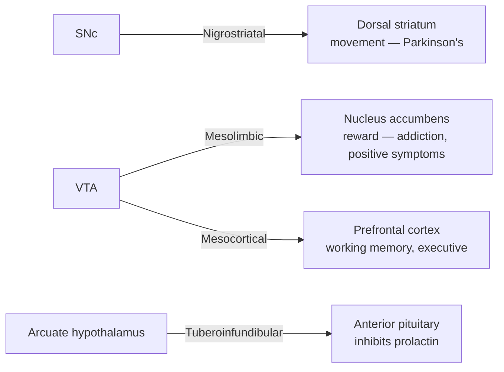
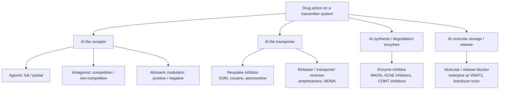

# Neurotransmitter Systems and Neuromodulation

A technical reference on the chemical signaling systems of the nervous system: how transmitters are made, where they originate, the receptors they act on, the functions they subserve, and what goes wrong when they are dysregulated.

## Introduction

Neurons communicate chiefly through chemical synapses. A presynaptic neuron releases a signaling molecule — a **neurotransmitter** — that diffuses across the synaptic cleft and binds receptors on a target cell, changing that cell's excitability or biochemical state. Some transmitters open ion channels directly and drive fast, point-to-point signaling on a millisecond timescale; others act through second-messenger cascades to tune the gain, timing, and plasticity of entire circuits over seconds to minutes. The latter mode, **neuromodulation**, is what allows the same anatomical network to behave differently depending on arousal, motivation, or expectation.

A molecule generally qualifies as a neurotransmitter when it is (1) synthesized in the neuron, (2) stored and released upon depolarization, (3) able to reproduce the postsynaptic effect when applied exogenously, and (4) removed by a specific inactivation mechanism (reuptake, enzymatic degradation, or diffusion). This document surveys the major systems that meet or approximate these criteria, organized by chemical class, and closes with how psychoactive drugs exploit each system.

## Table of Contents

- [1. Classification of Neurotransmitters](#1-classification-of-neurotransmitters)
- [2. Glutamate — The Principal Excitatory Transmitter](#2-glutamate--the-principal-excitatory-transmitter)
- [3. GABA and Glycine — The Principal Inhibitory Transmitters](#3-gaba-and-glycine--the-principal-inhibitory-transmitters)
- [4. Dopamine](#4-dopamine)
- [5. Serotonin (5-HT)](#5-serotonin-5-ht)
- [6. Norepinephrine (Noradrenaline)](#6-norepinephrine-noradrenaline)
- [7. Acetylcholine](#7-acetylcholine)
- [8. Histamine](#8-histamine)
- [9. Neuropeptides](#9-neuropeptides)
- [10. Nitric Oxide and Unconventional Transmitters](#10-nitric-oxide-and-unconventional-transmitters)
- [11. Neuromodulation, Fast Transmission, and Volume Transmission](#11-neuromodulation-fast-transmission-and-volume-transmission)
- [12. How Psychoactive Drugs Act on These Systems](#12-how-psychoactive-drugs-act-on-these-systems)
- [13. Summary Comparison Table](#13-summary-comparison-table)
- [Sources](#sources)

---

## 1. Classification of Neurotransmitters

Neurotransmitters are conventionally grouped by molecular size and chemistry.

### Small-molecule transmitters

These are low-molecular-weight compounds synthesized in the cytoplasm or nerve terminal, packaged into small clear-core vesicles, and released rapidly. They subdivide into:

- **Amino acids** — glutamate (excitatory), GABA and glycine (inhibitory). These are the workhorses of fast synaptic transmission and account for the large majority of synapses in the brain.
- **Monoamines (biogenic amines)** — the catecholamines dopamine, norepinephrine, and epinephrine (derived from tyrosine); the indolamine serotonin (derived from tryptophan); and histamine (derived from histidine). Monoamines are made by comparatively small numbers of neurons whose axons ramify widely, making them archetypal modulators.
- **Acetylcholine** — a quaternary amine ester in a class of its own, acting at both fast (nicotinic) and slow (muscarinic) receptors.

### Neuropeptides

Short chains of amino acids (typically 3–40 residues) synthesized as large precursor proteins in the cell body, cleaved and processed in the Golgi and secretory vesicles, and released from large dense-core vesicles usually at higher firing frequencies. Examples include the endogenous opioids (endorphins, enkephalins, dynorphins), substance P, oxytocin, vasopressin, cholecystokinin, neuropeptide Y, and orexin/hypocretin. Peptides almost always act on G-protein-coupled receptors and are frequently **co-released** with a small-molecule transmitter from the same neuron.

### Gasotransmitters and unconventional signals

Membrane-permeant gases — **nitric oxide (NO)**, carbon monoxide (CO), and hydrogen sulfide (H₂S) — are synthesized on demand, are not stored in vesicles, and diffuse directly through membranes rather than acting at a classical postsynaptic receptor. Endocannabinoids (anandamide, 2-AG) are lipid signals that likewise are made on demand and act retrogradely. These break several of the classical criteria and are treated as a distinct category.

### Dale's principle and co-transmission

A neuron is often named for its "primary" transmitter (a glutamatergic or dopaminergic neuron), but co-transmission is the rule rather than the exception: a single terminal may release a fast amino-acid transmitter together with a monoamine and/or one or more peptides, each with its own receptors and time course.

---

## 2. Glutamate — The Principal Excitatory Transmitter

Glutamate mediates the great majority of fast excitatory transmission in the vertebrate CNS and is central to synaptic plasticity, learning, and memory.

### Synthesis and cycling

Glutamate does not cross the blood–brain barrier, so it is synthesized locally. The dominant route is the **glutamate–glutamine cycle**: after release, glutamate is taken up largely by astrocytes via excitatory amino acid transporters (EAATs), converted to glutamine by glutamine synthetase, shuttled back to neurons, and reconverted to glutamate by phosphate-activated glutaminase. Glutamate is also produced from the TCA-cycle intermediate α-ketoglutarate. Vesicular glutamate transporters (VGLUT1–3) load it into synaptic vesicles.

### Receptor subtypes

**Ionotropic (ligand-gated cation channels), named for selective agonists:**

- **AMPA receptors** (GluA1–4) — mediate the bulk of fast excitatory postsynaptic currents. Permeable to Na⁺ and K⁺; those lacking an edited GluA2 subunit are also Ca²⁺-permeable. Rapid trafficking of AMPA receptors into and out of the synapse is a core mechanism of long-term potentiation (LTP) and depression (LTD).
- **NMDA receptors** (GluN1 with GluN2A–D / GluN3) — high Ca²⁺ permeability and a voltage-dependent Mg²⁺ block relieved only on depolarization. This makes them **coincidence detectors**: they open when the presynaptic neuron releases glutamate *and* the postsynaptic cell is already depolarized, and they require the co-agonist glycine or D-serine. The resulting Ca²⁺ influx is the principal trigger for LTP.
- **Kainate receptors** (GluK1–5) — modulate transmitter release presynaptically and contribute to postsynaptic excitation; slower kinetics than AMPA.

**Metabotropic (mGluR, G-protein-coupled), eight subtypes in three groups:**

- **Group I** (mGluR1, mGluR5) — mostly postsynaptic, coupled to Gq/phospholipase C; generally enhance excitability.
- **Group II** (mGluR2, mGluR3) and **Group III** (mGluR4, 6, 7, 8) — largely presynaptic autoreceptors coupled to Gi/o; they suppress adenylyl cyclase and dampen further glutamate release, providing negative feedback and neuroprotection.

### Functional roles

Fast excitation throughout cortex, hippocampus, and beyond; induction and expression of synaptic plasticity underlying learning and memory; developmental synapse formation and pruning.

### Dysregulation: excitotoxicity

Excessive glutamatergic signaling causes **excitotoxicity**. Sustained receptor activation — classically via NMDA receptors, though AMPA/kainate Ca²⁺ entry alone can suffice — drives pathological intracellular Ca²⁺ overload, which activates proteases, lipases, and nitric oxide synthase, generates reactive oxygen species, damages mitochondria, and triggers cell death. Excitotoxicity contributes to neuronal loss in **ischemic stroke**, traumatic brain injury, and chronic neurodegeneration (ALS, Alzheimer's, Huntington's). Therapeutically, **memantine**, a low-affinity, uncompetitive NMDA-receptor open-channel blocker (it enters preferentially when the channel is excessively open and has a fast off-rate, sparing normal synaptic transmission), is used in moderate-to-severe Alzheimer's disease; **riluzole** (which reduces glutamate release/signaling) modestly extends survival in ALS; **perampanel**, an AMPA-receptor antagonist, is an antiseizure drug. Sub-anesthetic **ketamine**, an NMDA antagonist, produces rapid antidepressant effects, spotlighting glutamatergic mechanisms in mood disorders.

---

## 3. GABA and Glycine — The Principal Inhibitory Transmitters

### GABA (γ-aminobutyric acid)

**Synthesis.** GABA is made from glutamate by **glutamic acid decarboxylase (GAD65 and GAD67)**, a pyridoxal-phosphate (vitamin B6)–dependent enzyme — a direct metabolic link between the main excitatory and main inhibitory transmitters. It is loaded into vesicles by the vesicular inhibitory amino-acid transporter (VIAAT/VGAT) and cleared by GABA transporters (GAT1–3) into neurons and astrocytes, then degraded by GABA transaminase.

**Where it acts.** GABAergic interneurons are distributed throughout the CNS (cortex, hippocampus, cerebellar Purkinje cells, striatal projection neurons, thalamic reticular nucleus), providing local inhibitory control and shaping oscillations.

**Receptors.**
- **GABA-A** — ionotropic, a pentameric ligand-gated **Cl⁻ channel** (typically 2α/2β/1γ). GABA binding opens the pore; Cl⁻ influx hyperpolarizes the mature neuron, producing fast inhibitory postsynaptic potentials. GABA-A receptors host distinct allosteric sites for **benzodiazepines**, **barbiturates**, neurosteroids, general anesthetics, and ethanol. (In the immature brain, high intracellular Cl⁻ can make GABA transiently depolarizing.)
- **GABA-B** — metabotropic, Gi/o-coupled. Presynaptically it inhibits Ca²⁺ channels to reduce transmitter release; postsynaptically it opens GIRK K⁺ channels for slow, sustained inhibition. The agonist **baclofen** is used for spasticity.

**Dysregulation and drugs.** Reduced GABAergic inhibition tips networks toward hyperexcitability and **epilepsy**; anxiety and insomnia are treated by enhancing GABA-A signaling. **Benzodiazepines** (diazepam, lorazepam, alprazolam) are positive allosteric modulators that increase the *frequency* of channel opening — anxiolytic, sedative, anticonvulsant, muscle-relaxant. **Barbiturates** increase channel *open duration* and are more dangerous in overdose. **Z-drugs** (zolpidem) act at the benzodiazepine site; **flumazenil** is a competitive antagonist/antidote. Autoimmune anti-GAD conditions and inherited GABA-system mutations produce stiff-person syndrome and epilepsies.

### Glycine

The primary inhibitory transmitter of the **spinal cord and brainstem**. It is synthesized from serine by serine hydroxymethyltransferase and loaded by VIAAT. The **glycine receptor (GlyR)** is an ionotropic Cl⁻ channel structurally related to GABA-A, and it is selectively blocked by **strychnine** — blockade removes inhibition of motor neurons, causing convulsive muscle rigidity. **Tetanus toxin** likewise disables glycinergic (and GABAergic) inhibition. Separately, glycine (with D-serine) is an obligatory **co-agonist at the NMDA receptor**, so it is simultaneously inhibitory and a facilitator of excitation depending on context.

---

## 4. Dopamine

Dopamine (a catecholamine) is central to reward, motivation, motor control, and endocrine regulation.

### Synthesis

Tyrosine → **L-DOPA** by **tyrosine hydroxylase (TH)**, the rate-limiting step → **dopamine** by aromatic L-amino acid decarboxylase (DOPA decarboxylase). In noradrenergic neurons, dopamine is a further precursor to norepinephrine. Dopamine is vesicularly loaded by VMAT2, cleared by the **dopamine transporter (DAT)**, and degraded by monoamine oxidase (MAO) and catechol-O-methyltransferase (COMT).

### Cell groups and pathways

Dopaminergic somata lie mainly in the midbrain (substantia nigra pars compacta, SNc; ventral tegmental area, VTA) and hypothalamus. Four classic pathways:

- **Nigrostriatal** (SNc → dorsal striatum) — regulates voluntary movement; degenerates in Parkinson's disease.
- **Mesolimbic** (VTA → nucleus accumbens, amygdala, hippocampus) — reward, reinforcement, incentive salience; a common substrate of addiction.
- **Mesocortical** (VTA → prefrontal cortex) — working memory, executive function, motivation.
- **Tuberoinfundibular** (arcuate/periventricular hypothalamus → median eminence) — dopamine tonically **inhibits prolactin** release from the anterior pituitary.

### Receptors

All five are GPCRs, in two families:
- **D1-like (D1, D5)** — Gs-coupled, stimulate adenylyl cyclase/cAMP; primarily postsynaptic.
- **D2-like (D2, D3, D4)** — Gi/o-coupled, inhibit cAMP; found both post- and presynaptically (D2 autoreceptors provide feedback inhibition).

### Functional roles

Phasic dopamine encodes a **reward-prediction error** — signaling outcomes that are better or worse than expected — the teaching signal that drives reinforcement learning. Tonic dopamine sets motivational vigor and motor readiness.

### Dysregulation

- **Parkinson's disease** — loss of SNc neurons depletes striatal dopamine, causing bradykinesia, rigidity, and resting tremor. Treated by restoring dopamine signaling: **L-DOPA** (plus a peripheral decarboxylase inhibitor, carbidopa), **dopamine agonists** (pramipexole, ropinirole), **MAO-B inhibitors** (selegiline), and **COMT inhibitors** (entacapone).
- **Schizophrenia** — the dopamine hypothesis links positive symptoms (hallucinations, delusions) to excess mesolimbic D2 signaling and some negative/cognitive symptoms to mesocortical hypofunction. **Antipsychotics** are D2 antagonists (or partial agonists such as aripiprazole).
- **Addiction** — nearly all addictive drugs converge on elevating mesolimbic dopamine; stimulants do so directly.
- **Hyperprolactinemia** — dopamine (D2) antagonists disinhibit prolactin, causing galactorrhea and menstrual disturbance; conversely dopamine agonists treat prolactinomas.
- **ADHD** — implicates dopamine (and norepinephrine) signaling; treated with stimulants that raise synaptic dopamine.

---

## 5. Serotonin (5-HT)

Serotonin (5-hydroxytryptamine) modulates mood, sleep, appetite, pain, gut motility, and more.

### Synthesis

Tryptophan → **5-hydroxytryptophan (5-HTP)** by **tryptophan hydroxylase (TPH)**, the rate-limiting step (TPH2 in the brain, TPH1 in the periphery) → **serotonin** by aromatic L-amino acid decarboxylase. It is vesicularly stored by VMAT2, cleared by the **serotonin transporter (SERT)**, and degraded by MAO to 5-HIAA. (Most of the body's serotonin is actually in the gut and platelets.)

### Where it is produced

Serotonergic neurons cluster in the **raphe nuclei** along the brainstem midline. The rostral group — especially the **dorsal and median raphe** — projects diffusely to essentially the entire forebrain; caudal raphe nuclei project to the spinal cord.

### Receptors

At least **14 subtypes** across seven families (5-HT1 through 5-HT7). All are GPCRs **except 5-HT3**, which is a ligand-gated cation channel (target of antiemetics like ondansetron). Notable examples: **5-HT1A** (Gi/o; somatodendritic autoreceptor and postsynaptic; target of the anxiolytic buspirone), **5-HT2A** (Gq; the principal site of action of classic psychedelics such as LSD and psilocybin, and blocked by atypical antipsychotics), and **5-HT2C**, **5-HT6**, and **5-HT7** in mood and cognition.

### Functional roles

Tonic modulation of mood and emotional resilience, sleep–wake regulation, satiety and appetite, thermoregulation, nociception, and gut motility.

### Dysregulation and drugs

Serotonergic signaling is heavily implicated in the *treatment* of **depression and anxiety**, but the classic "chemical imbalance" / low-serotonin theory of depression is not established and remains contested: a 2022 systematic umbrella review (Moncrieff et al.) found no consistent evidence that depression is caused by lowered serotonin concentration or activity, and the paper itself drew substantial methodological criticism. What is clear is that drugs raising synaptic serotonin can relieve symptoms in many patients — which does not imply a pre-existing serotonin deficit, any more than analgesic benefit implies an aspirin deficiency. **SSRIs** (fluoxetine, sertraline, escitalopram) block SERT, raising synaptic serotonin; their therapeutic lag of weeks is thought to reflect gradual desensitization of 5-HT1A autoreceptors and downstream adaptive plasticity (e.g., neurotrophic and synaptic changes) rather than the acute rise in serotonin per se. **SNRIs** (venlafaxine, duloxetine) block serotonin and norepinephrine reuptake. **MAO inhibitors** and **tricyclics** are older options. Combining serotonergic agents can precipitate **serotonin syndrome** (agitation, hyperthermia, clonus, autonomic instability). Triptans (5-HT1B/1D agonists) abort migraine.

---

## 6. Norepinephrine (Noradrenaline)

A catecholamine that drives arousal, vigilance, attention, and the central component of the stress ("fight-or-flight") response.

### Synthesis

Continues one step beyond dopamine: dopamine → **norepinephrine** by **dopamine β-hydroxylase** (inside vesicles). In the adrenal medulla, PNMT further converts NE to epinephrine. NE is cleared by the norepinephrine transporter (NET) and degraded by MAO and COMT.

### Where it is produced

The great majority of central noradrenergic neurons reside in the **locus coeruleus (LC)** in the dorsal pons, whose axons project throughout cortex, hippocampus, cerebellum, and spinal cord — a small nucleus with enormous reach. Additional lateral tegmental cell groups supply other targets. In the periphery, NE is the transmitter of postganglionic sympathetic neurons.

### Receptors

GPCR **adrenergic receptors**: **α1** (Gq, excitatory/smooth-muscle contraction), **α2** (Gi; includes presynaptic autoreceptors that inhibit NE release), and **β1/β2/β3** (Gs). Central and peripheral effects both depend on this repertoire.

### Functional roles

The LC-NE system sets global **arousal and wakefulness**, gates **attention** and signal-to-noise in sensory processing, supports the encoding of salient and emotionally arousing memories, and mobilizes the body under stress. LC firing tracks pupil-linked arousal and cortical state.

### Dysregulation and drugs

Noradrenergic dysfunction is implicated in **PTSD**, **anxiety**, **depression**, and **ADHD**. **Atomoxetine** (a selective NET inhibitor) treats ADHD; **α2 agonists** (clonidine, guanfacine) reduce sympathetic outflow and treat hypertension, ADHD, and anxiety; **β-blockers** (propranolol) blunt somatic anxiety and performance tremor. **Prazosin** (α1 antagonist) is used for PTSD nightmares. LC degeneration occurs early in Alzheimer's and Parkinson's disease.

---

## 7. Acetylcholine

The first neurotransmitter identified, acetylcholine (ACh) governs the neuromuscular junction, autonomic ganglia, and central circuits for attention and memory.

### Synthesis

ACh is made in the cytoplasm from **acetyl-CoA + choline** by **choline acetyltransferase (ChAT)** and loaded into vesicles by VAChT. Uniquely among the classical transmitters, ACh is inactivated not by reuptake of the intact molecule but by rapid hydrolysis in the cleft by **acetylcholinesterase (AChE)** into choline and acetate; choline is then recaptured by a high-affinity transporter for reuse.

### Where it acts

- **Neuromuscular junction** — motor neurons release ACh onto skeletal muscle.
- **Autonomic nervous system** — ACh is the transmitter at all preganglionic synapses and at parasympathetic postganglionic (and sympathetic sweat-gland) targets.
- **CNS** — two major sources: the **basal forebrain** cholinergic system (medial septum, diagonal band of Broca, and **nucleus basalis of Meynert**) projecting to hippocampus, cortex, and amygdala; and pontine/tegmental nuclei (pedunculopontine, laterodorsal tegmental) projecting to thalamus and brainstem. Striatal cholinergic interneurons act locally.

### Receptors

- **Nicotinic (nAChR)** — ionotropic, ligand-gated cation channels; fast excitation. Muscle-type at the NMJ; diverse neuronal subtypes (e.g., the α7 and α4β2 subtypes) in brain and ganglia. Activated by nicotine; blocked by curare (muscle) and hexamethonium (ganglia).
- **Muscarinic (mAChR, M1–M5)** — metabotropic GPCRs. M1/M3/M5 are Gq-coupled (excitatory); M2/M4 are Gi/o-coupled (e.g., M2 slows the heart). Activated by muscarine; blocked by atropine and scopolamine.

### Functional roles

Voluntary movement (NMJ); parasympathetic "rest-and-digest" control (heart rate, secretions, GI motility); and centrally, **attention, arousal, learning, and memory encoding**, plus cortical plasticity and REM-sleep regulation.

### Dysregulation and drugs

- **Alzheimer's disease** — early, severe degeneration of basal-forebrain cholinergic neurons and falling ChAT activity correlate with memory loss (the "cholinergic hypothesis"). **AChE inhibitors** (donepezil, rivastigmine, galantamine) raise synaptic ACh and give symptomatic benefit.
- **Myasthenia gravis** — autoantibodies against the muscle nAChR cause fatigable weakness; treated with AChE inhibitors (pyridostigmine) and immunotherapy.
- **Toxins/drugs** — **organophosphate** pesticides and nerve agents irreversibly inhibit AChE, causing a cholinergic crisis; **botulinum toxin** blocks ACh release (flaccid paralysis; therapeutic in dystonia and cosmetics); curare-like agents block the NMJ for surgical relaxation. Anticholinergic (antimuscarinic) drugs impair memory and can cause delirium in the elderly.

---

## 8. Histamine

Beyond its peripheral roles in allergy and gastric acid secretion, histamine is a central neuromodulator of wakefulness.

- **Synthesis** — from the amino acid histidine by histidine decarboxylase.
- **Where produced** — the only histaminergic neurons in the brain lie in the **tuberomammillary nucleus (TMN)** of the posterior hypothalamus, projecting diffusely across the CNS.
- **Receptors** — four GPCRs. **H1** (Gq) promotes wakefulness; **H2** (Gs) drives gastric acid secretion; **H3** is a presynaptic auto/heteroreceptor (Gi) that restrains histamine and other transmitter release; **H4** is mainly immune.
- **Function** — the TMN fires tonically during waking and falls silent in sleep, helping **maintain arousal**; histamine also modulates appetite, learning, and neuroendocrine output.
- **Drugs/dysregulation** — sedating first-generation **H1 antihistamines** (diphenhydramine) cross the blood–brain barrier and cause drowsiness, whereas second-generation agents (loratadine, cetirizine) do not; **H2 blockers** (famotidine) reduce stomach acid. Loss of orexin input to the histamine/arousal system relates to **narcolepsy**, and H3 antagonists (pitolisant) promote wakefulness.

---

## 9. Neuropeptides

Neuropeptides are the largest and most diverse transmitter class. They are cleaved from precursor proteins, released from dense-core vesicles (often at higher firing rates and at sites distant from the classic active zone), act almost entirely through GPCRs at high potency, and are inactivated by extracellular peptidases (no reuptake). They typically modulate rather than trigger fast transmission and are frequently co-released with small-molecule transmitters.

- **Endogenous opioids — endorphins, enkephalins, dynorphins.** Cleaved from precursors (POMC → β-endorphin; proenkephalin → enkephalins; prodynorphin → dynorphins) and acting at **μ, δ, and κ opioid receptors** (Gi/o). They mediate analgesia, reward, and mood, and dampen pain transmission. Exogenous opioids (morphine, fentanyl) are μ-agonists — potent analgesics with high addiction and respiratory-depression risk; **naloxone** is the antagonist/overdose reversal agent.
- **Substance P.** A tachykinin acting at the **NK1 receptor**; a key transmitter of **pain (nociceptive)** signaling from primary afferents and a mediator of neurogenic inflammation and vomiting (NK1 antagonists like aprepitant are antiemetics).
- **Oxytocin and vasopressin.** Nine-amino-acid peptides made in the hypothalamic supraoptic and paraventricular nuclei and released from the posterior pituitary. **Oxytocin** drives uterine contraction and milk let-down and modulates social bonding, trust, and maternal behavior; **vasopressin** controls water retention and blood pressure and influences social/aggressive behavior.
- **Others.** **Cholecystokinin (CCK)** (satiety, anxiety), **neuropeptide Y** (potent appetite stimulation, stress buffering), **orexin/hypocretin** (arousal and sleep–wake stability; its loss causes narcolepsy), and hypothalamic-releasing hormones (CRH, TRH, somatostatin) that also act as central modulators.

---

## 10. Nitric Oxide and Unconventional Transmitters

**Nitric oxide (NO)** is the prototypical gasotransmitter and breaks nearly every classical rule. It is synthesized on demand from L-arginine by **nitric oxide synthase (NOS)** — neuronal nNOS is often physically coupled to the NMDA receptor, so Ca²⁺ entry through the receptor triggers NO production. NO is **not stored in vesicles**; being a small, membrane-permeant gas, it diffuses freely in all directions and acts by binding the heme of **soluble guanylyl cyclase**, raising cGMP in target cells. In the CNS its best-characterized role is as a **retrograde messenger** in synaptic plasticity: generated postsynaptically during LTP, it diffuses back to the presynaptic terminal to enhance transmitter release. NO is also the endothelium-derived relaxing factor that dilates blood vessels (the basis of nitroglycerin's action and of PDE5 inhibitors like sildenafil). In excess — as during excitotoxicity — NO contributes to oxidative/nitrosative neuronal damage.

Other unconventional signals: **carbon monoxide (CO)** and **hydrogen sulfide (H₂S)** act analogously as gasotransmitters. **Endocannabinoids** (anandamide, 2-arachidonoylglycerol) are lipids synthesized on demand postsynaptically that travel retrogradely to activate presynaptic **CB1 receptors** (Gi/o), suppressing transmitter release — the mechanism behind THC's effects and depolarization-induced suppression of inhibition/excitation. **ATP and adenosine** (purinergic signaling) act at ionotropic P2X and metabotropic P2Y/adenosine receptors; caffeine works by antagonizing adenosine receptors.

---

## 11. Neuromodulation, Fast Transmission, and Volume Transmission

Two broad signaling modes coexist in the brain.

**Fast (wiring) transmission** is point-to-point: an amino-acid transmitter (glutamate, GABA, glycine) is released at a morphologically specialized synapse and acts on ionotropic receptors directly across the cleft, opening ion channels within a millisecond and being cleared within milliseconds. This carries the moment-to-moment content of neural computation.

**Neuromodulation** instead adjusts *how* neurons respond. A modulator — a monoamine, acetylcholine (via muscarinic receptors), a peptide, or a gas — usually acts on GPCRs, altering second messengers, channel properties, gene expression, and synaptic strength over seconds to hours. Rather than carrying a discrete message, it sets the gain, excitability, and plasticity of whole circuits according to behavioral state (arousal, attention, motivation, reward).

**Volume transmission** is the spatial signature of much neuromodulation. Instead of a tight one-to-one synaptic contact, the transmitter is released and diffuses through the extracellular space to reach many receptors on multiple cells at varying distances — sometimes from **varicosities** ("beads" along an axon) that lack classical postsynaptic partners. Monoamine and peptide systems, and gasotransmitters like NO, rely heavily on this diffuse mode. This is how a few thousand locus-coeruleus or raphe neurons can bias the state of the entire forebrain: a small number of cells broadcasting a slow, spatially broad chemical signal that reconfigures large networks.

---

## 12. How Psychoactive Drugs Act on These Systems

Psychoactive and therapeutic drugs work by intervening at defined steps of the neurotransmitter life cycle. The main pharmacological categories:

- **Agonists** — bind and activate a receptor, mimicking the transmitter. *Full agonists* (morphine at μ-opioid; nicotine at nAChR) produce a maximal response; *partial agonists* (buprenorphine at μ-opioid; aripiprazole at D2; varenicline at α4β2 nAChR) give a submaximal, ceilinged effect and can buffer both deficiency and excess.
- **Antagonists** — bind without activating, blocking the transmitter. *Competitive* antagonists (naloxone at μ-opioid; most antipsychotics at D2; atropine at muscarinic; flumazenil at the benzodiazepine site) compete at the orthosteric site; *irreversible/non-competitive* blockers act elsewhere or bind covalently.
- **Reuptake inhibitors** — block a transporter so the released transmitter persists longer in the cleft. **SSRIs** (SERT), **SNRIs** (SERT + NET), **atomoxetine** (NET), **bupropion** (NET + DAT), **cocaine** (DAT/NET/SERT).
- **Releasing agents / transporter reversers** — **amphetamine and methamphetamine** enter terminals, disrupt vesicular storage via VMAT2, and reverse DAT/NET to dump dopamine and norepinephrine into the cleft; **MDMA** does the same predominantly for serotonin.
- **Enzyme inhibitors** — block synthesis or degradation. **MAO inhibitors** raise monoamines; **AChE inhibitors** raise ACh (donepezil for Alzheimer's; nerve agents as poisons); **COMT inhibitors** prolong L-DOPA action; **carbidopa** blocks peripheral DOPA decarboxylase.
- **Allosteric modulators** — bind a site distinct from the transmitter and tune the response. **Benzodiazepines and barbiturates** are positive allosteric modulators of GABA-A; **memantine** is an NMDA open-channel blocker; ethanol has complex allosteric actions at GABA-A and NMDA.
- **Presynaptic and vesicular targets** — **botulinum toxin** blocks ACh vesicle fusion; **reserpine** blocks VMAT2, depleting monoamines; **α2 agonists** (clonidine) activate autoreceptors to *reduce* NE release.

Representative mappings: caffeine → adenosine-receptor antagonist; nicotine → nAChR agonist; THC → CB1 agonist; LSD/psilocybin → 5-HT2A agonist; ketamine → NMDA antagonist; opioids → μ-opioid agonists; classic antipsychotics → D2 antagonists; SSRIs → SERT inhibitors; L-DOPA → dopamine precursor.

---

## 13. Summary Comparison Table

| Transmitter | Class | Made from / key enzyme | Main source nuclei / cells | Receptor types | Primary functions | Example disorders / drugs |
|---|---|---|---|---|---|---|
| **Glutamate** | Amino acid | Glutamine/α-KG; glutaminase | Ubiquitous excitatory neurons | AMPA, NMDA, kainate (iono); mGluR1–8 (GPCR) | Fast excitation; LTP, learning & memory | Excitotoxicity in stroke/ALS; memantine, ketamine, perampanel |
| **GABA** | Amino acid | Glutamate; GAD (B6) | Interneurons brain-wide; striatum, cerebellum | GABA-A (Cl⁻ channel); GABA-B (GPCR) | Fast inhibition; controls excitability, oscillations | Epilepsy, anxiety; benzodiazepines, barbiturates, baclofen |
| **Glycine** | Amino acid | Serine; SHMT | Spinal cord, brainstem | GlyR (Cl⁻ channel); NMDA co-agonist | Inhibition in cord/brainstem; motor control | Strychnine/tetanus toxicity |
| **Dopamine** | Monoamine (catecholamine) | Tyrosine; TH → DDC | SNc, VTA, hypothalamus | D1-like (D1,5 Gs); D2-like (D2,3,4 Gi) | Reward, motivation, movement, prolactin control | Parkinson's, schizophrenia, addiction; L-DOPA, antipsychotics |
| **Serotonin (5-HT)** | Monoamine (indolamine) | Tryptophan; TPH → DDC | Raphe nuclei (dorsal/median) | 5-HT1–7 (5-HT3 is a channel) | Mood, sleep, appetite, pain, gut | Depression, anxiety; SSRIs, SNRIs, triptans |
| **Norepinephrine** | Monoamine (catecholamine) | Dopamine; DβH | Locus coeruleus; sympathetic neurons | α1, α2, β1–3 (GPCR) | Arousal, attention, stress response | PTSD, ADHD; atomoxetine, clonidine, β-blockers |
| **Acetylcholine** | Amine ester | Acetyl-CoA + choline; ChAT | NMJ, autonomics, basal forebrain, pons | Nicotinic (channel); muscarinic M1–5 (GPCR) | Movement, autonomic control, attention & memory | Alzheimer's, myasthenia gravis; donepezil, atropine, nerve agents |
| **Histamine** | Monoamine | Histidine; HDC | Tuberomammillary nucleus | H1–H4 (GPCR) | Wakefulness/arousal, appetite, gastric acid | Sedation from H1 blockers; H2 blockers; narcolepsy link |
| **Opioid peptides** | Neuropeptide | Precursor cleavage (POMC etc.) | Distributed CNS | μ, δ, κ opioid (GPCR) | Analgesia, reward, mood | Pain, opioid addiction; morphine, naloxone |
| **Nitric oxide** | Gasotransmitter | L-arginine; NOS | Made on demand, diffuse | Soluble guanylyl cyclase (no membrane receptor) | Retrograde plasticity signal; vasodilation | Excitotoxic damage; nitroglycerin, sildenafil |

---

## Sources

- [Molecular mechanisms of excitotoxicity and their relevance to neurodegenerative diseases (Acta Pharmacologica Sinica, 2025)](https://www.nature.com/articles/s41401-025-01576-w)
- [Positive AMPA and Kainate Receptor Modulators and Their Therapeutic Potential in CNS Diseases (PMC)](https://www.ncbi.nlm.nih.gov/pmc/articles/PMC12250081/)
- [Group III metabotropic glutamate receptors: guardians against excitotoxicity (PMC)](https://www.ncbi.nlm.nih.gov/pmc/articles/PMC11582219/)
- [Benzodiazepine Modulation of GABA-A Receptors (MDPI, Biomolecules)](https://www.mdpi.com/2218-273X/12/12/1784)
- [Inhibitory neurotransmitters: GABA and Glycine (Kenhub)](https://www.kenhub.com/en/library/physiology/inhibitory-neurotransmitters)
- [Dopaminergic pathways (Wikipedia)](https://en.wikipedia.org/wiki/Dopaminergic_pathways)
- [Dopamine Receptors in the Human Brain (Psychiatric Times)](https://www.psychiatrictimes.com/view/dopamine-receptors-human-brain)
- [Mesolimbic Pathway overview (ScienceDirect Topics)](https://www.sciencedirect.com/topics/veterinary-science-and-veterinary-medicine/mesolimbic-pathway)
- [The 5-Hydroxytryptamine signaling map (PMC)](https://pmc.ncbi.nlm.nih.gov/articles/PMC6235773/)
- [The serotonin theory of depression: a systematic umbrella review of the evidence (Moncrieff et al., Molecular Psychiatry, 2022)](https://www.nature.com/articles/s41380-022-01661-0)
- [Memantine mechanism: uncompetitive NMDA open-channel block (Memantine, StatPearls, NCBI Bookshelf)](https://www.ncbi.nlm.nih.gov/books/NBK500025/)
- [5-Hydroxytryptamine Receptor Subtypes and their Modulators (PMC)](https://pmc.ncbi.nlm.nih.gov/articles/PMC3318857/)
- [Neuroanatomy, Nucleus Raphe (StatPearls, NCBI Bookshelf)](https://www.ncbi.nlm.nih.gov/books/NBK544359/)
- [The Locus Coeruleus–Norepinephrine System in Stress and Arousal (Frontiers in Psychiatry)](https://www.frontiersin.org/journals/psychiatry/articles/10.3389/fpsyt.2020.601519/full)
- [Alzheimer's Disease: Targeting the Cholinergic System (PMC)](https://pmc.ncbi.nlm.nih.gov/articles/PMC4787279/)
- [Ch. 11: Acetylcholine Neurotransmission (UTHealth Neuroscience Online)](https://med.uth.edu/nba/nso/s1_cellular-molecular/ch-11-acetylcholine-neurotransmission/)
- [Neuronal and Glial α7 Nicotinic Acetylcholine Receptors in Alzheimer's Disease (PMC)](https://www.ncbi.nlm.nih.gov/pmc/articles/PMC12298375/)
- [Reassessing the Role of Histaminergic Tuberomammillary Neurons in Arousal Control (PMC / J Neurosci)](https://pmc.ncbi.nlm.nih.gov/articles/PMC6832676/)
- [Tuberomammillary nucleus (Wikipedia)](https://en.wikipedia.org/wiki/Tuberomammillary_nucleus)
- [Nitric oxide as a retrograde messenger during long-term potentiation in hippocampus (PubMed)](https://pubmed.ncbi.nlm.nih.gov/9932440/)
- [Retrograde signaling (Wikipedia)](https://en.wikipedia.org/wiki/Retrograde_signaling)
