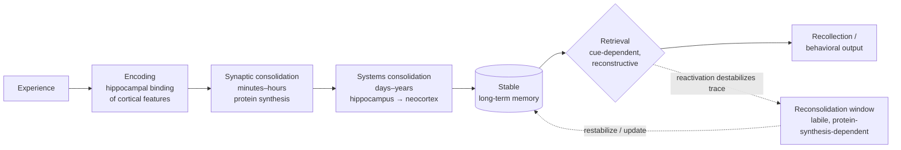

# Learning and Memory

*A technical reference on how the nervous system acquires, stores, and retrieves information — from cognitive architecture to molecules.*

---

## Introduction

Memory is not a single faculty but a family of distinct systems, each with its own cognitive signature, anatomical substrate, and time course. Learning is the process by which experience modifies the nervous system; memory is the retention and reconstruction of those modifications over time. The modern understanding of memory rests on a remarkable convergence of evidence: neuropsychological studies of brain-damaged patients (most famously H.M.), lesion and recording work in animals, human neuroimaging, and cellular/molecular studies of synaptic plasticity. Together these lines of work show that the brain does not store memory in one place or by one mechanism. Instead, different kinds of learning recruit different circuits — the hippocampus and medial temporal lobe for conscious facts and events, the striatum and cerebellum for skills and conditioned reflexes, the amygdala for emotional associations — while a common cellular currency, activity-dependent synaptic plasticity, underlies storage across all of them.

This document surveys the field at three levels of analysis that must be kept distinct but related: the **cognitive/systems level** (memory taxonomy, the multi-store and working-memory models, the three-stage encoding–storage–retrieval framework), the **neural-systems level** (which brain structures do what, and how memories migrate between them during consolidation), and the **cellular/molecular level** (long-term potentiation and depression, receptor trafficking, gene transcription, and the engram). It closes with forgetting, conditioning, emotional memory, and memory disorders.

---

## Table of Contents

1. [The Taxonomy of Memory](#1-the-taxonomy-of-memory)
2. [Sensory, Short-Term, and Working Memory](#2-sensory-short-term-and-working-memory)
3. [Declarative vs. Non-Declarative Memory](#3-declarative-vs-non-declarative-memory)
4. [The Three-Stage Model: Encoding, Storage, Retrieval](#4-the-three-stage-model-encoding-storage-retrieval)
5. [Working Memory and the Prefrontal Cortex](#5-working-memory-and-the-prefrontal-cortex)
6. [The Hippocampus, the Medial Temporal Lobe, and Patient H.M.](#6-the-hippocampus-the-medial-temporal-lobe-and-patient-hm)
7. [Systems Consolidation and the Role of Sleep](#7-systems-consolidation-and-the-role-of-sleep)
8. [The Synaptic and Cellular Basis of Memory: LTP and LTD](#8-the-synaptic-and-cellular-basis-of-memory-ltp-and-ltd)
9. [The Engram: From Concept to Cell](#9-the-engram-from-concept-to-cell)
10. [Memory Reconsolidation](#10-memory-reconsolidation)
11. [Forgetting](#11-forgetting)
12. [Classical and Operant Conditioning](#12-classical-and-operant-conditioning)
13. [Emotional Memory and the Amygdala](#13-emotional-memory-and-the-amygdala)
14. [Memory Disorders](#14-memory-disorders)
15. [Sources](#sources)

---

## 1. The Taxonomy of Memory

The dominant organizing framework, developed largely by **Larry Squire** and colleagues, divides long-term memory into two great branches:

- **Declarative (explicit) memory** — memory for facts and events that can be consciously recollected and "declared." It is flexible, accessible to awareness, and depends on the **hippocampus and medial temporal lobe (MTL)**.
- **Non-declarative (implicit) memory** — a collection of dissociable abilities in which experience changes behavior or performance without conscious access to a "memory" per se. It depends on the **striatum, cerebellum, amygdala, and neocortex**, largely bypassing the MTL.

A second influential distinction, emphasized by **Endel Tulving**, splits declarative memory into **episodic** (personally experienced events, tied to a specific time and place — "mental time travel") and **semantic** (general world knowledge, decontextualized facts). Tulving's and Squire's schemes are complementary rather than contradictory: Tulving focuses on the phenomenology of conscious recollection, Squire on the biological memory systems and their neural dissociations.

Orthogonal to *what kind* of memory is the *time course* of storage: **sensory memory** (milliseconds to ~1 second), **short-term/working memory** (seconds to ~1 minute), and **long-term memory** (minutes to a lifetime). These are not merely durations but functionally and anatomically distinct stores, as the multi-store ("modal") model of Atkinson and Shiffrin (1968) first formalized.

```
                          MEMORY
                            |
        ------------------------------------------
        |                                        |
  SHORT-TERM / WORKING                       LONG-TERM
  (seconds–minute, PFC)                          |
                          -------------------------------------------
                          |                                         |
                   DECLARATIVE (explicit)               NON-DECLARATIVE (implicit)
                   conscious; MTL/hippocampus            unconscious; distributed
                          |                                         |
               ------------------              ------------------------------------------
               |                |              |          |            |                |
           EPISODIC         SEMANTIC      PROCEDURAL   PRIMING   CLASSICAL         NON-ASSOCIATIVE
           (events)         (facts)      (skills;      (percept./  CONDITIONING    (habituation,
                                          striatum,    concept.;   (amygdala,       sensitization;
                                          cerebellum)  neocortex)  cerebellum)      reflex pathways)
```

---

## 2. Sensory, Short-Term, and Working Memory

### 2.1 Sensory Memory

Sensory memory is a very brief, high-capacity, modality-specific buffer that holds an essentially veridical trace of a stimulus for a fraction of a second, allowing the perceptual system to sample it. Its two best-characterized forms are:

- **Iconic memory** (visual), lasting ~250–500 ms. **George Sperling's** classic partial-report experiments (1960) demonstrated that observers briefly retain far more visual information than they can report before the trace fades.
- **Echoic memory** (auditory), lasting several seconds, which is longer because sound is inherently extended in time.

Sensory memory is pre-attentive; only information that is attended to is passed forward into short-term/working memory.

### 2.2 Short-Term Memory and Working Memory

**Short-term memory (STM)** holds a small amount of information in an active, readily accessible state for seconds. Its capacity is famously limited — George Miller's "magical number seven, plus or minus two" (1956), later revised downward to about **four chunks** by Nelson Cowan. Capacity is expanded by *chunking* (grouping items into meaningful units).

**Working memory (WM)** is a broader construct: not merely a passive store but a system for *holding and manipulating* information in the service of ongoing cognition (reasoning, comprehension, planning). The most influential account is **Baddeley and Hitch's multi-component model** (1974, extended 2000):

| Component | Function |
|---|---|
| **Central executive** | Attentional control system; allocates resources, directs attention, coordinates the subsystems, inhibits distraction, and switches between tasks. Has no storage of its own. |
| **Phonological loop** | Stores and rehearses verbal/acoustic information. Comprises a *phonological store* (holds sound-based traces that decay in ~2 s) and an *articulatory control process* (subvocal rehearsal that refreshes the store). |
| **Visuospatial sketchpad** | Holds and manipulates visual and spatial information (the "inner eye"). |
| **Episodic buffer** (added 2000) | A limited-capacity, multi-modal store that binds information from the loop, sketchpad, and long-term memory into integrated, coherent episodes/chunks. |

Baddeley's model explains classic behavioral phenomena — the *word-length effect* (fewer long words than short words can be held, because rehearsal is slower), the *phonological similarity effect*, and *articulatory suppression* (repeating an irrelevant word blocks rehearsal and impairs verbal span). Working memory correlates strongly with fluid intelligence and is a rate-limiting resource for complex cognition.

---

## 3. Declarative vs. Non-Declarative Memory

### 3.1 Declarative (Explicit) Memory

- **Episodic memory**: memory for specific autobiographical events situated in time and place ("what I ate for breakfast," "my graduation"). It supports *autonoetic* consciousness — the subjective sense of re-experiencing the past — and, by the same reconstructive machinery, the ability to *imagine* the future.
- **Semantic memory**: general, context-free knowledge — that Paris is the capital of France, that dogs are animals, the meaning of words. Semantic memory is often distilled from many episodes and becomes independent of the circumstances in which it was learned.

Both depend critically on the hippocampus for *initial encoding*; over time semantic memory in particular becomes largely neocortical (see §7).

### 3.2 Non-Declarative (Implicit) Memory

Non-declarative memory is a heterogeneous category unified only by the absence of conscious recollection:

- **Procedural memory** — skills and habits (riding a bicycle, touch typing, playing an instrument). Depends on the **basal ganglia/striatum** and, for finely timed motor skills, the **cerebellum**. Procedural memory is acquired gradually, expressed through performance, and notoriously hard to verbalize.
- **Priming** — a change in the ability to identify or process a stimulus as a result of prior exposure (seeing "doctor" speeds later recognition of "nurse"; perceptual priming makes a degraded image easier to identify). Depends largely on **neocortical** sensory and association areas.
- **Classical (Pavlovian) conditioning** — learned associations between stimuli. Simple delay eyeblink conditioning depends on the **cerebellum**; conditioned emotional (fear) responses depend on the **amygdala** (see §12–13).
- **Non-associative learning** — the simplest forms:
  - *Habituation*: a decrease in response to a repeated, inconsequential stimulus.
  - *Sensitization*: an enhanced response to a range of stimuli following a strong or noxious one.
  These were dissected at the synaptic level in the sea slug *Aplysia* by **Eric Kandel**, who showed that habituation reflects reduced transmitter release at sensory-motor synapses and sensitization reflects presynaptic facilitation — providing the first clear demonstration that learning changes synaptic strength.

| Feature | Declarative | Non-declarative |
|---|---|---|
| Conscious access | Yes ("knowing that") | No ("knowing how") |
| Acquisition | Often rapid, one-trial | Usually gradual, incremental |
| Flexibility | Flexible, relational | Rigid, tied to context/response |
| Key structures | Hippocampus, MTL, neocortex | Striatum, cerebellum, amygdala, neocortex |
| Expression | Verbal report / recognition | Change in performance/behavior |
| Preserved in H.M.? | No (severely impaired) | Yes (largely intact) |

---

## 4. The Three-Stage Model: Encoding, Storage, Retrieval

Any memory passes through three logically distinct stages, and a failure at any one produces "forgetting":

1. **Encoding** — transforming perceptual input into a memory representation. Encoding is not passive recording; *depth of processing* matters (Craik and Lockhart, 1972): semantic, elaborative encoding produces far more durable memories than shallow, surface processing. Attention at encoding is essential — divided attention severely degrades later memory. At the neural level, encoding recruits the hippocampus to bind together the distributed cortical features of an experience.

2. **Storage / Consolidation** — stabilizing the labile new trace over time. Two consolidation processes are distinguished:
   - **Synaptic (cellular) consolidation**: occurs within minutes to hours after learning, requires gene transcription and protein synthesis, and converts an early, transient change into a lasting one at the synapse (see §8).
   - **Systems consolidation**: occurs over days to years, during which memory becomes progressively less dependent on the hippocampus and more dependent on distributed neocortical networks (see §7).

3. **Retrieval** — accessing and reconstructing stored information. Retrieval is *cue-dependent* and *reconstructive*, not a faithful playback — it actively rebuilds the memory from partial traces, which makes it prone to distortion and to the influence of current context (encoding-specificity principle; context- and state-dependent memory). Critically, retrieval itself is not neutral: it can strengthen a memory (the *testing effect*) and can also render it temporarily unstable (see §10, reconsolidation).



---

## 5. Working Memory and the Prefrontal Cortex

The neural seat of working memory is the **dorsolateral prefrontal cortex (dlPFC)**, working in concert with parietal cortex and the sensory regions that hold domain-specific content. The foundational evidence came from single-neuron recordings in monkeys performing delayed-response tasks by **Patricia Goldman-Rakic**, Joaquín Fuster, and others in the 1970s–1990s.

The signature finding is **persistent (delay-period) neural activity**: certain prefrontal neurons continue to fire during the delay between a cue's disappearance and the required response, even though no stimulus is present. Goldman-Rakic showed these **delay cells** are *spatially tuned* — a neuron fires persistently for a remembered target in its "preferred" direction but not for others — providing a literal neural representation of information held "in mind." This bridges the temporal gap between a past sensory event and a future action.

Mechanistically, this reverberatory activity is thought to be sustained by recurrent excitatory connections among layer II/III pyramidal neurons, with **NMDA receptors** playing a special role: their relatively slow kinetics keep the postsynaptic neuron depolarized long enough to maintain firing across the delay. Prefrontal WM is exquisitely sensitive to **dopamine (D1)** modulation, following an inverted-U dose–response curve — too little or too much dopamine degrades the sharpness of delay-cell tuning. This dopaminergic tuning is relevant to schizophrenia and ADHD, in which WM is impaired. (More recent work debates whether persistent firing is the whole story, proposing complementary "activity-silent" mechanisms based on short-term synaptic changes, but persistent activity remains the canonical model.)

---

## 6. The Hippocampus, the Medial Temporal Lobe, and Patient H.M.

### 6.1 The Case of H.M.

The single most influential case in memory neuroscience is **Henry Molaison (H.M.)**. In **1953**, to relieve intractable epilepsy, neurosurgeon **William Beecher Scoville** performed a **bilateral medial temporal lobe resection**, removing large portions of the hippocampus, amygdala, and surrounding entorhinal and perirhinal cortex on both sides. The seizures improved — but H.M. was left with a devastating and remarkably *selective* memory deficit, documented in the landmark **Scoville and Milner (1957)** paper with neuropsychologist **Brenda Milner**.

H.M.'s profile revealed the fundamental logic of memory systems:

- **Severe anterograde amnesia**: he could not form new *declarative* long-term memories. He would meet someone, and after a brief distraction, have no memory of the encounter. He lived, in effect, in a perpetual present.
- **Temporally graded retrograde amnesia**: he lost memories from the years just before surgery but retained older childhood memories — evidence that consolidated remote memories no longer depend on the hippocampus.
- **Intact working memory and intelligence**: he could hold a phone number in mind by rehearsal and had normal IQ, showing STM/WM is independent of the hippocampus.
- **Intact non-declarative memory**: Milner's *mirror-drawing* task showed H.M. improved day by day at a motor skill — displaying preserved procedural learning — even while insisting each time that he had never done the task before. This dissociation proved that skill learning and conscious memory are separate systems.

H.M. participated in research for over five decades (studied extensively by Suzanne Corkin) and, after his death in 2008, his brain was sectioned and digitized. His case established the hippocampus and MTL as necessary for **converting new experiences into lasting declarative memories** — but not as the permanent storehouse.

### 6.2 The Medial Temporal Lobe Memory System

The MTL comprises the **hippocampus** (with its subfields CA1, CA3, dentate gyrus) and the adjacent **entorhinal, perirhinal, and parahippocampal cortices**, which are the hippocampus's major gateway to and from the neocortex. Functions attributed to this system include:

- **Relational/associative binding** — linking the disparate elements of an event (who, what, where, when) into a unified representation.
- **Spatial mapping** — the discovery of **place cells** (O'Keefe, 1971) and, in entorhinal cortex, **grid cells** (the Mosers, 2005) — awarded the 2014 Nobel Prize — revealed a "cognitive map" that supports both navigation and episodic memory. Pattern separation (dentate gyrus) and pattern completion (CA3) allow the hippocampus to store similar experiences as distinct traces yet recall a whole from a partial cue.

---

## 7. Systems Consolidation and the Role of Sleep

**Systems consolidation** is the slow, weeks-to-years process by which a memory's dependence shifts from the hippocampus to the neocortex. Two major theories compete:

### 7.1 The Standard Model of Systems Consolidation (SMSC)

Proposed by **Squire and Alvarez (1995)** and grounded in the **Complementary Learning Systems** framework (McClelland, McNaughton, O'Reilly, 1995): the hippocampus is a *fast learner* whose synapses change rapidly, allowing one-trial encoding; the neocortex is a *slow learner* that integrates information gradually to avoid catastrophic interference with existing knowledge. Newly encoded memories are initially indexed by the hippocampus, which repeatedly **reactivates ("replays")** the cortical patterns of the experience, gradually strengthening cortico-cortical connections. Over time the neocortex can support the memory alone, and the hippocampus becomes dispensable. This predicts *temporally graded retrograde amnesia* (as seen in H.M.): recent memories are hippocampus-dependent, remote ones are not.

### 7.2 Multiple-Trace Theory (MTT) and Its Successors

**Nadel and Moscovitch (1997)** challenged the SMSC. In their **Multiple-Trace Theory**, each time an episodic memory is retrieved, a new hippocampal–cortical trace is laid down, so *detailed, vivid episodic* memories always retain a hippocampal component no matter how old. On this view, the hippocampus remains necessary for retrieving *episodic* detail throughout life, while only *semantic* (gist-like) memory becomes truly hippocampus-independent. Human neuroimaging showing hippocampal activation during recall of even remote autobiographical memories tends to support MTT for episodic content; graded retrograde amnesia for semantic/factual material supports SMSC. The **Trace Transformation Theory** reconciles the two: memories transform from detailed/episodic (hippocampal) to schematic/semantic (cortical) with time, and both versions can coexist.

### 7.3 Sleep and Consolidation

Sleep is not passive downtime for memory — it is when much consolidation happens.

- **Slow-wave sleep (SWS / NREM)** is especially important for **declarative** memory. During SWS, the hippocampus **replays** the neural sequences of recent waking experience, time-compressed, in tight coordination with three cardinal oscillations: cortical **slow oscillations**, thalamocortical **sleep spindles**, and hippocampal **sharp-wave ripples**. This "hippocampal–neocortical dialogue" is thought to be the physiological engine of systems consolidation, transferring information to long-term cortical storage.
- **REM sleep** has been linked more to **procedural**, emotional, and integrative/creative memory processing.
- The **active systems consolidation hypothesis** (Born, Diekelmann) holds that SWS reactivation actively redistributes memories; behavioral studies show that sleep after learning improves later recall relative to equivalent waking intervals, and *targeted memory reactivation* (replaying a learning-associated cue during SWS) can selectively strengthen specific memories.

---

## 8. The Synaptic and Cellular Basis of Memory: LTP and LTD

The cellular embodiment of learning is **synaptic plasticity** — activity-dependent, long-lasting change in synaptic strength. The best-studied form is **long-term potentiation (LTP)**, discovered by **Bliss and Lømo (1973)** in the rabbit hippocampus: brief high-frequency stimulation of a pathway produces a durable increase in synaptic transmission.

### 8.1 Hebbian Learning

LTP is the physiological realization of **Donald Hebb's postulate (1949)**: *"When an axon of cell A ... repeatedly or persistently takes part in firing cell B, some growth process or metabolic change takes place ... such that A's efficiency ... is increased."* Popularly compressed to **"cells that fire together, wire together,"** Hebbian plasticity requires *coincident* pre- and postsynaptic activity — exactly the property that lets synapses detect and store associations. The refinement **spike-timing-dependent plasticity (STDP)** shows the sign of change depends on precise timing: pre-before-post (causal) drives potentiation, post-before-pre drives depression.

### 8.2 LTP Induction: The NMDA Receptor as Coincidence Detector

LTP at CA3→CA1 synapses is triggered by the **NMDA-type glutamate receptor**, which acts as a molecular **coincidence detector**:

1. Glutamate release alone opens **AMPA receptors**, depolarizing the postsynaptic membrane, but the NMDA-receptor channel is physically **blocked by a Mg²⁺ ion** at resting potential.
2. Only when the postsynaptic cell is *simultaneously* depolarized (by strong or coincident input) is the Mg²⁺ **expelled**, allowing the NMDA channel — now with glutamate bound *and* the cell depolarized — to open.
3. The open NMDA receptor is highly permeable to **Ca²⁺**. The resulting **calcium influx** into the dendritic spine is the critical trigger for LTP.

Thus induction requires the conjunction of presynaptic glutamate release *and* postsynaptic depolarization — the biophysical basis of Hebb's rule.

### 8.3 LTP Expression: AMPA Receptor Trafficking

The rise in spine Ca²⁺ activates **Ca²⁺/calmodulin-dependent protein kinase II (CaMKII)** and other kinases (PKC, PKA). These execute the two main mechanisms of *early* LTP expression:

- **Phosphorylation** of existing synaptic **AMPA receptors** (notably the **GluA1** subunit), which increases their single-channel conductance.
- **Trafficking and insertion** of additional AMPA receptors from intracellular and extrasynaptic pools into the postsynaptic density, increasing the number of receptors responding to glutamate.

The synapse now responds more strongly to the same glutamate release — the potentiated state.

### 8.4 Early vs. Late LTP: Protein Synthesis and CREB

LTP has temporally distinct phases:

| | Early-phase LTP (E-LTP) | Late-phase LTP (L-LTP) |
|---|---|---|
| Duration | 1–3 hours | Many hours to days/lifetime |
| Trigger | Weak/single tetanus | Strong/repeated tetanus |
| Requires new protein synthesis? | **No** | **Yes** |
| Mechanism | Post-translational (kinase activity, receptor phosphorylation/trafficking) | Gene transcription, new proteins, structural remodeling (new/larger spines) |

**Late LTP**, the cellular correlate of *long-term memory*, requires **de novo gene transcription and protein synthesis**. Sustained signaling activates the cAMP/PKA and MAPK/ERK pathways, which drive the transcription factor **CREB (cAMP-response-element-binding protein)** in the nucleus. CREB switches on **immediate-early genes** (e.g., *Arc*, *c-fos*, *zif268*) and downstream effectors that produce the lasting structural changes — enlargement of spines, growth of new synaptic contacts — that stabilize the memory. Kandel's work in *Aplysia* and mice established CREB as a conserved molecular switch converting short-term into long-term memory; blocking protein synthesis (or CREB) after learning permits short-term but abolishes long-term memory. The **synaptic-tagging-and-capture** hypothesis explains how newly synthesized proteins, made cell-wide, are "captured" specifically by the recently activated (tagged) synapses.

### 8.5 Long-Term Depression (LTD)

LTP's counterpart is **long-term depression (LTD)** — a persistent *weakening* of synaptic strength, classically induced by prolonged **low-frequency stimulation**. Whereas LTP follows a large, rapid Ca²⁺ influx, LTD follows a smaller, slower Ca²⁺ rise that preferentially activates **protein phosphatases** (calcineurin, PP1), leading to **dephosphorylation and removal (endocytosis) of AMPA receptors** from the synapse. LTD is not merely "erasure": it is essential for **bidirectional plasticity**. A purely Hebbian, potentiation-only system would drive runaway excitation and saturate; LTD provides the counterbalance, enabling synaptic *renormalization*, information storage through selective weakening, circuit refinement, and forms of learning (e.g., cerebellar motor learning depends on LTD at parallel-fiber–Purkinje-cell synapses).

---

## 9. The Engram: From Concept to Cell

The **engram** is the physical substrate of a stored memory — the enduring change in the brain that a specific experience leaves behind. The term was coined by **Richard Semon (1904)**, who proposed that an experience activates a specific population of neurons that undergo lasting changes and can later be reactivated during recall. His remarkably prescient idea was ignored for decades. Karl Lashley's famous mid-20th-century failure to find a discrete memory "trace" by lesioning the cortex (his principle of *mass action*/equipotentiality) suggested engrams were distributed and led many to doubt they could be localized.

Modern tools finally made engram cells experimentally tractable. Using **activity-dependent genetic tagging** (e.g., driving a reporter or an opsin from the *c-fos* or *Arc* promoter so that neurons active during learning are permanently labeled) combined with **optogenetics and chemogenetics**, **Susumu Tonegawa's** lab and others (Josselyn, Silva, Mayford) established the defining criteria of an engram cell:

- Neurons active during **encoding** can be tagged.
- Their **reactivation** occurs during natural recall.
- **Artificial reactivation** (light-driven) of the tagged ensemble in the absence of the original cue is *sufficient* to elicit the memory-driven behavior (e.g., freezing to a tagged fear context).
- **Silencing** the ensemble *blocks* natural recall — establishing necessity.

Landmark demonstrations include **implanting false memories** (Ramirez & Liu, 2013) by optogenetically pairing a tagged "safe-context" engram with a foot shock, and **reactivating "lost" memories** in a mouse model of early amnesia — showing the engram can persist even when normal retrieval fails (the memory is a *retrieval*, not a *storage*, deficit). An "**engram complex**" is now understood as a brain-wide set of functionally connected ensembles (hippocampal, cortical, amygdalar) that together constitute a single memory.

---

## 10. Memory Reconsolidation

For decades consolidation was thought to be a one-time event: once stabilized, a memory was permanent. **Reconsolidation** overturned this. **Karim Nader, Schafe, and LeDoux (2000)** showed that **retrieving** a consolidated fear memory returns it to a **labile, protein-synthesis-dependent state**. If a protein-synthesis inhibitor is infused into the amygdala *after* reactivation, the previously stable memory is *disrupted* — even though the same drug has no effect if given without reactivation.

The principle: **retrieval can destabilize a memory**, opening a time-limited "reconsolidation window" (roughly hours) during which the trace must be actively **restabilized** by new protein synthesis, and during which it is vulnerable to modification, strengthening, updating, or interference. Reconsolidation is adaptive — it lets stored memories be updated with new information rather than frozen — but it also implies that "the memory of a memory" is a reconstruction, contributing to memory malleability and distortion.

Reconsolidation has therapeutic promise. Blocking noradrenergic signaling during reactivation with the **β-adrenergic antagonist propranolol** can attenuate the **emotional/physiological expression** of a fear memory (e.g., fear-potentiated startle) while leaving the declarative content intact — a potential route to treating PTSD and phobias by weakening the emotional charge of traumatic memories rather than erasing them. Clinical results have been mixed and boundary conditions matter, but reconsolidation remains a major translational frontier.

---

## 11. Forgetting

Forgetting is not simply the passive failure of memory; it is an active, largely adaptive process. Major mechanisms:

- **Decay (trace decay)** — memories weaken over time if not used, as underlying synaptic changes fade. Ebbinghaus's **forgetting curve** (1885) quantified the rapid initial then slowing loss of learned material, and the benefit of **spaced repetition** in flattening it. Some forgetting reflects active decay driven by ongoing processes (e.g., AMPA-receptor removal / LTD-like mechanisms), not mere disuse.
- **Interference** — other memories compete at retrieval. *Proactive interference*: old memories impair learning/retrieval of new ones. *Retroactive interference*: new learning impairs recall of old memories. Interference, rather than pure decay, accounts for much everyday forgetting.
- **Retrieval failure (cue-dependent forgetting)** — the trace exists but the right cue is absent; the *tip-of-the-tongue* state is the paradigm. Consistent with the encoding-specificity principle, reinstating encoding context restores access.
- **Motivated forgetting** — the intentional or unconscious suppression of unwanted memories. *Retrieval-induced forgetting* and the *think/no-think* paradigm show that actively suppressing retrieval (engaging prefrontal control over the hippocampus) measurably reduces later accessibility. (Freudian "repression" is the historical, more controversial version of this idea.)
- **Active/adaptive forgetting** — dedicated biological forgetting mechanisms exist (e.g., dopamine-driven forgetting in *Drosophila*; hippocampal LTD and adult neurogenesis remodeling circuits). 

**Why forgetting is adaptive:** perfect memory would be maladaptive. Forgetting promotes **generalization** (extracting gist and schemas rather than clinging to every detail), reduces **interference** from outdated information, enables behavioral **flexibility** in changing environments, and prevents cognitive overload. The rare individuals with hyperthymesia (highly superior autobiographical memory) illustrate the costs of not forgetting. Forgetting and remembering are thus two sides of an optimized information-management system.

---

## 12. Classical and Operant Conditioning

### 12.1 Classical (Pavlovian) Conditioning

Described by **Ivan Pavlov** (1849–1936): an initially neutral stimulus, repeatedly paired with a biologically significant one, comes to elicit a response. In Pavlov's canonical experiment, a bell (**conditioned stimulus, CS**) paired with food (**unconditioned stimulus, US**, which reflexively causes salivation, the **unconditioned response, UR**) eventually elicits salivation on its own (**conditioned response, CR**). Key phenomena: *acquisition*, *extinction* (the CR wanes when the CS is presented without the US — extinction is *new inhibitory learning*, not erasure, as shown by *spontaneous recovery* and *reinstatement*), *generalization*, and *discrimination*. The **Rescorla–Wagner model** (1972) formalized conditioning as driven by **prediction error** — learning occurs only when the outcome is surprising (the US is not already predicted).

**Neural basis:** the circuit depends on *what* is conditioned. Discrete-response conditioning like **eyeblink** depends on the **cerebellum** (interpositus nucleus and cortex), where the timing of CS and US converges. Conditioned **fear** depends on the **amygdala** (§13). Appetitive conditioning engages the **mesolimbic dopamine** system.

### 12.2 Operant (Instrumental) Conditioning

Formalized by **B. F. Skinner** (1904–1990), building on Thorndike's *law of effect*: behavior is shaped by its **consequences**. Behaviors followed by **reinforcement** (positive: adding a reward; negative: removing an aversive) become more frequent; behaviors followed by **punishment** become less frequent. *Schedules of reinforcement* (fixed/variable ratio and interval) powerfully control response rate and persistence — variable-ratio schedules produce the highest, most extinction-resistant responding (the psychology of gambling).

**Neural basis:** operant conditioning is the biological realm of **reinforcement learning**, centered on the **basal ganglia/striatum** and the **midbrain dopamine** system. **Wolfram Schultz's** recordings revealed that dopamine neurons signal a **reward-prediction error (RPE)** — they fire to *unexpected* reward, shift their firing to the earliest reliable *predictive cue*, and *pause* when an expected reward is omitted. This RPE is precisely the teaching signal of temporal-difference reinforcement-learning algorithms, and it strengthens cortico-striatal synapses that led to reward — providing a mechanistic bridge between Skinner's behavior and modern computational neuroscience. The **dorsal striatum** supports stimulus–response habit learning; the **ventral striatum (nucleus accumbens)** supports reward valuation and motivation.

---

## 13. Emotional Memory and the Amygdala

Emotional arousal profoundly strengthens memory — we remember emotionally charged events better and longer than neutral ones. The **amygdala** (in the anterior medial temporal lobe) is the hub of this modulation, and its role has two facets:

1. **The amygdala as the site of implicit emotional memory.** In **fear conditioning**, sensory information about the CS and the aversive US converges on the **lateral amygdala**, where NMDA-receptor-dependent LTP strengthens the CS→fear association. The **central amygdala** then drives the physiological and behavioral outputs of fear (freezing, autonomic arousal, hormone release) via the hypothalamus and brainstem. **Joseph LeDoux's** work mapped this circuit and proposed a "low road" (thalamus→amygdala) for rapid, crude threat detection alongside a "high road" (thalamus→cortex→amygdala) for detailed appraisal. (The strong version of a direct subcortical "low road" dominating rapid threat responses — particularly in humans — is debated, and LeDoux himself has since stressed that *conscious* fear depends on cortical processing; the dual-route scheme is best read as an influential heuristic rather than settled anatomy.) This emotional memory is *implicit* and can persist even when the hippocampus is damaged.

2. **The amygdala as a modulator of declarative memory (McGaugh).** Emotional arousal triggers release of **stress hormones** — adrenal **epinephrine** and **glucocorticoids (cortisol)** — and **noradrenaline** within the basolateral amygdala. The amygdala, in turn, **enhances consolidation** in the hippocampus and cortex, biasing them to store arousing events more strongly. This is why emotional memories are vivid and durable. The relationship follows an **inverted-U** (Yerkes–Dodson): moderate arousal enhances memory, but extreme stress can impair hippocampal function and fragment memory (relevant to traumatic amnesia and PTSD).

**Flashbulb memories** — vivid, confidently held, detailed recollections of the circumstances in which one learned of a shocking public event (e.g., 9/11) — arise from this amygdala-driven enhancement of consolidation. Notably, research (Talarico & Rubin; Neisser) shows that although flashbulb memories are held with extraordinary *confidence* and subjective vividness, their *accuracy* decays over time much like ordinary memories — dissociating the felt certainty of a memory from its correctness.

---

## 14. Memory Disorders

### 14.1 Amnesia

**Amnesia** is a loss of memory beyond ordinary forgetting, classically from MTL, diencephalic, or basal-forebrain damage. It is defined along a temporal axis relative to the precipitating event:

- **Anterograde amnesia** — the inability to form *new* long-term declarative memories after the injury (the H.M. profile). Working memory and previously consolidated remote memories are spared. This is the more disabling and defining feature of MTL amnesia.
- **Retrograde amnesia** — loss of memories formed *before* the injury. It is typically **temporally graded** (Ribot's law): recent pre-injury memories are most vulnerable, older/remote memories most resistant — direct clinical evidence for systems consolidation.

Causes and variants include **Korsakoff's syndrome** (thiamine/B1 deficiency, often from chronic alcoholism, damaging the mammillary bodies and dorsomedial thalamus, frequently with **confabulation**), **transient global amnesia**, **medial temporal or thalamic stroke**, herpes simplex encephalitis, and hypoxic hippocampal injury. A hallmark of "pure" amnesic syndromes is the **preservation of non-declarative memory** — patients can acquire skills, show priming, and be conditioned while having no conscious memory of the training, underscoring the multiple-systems architecture of memory.

### 14.2 Alzheimer's Disease

**Alzheimer's disease (AD)** is the leading cause of dementia and of pathological memory loss in older adults. Its two molecular hallmarks are extracellular **amyloid-β plaques** and intracellular **neurofibrillary tangles** of hyperphosphorylated **tau**. Crucially, tau pathology follows a stereotyped anatomical progression (**Braak staging**) that *begins in the entorhinal cortex and hippocampus* — precisely the circuitry required to form new declarative memories.

This anatomy explains AD's clinical signature: the earliest and most prominent symptom is **anterograde amnesia** — difficulty forming new episodic memories, forgetting recent conversations and events — because hippocampal encoding fails first. **Retrograde** loss follows and, as with other MTL damage, remote memories are relatively preserved until later, when neocortical spread erodes semantic knowledge, language, and eventually the remote autobiographical past. AD thus recapitulates, in a slow neurodegenerative form, the same dissociation first revealed by H.M.: selective vulnerability of the hippocampal memory-formation system, with distributed cortical stores of old knowledge relatively spared until the disease advances. Synaptic loss and impaired LTP (amyloid-β directly disrupts LTP and promotes LTD) precede overt neuron death, linking the molecular biology of plasticity in §8 to the memory failure of the disease.

---

## Sources

- [Baddeley's model of working memory — Wikipedia](https://en.wikipedia.org/wiki/Baddeley%27s_model_of_working_memory)
- [Working Memory Model — Simply Psychology](https://www.simplypsychology.org/working-memory.html)
- [Components: Central Executive, Phonological Loop, Visuospatial Sketchpad — LibreTexts](https://socialsci.libretexts.org/Bookshelves/Psychology/Cognitive_Psychology/Cognitive_Psychology_(Andrade_and_Walker)/05:_Working_Memory/5.02:_Components-Central_Executive_Phonological_Loop_Visuospatial_Sketchpad)
- [Memory systems of the brain: A brief history and current perspective (Squire) — UCSD PDF](http://whoville.ucsd.edu/PDFs/384_Squire_%20NeurobiolLearnMem2004.pdf)
- [The memory divisions of Tulving versus Squire — INPACT PDF](https://inpact-psychologyconference.org/wp-content/uploads/2024/07/202401OP003.pdf)
- [Structure and function of declarative and nondeclarative memory (Squire) — ResearchGate](https://www.researchgate.net/publication/24461358_Structure_and_function_of_declarative_and_nondeclarative_memory)
- [Learning and memory — NIH/PMC](https://pmc.ncbi.nlm.nih.gov/articles/PMC4248571/)
- [Procedural Memory — an overview, ScienceDirect Topics](https://www.sciencedirect.com/topics/psychology/procedural-memory)
- [The Curious Case of Patient H.M. — BrainFacts.org](https://www.brainfacts.org/in-the-lab/tools-and-techniques/2018/the-curious-case-of-patient-hm-082818)
- [Patient H.M. Case Study: Henry Gustav Molaison — Simply Psychology](https://www.simplypsychology.org/henry-molaison-patient-hm.html)
- [The Legacy of Henry Molaison and His Bilateral Mesial Temporal Lobe Surgery — ScienceDirect](https://www.sciencedirect.com/science/article/abs/pii/S1878875015004337)
- [Henry Molaison — Wikipedia](https://en.wikipedia.org/wiki/Henry_Molaison)
- [Memory consolidation — Wikipedia](https://en.wikipedia.org/wiki/Memory_consolidation)
- [Systems consolidation and hippocampus: two views — Springer](https://link.springer.com/article/10.1007/s11559-007-9003-9)
- [System consolidation of memory during sleep — NIH/PMC](https://pmc.ncbi.nlm.nih.gov/articles/PMC3278619/)
- [Systems Consolidation — an overview, ScienceDirect Topics](https://www.sciencedirect.com/topics/psychology/systems-consolidation)
- [Long-Term Potentiation — an overview, ScienceDirect Topics](https://www.sciencedirect.com/topics/neuroscience/long-term-potentiation)
- [Differential Trafficking of AMPA and NMDA Receptors during LTP — NIH/PMC](https://pmc.ncbi.nlm.nih.gov/articles/PMC6673533/)
- [AMPA Receptor Trafficking for Postsynaptic Potentiation — Frontiers](https://www.frontiersin.org/journals/cellular-neuroscience/articles/10.3389/fncel.2018.00361/full)
- [Coupled feedback loops maintain synaptic LTP (PKMζ, AMPA trafficking) — NIH/PMC](https://www.ncbi.nlm.nih.gov/pmc/articles/PMC5993340/)
- [Memory Engram Cells Have Come of Age (Tonegawa) — Neuron/Cell](https://www.cell.com/neuron/fulltext/S0896-6273(15)00677-7)
- [Memory engrams: Recalling the past and imagining the future — NIH/PMC](https://pmc.ncbi.nlm.nih.gov/articles/PMC7577560/)
- [Identification and Manipulation of Memory Engram Cells — CSH Symposia](https://symposium.cshlp.org/content/79/59.full)
- [Effects of Propranolol on Memory Consolidation and Reconsolidation — Frontiers](https://www.frontiersin.org/journals/behavioral-neuroscience/articles/10.3389/fnbeh.2016.00049/full)
- [Propranolol-induced inhibition of US-reactivated fear memory prevents return of fear — Nature Transl. Psychiatry](https://www.nature.com/articles/s41398-020-01023-w)
- [Parts of the Brain Involved with Memory — OpenStax Psychology 2e](https://openstax.org/books/psychology-2e/pages/8-2-parts-of-the-brain-involved-with-memory)
- [The Temporal Dynamics Model of Emotional Memory Processing — NIH/PMC](https://pmc.ncbi.nlm.nih.gov/articles/PMC1906714/)
- [Molecular Mechanisms of Stress-Induced Increases in Fear Memory Consolidation within the Amygdala — NIH/PMC](https://www.ncbi.nlm.nih.gov/pmc/articles/PMC5073104/)
- [Operant conditioning — Scholarpedia](http://www.scholarpedia.org/article/Operant_conditioning)
- [Classical and Operant Conditioning — Pavlov; Skinner — Springer](https://link.springer.com/chapter/10.1007/978-3-030-43620-9_6)
- [Prefrontal Cortex — neuronal networks subserving working memory: Goldman-Rakic — Yale Arnsten Lab](https://medicine.yale.edu/lab/arnsten/research/neuronal/)
- [Persistent Activity During Working Memory From Front to Back — NIH/PMC](https://pmc.ncbi.nlm.nih.gov/articles/PMC8334735/)
- [Decay happens: the role of active forgetting in memory (Hardt et al.) — McGill PDF](https://www.mcgill.ca/science/files/science/channels/attach/hardt_et_al_-_decay_happens_-_the_role_of_active_forgetting_in_memory.pdf)
- [Forgetting Details in Visual Long-Term Memory: Decay or Interference? — Frontiers](https://www.frontiersin.org/journals/behavioral-neuroscience/articles/10.3389/fnbeh.2022.887321/full)
- [Role of the Hippocampus in Adaptive Forgetting: Synaptic Depression? — IntechOpen](https://www.intechopen.com/chapters/1205818)
- [Hippocampal atrophy in relation to tau, amyloid-β and memory — ScienceDirect](https://www.sciencedirect.com/science/article/abs/pii/S0197458024001994)
- [Synaptic Correlates of Anterograde Amnesia and Intact Retrograde Memory in a Mouse Model of AD — PubMed](https://pubmed.ncbi.nlm.nih.gov/32091333/)
- [Amnesia: Types, Causes, Treatment — WebMD](https://www.webmd.com/brain/what-to-know-about-amnesia)
- [Anterograde Amnesia: What It Is — Cleveland Clinic](https://my.clevelandclinic.org/health/diseases/23221-anterograde-amnesia)
