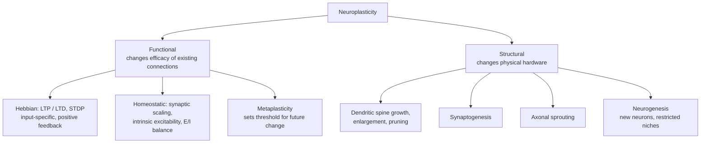

# Neuroplasticity and Neurogenesis

> A reference on how the brain rewires itself — changing the strength of synapses, the shape of dendrites, the maps on the cortex, and, under specific circumstances, its very cellular composition — across development, learning, injury, and the lifespan.

## Introduction

For most of the twentieth century, neuroscience held that the adult brain was essentially fixed: its wiring was laid down in development and thereafter only degraded. That doctrine is now overturned. **Neuroplasticity** (or simply *plasticity*) is the umbrella term for the nervous system's capacity to change its structure, function, and connections in response to intrinsic or extrinsic signals — genetic programs, sensory experience, learning, hormones, injury, and disease. **Neurogenesis** — the generation of new neurons from neural stem and progenitor cells — is a special, more restricted case of structural plasticity that is dramatic in the developing brain and, in a few niches, continues (or is claimed to continue) into adulthood.

Plasticity is the physical substrate of learning and memory, the mechanism by which a developing brain is tuned to its environment, and the process that recovers function after stroke or amputation. It is also double-edged: the same rules that let a violinist expand the cortical map of the left hand can, taken to excess, produce focal dystonia, chronic pain, or the entrenched circuitry of addiction. This document surveys the phenomenon from the molecule to the whole brain.

> **Cross-references:** Synaptic long-term potentiation and depression are the cellular basis of memory and are treated in depth in the memory document; here they are summarized as plasticity mechanisms. See also the developmental and hippocampal-anatomy documents in this collection.

## Table of Contents

1. [What "Plasticity" Means: A Taxonomy](#1-what-plasticity-means-a-taxonomy)
2. [Synaptic Plasticity Mechanisms](#2-synaptic-plasticity-mechanisms)
3. [Structural Plasticity](#3-structural-plasticity)
4. [Developmental Plasticity and Critical Periods](#4-developmental-plasticity-and-critical-periods)
5. [Experience-Dependent Plasticity](#5-experience-dependent-plasticity)
6. [Cortical Remapping and Reorganization](#6-cortical-remapping-and-reorganization)
7. [Adult Neurogenesis](#7-adult-neurogenesis)
8. [Molecular Players](#8-molecular-players)
9. [Plasticity in Recovery from Injury and Stroke](#9-plasticity-in-recovery-from-injury-and-stroke)
10. [Maladaptive Plasticity](#10-maladaptive-plasticity)
11. [Plasticity Across the Lifespan](#11-plasticity-across-the-lifespan)
12. [Sources](#sources)

---

## 1. What "Plasticity" Means: A Taxonomy

Plasticity is not a single process but a family of them, operating on scales from nanometers (a single synapse) to centimeters (a cortical map) and from milliseconds to years. Several orthogonal distinctions are useful.

Note that these axes are orthogonal, not exclusive: Hebbian and homeostatic mechanisms operate simultaneously, and strong functional potentiation is typically consolidated by structural change at the same synapse.

### Functional vs. Structural Plasticity

- **Functional plasticity** changes how existing connections behave — the *strength* or *efficacy* of a synapse, the excitability of a membrane, or which pathways carry a given function — without necessarily adding or removing physical structures. Long-term potentiation of an existing synapse is the canonical example.
- **Structural plasticity** changes the physical hardware: growing or retracting dendritic spines, forming or eliminating synapses, sprouting axons, or adding whole new neurons (neurogenesis). Functional and structural changes are deeply intertwined — strong functional potentiation is typically consolidated by structural enlargement of the spine.

### Levels of Organization

| Level | What changes | Timescale | Example |
|---|---|---|---|
| **Synaptic** | Strength/number of individual synapses | ms – days | LTP/LTD, synaptic scaling |
| **Cellular / intrinsic** | Membrane excitability, ion-channel expression, dendritic morphology, neurogenesis | hours – weeks | Intrinsic excitability changes; new dentate granule cells |
| **Systems / cortical** | Large-scale maps and network routing | days – years | Ocular dominance shift, cortical remapping after amputation |

These levels are not independent. A change in cortical maps is built from thousands of synaptic and structural changes, coordinated by systems-level activity patterns and neuromodulation.

### Hebbian vs. Homeostatic

A second key axis distinguishes **Hebbian** plasticity — rapid, input-specific, and positive-feedback ("neurons that fire together, wire together") — from **homeostatic** plasticity — slow, cell-wide, negative-feedback processes that keep the network stable and prevent Hebbian mechanisms from running away into silence or saturation. Both are essential and operate simultaneously.

---

## 2. Synaptic Plasticity Mechanisms

Synaptic plasticity is the activity-dependent modification of the strength of transmission at a synapse. It is the most-studied form of plasticity and the leading candidate for the physical basis of learning.

### 2.1 LTP and LTD (Summary — see the memory document)

**Long-term potentiation (LTP)** is a persistent (hours to months) *strengthening* of synaptic transmission that follows brief high-frequency or correlated activity. **Long-term depression (LTD)** is its counterpart — a persistent *weakening*, typically induced by low-frequency or uncorrelated activity. In the hippocampal CA1 and cortical circuits, both are classically **NMDA-receptor-dependent**: the NMDA receptor acts as a coincidence detector, opening only when the presynaptic terminal releases glutamate *and* the postsynaptic cell is depolarized enough to expel its Mg²⁺ block. The resulting Ca²⁺ influx — large and fast for LTP, modest and prolonged for LTD — drives insertion or removal of AMPA receptors and downstream structural change. LTP and LTD are widely regarded as putative mechanisms for memory formation and are discussed mechanistically in the dedicated memory document; here they are the elementary units of synaptic plasticity.

### 2.2 Hebbian Plasticity

The foundational principle, from Donald Hebb (1949): when neuron A repeatedly and persistently takes part in firing neuron B, the synapse from A to B is strengthened. Colloquially, **"cells that fire together wire together."** Hebbian plasticity is:

- **Input-specific** — only the co-active synapses change, not the whole cell.
- **Associative** — a weak input can be potentiated if it is active at the same time as a strong one (the basis of classical conditioning at the cellular level).
- **Correlation-based** — it reads out the statistical relationship between pre- and postsynaptic activity.

Its intrinsic weakness is instability: strengthening co-active synapses makes them more likely to co-fire, a positive feedback loop that, unchecked, would saturate the network. Homeostatic mechanisms (§2.4) counteract this.

### 2.3 Spike-Timing-Dependent Plasticity (STDP)

STDP is a temporally precise refinement of Hebb's rule. The *sign* and *magnitude* of the change depend on the **relative millisecond timing** of pre- and postsynaptic spikes:

- If the **presynaptic** neuron fires **shortly before** the postsynaptic neuron (pre → post, typically within ~20 ms), the synapse is **potentiated** (LTP). This respects causality — the input helped cause the output.
- If the **postsynaptic** neuron fires **before** the presynaptic input arrives (post → pre), the synapse is **depressed** (LTD).

The tighter the timing, the larger the change; outside the window, little happens. STDP gives the brain a mechanism for learning causal and predictive relationships and temporal sequences, and it is a workhorse abstraction in computational and neuromorphic models. It can be understood as a spike-level consequence of the same Ca²⁺-dependent coincidence detection that underlies rate-based LTP/LTD.

### 2.4 Homeostatic Plasticity and Synaptic Scaling

Homeostatic plasticity stabilizes neurons around a target activity level over hours to days. The best-characterized form is **synaptic scaling**: when a neuron's average firing rate is chronically too high, it multiplicatively *scales down* the strength of **all** of its excitatory synapses; when firing is chronically too low, it scales them **up**. Crucially, scaling is **multiplicative** — it multiplies every synapse by roughly the same factor — so the *relative* weights encoded by Hebbian learning are preserved even as the overall gain is renormalized. Additional homeostatic mechanisms adjust intrinsic excitability (ion-channel density) and the balance of excitation and inhibition. Together these keep networks in a dynamic range where Hebbian plasticity can still operate without saturating or falling silent.

### 2.5 Metaplasticity

Metaplasticity is **"the plasticity of synaptic plasticity"** — activity-dependent changes that alter the *ability* of a synapse to subsequently undergo LTP or LTD, without necessarily changing its current strength. In effect, prior activity moves the **threshold** at which future potentiation or depression occurs. The classic formalization is the **BCM theory** (Bienenstock–Cooper–Munro), which posits a sliding modification threshold (θ_m): a history of high activity slides the threshold up (making LTP harder and LTD easier), and a history of low activity slides it down (favoring LTP). Metaplasticity prevents runaway saturation of LTP/LTD and lets the network integrate synaptic events that are spread out over time.

| Mechanism | Feedback sign | Specificity | Timescale | Function |
|---|---|---|---|---|
| Hebbian LTP/LTD | Positive | Synapse-specific | ms–hours | Store correlations; learning |
| STDP | Positive | Synapse-specific | ms window | Learn temporal/causal order |
| Synaptic scaling | Negative | Cell-wide | hours–days | Stabilize firing rate |
| Metaplasticity | Regulatory | Synapse or cell | minutes–days | Set the threshold for future plasticity |

---

## 3. Structural Plasticity

Functional changes at synapses are frequently accompanied — and consolidated — by physical remodeling. In-vivo **two-photon microscopy**, which allows the same dendrites to be imaged repeatedly over days to months in living animals, revealed that cortical synapses are far more dynamic than fixed-tissue studies had suggested.

### 3.1 Dendritic Spines: Formation, Enlargement, and Pruning

**Dendritic spines** are the tiny (~1 µm) membrane protrusions that host most excitatory synapses in the cortex. Their morphology maps onto function:

- **Thin / filopodial** spines are immature, motile, and transient — candidate "learning" spines probing for partners.
- **Mushroom** spines have large heads and are stable, storing potentiated, long-lasting connections.

LTP is associated with spine **enlargement and stabilization** (and the birth of new spines); LTD with spine **shrinkage and elimination**. During development the sequence is stereotyped: axonal and dendritic outgrowth, an exuberant overproduction of immature filopodia-like spines, then **activity-dependent pruning** of surplus contacts and maturation of the survivors. Learning in adults produces a lasting reorganization of a small fraction of spines whose survival correlates with retention of the learned skill.

### 3.2 Synaptogenesis

Synaptogenesis — the formation of new synapses — is explosive in early development (in humans, synaptic density peaks in infancy/childhood, followed by a protracted pruning that continues into the mid-twenties, especially in prefrontal cortex) and continues at a lower rate throughout life as spines form and disappear. Experience and learning bias where and when new synapses are made and kept.

### 3.3 Axonal Sprouting

Beyond the spine, axons themselves can remodel. **Sprouting** — the growth of new axon collaterals and terminals from intact neurons into denervated territory — is a key structural response to injury (see §9). Local sprouting also contributes to normal map plasticity and to the reorganization that follows deafferentation.

---

## 4. Developmental Plasticity and Critical Periods

The developing brain is exuberantly plastic, and much of its wiring is refined by experience during time-limited windows.

### 4.1 Critical vs. Sensitive Periods

A **critical period** is a window during which a particular experience is required for normal circuit development, and during which the circuit is maximally malleable; alterations of input inside the window have lasting consequences, while the same alteration outside it has little or no effect. **"Sensitive period"** is the softer term for windows where experience has an especially strong (but not strictly all-or-none) influence. Critical periods have now been described across sensory and motor systems and across many species, suggesting a general developmental strategy.

### 4.2 Ocular Dominance and Hubel & Wiesel

The paradigm case comes from **David Hubel and Torsten Wiesel** (Nobel Prize, 1981), working in cat and monkey visual cortex. They showed that primary visual cortex (V1) neurons are driven to differing degrees by the two eyes — a property they named **ocular dominance**, organized into alternating **ocular dominance columns**. Crucially, when they sutured one eye shut (**monocular deprivation**) during a critical period in early life, cortical territory shifted dramatically toward the open eye, and the deprived eye was left functionally disconnected from cortex even though the eye and retina were healthy. The same deprivation in an adult had little effect. This demonstrated three enduring principles: (1) cortical circuitry is shaped by patterned neural activity, not genes alone; (2) plasticity is gated by a developmental window; and (3) the two eyes **compete** for cortical territory. The mechanistic gate of the critical period is now understood to involve the maturation of inhibitory (parvalbumin GABAergic) circuitry and the emergence of molecular "brakes" (e.g., perineuronal nets, myelin-associated inhibitors) that progressively close the window.

### 4.3 Language and Other Human Sensitive Periods

Humans acquire language most effortlessly and completely in early childhood; the ability to attain native-like grammar and, especially, native-like phonology (accent) in a second language declines with age of first exposure. Cases of severe early deprivation and studies of second-language age-of-acquisition support a sensitive period for language, closing gradually through childhood and adolescence rather than snapping shut. Analogous windows exist for the development of binocular depth perception, sound localization, and filial/social attachment.

---

## 5. Experience-Dependent Plasticity

Beyond development, experience continues to sculpt the adult brain — the mechanism by which practice, environment, and learning leave measurable structural traces.

### 5.1 Enriched Environments

Rodents housed in **enriched environments** (larger cages with toys, running wheels, social companions, and novelty) show, relative to standard-housed controls, thicker cortex, more dendritic branching, more dendritic spines and synapses per neuron, elevated BDNF, and — in the dentate gyrus — increased survival of newborn neurons. Enrichment is a cornerstone demonstration that ordinary experience drives structural plasticity.

### 5.2 The London Taxi Driver Study

In a landmark human study, **Eleanor Maguire and colleagues (2000)** used structural MRI to compare licensed London taxi drivers — who must master "The Knowledge," an exhaustive mental map of the city's ~25,000 streets — with non-taxi controls. The drivers had significantly **larger posterior hippocampi**, and posterior hippocampal volume **correlated positively with years of experience** driving (with a reciprocal decrease anteriorly). A later controlled comparison with London **bus drivers** (matched for driving and stress but following fixed routes) reinforced that the difference tracked *spatial* navigation demand, not driving per se, and longitudinal work following trainees showed the posterior hippocampus grew in those who *qualified*. This is among the strongest demonstrations that learning can remodel the structure of the adult human brain — though it is often over-hyped, and the effect is a localized, navigation-specific change, not a general "bigger brain."

### 5.3 Musicians and Other Skill Experts

Musicians are a favored model of experience-dependent plasticity. Trained musicians show enlarged representations in auditory and motor cortex, expanded somatosensory maps for the trained fingers (e.g., the left-hand digits of string players), larger cerebellar and corpus-callosum measures, and enhanced auditory processing — effects that scale with age of onset and hours of practice. Similar use-dependent expansions of cortical maps have been shown after training in Braille reading, juggling (transient gray-matter increases in motion-processing areas), and other intensive skills.

---

## 6. Cortical Remapping and Reorganization

**Cortical remapping** (cortical reorganization) is systems-level plasticity: an existing cortical map is reshaped when its inputs change. When a body part is lost or a sensory channel is silenced, the deprived cortical territory tends to be taken over by adjacent, still-active representations.

### 6.1 Phantom Limbs and Somatosensory Reorganization

After **amputation**, the deafferented zone of primary somatosensory cortex (S1) that formerly represented the missing hand does not stay silent; neighboring representations — notably the **face**, which lies adjacent to the hand in the S1 "homunculus" — invade it. **V. S. Ramachandran** described, in the 1990s, upper-limb amputees who felt touch on their face as if it came from the missing hand, mirroring this cortical takeover. The magnitude of somatosensory (and motor) reorganization has been reported to **correlate with the intensity of phantom limb pain**, framing much phantom pain as a form of maladaptive reorganization (though the causal interpretation remains debated, with some evidence that *preserved* rather than reorganized representation predicts pain).

### 6.2 Therapeutic Exploitation: Mirror Therapy

Ramachandran's **mirror box** exploits plasticity therapeutically: a mirror gives the illusion that the intact limb is the missing one, and watching it "move" can relieve phantom pain and restore a sense of voluntary control — one of the clearest demonstrations that reorganization can be nudged in a beneficial direction. Motor imagery and graded imagery programs work on similar principles.

### 6.3 Sensory Substitution

**Sensory substitution** routes information from a lost sense through an intact one — e.g., converting a camera image into patterns of touch on the tongue or torso, or into soundscapes — and, with training, users come to "perceive" spatial information, recruiting visual and multisensory cortex. This, together with the finding that visual cortex in the congenitally blind is recruited during Braille reading and verbal tasks, shows the cortex is more flexible about its inputs (**metamodal / supramodal** organization) than a strictly hardwired view allows.

---

## 7. Adult Neurogenesis

Neurogenesis is abundant in the embryonic and early postnatal brain. Whether — and how much — it persists in the **adult** brain, particularly in humans, is one of neuroscience's most actively contested questions.

### 7.1 The Two Canonical Niches

In adult mammals, neurogenesis is generally accepted in two germinal niches:

1. **The subgranular zone (SGZ) of the hippocampal dentate gyrus**, which generates new **dentate granule cells** that integrate into hippocampal circuits and are implicated in learning, pattern separation, and mood regulation.
2. **The ventricular–subventricular zone (V-SVZ)** lining the lateral ventricles, which produces **neuroblasts** that migrate via the **rostral migratory stream (RMS)** to the **olfactory bulb**, where they become local interneurons.

In rodents both niches are robustly active throughout life. In humans the picture is more complicated: the SVZ→olfactory-bulb route appears very active in the first ~1–2 years of life and then declines steeply, so that the *hippocampal* niche is the focus of the human debate.

### 7.2 The Human Hippocampal Neurogenesis Controversy

The modern debate crystallized in **2018**, when two high-profile studies reached opposite conclusions from human hippocampal tissue:

- **Sorrells et al. (2018, *Nature*)** found that markers of new neurons in the dentate gyrus **declined sharply during childhood and were essentially undetectable in adult samples**, concluding that hippocampal neurogenesis, if it continues in human adults, is extremely rare — implying the human hippocampus may differ from that of other mammals. (The same steep decline was reported in rhesus macaques.)
- **Boldrini et al. (2018, *Cell Stem Cell*)** examined 28 individuals aged 14–79 and reported **persistent neurogenesis into old age**, with preserved numbers of neural progenitors and immature neurons (though with some decline in vascularization and progenitor pool).

The following year, **Moreno-Jiménez et al. (2019, *Nature Medicine*)** reported **thousands of immature (doublecortin-positive) neurons** in the dentate gyrus of neurologically healthy people from their 40s into their late 80s, with numbers declining sharply in Alzheimer's disease.

**Why the disagreement?** Much of it is methodological. Human brain tissue must be chemically fixed, and the leading explanation is that **prolonged fixation in paraformaldehyde degrades the epitopes** (e.g., doublecortin) used to label young neurons — so studies with long or uncontrolled post-mortem fixation would *under*-count new neurons. Tissue quality, post-mortem interval, donor age distribution, and antibody specificity all matter. Newer approaches — single-nucleus RNA sequencing and improved markers — have been marshaled on both sides; some single-cell studies failed to find a clear neurogenic progenitor signature in adults, while others (and 2023-era analyses) reported molecular signatures consistent with ongoing, if low-level, neurogenesis. 

**Where the field stands (genuinely unresolved):** No consensus exists. Many groups now lean toward the view that *some* hippocampal neurogenesis persists in adult humans at a **low and age-declining rate**, but this remains a provisional reading rather than a settled result — competing labs continue to report incompatible findings using different tissue, markers, and methods, and its **functional significance** in humans is unproven. Readers should be wary of confident claims in either direction.

### 7.3 Factors That Promote or Suppress Neurogenesis

Most quantitative regulatory data come from rodents, where hippocampal neurogenesis is a well-defined readout:

| Promotes | Suppresses |
|---|---|
| **Physical exercise** (voluntary running) — among the most reliable positive regulators | **Chronic stress / elevated glucocorticoids** (corticosterone/cortisol) — reduces proliferation and survival |
| **Enriched environment** (chiefly by boosting *survival* of new neurons) | **Aging** — progressive, marked decline in proliferation |
| **Learning** (hippocampus-dependent tasks) | **Sleep deprivation** |
| **Antidepressants (SSRIs, e.g., fluoxetine)** — increase proliferation/survival; some antidepressant effects appear to *require* neurogenesis | **Inflammation** and chronic disease |
| **BDNF and other trophic signals** | **Some drugs of abuse, radiation, chemotherapy** |

Two nuances are worth noting. First, exercise and antidepressants act partly through *different* gene pathways, and — unlike running — **fluoxetine can fail to stimulate neurogenesis in aged animals** while still exerting antidepressant effects. Second, the dose-response for exercise is non-monotonic: short-term running can raise neurogenesis by several-fold, but very prolonged, high-volume running can activate the HPA axis and raise corticosterone enough to *reduce* neurogenesis back toward or below baseline.

---

## 8. Molecular Players

Plasticity at every level is orchestrated by a conserved molecular toolkit. Key players:

### 8.1 NMDA Receptors — the Coincidence Detector

The **NMDA-type glutamate receptor** is the gatekeeper of much Hebbian plasticity. Its **voltage-dependent Mg²⁺ block** means it passes current (chiefly Ca²⁺) only when glutamate binding coincides with postsynaptic depolarization — implementing the "fire together" rule at the molecular level. The amplitude and time course of the resulting Ca²⁺ signal bias the outcome toward LTP (large, fast Ca²⁺ → CaMKII activation, AMPA-receptor insertion) or LTD (modest, prolonged Ca²⁺ → phosphatase activation, AMPA-receptor removal).

### 8.2 BDNF and the Neurotrophins

**Brain-derived neurotrophic factor (BDNF)** is the pre-eminent plasticity-promoting neurotrophin, signaling through its receptor **TrkB**. BDNF supports neuronal survival and differentiation, is required for many forms of LTP, promotes dendritic and spine growth, and is a major mediator of the pro-plasticity effects of exercise, enrichment, and antidepressants. Mechanistically, BDNF-TrkB engages the **MAPK/ERK** and **PI3K/Akt** cascades, potentiates Ca²⁺ influx through NMDA receptors (in part via phosphorylation of the NR2B/GluN2B subunit), and drives the transcription of plasticity genes. BDNF belongs to a family — **NGF, NT-3, NT-4/5** — of nerve growth factors that act through Trk and p75 receptors to regulate neuronal growth, survival, and connectivity.

### 8.3 Immediate Early Genes

**Immediate early genes (IEGs)** are rapidly and transiently transcribed within minutes of strong neural activity, requiring no new protein synthesis to be turned on — a first-wave molecular response that couples activity to lasting change. Key IEGs in plasticity:

- **c-fos** and **Egr1 (zif268)** — transcription-factor IEGs that switch on downstream ("late-response") plasticity genes; widely used as activity markers to map engaged neurons.
- **Arc/Arg3.1** — an effector IEG whose mRNA is trafficked to activated dendrites, where it regulates AMPA-receptor trafficking and spine structure; central to consolidation and to homeostatic scaling.

BDNF signaling is a major upstream inducer of these IEGs: via ERK→MSK1 it drives histone phosphorylation at the *Arc* promoter and induces *c-fos*, linking synaptic activity to the gene expression that stabilizes long-term change. The IEG-marked ensembles of neurons active during an experience are thought to constitute part of the physical **memory trace (engram)**.

### 8.4 The Cascade in Brief

A typical sequence for durable plasticity: correlated activity → NMDA-receptor Ca²⁺ influx → CaMKII and other kinase activation → AMPA-receptor trafficking (early LTP) → (with strong/repeated stimulation) BDNF-TrkB and cAMP/PKA/CREB signaling → IEG and late-gene transcription → new protein synthesis → **structural consolidation** of the spine (late LTP). Homeostatic and metaplastic processes run in parallel to keep the system stable.

---

## 9. Plasticity in Recovery from Injury and Stroke

Plasticity is the biological engine of recovery after brain injury: rehabilitation works by harnessing the same activity-dependent rules that operate in the healthy brain.

### 9.1 Mechanisms of Post-Injury Recovery

After a **stroke** or focal injury, the surviving brain reorganizes across multiple mechanisms: unmasking of latent connections; **axonal sprouting** and new synapse formation in peri-infarct and connected regions; recruitment of the peri-infarct cortex and, sometimes, homologous areas of the opposite hemisphere; and shifts of function to spared networks. The early post-stroke period features a transient, heightened plastic state — a **"critical window"** of elevated growth-related gene expression — that rehabilitation aims to exploit before it closes.

### 9.2 Learned Non-Use and Constraint-Induced Movement Therapy

A key insight is that some post-stroke disability is *learned*. Early failures to move a paretic limb lead patients to abandon it — **"learned non-use"** — which then deprives the relevant circuits of the very activity needed to drive recovery. **Constraint-Induced Movement Therapy (CIMT)**, developed by Edward Taub, counters this by **restraining the unaffected limb** (e.g., in a mitt for a large fraction of waking hours) while the patient performs **massed, intensive, shaped practice** with the impaired limb over ~2 weeks. CIMT can produce durable improvements in motor function and everyday use even long after stroke, and it is accompanied by measurable **use-dependent cortical reorganization** — an expansion of the motor map representing the treated limb. CIMT is a leading example of an evidence-based rehabilitation therapy grounded explicitly in neuroplasticity, though it demands high intensity and is not suitable for all patients.

### 9.3 Adjuncts

Task-specific and high-repetition training, robot-assisted therapy, non-invasive brain stimulation (TMS/tDCS) to rebalance hemispheric excitability, and pharmacological or activity-based strategies to reopen plasticity are all being investigated as ways to bias reorganization toward adaptive, functionally useful patterns.

---

## 10. Maladaptive Plasticity

Plasticity is not intrinsically benign. When the same learning rules operate on the wrong inputs, at the wrong intensity, or without adequate homeostatic restraint, they can *cause* disease. This is **maladaptive plasticity**.

### 10.1 Chronic Pain

Chronic pain is increasingly understood as a **maladaptive learning** process rather than a simple ongoing nociceptive signal. **Central sensitization** — LTP-like amplification in spinal and cortical pain pathways — lowers thresholds and expands receptive fields, so pain persists or spreads beyond any tissue damage. Neuroplastic changes in corticolimbic circuits accompany the transition from acute to chronic pain and contribute to comorbid depression and anxiety; reorganization of primary motor and somatosensory maps is commonly observed. (Phantom limb pain, §6.1, is a special case.)

### 10.2 Focal Dystonia

**Focal dystonias** such as **musician's cramp** and **writer's cramp** are prime examples of **use-dependent plasticity gone wrong**. Excessive, highly stereotyped repetitive practice, in predisposed individuals, can degrade the normally sharp, segregated somatosensory and motor maps of the fingers — the digit representations "smear" and overlap — producing involuntary co-contraction and loss of independent finger control. Abnormal, excessive plasticity together with deficient inhibition and impaired sensorimotor integration is a recurring theme in the dystonia literature.

### 10.3 Addiction

**Addiction** is, in part, a pathological form of learning in the brain's reward circuitry (mesolimbic dopamine system, nucleus accumbens, prefrontal cortex). Drugs of abuse hijack normal reward-learning mechanisms, driving robust and long-lasting synaptic and structural plasticity — including drug-induced LTP/LTD at excitatory synapses on dopamine neurons and altered dendritic-spine density — that entrenches drug-seeking, links it powerfully to cues and contexts, and biases decision-making toward the drug. Cue-triggered relapse reflects this deeply consolidated, maladaptive plasticity. The hopeful corollary is that plasticity also underwrites **recovery**: with abstinence and behavioral change, circuits can partially remodel toward healthier patterns, which is why sustained new learning is central to treatment.

### 10.4 A Common Thread

Across these conditions, maladaptive plasticity tends to involve **excessive or misdirected Hebbian strengthening**, **degraded map specificity**, and **failure of homeostatic and inhibitory restraint** — suggesting that therapies which restore normal inhibition, sharpen maps, or reset thresholds (behavioral retraining, brain stimulation, sensory discrimination training) may reverse it.

---

## 11. Plasticity Across the Lifespan

Plasticity does not vanish with maturity, but its **rules, magnitude, and mechanisms shift** with age.

- **Prenatal and early postnatal:** Maximal plasticity. Neurogenesis, neuronal migration, exuberant synaptogenesis, and activity-dependent wiring dominate. Experience begins tuning circuits.
- **Childhood and critical periods:** Sensory, motor, and language circuits are refined within time-limited windows (§4). Massive experience-dependent synaptic **pruning** removes surplus connections; a synapse "use it or lose it" logic prevails.
- **Adolescence and early adulthood:** Protracted maturation, especially of prefrontal cortex; continued pruning and myelination into roughly the mid-twenties. Reward and social circuits are highly plastic, contributing to both learning capacity and vulnerability.
- **Adulthood:** Plasticity persists but is more constrained. Learning, skill acquisition, and recovery still remodel synapses, spines, and maps (§5, §9). Critical-period "brakes" (perineuronal nets, myelin inhibitors, mature inhibition) limit the sweeping reorganization possible in youth. Low-level hippocampal neurogenesis may continue (§7).
- **Aging:** A general decline in plasticity — reduced LTP inducibility, lower BDNF, fewer new neurons, slower and less complete recovery from injury — though the aged brain remains meaningfully plastic. **Lifestyle factors that support plasticity** — aerobic exercise, cognitive engagement, social and environmental enrichment, good sleep, and stress reduction — can partially preserve it, and constitute much of the practical advice for healthy cognitive aging.

The overarching arc: plasticity is greatest when the brain is being built, is deliberately restrained once circuits are functional (to protect hard-won learning from being overwritten), and can be partially and selectively reopened — by experience, by therapy, and in principle by molecular manipulation of the critical-period brakes — throughout life.

---

## Sources

### Adult Neurogenesis and the Human Debate
- [Neurogenesis in the hippocampus of adult humans: controversy "fixed" at last (PMC)](https://pmc.ncbi.nlm.nih.gov/articles/PMC6676862/)
- [Human Adult Neurogenesis: Evidence and Remaining Questions (Cell Stem Cell / ScienceDirect)](https://www.sciencedirect.com/science/article/pii/S1934590918301668)
- [Evidences for Adult Hippocampal Neurogenesis in Humans (Journal of Neuroscience)](https://www.jneurosci.org/content/41/12/2541)
- [Adult neurogenesis in humans: Dogma overturned, again and again? (Science Translational Medicine)](https://www.science.org/doi/10.1126/scitranslmed.aat3893)
- [Do new neurons grow in the adult human hippocampus? A review of the evidence (Exploration)](https://www.explorationpub.com/Journals/en/Article/1006128)
- [The Adult Ventricular–Subventricular Zone (V-SVZ) and Olfactory Bulb Neurogenesis (Cold Spring Harbor Perspectives / PMC)](https://pmc.ncbi.nlm.nih.gov/articles/PMC4852803/)
- [Olfactory bulb neurogenesis depending on signaling in the subventricular zone (Cerebral Cortex, 2023)](https://academic.oup.com/cercor/article/33/22/11102/7281518)
- [Depression and adult neurogenesis: positive effects of fluoxetine and of physical exercise (ScienceDirect)](https://www.sciencedirect.com/science/article/pii/S0361923018304507)
- [Regulation of adult neurogenesis by stress, sleep disruption, exercise and inflammation (ScienceDirect)](https://www.sciencedirect.com/science/article/pii/S0924977X09002119)
- [Physical exercise: bulking up neurogenesis in human adults (PMC)](https://www.ncbi.nlm.nih.gov/pmc/articles/PMC6724373/)

### Synaptic Plasticity Mechanisms
- [Synaptic plasticity (Wikipedia overview with primary citations)](https://en.wikipedia.org/wiki/Synaptic_plasticity)
- [Long-Term Potentiation and Depression as Putative Mechanisms for Memory Formation (NCBI Bookshelf, *Neural Plasticity and Memory*)](https://www.ncbi.nlm.nih.gov/books/NBK3912/)
- [Mechanisms of Homeostatic Synaptic Plasticity in vivo (Frontiers in Cellular Neuroscience)](https://www.frontiersin.org/journals/cellular-neuroscience/articles/10.3389/fncel.2019.00520/full)
- [Homeostatic Plasticity and STDP: Keeping a Neuron's Cool in a Fluctuating World (PubMed)](https://pubmed.ncbi.nlm.nih.gov/21423491/)
- [Spike Timing Dependent Plasticity: A Consequence of More Fundamental Learning Rules (Frontiers / PMC)](https://pmc.ncbi.nlm.nih.gov/articles/PMC2922937/)

### Structural Plasticity
- [Cortical dendritic spine development and plasticity: insights from in vivo imaging (ScienceDirect)](https://www.sciencedirect.com/science/article/abs/pii/S0959438818300783)
- [Bidirectional in vivo structural dendritic spine plasticity revealed by two-photon glutamate uncaging (PMC)](https://www.ncbi.nlm.nih.gov/pmc/articles/PMC6763442/)
- [Structural and functional plasticity of dendritic spines – root or result of behavior? (PMC)](https://pmc.ncbi.nlm.nih.gov/articles/PMC5243184/)

### Developmental Plasticity and Critical Periods
- [What's Critical for the Critical Period in Visual Cortex? (Cell)](https://www.cell.com/fulltext/S0092-8674(00)81665-7)
- [Development and Plasticity of the Primary Visual Cortex (PMC)](https://pmc.ncbi.nlm.nih.gov/articles/PMC3612584/)
- [Ocular dominance column (Scholarpedia)](http://www.scholarpedia.org/article/Ocular_dominance_column)
- [From Cats to the Cortex: Unravelling the Hierarchical Processing System of Vision and Brain Plasticity (PMC)](https://www.ncbi.nlm.nih.gov/pmc/articles/PMC11445666/)

### Experience-Dependent Plasticity
- [Navigation-related structural change in the hippocampi of taxi drivers — Maguire et al., 2000 (PNAS)](https://www.pnas.org/doi/10.1073/pnas.070039597)
- [London taxi drivers and bus drivers: a structural MRI and neuropsychological analysis — Maguire, 2006 (PDF)](https://www.fil.ion.ucl.ac.uk/Maguire/Maguire2006.pdf)
- [Acquiring "the Knowledge" of London's Layout Drives Structural Brain Changes (PMC)](https://pmc.ncbi.nlm.nih.gov/articles/PMC3268356/)
- [Neural plasticity: don't fall for the hype (The British Academy — a cautionary counterpoint)](https://www.thebritishacademy.ac.uk/publishing/review/30/neural-plasticity-dont-fall-for-hype/)

### Cortical Remapping and Reorganization
- [Cortical remapping (Wikipedia overview with primary citations)](https://en.wikipedia.org/wiki/Cortical_remapping)
- [Reorganization of Motor and Somatosensory Cortex in Upper Extremity Amputees with Phantom Limb Pain (Journal of Neuroscience)](https://www.jneurosci.org/content/21/10/3609)
- [Phantom limb pain, cortical reorganization and the therapeutic effect of mental imagery (Brain / Oxford)](https://academic.oup.com/brain/article/131/8/2181/266884)
- [Assessment of cortical reorganization and preserved function in phantom limb pain: a methodological perspective (PMC)](https://www.ncbi.nlm.nih.gov/pmc/articles/PMC7359300/)

### Molecular Players
- [The role of brain-derived neurotrophic factor in the central nervous system (PMC)](https://pmc.ncbi.nlm.nih.gov/articles/PMC9493475/)
- [Role of Immediate-Early Genes in Synaptic Plasticity and Neuronal Ensembles Underlying the Memory Trace (PMC)](https://www.ncbi.nlm.nih.gov/pmc/articles/PMC4700275/)
- [Regulation of BDNF-mediated transcription of immediate early gene Arc by intracellular calcium and calmodulin (PMC)](https://pmc.ncbi.nlm.nih.gov/articles/PMC2628963/)
- [MSK1 regulates transcriptional induction of Arc/Arg3.1 in response to neurotrophins (PMC)](https://www.ncbi.nlm.nih.gov/pmc/articles/PMC5458472/)

### Injury, Stroke, and Rehabilitation
- [Neuroplasticity, learning and recovery after stroke: a critical evaluation of constraint-induced therapy (PubMed)](https://pubmed.ncbi.nlm.nih.gov/16353503/)
- [Constraint-induced movement therapy after stroke (The Lancet Neurology)](https://www.thelancet.com/journals/laneur/article/PIIS1474-4422(14)70160-7/abstract)
- [Neuroplasticity in stroke and brain injury: shaping modern rehabilitation practices (MedLink Neurology)](https://www.medlink.com/news/neuroplasticity-in-stroke-and-brain-injury-shaping-modern-rehabilitation-practices)
- [Adaptive Neuroplasticity in Brain Injury Recovery: Strategies and Insights (PMC)](https://www.ncbi.nlm.nih.gov/pmc/articles/PMC10598326/)

### Maladaptive Plasticity
- [Non-invasive Brain Stimulation, a Tool to Revert Maladaptive Plasticity in Neuropathic Pain (Frontiers / PMC)](https://www.ncbi.nlm.nih.gov/pmc/articles/PMC4961691/)
- [Neuroplasticity in dystonia: motor symptoms and beyond (PubMed)](https://pubmed.ncbi.nlm.nih.gov/35034735/)
- [Do dystonia and chronic pain have more in common than meets the eye? (Frontiers in Neurology)](https://www.frontiersin.org/journals/neurology/articles/10.3389/fneur.2026.1843230/full)
- [Neuroplasticity and recovery of the brain affected by substance use disorder (Frontiers in Molecular Neuroscience)](https://www.frontiersin.org/journals/molecular-neuroscience/articles/10.3389/fnmol.2026.1760387/full)

---

*This document is a synthesized reference for study purposes and does not constitute medical advice. On contested questions — especially the extent and functional role of adult human hippocampal neurogenesis — it reflects the balance of current evidence, which remains under active debate.*
