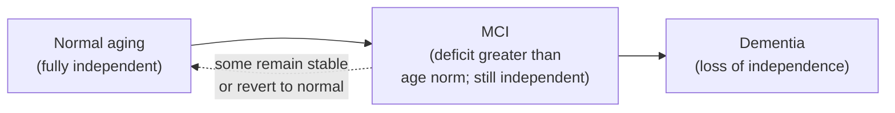
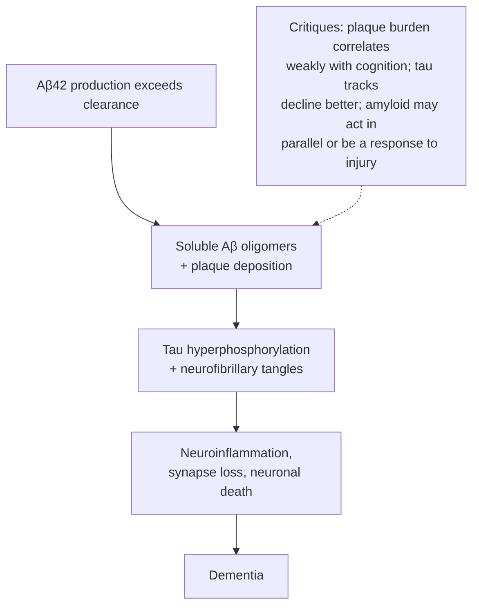

# Brain Aging, Decay, and Neurodegeneration

The aging brain sits at the intersection of two overlapping but distinct stories. One is the story of *normal* aging — the gradual, largely benign structural and functional drift that affects nearly everyone who lives long enough. The other is the story of *neurodegeneration* — the pathological cascades that, in a subset of people, cross a threshold into progressive disease and dementia. Separating these two stories, and understanding where they connect, is one of the central problems of modern neuroscience. This document synthesizes the current understanding of how the brain changes with age, the cellular and molecular hallmarks that drive that change, the major neurodegenerative diseases, the mechanisms by which neurons die, and the factors that protect the brain against decline.

A recurring theme throughout is that *aging is the single largest risk factor for neurodegenerative disease*, yet aging is not the same thing as disease. Most cognitive changes in healthy older adults are modest and functionally compensable. The task of research is to identify why some brains tip from resilient aging into runaway degeneration — and how to keep more brains on the resilient path.

---

## Table of Contents

1. [Normal Brain Aging](#1-normal-brain-aging)
2. [Cellular and Molecular Hallmarks of Brain Aging](#2-cellular-and-molecular-hallmarks-of-brain-aging)
3. [Normal Aging vs. Mild Cognitive Impairment vs. Dementia](#3-normal-aging-vs-mild-cognitive-impairment-vs-dementia)
4. [Alzheimer's Disease](#4-alzheimers-disease)
5. [Parkinson's Disease](#5-parkinsons-disease)
6. [Other Neurodegenerative Diseases](#6-other-neurodegenerative-diseases)
7. [Mechanisms of Neuronal Death](#7-mechanisms-of-neuronal-death)
8. [Cognitive Reserve, Protective Factors, and the Glymphatic System](#8-cognitive-reserve-protective-factors-and-the-glymphatic-system)
9. [Emerging Research and Therapeutic Directions](#9-emerging-research-and-therapeutic-directions)
10. [Sources](#sources)

---

## 1. Normal Brain Aging

Normal (or "healthy") brain aging refers to the changes seen in older adults who remain cognitively intact and functionally independent. These changes are real and measurable, but they are gradual, partial, and — critically — do not amount to disease.

### 1.1 Gross Structural Changes

The most conspicuous feature of the aging brain is **atrophy**: a slow shrinkage of total brain volume and weight. Brain volume begins to decline in the 30s and 40s, with the rate of loss accelerating after roughly age 60. Longitudinal MRI studies place whole-brain volume loss at approximately **0.4% per year on average**, ranging from about 0.3% per year in the 40s to roughly 0.5% per year in the 80s. Over a lifetime, the brain may lose on the order of 5–10% of its peak volume.

This atrophy is not uniform. The **prefrontal cortex, the hippocampus, and the cerebellum** show the greatest losses, which is consistent with the cognitive domains most affected by aging (executive function, episodic memory, and coordination). Characteristic macroscopic signatures include:

- **Cortical thinning** — the gray matter mantle becomes thinner, most prominently in frontal and parts of temporal cortex.
- **Sulcal widening and gyral narrowing** — the ridges (gyri) become narrower and the grooves (sulci) become wider and shallower.
- **Ventriculomegaly** — the fluid-filled ventricles enlarge (ex vacuo dilation) to fill the space left by shrinking tissue.
- **Gray and white matter volume loss** — both compartments decline, though on somewhat different trajectories.

Importantly, much of the volume loss in normal aging reflects **shrinkage of neurons, loss of synapses and dendritic arbor, and reduction of neuropil** rather than wholesale death of neurons. The older view that healthy aging involves massive neuron loss has been substantially revised; neuronal number is relatively preserved in many regions, and cellular *downsizing* dominates.

### 1.2 Synaptic and Dendritic Changes

At the microscopic level, the loss of computational capacity is driven largely by **synaptic and dendritic changes**. With age:

- Dendrites **shorten** and their branching complexity is reduced.
- **Dendritic spines** — the small protrusions that host most excitatory synapses — are lost, and the surviving population shifts toward fewer thin and mushroom spines (the shapes associated with stable, mature synapses).
- The net result is a **progressive reduction in synaptic density and synaptic transmission**, especially in the prefrontal cortex and hippocampus, with corresponding consequences for learning and memory.

Because cognition depends on synaptic connectivity far more than on raw neuron count, this synaptic attrition is a better correlate of age-related cognitive change than gross volume alone.

### 1.3 White Matter Changes

White matter — the myelinated axonal tracts that connect brain regions — is particularly vulnerable to aging. Common features include **partial loss of myelin, loss of axons and oligodendrocytes, and mild reactive astrocytic gliosis**. On MRI these appear as **white matter hyperintensities (WMHs)**, patchy signal changes that accumulate with age and are strongly linked to cerebrovascular health. White matter degradation slows the *speed* of information transfer between regions, and its progression tracks with declines in processing speed and executive function.

### 1.4 Neurotransmitter Decline

Aging brings a measurable decline in several neurotransmitter systems:

- **Dopamine** — dopaminergic signaling declines with age. Modest dopaminergic cell loss occurs, but this is insufficient to explain the roughly 60% drop in extracellular striatal dopamine reported in aging; declining receptor density (especially D2 receptors) and morphological changes contribute substantially. Dopamine decline is linked to slowed processing and reduced cognitive flexibility.
- **Norepinephrine** — noradrenergic function declines, with impaired glutamate-stimulated norepinephrine release in the hippocampus and cortex. The locus coeruleus (the brain's main noradrenergic source) is notably vulnerable.
- **Acetylcholine** — cholinergic tone from the basal forebrain declines, relevant to attention and memory; this system is catastrophically affected in Alzheimer's disease.
- **Serotonin** and **GABA** systems also show age-related reductions in receptors and signaling.

### 1.5 What Declines vs. What Stays Stable

A defining feature of normal cognitive aging is that it is **domain-specific**, not global. Some abilities decline while others are preserved or even improve.

| Domain | Trajectory with Age | Notes |
|---|---|---|
| **Processing speed** | Declines (often earliest and most robust) | Slower to take in and respond to new information |
| **Working memory** | Declines | Reduced capacity to hold/manipulate information |
| **Episodic memory** | Declines | Slower encoding and recall, e.g., of names/events |
| **Executive function** | Declines | More effort to multitask, greater distractibility |
| **Fluid intelligence** (novel problem-solving) | Declines | Peaks in early adulthood |
| **Crystallized intelligence** (vocabulary, knowledge) | Stable or improves | Accumulated facts and expertise persist |
| **Semantic memory** (general knowledge) | Largely stable | Well-learned information is robust |
| **Procedural memory** (skills) | Largely stable | "How to" skills endure |
| **Emotional regulation** | Often improves | The "positivity effect" of later life |

The practical upshot: a healthy older adult typically learns and recalls *more slowly* and is *more easily distracted*, but retains their vocabulary, accumulated knowledge, and well-practiced skills. This dissociation — declining **fluid** abilities against preserved **crystallized** ones — is one of the most reproducible findings in cognitive aging.

---

## 2. Cellular and Molecular Hallmarks of Brain Aging

Underlying the structural and functional changes above is a set of interlocking cellular and molecular processes. These overlap substantially with the broader "hallmarks of aging" framework (which enumerates roughly a dozen hallmarks including genomic instability, telomere attrition, epigenetic alteration, loss of proteostasis, disabled autophagy, mitochondrial dysfunction, deregulated nutrient sensing, cellular senescence, chronic inflammation, and stem cell exhaustion). In the brain, several are especially prominent, and — a crucial point — they are **deeply interconnected**, forming self-reinforcing vicious cycles rather than independent pathways.

### 2.1 Oxidative Stress and Free Radicals

The brain is uniquely vulnerable to oxidative damage: it consumes ~20% of the body's oxygen, is rich in oxidizable polyunsaturated lipids, and has relatively modest antioxidant defenses. **Reactive oxygen species (ROS)** — chemically reactive byproducts of oxygen metabolism — accumulate with age as antioxidant defenses (superoxide dismutase, catalase, glutathione systems) wane. Unchecked ROS damage lipids (lipid peroxidation), proteins, and DNA. The "free radical theory of aging" holds that this cumulative oxidative damage is a central driver of cellular decline.

### 2.2 Mitochondrial Dysfunction

Mitochondria are the primary endogenous source of ROS and the powerhouses of the neuron's enormous energy budget. With age, mitochondria show **declining ATP production alongside rising ROS output**, together with accumulating mutations in mitochondrial DNA (which lacks the protective histones and robust repair of nuclear DNA). This creates a feed-forward loop: damaged mitochondria leak more ROS, which further damages mitochondria. Mitochondrial dysfunction also promotes protein aggregation, activates the innate immune system, and lowers the threshold for apoptosis — placing it at the hub of the aging network.

### 2.3 Impaired Proteostasis (Protein Misfolding and Aggregation)

**Proteostasis** — the cellular machinery that keeps the proteome correctly folded, functional, and appropriately degraded — falters with age. Chaperone capacity declines and clearance pathways weaken, allowing **misfolded proteins to accumulate and aggregate**. This is the mechanistic thread connecting normal aging to nearly every major neurodegenerative disease, each defined by a signature aggregating protein: **amyloid-β and tau** (Alzheimer's), **α-synuclein** (Parkinson's, Lewy body dementia), **TDP-43** (ALS, FTD), **mutant huntingtin** (Huntington's), and **misfolded prion protein** (prion diseases). Aging thus lowers the barrier that normally keeps these proteins soluble.

### 2.4 Loss of Autophagy

**Autophagy** (and its selective forms, including macroautophagy and chaperone-mediated autophagy) is the cell's recycling system, degrading damaged organelles and protein aggregates in lysosomes. Autophagic flux **declines with age**, and this "disabled macroautophagy" directly permits the buildup of amyloid-β, tau, and α-synuclein. Lysosomal acidification and function also decline, tightly coupled to mitochondrial health — impaired mitochondria, failing lysosomes, and collapsing proteostasis form a mutually reinforcing triad.

### 2.5 Cellular Senescence

**Senescent cells** are cells that have permanently exited the cell cycle in response to stress or damage but resist death and linger in the tissue. They accumulate with age (including senescent astrocytes, microglia, and neurons) and secrete a pro-inflammatory cocktail known as the **senescence-associated secretory phenotype (SASP)** — cytokines, chemokines, and proteases that damage neighboring cells and sustain chronic inflammation. Senescence is an "antagonistic" hallmark: protective in youth (it suppresses cancer) but deleterious in aging.

### 2.6 Neuroinflammation

The aging brain drifts toward a state of chronic, low-grade inflammation sometimes called **"inflammaging."** Microglia (the brain's resident immune cells) become primed and hyper-reactive, and astrocytes adopt reactive phenotypes. This inflammation is **persistent rather than acute**, and while low-grade, it progressively damages tissue and amplifies every other hallmark — clearing debris less efficiently while producing more ROS and SASP factors.

### 2.7 DNA Damage, Genomic Instability, and Telomere Shortening

Neurons are long-lived, post-mitotic cells that must maintain their genome for a lifetime. **DNA damage accumulates** from oxidative insults and replication-independent errors, and DNA repair capacity declines with age — producing **genomic instability** and altered gene expression. **Telomeres** (the protective caps on chromosome ends) shorten with each division in dividing cells; while neurons themselves do not divide, telomere attrition in glial and immune cell populations contributes to senescence and to systemic aging that affects the brain. **Epigenetic alterations** (shifts in DNA methylation and histone modification) further reprogram cellular identity and function with age.

### 2.8 The Interconnected Web

No single hallmark acts alone. Mitochondrial dysfunction generates ROS; ROS damages DNA and proteins; damaged proteins overwhelm failing autophagy; accumulating aggregates and damage trigger senescence and neuroinflammation; inflammation and SASP factors further impair mitochondria and clearance. This **vicious cycle** is why aging is progressive and why interventions that target a single node often have limited effect — and why some of the most promising strategies (exercise, caloric restriction, senolytics) appear to modulate several hallmarks at once.

---

## 3. Normal Aging vs. Mild Cognitive Impairment vs. Dementia

One of the most clinically important distinctions in the field is the continuum from healthy aging through **mild cognitive impairment (MCI)** to **dementia**. These are not sharply bounded categories but points along a spectrum, distinguished chiefly by *severity* and by *impact on daily function*.

| Feature | Normal Aging | Mild Cognitive Impairment (MCI) | Dementia |
|---|---|---|---|
| **Cognitive change** | Mild, expected for age | Greater than expected for age | Substantial across one or more domains |
| **Objective testing** | Within normal range | Measurable deficit (esp. memory) | Clear, progressive impairment |
| **Daily function (ADLs)** | Fully independent | Independent; instrumental tasks intact | Impaired; loss of independence |
| **Insight/awareness** | Normal | Often preserved; may complain of memory | Variable, often reduced |
| **Typical examples** | Slower recall of names, more distractible | Forgetting recent conversations, appointments | Getting lost, unable to manage finances/self-care |

**Normal aging** involves slower recall, more effort to learn new material, greater susceptibility to distraction, and slower processing — without loss of independence.

**MCI** is the intermediate stage: cognitive impairment (most often memory) that is objectively **greater than expected for age**, while the person still functions independently and does **not** meet criteria for dementia. Formally, MCI criteria include a memory complaint, abnormal memory for age, largely normal general cognition, intact activities of daily living, and absence of dementia. MCI is a **risk state**: many with amnestic MCI progress to Alzheimer's dementia (on the order of ~10–15% per year in clinic samples), but some remain stable and some revert to normal.

**Dementia** is a syndrome — not a single disease — of acquired, progressive cognitive decline severe enough to **interfere with independent daily function**. Alzheimer's is its most common cause, followed by vascular, Lewy body, and frontotemporal dementias, often in combination ("mixed dementia").

The **NIA-AA framework** conceptualizes Alzheimer's specifically as a continuum with three broad clinical stages: **preclinical** (biomarker-positive but cognitively normal), **MCI due to AD** (symptomatic predementia), and **AD dementia**. Newer criteria increasingly define the disease **biologically** — by amyloid and tau biomarkers — rather than purely by symptoms, reflecting that pathology begins accumulating a decade or two before clinical onset.

---

## 4. Alzheimer's Disease

Alzheimer's disease (AD) is the most common cause of dementia, accounting for an estimated 60–70% of cases. It is defined pathologically by two hallmark lesions — **extracellular amyloid-β plaques** and **intracellular neurofibrillary tangles of tau** — accompanied by synapse loss, neuroinflammation, and neuronal death.

### 4.1 Amyloid-β Plaques and the Amyloidogenic Processing of APP

Amyloid-β (Aβ) is a peptide derived from the **amyloid precursor protein (APP)**, a transmembrane protein. APP can be processed along two competing routes:

- The **non-amyloidogenic pathway**: α-secretase cleaves within the Aβ region, precluding formation of intact Aβ.
- The **amyloidogenic pathway**: **β-secretase (BACE1)** cleaves first, then **γ-secretase** cleaves within the membrane, releasing intact **Aβ peptides** — chiefly Aβ40 and the more aggregation-prone **Aβ42**.

Aβ42 monomers assemble into oligomers, then fibrils, and ultimately deposit as **extracellular senile plaques**. Soluble Aβ oligomers — rather than the visible plaques themselves — are now thought to be the most synaptotoxic species. Aβ pathology is believed to arise from an **imbalance between production and clearance** of the peptide; in the common late-onset disease, impaired clearance is central.

### 4.2 Neurofibrillary Tangles and Hyperphosphorylated Tau

**Tau** is a microtubule-associated protein that normally stabilizes the neuron's internal transport scaffolding. In AD, tau becomes **abnormally hyperphosphorylated**, detaches from microtubules, and self-assembles into paired helical filaments that aggregate into **intracellular neurofibrillary tangles (NFTs)**. This has two consequences: loss of normal tau function (destabilized microtubules, impaired transport) and toxic gain of function from the aggregates. Notably, **tau pathology correlates far better with cognitive decline and neuronal loss than amyloid burden does** — a fact central to the debates below.

### 4.3 The Amyloid Cascade Hypothesis and Its Critiques

The dominant framework for three decades has been the **amyloid cascade hypothesis**: accumulation of Aβ is the *initiating* event, which triggers downstream tau hyperphosphorylation and tangle formation, neuroinflammation, synaptic failure, neuronal loss, and ultimately dementia.

The hypothesis is supported by human genetics — every known deterministic mutation for early-onset familial AD increases Aβ42 production or its aggregation propensity, and Down syndrome (trisomy 21, three copies of the *APP* gene) causes early AD.

But the hypothesis faces serious **critiques**:

- **Poor plaque–cognition correlation**: amyloid plaque burden correlates weakly with clinical severity; some cognitively normal older people harbor abundant plaques, while tangle burden tracks symptoms much more closely.
- **Trial failures**: numerous drugs that lowered amyloid nevertheless failed to improve cognition, and even the successful anti-amyloid antibodies produce only **modest** clinical benefit despite dramatic plaque clearance.
- **Alternative interpretations**: some argue Aβ and tau act **in parallel**, that soluble oligomers matter more than plaques, or that amyloid is a *response to* upstream injury rather than the root cause.

The contemporary synthesis is more nuanced: Aβ likely plays an important **initiating or facilitating** role — especially given the genetics — but tau, inflammation, vascular factors, and impaired clearance are essential co-drivers, and Aβ alone is neither sufficient nor a complete explanation.

### 4.4 The Cholinergic Hypothesis

Predating the amyloid hypothesis, the **cholinergic hypothesis** noted the early and severe degeneration of **basal forebrain cholinergic neurons** and the resulting **acetylcholine deficit** in AD, correlating with memory and attention deficits. This hypothesis directly motivated the first symptomatic drugs (cholinesterase inhibitors). It is now understood as describing a key downstream consequence rather than the primary cause, but the cholinergic system remains the target of standard-of-care symptomatic therapy.

### 4.5 Spread Pattern (Braak Staging)

AD pathology spreads in a stereotyped anatomical sequence. **Tau tangles** follow the classic **Braak staging** (I–VI): beginning in the **transentorhinal/entorhinal cortex**, progressing through **limbic regions (including the hippocampus)**, and finally spreading to the **neocortex**. Amyloid deposition follows a broadly reverse/complementary pattern, often beginning diffusely in neocortex. This orderly, seemingly "prion-like" spread — in which pathological tau appears to template misfolding in connected neurons — helps explain the characteristic clinical progression from memory loss to broader cognitive and behavioral impairment. (Recent tau-PET work suggests early tau can appear in multiple cortical sites before coalescing into the classic Braak sequence, refining but not overturning the model.)

### 4.6 Genetics

- **APOE ε4** is the strongest **common** genetic risk factor for late-onset AD. One copy raises risk roughly **3–4 fold**; two copies (ε4/ε4) raise it roughly **8–12 fold** and lower the age of onset. APOE4 impairs Aβ clearance and increases amyloid burden. (The ε2 allele is protective.)
- **Deterministic familial mutations** cause rare **early-onset autosomal-dominant AD** (typically onset before 65, sometimes in the 30s–50s): **PSEN1** (presenilin 1, the most common, with 300+ variants), **PSEN2** (presenilin 2), and **APP**. Presenilins are the catalytic core of γ-secretase, so these mutations directly alter Aβ production.
- Additional risk genes identified through genome-wide studies include **TREM2, CLU, SORL1, CR1, BIN1**, and others, implicating lipid handling, immune/microglial function, and endosomal trafficking.

### 4.7 Symptoms and Stages

Clinically, AD typically progresses:

- **Preclinical / early**: subtle short-term memory difficulty; often mistaken for normal aging; biomarkers positive.
- **Mild (early-stage dementia)**: prominent recent-memory loss, word-finding difficulty, disorientation, impaired judgment, mood/personality changes; still partly independent.
- **Moderate (middle-stage)**: worsening memory and confusion, difficulty recognizing people, language and reasoning decline, behavioral symptoms (agitation, wandering), need for daily assistance.
- **Severe (late-stage)**: loss of ability to communicate, recognize loved ones, or perform basic self-care; motor and swallowing problems; full dependence. Death often results from complications such as pneumonia.

### 4.8 Current Treatments

Treatments fall into two categories:

- **Symptomatic**: **cholinesterase inhibitors** (donepezil, rivastigmine, galantamine) boost acetylcholine; the **NMDA-receptor antagonist memantine** modulates glutamate excitotoxicity in moderate–severe disease. These provide temporary symptomatic relief but **do not slow the underlying disease**.
- **Disease-modifying anti-amyloid antibodies**: **lecanemab** (traditional FDA approval July 2023) and **donanemab** (FDA approval July 2024) are monoclonal antibodies that clear Aβ and, for the first time, produced a statistically significant **slowing of cognitive decline** in early AD — though the effect is **modest** in absolute terms. They carry a notable risk of **ARIA (amyloid-related imaging abnormalities)** — brain swelling and microhemorrhages — that is substantially higher in **APOE ε4 homozygotes** — in the lecanemab trial, symptomatic-relevant ARIA-E occurred in roughly **33% of ε4 homozygotes versus ~5% of non-carriers**, with rates running still higher for donanemab (~41% vs ~16%). For this reason, **APOE genotyping is recommended before initiating treatment**, and patients require serial MRI monitoring. (The earlier antibody aducanumab was controversially approved in 2021 on a surrogate endpoint and later withdrawn from development.)

---

## 5. Parkinson's Disease

Parkinson's disease (PD) is the second most common neurodegenerative disease after Alzheimer's and the most common movement disorder.

### 5.1 Loss of Dopaminergic Neurons in the Substantia Nigra

The defining pathology is the progressive death of **dopaminergic neurons in the substantia nigra pars compacta** of the midbrain. These neurons project to the striatum (the nigrostriatal pathway) and are essential for the initiation and control of movement. By the time motor symptoms appear, an estimated **60–80% of these neurons (and their dopamine output) have already been lost**, which is why PD is often well-advanced at diagnosis and why early detection is so difficult.

### 5.2 α-Synuclein and Lewy Bodies

The molecular hallmark of PD is the aggregation of the protein **α-synuclein** into insoluble filaments that form **Lewy bodies** and **Lewy neurites** — cytoplasmic inclusions within neurons. Like tau in AD, pathological α-synuclein appears to propagate in a **cell-to-cell, prion-like** manner via sequential secretion and uptake, which may account for the spreading distribution of pathology through the nervous system over time (a progression captured in the Braak staging scheme for PD, which suggests pathology may begin in the lower brainstem and olfactory structures — even the gut — before reaching the substantia nigra and cortex).

### 5.3 Motor and Non-Motor Symptoms

The **cardinal motor features** (the classic parkinsonian syndrome) are:

- **Bradykinesia** (slowness of movement) — the defining feature
- **Resting tremor** — often a "pill-rolling" tremor
- **Rigidity** — muscle stiffness
- **Postural instability** — impaired balance (a later feature)

Crucially, PD is **not purely a motor disorder**. Widespread non-dopaminergic pathology in the brainstem and cortex — often **preceding** motor onset — produces prominent **non-motor symptoms**: **REM sleep behavior disorder, loss of smell (hyposmia), constipation, depression, anxiety, apathy, autonomic dysfunction, pain, and later cognitive impairment/dementia**. Several of these (especially REM sleep behavior disorder, hyposmia, and constipation) can appear years to decades before diagnosis, and are areas of intense interest for early detection.

### 5.4 L-DOPA and Other Treatments

The cornerstone of PD treatment is **levodopa (L-DOPA)**, the metabolic precursor of dopamine. Because dopamine itself cannot cross the blood–brain barrier, L-DOPA is administered instead and converted to dopamine in the brain. It is given **combined with a peripheral DOPA-decarboxylase inhibitor (carbidopa or benserazide)**, which prevents premature conversion in the body, increases the fraction reaching the brain, and reduces peripheral side effects. L-DOPA remains the most effective drug for motor symptoms.

However, chronic use and disease progression bring **motor complications** — end-of-dose "wearing off," unpredictable "on–off" fluctuations, and **dyskinesias** (involuntary movements). Other therapies include **dopamine agonists**, **MAO-B and COMT inhibitors**, and, for advanced disease, **deep brain stimulation (DBS)** of the subthalamic nucleus or globus pallidus. All current treatments are **symptomatic**; none halts the underlying neurodegeneration.

---

## 6. Other Neurodegenerative Diseases

Beyond Alzheimer's and Parkinson's, several other diseases round out the neurodegenerative landscape. A comparative summary is followed by brief profiles.

| Disease | Signature Protein / Genetics | Primary Region(s) | Hallmark Features |
|---|---|---|---|
| **Alzheimer's** | Aβ plaques + tau tangles; APOE4, PSEN1/2, APP | Entorhinal → hippocampus → neocortex | Progressive memory-led dementia |
| **Parkinson's** | α-synuclein (Lewy bodies) | Substantia nigra, brainstem | Bradykinesia, tremor, rigidity |
| **Huntington's** | Mutant huntingtin (CAG repeat) | Striatum (caudate/putamen) | Chorea, cognitive, psychiatric |
| **ALS** | TDP-43; C9orf72, SOD1, FUS, TARDBP | Upper & lower motor neurons | Progressive paralysis |
| **Frontotemporal dementia** | Tau or TDP-43; C9orf72, MAPT, GRN | Frontal & temporal lobes | Behavior/language change |
| **Lewy body dementia** | α-synuclein (cortical Lewy bodies) | Cortex + brainstem | Fluctuating cognition, visual hallucinations, parkinsonism |
| **Vascular dementia** | (Vascular injury; not a proteinopathy) | Variable, vascular territories | Stepwise decline, executive deficits |
| **Prion diseases (CJD)** | Misfolded prion protein (PrPˢᶜ) | Widespread cortex | Rapidly progressive dementia, myoclonus |

### 6.1 Huntington's Disease

Huntington's disease (HD) is an **autosomal-dominant** disorder caused by an **expanded CAG trinucleotide repeat** in the **huntingtin (HTT) gene**. Unaffected individuals carry roughly 15–30 CAG repeats; HD results from **36 or more** repeats — though **36–39 repeats confer reduced penetrance** (disease may or may not manifest in a normal lifespan), while **40 or more repeats are fully penetrant** and account for the great majority of symptomatic cases (typically 40–49). The expansion encodes an abnormally long **polyglutamine (polyQ)** tract, causing the huntingtin protein to **misfold and aggregate**. Longer repeats correlate with **earlier onset** (CAG length explains roughly 50–70% of the variability in age of onset), and repeats can **expand across generations** ("anticipation"). Pathology centers on the **striatum** (caudate and putamen), producing the characteristic triad of **chorea** (involuntary dance-like movements), **cognitive decline**, and **psychiatric symptoms**, typically emerging between ages 30 and 50. Because the genetic cause is singular and known, HD is a prime target for gene-silencing therapies (see §9).

### 6.2 Amyotrophic Lateral Sclerosis (ALS)

ALS ("Lou Gehrig's disease") is a fatal motor neuron disease that selectively kills **upper motor neurons** (motor cortex) and **lower motor neurons** (brainstem and spinal cord), producing progressive muscle weakness, wasting, spasticity, and eventually paralysis and respiratory failure. About **90% of cases are sporadic and 10% familial**. The pathological hallmark in **~97% of cases** is **nuclear clearance and cytoplasmic aggregation of TDP-43** (hyperphosphorylated, ubiquitinated). Key genes include **C9orf72** (a hexanucleotide **G₄C₂ repeat expansion**, the most common genetic cause in people of European ancestry), **SOD1, TARDBP (TDP-43), and FUS**, which together account for ~65% of familial cases. Disrupted processes include RNA metabolism, protein degradation, cytoskeletal homeostasis, and neuronal excitability (glutamate excitotoxicity is prominent — the target of the drug riluzole).

### 6.3 Frontotemporal Dementia (FTD)

FTD is a heterogeneous group of disorders driven by degeneration of the **frontal and temporal lobes**, typically with **younger onset** (often 45–65) than Alzheimer's. Rather than memory, the earliest features are **behavioral/personality change** (behavioral-variant FTD — disinhibition, apathy, loss of empathy) or **language impairment** (primary progressive aphasia). Pathologically, FTD divides mainly into **tau-based** and **TDP-43-based** forms; key genes include **C9orf72, MAPT (tau), and GRN (progranulin)**. FTD and ALS form a **clinical and genetic spectrum** — many patients have features of both, they share TDP-43 pathology and the C9orf72 mutation, and roughly 30–50% of ALS patients develop FTD features.

### 6.4 Dementia with Lewy Bodies (DLB)

DLB is, after Alzheimer's, among the most common neurodegenerative dementias. It shares its molecular basis — **α-synuclein aggregation (cortical Lewy bodies)** — with Parkinson's, and the two are considered part of the **Lewy body disease spectrum** (distinguished largely by the timing of dementia relative to parkinsonism). Core clinical features include **fluctuating cognition and alertness, recurrent well-formed visual hallucinations, spontaneous parkinsonism, and REM sleep behavior disorder**. Patients are characteristically **sensitive to antipsychotic medications**. DLB frequently coexists with Alzheimer's pathology.

### 6.5 Vascular Dementia

Vascular dementia (or vascular cognitive impairment) is caused by **cerebrovascular disease** — strokes, small-vessel disease, and chronic hypoperfusion — rather than by a protein aggregate. It is the **second most common cause of dementia** after AD. Classic presentations include **stepwise decline** (after discrete strokes) and prominent **executive dysfunction and slowed processing** reflecting white matter and subcortical damage. Because it shares risk factors with cardiovascular disease (hypertension, diabetes, smoking), it is among the more **preventable** dementias. It very commonly coexists with AD pathology as **mixed dementia**.

### 6.6 Prion Diseases

Prion diseases (transmissible spongiform encephalopathies) are caused by **misfolded prion protein (PrPˢᶜ)**, which templates the conversion of normal cellular prion protein (PrPC) into the pathological form — a **self-propagating, infectious protein** requiring no nucleic acid. **Creutzfeldt–Jakob disease (CJD)** is the prototype: the **most rapidly progressive** neurodegenerative dementia, with survival typically measured in months. Features include rapidly progressive dementia, **myoclonus** (sudden jerks), ataxia, and characteristic spongiform (vacuolated) change in the cortex. Prion diseases can be **sporadic, inherited, or acquired** (e.g., variant CJD from BSE-contaminated beef; iatrogenic transmission). Notably, the "prion-like" templated spread now recognized in AD, PD, and ALS was first characterized in these diseases, making them a conceptual bridge across the whole field.

---

## 7. Mechanisms of Neuronal Death

Neurodegenerative diseases ultimately converge on **neuronal death**. Several distinct death programs — often operating together — are implicated.

### 7.1 Apoptosis

**Apoptosis** is **programmed, "orderly" cell death** — an active, ATP-dependent process. Hallmarks include cell shrinkage, membrane blebbing, chromatin condensation, and DNA fragmentation, with the cell packaged into apoptotic bodies that are cleared without spilling contents (so it is comparatively **non-inflammatory**). It proceeds via **caspase** activation through intrinsic (mitochondrial, involving cytochrome c release and the Bcl-2 family) and extrinsic (death-receptor) pathways. Apoptosis is a major contributor to chronic, slow neuronal loss in neurodegeneration.

### 7.2 Necrosis

**Necrosis** is classically **passive, "accidental" cell death** following overwhelming injury (e.g., ischemia, trauma, toxins). It is marked by **loss of membrane integrity, organelle and cell swelling, and rupture**, spilling intracellular contents that **provoke inflammation**. (A regulated form, *necroptosis*, is now recognized and is also implicated in neurodegeneration.) Necrosis dominates in acute insults such as stroke cores.

### 7.3 Excitotoxicity

**Excitotoxicity** is a mechanism especially central to neurological injury and disease. Excessive extracellular **glutamate** overstimulates glutamate receptors — particularly **NMDA receptors** — causing **massive calcium (Ca²⁺) influx**. The resulting calcium overload activates destructive calcium-dependent enzymes (calpains, proteases, endonucleases, nitric oxide synthase), triggers **mitochondrial dysfunction, ROS accumulation, ER stress, and energy failure**, and culminates in neuronal death by apoptosis, necrosis, or a hybrid. Excitotoxicity is implicated in **stroke, traumatic brain injury, ALS, Huntington's, Alzheimer's, and Parkinson's** — and is the rationale for glutamate-modulating drugs (memantine in AD, riluzole in ALS).

### 7.4 Ferroptosis

**Ferroptosis** is a more recently defined form of regulated cell death that is **iron-dependent and driven by lipid peroxidation**. It is morphologically and biochemically **distinct** from apoptosis and necrosis: it occurs when iron-catalyzed oxidation of membrane polyunsaturated lipids overwhelms the cell's antioxidant defenses (notably the glutathione–GPX4 axis). Given the brain's high lipid content, iron accumulation with age, and oxidative burden, ferroptosis is increasingly implicated in **Parkinson's, Alzheimer's, ALS, and Huntington's**, and is an active drug-discovery target.

*In practice these mechanisms overlap.* A single dying neuron may show features of several programs, and the "vicious cycle" hallmarks of §2 — oxidative stress, calcium dysregulation, mitochondrial failure — feed into all of them.

---

## 8. Cognitive Reserve, Protective Factors, and the Glymphatic System

If §2–§7 explain why brains decline, this section addresses the equally important question of **why some brains resist decline** — and what can be done to strengthen that resistance.

### 8.1 Brain Reserve vs. Cognitive Reserve vs. Brain Maintenance

Researchers distinguish three related concepts:

- **Brain reserve** — the *hardware* buffer: the physical/structural capacity of the brain (e.g., larger brain size, greater neuron and synapse count). More hardware means more can be lost before a functional threshold is crossed.
- **Cognitive reserve** — the *software* buffer: the brain's ability to **cope with or compensate for** pathology through more efficient, flexible, or redundant use of neural networks. High cognitive reserve means a person can sustain **more pathology for a given level of cognitive performance**. It is built by lifelong education, cognitively demanding work, and mentally stimulating activity.
- **Brain maintenance** — the capacity to **avoid accumulating** age-related pathology in the first place, keeping the brain more "youthful."

The practical consequence of reserve is striking: two people with identical amyloid or tau burden can have very different clinical states, because one has more reserve to draw on. Reserve does not stop pathology — but it delays the point at which pathology becomes disabling.

### 8.2 Protective (Modifiable) Factors

A large body of evidence identifies **modifiable lifestyle and health factors** that reduce dementia risk and support cognitive resilience. Landmark analyses (e.g., the *Lancet* Commission on dementia prevention) estimate that a substantial fraction of dementia cases are potentially preventable by addressing such factors across the life course.

- **Physical exercise** — perhaps the best-supported intervention. Aerobic exercise **increases hippocampal volume (~2%)**, elevates **BDNF** and other growth factors, improves cerebral blood flow, promotes neurogenesis in the dentate gyrus, reduces inflammation, and (as below) enhances glymphatic waste clearance.
- **Education and cognitive engagement** — build cognitive reserve; higher educational attainment and mentally stimulating activity are associated with lower dementia risk and better outcomes after injury.
- **Diet** — cardiovascular- and anti-inflammatory diets (Mediterranean, DASH, and the hybrid **MIND** diet) are associated with slower cognitive decline.
- **Sleep** — adequate, high-quality sleep is essential for glymphatic clearance of amyloid-β and tau; both **too little and too much** sleep associate with worse cognition (roughly **7 hours** appears optimal). Deep NREM slow-wave sleep may itself act as a protective reserve factor.
- **Social engagement** — rich social networks and activity are protective; social isolation is a risk factor.
- **Cardiovascular / vascular health** — controlling **hypertension, diabetes, obesity, high cholesterol, and smoking**, and treating **hearing loss**, protects the brain (what's good for the heart is good for the brain). These directly reduce vascular dementia risk and interact with Alzheimer's pathology.
- **Avoiding harms** — limiting alcohol, avoiding head injury, addressing depression, and reducing air-pollution exposure.

Chronic **psychological stress** (elevated cortisol) appears to *weaken* the protective link between reserve and cognition, underscoring that stress management is part of the picture.

### 8.3 The Glymphatic System and Waste Clearance

A major advance in understanding brain resilience is the **glymphatic system** — a brain-wide waste-clearance pathway characterized by **Maiken Nedergaard and colleagues (≈2012–2013)**. The name combines **"glial"** (astrocytes drive it) and **"lymphatic"** (it serves the waste-clearance role the brain otherwise lacks a conventional lymphatic system for).

**How it works:** Cerebrospinal fluid (CSF) enters the brain along **perivascular spaces** surrounding arteries, exchanges with interstitial fluid, and flushes metabolic waste — including **amyloid-β and tau** — out along perivenous routes toward meningeal lymphatics. This flow depends on **aquaporin-4 (AQP4)** water channels concentrated on **astrocytic endfeet** that ensheath ~99% of the cerebral vasculature; disrupting AQP4 polarization impairs clearance.

**The sleep connection:** The system is dramatically **more active during sleep**. In seminal work, the brain's extracellular space was found to **expand by ~60% during sleep**, sharply increasing CSF–interstitial fluid exchange and the clearance of interstitial waste such as amyloid-β. This provides a direct mechanistic link between poor sleep and neurodegeneration: **impaired sleep → impaired glymphatic clearance → accumulation of Aβ and tau**.

**Aging and disease:** Glymphatic function **declines with age**, and glymphatic dysfunction is now implicated across neurodegenerative diseases — slower clearance is documented in **Alzheimer's, vascular dementia, Parkinson's, and Lewy body dementia**, where α-synuclein and other aggregates accumulate as clearance falters. Encouragingly, **exercise enhances glymphatic clearance** of amyloid-β in aged animals and reduces glial activation — one mechanism by which physical activity protects the brain. The glymphatic system thus ties together sleep, exercise, aging, and proteinopathy into a single, actionable pathway, and is a leading target for prevention research.

---

## 9. Emerging Research and Therapeutic Directions

The field is moving rapidly on several fronts, driven by better biomarkers, new drug modalities, and a broadening view beyond the amyloid-centric model.

### 9.1 Blood-Based Biomarkers

Perhaps the most transformative near-term advance is **blood-based biomarkers** for Alzheimer's. **Plasma phosphorylated tau 217 (p-tau217)** correlates strongly with amyloid positivity and brain tau, decreases in response to anti-amyloid therapy, and rivals CSF and PET for accuracy — at a fraction of the cost and invasiveness. Together with plasma **Aβ42/40 ratios, GFAP, and neurofilament light (NfL)**, these tests promise **accessible early detection and screening**, treatment-eligibility assessment, and disease monitoring, potentially moving diagnosis into primary care.

### 9.2 Tau-Targeted Therapies

With anti-amyloid antibodies validated but only modestly effective, the frontier is shifting **from Aβ to tau**. Approaches include **anti-tau monoclonal antibodies** (e.g., E2814/etalanetug, posdinemab, BMS-986446, MK-2214, several with Phase 2 readouts) and **antisense oligonucleotides (ASOs)** such as **BIIB080**, which lowers tau production and dose-dependently reduced CSF tau (FDA fast-tracked in 2025). Because tau tracks cognitive decline more closely than amyloid, these may prove more clinically potent.

### 9.3 Combination and Repurposed Therapies

- **Combination strategies** — pairing anti-amyloid with anti-tau, or with anti-inflammatory agents, mirroring the multi-target approach used in cancer.
- **GLP-1 receptor agonists** (e.g., semaglutide, developed for diabetes/obesity) show potential **neuroprotective and anti-inflammatory** effects and are under active investigation for both Alzheimer's and Parkinson's.
- **Senolytics** — drugs that selectively clear senescent cells — aim to break the neuroinflammatory vicious cycle and are in early trials.
- **Anti-inflammatory and microglia-modulating** approaches (e.g., targeting TREM2) leverage the growing appreciation of immune involvement.

### 9.4 Gene and RNA Therapies

For **monogenic** diseases, gene-silencing offers a rational cure-seeking strategy. **Huntington's** is the leading example — **ASOs and RNA-interference approaches** to lower mutant huntingtin are in clinical development (with instructive setbacks refining the approach). Similar strategies target **SOD1 and C9orf72 in ALS** (the SOD1-targeting ASO **tofersen** is approved for SOD1-ALS). **Gene therapy** delivering protective factors is also being explored.

### 9.5 Clearance, Prevention, and Lifestyle Trials

- **Boosting glymphatic/lymphatic clearance** — enhancing sleep-dependent waste removal and meningeal lymphatic drainage is an emerging preventive target.
- **Multidomain lifestyle interventions** — large trials such as **FINGER** and the **U.S. POINTER** study test whether combined exercise, diet, cognitive training, and vascular management can measurably preserve cognition, with encouraging results.
- **Anti-amyloid in prevention** — trials are testing whether treating amyloid in the **preclinical** (presymptomatic) stage, guided by biomarkers, can prevent or delay symptom onset — potentially the strongest test of the amyloid hypothesis.

### 9.6 The Broader Shift

Underlying all of this is a conceptual broadening: from a **single-pathway, single-target** view of Alzheimer's (amyloid) toward a **multifactorial, network** view that integrates amyloid, tau, neuroinflammation, vascular contributions, impaired clearance, and metabolic factors — and that treats **prevention and early intervention**, guided by accessible biomarkers, as at least as important as treating established disease. The convergence of prion-like spreading mechanisms across diseases, shared cell-death pathways, and common aging hallmarks also raises the prospect of therapies that could benefit **multiple** neurodegenerative conditions at once.

---

## Sources

- [How the Brain Changes With Age — BrainFacts.org](https://www.brainfacts.org/thinking-sensing-and-behaving/aging/2019/how-the-brain-changes-with-age-083019)
- [Characterization of Brain Volume Changes in Aging Individuals With Normal Cognition — PMC](https://pmc.ncbi.nlm.nih.gov/articles/PMC10308250/)
- [Normal Aging Induces Changes in the Brain and Neurodegeneration Progress (Frontiers in Aging Neuroscience)](https://www.frontiersin.org/journals/aging-neuroscience/articles/10.3389/fnagi.2022.931536/full)
- [Normal Aging Induces Changes in the Brain and Neurodegeneration Progress — PMC](https://pmc.ncbi.nlm.nih.gov/articles/PMC9281621/)
- [Age-related decline in the brain: longitudinal study of cortical thickness, area, volume, and cognition — ScienceDirect](https://www.sciencedirect.com/science/article/pii/S1053811921006467)
- [Longitudinal Dopamine D2 Receptor Changes and Cerebrovascular Health in Aging — PMC](https://www.ncbi.nlm.nih.gov/pmc/articles/PMC9576296/)
- [Aging Hallmarks and the Role of Oxidative Stress — PMC](https://pmc.ncbi.nlm.nih.gov/articles/PMC10044767/)
- [Hallmarks of Brain Aging: Adaptive and Pathological Modification by Metabolic States (Cell Metabolism)](https://www.cell.com/cell-metabolism/fulltext/S1550-4131(18)30318-8)
- [Mitochondrial Dysfunction: A Key Player in Brain Aging and Diseases (MDPI)](https://www.mdpi.com/1467-3045/46/3/130)
- [Interdependence of Cytosolic Proteostasis, Lysosomal Acidification, and Mitochondrial Function — PMC](https://www.ncbi.nlm.nih.gov/pmc/articles/PMC10738179/)
- [Mild Cognitive Impairment in Older Adults — PMC (NIH)](https://pmc.ncbi.nlm.nih.gov/articles/PMC3963488/)
- [Revised NIA-AA criteria for the diagnosis of Alzheimer's disease — ScienceDirect](https://www.sciencedirect.com/science/article/pii/S104161022402204X)
- [Amyloid-β and Tau in Alzheimer's disease: pathogenesis, mechanisms, and interplay (Cell Death & Disease)](https://www.nature.com/articles/s41419-025-08186-8)
- [Advances in the pathogenesis of Alzheimer's disease: a re-evaluation of the amyloid cascade hypothesis — PMC](https://www.ncbi.nlm.nih.gov/pmc/articles/PMC3526416/)
- [Targeting Amyloidogenic Processing of APP in Alzheimer's Disease — PMC](https://www.ncbi.nlm.nih.gov/pmc/articles/PMC7418514/)
- [Tau and neuroinflammation in Alzheimer's disease (Journal of Neuroinflammation)](https://jneuroinflammation.biomedcentral.com/articles/10.1186/s12974-023-02853-3)
- [The Use of Tau PET to Stage Alzheimer Disease According to the Braak Staging Framework — PMC](https://www.ncbi.nlm.nih.gov/pmc/articles/PMC10394315/)
- [Exploring the Pathogenesis of Alzheimer Disease in Basal Forebrain Cholinergic Neurons (Frontiers in Neuroscience)](https://www.frontiersin.org/journals/neuroscience/articles/10.3389/fnins.2019.00446/full)
- [Lecanemab and Donanemab as Therapies for Alzheimer's Disease: An Illustrated Perspective — PMC](https://www.ncbi.nlm.nih.gov/pmc/articles/PMC11218032/)
- [Anti-Amyloid Therapies for Alzheimer's Disease: Progress, Pitfalls, and the Path Ahead — PMC](https://www.ncbi.nlm.nih.gov/pmc/articles/PMC12524931/)
- [A 2025 update on treatment strategies for the Alzheimer's disease spectrum — PMC](https://pmc.ncbi.nlm.nih.gov/articles/PMC12637128/)
- [Alpha-Synuclein Neurobiology in Parkinson's Disease: A Comprehensive Review (MDPI)](https://www.mdpi.com/2076-3425/15/12/1260)
- [More than a Rumor Spreads in Parkinson's Disease — PMC](https://www.ncbi.nlm.nih.gov/pmc/articles/PMC5133249/)
- [Pathophysiology of Motor Dysfunction in Parkinson's Disease as the Rationale for Drug Treatment — PMC](https://www.ncbi.nlm.nih.gov/pmc/articles/PMC4913065/)
- [What Mechanisms Are Responsible for the Reuptake of Levodopa-Derived Dopamine (Frontiers in Neuroscience)](https://www.frontiersin.org/journals/neuroscience/articles/10.3389/fnins.2016.00575/full)
- [Beyond CAG Repeats: The Multifaceted Role of Genetics in Huntington Disease (MDPI Genes)](https://www.mdpi.com/2073-4425/15/6/807)
- [TDP-43: Role in ALS and Frontotemporal Dementia (Biospective)](https://biospective.com/resources/tdp43-role-in-als-ftd)
- [The Overlapping Genetics of Amyotrophic Lateral Sclerosis and Frontotemporal Dementia (Frontiers in Neuroscience)](https://www.frontiersin.org/journals/neuroscience/articles/10.3389/fnins.2020.00042/full)
- [Creutzfeldt-Jakob Disease — StatPearls (NCBI Bookshelf, NIH)](https://www.ncbi.nlm.nih.gov/books/NBK507860/)
- [Creutzfeldt-Jakob disease — Symptoms & causes (Mayo Clinic)](https://www.mayoclinic.org/diseases-conditions/creutzfeldt-jakob-disease/symptoms-causes/syc-20371226)
- [Molecular mechanisms of excitotoxicity and their relevance to neurodegenerative diseases (Acta Pharmacologica Sinica)](https://www.nature.com/articles/s41401-025-01576-w)
- [Mechanisms of Neuronal Apoptosis and Excitotoxicity (Springer)](https://link.springer.com/10.1007/978-981-19-3949-5_47-1)
- [Mechanisms of Neuronal Protection against Excitotoxicity, ER Stress, and Mitochondrial Dysfunction — PMC](https://www.ncbi.nlm.nih.gov/pmc/articles/PMC4630664/)
- [Whitepaper: Defining and investigating cognitive reserve, brain reserve and brain maintenance — PMC](https://pmc.ncbi.nlm.nih.gov/articles/PMC6417987/)
- [NREM sleep as a novel protective cognitive reserve factor in the face of Alzheimer's disease pathology — PMC](https://www.ncbi.nlm.nih.gov/pmc/articles/PMC10155344/)
- [Cognitive Reserve Associated with Entorhinal Cortex Tau Burden (U.S. POINTER cohort) — PMC](https://www.ncbi.nlm.nih.gov/pmc/articles/PMC12740460/)
- [Glymphatic system — Wikipedia](https://en.wikipedia.org/wiki/Glymphatic_system)
- [Sleep, Cerebrospinal Fluid, and the Glymphatic System: A Systematic Review — PMC](https://pmc.ncbi.nlm.nih.gov/articles/PMC8821419/)
- [Voluntary Exercise Promotes Glymphatic Clearance of Amyloid Beta in Aged Mice — PMC](https://www.ncbi.nlm.nih.gov/pmc/articles/PMC5437122/)
- [The glymphatic system in neurodegenerative diseases and brain tumors (Acta Neuropathologica Communications)](https://link.springer.com/article/10.1186/s40478-025-02203-9)
- [Tau immunotherapies for Alzheimer's disease and related tauopathies — PMC](https://pmc.ncbi.nlm.nih.gov/articles/PMC11587787/)
- [Clinical application of plasma P-tau217 to assess eligibility for amyloid-lowering immunotherapy (Alzheimer's Research & Therapy)](https://alzres.biomedcentral.com/articles/10.1186/s13195-024-01521-9)
- [The evolving landscape of Alzheimer's disease therapy: From Aβ to tau (Cell)](https://www.sciencedirect.com/science/article/pii/S0092867425013686)
- [Integrating GLP-1 receptor agonists with anti-amyloid immunotherapy for Alzheimer's disease — PMC](https://www.ncbi.nlm.nih.gov/pmc/articles/PMC12715310/)
- [Alzheimer Disease Research (CTAD 2025 Highlights) — Neurology Advisor](https://www.neurologyadvisor.com/features/alzheimer-disease-research-ctad-2025/)
