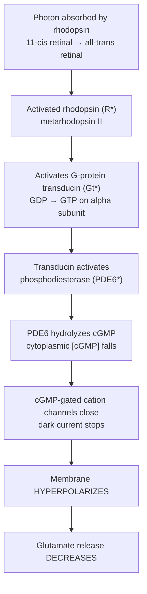
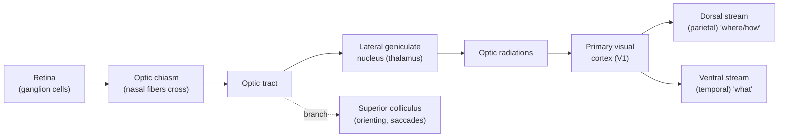
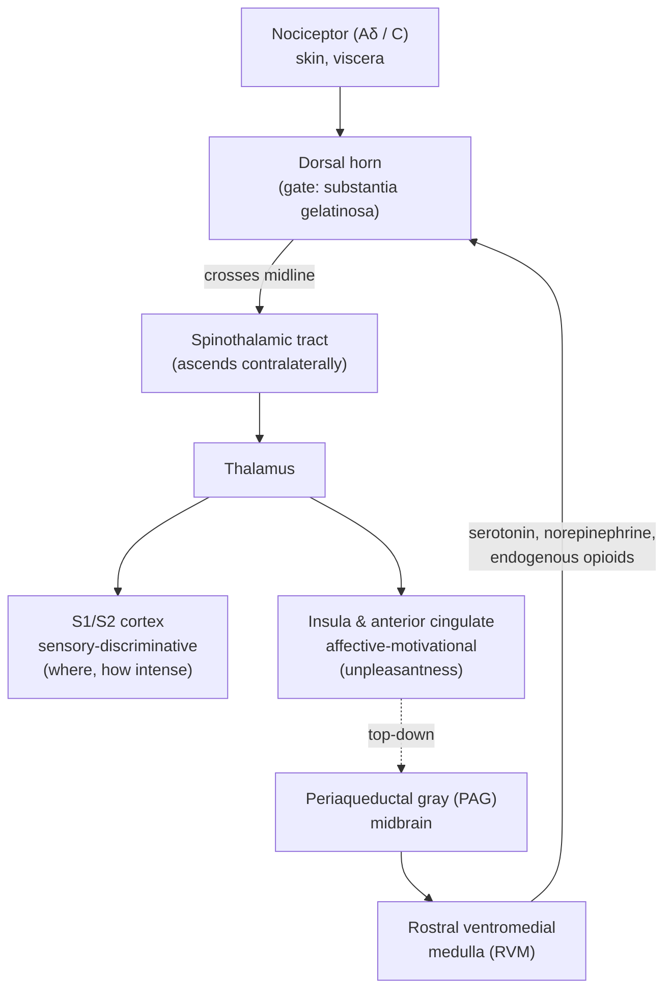

# Sensory Systems & Perception

*A technical reference on how the nervous system transduces physical energy into neural signals, and how those signals become the structured experience we call perception.*

## Introduction

Every perception begins as a physical event — photons striking pigment, air-pressure waves bending a membrane, a molecule docking in a receptor pocket, mechanical deformation of skin. None of these events is intrinsically a color, a tone, a smell, or a pain. The nervous system's first job in every sensory modality is **transduction**: converting one form of physical energy into the common currency of the brain, graded changes in membrane potential and, ultimately, trains of action potentials. Its second job is to *interpret* — to extract features, build maps, compare against expectation, and construct a usable model of the world. Perception is not a passive recording of the environment; it is an active, inferential process that the brain runs continuously, mostly beneath awareness.

Remarkably, the sensory systems, despite radically different peripheral hardware, obey a small set of shared organizing principles. Understanding those principles — transduction, the neural code, receptive fields, labeled lines, adaptation, topographic maps, parallel processing, hierarchical feature extraction, and predictive top-down modulation — makes each individual modality far easier to understand, because each is a variation on the same themes. This document develops those principles first, then works through vision, hearing, the body senses (touch, proprioception, pain), the chemical senses, and the vestibular system, closing with multisensory integration and perception as inference. A companion document covers the **motor** systems; here the focus is strictly sensory and perceptual.

## Table of Contents

1. [General Principles of Sensation](#1-general-principles-of-sensation)
2. [Vision](#2-vision)
3. [Hearing](#3-hearing)
4. [Somatosensation: Touch and Proprioception](#4-somatosensation-touch-and-proprioception)
5. [Pain and Nociception](#5-pain-and-nociception)
6. [The Chemical Senses: Smell and Taste](#6-the-chemical-senses-smell-and-taste)
7. [The Vestibular Sense and Balance](#7-the-vestibular-sense-and-balance)
8. [Multisensory Integration and Perception as Active Inference](#8-multisensory-integration-and-perception-as-active-inference)
9. [Sources](#sources)

---

## 1. General Principles of Sensation

### 1.1 The Common Pipeline: Stimulus → Transduction → Receptor Potential → Neural Code

Every sensory pathway can be described by the same skeleton:

1. **Stimulus.** A physical or chemical quantity — light intensity, sound pressure, skin indentation, chemical concentration, head acceleration.
2. **Transduction.** A specialized receptor cell or nerve ending converts that quantity into a change in membrane conductance. The molecular machinery differs by modality — a G-protein-coupled cascade in vision, smell, and most of taste; directly mechanically gated ion channels in hearing, touch, and the vestibular system — but the output is always the same: a change in ionic current.
3. **Receptor potential.** The conductance change produces a **graded** local depolarization or hyperpolarization whose amplitude scales with stimulus intensity. This is the generator potential. It is analog, not all-or-none.
4. **Neural code.** If the receptor cell is itself a neuron with an axon, the receptor potential modulates its firing rate; if it is a non-spiking receptor cell (photoreceptors, hair cells, most taste cells), the graded potential controls neurotransmitter release onto a primary afferent neuron, which then spikes. From here on the message travels as trains of action potentials.

### 1.2 What Gets Encoded: The Four Elementary Attributes

The nervous system must represent four things about any stimulus, and it uses distinct strategies for each:

- **Modality** (is this light, sound, or touch?) is encoded by the **labeled-line principle**: a given pathway is dedicated to a given modality, so activity in the optic nerve *means* light regardless of how it was produced. Pressing on the eyeball produces a visual sensation (a "phosphene") precisely because the retina's output line is labeled "vision." Modality is thus a property of *which* neurons fire, not *how* they fire.
- **Intensity** is encoded largely by **firing rate** (rate coding) and by **population size** (recruitment of more receptors as intensity grows). Stronger stimuli mean faster firing in each active neuron and more active neurons.
- **Location** is encoded by *which* receptors in a sensory sheet are active — the basis of the **topographic maps** discussed below — and, for some modalities, by comparisons across receptors (e.g., interaural timing in hearing).
- **Timing/duration** is encoded by *when* neurons fire relative to the stimulus and to each other. **Temporal coding** — information carried in the precise timing or synchrony of spikes rather than the average rate — is essential in hearing (phase-locking to sound waveforms) and contributes across modalities.

Most real signals are carried by **population codes**: the joint activity of many neurons, each broadly tuned, specifies the stimulus more precisely than any single unit could. Color, sound direction, and limb position are all read out from populations of coarsely tuned cells.

### 1.3 Receptive Fields

A neuron's **receptive field** is the region of sensory space (a patch of retina, a region of skin, a band of sound frequencies) within which a stimulus alters that neuron's firing. Receptive fields are the fundamental unit of sensory analysis. Two features recur:

- **Center-surround antagonism.** In vision and touch, receptive fields are often organized so that a stimulus in the center excites while a stimulus in the surround inhibits (or vice versa). This makes the neuron respond best not to uniform stimulation but to **contrast** — spatial differences, edges, borders. The circuit that implements it is **lateral inhibition**: active receptors suppress their neighbors, sharpening boundaries and producing perceptual effects like Mach bands.
- **Hierarchical elaboration.** As one ascends the pathway, receptive fields grow larger and their preferred stimuli grow more complex — from spots, to edges of a particular orientation, to shapes, to faces. This is **hierarchical feature extraction**.

### 1.4 Sensory Scaling: Weber–Fechner and Stevens

The relationship between physical intensity and perceived intensity is compressive, not linear, and this is one of the oldest quantitative laws in psychology.

- **Weber's law**: the smallest detectable change in a stimulus (the *just-noticeable difference*, JND) is a roughly constant *fraction* of the baseline stimulus (ΔI / I ≈ constant, the Weber fraction). You can detect a 1 g change against a 100 g weight but need a 10 g change against a 1000 g weight.
- **Fechner's law**: integrating Weber's law yields the claim that perceived magnitude grows as the *logarithm* of stimulus intensity (S = k · log I). Logarithmic compression lets a sensory system span an enormous dynamic range — the ear covers about 12 orders of magnitude of sound power — without saturating.
- **Stevens' power law** later refined this: perceived magnitude follows a *power* function of intensity (S = k · Iⁿ), with the exponent below 1 for compressive continua like brightness and loudness, but above 1 for electric shock, where perception grows faster than intensity. Power and logarithmic functions agree well over much of the mid-range.

The logic is adaptive: near-threshold signals warrant fine discrimination, while at high intensities absolute precision matters less than avoiding saturation. Both the peripheral machinery (e.g., logarithmic transduction) and central processing contribute to this compression.

### 1.5 Adaptation

**Adaptation** is the decline in responsiveness during a maintained stimulus. It ensures that sensory systems report *change* rather than steady state — you stop feeling your clothes, stop smelling a persistent odor, stop seeing a perfectly stabilized retinal image (which literally fades). Adaptation operates at every level, from bleaching of photopigment and channel inactivation in receptors, to synaptic depression, to central gain control.

Receptors are classically divided by their adaptation rate:

- **Rapidly (phasic) adapting** receptors fire at stimulus onset and offset and fall silent during a sustained stimulus; they signal *dynamic* change (e.g., Meissner and Pacinian corpuscles for flutter and vibration).
- **Slowly (tonic) adapting** receptors fire throughout a sustained stimulus; they signal *static* magnitude (e.g., Merkel cells for sustained pressure, muscle spindles for maintained length).

Adaptation is not fatigue; it is an active recalibration that keeps the system operating within its sensitive range as background conditions shift — the same principle by which the eye adjusts across a billion-fold range of ambient light.

### 1.6 Topographic Maps and Parallel Processing

Two structural principles pervade central sensory systems:

- **Topographic maps.** Neighboring receptors project to neighboring central neurons, preserving the spatial (or, in hearing, spectral) organization of the receptor sheet: **retinotopy** in vision, **tonotopy** in hearing, **somatotopy** in touch. These maps are typically distorted — magnifying behaviorally important regions (the fovea, the fingertips, the lips) at the expense of others, a distortion made vivid by the sensory homunculus.
- **Parallel processing.** A single stimulus is analyzed simultaneously by multiple, semi-independent channels tuned to different features — in vision, separate streams for form, color, and motion; in touch, separate channels for pressure, vibration, and texture. The brain does not process serially and then hand off; it decomposes the input into parallel feature streams that are only later re-bound into a unified percept. How this **binding** is achieved remains an open problem.

### 1.7 Top-Down and Predictive Processing

Sensation is not a one-way street from periphery to cortex. Every sensory relay receives massive **descending (feedback) projections** carrying expectations, attention, and context. The thalamus, the great sensory gateway to cortex, receives more synapses from cortex than from the sensory periphery. Increasingly, perception is understood as **active inference**: the brain maintains a generative model of the causes of its sensations and continuously predicts incoming input; what propagates forward is largely the **prediction error** — the mismatch between expected and actual signals. This framing (Section 8) reconciles a great deal, from illusions to attention to the sheer efficiency of neural coding.

---

## 2. Vision

Vision is the most studied sensory system and the template for many general principles. It begins with optics, transduces light in the retina, and elaborates the signal through a strikingly parallel and hierarchical cortical system.

### 2.1 The Eye as an Optical Instrument

Light is focused onto the retina by two refractive elements. The **cornea** provides most of the eye's fixed refractive power (roughly two-thirds); the **lens** provides variable power. **Accommodation** — focusing on near objects — is achieved when the ciliary muscle contracts, slackening the zonule fibers and allowing the elastic lens to bulge into a rounder, more powerful shape. The **iris** adjusts pupil diameter, trading light capture against depth of field and optical aberration. The image projected on the retina is inverted and reversed; the brain's interpretation, not the optics, restores its apparent orientation. Refractive errors (myopia, hyperopia, astigmatism, presbyopia) are mismatches between axial length, corneal curvature, and lens flexibility.

### 2.2 The Retina: A Piece of Brain in the Eye

The retina is displaced central nervous tissue. Counterintuitively, it is **inverted**: light must pass through the transparent inner layers (ganglion and bipolar cells) to reach the **photoreceptors** at the back, which sit against the pigment epithelium. The point where ganglion-cell axons exit as the optic nerve has no photoreceptors — the **blind spot**, which the brain fills in.

**Photoreceptors: rods and cones.** There are two classes, embodying a duplex design:

| Feature | Rods | Cones |
|---|---|---|
| Number (human) | ~120 million | ~6 million |
| Sensitivity | Very high; single-photon capable | Lower; need more light |
| Operating range | Scotopic (dim/night) | Photopic (bright/day) |
| Acuity | Low (high convergence) | High (low convergence, esp. fovea) |
| Color | Monochromatic (one pigment) | Trichromatic (S, M, L pigments) |
| Distribution | Peripheral retina | Concentrated in the fovea |

The **fovea** is a pit packed with cones and nearly devoid of rods, where overlying neurons are pushed aside for maximal acuity; it is the region of sharpest vision, onto which the eye is constantly steered by saccades. Rods dominate the periphery and night vision, which is why faint stars are seen better slightly off-center.

### 2.3 The Phototransduction Cascade

Phototransduction is one of the best-understood G-protein signaling pathways, and it has a counterintuitive sign: **light hyperpolarizes photoreceptors and reduces their transmitter release**. In darkness, photoreceptors are relatively depolarized and continuously release glutamate, sustained by a **dark current** — a steady inflow of Na⁺ and Ca²⁺ through cyclic-GMP-gated channels held open by high cytoplasmic cGMP.

The cascade, in rods, runs as follows:

Each step amplifies: one activated rhodopsin activates hundreds of transducins, and each PDE6 hydrolyzes thousands of cGMP molecules, so a single photon produces a detectable electrical response. **Recovery** requires shutting the cascade off (rhodopsin kinase and arrestin quench R*; the transducin GTP is hydrolyzed) and regenerating cGMP via guanylyl cyclase, whose activity is boosted as Ca²⁺ falls (channel closure stops Ca²⁺ entry). This **calcium feedback** is the core of light adaptation, resetting sensitivity as background light changes. The bleached all-trans retinal is recycled to 11-cis form through the **visual cycle** in the pigment epithelium.

### 2.4 Retinal Circuitry and Center-Surround Receptive Fields

Photoreceptors synapse onto **bipolar cells**, which synapse onto **ganglion cells**, whose axons form the optic nerve — a three-neuron vertical chain. Two classes of interneuron introduce lateral interactions: **horizontal cells** (at the photoreceptor–bipolar layer) and **amacrine cells** (at the bipolar–ganglion layer).

A pivotal split occurs at the bipolar cell. Because photoreceptors release glutamate in the *dark*, bipolar cells come in two flavors distinguished by their glutamate receptors:

- **ON bipolar cells** use a sign-inverting metabotropic receptor (mGluR6): glutamate inhibits them, so *light* (which reduces glutamate) *depolarizes* them.
- **OFF bipolar cells** use sign-conserving ionotropic receptors: light hyperpolarizes them.

This creates parallel **ON and OFF channels** that persist to the cortex, letting the system encode both brightening and darkening efficiently.

Lateral inhibition from horizontal cells builds the retina's signature **center-surround receptive field**. A typical **ON-center ganglion cell** is excited by light in the center of its field and inhibited by light in the surround; an **OFF-center** cell does the reverse. The consequence is that ganglion cells respond weakly to uniform illumination and strongly to **spatial contrast** — spots, edges, and borders. The retina thus transmits not a pixel map but a **contrast-and-change map**, an enormous data reduction (~120 million receptors to ~1 million ganglion axons).

Ganglion cells also form parallel functional streams — notably **magnocellular** (large, fast, motion- and contrast-sensitive, color-blind) and **parvocellular** (small, slow, high-acuity, color-opponent) — plus **koniocellular** channels and the intrinsically photosensitive **melanopsin** ganglion cells that drive the pupillary reflex and circadian entrainment rather than image-forming vision.

### 2.5 The Central Visual Pathway

At the **optic chiasm**, fibers from the nasal half of each retina cross to the opposite side while temporal fibers stay ipsilateral. The result is that everything in the **left visual field** (imaged on the right half of each retina) is represented in the **right hemisphere**, and vice versa — an orderly split that explains the specific field losses caused by lesions at different points along the pathway.

The **lateral geniculate nucleus (LGN)** of the thalamus is the main relay to cortex. It is a six-layered structure that keeps the magno-, parvo-, and koniocellular streams segregated and preserves **retinotopy** (a point-to-point map of the retina). Critically, the LGN receives far more feedback from cortex than feedforward input from the retina — an early sign that "relay" understates its role in gating and attention.

### 2.6 Primary Visual Cortex: Hubel & Wiesel

**V1** (striate cortex, area 17, in the occipital lobe) is where the retinal spot-detectors are transformed into detectors of oriented features. In work that won the 1981 Nobel Prize, **David Hubel and Torsten Wiesel** discovered that V1 neurons do not respond well to spots; they respond to **bars and edges of a specific orientation** moving through their receptive field. They described a functional hierarchy:

- **Simple cells** have receptive fields with distinct ON and OFF subregions and respond best to an oriented edge at a particular position — plausibly built by summing several aligned center-surround LGN inputs.
- **Complex cells** respond to an oriented edge anywhere within a larger field (position-invariant), and many prefer a particular direction of motion.

V1 is organized into **columns**: cells in a vertical penetration share a preferred **orientation**, and adjacent columns step smoothly through all orientations. Interleaved are **ocular dominance columns** (alternating left-eye/right-eye preference) and blob regions specialized for color. A full set of orientation and ocular-dominance columns covering one point in visual space forms a **hypercolumn** — a modular processing unit tiling the retinotopic map. This architecture is the canonical example of **hierarchical feature extraction** and of **topographic, modular** cortical organization. The famous demonstration that depriving one eye during a **critical period** permanently reshapes ocular-dominance columns established experience-dependent plasticity as a core developmental principle.

### 2.7 Two Cortical Streams: "What" and "Where/How"

Beyond V1, processing famously divides into two great cortical streams (Ungerleider & Mishkin; refined by Goodale & Milner):

- The **ventral stream** ("what") runs from V1 through V4 into the inferotemporal cortex and supports **object recognition** — form, color, faces, and the identity of things. Damage produces agnosias, including the inability to recognize faces (prosopagnosia).
- The **dorsal stream** ("where/how") runs from V1 into the posterior parietal cortex and supports **spatial localization and visually guided action** — reaching, grasping, and steering the body through space. Goodale and Milner reframed it as a "how" stream for the visual control of movement, distinct from conscious identification. Damage produces optic ataxia and, strikingly, dissociations in which a patient can accurately shape the hand to grasp an object she cannot consciously report the orientation of.

These streams are not sealed off from each other, but the division captures a real functional and anatomical fact and is a leading example of **parallel processing** at the cortical scale.

### 2.8 Color and Motion

**Color** is computed, not measured. It arises from comparing the outputs of three cone types — **S (short/blue), M (medium/green), and L (long/red)** — with overlapping absorption spectra (the **trichromatic** stage, Young–Helmholtz). No single cone "sees" a color; wavelength is inferred from the *ratio* of activations across the three types, a population code. Downstream, signals are recoded into **opponent** channels (Hering): red-vs-green, blue-vs-yellow, and black-vs-white. Opponency explains why we never see reddish-green, why staring at red yields a green afterimage, and why color appears roughly constant across changing illumination (**color constancy**), a computation elaborated in area **V4**. The two theories are not rivals but successive stages: trichromatic at the receptors, opponent in the circuitry.

**Motion** is extracted by direction-selective neurons that compare a stimulus's position across time, prominent already in V1 complex cells and specialized in area **MT/V5** of the dorsal stream. Lesions of MT can produce **akinetopsia**, in which the world is seen as a series of frozen snapshots — a clean demonstration that motion is a separable, dedicated computation.

### 2.9 Visual Illusions as Windows into Processing

Illusions are not failures; they are the visible signature of the brain's inferential machinery caught making an assumption. They reveal the priors and shortcuts the visual system uses:

- **Mach bands** and the **Hermann grid** expose lateral inhibition and center-surround receptive fields, exaggerating contrast at edges.
- **Simultaneous contrast** and **color afterimages** reveal opponent-process coding.
- The **Ponzo, Müller-Lyer, and Ames-room** illusions expose the depth and size-constancy assumptions the brain applies to a flat retinal image.
- **Bistable figures** (Necker cube, face/vase) show perception as an active choice between competing hypotheses about ambiguous data.
- **The checker-shadow illusion** shows the brain "discounting the illuminant" to recover surface reflectance, sacrificing veridical luminance for a more useful estimate of the object.

Each illusion works because the system is optimizing for the statistics of the natural world, not for accuracy on artificial displays — exactly what one expects if perception is inference (Section 8).

---

## 3. Hearing

Audition converts minute, fast pressure fluctuations in air into neural signals, achieving extraordinary sensitivity and temporal precision. Its central trick is a **mechanical frequency analyzer** — the cochlea — that lays out sound frequency in space.

### 3.1 From Air to Fluid: The Impedance-Matching Middle Ear

Sound waves funneled by the pinna vibrate the **tympanic membrane** (eardrum). Because the inner ear is fluid-filled and fluid resists motion far more than air, transmitting sound directly from air to fluid would reflect ~99.9% of the energy. The three **ossicles** (malleus, incus, stapes) solve this **impedance-matching** problem: they concentrate force from the large eardrum onto the small **oval window**, boosting pressure enough to drive the cochlear fluid efficiently. The middle-ear muscles also provide a protective reflex against loud sounds.

### 3.2 The Cochlea and the Basilar Membrane

The **cochlea** is a coiled, fluid-filled tube divided lengthwise by the **basilar membrane**, on which sits the **organ of Corti** containing the sensory **hair cells**. When the stapes drives the oval window, it launches a **traveling wave** along the basilar membrane. The membrane's mechanics vary systematically along its length: it is **narrow and stiff at the base** (near the oval window) and **wide and floppy at the apex**. Consequently:

- **High frequencies** produce peak vibration near the **base**.
- **Low frequencies** travel farther and peak near the **apex**.

This place-based frequency map is **tonotopy** — the auditory analog of retinotopy — and it is preserved all the way to the auditory cortex. The traveling wave is not merely passive: **outer hair cells** actively amplify and sharpen the peak (the "cochlear amplifier," involving the motor protein prestin), giving the mammalian ear its sensitivity and sharp frequency tuning. Damage to outer hair cells (e.g., from noise or ototoxic drugs) degrades this active process and is a common cause of hearing loss. Otoacoustic emissions — sounds the healthy cochlea itself produces — are direct evidence of this active mechanism.

### 3.3 Hair Cells and Mechanotransduction

Hair cells transduce mechanical motion into electrical signals with sub-microsecond speed, far too fast for any second-messenger cascade — so transduction is **direct and mechanical**. Each hair cell bears a bundle of **stereocilia** arranged in a staircase of increasing height, linked at their tips by fine protein filaments called **tip links** (built from cadherin-23 and protocadherin-15).

When the basilar membrane vibrates, the hair bundle shears against the overlying **tectorial membrane**, deflecting the stereocilia:

- Deflection **toward the tallest** stereocilia increases tip-link tension, mechanically **opening** transduction channels → **depolarization**.
- Deflection **toward the shortest** slackens the links, closing channels → **hyperpolarization**.

The ionic environment makes this efficient and unusual. The stereocilia bathe in **endolymph**, a fluid rich in **K⁺** and held at a positive **endocochlear potential** (~+80 mV) by the **stria vascularis**. Open transduction channels therefore admit **K⁺** (not the usual Na⁺/Ca²⁺) down a steep electrochemical gradient, depolarizing the cell. Depolarization opens basal Ca²⁺ channels and triggers graded **glutamate** release onto **spiral ganglion** afferent fibers, whose axons form the **auditory nerve**. Because hair-cell receptor potentials are graded and fast, they can follow the sound waveform cycle by cycle at low frequencies.

### 3.4 The Neural Code for Pitch and Loudness

Two codes for frequency coexist:

- **Place code**: which part of the tonotopic map is most active signals frequency. This dominates at high frequencies.
- **Temporal code / phase locking**: auditory-nerve fibers fire in synchrony with a particular phase of the sound wave, so the *timing* of spikes encodes frequency directly. This dominates at low frequencies (up to ~1–4 kHz, beyond which neurons cannot fire fast enough to track individual cycles). The **volley principle** — groups of fibers taking turns firing on successive cycles — extends the useful range of temporal coding.

**Loudness** is coded by firing rate and by the number of active fibers (recruitment), consistent with the general intensity principle.

### 3.5 The Central Auditory Pathway and Sound Localization

The ascending pathway is more relayed and more crossed than the visual one: **auditory nerve → cochlear nucleus → superior olivary complex → inferior colliculus → medial geniculate nucleus (thalamus) → primary auditory cortex (A1)** in the temporal lobe. Because signals cross at multiple levels, each side of the brain hears both ears, which is essential for localization. A1 preserves tonotopy as an orderly map of frequency.

**Sound localization** in the horizontal plane exploits the fact that we have two ears separated in space, and is computed in the **superior olivary complex**:

- **Interaural time differences (ITDs)** — a sound from the left reaches the left ear microseconds sooner — are computed in the **medial superior olive** and dominate for **low frequencies**.
- **Interaural level differences (ILDs)** — the head casts an acoustic "shadow," making the far ear's signal quieter — are computed in the **lateral superior olive** and dominate for **high frequencies**.

This split is the **duplex theory** of localization. Vertical localization and front/back disambiguation rely instead on **spectral cues** imposed by the folds of the pinna. Sound localization is a beautiful case of a computation that depends entirely on *comparing across receptors* rather than on any single receptor's output.

---

## 4. Somatosensation: Touch and Proprioception

Somatosensation is not one sense but a family: discriminative touch, vibration, pressure, temperature, proprioception (body position), and pain (Section 5). They share peripheral receptors in skin, muscle, and joints, and they travel to the brain by two anatomically and functionally distinct spinal pathways.

### 4.1 Cutaneous Mechanoreceptors

Four principal low-threshold mechanoreceptors tile the skin, differing in receptive-field size and adaptation rate — the two axes that together specify a division of labor:

| Receptor | Adaptation | Receptive field | Best stimulus |
|---|---|---|---|
| **Merkel cells** (SA I) | Slow | Small, sharp | Sustained pressure, edges, form, texture (fine spatial detail) |
| **Ruffini endings** (SA II) | Slow | Large, diffuse | Skin stretch, finger position, grip |
| **Meissner corpuscles** (RA I) | Rapid | Small, sharp | Light touch, low-frequency flutter (~5–50 Hz), slip detection |
| **Pacinian corpuscles** (RA II) | Rapid | Large, diffuse | High-frequency vibration (~100–300 Hz); tool/texture sensing |

**Two-point discrimination** is finest where small-field receptors are dense (fingertips, lips) and coarse where they are sparse (back) — a peripheral fact that the cortical map then magnifies. Together these four channels illustrate **parallel processing** within a single sense: form, flutter, vibration, and stretch each ride a partly separate line. Innocuous touch signals travel centrally on large-diameter, myelinated, fast-conducting **Aβ fibers**.

### 4.2 Proprioception

Proprioception — the largely unconscious sense of the body's own configuration and movement — arises from specialized receptors in muscles and joints:

- **Muscle spindles** lie in parallel with muscle fibers and signal **muscle length and its rate of change** (stretch). They are the sensory limb of the stretch reflex and the primary source of position and movement sense.
- **Golgi tendon organs** lie in series at the muscle–tendon junction and signal **muscle tension (force)**.
- **Joint receptors** and Ruffini endings contribute information about joint angle and skin stretch.

Proprioceptive signals let us know where our limbs are with eyes closed, and their loss (as in rare large-fiber sensory neuropathies) is devastating: without it, coordinated movement collapses even though muscle strength is intact. Proprioception rides the same fast dorsal-column pathway as fine touch.

### 4.3 The Two Ascending Pathways

Somatosensory information reaches the cortex by two segregated systems that differ in modality, speed, and where they cross — a distinction with major clinical consequences.

- **Dorsal column–medial lemniscal pathway** carries **fine (discriminative) touch, vibration, and proprioception**. Large myelinated afferents ascend *ipsilaterally* in the dorsal columns of the spinal cord, synapse in the dorsal-column nuclei of the **medulla**, and only there cross to the other side, ascending as the medial lemniscus to the thalamus (VPL). It is fast and preserves fine spatial and temporal detail.
- **Anterolateral (spinothalamic) pathway** carries **pain, temperature, and crude touch**. Small afferents synapse in the **dorsal horn** immediately on entering the cord, and the second-order neuron crosses *within a segment or two* and ascends contralaterally. It is slower and coarser.

Because the two systems cross at different levels, a one-sided spinal cord lesion produces the characteristic **Brown-Séquard** dissociation: loss of touch/proprioception on the *same* side as the lesion (dorsal columns, not yet crossed) but loss of pain/temperature on the *opposite* side (spinothalamic, already crossed). This dissociation is a direct anatomical readout of the two-pathway design.

### 4.4 Somatosensory Cortex and the Homunculus

Both pathways relay through the thalamus to the **primary somatosensory cortex (S1)** in the postcentral gyrus of the parietal lobe. S1 contains an orderly **somatotopic map** — the **sensory homunculus** — in which adjacent body parts map to adjacent cortex. The map is grossly **distorted**: the amount of cortex devoted to a body part reflects its **receptor density and behavioral importance**, not its physical size. The hands, lips, and tongue command vast territories; the trunk and legs, little. This **cortical magnification** is the touch analog of the foveal magnification in vision. Crucially, the homunculus is **plastic**: amputation or intensive use reorganizes the map, and cross-wiring after amputation contributes to **phantom limb** sensations. As in vision, receptive fields enlarge and grow more complex from S1 onward, supporting perception of texture, shape, and stereognosis (recognizing objects by touch).

---

## 5. Pain and Nociception

Pain deserves its own treatment because it is the sensory system where the gap between the physical signal and the conscious experience is widest, and where top-down modulation is most dramatic. A central distinction organizes everything that follows: **nociception is not pain**.

### 5.1 Nociception vs. the Experience of Pain

**Nociception** is the neural process of detecting and encoding noxious (potentially tissue-damaging) stimuli — a peripheral and spinal signaling event that can occur even under anesthesia or in a decerebrate animal. **Pain**, by the definition of the International Association for the Study of Pain, is *"an unpleasant sensory and emotional experience associated with, or resembling that associated with, actual or potential tissue damage."* Pain is a conscious construction of the brain, shaped by attention, expectation, mood, context, and meaning. The two can dissociate in both directions: soldiers and athletes sustain severe injuries with little pain in the moment, while chronic pain can persist with no detectable tissue damage at all. Pain is an *inference about threat*, not a direct readout of tissue state — a point the modern framework of pain neuroscience emphasizes.

### 5.2 Nociceptors and Fiber Types

**Nociceptors** are free nerve endings of primary afferents whose ion channels (notably the TRP family — **TRPV1** for noxious heat and capsaicin, **TRPM8** for cold and menthol, plus acid-sensing channels and mechanically gated channels) open only at intensities approaching the damage threshold. They are **high-threshold** by design. Their signals travel on two fiber classes that give pain its characteristic double structure:

| Fiber | Myelination | Conduction | Sensation |
|---|---|---|---|
| **A-delta (Aδ)** | Thinly myelinated | Fast (~5–30 m/s) | **First pain**: sharp, pricking, well-localized |
| **C fibers** | Unmyelinated | Slow (~0.5–2 m/s) | **Second pain**: dull, burning, aching, diffuse |

Stub your toe and you feel the two waves in sequence — a sharp jab (Aδ), then a spreading ache a moment later (C). Both synapse in the **dorsal horn** of the spinal cord and feed the ascending **spinothalamic (anterolateral)** pathway. **Sensitization** — a lowering of nociceptor thresholds by inflammatory mediators (peripheral sensitization) and an amplification of dorsal-horn responsiveness (central sensitization) — makes injured tissue tender (hyperalgesia) and can make normally innocuous touch painful (allodynia).

### 5.3 The Gate Control Theory

In 1965, **Ronald Melzack and Patrick Wall** proposed the **gate control theory**, which transformed pain from a simple hard-wired alarm into a *modulated* signal and explained why rubbing a bumped elbow helps. The core idea: transmission of nociceptive signals from the dorsal horn to the brain is regulated by a "gate" in the **substantia gelatinosa** of the dorsal horn, set by the balance of activity across fiber types.

- Activity in large-diameter, non-nociceptive **Aβ (touch) fibers** *excites* inhibitory interneurons that **close the gate**, dampening transmission of pain to the projection ("transmission") cells — hence rubbing, massage, and TENS units reduce pain.
- Activity in small-diameter **C and Aδ nociceptors** *inhibits* those interneurons, **opening the gate** and facilitating transmission.

Whether pain reaches consciousness thus depends on the *competition* between touch and nociceptive input at the spinal level, plus descending influences from the brain (below). Though details of the original circuit have been revised, the theory's central insight — that pain is gated and modulated, not simply relayed — is foundational.

### 5.4 Ascending Pathways and Descending Modulation

Ascending nociceptive signals split into two functional dimensions in the brain — the reason pain has both a "how much / where" quality and a "how awful" quality:

- A **sensory-discriminative** dimension (location, intensity, quality) mapped in **S1/S2** somatosensory cortex.
- An **affective-motivational** dimension (the suffering, the urge to escape) served by the **anterior cingulate cortex** and **insula**.

Crucially, the brain **modulates** pain descending. The **periaqueductal gray (PAG)** of the midbrain, via the **rostral ventromedial medulla (RVM)**, sends projections down to the dorsal horn that release **endogenous opioids (endorphins/enkephalins), serotonin, and norepinephrine**, suppressing nociceptive transmission at the gate. This endogenous analgesia system is engaged by stress, attention, expectation, and **placebo** (naloxone, an opioid antagonist, can block placebo analgesia — direct evidence that expectation recruits real opioid circuitry). It is also where opioid drugs act. Descending control can also *facilitate* pain, tilting the system toward hypersensitivity.

### 5.5 Chronic Pain

**Acute** pain is protective — a useful alarm proportional to threat. **Chronic pain** (persisting beyond normal healing, conventionally >3 months) is increasingly understood as a pathology of the pain *system* rather than an ongoing report of tissue damage. Mechanisms include **central sensitization** (lasting amplification and synaptic plasticity in dorsal-horn and brain circuits — a maladaptive cousin of learning), loss of descending inhibition, glial activation and neuroinflammation, and cortical reorganization. In many chronic-pain conditions (fibromyalgia, many low-back and neuropathic pains) nociceptive input is minimal or absent, yet pain is real and severe because the *processing* is altered — the alarm has become decoupled from the fire. This reframing, sometimes called **nociplastic pain**, has reoriented treatment toward the nervous system's gain and its top-down set-points (via pain neuroscience education, graded exposure, and centrally acting therapies) rather than the periphery alone.

---

## 6. The Chemical Senses: Smell and Taste

Smell (olfaction) and taste (gustation) detect molecules rather than physical energy. They are evolutionarily ancient, deeply tied to emotion and memory, and together they create the unified experience we loosely call "flavor."

### 6.1 Olfaction

**Olfactory sensory neurons** sit in the olfactory epithelium high in the nasal cavity, their cilia bathed in mucus where odorant molecules dissolve and bind. Each neuron expresses **just one** type of **olfactory receptor** — a G-protein-coupled receptor — from a repertoire of roughly **400 functional receptor genes in humans** (the largest gene family in the genome; the discovery of this family earned **Linda Buck and Richard Axel** the 2004 Nobel Prize). Odorant binding activates the G-protein **Golf**, which raises cAMP, opens cyclic-nucleotide-gated channels, and depolarizes the neuron — a cascade structurally analogous to phototransduction.

The coding scheme is **combinatorial**: each receptor responds to many odorants, and each odorant activates a particular *combination* of receptors, so ~400 receptor types can distinguish an enormous number of odors (estimates range widely, into the thousands or more). Two features make olfaction unusual:

- **Convergence and glomeruli.** All neurons expressing the same receptor — scattered across the epithelium — send their axons to the **same one or two glomeruli** in the **olfactory bulb**. Odor identity is thus rendered as a spatial pattern of activated glomeruli, a chemical map.
- **Direct limbic access.** Olfaction is the only sense that reaches the cortex **without an obligatory thalamic relay**. From the bulb, projections go directly to the **primary olfactory (piriform) cortex** and straight into the **amygdala and entorhinal/hippocampal** regions. This near-direct wiring to emotion and memory circuits explains the extraordinary, involuntary power of smells to evoke vivid emotional memories (the "Proustian" phenomenon) and their tight link to appetite and disgust. Olfaction also adapts strongly and rapidly — a persistent smell fades within minutes.

### 6.2 Taste (Gustation)

Taste proper detects a small number of qualities from molecules in food, sensed by **taste receptor cells** clustered in **taste buds** on the tongue and palate. There are **five basic tastes**, each with a distinct transduction logic — a textbook illustration of **labeled-line** coding at the receptor:

| Taste | Adaptive signal | Receptor / mechanism |
|---|---|---|
| **Sweet** | Energy (sugars) | GPCR heterodimer **T1R2 + T1R3** |
| **Umami** | Amino acids/protein (glutamate) | GPCR heterodimer **T1R1 + T1R3** |
| **Bitter** | Toxins (aversive) | **T2R** family (~25 GPCRs) |
| **Salty** | Electrolytes (Na⁺) | Epithelial Na⁺ channel **ENaC** (Na⁺ enters directly) |
| **Sour** | Acids/spoilage (H⁺) | Proton channel **OTOP1** (identified 2018) |

The three GPCR-mediated tastes (sweet, umami, bitter) share a common downstream cascade: receptor → G-protein (including **gustducin**) → **PLCβ2** → IP₃ → Ca²⁺ release → opening of the **TRPM5** channel → depolarization → **ATP release** (through CALHM1 channels) as the transmitter onto gustatory afferents. Salty and sour instead use ion channels that let the relevant ions (Na⁺, H⁺) enter directly. There is a rough regional bias across the tongue but no strict "tongue map" — all qualities are detectable across the tongue.

Taste is deliberately **low-resolution** — five channels, not thousands — because its job is a coarse but urgent **go/no-go** judgment: energy and protein are attractive (sweet, umami), toxins and spoilage are aversive (bitter, sour), and salt tracks electrolyte need. The rich perception of **flavor** is a **multisensory** construct combining taste with **retronasal olfaction** (smell of food from the back of the mouth), texture, temperature, and the trigeminal chemesthesis of chili (capsaicin/TRPV1) and mint (menthol/TRPM8) — which is why food is nearly flavorless when the nose is blocked. Taste afferents travel via cranial nerves VII, IX, and X to the nucleus of the solitary tract, then the thalamus, and on to the **gustatory (insular) cortex**.

---

## 7. The Vestibular Sense and Balance

The vestibular system reports the position and motion of the head in space — the silent sense we notice only when it fails (vertigo, motion sickness). It shares the inner ear and the hair-cell transduction machinery of hearing, repurposed to detect the head's own movements rather than external sound.

### 7.1 The Vestibular Organs

Adjacent to the cochlea, the **vestibular labyrinth** contains five sensory organs on each side that split the job of motion sensing between rotation and linear force:

- **Three semicircular canals** (horizontal, anterior, posterior), oriented in roughly orthogonal planes, detect **angular (rotational) acceleration** — head turns and nods. Each canal ends in a swelling, the **ampulla**, containing a gelatinous **cupula** with embedded hair cells. When the head rotates, the endolymph inside the canal lags by inertia, deflecting the cupula and bending the hair bundles. The three-canal, two-sided arrangement lets rotation about any axis be decomposed and localized.
- **Two otolith organs**, the **utricle** and **saccule**, detect **linear acceleration and static head tilt (gravity)**. Their sensory patches (**maculae**) are capped by a gelatinous membrane studded with tiny calcium-carbonate crystals, the **otoconia (otoliths)**. Because these crystals are denser than the surrounding fluid, gravity and linear acceleration drag them, shearing the hair bundles beneath. The **utricle** is oriented to sense mainly **horizontal** acceleration; the **saccule**, mainly **vertical**. Dislodged otoconia drifting into a canal cause benign paroxysmal positional vertigo (BPPV).

Vestibular hair cells transduce exactly like cochlear ones: bundle deflection toward the tallest stereocilium (here a true **kinocilium**) opens mechanotransduction channels and depolarizes; deflection the other way hyperpolarizes. They fire at a **high resting rate**, so head movement is encoded as a *bidirectional* modulation — increases and decreases from baseline — allowing a single organ to signal both directions of motion.

### 7.2 Central Vestibular Function

Signals travel via the vestibular nerve (part of cranial nerve VIII) to the **vestibular nuclei** in the brainstem and to the **cerebellum**. From there the system drives three functions essential to stable perception and posture:

- The **vestibulo-ocular reflex (VOR)** rotates the eyes opposite to head movement to **stabilize gaze**, keeping the visual world steady during head motion. Its remarkable speed and accuracy is why text stays readable as you shake your head — but blurs if you instead move the page at the same rate.
- **Postural reflexes** adjust body and neck muscles to keep balance.
- **Spatial orientation**, the felt sense of upright and of self-motion, integrates vestibular input with vision and proprioception.

Balance is therefore inherently **multisensory**: it fuses vestibular, visual, and proprioceptive signals. When these disagree — as when the vestibular organs sense motion the eyes do not (reading in a moving car) — the conflict produces **motion sickness**, one of the clearest everyday demonstrations that the brain is constantly cross-checking its senses against a single internal model.

---

## 8. Multisensory Integration and Perception as Active Inference

The senses are separated for analysis but reunited for perception. The brain **integrates** across modalities to build a single, coherent estimate of the world, and it does so in a way that is close to statistically optimal.

### 8.1 Multisensory Integration

Downstream of the primary sensory areas, association regions (superior temporal sulcus, parietal cortex) and subcortical hubs (the **superior colliculus**) contain neurons driven by more than one sense. Integration follows sensible rules — inputs that coincide in **time and space** get combined and mutually enhance one another. The brain weights each sense by its **reliability**: vision usually dominates spatial judgments (it is spatially precise), while audition dominates timing. Classic illusions expose the machinery:

- The **McGurk effect** — seeing lips say "ga" while hearing "ba" yields the percept "da" — shows vision reshaping what we *hear*.
- **Ventriloquism** — a voice captured by a moving puppet — shows vision capturing the perceived *location* of sound.
- The **rubber-hand illusion** — synchronous stroking of a fake hand and one's hidden real hand makes the fake feel like one's own — shows vision and touch rewriting the sense of body ownership.

Each is the visible outcome of the brain combining cues by their reliability rather than reporting any one channel faithfully — the same optimal-cue-combination logic that governs balance and flavor.

### 8.2 Perception as Active Inference

These findings converge on a unifying view: **perception is inference**. The brain does not passively transcribe sense data; it maintains an internal **generative model** of the world's causes and uses incoming signals to test and update that model. In the **predictive coding / active inference** framework, higher levels continuously send **predictions** down to lower sensory levels, which return only the **prediction error** — the part of the input that was *not* expected. Perception is the brain's best current hypothesis, revised by error signals; **attention** is the up-weighting of the precision (reliability) of selected prediction errors.

This account ties the whole document together. It explains why the thalamus and every sensory relay carry more feedback than feedforward wiring; why expectation and context so powerfully shape what we perceive; why **illusions** occur (the brain's priors overriding ambiguous or artificial data); why the same nociceptive input can yield very different **pain** depending on meaning and expectation; and why perception is **constructive** and predictive rather than a camera-like recording. Sensation supplies the evidence; perception is the inference the brain draws from it — a controlled, continuously corrected hallucination that usually, and adaptively, matches the world.

---

## Sources

- [Neuroscience (NCBI Bookshelf, Purves et al.) — Phototransduction](https://www.ncbi.nlm.nih.gov/books/NBK10806/)
- [Webvision (NCBI) — Phototransduction in Rods and Cones](https://www.ncbi.nlm.nih.gov/books/NBK52768/)
- [Photoreceptor phosphodiesterase (PDE6): activation and inactivation (PMC)](https://pmc.ncbi.nlm.nih.gov/articles/PMC8376765/)
- [Neuroscience (NCBI Bookshelf) — Odorant Receptors and Olfactory Coding](https://www.ncbi.nlm.nih.gov/books/NBK10824/)
- [The Neurobiology of Olfaction — Odorant Receptors (NCBI Bookshelf)](https://www.ncbi.nlm.nih.gov/books/NBK55985/)
- [Principles of Glomerular Organization in the Human Olfactory Bulb (PMC)](https://www.ncbi.nlm.nih.gov/pmc/articles/PMC2440537/)
- [The receptors and cells for mammalian taste (review)](https://pmc.ncbi.nlm.nih.gov/articles/PMC4764331/)
- [Transient Receptor Potential (TRP) Channels and Taste Sensation (PMC)](https://pmc.ncbi.nlm.nih.gov/articles/PMC2876190/)
- [Otopetrin-1: A sour-tasting proton channel (PMC)](https://pmc.ncbi.nlm.nih.gov/articles/PMC5839727/)
- [Sour taste: receptors, cells and circuits (PMC)](https://pmc.ncbi.nlm.nih.gov/articles/PMC7943026/)
- [Potassium Ion Movement in the Inner Ear (PMC)](https://pmc.ncbi.nlm.nih.gov/articles/PMC4415853/)
- [Hair cell — mechanotransduction and tip links (Wikipedia overview with primary refs)](https://en.wikipedia.org/wiki/Hair_cell)
- [Stiffness and tension gradients of the hair cell's tip-link complex (PMC)](https://www.ncbi.nlm.nih.gov/pmc/articles/PMC6464607/)
- [Gate Control Theory of Pain (Physiopedia)](https://www.physio-pedia.com/Gate_Control_Theory_of_Pain)
- [Descending Pain Modulation — PAG-RVM system (USC Ostrow wiki)](https://wiki.ostrowonline.usc.edu/en/Descending-Pain-Modulated)
- [Vestibular System — Introduction to Neuroscience (MSU OpenBooks)](https://openbooks.lib.msu.edu/introneuroscience1/chapter/vestibular-system/)
- [Physiology of the Otolith Organs (Interacoustics)](https://www.interacoustics.com/academy/balance-testing-training/videonystagmography/otolith-organs)
- [International Association for the Study of Pain — Definition of Pain](https://www.iasp-pain.org/resources/terminology/)
