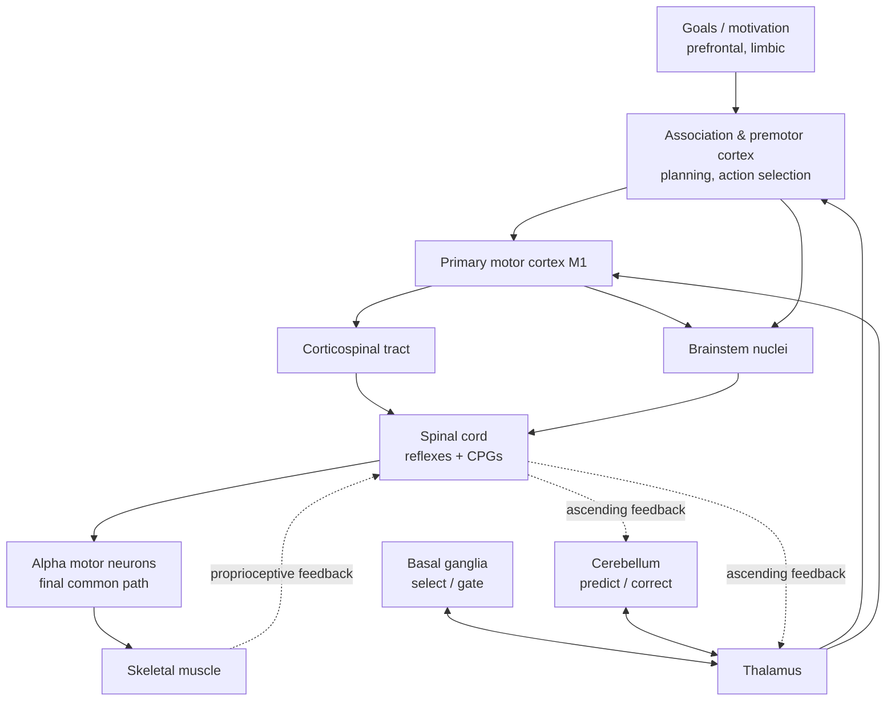
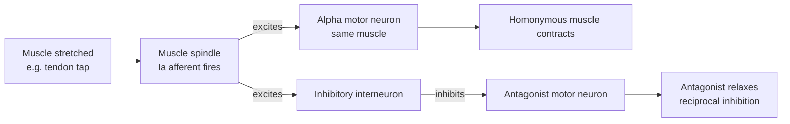
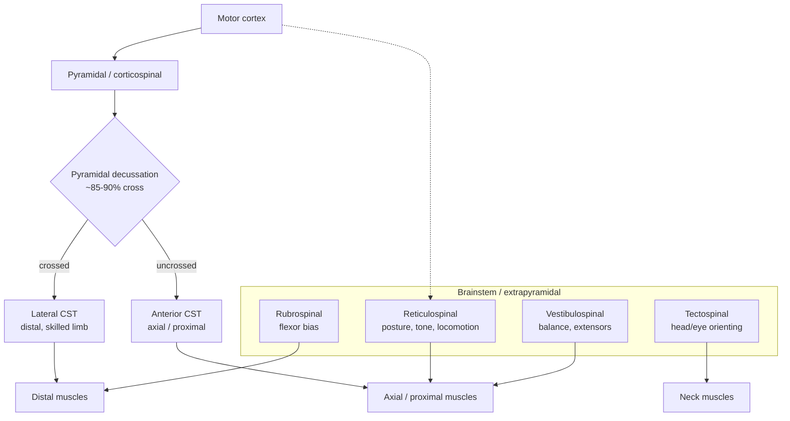
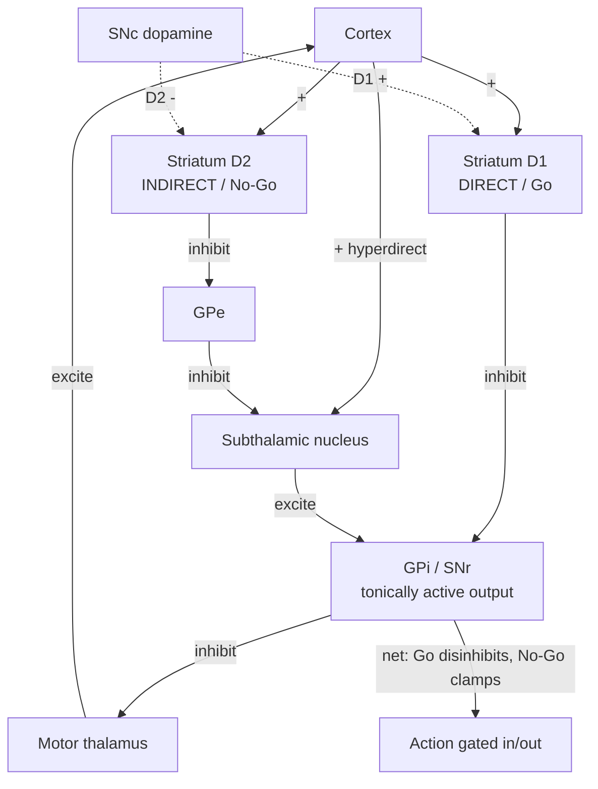

# Motor Systems and the Control of Action

A technical reference on how the nervous system produces movement: from the single motor unit that shortens a muscle, through the spinal circuits that generate reflexes and locomotor rhythms, to the descending pathways, cortical maps, basal ganglia loops, and cerebellar internal models that plan, select, calibrate, and correct action. The organizing theme is that motor control is neither a simple chain of command nor a single controller, but a **hierarchical and parallel** system in which prediction is as important as reaction.

## Introduction

Every movement — reaching for a cup, keeping your balance on a moving train, speaking a sentence — is the output of a distributed control system that must solve hard problems in real time. Muscles are slow, noisy actuators; sensory feedback arrives tens to hundreds of milliseconds late; the same goal (grasp the cup) can be met by an infinite number of joint configurations; and the mechanical consequences of a motor command depend on the current state of the limb and the world. The motor system copes with this by combining three strategies.

First, **hierarchy**: high-level areas specify goals and abstract plans, while lower levels translate them into muscle activations and handle the details. Second, **parallelism**: multiple descending pathways and multiple subcortical loops (basal ganglia, cerebellum) act on the spinal machinery simultaneously and semi-independently, so control is not a single bottleneck. Third, **prediction**: rather than waiting for feedback, the brain builds *internal models* that anticipate the sensory consequences of its own commands, allowing fast, feedforward control and rapid detection of error.

A recurring and important correction to the naive picture runs through this document: the mapping from neurons to muscles to movements is not one-to-one at any level. A single cortical neuron does not command a single muscle; a movement direction is read out from a *population*; the basal ganglia and cerebellum do not "issue" movements but modulate and calibrate them. Keeping this distributed, predictive character in mind is the key to understanding the system mechanistically.

## Table of Contents

- [1. The Motor Hierarchy: Hierarchical and Parallel Control](#1-the-motor-hierarchy-hierarchical-and-parallel-control)
- [2. The Motor Unit, Neuromuscular Junction, and the Size Principle](#2-the-motor-unit-neuromuscular-junction-and-the-size-principle)
- [3. Spinal Control: Reflexes, Proprioception, and Central Pattern Generators](#3-spinal-control-reflexes-proprioception-and-central-pattern-generators)
- [4. Descending Pathways](#4-descending-pathways)
- [5. Motor Cortex: M1, Premotor, SMA, and Parietal Contributions](#5-motor-cortex-m1-premotor-sma-and-parietal-contributions)
- [6. The Basal Ganglia: Selection and Gating](#6-the-basal-ganglia-selection-and-gating)
- [7. The Cerebellum: Internal Models and Error-Based Correction](#7-the-cerebellum-internal-models-and-error-based-correction)
- [8. Feedforward vs Feedback Control and Internal Models](#8-feedforward-vs-feedback-control-and-internal-models)
- [9. Motor Learning and Sensorimotor Adaptation](#9-motor-learning-and-sensorimotor-adaptation)
- [10. Voluntary Action and Its Initiation](#10-voluntary-action-and-its-initiation)
- [11. Summary](#11-summary)
- [Sources](#sources)

---

## 1. The Motor Hierarchy: Hierarchical and Parallel Control

It is useful to imagine the motor system as three broad levels, with the caveat that the levels overlap heavily and constantly exchange information.

- **Spinal cord (lowest level).** The "final common path." Alpha motor neurons in the ventral horn are the only route by which the CNS reaches skeletal muscle — Sherrington's term. The spinal cord is not a passive relay: it contains complete reflex circuits and central pattern generators capable of producing coordinated, rhythmic output on its own.
- **Brainstem (middle level).** Nuclei in the medulla, pons, and midbrain integrate vestibular, visual, and cortical inputs to control posture, balance, locomotor initiation, orienting of the head and eyes, and gross axial/proximal movement. They give rise to several descending pathways.
- **Motor cortex and associated cortex (highest level).** Primary motor cortex (M1), premotor and supplementary motor areas, and parietal cortex plan, select, and command voluntary movement, largely through the corticospinal tract, and also by reconfiguring the brainstem and spinal machinery below.

Overlaid on this vertical hierarchy are two great **side loops** that do not lie "in series" in the descending path but modulate cortex through the thalamus:

- The **basal ganglia**, which gate and select actions.
- The **cerebellum**, which calibrates timing, coordination, and predictive accuracy.

The essential idea is **hierarchical + parallel control**. Hierarchical, because abstract goals are progressively transformed into concrete muscle commands, and each level handles the problems best solved at its own spatial and temporal grain (the spinal cord closes fast local loops; cortex handles context and goals). Parallel, because at any given level several structures act at once: multiple descending tracts converge on the same spinal neurons, and the basal ganglia and cerebellum operate simultaneously through separate cerebello-thalamo-cortical and basal ganglia-thalamo-cortical circuits. This architecture provides speed (low levels react without waiting for the top), robustness (no single bottleneck), and flexibility (high levels can override or reconfigure reflexes when needed).

---

## 2. The Motor Unit, Neuromuscular Junction, and the Size Principle

### The motor unit

The fundamental quantum of movement is the **motor unit**: a single alpha motor neuron together with all the muscle fibers it innervates. When the motor neuron fires, every fiber in its unit contracts — the unit is all-or-none. The number of fibers per unit (the **innervation ratio**) sets the granularity of force control: extraocular and finger muscles have units of only a few fibers for fine control, whereas the gastrocnemius has units of a thousand or more for gross power.

Force is graded by two mechanisms working together:

- **Recruitment** — activating more motor units.
- **Rate coding** — increasing the firing frequency of active units, so that successive twitches summate toward tetanus.

### The neuromuscular junction (NMJ)

The synapse between motor neuron and muscle fiber is a large, highly reliable chemical synapse. The action potential invades the presynaptic terminal, opens voltage-gated Ca²⁺ channels, and triggers release of **acetylcholine (ACh)**. ACh binds **nicotinic ACh receptors** on the motor end plate — ligand-gated cation channels — producing a large depolarizing **end-plate potential (EPP)**. Under normal conditions the EPP is several times larger than needed to reach threshold (a large "safety factor"), so essentially every motor neuron spike produces a muscle fiber action potential. ACh is then rapidly hydrolyzed by **acetylcholinesterase**, terminating the signal.

The muscle fiber action potential propagates along the sarcolemma and down the **T-tubules**, where the dihydropyridine receptor mechanically/electrically couples to the ryanodine receptor of the sarcoplasmic reticulum, releasing Ca²⁺ that triggers actin-myosin cross-bridge cycling (**excitation-contraction coupling**). Disorders of the NMJ illustrate its logic: **myasthenia gravis** (autoantibodies against nicotinic receptors) reduces the safety factor and causes fatigable weakness; botulinum toxin blocks ACh release; curare blocks the receptor.

### Muscle fiber types

Motor units differ systematically in the fiber type they contain, forming a continuum usually divided into three classes:

| Property | Type I (slow oxidative) | Type IIa (fast oxidative-glycolytic) | Type IIx/IIb (fast glycolytic) |
|---|---|---|---|
| Contraction speed | Slow | Fast | Fastest |
| Force per unit | Low | Intermediate | High |
| Fatigue resistance | High | Intermediate | Low |
| Metabolism | Oxidative (mitochondria-rich) | Mixed | Glycolytic |
| Motor neuron size | Small | Larger | Largest |
| Typical role | Posture, endurance | Sustained movement | Brief maximal effort |

### The size principle of recruitment

Elwood **Henneman**'s size principle (1957 onward) states that motor units are recruited in a fixed order, **from smallest to largest**, as synaptic drive to the motor pool increases. Small motor neurons — those with slow, fatigue-resistant Type I units — fire first and are recruited by even weak input; progressively larger motor neurons, driving faster and more forceful but more fatigable units, are added as more force is required. During relaxation the order reverses.

The mechanism is elegantly passive and follows from cell biophysics: a small motor neuron has a smaller membrane surface area and therefore a **higher input resistance**. By Ohm's law, a given synaptic current (shared roughly uniformly across the pool) produces a larger voltage change in the high-resistance small cell, so it reaches threshold first. No dedicated controller is needed to order recruitment — it emerges from the distribution of neuron sizes. The functional payoff is automatic and near-optimal: fine, fatigue-resistant units handle everyday low forces, and powerful, fatigable units are reserved for high-force demands, keeping recruitment matched to need and minimizing fatigue.

---

## 3. Spinal Control: Reflexes, Proprioception, and Central Pattern Generators

### Proprioceptors: muscle spindles and Golgi tendon organs

Two receptor systems continuously report the mechanical state of muscle:

- **Muscle spindles** lie *in parallel* with the main (extrafusal) muscle fibers, embedded among specialized **intrafusal fibers**. They are stretch receptors: **Ia afferents** (primary endings) signal both muscle *length* and the *velocity* of stretch, while **group II afferents** (secondary endings) signal static length. Crucially, spindles have their own motor supply — **gamma motor neurons** innervate the contractile poles of intrafusal fibers. Gamma activation keeps the spindle taut as the whole muscle shortens, so it remains sensitive across the full range of length. During voluntary movement, alpha and gamma motor neurons are usually driven together (**alpha-gamma coactivation**), preserving spindle sensitivity throughout the contraction.
- **Golgi tendon organs (GTOs)** lie *in series* with muscle fibers at the muscle-tendon junction and are innervated by **Ib afferents**. Because they are in series, they report **muscle tension (force)** rather than length. They provide the force feedback the length-sensing spindles cannot.

Together, spindles (length/velocity) and GTOs (force) give the CNS a near-complete proprioceptive picture of each muscle, feeding both spinal reflexes and ascending pathways to cerebellum and cortex.

### The stretch reflex (myotatic reflex)

The stretch reflex is the simplest reflex arc and the only common **monosynaptic** one. Stretching a muscle (e.g., the tap on the patellar tendon) stretches its spindles; Ia afferents fire and make direct excitatory synapses onto the alpha motor neurons of the **same (homonymous) muscle**, which contract to oppose the stretch. Simultaneously, Ia afferents excite an **inhibitory interneuron** that inhibits the motor neurons of the antagonist muscle — **reciprocal inhibition** — so the opposing muscle relaxes. The reflex serves load compensation and, through the tonic version, muscle tone and postural stability. Clinically, its amplitude indexes the excitability of the spinal segment and its descending control (hyperreflexia in upper motor neuron lesions; areflexia in lower motor neuron or afferent lesions).

The **inverse myotatic reflex** (autogenic inhibition) works from the GTO: high muscle tension activates Ib afferents, which via an inhibitory interneuron *inhibit* the homonymous motor neuron, protecting against excessive force and helping regulate force output smoothly.

### The flexor withdrawal reflex

A painful stimulus to a limb (stepping on a tack) activates nociceptive afferents that, through chains of excitatory interneurons, drive flexor muscles to withdraw the limb — a **polysynaptic** reflex. Because it spans multiple spinal segments and multiple muscles, it recruits interneurons broadly. It is typically accompanied by the **crossed extensor reflex**: the contralateral limb *extends* to support the shifted body weight. This coordination across limbs illustrates that even "reflexive" spinal circuits perform substantial computation.

### Central pattern generators (CPGs) for locomotion

Rhythmic behaviors — walking, swimming, breathing — do not require a rhythmic command from the brain. **Central pattern generators** are spinal (and brainstem) networks that intrinsically produce coordinated rhythmic motor output. T. Graham **Brown** showed (1911–1914) that a cat spinal cord isolated from the brain and from sensory feedback can still generate alternating flexor-extensor "stepping" activity, and he proposed the classic **half-center model**: two pools of excitatory interneurons — one for flexors, one for extensors — reciprocally inhibit each other, so that when one is active it suppresses the other; a decline in the active center's drive (originally attributed to "fatigue," later to specific inhibitory interneurons such as Renshaw cells) lets the antagonist take over, producing sustained alternation.

Modern work has enriched this picture into a **two-level CPG**: a **rhythm generator** sets the timing, and a downstream **pattern formation** layer distributes activity to the appropriate motor pools. Genetically defined classes of spinal interneurons — **V0, V1, V2a, V2b, V3**, and Shox2 cells — have been identified as components, with V0 neurons in particular required for left-right alternation. In intact animals the CPG is initiated and speed-controlled by the brainstem **mesencephalic locomotor region** and continuously shaped ("shaped, not created") by proprioceptive feedback, which adjusts the rhythm to terrain and load. The clinical relevance is direct: spinal CPGs are a target for rehabilitation after spinal cord injury, where locomotor training and epidural stimulation aim to re-engage this latent circuitry below the lesion.

---

## 4. Descending Pathways

Descending motor control is carried by several parallel tracts, traditionally divided into the **pyramidal** system (the corticospinal tract, plus the corticobulbar tract to cranial motor nuclei) and the **extrapyramidal** brainstem system. The division is anatomically imperfect but pedagogically useful. As a broad rule, **lateral** pathways control distal muscles for skilled, fractionated limb movement, while **medial** pathways control axial and proximal muscles for posture and locomotion.

### The corticospinal (pyramidal) tract

The corticospinal tract is the largest descending pathway and the substrate of skilled voluntary movement, especially fine, independent finger movements. It originates from a broad swath of frontal and parietal cortex — M1, premotor areas, SMA, and somatosensory cortex — with the giant **Betz cells** of M1 layer V being the most famous but a minority of its ~1 million axons. Fibers descend through the internal capsule and cerebral peduncle to the medullary **pyramids**. At the caudal medulla about **85–90%** cross the midline (the **pyramidal decussation**) to form the **lateral corticospinal tract**, which controls contralateral distal limb muscles. The remaining uncrossed fibers form the **anterior (ventral) corticospinal tract**, which serves axial and proximal muscles bilaterally and decussates near its target segment. In primates, some corticospinal axons synapse *directly* (monosynaptically) onto alpha motor neurons — a specialization associated with dexterity — though most act through spinal interneurons.

Damage to this system (stroke, spinal injury) produces the classic **upper motor neuron syndrome**: weakness, loss of fine finger control, spasticity, hyperreflexia, and a **Babinski sign** (upgoing toe). Lower motor neuron lesions instead produce flaccid paralysis, atrophy, fasciculations, and areflexia.

### Brainstem (extrapyramidal) pathways

| Tract | Origin | Crossed? | Principal role |
|---|---|---|---|
| **Rubrospinal** | Red nucleus (midbrain) | Crossed | Flexor bias of upper limb; a parallel/backup route for limb control (prominent in some mammals, reduced in humans) |
| **Reticulospinal (pontine/medial)** | Pontine reticular formation | Mostly uncrossed | Facilitates extensors/antigravity muscles; posture, locomotor initiation, anticipatory postural adjustments |
| **Reticulospinal (medullary/lateral)** | Medullary reticular formation | Mostly uncrossed | Inhibitory counterpart; modulates reflexes and muscle tone |
| **Vestibulospinal (lateral)** | Lateral vestibular (Deiters') nucleus | Uncrossed | Powerful excitation of extensor/antigravity muscles for balance |
| **Vestibulospinal (medial)** | Medial vestibular nucleus | Bilateral | Stabilizes head/neck position via cervical cord (with the vestibulocollic reflex) |
| **Tectospinal** | Superior colliculus (tectum) | Crossed | Orienting of head and eyes toward visual/auditory stimuli (cervical cord) |

The **reticulospinal** and **vestibulospinal** systems are the workhorses of posture, balance, and gross movement, and they are the medial pathways that increasingly dominate in humans as the rubrospinal tract regresses. Their importance is revealed by lesion phenomena: **decerebrate rigidity** (a lesion below the red nucleus) unleashes the vestibulospinal/pontine reticulospinal drive to extensors, producing rigid extension of all limbs.

---

## 5. Motor Cortex: M1, Premotor, SMA, and Parietal Contributions

### Primary motor cortex (M1) and the homunculus

M1 (Brodmann area 4, the precentral gyrus) is the principal cortical source of the corticospinal tract and the site with the lowest threshold for evoking movement by electrical stimulation. Wilder Penfield's stimulation mapping produced the famous **motor homunculus**: a somatotopic map in which the body is represented across the precentral gyrus in an orderly but distorted sequence (foot medial in the paracentral lobule, then leg, trunk, arm, hand, face laterally). The distortion is functional, not anatomical — areas needing fine control (**hand, lips, tongue**) command disproportionately large cortical territory, reflecting the density of motor units and the demand for dexterity rather than physical size.

### Why "one neuron = one muscle" is wrong

The homunculus can mislead into a "piano-key" picture in which each cortical patch (or neuron) drives one muscle. This is false at several levels:

- **The map is fractured and overlapping.** Modern mapping shows M1 is not a neat point-to-point map of muscles but organized around **movements and synergies**. Sites for a given muscle recur in multiple locations, and single sites influence multiple muscles. Longer stimulation trains in primates evoke coordinated, goal-directed *postures* (reaching to the mouth, defensive movements), suggesting M1 encodes useful actions, not isolated contractions.
- **Individual neurons are broadly tuned.** Apostolos **Georgopoulos** showed in the 1980s that M1 neurons active during arm reaching are **directionally tuned**: each has a *preferred direction* in which it fires maximally, with firing falling off as a broad **cosine function** of the angle between the movement and that preferred direction. A single neuron thus fires (to varying degrees) for a wide range of movements and cannot by itself specify direction.
- **Direction is read out from a population.** Georgopoulos's **population vector** captures how the system escapes this ambiguity: represent each neuron as a vector pointing in its preferred direction, weighted by its current firing rate, and sum across the population. The resulting **population vector** points in the actual direction of movement, even though no single neuron does. This was a foundational demonstration that motor commands are **population codes**, and it underlies modern brain-computer interfaces that decode intended movement from neural populations.

Contemporary work has pushed further, viewing M1 activity through **neural population dynamics**: rather than explicitly "representing" direction or muscle, M1 populations may implement a dynamical system whose evolving state generates the temporal pattern of muscle commands. Either way, the unit of analysis is the population, not the single neuron.

### Premotor and supplementary motor areas

Anterior to M1 lie higher motor areas (Brodmann area 6) that plan and organize movement before it is executed:

- **Premotor cortex (PMC, lateral area 6)** is engaged in **sensory-guided** and externally cued movements — selecting and preparing actions in response to environmental stimuli, and shaping reach and grasp to object properties. It houses part of the **mirror neuron** system (neurons active both when performing and when observing an action).
- **Supplementary motor area (SMA, medial area 6)** is engaged in **internally generated**, self-initiated, and sequential movements, movement preparation, and bimanual coordination. It is a major generator of the readiness potential (Section 10). SMA lesions can cause transient akinesia or **alien-hand** phenomena.

A useful contrast: PMC leans toward externally triggered action; SMA leans toward internally driven action and sequencing. Both project to M1 and directly into the corticospinal tract.

### Parietal contributions

Posterior parietal cortex (PPC) is not "motor" in the narrow sense but is essential to action because it builds the **sensorimotor transformations** movement requires: integrating vision, proprioception, and eye/head position to represent targets and the body in the appropriate coordinate frames, and forming early motor **intentions**. Subregions specialize (e.g., a reach region and a grasp region in primates). Damage to PPC produces disorders of *action guidance* despite intact strength — **optic ataxia** (misreaching under visual guidance), **apraxia** (inability to execute learned skilled movements to command despite preserved elementary motor function), and **hemispatial neglect**. The parieto-premotor circuits are where perception is converted into plans.

---

## 6. The Basal Ganglia: Selection and Gating

The basal ganglia are a group of subcortical nuclei — **striatum** (caudate + putamen), **globus pallidus** (external, GPe; internal, GPi), **subthalamic nucleus (STN)**, and **substantia nigra** (pars compacta, SNc; pars reticulata, SNr) — that form a re-entrant loop with the cortex: cortex → striatum → pallidum/nigra → thalamus → cortex. They do not project to the spinal cord directly. Their function is best described as **action selection and gating**: choosing which of many competing motor (and cognitive) programs to release, and suppressing the rest.

### A key baseline: tonic inhibition

The output nuclei (**GPi/SNr**) are **tonically active**, firing continuously and thereby keeping their targets in the motor thalamus under constant inhibition. In the resting state, the "gate" is closed — the thalamus is clamped and unwanted movements are held in check. Initiating a movement requires *removing* this inhibition from the specific thalamic channel for the desired action — a **disinhibition**.

### Direct and indirect pathways

Two pathways originate from distinct populations of striatal medium spiny neurons (MSNs) and push the gate in opposite directions:

- **Direct pathway ("Go").** Cortex excites striatal MSNs expressing **D1** dopamine receptors, which inhibit GPi/SNr. Because GPi/SNr were inhibiting the thalamus, inhibiting them **disinhibits** the thalamus → thalamus excites cortex → the selected action is **facilitated**. (Cortex → striatum(D1) −| GPi/SNr −| thalamus → cortex: a double inhibition = net excitation.)
- **Indirect pathway ("No-Go").** Cortex excites striatal MSNs expressing **D2** receptors, which inhibit GPe; GPe normally inhibits STN and GPi. Disinhibited STN then *excites* GPi/SNr, increasing their inhibition of the thalamus → the action is **suppressed**. A **hyperdirect** pathway (cortex → STN directly) provides an even faster, broad "brake" that can rapidly halt movements.

The prevailing functional view is that the direct pathway **facilitates the selected action** while the indirect (and hyperdirect) pathways **suppress competing or unwanted actions**, sharpening selection — a center-surround-like "select one, inhibit the rest" operation, with recent work showing the two pathways are co-active and dynamically interacting rather than simple opponents.

### Dopamine's role

**Dopamine** from the SNc modulates the two pathways in opposite directions: acting on excitatory **D1** receptors it **strengthens the direct/Go pathway**, and on inhibitory **D2** receptors it **weakens the indirect/No-Go pathway**. The net effect of dopamine is thus to **promote movement** and to bias selection. Beyond this tonic effect, phasic dopamine signals **reward prediction error** and drives reinforcement learning in the striatum, so that actions leading to better-than-expected outcomes become more likely to be selected — linking the basal ganglia's motor role to its role in learning and motivation.

### What breaks in disease

- **Parkinson's disease.** Degeneration of SNc dopamine neurons removes dopamine's support of the direct pathway and its suppression of the indirect pathway. The balance tips toward **excess inhibitory output** from GPi/SNr, over-clamping the thalamus. The result is a **hypokinetic** syndrome: **bradykinesia** (slowness), **akinesia** (difficulty initiating), **rigidity**, and **resting tremor**. Treatments follow the mechanism: L-DOPA restores dopamine, and **deep brain stimulation of the STN or GPi** reduces the pathological output.
- **Huntington's disease.** Early degeneration preferentially strikes the **indirect-pathway (D2) striatal neurons**, weakening the "No-Go" brake. With competing actions no longer suppressed, output is disinhibited, producing a **hyperkinetic** syndrome — **chorea**, the involuntary, dance-like movements. This mirror-image contrast (too little movement in Parkinson's, too much in Huntington's, from opposite lesions in the same loop) is the strongest evidence for the direct/indirect framework, even as newer data complicate its details.

---

## 7. The Cerebellum: Internal Models and Error-Based Correction

The cerebellum contains more neurons than the rest of the brain combined, yet its damage produces not paralysis but **incoordination**. It does not initiate movement; it makes movement **accurate, smooth, well-timed, and coordinated**, and it is a principal site of motor learning. Its lesions produce **ataxia** (uncoordinated, dysmetric movement — over/undershooting), **intention tremor**, **dysdiadochokinesia** (impaired rapid alternating movements), and **dysarthria**, all on the *same side* as the lesion.

### Circuit logic

The cerebellar cortex has a strikingly uniform, crystalline microcircuit, which suggests it performs one canonical computation applied to many inputs. **Purkinje cells** are the sole output of the cerebellar cortex (inhibitory, onto the deep cerebellar nuclei) and receive two utterly different inputs:

- **Mossy fiber → granule cell → parallel fiber** input. Vast numbers of granule cells (the brain's most numerous neuron) send parallel fibers across the Purkinje dendritic tree, each Purkinje cell sampling hundreds of thousands. These carry sensory, cortical, and efference-copy context and drive Purkinje **simple spikes** at high rates.
- **Climbing fiber** input from the inferior olive. Each Purkinje cell receives one powerful climbing fiber whose firing produces a distinctive **complex spike**. Climbing fibers fire at only ~1 Hz and are thought to carry an **error/teaching signal**.

### Internal models and error-based learning

The dominant framework is that the cerebellum implements **internal models** (Section 8) — especially **forward models** that predict the sensory consequences of motor commands. It compares the predicted outcome with actual sensory feedback; the mismatch is a **sensory prediction error**. In the **Marr-Albus-Ito** theory of cerebellar learning, this error is delivered by the climbing fiber: when a parallel-fiber input to a Purkinje cell is active at the same time as a climbing-fiber error signal, that parallel-fiber → Purkinje synapse undergoes **long-term depression (LTD)**. Over many trials this reweighting adjusts the Purkinje cell's output so that its prediction improves and the movement is corrected — **supervised, error-based learning**. (Complementary plasticity, including LTP and plasticity in the deep nuclei, balances the picture and prevents saturation.)

This account unifies several cerebellar functions:

- **Predictive feedforward control.** By predicting outcomes, the cerebellum lets movements run open-loop and fast, without waiting for slow feedback — and it cancels the sensory consequences of self-generated action (why you cannot tickle yourself).
- **Timing and coordination.** The cerebellum times the precise onset and offset of muscle activity and coordinates multi-joint movements so their dynamic interaction forces cancel; losing this yields **decomposition** of movement and dysmetria.
- **Adaptation.** Error-based recalibration (Section 9) — such as prism and force-field adaptation, and eyeblink conditioning and VOR gain adaptation — depends on cerebellar plasticity and is impaired by cerebellar damage.

The clinical signature follows: with a faulty forward model, movement reverts to slow, error-prone feedback control, producing the overshoot-and-correct pattern of intention tremor and dysmetria.

---

## 8. Feedforward vs Feedback Control and Internal Models

### The problem with feedback alone

The obvious way to control movement is **feedback (closed-loop)** control: sense the error between actual and desired state and correct it. Feedback is robust to disturbances but has a fatal limitation for fast movement — **delay**. Sensory transduction, conduction, and processing impose loop delays of roughly 50–150 ms; a controller that only reacts to delayed feedback will be sluggish and, if it pushes hard to move fast, will **oscillate and become unstable**. A quick reach or a tennis swing is largely finished before feedback about its start could return.

### Feedforward control and prediction

**Feedforward (open-loop)** control sidesteps delay by issuing a command computed *in advance* from the goal and a model of the limb, without waiting to sense the result. Its weakness is the mirror image of feedback's: it is only as good as the model and cannot correct for unforeseen disturbances. The nervous system therefore **combines** the two, and the glue that makes this work is the **internal model** and the **efference copy**.

Whenever the brain sends a motor command, it also retains a copy — an **efference copy** — that internal models use to predict what the command will do. Two model types are central:

- **Forward model:** predicts the *sensory consequences* of a command (given the current state and this command, what state/feedback will result?). This prediction is available immediately — before real feedback — so it can be used in place of delayed sensory signals to stabilize fast control, to detect errors early, and to distinguish self-generated from externally caused sensation (**sensory reafference cancellation**).
- **Inverse model:** solves the opposite problem — given a *desired* outcome, compute the motor command that will achieve it. This is the feedforward controller itself. Inverse models are hard to learn (the transformation is often ill-posed), which is one reason skilled movement requires extensive practice.

Modern control theory frames this as **state estimation plus optimal feedback control**. Because raw feedback is delayed and noisy, the brain maintains an **estimate of the body's current state** by fusing (a) the forward-model prediction from the efference copy with (b) incoming sensory feedback — a Kalman-filter-like combination weighted by the reliability of each. Control laws then act on this fast, denoised state *estimate* rather than on raw feedback. **Optimal feedback control** theory adds that the controller corrects only those deviations that matter for the task goal, ignoring task-irrelevant variability (the "minimal intervention principle"), which explains why repeated movements are variable in irrelevant dimensions but tightly controlled in the dimensions that count. The cerebellum is the leading candidate site for the forward model; parietal and premotor cortex participate in state estimation and control.

**Why the brain predicts, in one line:** prediction buys the time that delayed feedback costs, turns unstable reactive control into stable anticipatory control, and lets the system tell its own actions apart from the world's.

---

## 9. Motor Learning and Sensorimotor Adaptation

Motor learning is the set of processes by which practice produces relatively permanent improvements in the capability for skilled action. It encompasses distinct phenomena with different neural substrates: acquiring new skills, adapting existing ones to changed conditions, and consolidating both into durable, automatic form.

### Stages of skill learning

The classic **Fitts and Posner (1967)** model describes three stages along a continuum:

1. **Cognitive stage.** The learner works out *what to do*. Performance is slow, effortful, inconsistent, and heavily dependent on conscious attention, verbal instruction, and feedback; errors are large and frequent. Prefrontal and premotor involvement is high.
2. **Associative stage.** With practice, the learner refines *how to do it*. Movements become smoother, more consistent, and more efficient; errors shrink and become subtler; reliance on conscious control decreases. This stage can last a long time.
3. **Autonomous stage.** The skill becomes **automatic**: fast, accurate, low in variability, and demanding little attention, freeing cognitive resources for other tasks. Reaching this level typically requires prolonged practice (the "years of training" range for expert skills). Neural control shifts toward efficient, more subcortical and cerebellar circuits.

### Consolidation

Learning does not stop when practice ends. **Consolidation** stabilizes and enhances the memory over the following hours, converting a labile trace into a durable one and rendering it resistant to interference. There is a **time-dependent** component (offline stabilization over hours, disrupted if a competing task is learned too soon) and a **sleep-dependent** component (sleep, especially, can produce *offline gains* in some tasks). Consolidation shifts the representation across a distributed network (cortex, striatum, cerebellum) toward more stable, automatic form.

### Sensorimotor adaptation

Adaptation is a specific, well-studied form of learning: recalibrating an existing movement to a systematic perturbation, driven by **error**. In **visuomotor rotation** experiments the seen cursor is rotated relative to the hand; in **force-field** or **prism** experiments the limb dynamics or visual mapping is altered. In each, movements are initially thrown off, and over trials the motor system **reduces the error**, restoring accurate performance.

Key features reveal the underlying computation:

- It is driven mainly by **sensory prediction error** — the mismatch between the movement's predicted and actual sensory consequences — and updates an **internal (forward) model**, largely **implicitly** and obligatorily (adaptation occurs even when subjects are told the perturbation and try not to adapt).
- It shows **aftereffects**: on sudden removal of the perturbation, movements err in the opposite direction, proving the controller itself was recalibrated rather than the errors merely being suppressed.
- It depends on the **cerebellum**; cerebellar patients adapt poorly.
- Recent work distinguishes this implicit, cerebellar recalibration from **explicit strategies** (deliberate re-aiming) and from **reinforcement** and **use-dependent** learning — multiple learning processes run in parallel during a single task.

Adaptation is fast, automatic, and specific; acquiring a genuinely new skill is slower and more strategic. Both are sculpted by the amount, structure, and variability of practice and by the informativeness of feedback.

---

## 10. Voluntary Action and Its Initiation

What happens in the brain when we decide to move "of our own free will"? The physiology of self-initiated action has been probed for decades, and its interpretation has swung considerably.

### The readiness potential

In the 1960s Kornhuber and Deecke discovered the **Bereitschaftspotential** or **readiness potential (RP)**: a slow, negative-going EEG signal that builds up over the motor and supplementary motor areas beginning **~1–2 seconds before** a self-initiated, spontaneous voluntary movement. It was naturally read as the electrophysiological signature of the brain **preparing** the movement, with the SMA a major generator.

### The Libet experiment

Benjamin **Libet** (1983) added a timing twist. Subjects made spontaneous finger movements "whenever they felt the urge," and reported the clock position of a moving dot at the moment they first became **aware of the intention** to move (the "W" time). Libet found that the **RP onset preceded the reported conscious intention by several hundred milliseconds** (the RP began ~550 ms before movement; awareness came ~200 ms before movement). The provocative reading — widely repeated — was that the brain "decides" before the conscious self does, and therefore that free will is an illusion.

### Careful interpretation and modern reinterpretations

The strong "free will is disproven" conclusion does not survive scrutiny, for several reasons:

- **Methodological limits.** Timing a fleeting internal intention against a moving clock is imprecise and subject to systematic biases; W-time is not a reliable clock of a discrete decision. The paradigm concerns arbitrary, contentless, *when-to-twitch* choices, which generalize poorly to deliberated, reasoned decisions.
- **The stochastic accumulator reinterpretation.** **Schurger, Sitt, and Dehaene (2012)** offered the most influential rethinking. They modeled spontaneous self-timed movement as a **leaky stochastic accumulator**: ongoing random neural fluctuations drift up and down, and a movement is triggered when they happen to cross a threshold. In this account the RP is **not** a marker of a preformed decision unfolding toward action; it is largely the **time-locked average of the noisy fluctuations that happened to cross threshold** (an artifact of averaging trials aligned to movement onset). The RP need not reflect any prior "decision," and the buildup does not entail that the outcome was fixed in advance.
- **The RP is not a specific "intention" signal.** Subsequent studies find the early RP does not track awareness of motor preparation, and that the RP can be dissociated from the decision itself. Under some conditions the accumulation can even be *vetoed* before it crosses threshold.

The mature view is therefore modest and specific. The experiments show that **neural preparation for a spontaneous movement can precede the reported moment of conscious intention**, and that a good deal of the buildup reflects stochastic dynamics rather than a decision made "in advance." They do **not** show that conscious deliberation is causally irrelevant, nor do they settle the metaphysics of free will — especially for the meaningful, reason-guided decisions to which the paradigm does not speak. Presented carefully, the readiness-potential literature is a lesson in how the brain organizes the *timing* of self-initiated action, and a cautionary tale about over-reading a single averaged waveform.

---

## 11. Summary

- Movement is produced by a **hierarchical and parallel** control system. The spinal cord (final common path, reflexes, CPGs) handles fast local control; the brainstem controls posture and gross movement; the cortex plans and commands voluntary action — and the basal ganglia and cerebellum modulate the whole through thalamo-cortical loops.
- The **motor unit** is the quantum of force; force is graded by **recruitment** (ordered smallest-to-largest by **Henneman's size principle**, a consequence of neuron input resistance) and **rate coding**, across a continuum of slow-fatigue-resistant to fast-fatigable fiber types.
- The **spinal cord computes**: monosynaptic stretch reflexes with reciprocal inhibition, polysynaptic withdrawal/crossed-extensor reflexes, GTO-mediated force feedback, and **central pattern generators** that generate locomotor rhythm intrinsically, shaped by proprioception.
- **Descending pathways** divide by function: the **corticospinal (pyramidal)** tract for skilled distal movement (mostly crossed at the pyramidal decussation), and **reticulospinal, vestibulospinal, rubrospinal, and tectospinal** tracts for posture, balance, tone, and orienting.
- **M1** carries a distorted somatotopic map, but movement is encoded by **populations** (directional cosine tuning, the population vector), not by one-neuron-one-muscle labels; **premotor** and **SMA** plan externally- vs internally-driven action, and **parietal** cortex performs the sensorimotor transformations that turn perception into plans.
- The **basal ganglia** select and gate actions by disinhibiting the thalamus via the **direct (D1/Go)** pathway and suppressing competitors via the **indirect (D2/No-Go)** pathway, with **dopamine** biasing toward movement — the balance that fails in **Parkinson's** (hypokinetic) and **Huntington's** (hyperkinetic) disease.
- The **cerebellum** builds **internal models**, learns from **climbing-fiber error signals via LTD**, and delivers timing, coordination, and predictive accuracy; its damage yields ataxia and dysmetria, not paralysis.
- The brain **predicts** because feedback is too slow: **forward models** (with efference copy) enable fast, stable, anticipatory control and self/other discrimination, while **inverse models** provide feedforward commands, all embedded in a state-estimation and optimal-feedback-control framework.
- **Motor learning** progresses through cognitive → associative → autonomous stages, is stabilized by **consolidation**, and includes cerebellum-dependent, error-driven **sensorimotor adaptation** distinct from explicit strategy and reinforcement.
- The **readiness potential / Libet** findings, read carefully and in light of the **stochastic-accumulator** reinterpretation, illuminate the timing of self-initiated action but do **not** disprove free will.

---

## Sources

- [The Regulation of Muscle Force — Neuroscience, NCBI Bookshelf](https://www.ncbi.nlm.nih.gov/books/NBK11021/)
- [Henneman's size principle — Wikipedia](https://en.wikipedia.org/wiki/Henneman's_size_principle)
- [The size principle: a rule describing the recruitment of motoneurons — Journal of Neurophysiology](https://journals.physiology.org/doi/full/10.1152/classicessays.00025.2005)
- [Motor unit recruitment — Wikipedia](https://en.wikipedia.org/wiki/Motor_unit_recruitment)
- [Overview of Motor Integration — Medicine LibreTexts](https://med.libretexts.org/Bookshelves/Anatomy_and_Physiology/Anatomy_and_Physiology_(Boundless)/12:_Peripheral_Nervous_System/12.8:_Motor_Activity/12.8B:_Overview_of_Motor_Integration)
- [Organization of mammalian locomotor rhythm and pattern generation — PMC](https://pmc.ncbi.nlm.nih.gov/articles/PMC2214837/)
- [Central Pattern Generator for Locomotion: Anatomical, Physiological, and Pathophysiological Considerations — Frontiers in Neurology](https://www.frontiersin.org/journals/neurology/articles/10.3389/fneur.2012.00183/full)
- [Organization of the Mammalian Locomotor CPG (genetically identified interneurons) — eNeuro](https://www.eneuro.org/content/2/5/ENEURO.0069-15.2015)
- [Central Pattern Generators in Spinal Cord Injury — JOR Spine (PMC)](https://pmc.ncbi.nlm.nih.gov/articles/PMC12338084/)
- [Pyramidal tracts: Corticospinal and corticonuclear tracts — Kenhub](https://www.kenhub.com/en/library/anatomy/corticobulbar-corticospinal-pathways)
- [The Descending Tracts — Pyramidal — TeachMeAnatomy](https://teachmeanatomy.info/neuroanatomy/pathways/descending-tracts-motor/)
- [Neuroanatomy, Extrapyramidal System — StatPearls, NCBI Bookshelf](https://www.ncbi.nlm.nih.gov/books/NBK554542/)
- [Neuronal Population Coding of Movement Direction — Georgopoulos et al., Science](https://www.science.org/doi/10.1126/science.3749885)
- [Directional tuning profiles of motor cortical cells — ScienceDirect](https://www.sciencedirect.com/science/article/abs/pii/S0168010299001121)
- [Multiple dynamic interactions from basal ganglia direct and indirect pathways mediate action selection — eLife (PMC)](https://pmc.ncbi.nlm.nih.gov/articles/PMC10055198/)
- [Modulation of striatal projection systems by dopamine — PMC](https://pmc.ncbi.nlm.nih.gov/articles/PMC3487690/)
- [Direct and indirect pathways of the basal ganglia: opponents or collaborators? — Frontiers in Neuroanatomy](https://www.frontiersin.org/journals/neuroanatomy/articles/10.3389/fnana.2015.00020/full)
- [The Errors of Our Ways: Understanding Error Representations in Cerebellar-Dependent Motor Learning — PMC](https://pmc.ncbi.nlm.nih.gov/articles/PMC4691440/)
- [Cerebellum, Predictions and Errors — Frontiers in Cellular Neuroscience (PMC)](https://pmc.ncbi.nlm.nih.gov/articles/PMC6340992/)
- [Modeling the Distinct Phases of Skill Acquisition — APA (PDF)](https://www.apa.org/pubs/journals/features/xlm-xlm0000204.pdf)
- [Understanding motor learning stages improves skill instruction — Human Kinetics](https://us.humankinetics.com/blogs/excerpt/understanding-motor-learning-stages-improves-skill-instruction)
- [An accumulator model for spontaneous neural activity prior to self-initiated movement — Schurger, Sitt & Dehaene, PNAS](https://www.pnas.org/doi/10.1073/pnas.1210467109)
- [What Is the Readiness Potential? — Trends in Cognitive Sciences (ScienceDirect)](https://www.sciencedirect.com/science/article/pii/S1364661321000930)
- [Probing for intentions: the early readiness potential does not reflect awareness of motor preparation — Imaging Neuroscience, MIT Press](https://direct.mit.edu/imag/article/doi/10.1162/imag_a_00465/127590/Probing-for-intentions-The-early-readiness)
