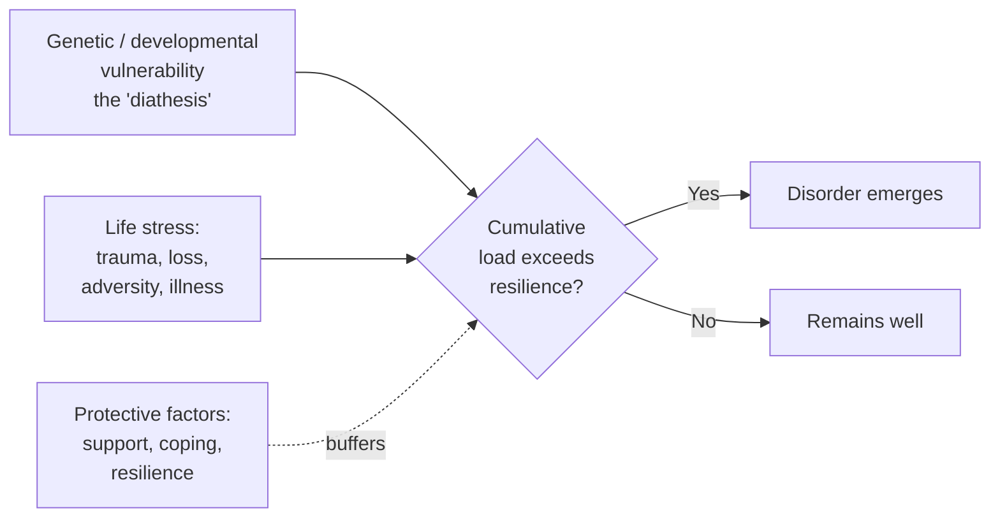
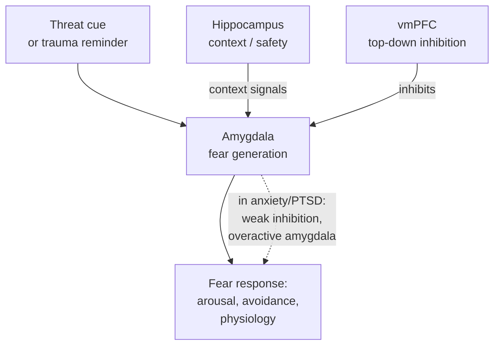
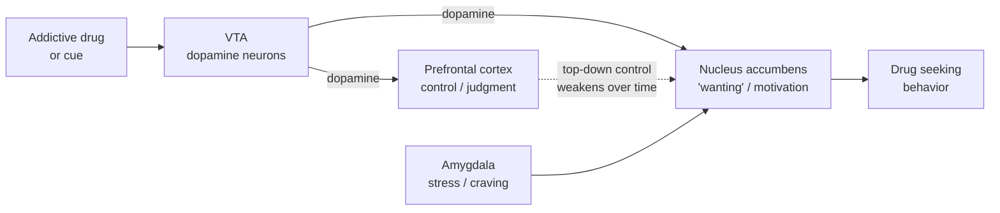

# Psychiatric and Neurological Disorders — When the Brain Goes Wrong

If the rest of this collection describes how the healthy brain is built and how it works, this document is the counterpart: what happens when those mechanisms break, drift, or misfire. It covers the major psychiatric disorders (depression, bipolar disorder, anxiety and PTSD, schizophrenia, addiction, OCD, and the neurodevelopmental conditions) and the major neurological disorders that overlap with them (epilepsy, stroke, traumatic brain injury). Neurodegenerative diseases such as Alzheimer's and Parkinson's are covered separately in [document 07](07-aging-and-neurodegeneration.md).

The central, honest message of this document is this: **for almost none of these disorders do we have a complete mechanistic account.** We have partial theories, useful circuits, informative genetics, and — crucially — treatments that often work without our fully understanding *why*. A recurring temptation in popular writing is to reduce mental illness to a single broken molecule ("a chemical imbalance"). That framing is not just incomplete; for several disorders it is actively misleading. The reality is messier, more interesting, and more uncertain. This document tries to convey that uncertainty rather than paper over it.

---

> ## ⚠️ Important Disclaimer
>
> **This document is educational, not medical advice.** It describes mechanisms and broad treatment *categories* for general understanding. It is **not** a diagnostic manual, does not list diagnostic criteria, and must never be used to diagnose yourself or anyone else, to start or stop a medication, or to choose a treatment. Psychiatric and neurological conditions are diagnosed and treated by qualified clinicians on an individual basis. If you or someone you know is struggling — and especially if there are thoughts of suicide or self-harm — contact a doctor or a crisis line (in the US, call or text **988**). Nothing here is a substitute for professional care.

---

## Table of Contents

1. [Why This Is Hard: Framing the Problem](#1-why-this-is-hard-framing-the-problem)
2. [Mood Disorders: Depression and Bipolar](#2-mood-disorders-depression-and-bipolar)
3. [Anxiety Disorders and PTSD](#3-anxiety-disorders-and-ptsd)
4. [Schizophrenia and Psychosis](#4-schizophrenia-and-psychosis)
5. [Addiction](#5-addiction)
6. [Obsessive-Compulsive Disorder](#6-obsessive-compulsive-disorder)
7. [Neurodevelopmental Disorders: Autism and ADHD](#7-neurodevelopmental-disorders-autism-and-adhd)
8. [Epilepsy](#8-epilepsy)
9. [Stroke and Traumatic Brain Injury](#9-stroke-and-traumatic-brain-injury)
10. [The State of the Field: An Honest Accounting](#10-the-state-of-the-field-an-honest-accounting)
11. [Sources](#sources)

---

## 1. Why This Is Hard: Framing the Problem

Before any specific disorder, it is worth understanding *why* psychiatric disorders in particular resist the clean "one cause, one cure" story that works reasonably well for, say, a bacterial infection or a fractured bone.

### 1.1 There Is No Single Cause

Psychiatric disorders are **multifactorial**. A given diagnosis — "major depressive disorder," say — is not a single disease with a single lesion. It is a *syndrome*: a cluster of symptoms that tend to travel together, defined by observable features rather than by an underlying biological cause. Two people with the same diagnosis may share few symptoms and have arrived there by entirely different biological and life paths. This **heterogeneity** is not a temporary gap in our knowledge; it appears to be a genuine property of these conditions.

### 1.2 The Biopsychosocial Model

The dominant framework in modern psychiatry is the **biopsychosocial model**, first articulated by George Engel in 1977. It holds that mental illness emerges from the interaction of three levels:

- **Biological** — genes, neurochemistry, circuits, hormones, inflammation, prenatal environment.
- **Psychological** — temperament, cognitive style, learned patterns of thought and coping, trauma history.
- **Social** — relationships, poverty, discrimination, social support, culture, life events.

The point is not that all three always matter equally, but that a purely biological account is *structurally incomplete*. Depression triggered by prolonged social isolation and depression emerging with no external trigger may look identical on a symptom checklist yet differ profoundly in mechanism. The model is sometimes criticized as vague — it tells you *that* many factors interact but not precisely *how* — but it remains the honest starting point.

### 1.3 The Limits of the Monoamine Hypothesis

The most influential — and most oversimplified — idea in the history of biological psychiatry is the **monoamine hypothesis**: that mood disorders result from a deficiency of monoamine neurotransmitters (serotonin, norepinephrine, dopamine). It arose in the 1950s and 60s from a genuine clinical observation: drugs that raised monoamine levels tended to lift mood, and drugs that depleted them (like reserpine) could induce depression in some people.

This became, in public life, the "chemical imbalance" story: depression is low serotonin, and antidepressants top it back up. **This account is now widely regarded as, at best, radically incomplete, and as a causal theory, unsupported.** The evidence against it as a *complete* explanation is substantial:

- **The timing problem.** SSRIs raise synaptic serotonin within *hours*, but clinical benefit takes *weeks*. If low serotonin were the direct cause, relief should be fast. The delay tells us the meaningful action is *downstream* and slower — involving gene expression, neurotrophic signaling, and structural change.
- **Depletion studies.** Experimentally lowering serotonin (via tryptophan depletion) does not reliably cause depression in healthy people. It can worsen symptoms in some who have *recovered on* serotonergic drugs, but it does not create the disorder from scratch.
- **The 2022 umbrella review.** A widely-discussed systematic review by Moncrieff and colleagues concluded there is no convincing evidence that depression is caused by lower serotonin concentration or activity. The paper was controversial — critics argued it attacked a "straw man" that serious researchers had already abandoned, and that it underweighted receptor-imaging complexity — but its central point, that the simple deficiency story is not supported, is broadly accepted.

None of this means serotonin is irrelevant, or that antidepressants "don't work" (on average they do outperform placebo, if modestly). It means the *mechanism* is not "refilling a low tank." The monoamine systems are better understood as *modulators* that gate slower processes — neuroplasticity, stress-axis regulation, network dynamics — which are where the pathology and the recovery more plausibly live.

### 1.4 RDoC vs. DSM

The **DSM** (Diagnostic and Statistical Manual) and **ICD** define psychiatric disorders as *categories* based on clusters of symptoms. This gives clinicians a shared language and is essential for practice, but it has a deep problem for research: **the categories do not map cleanly onto biology.** Genetic risk, brain circuits, and cognitive deficits cut *across* diagnostic boundaries. The same gene variants raise risk for schizophrenia, bipolar disorder, depression, autism, and ADHD alike (high genetic *pleiotropy*).

In response, the US National Institute of Mental Health (NIMH) launched the **Research Domain Criteria (RDoC)** framework in 2010. RDoC deliberately sets the DSM categories aside and instead studies psychopathology along **dimensions** — functional domains like *negative valence* (fear, loss), *positive valence* (reward), *cognitive systems*, *social processes*, and *arousal* — each examined across multiple "units of analysis" from genes and molecules to circuits, physiology, behavior, and self-report. The bet is that biology respects dimensions and mechanisms, not the tidy boxes of a diagnostic manual.

| | **DSM / ICD** | **RDoC** |
|---|---|---|
| **Unit** | Discrete diagnostic categories | Continuous functional dimensions |
| **Basis** | Observable symptom clusters | Neurobiological systems and behavior |
| **Purpose** | Clinical diagnosis and communication | Research and mechanism |
| **Strength** | Reliable, practical, shared language | Maps better onto genetics/circuits |
| **Weakness** | Poor biological validity; comorbidity | Not yet clinically usable; still developing |

RDoC is a *research* framework, not a replacement for clinical diagnosis. It is best seen as an admission that our diagnostic categories, however useful, are provisional.

### 1.5 Polygenic Risk and the Diathesis-Stress Model

Most psychiatric disorders are highly **heritable** — genetics accounts for roughly 40–50% of risk for depression, ~80% for schizophrenia and bipolar disorder, and ~70–90% for autism. But this heritability is **polygenic**: it is spread across hundreds or thousands of common gene variants, each contributing a tiny effect, plus rarer variants of larger effect. There is no "depression gene" or "schizophrenia gene." A person's aggregate genetic loading is summarized by a **polygenic risk score**, which is statistically informative across populations but far too weak to predict any individual's fate.

Genes set a *predisposition*, not a destiny. The dominant integrative model is **diathesis-stress**: a person carries a latent vulnerability (the *diathesis* — genetic, developmental, temperamental), and disorder emerges only when environmental **stress** exceeds what that person's resilience can absorb. The same stressor produces illness in a vulnerable person and leaves a resilient one unscathed; a highly vulnerable person may need only a mild trigger. A refinement, the **differential-susceptibility** model, notes that some of the same "risk" genes also make people *more responsive to positive environments* — they are not simply "bad genes" but "high-plasticity" genes.

This framework will recur throughout the document. It is the closest thing psychiatry has to a unifying account, and it is deliberately probabilistic rather than deterministic.

---

## 2. Mood Disorders: Depression and Bipolar

### 2.1 Major Depressive Disorder — Beyond "Low Serotonin"

Major depression is not simply sadness; it is a sustained disturbance of mood, motivation, reward, cognition, sleep, appetite, and energy. It is among the leading causes of disability worldwide. Its biology is best understood not as one broken system but as several converging ones.

**The neuroplasticity / neurotrophic model.** The most productive contemporary framework holds that depression is fundamentally a disorder of **impaired neuroplasticity** — a reduced capacity of neurons and circuits to remodel themselves — driven substantially by chronic stress. Key observations:

- **Structural atrophy.** Chronic depression is associated with **volume loss in the hippocampus and prefrontal cortex** and with retraction of dendrites and loss of synapses in these regions, particularly under sustained stress. (See [document 05](05-neuroplasticity.md) for the plasticity machinery involved.)
- **BDNF.** **Brain-derived neurotrophic factor**, a key driver of synaptic growth and survival, tends to be *reduced* in depression and *increased* by effective antidepressant treatment. The **neurotrophic hypothesis** proposes that low BDNF-mediated plasticity underlies the disorder and that restoring it underlies recovery. This elegantly explains the *timing problem*: monoamine changes are immediate, but the downstream cascade (monoamine → CREB → BDNF → synaptogenesis) that actually matters unfolds over weeks — matching the clinical response.

**The HPA axis and stress.** Depression is tightly linked to dysregulation of the **hypothalamic-pituitary-adrenal (HPA) axis**, the body's central stress-hormone system (covered in depth in [document 06](06-stress-and-fight-or-flight.md)). Many depressed patients show elevated **cortisol** and a failure of the normal feedback that shuts the stress response off. Chronically elevated glucocorticoids are toxic to hippocampal neurons and *suppress neurogenesis and BDNF* — providing a direct molecular bridge from life stress to the plasticity deficits above. This is diathesis-stress made molecular.

**The glutamate / synaptic model.** Attention has shifted toward **glutamate**, the brain's main excitatory transmitter. The remarkable antidepressant effect of ketamine (below) implicates rapid glutamatergic synaptogenesis as a final common pathway to recovery.

**The inflammatory hypothesis.** A subset of depressed patients show elevated inflammatory markers (cytokines like IL-6, CRP). Inflammation can produce "sickness behavior" — withdrawal, fatigue, anhedonia — that overlaps with depression, and can suppress serotonin synthesis and plasticity. This is unlikely to explain all depression but may define a biologically distinct subgroup, illustrating heterogeneity.

**The network view.** At the systems level, depression is increasingly framed as a disorder of **large-scale brain networks** (see [document 08](08-sleep-consciousness-development.md)): hyperconnectivity within the **default mode network** (linked to rumination and excessive self-focus), reduced engagement of the **frontoparietal executive network**, and altered **salience network** function. The **subgenual anterior cingulate cortex (Brodmann area 25)** is consistently overactive and is a target for deep brain stimulation in severe, treatment-resistant cases.

The honest synthesis: monoamines, stress hormones, neurotrophins, glutamate, inflammation, and network dynamics are **not competing theories so much as different levels of one interacting system.** No single one is "the cause."

#### Treatment approaches for depression

| Approach | What it is / does | Notes on mechanism and use |
|---|---|---|
| **SSRIs / SNRIs** | Block reuptake of serotonin (± norepinephrine), raising synaptic levels | First-line drugs. Immediate transmitter rise, but benefit takes weeks — consistent with downstream plasticity, not simple "refilling." Modest average effect; work well for some, poorly for others |
| **Other antidepressants** | Tricyclics, MAOIs, bupropion (dopamine/NE), mirtazapine | Older or alternative mechanisms; often as effective, differ in side effects |
| **Ketamine / esketamine** | NMDA-receptor antagonist; **rapid** (hours) antidepressant, incl. anti-suicidal effect | See below. Esketamine (nasal) is FDA-approved for treatment-resistant depression |
| **ECT (electroconvulsive therapy)** | Induces a controlled generalized seizure under anesthesia | The **most effective** treatment for severe, treatment-resistant, or psychotic depression. Stigmatized but safe in modern practice; promotes neuroplasticity and neurogenesis. Main downside: transient memory effects |
| **Other neuromodulation** | **rTMS** (magnetic stimulation of PFC); **DBS** (experimental, area 25) | Non- or minimally-invasive circuit-level interventions |
| **Psychotherapy** | CBT, behavioral activation, interpersonal therapy | Comparable efficacy to medication for mild–moderate depression; changes brain activity measurably. Best outcomes often from **combining** therapy and medication |

**Ketamine — why it matters mechanistically.** Ketamine overturned the assumption that antidepressants must be slow. It produces relief within *hours*, sometimes in patients who failed every other treatment. Its mechanism is a vivid illustration of the plasticity model: ketamine **blocks NMDA receptors preferentially on inhibitory GABAergic interneurons**, *disinhibiting* glutamate release. The resulting glutamate surge activates **AMPA receptors**, which triggers **BDNF release and the mTOR signaling pathway**, driving a rapid burst of **synaptogenesis** — new dendritic spines — in the prefrontal cortex. Blocking mTOR abolishes the effect. In other words, ketamine appears to *rapidly regrow synapses* that chronic stress and depression had pruned away. The dissociative "trip" fades in ~2 hours; the antidepressant effect can last a week or more, outlasting the drug itself. This has reframed depression research around **rapid-acting synaptic plasticity** as the goal.

### 2.2 Bipolar Disorder

Bipolar disorder involves oscillation between **depression** and **mania** (or, in bipolar II, hypomania) — episodes of elevated or irritable mood, grandiosity, decreased need for sleep, racing thoughts, and impulsive, sometimes reckless behavior. It is not "moody" in the everyday sense; episodes last days to weeks or longer and can be severely disabling or dangerous.

Its biology is distinct from unipolar depression and, if anything, less well understood. Leading threads:

- **Very high heritability** (~70–80%), polygenic, with notable overlap with schizophrenia's genetic risk — the two disorders are more biologically related than the categorical split suggests.
- **Ion channels and calcium signaling.** Genome-wide studies repeatedly implicate **voltage-gated calcium channel genes (e.g., CACNA1C)**. Abnormal intracellular **calcium signaling** in patients' cells is one of the more robust cellular findings, pointing to a disorder of neuronal excitability and signaling rather than a single transmitter.
- **Mitochondrial dysfunction.** Evidence points to impaired energy metabolism in neurons, consistent with the energy-related symptoms and the cyclic nature of the illness.
- **Circadian rhythm disruption.** Sleep and circadian abnormalities are core, not incidental — sleep loss can *trigger* mania, and the illness is marked by low-amplitude, unstable circadian rhythms.

**Treatment** centers on **mood stabilizers**, above all **lithium** — a simple ion that remains, after 70 years, one of the most effective drugs in psychiatry and the best anti-suicidal agent known. Strikingly, *we still do not fully know how lithium works.* Candidate mechanisms include inhibition of **GSK-3β** and inositol signaling, **amplification and stabilization of circadian rhythms**, neuroprotection, and enhancement of BDNF/plasticity. Only some patients respond, and predicting responders is an active research goal (with hints that a patient's cellular circadian rhythms may forecast lithium sensitivity). Other options include anticonvulsants (valproate, lamotrigine, carbamazepine) and atypical antipsychotics. A critical clinical caution informs mechanism: **antidepressants given alone can trigger mania** in bipolar patients — a reminder that unipolar and bipolar depression are not the same underlying state.

---

## 3. Anxiety Disorders and PTSD

Anxiety disorders (generalized anxiety, panic, phobias, social anxiety) and **post-traumatic stress disorder (PTSD)** are, at the circuit level, best understood as disorders of the **fear system** — the same evolutionarily ancient machinery described in [document 06](06-stress-and-fight-or-flight.md), now tuned too high or failing to shut off.

### 3.1 The Fear Circuit

The core circuit has three key nodes:

- **Amygdala** — the threat-detection and fear-generation hub. It rapidly evaluates sensory input for danger and drives the physiological fear response (via the hypothalamus and brainstem).
- **Medial prefrontal cortex (mPFC)**, especially the **ventromedial PFC (vmPFC)** — provides *top-down inhibitory control* over the amygdala. It is how context and safety learning dampen fear.
- **Hippocampus** — supplies *context*: whether *this* environment is actually dangerous, and it encodes the memory of where/when threat occurred.

In anxiety disorders and PTSD, the consistent picture from neuroimaging is an **overactive amygdala** combined with **underactive/insufficient vmPFC control** — the brakes are too weak for the accelerator. The result is exaggerated threat responses to stimuli that are not actually dangerous, and — in PTSD — a fear memory that intrudes uncontrollably.

### 3.2 PTSD Specifically

PTSD develops after trauma but *not in everyone* who experiences trauma — a textbook diathesis-stress outcome, shaped by prior vulnerability, genetics, and the nature of the event. Its defining feature is a **failure of fear extinction**: the traumatic memory does not get updated with new "safety" information the way ordinary fears do. Imaging shows PTSD patients have hypoactive vmPFC and hippocampus and hyperactive amygdala during extinction, so the safety signal never adequately suppresses the fear. Layered on this are intrusive re-experiencing, hypervigilance, and altered stress-hormone dynamics (in PTSD, cortisol patterns are often *low or dysregulated*, differing from major depression).

### 3.3 Extinction and Exposure Therapy

The most important concept for treatment is **extinction**. When a feared cue is encountered repeatedly *without* the bad outcome, the brain does **not erase** the original fear memory. Instead, the vmPFC and hippocampus build a **new, competing "safety" memory** that *inhibits* the fear response. Fear extinction is *new learning*, not forgetting — which is why fear can return (spontaneous recovery, reinstatement under stress).

**Exposure therapy** is the clinical application of extinction: the patient is guided to confront feared stimuli, situations, or memories in a safe, graded way, so the brain forms and strengthens the inhibitory safety memory. It is the best-supported psychological treatment for anxiety disorders and PTSD, and it works by *engaging the very amygdala-hippocampus-PFC circuit* the disorder disrupts. Medications (SSRIs are first-line) can reduce baseline arousal and support the process. Research directions include drugs that enhance extinction learning (e.g., D-cycloserine as an adjunct), and MDMA-assisted and ketamine-assisted therapy for PTSD, which aim to open a window of plasticity in which trauma memories can be reprocessed.

---

## 4. Schizophrenia and Psychosis

Schizophrenia is among the most severe and most misunderstood psychiatric disorders. It is *not* "split personality." It is a disorder of **psychosis** — a break from consensual reality — combined with cognitive and motivational deficits. Its symptoms fall into three domains, which matters enormously because current treatments address only one of them well:

| Symptom domain | Examples | Treatment response |
|---|---|---|
| **Positive** | Hallucinations, delusions, disordered thought | Respond reasonably well to antipsychotics |
| **Negative** | Blunted affect, avolition, social withdrawal, anhedonia | Respond **poorly**; major source of disability |
| **Cognitive** | Impaired working memory, attention, executive function | Respond **poorly**; strongly predicts real-world outcome |

### 4.1 The Dopamine Hypothesis — and Its Refinement

The classic **dopamine hypothesis** arose because all effective antipsychotics block **dopamine D2 receptors**, and drugs that boost dopamine (amphetamine, L-DOPA) can induce psychosis. The original claim — "schizophrenia is too much dopamine" — has been substantially refined:

- The excess is **regional and specific**: elevated dopamine synthesis and release in the **associative striatum** (a *presynaptic* dopamine abnormality) drives **positive** symptoms.
- Simultaneously there appears to be **too little** dopamine signaling in the **prefrontal cortex**, linked to **negative and cognitive** symptoms. So it is *dysregulation*, not simple excess — hyperdopaminergia in one place, hypodopaminergia in another.

### 4.2 The Glutamate / NMDA Refinement and Aberrant Salience

Crucially, dopamine now looks like a **downstream** node rather than the primary fault. Two big ideas reframe the disorder:

- **The glutamate / NMDA-hypofunction hypothesis.** NMDA-receptor antagonists like **ketamine and PCP** reproduce the *full* range of schizophrenia symptoms in healthy people — including the negative and cognitive symptoms that dopamine drugs like amphetamine do *not*. The theory: **hypofunction of NMDA receptors on inhibitory GABAergic interneurons** disinhibits excitatory neurons, disrupting the excitation/inhibition balance in cortex. This cortical dysfunction is then thought to *drive* the striatal dopamine excess downstream. In this view the striatal hyperdopaminergia is a **final common pathway**, secondary to glutamatergic and synaptic-plasticity deficits.
- **Aberrant salience.** A powerful cognitive-level account (Kapur) reframes psychosis as a disorder of **salience** — the brain's tagging of what is important and worth attending to. Dopamine normally signals significance. When dopamine fires aberrantly and out of context, ordinary stimuli acquire inappropriate, urgent significance. **Delusions** are then the mind's attempt to *explain* this pervasive, unwarranted sense that everything is meaningful and personally relevant; **hallucinations** reflect aberrant salience attached to internal representations. This elegantly connects the neurochemistry to the *lived experience* of psychosis, and explains why antipsychotics don't erase delusions so much as make them feel less pressing.

### 4.3 Neurodevelopmental Origins

Schizophrenia is now firmly regarded as a **neurodevelopmental disorder** whose psychotic symptoms typically emerge in late adolescence or early adulthood but whose *roots lie much earlier*. Evidence includes subtle motor and cognitive differences in childhood years before onset, associations with prenatal complications and infections, and the timing of onset with **adolescent synaptic pruning**. A leading idea is that **excessive synaptic pruning** in prefrontal cortex during adolescence — possibly involving complement/microglial "over-eating" of synapses (the *C4* gene is implicated) — tips a vulnerable brain into disorder. Heritability is high (~80%) and polygenic, with genetic overlap with bipolar disorder and rare high-impact copy-number variants contributing.

### 4.4 Antipsychotics

- **Typical ("first-generation")** antipsychotics (e.g., haloperidol, chlorpromazine) are strong **D2 antagonists**. They control positive symptoms but their blockade of dopamine in motor pathways causes **extrapyramidal side effects** (Parkinsonism, and the sometimes irreversible movement disorder **tardive dyskinesia**).
- **Atypical ("second-generation")** antipsychotics (e.g., risperidone, olanzapine, quetiapine) add **serotonin 5-HT2A antagonism** and bind D2 more loosely, causing fewer movement side effects but often significant **metabolic side effects** (weight gain, diabetes risk).
- **Clozapine** is uniquely effective for **treatment-resistant** schizophrenia and reduces suicide, yet — tellingly — it is a relatively *weak* D2 blocker, which further undermines the pure-dopamine story. It requires blood monitoring due to a rare risk of agranulocytosis.

The blunt limitation: **antipsychotics treat positive symptoms but do little for the negative and cognitive symptoms** that most determine long-term disability. This gap is a direct consequence of the field's incomplete mechanistic understanding. A genuinely new mechanism arrived recently with **muscarinic (cholinergic) agonists** (e.g., the xanomeline-trospium combination), the first non-dopaminergic antipsychotic approach in decades — a sign the field is finally moving beyond D2.

---

## 5. Addiction

Addiction is a chronic, relapsing disorder in which drug (or behavior) seeking becomes **compulsive** and persists despite mounting harm. It is not a moral failing or a simple lack of willpower; it is a disease of **learning and motivation circuits** that have been hijacked. Its mechanisms connect directly to the plasticity and reward systems described in documents [03](03-neurotransmitter-systems.md), [04](04-learning-and-memory.md), and [05](05-neuroplasticity.md).

### 5.1 The Reward Circuit

The core substrate is the **mesolimbic dopamine pathway**: dopamine neurons in the **ventral tegmental area (VTA)** project to the **nucleus accumbens** (ventral striatum), with the **prefrontal cortex** and **amygdala** as key partners. Virtually all addictive drugs, by diverse routes, converge on **elevating dopamine in the nucleus accumbens**. Critically, dopamine here does not simply encode pleasure — it encodes **reward prediction error and motivational "wanting."** Drugs produce a dopamine signal *larger and more reliable than any natural reward*, and they do so *pharmacologically*, bypassing the normal ways the signal is earned and regulated.

### 5.2 From Liking to Wanting to Compulsion

The most influential mechanistic account is the **incentive-sensitization theory** (Robinson & Berridge). Its central insight is that the brain systems for **"liking"** (the actual hedonic pleasure of a reward) and **"wanting"** (the motivational pull to obtain it) are **dissociable**, and addiction is primarily a pathology of *wanting*:

- With repeated use, the mesolimbic dopamine system becomes **sensitized** — hyper-reactive to the drug and, crucially, to **drug-associated cues**. This sensitization can persist for *years* after use stops.
- The result is that **"wanting" (craving) grows even as "liking" (pleasure) fades.** Addicts often report that the drug no longer even feels good, yet the *craving* is overwhelming — a direct, testable prediction the theory nails.
- This maps onto a three-stage cycle (Koob & Volkow): **binge/intoxication** → **withdrawal/negative affect** (the reward system's "set point" resets, so normal life feels flat and the person now uses partly to escape a dysphoric baseline) → **preoccupation/anticipation** (craving driven by cues and stress).

The transition from voluntary use to **compulsion** involves a shift in control from the ventral (goal-directed) to the **dorsal striatum (habit) circuitry** — behavior becomes automatic and stimulus-driven, decoupled from its outcomes. Meanwhile, natural rewards lose their power as the reward circuit's capacity is blunted (**anhedonia**).

### 5.3 Loss of Prefrontal Control and Relapse

The second pillar is **top-down failure**. Chronic drug use impairs the **prefrontal cortex** — the seat of judgment, impulse control, and the ability to weigh future consequences. As the "go" signal from a sensitized striatum grows and the prefrontal "stop" signal weakens, the balance tips toward compulsive use. This is why addiction so severely erodes self-control: the neural brakes are genuinely impaired.

**Relapse** is the defining clinical challenge, and it is fundamentally a **plasticity** problem (cross-reference [document 05](05-neuroplasticity.md)). Drug-associated cues, stress, and re-exposure to the drug can all reinstate seeking after long abstinence, because the *learned associations are structurally encoded* in strengthened synapses that abstinence does not erase. Craving can actually *intensify* over the first weeks of abstinence ("incubation of craving"). Effective treatment therefore combines pharmacotherapy (e.g., agonist/replacement therapies like methadone or buprenorphine for opioids; naltrexone; medications for withdrawal) with behavioral approaches that build new competing learning and cue-management skills — again, extinction-like relearning against a memory that was never deleted.

---

## 6. Obsessive-Compulsive Disorder

OCD involves intrusive, distressing **obsessions** (unwanted thoughts, urges, images) and **compulsions** (repetitive behaviors or mental acts performed to reduce the resulting anxiety). Its neurobiology is one of the more circuit-specific in psychiatry, centering on the **cortico-striato-thalamo-cortical (CSTC) loops**.

These loops are the brain's action-selection and habit machinery (the same basal-ganglia circuitry described in [document 02](02-anatomy-and-organization.md)). In simplified terms, the **orbitofrontal cortex (OFC)** and **anterior cingulate cortex (ACC)** — regions involved in evaluating errors, threats, and the sense that something is "wrong" — form a loop through the **striatum**, **globus pallidus**, and **thalamus** and back to cortex. The loop contains an excitatory **direct pathway** (a positive feedback "go" loop) and an inhibitory **indirect pathway** (a "stop" brake).

In OCD, the model is that this circuit is **hyperactive and stuck in a positive-feedback loop** — the OFC-ACC keep signaling that something is wrong and an action is required (the obsession), the compulsion is performed but fails to "turn off" the error signal, and the loop reactivates. Neuroimaging consistently shows hyperactivity in OFC, ACC, and caudate that *normalizes* with successful treatment, whether by medication or therapy.

**Treatment:**
- **SSRIs** are first-line but at *higher doses and longer duration* than for depression — implicating serotonergic modulation of the CSTC loop, though not in a simple way. **Clomipramine** (a strongly serotonergic tricyclic) is also effective.
- **Exposure and response prevention (ERP)**, a specialized form of CBT — confronting the obsessional trigger while *refraining* from the compulsion — is highly effective and, like exposure therapy in anxiety, works by extinction-like relearning.
- For severe, refractory cases, **deep brain stimulation (DBS)** targeting nodes of the CSTC circuit is an approved option. Its mechanism is thought to be an "informational lesion" — high-frequency stimulation disrupting the pathological loop activity — a striking demonstration that OCD is, at root, a *circuit* disorder.

---

## 7. Neurodevelopmental Disorders: Autism and ADHD

These conditions arise from differences in how the brain **develops**, with features present from early life. An honest treatment of them must foreground **heterogeneity** and, increasingly, the framing that these are in part forms of **neurodivergence** — differences that carry both challenges and strengths — not simply diseases to be cured.

### 7.1 Autism Spectrum Disorder (ASD)

ASD is defined by differences in social communication and interaction alongside restricted, repetitive behaviors and interests, and often distinctive sensory processing. The word **"spectrum"** is essential: outcomes and support needs range enormously, from people needing substantial daily support to independent adults.

The honest state of the science:

- **Highly heritable (~70–90%) and extraordinarily polygenic/heterogeneous.** Hundreds of genes are implicated; some are rare variants of large effect (e.g., in synaptic genes like *SHANK3*, *NRXN*, *NLGN*, or syndromic causes like Fragile X and tuberous sclerosis), but for most autistic people no single genetic cause is identifiable — it is the aggregate of many common variants plus environment. There is no single "autism biology."
- **A recurring theme is synaptic and connectivity differences** — many implicated genes converge on **synapse formation and function** and on the **excitation/inhibition balance** in cortical circuits, with some evidence of altered long-range vs. local connectivity. But findings are subtle and inconsistent across individuals.
- **No reliable biomarker or brain signature** distinguishes autistic from non-autistic brains at the individual level. Diagnosis is behavioral. Reducing the clinical and biological heterogeneity into meaningful subgroups is one of the field's central goals.
- Older environmental claims — most notoriously that **vaccines cause autism** — have been **thoroughly and repeatedly refuted**; that hypothesis is scientifically dead. Genuine risk factors include genetics and some prenatal/perinatal factors.

**Support** is developmental and behavioral (e.g., early intervention, speech and occupational therapy, educational support), aimed at communication, adaptive skills, and quality of life. There is **no medication for the core features**; medications address *co-occurring* conditions (anxiety, ADHD, sleep, irritability). The field is shifting from a purely deficit framing toward supporting autistic people's functioning and wellbeing on their own terms.

### 7.2 Attention-Deficit/Hyperactivity Disorder (ADHD)

ADHD involves developmentally inappropriate **inattention** and/or **hyperactivity-impulsivity**. It is highly heritable (~70–80%) and is best understood as a disorder of **executive function and self-regulation** — the prefrontal-striatal circuits that manage attention, inhibition, working memory, and the *timing of reward*.

- **Catecholamine (dopamine and norepinephrine) signaling** in prefrontal-striatal circuits is central — which is why stimulant medications help — but, as with depression, this is *not* a simple "low dopamine" story. It involves how these systems tune the *signal-to-noise* and self-regulatory function of prefrontal circuits.
- A prominent model emphasizes **altered reward processing** — a steeper preference for immediate over delayed rewards (delay aversion) — alongside weaker top-down inhibitory control.
- Brain-development studies suggest a pattern of **delayed maturation** of prefrontal cortex in some children, consistent with the fact that many (not all) improve with age.
- As with autism, there is **no biomarker or brain scan** that diagnoses ADHD; it is a clinical, behavioral diagnosis, and it sits on a continuum with normal variation rather than being a sharp category.

**Treatment:** **Stimulants** (methylphenidate, amphetamines), which raise synaptic dopamine and norepinephrine in prefrontal circuits, are among the most effective medications in all of psychiatry for their target symptoms. Paradoxically, these "stimulants" *calm* and *focus* people with ADHD — consistent with the idea that they optimize an under-regulated prefrontal system rather than simply revving it up. Non-stimulant options (atomoxetine, guanfacine) and behavioral/educational strategies are also used. ADHD and autism frequently **co-occur** and share genetic risk, again illustrating why rigid diagnostic categories strain against the underlying biology.

---

## 8. Epilepsy

Epilepsy is a neurological (not psychiatric) disorder defined by a lasting predisposition to **seizures** — episodes of abnormal, excessive, **hypersynchronous** neuronal firing. It is one of the clearest illustrations in all of neuroscience of a single unifying principle: the **balance between excitation and inhibition (E/I balance)**.

### 8.1 The Excitation/Inhibition Imbalance

Normal brain function depends on a tight balance between the main excitatory transmitter, **glutamate**, and the main inhibitory transmitter, **GABA** (see [document 03](03-neurotransmitter-systems.md)). A seizure is, in essence, a **catastrophic failure of that balance** — too much excitation, too little inhibition, or both — allowing a population of neurons to fire together in a runaway, self-reinforcing cascade. Key mechanisms:

- **Excess glutamatergic drive**, and/or **deficient GABAergic inhibition**, lowers the threshold for synchronized firing.
- **Ion channel dysfunction** (many genetic epilepsies are *channelopathies* — mutations in sodium, potassium, calcium, or GABA-receptor channels) makes neurons intrinsically hyperexcitable.
- A localized hyperactive focus can **recruit surrounding tissue** and, if inhibition fails to contain it, spread — a *focal* seizure that may *generalize* across both hemispheres.
- Sustained, excessive glutamate release drives **excitotoxicity** (calcium overload → cell death), linking severe or prolonged seizures to neuronal injury — the same excitotoxic mechanism seen in stroke (below).

### 8.2 Treatment

Because the problem is E/I imbalance, most **anti-seizure medications** work by **decreasing excitation, increasing inhibition, or both**:

- **Enhancing GABA inhibition** — benzodiazepines and barbiturates potentiate GABA-A receptors; vigabatrin blocks GABA breakdown; tiagabine blocks GABA reuptake.
- **Dampening excitation / stabilizing membranes** — blocking voltage-gated **sodium channels** (carbamazepine, phenytoin, lamotrigine) or **calcium channels**, or reducing glutamate release (e.g., levetiracetam acts on the synaptic-vesicle protein SV2A).

Roughly two-thirds of patients achieve good control on medication. For **drug-resistant** epilepsy, options include **resective surgery** (removing the seizure focus), the **ketogenic diet** (a high-fat metabolic therapy, effective especially in children, by incompletely understood mechanisms), and **neuromodulation** — vagus nerve stimulation, responsive neurostimulation (RNS, which detects and interrupts seizures), and deep brain stimulation. Notably, epilepsy carries a high burden of **psychiatric comorbidity** (depression, anxiety, psychosis), a reminder that the neurological/psychiatric divide is administrative, not biological.

---

## 9. Stroke and Traumatic Brain Injury

Stroke and traumatic brain injury (TBI) are acute *injuries* to the brain, but they belong here because their **long-term consequences and recovery** are governed by the same neuroplasticity and — often — the same excitotoxic mechanisms that run through this whole collection. Both can also produce psychiatric sequelae (depression after stroke is common; TBI raises risk of depression, anxiety, and, cumulatively, neurodegeneration).

### 9.1 Stroke: The Ischemic Cascade and the Penumbra

An **ischemic stroke** (the most common type) occurs when a blood vessel is blocked, cutting oxygen and glucose to a region of brain. Within minutes, an **ischemic cascade** unfolds:

1. **Energy failure** — without oxygen, neurons cannot run the ion pumps that maintain their membrane gradients.
2. **Depolarization and glutamate release** — neurons depolarize and dump **glutamate** into the extracellular space.
3. **Excitotoxicity** — excess glutamate over-activates NMDA receptors, flooding neurons with **calcium**, which triggers destructive enzymes, oxidative stress, mitochondrial failure, and cell death.

The critical clinical concept is the **penumbra**: surrounding the irreversibly damaged **core** is a rim of tissue that is *functionally silent but still alive* — starved but salvageable. The whole logic of acute stroke treatment is a **race against time to save the penumbra**: restoring blood flow with clot-busting drugs (**tPA**) or mechanical **thrombectomy** within a narrow window. "Time is brain."

### 9.2 Traumatic Brain Injury: Primary and Secondary Injury

TBI involves two phases:

- **Primary injury** — the immediate mechanical damage from the impact: shearing of axons (diffuse axonal injury), contusion, torn vessels. This is done at the moment of injury and can only be *prevented*, not treated.
- **Secondary injury** — a cascade that unfolds over hours to days: **excitotoxicity** (again glutamate/calcium), **oxidative stress**, **neuroinflammation**, **edema** (swelling that raises intracranial pressure and can cause further ischemia). Much acute TBI care is aimed at limiting this secondary cascade. Repetitive TBI (as in some contact sports) is linked to later neurodegeneration (chronic traumatic encephalopathy).

### 9.3 Recovery: Plasticity as the Engine

Recovery after both stroke and TBI depends heavily on **neuroplasticity** (see [document 05](05-neuroplasticity.md)). Because the adult brain retains substantial capacity to remodel, surviving tissue — in the penumbra and in connected regions — can **reorganize and take over lost functions**. Mechanisms include unmasking of latent connections, sprouting of new axonal projections, synaptic strengthening, and cortical remapping. The subacute weeks form a **critical window** of heightened plasticity.

**Rehabilitation** is, in essence, *directed plasticity*: intensive, repetitive, task-specific practice that shapes which reorganization occurs. Emerging adjuncts aim to *amplify* this recovery window — **non-invasive brain stimulation** (rTMS, transcranial direct-current stimulation) to rebalance the two hemispheres, and **paired vagus nerve stimulation** during rehab (recently approved for stroke) to boost plasticity during training. The unifying lesson: the same plasticity that makes the brain learnable is what makes it *repairable* — and rehabilitation is the art of steering it.

---

## 10. The State of the Field: An Honest Accounting

It would be dishonest to end a document like this on a note of tidy mechanistic confidence. The truth is that psychiatry and much of clinical neuroscience remain in a **pre-mechanistic** state for their core disorders. Several hard facts define the current landscape:

**We have almost no clinically useful biomarkers.** Despite decades of neuroimaging, genetics, and blood-marker research, **there is still no lab test or brain scan that diagnoses depression, schizophrenia, bipolar disorder, anxiety, autism, or ADHD.** Diagnosis remains *behavioral* — based on interview and observation. This is not for lack of trying; it reflects the genuine heterogeneity and complexity of these conditions.

**The replication crisis hit hard.** Much of the older literature — small neuroimaging studies claiming a brain region "for" a disorder, candidate-gene studies claiming a single gene raised risk — has **failed to replicate**. We now understand why: the true effects are *tiny and distributed*, so small samples produce noisy, over-optimistic findings that vanish in large replications. Robust results require samples of thousands to tens of thousands. Machine-learning classifiers that hit 90%+ accuracy in small samples routinely collapse toward chance on independent data. The field has responded with large consortia, preregistration, and open data — real progress, but it means many once-confident textbook claims must be held loosely.

**The categories may be wrong.** As RDoC's existence concedes, the DSM disorders are reliable labels that may not carve nature at its joints. Genetic and circuit findings cut across diagnoses; comorbidity is the rule, not the exception. It is possible that future nosology will look quite different from today's.

**This is why treatment is often empirical.** Because we lack mechanistic and biomarker-level understanding, treatment selection is largely **trial and error** — clinicians try a medication, wait weeks, and switch if it fails, with no test to predict who will respond. Several of our *best* treatments were discovered by **serendipity** and still lack a complete mechanistic account: lithium, ECT, and ketamine's rapid action were all clinical observations that ran ahead of theory. Antidepressants and antipsychotics work *on average* and *for some people well*, but effect sizes are moderate and we cannot yet match patient to treatment rationally.

**None of this means nihilism.** The treatments, while imperfect, genuinely help millions; ECT and clozapine and lithium are among the most effective interventions in all of medicine for their indications. And the mechanistic picture *is* advancing — the shift from "chemical imbalance" to **plasticity, circuits, stress, development, and networks** is real intellectual progress, ketamine has opened a new therapeutic paradigm, and large-scale genetics is finally yielding replicable biology. The honest position is neither "it's all just chemical imbalance, solved" nor "we know nothing," but the harder, more interesting middle: **we understand these disorders partially, at multiple interacting levels, with real and acknowledged uncertainty — and that partial understanding is deepening.**

If there is one idea to carry away, it is the one this document opened with: **the brain's disorders, like the brain itself, are not single things with single causes.** They are emergent, multi-level, probabilistic — the product of genes and stress and development and circuits and life, interacting. Humility about that complexity is not a weakness of the field; it is the beginning of getting it right.

---

## Sources

**Framing, RDoC, genetics, and the monoamine debate**
- [The serotonin theory of depression: a systematic umbrella review of the evidence (Moncrieff et al., 2022, *Molecular Psychiatry*)](https://www.nature.com/articles/s41380-022-01661-0)
- [A response to "The serotonin theory of depression" (King's College London)](https://www.kcl.ac.uk/news/a-response-to-the-serotonin-theory-of-depression-a-systematic-umbrella-review-of-the-evidence)
- [From Serotonin to Neuroplasticity: Evolvement of Theories for Major Depressive Disorder (*Frontiers in Cellular Neuroscience*)](https://www.ncbi.nlm.nih.gov/pmc/articles/PMC5624993/)
- [Research Domain Criteria: Strengths, Weaknesses, and Potential Alternatives (PMC)](https://pmc.ncbi.nlm.nih.gov/articles/PMC6873013/)
- [Integrating NIMH Research Domain Criteria (RDoC) into Depression Research (PMC)](https://pmc.ncbi.nlm.nih.gov/articles/PMC4306327/)
- [RDoC and Translational Perspectives on the Genetics of Trauma-Related Psychiatric Disorders (PMC)](https://pmc.ncbi.nlm.nih.gov/articles/PMC4754782/)
- [NIMH — Research Domain Criteria (RDoC)](https://www.nimh.nih.gov/research/research-funded-by-nimh/rdoc)

**Depression, ketamine, and neuroplasticity**
- [The Role of BDNF on Neural Plasticity in Depression (*Frontiers in Cellular Neuroscience*)](https://www.frontiersin.org/journals/cellular-neuroscience/articles/10.3389/fncel.2020.00082/full)
- [Neurotrophic hypothesis of depression (Wikipedia overview)](https://en.wikipedia.org/wiki/Neurotrophic_hypothesis_of_depression)
- [Beyond NMDA Receptors: Ketamine's Rapid and Multifaceted Mechanisms in Depression (*IJMS*, 2024)](https://www.mdpi.com/1422-0067/25/24/13658)
- [A Review of the Mechanism of NMDA Receptor Antagonism by Ketamine in Treatment-Resistant Depression (PMC)](https://www.ncbi.nlm.nih.gov/pmc/articles/PMC6051558/)
- [Ketamine and Esketamine in Psychiatry: Neuroplasticity and Clinical Applications](https://www.mdpi.com/2813-1851/4/3/20)
- [NIMH — Depression](https://www.nimh.nih.gov/health/topics/depression)

**Bipolar disorder**
- [Patient fibroblast circadian rhythms predict lithium sensitivity in bipolar disorder (*Molecular Psychiatry*)](https://www.nature.com/articles/s41380-020-0769-6)
- [Calcium Channel Genes Associated with Bipolar Disorder Modulate Lithium's Amplification of Circadian Rhythms (PMC)](https://pmc.ncbi.nlm.nih.gov/articles/PMC4681663/)
- [Lithium Therapeutic Functions: Pharmacokinetics and Mechanisms of Action (*Molecular Neurobiology*)](https://link.springer.com/article/10.1007/s12035-026-05663-9)
- [NIMH — Bipolar Disorder](https://www.nimh.nih.gov/health/topics/bipolar-disorder)

**Anxiety and PTSD**
- [Prefrontal cortex, amygdala, and threat processing: implications for PTSD (PMC)](https://pmc.ncbi.nlm.nih.gov/articles/PMC8617299/)
- [Neural circuits for the adaptive regulation of fear and extinction memory (PMC)](https://pmc.ncbi.nlm.nih.gov/articles/PMC10869525/)
- [A Rodent Model of Exposure Therapy: Fear Extinction as a Therapeutic Intervention for PTSD (*Frontiers*)](https://www.frontiersin.org/journals/behavioral-neuroscience/articles/10.3389/fnbeh.2019.00046/full)
- [NIMH — Post-Traumatic Stress Disorder](https://www.nimh.nih.gov/health/topics/post-traumatic-stress-disorder-ptsd)

**Schizophrenia and psychosis**
- [Dopamine and glutamate in schizophrenia: biology, symptoms and treatment (McCutcheon et al., *World Psychiatry*, 2020)](https://onlinelibrary.wiley.com/doi/full/10.1002/wps.20693)
- [Glutamatergic dysfunction leads to a hyper-dopaminergic phenotype: a mechanism for aberrant salience (*Molecular Psychiatry*)](https://www.nature.com/articles/s41380-022-01861-8)
- [Canonical and Non-Canonical Antipsychotics' Dopamine-Related Mechanisms (PMC)](https://www.ncbi.nlm.nih.gov/pmc/articles/PMC10051989/)
- [NIMH — Schizophrenia](https://www.nimh.nih.gov/health/topics/schizophrenia)

**Addiction**
- [The Incentive-Sensitization Theory of Addiction 30 Years On (Robinson & Berridge, PMC)](https://www.ncbi.nlm.nih.gov/pmc/articles/PMC11773642/)
- [The Neuroscience of Drug Reward and Addiction (*Physiological Reviews*, 2019)](https://journals.physiology.org/doi/full/10.1152/physrev.00014.2018)
- [Dopamine Circuit Mechanisms of Addiction-Like Behaviors (*Frontiers in Neural Circuits*)](https://www.frontiersin.org/journals/neural-circuits/articles/10.3389/fncir.2021.752420/full)
- [NIDA — Drugs, Brains, and Behavior: The Science of Addiction](https://nida.nih.gov/publications/drugs-brains-behavior-science-addiction)

**OCD**
- [Cortico-Striatal-Thalamic Loop Circuits of the Orbitofrontal Cortex: Therapeutic Targets (*Frontiers in Systems Neuroscience*)](https://www.frontiersin.org/journals/systems-neuroscience/articles/10.3389/fnsys.2017.00025/full)
- [Deep Brain Stimulation for OCD: Evolution of Surgical Target and Circuit Models (PMC)](https://www.ncbi.nlm.nih.gov/pmc/articles/PMC6331476/)

**Autism and ADHD**
- [Clinical Assessment, Genetics, and Treatment Approaches in Autism Spectrum Disorder (PMC)](https://www.ncbi.nlm.nih.gov/pmc/articles/PMC7369758/)
- [Editorial: New insights into neurodevelopmental biology and autistic spectrum disorders (PMC)](https://www.ncbi.nlm.nih.gov/pmc/articles/PMC11747218/)
- [Heterogeneity-Aware Annotation of Shared and Specific Signatures among Neurodevelopmental Disorders (PMC)](https://www.ncbi.nlm.nih.gov/pmc/articles/PMC12868558/)
- [NIMH — Autism Spectrum Disorder](https://www.nimh.nih.gov/health/topics/autism-spectrum-disorders-asd)
- [NIMH — Attention-Deficit/Hyperactivity Disorder](https://www.nimh.nih.gov/health/topics/attention-deficit-hyperactivity-disorder-adhd)

**Epilepsy**
- [Brain concentrations of glutamate and GABA in human epilepsy: A review (*Seizure*)](https://www.sciencedirect.com/science/article/pii/S1059131121002168)
- [Epilepsy, E/I balance and GABA-A receptor plasticity (*Frontiers in Molecular Neuroscience*)](https://www.frontiersin.org/journals/molecular-neuroscience/articles/10.3389/neuro.02.005.2008/full)
- [New GABA-Targeting Therapies for Seizures and Epilepsy (*CNS Drugs*)](https://link.springer.com/article/10.1007/s40263-023-01027-2)
- [NINDS — Epilepsy and Seizures](https://www.ninds.nih.gov/health-information/disorders/epilepsy-and-seizures)

**Stroke and TBI**
- [Progression of Neuronal Damage in an In Vitro Model of the Ischemic Penumbra (PMC)](https://www.ncbi.nlm.nih.gov/pmc/articles/PMC4752264/)
- [Neuroplasticity after Traumatic Brain Injury (NCBI Bookshelf, *Translational Research in TBI*)](https://www.ncbi.nlm.nih.gov/books/NBK326735/)
- [Interventions for Neural Plasticity in Stroke Recovery (PMC)](https://pmc.ncbi.nlm.nih.gov/articles/PMC12442928/)
- [NINDS — Stroke](https://www.ninds.nih.gov/health-information/disorders/stroke)

**State of the field: biomarkers and replication**
- [Detecting Neuroimaging Biomarkers for Psychiatric Disorders: Sample Size Matters (*Frontiers in Psychiatry*)](https://www.frontiersin.org/journals/psychiatry/articles/10.3389/fpsyt.2016.00050/full)
- [Psychiatric neuroimaging at a crossroads: Insights from psychiatric genetics (PMC)](https://pmc.ncbi.nlm.nih.gov/articles/PMC11570172/)
- [Replication of a neuroimaging biomarker for striatal dysfunction in psychosis (PMC)](https://pmc.ncbi.nlm.nih.gov/articles/PMC11176002/)

---

*This document is part of a comprehensive brain-science reference collection. See also: [03 — Neurotransmitter Systems](03-neurotransmitter-systems.md), [04 — Learning & Memory](04-learning-and-memory.md), [05 — Neuroplasticity](05-neuroplasticity.md), [06 — Stress & Fight-or-Flight](06-stress-and-fight-or-flight.md), [07 — Aging & Neurodegeneration](07-aging-and-neurodegeneration.md), and [08 — Sleep, Consciousness & Development](08-sleep-consciousness-development.md).*
