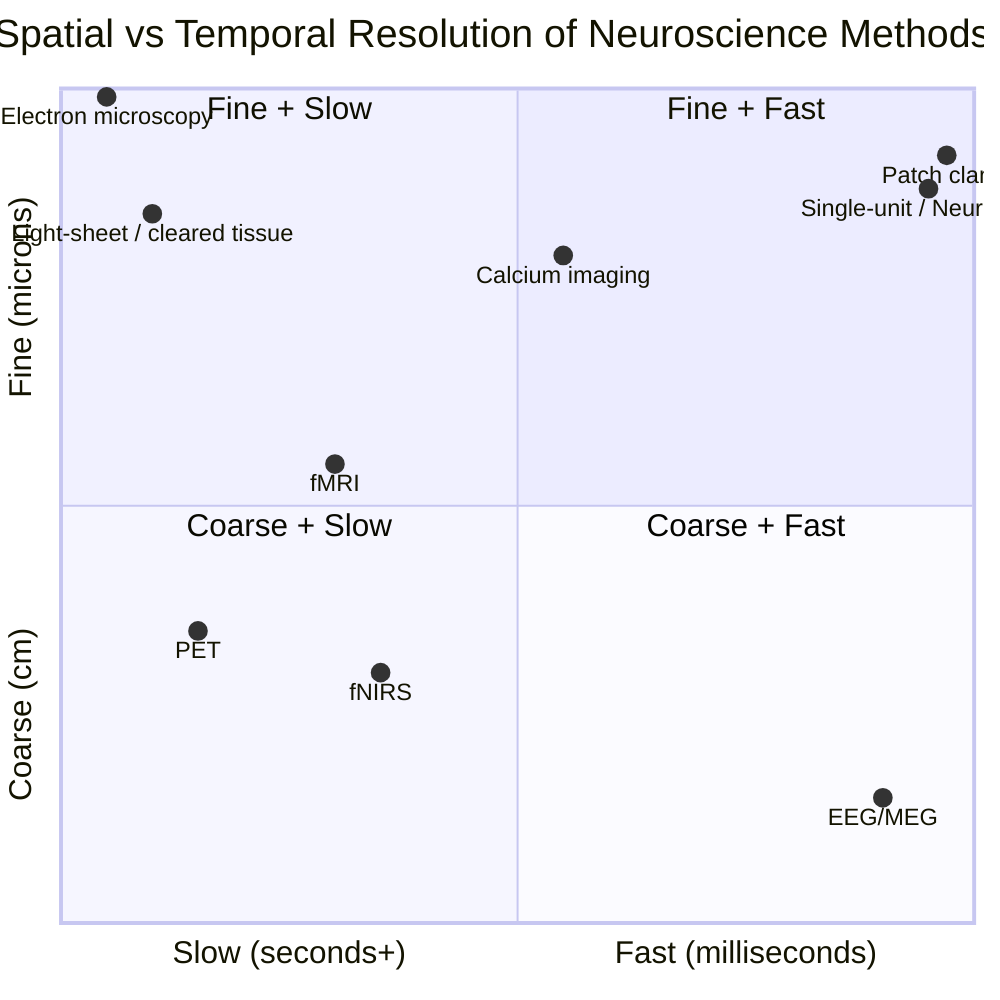
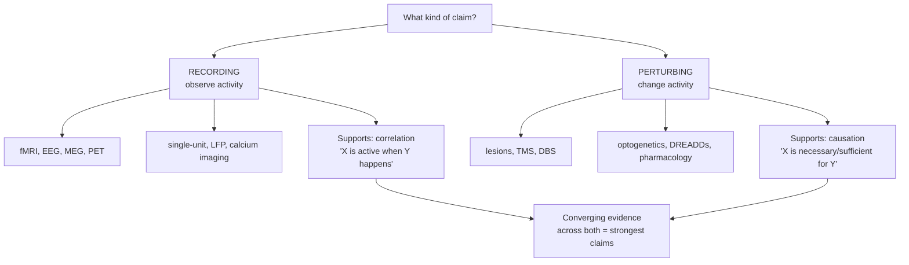

# The Methods of Neuroscience: How We Know What We Know About the Brain

Every fact in neuroscience is downstream of a method. When a textbook says "the hippocampus is required for forming new episodic memories," or "dopamine neurons signal reward prediction error," or "the fusiform face area responds selectively to faces," each claim is really a compressed summary of a measurement made with a specific instrument that has specific strengths and specific blind spots. Understanding the brain therefore requires understanding the tools — not as a dry catalogue, but as a set of epistemic lenses, each of which brings part of the picture into focus while blurring the rest.

This document is organized around a few recurring tensions that structure the entire field:

- **The spatial–temporal resolution trade-off.** No single method sees both individual synapses *and* millisecond-by-millisecond dynamics across the whole brain. Methods that resolve fine spatial detail tend to be slow, invasive, or static; methods with fine temporal resolution tend to be spatially blurry or sparse. Progress often comes from combining methods rather than perfecting one.
- **Recording versus perturbing.** Watching the brain (recording) tells you what *correlates* with a behavior or state. Changing the brain (perturbing) — by lesion, stimulation, or genetic silencing — is what licenses claims that a region or cell type is *necessary* or *sufficient* for a function. These are fundamentally different kinds of evidence.
- **Correlation versus causation, and the limits of inference.** Neuroimaging in particular is a vast correlation engine, and the field has repeatedly had to learn (and re-learn) the difference between "this area lit up" and "this area does the thing."
- **The model-organism gap.** Most mechanistic neuroscience is done in worms, flies, fish, and mice, because those systems permit experiments impossible in humans. Every such result carries an implicit question mark about how far it extrapolates to the human brain.

The goal here is not to rank methods but to make their assumptions legible, so that any neuroscientific claim can be traced back to the kind of evidence that supports it.

---

## Table of Contents

1. [The Resolution Landscape: A Map of the Trade-offs](#1-the-resolution-landscape-a-map-of-the-trade-offs)
2. [Structural Imaging and Anatomy](#2-structural-imaging-and-anatomy)
3. [Functional Imaging](#3-functional-imaging)
4. [Electrophysiology](#4-electrophysiology)
5. [Perturbation and Causal Methods](#5-perturbation-and-causal-methods)
6. [Molecular and Genetic Tools](#6-molecular-and-genetic-tools)
7. [Behavioral and Computational Methods](#7-behavioral-and-computational-methods)
8. [The Critical Section: Correlation, Causation, and Credibility](#8-the-critical-section-correlation-causation-and-credibility)
9. [The Model-Organism Question](#9-the-model-organism-question)
10. [Summary Comparison Table](#10-summary-comparison-table)
11. [Sources](#sources)

---

## 1. The Resolution Landscape: A Map of the Trade-offs

Before surveying individual methods, it helps to see them positioned in the two-dimensional space that dominates the field: **spatial resolution** (the finest spatial detail a method can distinguish) versus **temporal resolution** (the finest time interval it can distinguish). A third axis — **invasiveness** — cuts across both and determines whether a method can be used in living humans, in anesthetized animals, or only in fixed dead tissue.

The rough ordering runs like this. Electron microscopy resolves nanometer-scale synapses but only in dead, fixed tissue frozen in a single instant — infinite spatial detail, zero temporal information. At the other extreme, EEG and MEG track brain activity at millisecond resolution but localize it only to broad regions of centimeters. In between sit the workhorses: fMRI trades speed for millimeter spatial resolution; single-unit electrophysiology trades whole-brain coverage for single-neuron, sub-millisecond precision at the tip of an electrode.

Two caveats about this map. First, it is a caricature: many methods have variants that push into new territory (ultra-high-field fMRI approaches sub-millimeter cortical layers; fast voltage imaging pushes optical methods toward millisecond speed). Second, position on the map is not quality — a method is only "better" relative to a specific question. The right question is never "which method is best?" but "which method's blind spots are tolerable for *this* claim?"

The record-versus-perturb distinction is orthogonal to resolution and deserves its own picture, because it maps directly onto the correlation-versus-causation divide.

---

## 2. Structural Imaging and Anatomy

Structural methods answer "what is there and how is it wired," independent of moment-to-moment activity. They range from whole-head clinical scans down to the nanometer wiring of individual synapses.

### 2.1 Magnetic Resonance Imaging (MRI)

**What it measures.** Structural MRI exploits the magnetic properties of hydrogen nuclei (protons), overwhelmingly in water and fat. A strong static field aligns proton spins; radiofrequency pulses tip them; the signal they emit as they relax back depends on tissue type. By varying pulse timing (T1-weighted, T2-weighted, FLAIR, etc.) MRI generates exquisite soft-tissue contrast, cleanly separating gray matter, white matter, and cerebrospinal fluid.

**Resolution.** Spatial resolution is roughly **0.5–1 mm** on standard clinical 3-tesla scanners, finer at higher field strengths (7 T and above). Temporally it is static — a structural scan is a snapshot taking minutes to acquire.

**What it cannot tell you.** Nothing about function or activity. A structural MRI of two people performing wildly different mental tasks looks identical. It also cannot resolve individual cells, layers (at standard resolution), or the direction of connections. Contrast differences reflect bulk tissue properties, not cell types.

**Key caveat.** MRI-derived measures like cortical thickness or regional volume are model-dependent — the numbers depend on the segmentation software, its version, and its parameters. Cross-study comparisons can be confounded by pipeline differences as much as by biology.

### 2.2 Diffusion Tensor Imaging (DTI) and Tractography

**What it measures.** Diffusion MRI measures the direction-dependence (anisotropy) of water diffusion. In white matter, water diffuses more freely *along* axon bundles than across them. By mapping the principal diffusion direction in each voxel and stitching those directions together, **tractography** reconstructs the brain's major fiber pathways.

**Resolution.** Same voxel scale as MRI (~1–2 mm); each voxel contains millions of axons, so this is a coarse, population-level picture of connectivity.

**What it cannot tell you.** Tractography does **not** trace individual axons and cannot determine the *direction* of information flow (it is agnostic to whether a tract carries signals A→B or B→A). It struggles badly where fibers cross, kiss, or fan out — a single voxel with crossing bundles yields ambiguous or spurious tracts.

**Key caveat.** Tractography produces **false positives and false negatives** at rates that surprise newcomers. Validation studies comparing tractography against known anatomy (e.g., tracer studies in monkeys) find that reconstructed "connections" can be anatomically nonexistent artifacts of the reconstruction algorithm. Tract "integrity" metrics like fractional anisotropy (FA) are influenced by myelination, axon packing, crossing fibers, and edema simultaneously, so a change in FA has no single biological interpretation.

### 2.3 Computed Tomography (CT)

**What it measures.** CT reconstructs a 3D X-ray attenuation map. Dense tissue (bone) blocks X-rays strongly; soft tissue and fluid less so. It excels at bone, acute hemorrhage (fresh blood is bright), and gross lesions.

**Resolution.** Sub-millimeter to millimeter spatial; a scan takes seconds, which is why CT dominates emergency settings (stroke, trauma).

**What it cannot tell you.** Poor soft-tissue contrast compared to MRI; it cannot distinguish subtle gray/white differences or detect most functional or microstructural changes. It uses ionizing radiation, limiting repeat use.

**Key caveat.** CT's speed and availability make it the first scan in acute care, but a "normal" CT does not rule out pathology that only MRI would reveal (early ischemic stroke, small lesions, demyelination).

### 2.4 Histology and the Classic Stains

Before imaging, and still foundational, anatomy was done by slicing fixed tissue thin and staining it.

- **Golgi stain (the "black reaction").** Silver chromate impregnates a *sparse, random subset* (~1–10%) of neurons but fills them completely — soma, dendrites, and axon. This sparseness is precisely what makes it useful: a fully stained neuron stands out against a clear background. It was the Golgi stain that let **Santiago Ramón y Cajal** visualize individual neurons and argue for the **neuron doctrine** (that the nervous system is made of discrete cells, not a continuous reticulum). Cajal and Golgi shared the 1906 Nobel Prize while disagreeing about what the stain showed.
- **Nissl stain** (cresyl violet, thionin). Binds RNA-rich structures (rough endoplasmic reticulum, ribosomes), staining cell bodies but not processes. It reveals the *density and arrangement* of cell bodies — the basis for defining **cytoarchitectonic areas** (e.g., Brodmann's map).
- **Myelin stains** (e.g., Weigert) label myelinated tracts, revealing white-matter organization.

**What histology cannot tell you.** It is fundamentally *static and dead* — no dynamics. Golgi's sparseness means you cannot see all cells at once or trace complete circuits. Stains are also notoriously capricious (Golgi impregnation is famously inconsistent), and 2D sections lose 3D continuity unless painstakingly reconstructed.

### 2.5 Modern Connectomics, Tissue Clearing, and Electron Microscopy

- **Tissue clearing (CLARITY and successors).** Developed in the Deisseroth lab, CLARITY replaces the lipid bilayers that scatter light with a transparent hydrogel, rendering an intact brain optically transparent while preserving proteins and nucleic acids for labeling. Combined with **light-sheet microscopy**, this allows whole intact (usually rodent) brains to be imaged in 3D without physical sectioning. Resolution is optical (micron-scale) but coverage is whole-organ.
- **Electron microscopy (EM).** The gold standard for the finest structure. Serial-section or block-face EM resolves individual synapses, vesicles, and membranes at **nanometer** resolution — the only method that reliably identifies synaptic connections. This is how the **complete connectome of *C. elegans*** (302 neurons, ~7,000 synapses) was reconstructed, and how the *Drosophila* brain connectome and small mammalian volumes (e.g., a cubic millimeter of mouse and human cortex) are now being mapped.

**What connectomics cannot tell you.** A connectome is a wiring diagram, not a function. Knowing every synapse in *C. elegans* did **not** hand us an understanding of its behavior — synapse strength, neuromodulation, and dynamics are invisible in the static graph. EM is also astronomically labor- and data-intensive: a cubic millimeter of cortex yields petabytes of images requiring automated (and error-prone) segmentation. The recurring lesson: **structure constrains but does not determine function.**

---

## 3. Functional Imaging

Functional methods measure activity, mostly *indirectly* through metabolic or hemodynamic proxies rather than the electrical signaling itself.

### 3.1 Functional MRI (fMRI) and the BOLD Signal

**What it actually measures.** fMRI does *not* measure neural firing. It measures the **blood-oxygen-level-dependent (BOLD)** signal — a change in the ratio of oxygenated to deoxygenated hemoglobin. When a region becomes active, local metabolism rises, and the brain *overcompensates* by increasing blood flow beyond the oxygen consumed, so the local blood becomes *more* oxygenated. Because deoxyhemoglobin is paramagnetic (it distorts the magnetic field) and oxyhemoglobin is not, this shift changes the MR signal. The link from neural activity to BOLD runs through **neurovascular coupling**, and the best evidence indicates BOLD correlates most strongly with **local field potentials** (synaptic input and local processing) rather than with spiking output.

**Resolution.** Spatial: typically **2–3 mm** (routinely), down to sub-millimeter at ultra-high field. Temporal: limited not by the scanner but by *biology* — the **hemodynamic response function** rises over ~4–6 seconds and takes ~15–20 s to fully resolve. So even with fast sampling, BOLD blurs neural events happening milliseconds apart into a smear of seconds.

**What it cannot tell you.** (1) It cannot resolve individual neurons or distinguish excitation from inhibition (both consume energy and can raise BOLD). (2) It cannot see the direction of information flow within an activated network. (3) It is a *relative* measure — nearly all fMRI is about *differences* between conditions (task minus baseline), not absolute activity. (4) It says nothing about *causation*: an area's activation does not prove it is necessary for the task.

**The dead-salmon cautionary tale.** In a now-famous demonstration, Craig Bennett and colleagues placed a **dead Atlantic salmon** in a scanner and "showed" it photographs of humans in emotional situations. With standard uncorrected statistics, a cluster of voxels in the dead fish's brain showed "significant" task-related activation (cluster-level p = 0.001). The point: an fMRI volume contains tens of thousands of voxels, each tested independently. At any uncorrected threshold, a predictable number will pass by chance alone — even in a dead fish. **Multiple-comparisons correction** (family-wise error, false discovery rate, cluster-based permutation) is not optional statistical fussiness; it is the difference between a result and noise. When the work was presented (~2009), an estimated 25–40% of fMRI papers reported *no* correction; the paper (and its 2012 Ig Nobel Prize) helped push that figure down. A later 2016 analysis of cluster-based inference software showed that even *corrected* methods, if their statistical assumptions were violated, could inflate false-positive rates far above nominal — a second, deeper wave of the same lesson.

**Key caveat.** BOLD is a proxy for a proxy: an indirect hemodynamic shadow of aggregate synaptic activity, delayed by seconds and averaged over millimeters. It is superb for *localizing where* something correlates with a task in a living human, and nearly useless for *when* (at neural timescales) or *how* (mechanistically) or *whether it matters* (causally).

### 3.2 Positron Emission Tomography (PET)

**What it measures.** PET detects gamma rays emitted (indirectly, via positron annihilation) from an injected **radioactive tracer**. Its power is *molecular specificity*: with the right tracer you can image glucose metabolism (FDG), dopamine receptor availability (raclopride), amyloid or tau deposition (Alzheimer's tracers), neuroinflammation, and more. This is something no other in-vivo method offers — you choose the molecule you want to see.

**Resolution.** Spatial: **~4–6 mm**, coarser than fMRI. Temporal: **poor** — minutes, set by tracer kinetics and the need to accumulate enough counts.

**What it cannot tell you.** Fast dynamics; fine structure. And it requires **injecting radioactivity**, which limits scan frequency and excludes many populations (children, pregnant people, repeated longitudinal use).

**Key caveat.** A tracer's binding reflects far more than the target of interest — regional blood flow, tracer delivery, receptor density *and* endogenous ligand competition all shape the signal. Quantification depends on kinetic modeling assumptions that are easy to get subtly wrong.

### 3.3 Functional Near-Infrared Spectroscopy (fNIRS)

**What it measures.** Like fMRI, fNIRS measures hemodynamics — but optically. Near-infrared light (wavelengths where tissue is relatively transparent) shone through the scalp is differentially absorbed by oxy- and deoxyhemoglobin; detectors a few centimeters away measure how much returns.

**Resolution.** Spatial: **~1–3 cm**, and crucially limited to the **outer cortex** — light penetrates only ~1–3 cm, so deep structures are invisible. Temporal: better than fMRI in sampling rate but still bounded by the same slow hemodynamic response.

**What it cannot tell you.** Anything subcortical. Anything with fine spatial detail. Its great advantages are portability, tolerance of movement, and safety (usable in infants, at the bedside, during natural behavior) — bought at the cost of depth and resolution.

**Key caveat.** The signal is contaminated by blood-flow changes in the scalp and skull (systemic physiology, not brain), and skin/hair affect signal quality. Careful "short-channel" regression is needed to separate brain from superficial confounds.

---

## 4. Electrophysiology

Electrophysiology measures the *electrical* activity of neurons directly — the actual currency of neural signaling — trading, at the invasive end, spatial coverage for exquisite temporal precision.

### 4.1 Electroencephalography (EEG) and Event-Related Potentials (ERPs)

**What it measures.** Electrodes on the scalp record voltage fluctuations produced by the **summed synaptic activity of large populations of cortical neurons** — principally the synchronized post-synaptic potentials of pyramidal cells oriented perpendicular to the surface. It is non-invasive, cheap, and portable.

**Resolution.** Temporal: **excellent, ~1 ms** — EEG tracks neural dynamics essentially in real time. Spatial: **poor, centimeters**, and fundamentally limited by the **inverse problem**: infinitely many internal source configurations can produce the same scalp voltage pattern, so localizing the generator is mathematically underdetermined.

**ERPs.** Averaging EEG time-locked to many repetitions of an event cancels noise and reveals stereotyped **event-related potentials** (e.g., the P300, the N400 for semantic surprise, the mismatch negativity). These give millisecond-precise markers of processing stages.

**What it cannot tell you.** *Where* precisely (deep sources especially are nearly inaccessible; the skull smears and attenuates signals). Individual neurons. Activity that isn't synchronized and geometrically aligned (radial/closed-field sources are near-invisible).

**Key caveat.** EEG is dominated by cortical surface, synchronized, well-oriented sources; much of the brain's activity is invisible to it. Source localization ("this frontal ERP comes from the anterior cingulate") is a model-based *inference*, not a measurement.

### 4.2 Magnetoencephalography (MEG)

**What it measures.** MEG detects the tiny *magnetic fields* generated by the same neuronal currents EEG measures, using superconducting sensors (SQUIDs, and increasingly optically-pumped magnetometers). Magnetic fields pass through the skull less distorted than electric fields.

**Resolution.** Temporal: **~1 ms**, like EEG. Spatial: somewhat better than EEG (skull doesn't smear magnetic fields), but still centimeter-scale and still subject to the inverse problem.

**What it cannot tell you.** MEG is most sensitive to sources *tangential* to the skull (in sulci) and relatively blind to radial sources (on gyral crowns) — a complementary blind spot to EEG. Deep sources remain hard. It requires a magnetically shielded room and, for SQUIDs, cryogenic cooling — expensive and immobile.

**Key caveat.** MEG and EEG are complementary (different source orientations); combining them constrains localization better than either alone — but neither escapes the fundamental non-uniqueness of the inverse problem.

### 4.3 Single-Unit and Multi-Unit Recording

**What it measures.** A fine microelectrode placed near (or into) neural tissue records the extracellular voltage transients of **action potentials**. Sorting these "spikes" by waveform shape isolates the firing of individual neurons (**single-unit**) or small clusters (**multi-unit**). This is the method behind foundational discoveries: Hubel and Wiesel's orientation-selective visual neurons, O'Keefe's hippocampal **place cells**, the Moser lab's **grid cells**.

**Resolution.** Spatial: single-neuron; temporal: **sub-millisecond** — individual spikes are resolved exactly. This is the gold standard for *what* a neuron computes.

**What it cannot tell you.** Coverage is tiny — a handful to dozens of neurons out of billions, at one location. It is **highly invasive** (electrode into the brain), so in humans it is rare, done only during clinically necessary surgery (e.g., epilepsy monitoring, DBS targeting). Spike sorting is imperfect: waveforms overlap, electrodes drift, and a "single unit" may be a mixture.

**Key caveat.** The neurons you record are a **biased sample** — you tend to detect large, active, well-isolated cells; silent or small neurons are systematically under-sampled. Conclusions about "the population" can be skewed by what the electrode happens to hear.

### 4.4 Local Field Potentials (LFP)

**What it measures.** The *low-frequency* component of the same extracellular signal (below ~300 Hz) reflects summed synaptic and subthreshold activity in the local neighborhood (hundreds of microns to millimeters) — inputs and local processing rather than spiking output. LFP oscillations (theta, gamma, etc.) index population dynamics and are the signal most tightly linked to the BOLD response.

**What it cannot tell you.** LFP mixes contributions from many sources and volume-conducts from a distance, so pinning down *what* generates a given rhythm, and *where*, is genuinely hard. It reflects input/processing more than output.

### 4.5 Patch Clamp

**What it measures.** A glass micropipette forms a high-resistance ("gigaohm") seal onto a neuron's membrane, giving direct electrical access. It measures **membrane voltage and currents with sub-millisecond, sub-picoampere precision** — including, in single-channel mode, the opening and closing of *individual ion channels*. It is the definitive method of cellular and molecular electrophysiology (Neher and Sakmann, Nobel 1991).

**Resolution.** Spatial: single cell (or single channel); temporal: sub-millisecond. Unmatched precision on one cell.

**What it cannot tell you.** Almost nothing about networks or behavior — it is one cell at a time. In vivo patch is heroic and rare; most is done in slices or culture, i.e., tissue removed from its normal context.

**Key caveat.** The very act of patching perturbs the cell (dialyzing its interior in whole-cell mode). And a slice is not a brain: severed connections, altered neuromodulatory tone, and non-physiological conditions mean cellular properties may differ from the intact, behaving animal.

### 4.6 High-Density Probes (Neuropixels)

**What it measures.** Neuropixels probes are a transformative advance: a single thin silicon shank (~10 mm long, ~70 × 20 μm cross-section) carrying **hundreds of simultaneously recorded channels** addressing ~960 closely spaced sites. A probe records **hundreds of neurons across many brain regions at once**, spanning the electrode's depth, at full electrophysiological time resolution.

**Resolution.** Spatial: single-neuron, with recording sites ~20 μm apart (denser in newer "Ultra" variants); temporal: spike band digitized at **30 kHz** (plus a separate ~2.5 kHz LFP band). This partially breaks the old trade-off — many single neurons *and* millisecond resolution *and* multi-region coverage — but only along a linear track through the tissue, and still invasively.

**What it cannot tell you.** Only tissue immediately adjacent to the shank is heard; the brain is sampled along a line, not a volume. It remains invasive (primarily rodents and nonhuman primates, with rare human intraoperative use). Dense recording makes spike sorting harder, not easier, and probe drift over hours challenges the identity of "the same neuron" over time.

**Key caveat.** Scale creates its own problems: the analysis burden (sorting thousands of units, tracking them across drift) is now often the limiting factor, and "recording a lot of neurons" is not the same as recording an *unbiased* or *complete* sample of a circuit.

---

## 5. Perturbation and Causal Methods

Recording establishes correlation. To claim a region or cell *causes* a function, you must **change** it and observe the consequence. This is the deepest methodological divide in the field.

### 5.1 Lesion Studies

**Natural lesions.** The oldest causal method in neuroscience is the accident of nature or disease. **Phineas Gage's** frontal-lobe injury (personality change), **patient H.M.'s** surgical removal of the medial temporal lobes (profound anterograde amnesia with preserved skill learning), **Broca's** and **Wernicke's** aphasia patients (speech production vs. comprehension) — each linked a damaged region to a lost function, licensing "region X is necessary for function Y."

**Experimental lesions.** In animals, controlled ablation (aspiration, excitotoxin, cooling, or reversible inactivation) tests necessity deliberately.

**What lesions cannot tell you.** (1) **Sufficiency** — that a region is necessary doesn't mean it alone produces the function. (2) Natural lesions are *uncontrolled*: they don't respect anatomical boundaries, they damage passing fibers as well as local cells, and they are one-of-a-kind (n=1 case studies). (3) **Plasticity and diaschisis** confound interpretation: after damage, the brain reorganizes, and remote regions connected to the lesion also malfunction — so a deficit may reflect network disruption, not loss of a local "module."

**Key caveat.** A lesion deletes a node *and* everything wired through it, permanently, while the rest of the brain compensates. The inference "this function lives here" is far shakier than the clean-sounding case reports suggest.

### 5.2 Transcranial Magnetic Stimulation (TMS)

**What it does.** A rapidly changing magnetic field from a coil on the scalp induces electrical currents in the underlying cortex, non-invasively exciting or disrupting local activity. A single pulse can evoke a response (e.g., a muscle twitch from motor cortex) or transiently disrupt processing (a "virtual lesion"); repetitive TMS (rTMS) can raise or lower cortical excitability for minutes to longer, and is an approved treatment for depression.

**Resolution.** Spatial: **~1–2 cm**, superficial cortex only (depth falls off fast). Temporal: **millisecond** for the pulse itself — good enough to test *when* a region is causally involved.

**What it cannot tell you.** Deep structures directly. And "focal" is relative — the induced field spreads, and effects propagate through connected networks, so the perturbation isn't as localized as the coil position implies.

**Key caveat.** TMS effects depend heavily on the brain's current state, coil orientation, and individual anatomy; it also produces salient clicks and scalp sensations, so proper **sham controls** are essential to separate neural effects from placebo and confounds.

### 5.3 Transcranial Direct/Alternating Current Stimulation (tDCS/tACS)

**What it does.** Weak currents (typically ~1–2 mA) passed between scalp electrodes gently **bias** neuronal membrane potentials — nudging excitability up (anodal) or down (cathodal) rather than triggering spikes.

**What it cannot tell you.** The current is diffuse (large electrodes, current spreads and shunts through scalp), so spatial targeting is crude. Effect sizes are small and notoriously variable.

**Key caveat.** tDCS is the most **reproducibility-troubled** of the stimulation methods: modeling shows only a fraction of the applied current reaches cortex, individual anatomy strongly shapes where it goes, and many published effects have failed to replicate. Treat single positive studies with caution.

### 5.4 Deep Brain Stimulation (DBS)

**What it does.** Surgically implanted electrodes deliver chronic high-frequency electrical stimulation to deep targets (e.g., the subthalamic nucleus for Parkinson's disease, and investigationally for OCD, dystonia, depression). It is both a therapy and a research tool for probing deep circuits in humans.

**What it cannot tell you (mechanistically).** Strikingly, *how* DBS works is still debated — it may inhibit local cell bodies, excite axons, disrupt pathological oscillations, or all of these. Clinical efficacy outran mechanistic understanding.

**Key caveat.** It is highly invasive (brain surgery) and its therapeutic-but-opaque mechanism is a reminder that *working* and *being understood* are different things.

### 5.5 Optogenetics

**What it does.** Optogenetics introduces **light-sensitive ion channels or pumps** (microbial opsins such as **channelrhodopsin-2**, first expressed in neurons by Deisseroth and colleagues) into genetically defined neurons. Shining light (e.g., blue ~470 nm for ChR2) then **turns those specific neurons on or off with millisecond precision**. Because expression is targeted by cell type (via promoters or Cre lines) and control is by light pulses, optogenetics delivers what earlier tools could not: **cell-type-specific, temporally precise, causal** control. It has been named a Method of the Year and underlies a huge fraction of modern circuit neuroscience.

**Resolution.** Spatial: genetically defined cell populations (and, with focused light, small regions); temporal: **millisecond**, fast enough to test the causal role of *specific spike patterns*.

**What it cannot tell you / limitations.** (1) It requires **genetic access** — routine in mice, hard in primates, not (yet) usable therapeutically in humans at scale. (2) It requires implanting a light source and delivering opsin genes (usually via virus), i.e., it is invasive and involves engineering the tissue. (3) Driving neurons with light produces **artificial, often synchronous** activity patterns that may not resemble natural firing — you can prove a circuit *can* drive a behavior without proving it *normally does*.

**Key caveat.** Opsin expression can be uneven or toxic; light causes heating; and, as with any strong perturbation, downstream and compensatory effects mean a behavioral change is a network-level readout, not proof the manipulated cells alone "encode" the behavior. Still, optogenetics is the closest neuroscience has to a scalpel for causation.

### 5.6 Chemogenetics (DREADDs)

**What it does.** DREADDs ("Designer Receptors Exclusively Activated by Designer Drugs") are engineered receptors — e.g., the muscarinic-based hM3Dq (excitatory) and hM4Di (inhibitory) — expressed in target neurons. They ignore native ligands but respond to an otherwise inert designer drug (classically clozapine-N-oxide, CNO), letting a systemic injection **switch a defined population on or off for hours**.

**Resolution.** Spatial: genetically defined populations; temporal: **coarse — minutes to hours**, set by drug pharmacokinetics. The complement to optogenetics: chemogenetics trades temporal precision for sustained, wireless, whole-population modulation without implants.

**Key caveat.** The "inert" ligand is not perfectly inert: **CNO is metabolized back to clozapine**, a psychoactive compound with its own effects — so proper controls (DREADD-free animals given CNO) are essential to avoid attributing drug side-effects to the manipulation.

### 5.7 Pharmacology

**What it does.** Drugs that block or activate specific receptors, transporters, or channels probe the *molecular* basis of function — historically the primary tool for mapping neurotransmitter systems (dopamine, serotonin, glutamate, GABA).

**What it cannot tell you.** Spatial precision is usually poor (systemic drugs act everywhere the target is expressed); temporal precision is set by pharmacokinetics.

**Key caveat.** **Selectivity is never perfect.** Most drugs hit multiple targets; "specific" antagonists have off-target actions at higher doses; and compensatory changes (receptor up/down-regulation) complicate chronic studies. A behavioral effect of a drug implicates a *system*, rarely a single locus.

---

## 6. Molecular and Genetic Tools

These methods identify and manipulate the molecular identity of cells — the layer beneath activity.

### 6.1 Knockouts, Knock-ins, and Transgenics

**What they do.** Genetic engineering (classic knockouts, conditional Cre/lox knockouts, knock-ins, and modern CRISPR editing) deletes, replaces, or adds genes to test their role in development, physiology, and behavior. **Conditional and inducible** systems restrict the change to particular cell types or time windows, and drive tools like optogenetics and calcium imaging by expressing transgenes in defined neurons.

**What they cannot tell you cleanly.** A *constitutive* knockout affects the animal from conception, so **developmental compensation** — other genes or pathways adapting to the loss — can mask or distort the adult phenotype. The absence of a deficit does not mean the gene is unimportant; it may mean the system routed around it.

**Key caveat.** Phenotypes depend on **genetic background** (the same knockout behaves differently across mouse strains) and on environment. Interpreting a knockout requires distinguishing the direct role of the gene from downstream, developmental, and compensatory consequences.

### 6.2 Calcium Imaging (GCaMP)

**What it measures.** Genetically encoded calcium indicators (**GCaMP** and relatives) are fluorescent proteins that brighten when intracellular calcium rises. Since calcium surges when a neuron fires, fluorescence is a **proxy for spiking**. Combined with two-photon microscopy (or miniature head-mounted "miniscopes" in freely moving animals), GCaMP images the activity of **hundreds to thousands of identified neurons simultaneously**, with each cell's location and (via genetic targeting) type known.

**Resolution.** Spatial: single-cell, and you *know which cell* over days; temporal: **limited by calcium dynamics** — the indicator's rise and (especially) slow decay blur individual spikes, so effective temporal resolution is tens to hundreds of milliseconds, far coarser than electrophysiology.

**What it cannot tell you.** Precise spike timing and fast rates (fused by the slow decay); mostly restricted to accessible/superficial tissue optically (deep imaging needs implanted lenses). Calcium is an *indirect* stand-in for voltage.

**Key caveat.** Calcium is not spikes: subthreshold activity, and the exact number/timing of action potentials, are not read out faithfully. Indicator expression levels, buffering, and photobleaching all shape the signal. (Voltage indicators are emerging to close the timing gap but are harder to use.)

### 6.3 Immunohistochemistry (IHC)

**What it measures.** Antibodies tagged with a visible marker bind specific proteins in fixed tissue, revealing **which cells express which molecules** and where. A staple for identifying cell types (e.g., parvalbumin interneurons), mapping receptor distributions, and — via **immediate-early genes** like c-Fos — inferring which neurons were *recently active* (a static snapshot of prior activity).

**Key caveat.** Antibody **specificity is a chronic problem**: many commercial antibodies bind off-target, and validation (knockout controls) is often skipped, contributing to irreproducible results. Fixation and staining artifacts abound. c-Fos marks *some* kinds of strong activity, not all, and gives one time point, not dynamics.

### 6.4 In Situ Hybridization (ISH)

**What it measures.** Labeled nucleic-acid probes bind complementary **mRNA**, showing which cells are *transcribing* a given gene — complementary to IHC (which detects the protein product). The Allen Brain Atlas mapped gene expression across the mouse brain at scale using ISH.

**Key caveat.** mRNA presence does not guarantee protein is made or functional; it is a snapshot of transcription, not activity or function.

### 6.5 Single-Cell RNA Sequencing (scRNA-seq)

**What it measures.** Sequencing the RNA of *individual* cells reveals each cell's full expression profile, enabling **unbiased, data-driven classification of cell types**. This has exploded our census of neuronal and glial diversity — the brain has far more distinct cell types than classic morphology suggested — and grounds modern "cell atlas" efforts.

**What it cannot tell you.** Standard scRNA-seq requires **dissociating tissue**, destroying spatial and connectivity information (spatial transcriptomics methods are recovering some of this). It is a snapshot; it says nothing directly about a cell's activity, connections, or function — only its molecular identity.

**Key caveat.** Dissociation is biased (some cell types survive better), transcript capture is incomplete and noisy, and "cell types" defined by clustering are partly a function of the algorithm and thresholds chosen — a taxonomy, not a ground truth.

### 6.6 Viral Tracing

**What it does.** Engineered viruses injected into the brain travel along axons, labeling connected neurons. **Anterograde** tracers move from cell body toward terminals (outputs); **retrograde** tracers move backward (inputs). **Trans-synaptic** viruses (notably modified rabies) jump across synapses to reveal *monosynaptic inputs* to a defined population — mapping circuits with cell-type specificity that diffusion tractography cannot approach.

**What it cannot tell you.** Function — tracing shows connectivity, not what the connection does. It is invasive (injection into living tissue) and read out post-mortem.

**Key caveat.** Viruses have **tropism** (they infect some cell types better than others), can be **toxic** (rabies especially kills cells over time, bounding the experiment), and can spread incompletely or non-specifically. A tracer map is a labeled subset, not the whole connectome.

---

## 7. Behavioral and Computational Methods

Ultimately neuroscience wants to explain **behavior and cognition**, and increasingly to *model* the systems it measures.

### 7.1 Animal Models and Behavioral Assays

Controlled behavior is what gives physiological measurements meaning. Standardized assays — mazes (Morris water maze, radial arm), fear conditioning, operant tasks, forced-swim and elevated-plus-maze "models" of affect — let researchers quantify learning, memory, anxiety, and motivation and correlate them with neural manipulations.

**Translational limits.** A rodent "model of depression" (e.g., behavioral despair in a swim test) is an *analogy*, not the human disorder; it captures a behavioral readout that may or may not share mechanism with the human condition. The graveyard of failed neuropsychiatric drugs — compounds that cured the mouse model and did nothing for patients — is the standing warning here.

### 7.2 Psychophysics

**What it does.** Psychophysics rigorously relates *physical stimuli* to *reported perception* — thresholds, just-noticeable differences, psychometric functions, signal-detection analyses. It requires no brain measurement at all, yet it defines the phenomena (contrast sensitivity, loudness, reaction-time laws) that physiology must explain, and it remains one of the most quantitatively precise tools in all of neuroscience.

**Key caveat.** It is a behavioral, black-box method: it constrains what the brain must be computing without revealing *how* or *where*. Its rigor is also its scope limit.

### 7.3 Computational Modeling

**What it does.** Models range from **biophysical** (Hodgkin–Huxley neuron models, detailed compartmental simulations) through **network/circuit** models to abstract **normative** theories (Bayesian inference, reinforcement learning, predictive coding). Models make theories explicit and testable: reinforcement-learning models predicted a **reward-prediction-error** signal that was then found in dopamine neurons — a landmark case of theory guiding physiology. Modern **deep neural networks** also serve as (imperfect) models of sensory hierarchies.

**Key caveat.** A model that *fits* data is not thereby *true* — many different models can fit the same measurements (the identifiability problem), and a model's parameters may not correspond to anything biological. Fitting is not explaining; the value of a model lies in the *novel, falsifiable predictions* it makes, not in post-hoc fit.

### 7.4 Big Data and Brain Atlases

Large shared resources — the **Human Connectome Project**, the **UK Biobank** imaging cohort, the **Allen Brain Atlases** of gene expression and connectivity, the **BRAIN Initiative** cell census — pool data at scales no single lab can reach, enabling population-level statistics, standardized reference frames, and reuse. Big samples are the antidote to the underpowered-study problem (Section 8).

**Key caveat.** Scale amplifies *both* signal and bias: a systematic artifact in a huge, homogeneous dataset (e.g., a scanner effect, or a non-representative sample skewed toward one demographic) produces confident, precise, *wrong* conclusions. Standardized atlases also impose a fixed parcellation that may not match any individual brain. Big data raises statistical power but does not by itself fix bias or confounding.

---

## 8. The Critical Section: Correlation, Causation, and Credibility

Methods produce measurements; *inference* turns measurements into claims. This is where neuroscience most often goes wrong.

### 8.1 The Correlation–Causation Gap

The single most important interpretive rule: **recording methods establish correlation; only perturbation licenses causation.** That an area activates during a task (fMRI), or a neuron fires before a movement (single-unit), shows *involvement*, not *necessity* or *sufficiency*. The area might be a downstream reporter, a general-purpose resource, or epiphenomenal to the computation. To move from "correlates with" to "is required for," you need a lesion, TMS virtual lesion, or optogenetic/chemogenetic silencing — and even then, "required" is a network-level statement, because deleting a node perturbs everything wired through it.

### 8.2 Reverse Inference

A pervasive fallacy, articulated by Russell Poldrack (2006): reasoning **backward** from activation to cognition — "the amygdala lit up, therefore the subject felt fear," or "the insula activated, so this is disgust." The logic fails because most brain regions are engaged by *many* cognitive processes; the amygdala responds to salience and novelty broadly, not fear alone. Reverse inference is only as good as the region's **selectivity** — how much more likely that region is to activate for the claimed process than for everything else. It is not always invalid (with strong selectivity and formal Bayesian weighting it can be informative), but the casual version — rampant in press coverage and not rare in papers — is unjustified.

### 8.3 Reproducibility and Statistical Power

Much of neuroscience has been **chronically underpowered**. A landmark analysis (Button et al., 2013) estimated the median statistical power of neuroscience studies at only **~20%**, meaning most experiments had little chance of detecting a true effect even when present. Low power has an under-appreciated corollary: it not only misses real effects, it makes the effects that *do* reach significance more likely to be **false positives and inflated in size** (the "winner's curse"). Small samples plus flexible analysis ("researcher degrees of freedom," or *p-hacking*) manufacture significant-looking results from noise — exactly the mechanism the dead salmon dramatized.

### 8.4 The Multiple-Comparisons Problem, Revisited

The dead-salmon lesson generalizes far beyond fMRI. Any method that tests thousands of features — voxels, genes, electrodes, time-frequency bins — will produce chance "hits" unless the threshold is corrected for the number of tests. And correction is not a solved formality: the 2016 cluster-inference controversy showed that widely used fMRI software, under certain assumptions, still inflated false positives — meaning some fraction of the prior literature rested on faulty thresholds.

### 8.5 Publication Bias and the File Drawer

Journals preferentially publish **positive, novel, surprising** results; null results languish in the "file drawer." The published literature is therefore a **biased sample** of all experiments run — effect sizes are systematically overestimated, and false positives are hard to correct because failed replications are themselves hard to publish. Registered reports (peer review *before* results are known) and preregistration are structural fixes now spreading through the field.

### 8.6 Why Converging Evidence Matters

Because every method has characteristic blind spots and characteristic failure modes, no single method's result should be fully trusted alone. Confidence comes from **triangulation**: when fMRI localization, lesion necessity, single-unit tuning, optogenetic causation, and a computational account all point to the same conclusion, the errors of each method are unlikely to conspire in the same direction. The strongest claims in neuroscience — the hippocampus and episodic memory, dopamine and reward prediction error, V1 and oriented edges — are precisely the ones supported by *convergent evidence across recording and perturbation, across species, across scales*. Method pluralism is not a hedge; it is the core epistemology of the field.

---

## 9. The Model-Organism Question

Most mechanistic neuroscience is not done in humans, because the decisive experiments — genetic manipulation, cell-type-specific silencing, dense recording, connectomics — are impossible or unethical in people. Each model organism is a bargain: more experimental access in exchange for more evolutionary distance from the human brain.

- **_C. elegans_ (roundworm, 302 neurons).** The first animal with a **complete connectome**. Its power is total: every neuron is named, its lineage known, its wiring mapped, and genetics are trivial. Its limit is equally total: 302 neurons, no cortex, and — the humbling lesson — having the full wiring diagram did *not* yield a full understanding of behavior, because dynamics and neuromodulation aren't in the diagram.

- **_Drosophila_ (fruit fly).** A superb genetic toolkit (GAL4/UAS targeting), a brain of ~100,000–140,000 neurons now largely connectome-mapped, and rich behaviors (learning, sleep, circadian rhythms, courtship). It bridges molecular genetics and circuit-level behavior. Limit: an invertebrate brain organized very differently from a vertebrate's.

- **Zebrafish.** The killer feature is **optical transparency** of the larva, enabling **whole-brain calcium imaging at single-cell resolution in a behaving vertebrate** — something impossible in a mouse. It is a genetic vertebrate with fast development. Limit: still fish; the imaging window is the larval stage.

- **Mouse (and rat).** The **workhorse of mammalian neuroscience**. A mammalian brain with cortex, hippocampus, and basal ganglia broadly homologous to ours; the full modern toolkit (transgenics, Cre lines, optogenetics, chemogenetics, Neuropixels, two-photon imaging) is most developed here. Limit: a lissencephalic brain ~1,000× smaller than a human's, with a far smaller and differently organized prefrontal cortex, and rodent "models" of human psychiatric disease are analogies of uncertain validity.

- **Nonhuman primates (macaque, marmoset).** The closest accessible approximation to the human brain — a large gyrencephalic cortex, an elaborated prefrontal cortex, sophisticated cognition and vision, and behavior trainable on human-like tasks. Indispensable for systems and cognitive neuroscience. Limits: expensive, slow, ethically weighty, with a still-maturing (though rapidly growing) genetic toolkit, and inevitably studied in small numbers.

**The extrapolation problem.** Homology is real but partial. The human brain is not simply a scaled-up mouse brain: it has vastly expanded association cortex, human-specific cell types and gene-expression patterns, language, and cognitive capacities with no animal analogue. A mechanism established in a mouse is a *strong hypothesis* about humans, not a proven fact — which is exactly why so many treatments that work in rodents fail in human trials. The model-organism strategy is indispensable and irreplaceable; its results are also perpetually provisional with respect to the one brain we most want to understand.

---

## 10. Summary Comparison Table

Approximate, typical values; specialized variants can exceed these. "Invasiveness" is rated for the usual application.

| Method | Measures | Spatial resolution | Temporal resolution | Invasiveness | Record / Perturb |
|---|---|---|---|---|---|
| **Structural MRI** | Tissue anatomy | ~0.5–1 mm | Static | Non-invasive | — (structure) |
| **DTI / tractography** | White-matter orientation | ~1–2 mm (voxel) | Static | Non-invasive | — (structure) |
| **CT** | X-ray density | ~0.5–1 mm | Static (secs to acquire) | Non-invasive (ionizing) | — (structure) |
| **Histology (Golgi/Nissl)** | Cell morphology / density | ~1 µm (light) | Static, post-mortem | Terminal (dead tissue) | — (structure) |
| **Electron microscopy** | Synapses, ultrastructure | ~1–5 nm | Static, post-mortem | Terminal | — (structure) |
| **Tissue clearing + light-sheet** | 3D labeled anatomy | ~1 µm (optical) | Static, post-mortem | Terminal | — (structure) |
| **fMRI (BOLD)** | Blood oxygenation (proxy) | ~2–3 mm | ~1–2 s (HRF-limited) | Non-invasive | Record |
| **PET** | Molecular tracer binding | ~4–6 mm | Minutes | Minimally (radiotracer) | Record |
| **fNIRS** | Cortical hemodynamics | ~1–3 cm (surface only) | ~seconds (HRF-limited) | Non-invasive | Record |
| **EEG / ERP** | Population synaptic voltage | ~cm (inverse problem) | ~1 ms | Non-invasive | Record |
| **MEG** | Population magnetic fields | ~cm (better than EEG) | ~1 ms | Non-invasive | Record |
| **Single-/multi-unit** | Extracellular spikes | Single neuron | Sub-ms | Highly invasive | Record |
| **LFP** | Local synaptic currents | ~0.1–1 mm | ~ms | Highly invasive | Record |
| **Patch clamp** | Membrane V / single channels | Single cell/channel | Sub-ms | Highly invasive (slice/in vivo) | Record (± inject) |
| **Neuropixels** | 100s of spikes, multi-region | Single neuron (~20 µm sites) | Sub-ms (30 kHz) | Highly invasive | Record |
| **Calcium imaging (GCaMP)** | Ca²⁺ as spiking proxy | Single cell | ~tens–100s ms (decay-limited) | Invasive (optical access) | Record |
| **Lesion (natural/exptl)** | Loss of function | Variable, imprecise | Permanent | Terminal / injury | **Perturb** |
| **TMS** | Cortical excitation/disruption | ~1–2 cm, superficial | ~ms (pulse) | Non-invasive | **Perturb** |
| **tDCS / tACS** | Excitability bias | ~cm, diffuse | Slow, sustained | Non-invasive | **Perturb** |
| **DBS** | Deep electrical stimulation | ~mm (electrode) | ms–continuous | Highly invasive (surgery) | **Perturb** |
| **Optogenetics** | Light control of defined cells | Cell-type / mm | ~ms | Invasive (virus + light) | **Perturb** |
| **Chemogenetics (DREADDs)** | Drug control of defined cells | Cell-type / population | Minutes–hours | Invasive (virus) + systemic drug | **Perturb** |
| **Pharmacology** | Receptor/channel modulation | Poor (systemic) | Pharmacokinetic | Variable | **Perturb** |
| **Knockout / transgenic** | Gene function | Genome-wide → conditional | Developmental → inducible | Genetic (animal) | **Perturb** |
| **IHC / ISH** | Protein / mRNA location | ~1 µm, post-mortem | Static snapshot | Terminal | — (molecular) |
| **scRNA-seq** | Single-cell transcriptome | Single cell (no space) | Snapshot | Terminal (dissociated) | — (molecular) |
| **Viral tracing** | Connectivity | Cell-type / synapse | Static | Invasive, post-mortem readout | — (connectivity) |

---

## Sources

- [Bennett et al., "Neural correlates of interspecies perspective taking in the post-mortem Atlantic Salmon" (dead salmon study) — ScienceDirect / Journal of Serendipitous and Unexpected Results](https://www.sciencedirect.com/science/article/abs/pii/S1053811909712029)
- [Scientific American — "IgNobel Prize in Neuroscience: The dead salmon study"](https://www.scientificamerican.com/blog/scicurious-brain/ignobel-prize-in-neuroscience-the-dead-salmon-study/)
- [Stanford Law & Biosciences Blog — "What a dead salmon reminds us about fMRI analysis"](https://law.stanford.edu/2009/09/18/what-a-dead-salmon-reminds-us-about-fmri-analysis/)
- [Poldrack, "Can cognitive processes be inferred from neuroimaging data?" — Trends in Cognitive Sciences (PubMed)](https://pubmed.ncbi.nlm.nih.gov/16406760/)
- [Poldrack, "Inferring mental states from neuroimaging data: from reverse inference to large-scale decoding" — PMC](https://pmc.ncbi.nlm.nih.gov/articles/PMC3240863/)
- [Jun et al., "Fully integrated silicon probes for high-density recording of neural activity" (Neuropixels) — Nature](https://www.nature.com/articles/nature24636)
- [Allen Institute — Neuropixels probe description (SWDB Data Book)](https://allenswdb.github.io/background/neuropixels-description.html)
- [Steinmetz et al., "Neuropixels 2.0: a miniaturized high-density probe for stable, long-term recordings" — PubMed](https://pubmed.ncbi.nlm.nih.gov/33859006/)
- [Wheeler & Rangan (eds.), "Optogenetics and Chemogenetics" — PMC](https://pmc.ncbi.nlm.nih.gov/articles/PMC6984397/)
- [Sternson & Roth, review of optogenetics and pharmacogenetics principles — PubMed](https://pubmed.ncbi.nlm.nih.gov/28794102/)
- [Temporal specificity of BOLD fMRI relative to vascular anatomy — PMC / Imaging Neuroscience](https://pmc.ncbi.nlm.nih.gov/articles/PMC10862860/)
- [Button et al., "Power failure: why small sample size undermines the reliability of neuroscience" — Nature Reviews Neuroscience (PubMed)](https://pubmed.ncbi.nlm.nih.gov/23571845/)
- [Eklund, Nichols & Knutsson, "Cluster failure: why fMRI inferences for spatial extent have inflated false-positive rates" — PNAS](https://www.pnas.org/doi/10.1073/pnas.1602413113)
- [NIH BRAIN Initiative — tools and technologies overview](https://braininitiative.nih.gov/)
- [Allen Brain Atlas / Allen Institute for Brain Science](https://portal.brain-map.org/)
- [Logothetis, "What we can do and what we cannot do with fMRI" — Nature](https://www.nature.com/articles/nature06976)
