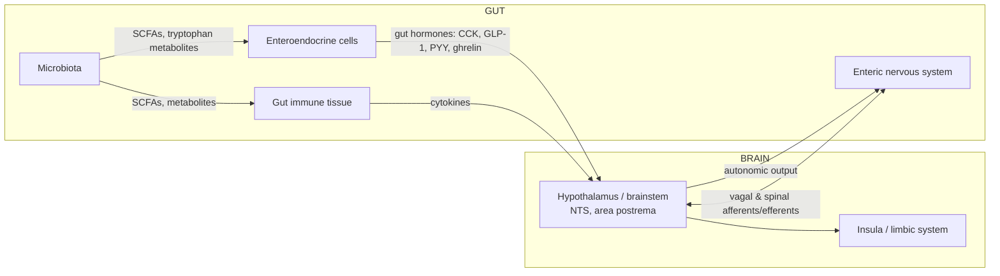
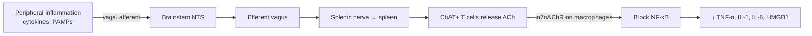
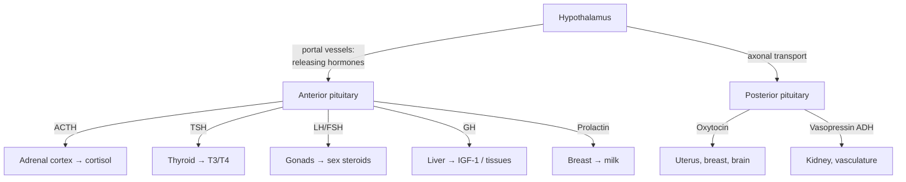

# The Brain's Interfaces with the Body

*A mechanistic reference on how the brain is embedded in, and regulates, the body — the gut-brain axis, neuroimmunology, and the neuroendocrine system — with candid separation of established science from hype.*

---

## Introduction

The brain is often imagined as a command center sealed off inside the skull, issuing orders down the spinal cord. This picture is doubly wrong. First, the traffic is overwhelmingly **inbound**: the brain spends most of its regulatory effort listening to the body — to blood chemistry, gut distension, immune signals, hormone levels, and the mechanical state of the viscera. Second, the boundaries are **porous and dynamic**. The gut houses a semi-autonomous nervous system of its own; the immune system and the nervous system share a common chemical language; hormones secreted in the brain act on the ovary, and hormones secreted by fat act back on the hypothalamus.

This document covers the three great **body-brain interfaces**:

- The **gut-brain axis** — neural, endocrine, immune, and microbial channels linking the digestive tract to the brain.
- **Neuroimmunology** — how the immune system operates inside the CNS and communicates with it, and how inflammation shapes mood and cognition.
- The **neuroendocrine system** — the hypothalamic-pituitary hormonal axes through which the brain governs metabolism, growth, reproduction, and the stress response.

It closes with the integrative frameworks — **homeostasis, allostasis, and interoception** — that describe what all of this machinery is *for*: keeping a body alive in a changing world.

> **A word on hype.** Some areas here (the vagus nerve, the neuroendocrine axes) rest on a century of solid physiology. Others — especially the **microbiome-gut-brain axis** — are genuinely exciting but heavily oversold in popular media and supplement marketing. Throughout, this document flags what is **well-established in humans**, what is **rodent-only or mechanistic**, and what is merely **correlational**. Keeping those categories distinct is the single most important intellectual discipline in this field.

---

## Table of Contents

1. [The Gut-Brain Axis](#1-the-gut-brain-axis)
   - 1.1 [The Enteric Nervous System: the "Second Brain"](#11-the-enteric-nervous-system-the-second-brain)
   - 1.2 [The Vagus Nerve: A Bidirectional Highway](#12-the-vagus-nerve-a-bidirectional-highway)
   - 1.3 [Gut Hormones and Satiety Signaling](#13-gut-hormones-and-satiety-signaling)
   - 1.4 [The Microbiome-Gut-Brain Axis: Signal vs. Hype](#14-the-microbiome-gut-brain-axis-signal-vs-hype)
   - 1.5 [Microbial Metabolites](#15-microbial-metabolites)
   - 1.6 [Links to Mood and Behavior — With Caveats](#16-links-to-mood-and-behavior--with-caveats)
2. [Neuroimmunology](#2-neuroimmunology)
   - 2.1 [Microglia: the Brain's Resident Immune Cells](#21-microglia-the-brains-resident-immune-cells)
   - 2.2 [The Blood-Brain Barrier as an Immune Interface](#22-the-blood-brain-barrier-as-an-immune-interface)
   - 2.3 [The Meningeal Lymphatic System](#23-the-meningeal-lymphatic-system)
   - 2.4 [Neuroinflammation and Sickness Behavior](#24-neuroinflammation-and-sickness-behavior)
   - 2.5 [Cytokines, Mood, and Cognition](#25-cytokines-mood-and-cognition)
   - 2.6 [The Cholinergic Anti-Inflammatory Pathway](#26-the-cholinergic-anti-inflammatory-pathway)
   - 2.7 [Neuroimmunity in Depression and Neurodegeneration](#27-neuroimmunity-in-depression-and-neurodegeneration)
3. [The Neuroendocrine System](#3-the-neuroendocrine-system)
   - 3.1 [The Hypothalamus: Master Regulator](#31-the-hypothalamus-master-regulator)
   - 3.2 [The Pituitary Gland](#32-the-pituitary-gland)
   - 3.3 [The Major Hormonal Axes](#33-the-major-hormonal-axes)
   - 3.4 [Oxytocin and Vasopressin — Beyond the "Love Hormone"](#34-oxytocin-and-vasopressin--beyond-the-love-hormone)
   - 3.5 [Feedback Loops](#35-feedback-loops)
4. [Homeostasis, Allostasis, and Interoception](#4-homeostasis-allostasis-and-interoception)
   - 4.1 [Homeostasis and Set Points](#41-homeostasis-and-set-points)
   - 4.2 [Interoception and the Insula](#42-interoception-and-the-insula)
   - 4.3 [Allostasis: Predictive Regulation](#43-allostasis-predictive-regulation)
5. [Circadian and Peripheral Clocks](#5-circadian-and-peripheral-clocks)
6. [Summary](#6-summary)
7. [Sources](#sources)

---

## 1. The Gut-Brain Axis

The **gut-brain axis** is the bidirectional communication network linking the gastrointestinal (GI) tract and the central nervous system. It is not a single channel but a bundle of at least four partially independent routes operating on different timescales:

- **Neural** — the vagus nerve and spinal afferents (fast, seconds).
- **Endocrine** — gut hormones released into blood (minutes).
- **Immune** — cytokines and gut-associated lymphoid tissue (minutes to hours).
- **Microbial** — metabolites produced by resident bacteria (hours to days).

### 1.1 The Enteric Nervous System: the "Second Brain"

The **enteric nervous system (ENS)** is a mesh of neurons and glia embedded in the wall of the GI tract, running from the esophagus to the anus. It is organized into two ganglionated plexuses: the **myenteric (Auerbach's) plexus**, between the muscle layers, which controls **motility** (peristalsis); and the **submucosal (Meissner's) plexus**, which controls **secretion and local blood flow**.

The ENS is genuinely remarkable. It contains on the order of **200-600 million neurons** (commonly cited as "about 500 million," roughly the number in a cat's brain or the spinal cord), uses most of the same neurotransmitter classes as the brain (acetylcholine, serotonin, nitric oxide, VIP, substance P), and — crucially — can generate coordinated reflexes such as the peristaltic reflex **entirely on its own**, even in a segment of gut removed from the body. This local autonomy is why it earns the nickname the **"second brain."**

> **What "second brain" does and does not mean.** It means the gut has a large, self-sufficient neural network that runs digestion without moment-to-moment instructions from the CNS. It does **not** mean the gut thinks, feels, remembers, or generates emotions. There is no evidence the ENS produces anything resembling consciousness. The phrase is a useful metaphor for **local computational autonomy**, and it is regularly abused to imply the gut has a mind of its own. It does not.

A frequently mangled fact: **~90-95% of the body's serotonin is made in the gut**, mostly by enterochromaffin cells (a type of enteroendocrine cell), where it regulates motility and secretion. This is often invoked to argue that "gut serotonin controls your mood." It largely does not — **peripheral serotonin does not cross the blood-brain barrier**, so gut-derived serotonin is a separate pool from the serotonin used by brain neurons. Gut serotonin can influence the brain indirectly (via vagal afferents and by affecting the availability of its precursor tryptophan), but the popular equation "more gut serotonin = happier brain" is not how the biology works.

### 1.2 The Vagus Nerve: A Bidirectional Highway

The **vagus nerve (cranial nerve X)** is the principal neural cable of the gut-brain axis. It innervates the heart, lungs, and the GI tract down to roughly the transverse colon. Two facts make it central to this document:

- It is **~80% afferent (sensory)**. The dominant direction of vagal traffic is **gut → brain**: the vagus reports mechanical stretch, nutrient content, and chemical state of the viscera to the **nucleus tractus solitarius (NTS)** in the medulla, which relays to the hypothalamus, amygdala, and insula. This is the anatomical basis of "gut feelings" and much of interoception (§4.2).
- Its **efferent (~20%)** fibers, part of the parasympathetic "rest-and-digest" system, modulate motility, secretion, and — importantly — inflammation (the cholinergic anti-inflammatory pathway, §2.6).

Vagal afferents do not sense the lumen directly; they respond to signals relayed by **enteroendocrine cells** and by **enterochromaffin cells**, some of which form direct synapse-like contacts ("neuropod cells") with vagal endings, enabling near-real-time transduction of nutrient information. Vagal afferent terminals express receptors for several gut hormones (CCK, GLP-1, ghrelin, leptin), making the vagus a convergence point where neural and endocrine signals meet.

**Vagus nerve stimulation (VNS)** is an FDA-approved therapy for treatment-resistant epilepsy and depression, and non-invasive **transcutaneous auricular VNS (taVNS)** is under active investigation. That VNS has real clinical effects is well-established; the precise mechanisms in depression remain incompletely understood.

### 1.3 Gut Hormones and Satiety Signaling

The gut is the largest endocrine organ in the body. **Enteroendocrine cells** scattered through the gut lining release peptide hormones in response to food, and these hormones regulate appetite and metabolism through both the bloodstream and vagal afferents. The core appetite-regulating hormones:

| Hormone | Source | Timing | Effect on appetite |
|---|---|---|---|
| **Ghrelin** | Stomach (X/A-like cells) | Rises before meals, falls after | **Orexigenic** (hunger-promoting) — the only major "hunger hormone" |
| **CCK** (cholecystokinin) | Duodenum (I cells) | Released during a meal | Satiety; slows gastric emptying, stimulates bile |
| **GLP-1** (glucagon-like peptide-1) | Ileum/colon (L cells) | Released after a meal | Satiety + incretin (stimulates insulin) |
| **PYY** (peptide YY) | Ileum/colon (L cells) | Rises after a meal | Satiety |
| **Leptin** | Adipose tissue (not gut) | Proportional to fat stores | Long-term satiety / energy-balance signal |

**Ghrelin** and **leptin** work on opposite timescales. Ghrelin is a short-term hunger signal that spikes before anticipated meals. Leptin, made by fat cells, is a **long-term adiposity signal**: it tells the hypothalamus how much energy is stored. Both converge on the **arcuate nucleus of the hypothalamus**, where they regulate two antagonistic neuron populations — orexigenic **AgRP/NPY** neurons and anorexigenic **POMC** neurons.

A key clinical lesson: common obesity is characterized not by leptin *deficiency* but by **leptin resistance** — high leptin that the hypothalamus stops responding to. This is why leptin injections, once hyped as an obesity cure, work only in the rare patients with genuine congenital leptin deficiency.

**GLP-1** is the pharmacological success story of the field. GLP-1 receptor agonists (semaglutide, tirzepatide) are now major drugs for type 2 diabetes and obesity. They act **both** peripherally (as incretins enhancing insulin secretion) **and** centrally (crossing into or signaling to the hypothalamus and brainstem to suppress appetite). Their efficacy is a striking real-world demonstration that gut-hormone signaling powerfully controls the brain's regulation of eating.

### 1.4 The Microbiome-Gut-Brain Axis: Signal vs. Hype

The human gut hosts trillions of microorganisms — the **gut microbiota** — whose collective genome (the **microbiome**) vastly exceeds our own. The hypothesis that these microbes influence the brain is the most hyped area in all of neuroscience-adjacent popular writing. Here the honest ledger matters most.

**What is genuinely well-established:**

- Gut microbes are **necessary for normal development** of the gut, immune system, and — in mice — the brain. **Germ-free mice** (raised with no microbes) show clear abnormalities: an exaggerated HPA-axis stress response, altered microglia (§2.1), a leakier blood-brain barrier, and behavioral differences. Colonizing them with normal microbiota can reverse some of these effects, especially if done early in life. This establishes that microbes *can* affect brain development — **in rodents, under extreme experimental conditions.**
- Microbes produce and modulate **neuroactive compounds** (short-chain fatty acids, tryptophan metabolites, GABA, precursors of neurotransmitters). The chemistry is real (§1.5).
- Bidirectional communication exists through defined **routes**: vagal afferents, the immune system, enteroendocrine signaling, and microbial metabolites.

**What is rodent-only or mechanistic (not yet established in humans):**

- **Fecal microbiota transplant (FMT) transferring behavior.** In the field's most-cited experiments, transplanting stool from depressed humans (or chronically stressed mice) into germ-free or antibiotic-treated recipient mice induced **depression-like behaviors** (increased immobility in forced-swim and tail-suspension tests). This is striking and reproducible enough to take seriously — but it is **mouse behavior**, measured by "behavioral despair" assays that are crude proxies for human depression, and the effects depend on the recipient's own immune state (e.g., Th17 cells). It does **not** show that microbes cause human depression.

**What is mostly correlational (the bulk of human data):**

- Human studies overwhelmingly show **associations**: people with depression, anxiety, autism, Parkinson's, or Alzheimer's tend to have gut microbiota that differ, on average, from controls. These associations are **inconsistent across studies**, rarely replicate at the level of specific taxa, and are riddled with **confounders** — diet, medication (antidepressants, metformin, and proton-pump inhibitors all reshape the microbiome), GI transit time, BMI, and reverse causation (illness and its treatment change what you eat and how your gut moves). Correlation here is especially treacherous because so many things that cause the disease also independently change the microbiome.

**The bottom line on probiotics/"psychobiotics":** Meta-analyses of probiotic trials for mood find at best **modest, inconsistent effects**, often in people with existing symptoms, with small samples, short durations, heterogeneous strains, and publication bias. No probiotic is an established treatment for any psychiatric disorder. The gap between the confident claims on supplement labels and the actual evidence is enormous.

> **How to read a microbiome-brain claim.** Ask three questions: (1) Is this in **humans** or just mice? (2) Is it **causal** (interventional) or just a **correlation**? (3) Was **diet/medication** controlled for? Most eye-catching headlines fail at least one of these. The field is legitimate and important; the marketing built on top of it is not.

### 1.5 Microbial Metabolites

The most credible mechanistic route from microbes to brain runs through **metabolites** — small molecules bacteria produce that can affect host physiology.

- **Short-chain fatty acids (SCFAs)** — **acetate, propionate, and butyrate** — are produced when colonic bacteria ferment dietary fiber. They are the best-characterized microbial signals to the nervous system. Butyrate is the primary energy source for colonocytes and a **histone deacetylase (HDAC) inhibitor**, giving it epigenetic effects. SCFAs act on gut enteroendocrine cells (stimulating GLP-1 and PYY), on the immune system, and — demonstrated in **germ-free mice** — support **microglial maturation** and **blood-brain barrier integrity**. In the landmark Erny et al. work, germ-free mice had malformed, immature microglia that were partially rescued by giving SCFAs in drinking water. Some gut-derived SCFA (e.g., acetate) can reach the brain and be metabolized. Again: the strong mechanistic data are **rodent**; the human relevance is inferred, not proven.
- **Tryptophan metabolites.** Gut microbes influence the metabolism of the amino acid tryptophan down three routes: (1) to **serotonin** (peripherally), (2) to **kynurenine** (the pathway that links inflammation to mood, §2.5), and (3) directly to **indole derivatives** that act on the host's aryl hydrocarbon receptor. By shifting tryptophan traffic, microbes can in principle affect both serotonin availability and neuroactive kynurenines.
- **Neurotransmitter-like molecules.** Certain gut bacteria produce **GABA**, and others make precursors of dopamine and norepinephrine. This is often cited as proof that "gut bacteria make your brain chemicals," but bacterially produced GABA does not cross the blood-brain barrier, so its relevance is almost certainly **local** (acting on the ENS and vagal afferents), not a direct supply to the brain.

### 1.6 Links to Mood and Behavior — With Caveats

The gut-brain axis genuinely matters for a few conditions with strong human evidence:

- **Irritable bowel syndrome (IBS)** is now understood as a **disorder of gut-brain interaction** (the official reclassification). The high comorbidity of IBS with anxiety and depression, and the efficacy of gut-directed psychotherapy and centrally acting drugs, reflect real bidirectional signaling.
- **Stress reliably alters gut physiology** (motility, permeability, secretion) via the autonomic nervous system and HPA axis — this is well-established and bidirectional (see the stress document, `06-stress-and-fight-or-flight.md`).

A word on **"leaky gut."** The idea that increased intestinal permeability lets bacterial products (notably **lipopolysaccharide, LPS**) into the blood, driving low-grade inflammation that reaches the brain, is biologically coherent and measurable in some conditions (e.g., markers of bacterial translocation are elevated in subsets of depression and in alcohol-related disease). But **"leaky gut syndrome"** as a stand-alone diagnosis, and the elaborate diets and supplements sold to "heal" it, are **not evidence-based**. The mechanism is real in specific contexts; the commercial edifice built on it is not.

For psychiatric and neurological disease, the appropriate stance is **cautious interest**: the biology is plausible, the rodent mechanisms are suggestive, but human causal evidence is thin. Treat any claim that a specific diet, probiotic, or "gut protocol" treats depression, anxiety, or autism as **unproven** until shown otherwise in well-controlled human trials.

---

## 2. Neuroimmunology

For most of the twentieth century the brain was called **immune-privileged** — walled off from the immune system by the blood-brain barrier and lacking lymphatic drainage. The modern view is more nuanced: the CNS is **immunologically distinct and tightly controlled, but not isolated**. It has its own resident immune cells, dynamic barriers that regulate (rather than forbid) immune traffic, and — as rediscovered in 2015 — genuine lymphatic vessels.

### 2.1 Microglia: the Brain's Resident Immune Cells

**Microglia** are the CNS's resident macrophages and its primary innate immune cells, making up ~5-15% of brain cells. Unlike other glia and neurons (which arise from neuroectoderm), microglia originate from the **embryonic yolk sac** and colonize the brain early, then **self-renew** locally for life. Their roles:

- **Immune surveillance.** In the healthy brain, microglia are not "resting" — they are highly active "surveillant" cells, constantly extending and retracting fine processes to sample their microenvironment and detect damage or pathogens.
- **Synaptic pruning.** During development (and in adulthood), microglia physically engulf and eliminate weak or excess synapses, sculpting circuits. This complement-tagged pruning is essential for normal wiring, and its dysregulation is implicated in disorders from schizophrenia to Alzheimer's.
- **Phagocytosis and repair.** They clear debris, dead cells, and (in disease) protein aggregates.
- **Response to injury/infection.** They become "reactive," changing shape and secreting cytokines.

> **A modeling caveat — the M1/M2 story.** Textbooks long described microglia (and macrophages) as switching between a pro-inflammatory **"M1"** state and an anti-inflammatory/reparative **"M2"** state. **Single-cell RNA sequencing has largely retired this binary.** Microglia exist along a **continuum of many states** (nine or more transcriptional clusters in mice), context-dependent and often co-expressing "M1" and "M2" markers. The M1/M2 language persists as convenient shorthand but should be treated as an oversimplification, not a real taxonomy.

### 2.2 The Blood-Brain Barrier as an Immune Interface

The **blood-brain barrier (BBB)** is formed by specialized endothelial cells lining brain capillaries, joined by **tight junctions** and with very low pinocytosis, supported by **pericytes** and **astrocyte endfeet** — together the **neurovascular unit**. Classically it is described as keeping things *out*.

The immunological reframing: the BBB is not a passive wall but an **active, selective interface** between blood and brain. It:

- Restricts free entry of immune cells and antibodies under normal conditions.
- **Actively regulates** immune cell trafficking, expressing adhesion molecules and chemokines that permit surveillance by T cells and control immune entry during infection or inflammation.
- Can become **more permeable** during systemic inflammation, allowing cytokines and cells to influence the CNS — a key route by which peripheral immune activation reaches the brain (§2.4).

So "immune privilege" is real but **relative and dynamic**: the CNS controls immune access rather than excluding it absolutely.

### 2.3 The Meningeal Lymphatic System

One of the most striking recent developments: in **2015**, Louveau, Kipnis and colleagues (and, independently, Aspelund/Alitalo) described **functional lymphatic vessels in the dural meninges** — overturning the textbook claim that the CNS has no lymphatics. (Remarkably, these vessels had been drawn by the anatomist Paolo Mascagni in 1787 but forgotten.)

These **meningeal lymphatic vessels** drain cerebrospinal fluid, CNS waste, and antigens — and carry immune cells — from the brain to the **deep cervical lymph nodes**. This gives the CNS a genuine route to communicate with the peripheral immune system and to clear macromolecules. Functionally:

- Meningeal lymphatics work alongside the **glymphatic system** (the perivascular fluid-clearance pathway that is most active during sleep; see `08-sleep-consciousness-development.md`) as an outflow route.
- In aging mice, meningeal lymphatic drainage declines, and impairing it worsens amyloid-β accumulation, linking this system to Alzheimer's-relevant clearance. Enhancing drainage improved outcomes in mouse models.

> **Caveat.** The discovery is solid and important. Most **functional** data (drainage of amyloid, effects on cognition) are again **mouse**; the human meningeal lymphatic anatomy has been confirmed by MRI, but its role in human disease is an active, still-preliminary research area.

### 2.4 Neuroinflammation and Sickness Behavior

When you get the flu, you feel not just physically ill but **mentally** ill: fatigued, unmotivated, socially withdrawn, unable to concentrate, with low appetite and low mood. This coordinated response is **sickness behavior**, and it is not incidental — it is an **adaptive, brain-generated program** that conserves energy and redirects resources toward fighting infection and recovering.

Sickness behavior is triggered by **pro-inflammatory cytokines** (IL-1β, IL-6, TNF-α) released by the peripheral immune system. These signals reach the brain by several routes:

- Active transport and signaling across the **BBB**;
- Entry at **circumventricular organs** (e.g., the area postrema) that lack a tight barrier;
- **Vagal afferent** signaling (the neural route) — the vagus senses peripheral cytokines and relays "there is inflammation" to the brainstem.

Within the brain, this activates microglia and induces central cytokine production, producing the behavioral syndrome. Acute sickness behavior is adaptive and self-limiting. The concern arises when inflammation becomes **chronic**.

### 2.5 Cytokines, Mood, and Cognition

The observation that inflammation produces sickness behavior — which overlaps substantially with the symptoms of **depression** (anhedonia, fatigue, sleep and appetite disturbance, psychomotor slowing) — motivates the **inflammatory (cytokine) hypothesis of depression**. The strongest lines of evidence:

- Patients treated with **interferon-α** (for hepatitis C or melanoma) develop clinically significant depression at high rates — a rare instance of a known inflammatory trigger causing depression in humans.
- A **subgroup** of people with depression show elevated inflammatory markers (CRP, IL-6).
- The **kynurenine pathway** provides a mechanism: pro-inflammatory cytokines induce the enzyme **indoleamine 2,3-dioxygenase (IDO)**, which diverts **tryptophan** away from serotonin and toward **kynurenine**. Downstream metabolites include neurotoxic **quinolinic acid** (an NMDA-receptor agonist) and neuroprotective kynurenic acid. In mice, **IDO knockout or inhibition blocks inflammation-induced depressive-like behavior**, even though cytokine levels stay high — strong mechanistic evidence that the *consequences* of inflammation (kynurenine metabolism), not cytokines per se, drive the behavior.

> **Caveats, kept honest.** (1) The clean IDO/kynurenine causal chain is established mainly in **rodents**; prolonged inflammatory challenge in humans is unethical, so human data are largely observational. (2) Inflammation is elevated in only a **subset** of depressed patients — depression is heterogeneous, and it is **not** simply "an inflammatory disease." (3) Anti-inflammatory drugs have shown **mixed** results as antidepressants, with the best signals in patients who have high baseline inflammation. The inflammation-depression link is real and important for a subgroup, but it is not a universal explanation.

Cytokines also impair **cognition** acutely (the "brain fog" of illness) and are implicated in the cognitive symptoms of chronic inflammatory conditions and of aging.

### 2.6 The Cholinergic Anti-Inflammatory Pathway

The nervous system does not just *sense* inflammation — it **regulates** it. Kevin Tracey and colleagues described the **inflammatory reflex**: a neural circuit in which vagal afferents detect peripheral inflammation and vagal efferent activity **suppresses** it. The efferent arm is the **cholinergic anti-inflammatory pathway (CAP)**:

1. Efferent vagal signals reach the **spleen** (via the splenic nerve).
2. There, they trigger release of **acetylcholine** (notably from a specialized population of ChAT-expressing T cells).
3. Acetylcholine acts on the **α7 nicotinic acetylcholine receptor (α7nAChR)** on macrophages.
4. This blocks **NF-κB** signaling, **reducing** production of TNF-α, IL-1, IL-6, and HMGB1.

The practical upshot: **electrically stimulating the vagus can dampen systemic inflammation.** This is the rationale for trials of VNS in **rheumatoid arthritis, inflammatory bowel disease**, and other inflammatory conditions, with some encouraging early human results. It also provides another plausible mechanism for the antidepressant effects of VNS. This pathway is a clean example of the nervous and immune systems sharing control.

### 2.7 Neuroimmunity in Depression and Neurodegeneration

**Depression** — as above, a **subgroup** shows an inflammatory signature; microglial activation and cytokine-driven kynurenine metabolism are the leading mechanisms. Neuroimmune biology is one promising axis for stratifying and treating depression, not a complete theory of it.

**Neurodegeneration** — neuroinflammation is now recognized as a **core feature**, not a bystander, of Alzheimer's and Parkinson's disease:

- Genetic evidence is decisive for Alzheimer's: many risk genes (**TREM2, CD33, complement**) are expressed in **microglia**, placing the immune system upstream in disease, not merely reacting to it.
- Chronically activated microglia can shift from clearing amyloid-β to a damaging, pro-inflammatory phenotype that harms neurons — a maladaptive version of their normal protective role.
- Impaired **clearance** (glymphatic and meningeal-lymphatic, §2.3) contributes to protein accumulation.

In **Parkinson's disease**, there is intriguing (still-developing) evidence that pathology may **begin in the gut**: misfolded α-synuclein appears in the enteric nervous system years before motor symptoms, and Braak's staging hypothesis proposes the pathology may ascend from the gut via the **vagus nerve** to the brainstem. Supporting this, large epidemiological studies have reported that people who underwent **truncal vagotomy** (severing the vagus) have a modestly **reduced** long-term risk of Parkinson's. This "gut-first" hypothesis is compelling but not settled — it likely applies to a subset of patients, and the human evidence remains associative.

See `07-aging-and-neurodegeneration.md` for the full treatment. The key neuroimmunological point: microglia are **double-edged** — essential for brain health, but capable of driving chronic damage when dysregulated.

---

## 3. The Neuroendocrine System

The **neuroendocrine system** is where the nervous system speaks the language of hormones. Its command structure is the **hypothalamic-pituitary** unit: the hypothalamus (neural) converts inputs into hormonal commands, the pituitary amplifies and broadcasts them, and peripheral glands execute — with feedback closing every loop.

### 3.1 The Hypothalamus: Master Regulator

The **hypothalamus** is a small region (about 4 grams) at the base of the brain that serves as the chief coordinator of homeostasis. It integrates neural input (from limbic, cortical, and brainstem sources), blood-borne signals (hormones, glucose, temperature, osmolality — it sits near circumventricular organs where the BBB is leaky), and the internal body clock. It governs:

- **Endocrine output** — via the pituitary (§3.2-3.3).
- **Autonomic output** — sympathetic and parasympathetic tone.
- **Motivated behaviors** — hunger, thirst, thermoregulation, sleep-wake, sexual and defensive behavior.

Specific nuclei have specialized roles: the **paraventricular nucleus (PVN)** drives the stress axis and makes oxytocin/vasopressin; the **arcuate nucleus** integrates leptin/ghrelin for energy balance; the **suprachiasmatic nucleus (SCN)** is the master circadian clock; the **preoptic area** handles thermoregulation and sleep.

### 3.2 The Pituitary Gland

The **pituitary** hangs beneath the hypothalamus and has two functionally distinct lobes with different embryological origins and control mechanisms:

- **Anterior pituitary (adenohypophysis)** — glandular tissue controlled **hormonally**. The hypothalamus secretes **releasing/inhibiting hormones** into the **hypophyseal portal blood vessels**, a private capillary system, which carries them a short distance to the anterior pituitary. There they stimulate or inhibit the release of six main hormones: **ACTH, TSH, LH, FSH, GH, and prolactin**.
- **Posterior pituitary (neurohypophysis)** — **neural** tissue, essentially the axon terminals of hypothalamic neurons. It does not synthesize hormones; it **stores and releases** two hormones made in the hypothalamus: **oxytocin** and **vasopressin (ADH)**, dumped directly into the bloodstream upon neural firing.

### 3.3 The Major Hormonal Axes

Each anterior-pituitary hormone anchors an **axis**: hypothalamus → pituitary → target gland → target-gland hormone, with negative feedback.

**HPA axis (stress).** CRH → **ACTH** → adrenal cortex → **cortisol**. This is the body's glucocorticoid stress axis; cortisol mobilizes energy, modulates immunity, and feeds back to shut the axis off. Covered in depth in `06-stress-and-fight-or-flight.md` — cross-reference rather than repeat.

**HPT axis (thyroid).** TRH → **TSH** → thyroid → **T4/T3**. Thyroid hormone sets the body's **metabolic rate** and is essential for brain development. Dysfunction directly affects mood and cognition: **hypothyroidism** causes fatigue, depression, and cognitive slowing; **hyperthyroidism** causes anxiety, irritability, and restlessness — which is why thyroid function is a standard workup in psychiatric evaluation.

**HPG axis (reproductive).** GnRH (pulsatile) → **LH** and **FSH** → gonads → **estrogen/progesterone** (ovary) or **testosterone** (testis). This axis governs puberty, reproduction, and the menstrual cycle. Sex steroids are potent **neuromodulators**: they influence mood, cognition, and neuroplasticity, and their fluctuation underlies premenstrual, postpartum, and perimenopausal mood changes.

**Growth hormone (GH) axis.** GHRH (+ ghrelin) stimulates, **somatostatin** inhibits → **GH** → liver **IGF-1** and direct tissue effects. GH drives growth in youth and metabolism/tissue maintenance in adulthood; it is secreted in pulses, largely during **deep slow-wave sleep** (linking to `08-sleep`).

**Prolactin.** Unusual among pituitary hormones in being under **tonic inhibition** — the hypothalamus continuously **suppresses** it via **dopamine**. Release the dopamine brake (e.g., during breastfeeding, or when dopamine-blocking antipsychotics are given) and prolactin rises. Its main role is lactation, but it has many secondary functions. (This dopamine-prolactin link explains why antipsychotics can cause galactorrhea and menstrual disruption.)

| Axis | Hypothalamic signal | Pituitary hormone | Target / effector | Feedback signal |
|---|---|---|---|---|
| **HPA** | CRH | ACTH | Adrenal cortex → cortisol | Cortisol (–) |
| **HPT** | TRH | TSH | Thyroid → T3/T4 | T3/T4 (–) |
| **HPG** | GnRH (pulsatile) | LH, FSH | Gonads → sex steroids | Sex steroids (± ) |
| **GH** | GHRH (+) / somatostatin (–) | GH | Liver → IGF-1 | IGF-1, GH (–) |
| **Prolactin** | Dopamine (–, tonic) | Prolactin | Breast | Prolactin → dopamine (–) |

### 3.4 Oxytocin and Vasopressin — Beyond the "Love Hormone"

**Oxytocin** and **vasopressin** are nine-amino-acid peptides that differ by only **two** amino acids, made in the hypothalamus and released by the posterior pituitary. They also act as **neuromodulators within the brain**, which is where the social behavior story comes from.

**Oxytocin's** established peripheral roles are uncontroversial: it drives **uterine contraction** in labor and **milk ejection** in nursing. Centrally, it is involved in social bonding, maternal behavior, and pair-bonding (much of the classic work is in **prairie voles**, a monogamous rodent).

> **The "love hormone" oversimplification.** Popular media brand oxytocin the "love hormone" or "cuddle chemical," implying that more oxytocin = more love, trust, and happiness. This is **wrong in an important way.** The better-supported view is that oxytocin acts as a **social-salience signal** — it turns up the brain's attention to social cues, whatever they are. Consequences depend entirely on context and the individual: in some settings oxytocin increases trust and generosity; in others it increases **in-group favoritism, envy, defensive aggression toward outsiders, and anxiety**. It is not a simple happiness molecule, and intranasal-oxytocin studies (the basis of many headlines) have been dogged by **replication problems** and methodological concerns (it is unclear how much intranasal oxytocin even reaches the brain). Human social bonding is far too complex to pin on one peptide.

**Vasopressin (ADH)** has a clear physiological job — **water retention** by the kidney (antidiuretic) and vasoconstriction — plus a **social/behavioral** role that tends to run **opposite** to oxytocin's affiliative lean: vigilance, territoriality, and (especially in males) aggression and partner-guarding. The oxytocin/vasopressin pair is a good illustration that "the social brain" is built from balancing, context-dependent signals, not single feel-good chemicals.

### 3.5 Feedback Loops

The defining feature of endocrine axes is **negative feedback**: the output hormone inhibits its own production upstream. Cortisol suppresses CRH and ACTH; thyroid hormone suppresses TRH and TSH; sex steroids modulate GnRH/LH/FSH. This keeps hormone levels within a regulated band and makes the axes **self-correcting**.

Feedback also enables **clinical diagnosis by inference**: a *high* TSH with *low* thyroid hormone means the thyroid gland has failed (primary hypothyroidism — the pituitary is shouting but the gland can't respond), whereas *low* TSH with *low* thyroid hormone points to a pituitary/hypothalamic problem. Some axes use **positive feedback** transiently — the mid-cycle estrogen surge that triggers the LH spike and ovulation is the classic example — but these are the exception, deployed to produce a decisive switch.

---

## 4. Homeostasis, Allostasis, and Interoception

Everything above serves one overarching function: keeping the body's internal state within limits compatible with life. Two frameworks describe how the brain does this — the classical one (**homeostasis**) and a more recent, predictive one (**allostasis**) — bridged by the brain's sense of its own body (**interoception**).

### 4.1 Homeostasis and Set Points

**Homeostasis** (Walter Cannon, building on Claude Bernard's *milieu intérieur*) is the maintenance of internal variables near stable **set points** through negative feedback. Classic regulated variables include:

- **Core temperature** (~37 °C) — defended by the preoptic hypothalamus via sweating/vasodilation vs. shivering/vasoconstriction/brown-fat thermogenesis.
- **Blood glucose** — defended by insulin (lowers) vs. glucagon, cortisol, and adrenaline (raise).
- **Osmolality / fluid balance** — sensed by hypothalamic osmoreceptors, defended by **vasopressin** (water retention) and **thirst**.
- **Energy balance** — defended over the long term by **leptin** and the arcuate nucleus (§1.3).

The engineering model: a sensor detects a deviation, a comparator measures error against the set point, and effectors correct it. This model is powerful and correct as far as it goes — but it is **reactive**: it acts only *after* a variable drifts.

### 4.2 Interoception and the Insula

**Interoception** is the sensing of the body's internal state — heartbeat, breathing, gut distension, temperature, blood chemistry, the need to urinate. It is the afferent (sensory) side of every homeostatic loop, and it is increasingly seen as the substrate of **emotion and self-awareness**, not merely housekeeping.

Interoceptive signals travel via vagal and spinal (especially **lamina I spinothalamic**) afferents to the brainstem (**NTS, parabrachial nucleus**) and thalamus, and then to the **insular cortex** — the brain's primary **interoceptive cortex**. A widely held model holds that signals are re-represented from **posterior** insula (raw bodily sensation) to **anterior** insula, where they are integrated with context into **subjective feelings** ("I feel anxious," "I feel full," "I feel my heart racing"). The **anterior cingulate cortex** provides the motivational/action side. This is why the insula is implicated in emotional awareness, and why interoceptive dysfunction appears in anxiety, depression, addiction, and eating disorders.

### 4.3 Allostasis: Predictive Regulation

**Allostasis** ("stability through change," Sterling and Eyer; extended by McEwen and, in a predictive framing, by Barrett and colleagues) reframes bodily regulation as **anticipatory** rather than reactive. The core claim: the brain does not wait for glucose or blood pressure to drop and then correct it; it **predicts** upcoming demands and adjusts the body *in advance* — mobilizing energy before exertion, raising blood pressure before you stand, releasing cortisol before you wake. Set points are not fixed but **varied to fit anticipated need**.

In the modern (**active-inference / predictive-regulation**) formulation, the brain runs an internal model of the body and issues **visceromotor predictions**; interoception provides the feedback that confirms or corrects those predictions. Regulation is thus a **control problem** (steering the body along an expected trajectory efficiently) more than a perception problem. This view:

- explains why **prediction errors** — mismatches between expected and actual bodily state — may be central to conditions like anxiety and functional disorders;
- connects to **allostatic load** (the cumulative wear-and-tear of chronic anticipatory over-activation; see `06-stress`);
- has recent empirical support from high-resolution fMRI mapping of a connected **allostatic-interoceptive network** (agranular visceromotor cortices — anterior cingulate, ventral anterior insula — feeding the mid/posterior insula).

> **Status.** Homeostasis is textbook-settled. Allostasis as *predictive* regulation is a well-motivated and increasingly supported **theoretical framework** that reorganizes how we think about set points, stress, and emotion — but its strongest specific claims (e.g., about active inference in the brain) are still being tested, and terminology in the literature is not fully standardized. It is best treated as a productive lens, not settled mechanism at every detail.

---

## 5. Circadian and Peripheral Clocks

Nearly all of the systems above are **time-of-day dependent**, coordinated by the body's clock network. The **suprachiasmatic nucleus (SCN)** of the hypothalamus is the master clock, entrained to the light-dark cycle via the retina, and it orchestrates daily rhythms in the autonomic nervous system and endocrine axes.

The endocrine consequences are large and clinically important:

- **Cortisol** peaks in the early morning (the cortisol awakening response) and troughs at night — the HPA axis is a clock-gated system.
- **Melatonin** (pineal) rises in the evening under SCN control, signaling darkness.
- **Growth hormone** is released mainly in early-night slow-wave sleep.
- Appetite hormones, insulin sensitivity, and body temperature all cycle daily.

Crucially, the clock is **not only in the brain**: essentially every peripheral tissue (liver, gut, immune cells, adipose) contains its own **molecular clock** (the CLOCK/BMAL1–PER/CRY transcription-translation feedback loop), normally synchronized by the SCN and by **feeding time**. **Misalignment** between the central clock, peripheral clocks, and behavior (shift work, jet lag, late-night eating) disrupts metabolism and immunity and is a genuine health risk. The gut microbiome itself shows **diurnal oscillations** entrained by host feeding rhythms — another layer where the body-brain interfaces intersect with time.

For the full treatment of circadian biology, sleep architecture, and the glymphatic system, see `08-sleep-consciousness-development.md`; for the HPA axis and allostatic load, see `06-stress-and-fight-or-flight.md`.

---

## 6. Summary

- The brain is **embedded in the body**, spending most of its regulatory bandwidth *listening* to visceral, chemical, immune, and hormonal signals — and predicting them.
- The **gut-brain axis** operates over neural (vagus), endocrine (gut hormones), immune, and microbial channels. The **enteric nervous system** is a genuine semi-autonomous "second brain" for digestion — but it does not think or feel. **Gut hormones** (ghrelin, leptin, GLP-1) potently control appetite, and GLP-1 drugs prove the point clinically.
- The **microbiome-gut-brain axis** is real but **heavily overhyped**. Strong causal evidence is **rodent** (germ-free mice, FMT of behavior); human evidence is largely **correlational and confounded**; probiotics show at best **modest, inconsistent** mood effects. Read every claim for species, causality, and confounders.
- **Neuroimmunology** has replaced "immune privilege" with a picture of a **controlled, dynamic interface**: **microglia** (resident immune cells, essential for pruning, double-edged in disease; the **M1/M2 binary is outdated**), a **BBB** that regulates immune traffic, and rediscovered **meningeal lymphatics** (2015). **Inflammation causes sickness behavior**, and cytokine-driven **kynurenine** metabolism links inflammation to depression **in a subgroup** — not as a universal cause. The **vagal cholinergic anti-inflammatory pathway** lets the brain dampen inflammation.
- The **neuroendocrine system** — hypothalamus → pituitary → target glands, with negative feedback — governs stress (HPA), metabolism (HPT), reproduction (HPG), growth (GH), and lactation (prolactin). **Oxytocin** is a context-dependent **social-salience** signal, not a simple "love hormone"; **vasopressin** often pulls the other way.
- **Homeostasis** (reactive set-point defense) and **allostasis** (anticipatory, predictive regulation), bridged by **interoception** and the **insula**, describe what all this machinery achieves: a stable internal milieu in a changing world. Everything is **clock-gated** by circadian rhythms.

The consistent lesson: the brain-body relationship is **bidirectional, predictive, and integrated** — and the honest scientist's job is to hold enthusiasm and evidence in the same hand, especially where the marketing has run ahead of the data.

---

## Sources

**Gut-brain axis, ENS, gut hormones**
- [Mechanisms and clinical implications of gut-brain interactions (PMC)](https://pmc.ncbi.nlm.nih.gov/articles/PMC12721889/)
- [Gastrointestinal hormones and the dialogue between gut and brain (PubMed)](https://pubmed.ncbi.nlm.nih.gov/24566540/)
- [The central signaling pathways of metabolism-regulating hormones of the gut-brain axis (J Transl Med, 2025)](https://link.springer.com/article/10.1186/s12967-025-06656-3)
- [Ghrelin and GLP-1 regulate feeding through the vagal afferent system (PMC)](https://pmc.ncbi.nlm.nih.gov/articles/PMC7595212/)
- [The enteric neuronal circuitry in nutrient sensing along the gut-brain axis (PMC)](https://pmc.ncbi.nlm.nih.gov/articles/PMC12048873/)

**Microbiome-gut-brain axis (including caveats)**
- [The gut microbiota-brain axis in behaviour and brain disorders (Nature Reviews Microbiology)](https://www.nature.com/articles/s41579-020-00460-0)
- [Methodological recommendations for human microbiota-gut-brain axis research](https://www.oaepublish.com/articles/mrr.2023.33)
- [IUPHAR review: Microbiota-gut-brain axis and neuropsychiatric disorders (ScienceDirect)](https://www.sciencedirect.com/science/article/pii/S1043661825001744)
- [Microbiota transplantation from depressed patients into germ-free mice (ScienceDirect)](https://www.sciencedirect.com/science/article/abs/pii/S0924977X16307581)
- [Th17 cells sense microbiome to promote depressive-like behaviors (Microbiome)](https://microbiomejournal.biomedcentral.com/articles/10.1186/s40168-022-01428-3)
- [Antibiotic-treated versus germ-free rodents for microbiota transplantation studies (PMC)](https://pmc.ncbi.nlm.nih.gov/articles/PMC4856451/)
- [The Role of Short-Chain Fatty Acids in Gut-Brain Communication (PMC)](https://pmc.ncbi.nlm.nih.gov/articles/PMC7005631/)
- [Mechanisms of Blood-Brain Barrier Protection by Microbiota-Derived SCFAs (PMC)](https://www.ncbi.nlm.nih.gov/pmc/articles/PMC9954192/)

**Neuroimmunology**
- [Beyond immune privilege: the brain as a dynamic immunological interface (Cell Death & Disease)](https://www.nature.com/articles/s41419-026-08561-z)
- [Immunologic privilege in the CNS and the blood-brain barrier (PMC)](https://pmc.ncbi.nlm.nih.gov/articles/PMC3597357/)
- [CNS lymphatic drainage and neuroinflammation regulated by meningeal lymphatic vasculature (Nature Neuroscience)](https://www.nature.com/articles/s41593-018-0227-9)
- [Meningeal lymphatic drainage: novel insights into CNS disease (Signal Transduction and Targeted Therapy, 2025)](https://www.nature.com/articles/s41392-025-02177-z)
- [Microglia Polarization From M1 to M2 in Neurodegenerative Diseases (PMC)](https://pmc.ncbi.nlm.nih.gov/articles/PMC8888930/)
- [Roles of Microglia in Neurodegenerative Diseases (PMC/NIH)](https://pmc.ncbi.nlm.nih.gov/articles/PMC10867232/)
- [Cytokine, Sickness Behavior, and Depression (PMC/NIH)](https://pmc.ncbi.nlm.nih.gov/articles/PMC2740752/)
- [A biological pathway linking inflammation and depression: activation of IDO (PMC)](https://pmc.ncbi.nlm.nih.gov/articles/PMC3140295/)
- [The Inflammatory Hypothesis of Depression (Focus / APA)](https://psychiatryonline.org/doi/10.1176/appi.focus.10.4.413)
- [The cholinergic anti-inflammatory pathway revisited (PMC)](https://pmc.ncbi.nlm.nih.gov/articles/PMC5826620/)
- [Manipulation of the inflammatory reflex as a therapeutic strategy (PMC)](https://www.ncbi.nlm.nih.gov/pmc/articles/PMC9381415/)

**Neuroendocrine system, oxytocin/vasopressin**
- [Oxytocin and love: Myths, metaphors and mysteries (ScienceDirect)](https://www.sciencedirect.com/science/article/pii/S2666497621000813)
- [Oxytocin's effects aren't just about love (Knowable Magazine)](https://knowablemagazine.org/content/article/mind/2022/oxytocins-effects-arent-just-about-love)
- [Fact or Fiction?: Oxytocin Is the "Love Hormone" (Scientific American)](https://www.scientificamerican.com/article/fact-or-fiction-oxytocin-is-the-love-hormone/)

**Homeostasis, allostasis, interoception**
- [Interoception as modeling, allostasis as control (PMC/NIH)](https://pmc.ncbi.nlm.nih.gov/articles/PMC9270659/)
- [Cortical and subcortical mapping of the human allostatic-interoceptive system using 7T fMRI (Nature Neuroscience, 2025)](https://www.nature.com/articles/s41593-025-02087-x)
- [Allostasis as a core feature of hierarchical gradients in the human brain (PMC)](https://pmc.ncbi.nlm.nih.gov/articles/PMC11117115/)
- [What Are the Functions of Interoception and Allostasis? (Neurology)](https://www.neurology.org/doi/10.1212/WNL.0000000000214366)

*Cross-references within this collection: `06-stress-and-fight-or-flight.md` (HPA axis, autonomic nervous system, allostatic load), `07-aging-and-neurodegeneration.md` (microglia and neurodegeneration), `08-sleep-consciousness-development.md` (SCN, circadian rhythm, glymphatic system).*
