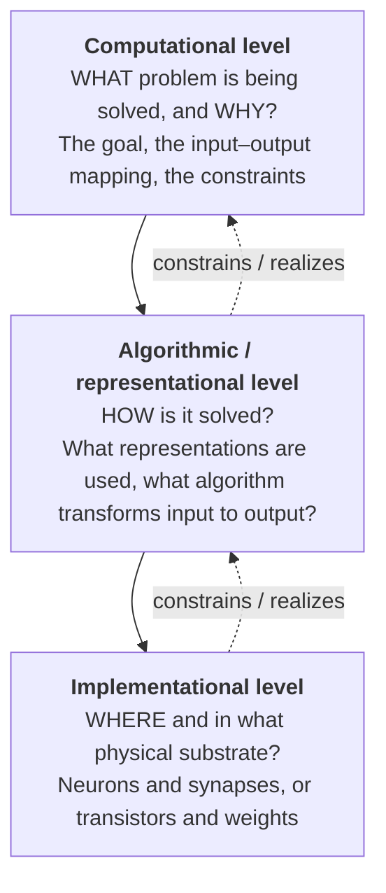
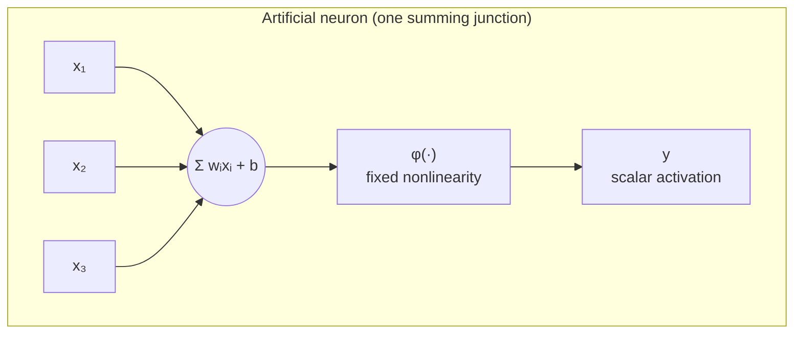

# The Brain as a Computer? Neural Computation and the Brain–AI Comparison

*A technical reference on what "computation" means for a nervous system, how biological brains and artificial neural networks resemble and differ from one another, and where the popular analogy holds, bends, and breaks.*

## Introduction

The idea that the brain is a kind of computer is one of the most productive metaphors in the history of science — and one of the most abused. It gave us the McCulloch–Pitts neuron, the perceptron, connectionism, and eventually the deep neural networks that now recognize faces, transcribe speech, and generate text. In the other direction, it has repeatedly tempted people to conclude that because artificial neural networks (ANNs) are loosely "brain-inspired," they must work the way brains do, or that because the brain processes information, it must be "just" a computer running an algorithm on wet hardware.

Both conclusions are misleading. The honest position is more interesting than either the hype ("AI is basically a digital brain") or the dismissal ("neural networks have nothing to do with real neurons"). The brain and modern AI share a genuine deep principle — distributed computation through adjustable connections among many simple-ish units — and they diverge on almost every concrete detail of how a unit computes, how connections change, how the system is organized, and what it costs to run. Understanding *where* the analogy holds and *where* it fails is one of the best ways to sharpen one's understanding of the biological brain itself.

This document takes the comparison seriously and rigorously. It works through what computation means for a brain (via Marr's levels of analysis), the historical lineage from real neurons to artificial ones, a point-by-point contrast of biological versus artificial neurons, the deep problem of how each system learns (backpropagation versus biologically plausible alternatives, and the genuine success story of dopamine as a reward-prediction-error signal), differences in architecture, scale, energy, and representation, and finally the two-way traffic of ideas now called **NeuroAI**. Throughout, the aim is intellectual honesty: to state plainly what is established, what is a promising hypothesis, and what remains genuinely unknown.

## Table of Contents

1. [What "Computation" Means for a Brain](#1-what-computation-means-for-a-brain)
2. [Marr's Three Levels of Analysis](#2-marrs-three-levels-of-analysis)
3. [From Real Neurons to Artificial Ones: A Short History](#3-from-real-neurons-to-artificial-ones-a-short-history)
4. [Biological vs. Artificial Neurons: A Point-by-Point Comparison](#4-biological-vs-artificial-neurons-a-point-by-point-comparison)
5. [How a Real Neuron Is Not a Weighted Sum](#5-how-a-real-neuron-is-not-a-weighted-sum)
6. [Learning I: Why Backpropagation Is Biologically Implausible](#6-learning-i-why-backpropagation-is-biologically-implausible)
7. [Learning II: Candidate Biological Learning Rules](#7-learning-ii-candidate-biological-learning-rules)
8. [Learning III: Dopamine and Reward Prediction Error — A Success Story](#8-learning-iii-dopamine-and-reward-prediction-error--a-success-story)
9. [Architecture, Scale, and Energy](#9-architecture-scale-and-energy)
10. [Representations: Distributed Codes, Population Codes, and Embeddings](#10-representations-distributed-codes-population-codes-and-embeddings)
11. [Differences That Matter](#11-differences-that-matter)
12. [NeuroAI: What Each Field Has Given the Other](#12-neuroai-what-each-field-has-given-the-other)
13. [Honest Limits and Open Questions](#13-honest-limits-and-open-questions)
14. [Master Comparison Table](#14-master-comparison-table)
15. [Sources](#sources)

---

## 1. What "Computation" Means for a Brain

Before comparing brains and computers, one must be careful about the word *computation*. In everyday use it evokes a laptop executing instructions. But in the technical sense that matters here, computation means the **systematic transformation of information-bearing states into other information-bearing states according to rules**. By this definition a brain unquestionably computes: photons hitting the retina are transformed into edge estimates, then object identities, then motor commands, in a way that respects the structure of the world. The transformation is lawful and it carries information about something (the "aboutness," or representational content).

But saying the brain computes does not commit us to any of the following, all of which are often smuggled in with the word:

- That the brain uses **discrete symbols** manipulated by explicit rules (the "language of thought" / classical symbol-processing view).
- That it separates **memory from processing** the way a von Neumann machine separates RAM from CPU. It emphatically does not — in the brain, the synapse *is* both the memory and the processor.
- That there is a **clock**, a program counter, or a central controller. There is no CPU and no master clock; the brain is massively parallel, asynchronous, and has no privileged "executive" location that runs the show (see the Thousand Brains view in §12).
- That the computation is **substrate-independent** in the strong sense — that you could implement "the same" computation on silicon and lose nothing biologically relevant. Whether this is true is one of the deepest open questions.

A useful reframing, associated with theoretical neuroscience, is that the brain is better described as a **dynamical system** than as a digital computer: a very high-dimensional system of coupled, noisy, continuously evolving state variables (membrane potentials, ion concentrations, neuromodulator levels) whose trajectories implement computation. "Computation" and "dynamics" are not rival descriptions — they are two levels of the same thing, which is exactly the point David Marr made explicit.

## 2. Marr's Three Levels of Analysis

David Marr, in his 1982 book *Vision*, argued that any information-processing system must be understood at three distinct but complementary levels. This framework remains the single most useful conceptual tool for keeping brain–AI comparisons honest, because most confusion comes from comparing the two systems *at the wrong level*.



- **Computational level** — *what* is computed and *why*. For vision: recover a description of the world (surfaces, objects, motion) from the pattern of light. This level is a specification of the problem and its logic, independent of any particular method.
- **Algorithmic level** — *how*: what representations carry the information and what procedure transforms input to output. Two systems can solve the same computational problem with completely different algorithms.
- **Implementational level** — the physical realization: neurons, ion channels, and synapses in the brain; floating-point weights and matrix multiplications on a GPU in an ANN.

Marr's crucial insight is that **the levels are semi-independent**. The same computational goal (say, classifying images) can be met by very different algorithms, which can in turn run on very different hardware. This is why the brain–AI comparison is subtle:

- At the **computational level**, brains and ANNs often solve *recognizably similar problems* (categorize an image, predict the next word, estimate a value), which is why comparison is meaningful at all.
- At the **algorithmic level**, they *sometimes converge* (both may learn hierarchical, increasingly abstract features) and *often diverge* (backprop vs. local rules; static feedforward passes vs. continuous recurrent dynamics).
- At the **implementational level**, they are almost entirely different, and the differences are not incidental — energy, timing, noise, and cell-type diversity all shape what algorithms are even feasible.

A recurring error in popular writing is to claim an implementational-level identity ("neurons are like the units in a neural net") when the real resemblance, if any, lives at the computational level. Keeping Marr's levels straight dissolves much of the confusion.

## 3. From Real Neurons to Artificial Ones: A Short History

The artificial neuron is a direct, if drastically simplified, descendant of a biological one. The lineage is worth knowing because it explains both why the analogy exists and why it is so loose.

### 3.1 The McCulloch–Pitts neuron (1943)

Warren McCulloch (a neurophysiologist) and Walter Pitts (a logician) published *A Logical Calculus of the Ideas Immanent in Nervous Activity*. They abstracted the neuron into a **binary threshold unit**: it receives excitatory and inhibitory inputs, sums them, and "fires" (outputs 1) if the sum crosses a threshold, else stays silent (0). Their radical claim was that networks of such units could compute any logical function (AND, OR, NOT) and, suitably arranged, were in principle capable of universal computation. This established the founding idea of the whole field: **mind as the logic of networks of simple units**. It is essential to note what was thrown away — timing, graded signals, biochemistry — from the very first step.

### 3.2 Hebbian learning (1949)

Donald Hebb, in *The Organization of Behavior*, proposed how connections might change: when a presynaptic cell repeatedly and persistently helps fire a postsynaptic cell, the connection between them strengthens. The slogan "**cells that fire together, wire together**" gave the field its first *learning rule* — crucially, a **local** one, depending only on the activity of the two cells it connects. Hebbian plasticity turned out to be real (long-term potentiation, discovered decades later, is broadly Hebbian) and it remains the conceptual anchor for biologically plausible learning.

### 3.3 The perceptron (1958) and connectionism

Frank Rosenblatt built the **Mark I Perceptron**, a hardware device that adjusted input weights as it was trained on images — the first machine that learned to classify from examples. Minsky and Papert's 1969 book *Perceptrons* famously showed a single-layer perceptron could not compute XOR, contributing to an "AI winter." The revival came in the 1980s with **connectionism** and **parallel distributed processing** (Rumelhart, McClelland, Hinton), whose key technical enabler was the **backpropagation** algorithm for training multilayer networks — the same algorithm that, scaled up massively on GPUs with large datasets, produced the deep-learning revolution of the 2010s.

The historical takeaway: modern ANNs inherit from biology a *metaphor and a vocabulary* ("neuron," "activation," "weight," "firing"), not a mechanism. Each generation kept the network idea and the adjustable-connection idea, while the biological details were repeatedly abstracted away in favor of whatever made the mathematics or the engineering work. Backpropagation, in particular, was chosen because it works, not because anyone found it in the brain.

## 4. Biological vs. Artificial Neurons: A Point-by-Point Comparison

The standard artificial "neuron" computes `y = φ(Σ wᵢxᵢ + b)` — a weighted sum of its inputs passed through a nonlinearity φ (ReLU, sigmoid, tanh). It is stateless within a forward pass, deterministic, and its "output" is a single continuous number. A biological neuron differs on nearly every axis. The two schematics below make the asymmetry concrete: the artificial unit is a single summing junction; the biological unit is a multi-stage, stateful, temporally extended device.



```mermaid
flowchart LR
    subgraph BIO["Biological neuron (multi-stage, stateful, temporal)"]
        direction LR
        IN["synaptic inputs<br/>(chemical, timed)"] --> D1["dendritic branch A<br/>local NMDA nonlinearity"]
        IN --> D2["dendritic branch B<br/>local nonlinearity"]
        D1 --> SOMA["soma<br/>integration + internal state<br/>(V_m, adaptation, refractory)"]
        D2 --> SOMA
        SOMA --> AX["axon<br/>all-or-none SPIKES<br/>(rate + timing)"]
        NM["neuromodulators<br/>(DA, ACh, 5-HT, NA)"] -. "gain / threshold / plasticity" .-> SOMA
        NM -. .-> D1
    end
```

The full contrast, axis by axis:

| Property | Artificial neuron | Biological neuron |
|---|---|---|
| Output signal | Continuous scalar activation | All-or-none **action potentials (spikes)**; information in rate *and* precise timing |
| Integration | Linear weighted sum | Nonlinear, compartmentalized integration across an elaborate **dendritic tree** |
| Internal state | Usually none (feedforward) | Rich: membrane potential, ion concentrations, adaptation, refractory period, short-term facilitation/depression |
| Time | Discrete steps; time optional | Intrinsically **temporal and continuous**; dynamics on ms–minutes scales |
| Signal type | One number | Chemical (neurotransmitters) + electrical, with many transmitter/receptor types |
| Modulation | Fixed function | **Neuromodulators** (dopamine, serotonin, ACh, noradrenaline) reconfigure gain, threshold, and plasticity on the fly |
| Diversity | One or a few activation functions | **Thousands of distinct cell types** with different morphologies, channels, and dynamics |
| Connection sign | Any weight can flip sign during training | A neuron is (largely) either excitatory *or* inhibitory — **Dale's principle** |
| Support cells | None | **Glia** (astrocytes, microglia, oligodendrocytes) actively shape signaling, metabolism, and plasticity |
| Noise | Deterministic (barring dropout) | Stochastic vesicle release, channel noise — noise is exploited, not just tolerated |
| Energy | ~fixed cost per operation | Spike-driven, **event-based and sparse**; silence is nearly free |

The single most important line in that table is the first one combined with the second: a real neuron is not a weighted sum, and its output is not a number. The next section unpacks why this matters computationally.

## 5. How a Real Neuron Is Not a Weighted Sum

The point-neuron abstraction treats the whole cell as one summing junction. Real cortical pyramidal neurons violate this in ways that change their computational class.

### 5.1 Dendritic computation

Synapses are distributed across a branching dendritic tree, and individual dendritic branches perform **local nonlinear operations** before their outputs reach the soma. NMDA receptors, along with dendritic sodium and calcium spikes, mean that inputs arriving on the same branch interact nonlinearly (supralinearly when clustered, sublinearly when saturating). Poirazi, Brannon, and Mel showed that this makes a single pyramidal neuron behave like a **two-layer artificial neural network**: each dendritic subunit acts like a hidden unit with its own sigmoidal nonlinearity, and the soma sums the subunit outputs. Later work (e.g., Beniaguev, Segev, and London, 2021) found that faithfully reproducing a single cortical neuron's input–output function can require a **temporally convolutional network five to eight layers deep**. In other words, one biological neuron may be computationally comparable to a small multilayer network, not to a single ANN unit. A dendrite can compute functions (such as certain linearly non-separable ones) that a single point neuron provably cannot.

### 5.2 Temporal dynamics and spike timing

Biological neurons communicate with spikes, and the *timing* of those spikes carries information — not just the average rate. **Spike-timing-dependent plasticity (STDP)** makes synaptic change depend on the millisecond-scale relative timing of pre- and postsynaptic spikes: pre-before-post strengthens, post-before-pre weakens. Phenomena like phase coding, synchrony, and oscillatory gating have no clean analogue in a standard ANN, where "time" is at most an index over layers or sequence positions. Spiking neural networks (SNNs) try to capture this, but they remain harder to train than rate-based ANNs precisely because the spike nonlinearity is non-differentiable.

### 5.3 Neuromodulation

Dopamine, serotonin, acetylcholine, and noradrenaline are released diffusely and change how *other* neurons compute — adjusting gain, shifting thresholds, gating whether plasticity happens at all, and switching networks between processing modes (e.g., attentive vs. quiescent). This is roughly as if an ANN could, at runtime, rescale all its activation functions, change its own learning rate locally, and reroute information based on a global context signal. Nothing in a vanilla ANN corresponds to this; it is a third dimension of control layered on top of the "weights."

### 5.4 Cell-type diversity, Dale's principle, and glia

The cortex contains a large zoo of neuron types — different pyramidal cells, and a rich taxonomy of inhibitory interneurons (parvalbumin, somatostatin, VIP, etc.) each wired into specific microcircuit motifs that implement gain control, timing, and disinhibition. **Dale's principle** — that a neuron releases the same primary transmitter at all its synapses, so it is essentially excitatory or inhibitory but not both — is a hard biological constraint with no counterpart in ANNs, where a single unit's outgoing weights freely mix positive and negative. And neurons are outnumbered by **glia**: astrocytes modulate synapses and blood flow, microglia prune connections, and oligodendrocytes myelinate axons (with activity-dependent myelination now recognized as a slow form of plasticity). The "network of neurons" picture omits roughly half the cells in the brain.

The cumulative message of this section is not that ANNs are worthless models — it is that the biological neuron is a far richer computational device than its namesake, and any claim that "artificial neurons are like real neurons" is a statement about a cartoon, not the cell.

## 6. Learning I: Why Backpropagation Is Biologically Implausible

If there is one place where the brain–AI analogy most clearly breaks, it is *learning*. Deep networks are trained almost universally by **backpropagation of error** (backprop): compute a global loss at the output, then propagate error gradients backward through every layer using the chain rule, adjusting each weight in proportion to its contribution to the error. Backprop is extraordinarily effective and is the engine of modern AI. It is also widely regarded as biologically implausible, for several specific and well-articulated reasons.

### 6.1 The weight transport problem

Backprop's backward pass must multiply errors by the **transpose of the forward weight matrix** — the same synaptic weights used going forward must be reused, exactly, going backward. In the brain there is no known mechanism for a downstream synapse to read out and reuse the precise strength of the corresponding upstream synapse in reverse. Synapses are **unidirectional**, and the forward and any feedback pathways are physically distinct. Requiring the feedback weights to mirror the feedforward weights (weight symmetry) is called the **weight transport problem** (Grossberg, 1987), and it is the central biological objection to backprop.

### 6.2 A separate, non-local error pathway

Backprop assumes a distinct backward pass that carries precise, signed error signals and does not interfere with the forward computation — a "two-phase" process with global coordination. Real neurons do not obviously have a dedicated, noise-free error-transport channel separate from their normal signaling, nor a global clock to alternate cleanly between "inference" and "learning" phases.

### 6.3 Non-locality of credit assignment

The core hard problem behind all of this is **credit assignment**: to improve, a system must figure out how each of billions of synapses should change to reduce a global error. Backprop solves this with globally coordinated gradient math. Biology must solve it with information *locally available at each synapse* — essentially the activity of the two cells it connects plus whatever chemical signals diffuse to it. Bridging global objectives and local updates is *the* central theoretical problem of biological learning.

It is worth stating the counterpoint fairly: some researchers argue the brain need not implement backprop literally, only *approximate the gradient* well enough. The active research question is therefore not "does the brain run backprop?" (almost certainly not, literally) but "**can local, biologically realizable rules approximate the error-driven learning that makes backprop so powerful?**" That question is open, and progress on it is real.

## 7. Learning II: Candidate Biological Learning Rules

Several classes of biologically motivated learning rules attempt to get the benefits of error-driven, multi-layer learning without backprop's non-biological ingredients.

### 7.1 Local Hebbian and STDP rules

The oldest candidates are purely local: Hebbian plasticity and its spike-timing-dependent variant (STDP) change a synapse based only on the correlated activity of its two neurons. These are unambiguously biological but, on their own, are **unsupervised** and struggle to solve the deep credit-assignment problem — they do not know what the network as a whole got wrong. They are a necessary ingredient, not a complete solution.

### 7.2 Feedback alignment and sign-symmetry

**Feedback alignment** (Lillicrap, Cownden, Tweed, and Akerman, 2016) is a striking result: you can train a network reasonably well by propagating errors backward through **fixed, random** feedback weights rather than the transpose of the forward weights. This directly dissolves the weight transport problem — no symmetry is required. Remarkably, over training the forward weights partly *align* to the random feedback, so the pseudo-gradient becomes usefully correlated with the true gradient. Feedback alignment struggles on very deep and convolutional networks, which motivated variants: **sign-symmetry** (feedback uses only the *sign* of the forward weights) and **direct feedback alignment** (error is broadcast to each layer directly). These show that *exact* weight symmetry is unnecessary — a meaningful crack in the "backprop is impossible in biology" wall.

### 7.3 Predictive coding

**Predictive coding** (Rao and Ballard, 1999) proposes that the cortex is fundamentally a hierarchical **generative model**: top-down connections carry *predictions* of activity in lower areas, and bottom-up connections carry only the **prediction error** — the mismatch between prediction and reality. Learning and inference both proceed by locally minimizing prediction error, and it can be shown that under certain conditions this **approximates backpropagation using only local computations and error signals**. Predictive coding is attractive because it maps naturally onto cortical anatomy (distinct feedforward and feedback pathways, laminar structure) and unifies perception, learning, and even action. Karl Friston generalized it into the **free-energy principle**, casting the brain as an organ that continually minimizes surprise. Predictive coding is a leading theory, with growing but still incomplete experimental support (the search for dedicated "error units" is ongoing and contested).

### 7.4 Three-factor rules and eligibility traces

A powerful bridge between local Hebbian learning and global goals is the **three-factor learning rule**. The first two factors are the classic Hebbian pair — pre- and postsynaptic activity — which together set a transient **eligibility trace** at the synapse: a chemical "flag" marking that this synapse was recently active, decaying over seconds to minutes. Nothing changes yet. Only if a **third factor** — a global neuromodulatory signal reporting reward, punishment, novelty, or surprise (often dopamine) — arrives while the flag is still set does the synapse actually update. This elegantly solves two biological problems at once: it delivers a global teaching signal via diffuse neuromodulation (no weight transport needed), and the eligibility trace **bridges the temporal gap** between an action and a delayed reward. Experimental support for eligibility traces on behavioral timescales (Bittner, Magee, and colleagues) has made neo-Hebbian three-factor rules one of the most credible frameworks for biological learning.

### 7.5 Other directions

Target propagation (propagate desired *activities* rather than gradients), equilibrium propagation (use the dynamics of an energy-based network to compute updates from two settled states), and various contrastive/local-objective schemes (each layer optimizes its own local objective) round out an active field. None has yet matched backprop at scale, but collectively they demonstrate that error-driven deep learning is not *uniquely* tied to backprop's non-biological machinery.

## 8. Learning III: Dopamine and Reward Prediction Error — A Success Story

Amid all the ways the brain–AI analogy fails, there is one celebrated case where a computational idea from AI turned out to describe the brain with startling precision. It is worth dwelling on because it is the genuine article — a real convergence, not a marketing analogy.

In reinforcement learning (RL), the **temporal-difference (TD)** algorithm learns to predict future reward, and its core signal is the **reward prediction error (RPE)**: the difference between the reward you got (including updated expectations of future reward) and the reward you predicted. Positive RPE means "better than expected," negative means "worse."

In the 1990s, Wolfram Schultz recorded from **dopamine neurons** in the midbrain (ventral tegmental area and substantia nigra) of monkeys during learning, and found that their firing matched the TD reward prediction error almost point for point:

- An **unpredicted reward** drives a burst of dopamine firing (positive RPE).
- Once a **cue reliably predicts** the reward, the dopamine burst **shifts** from the reward to the earliest predictive cue — exactly as TD learning predicts the error signal should transfer to the earliest predictor.
- If a predicted reward is **omitted**, dopamine neurons show a precisely timed *dip* below baseline at the expected time of reward (negative RPE) — a signed error signal, in both directions.

This is a rare and important result: a quantity invented for engineering RL algorithms (the TD error) was found being physically broadcast by a specific neuromodulatory system in the brain. It reframed dopamine's role — dopamine is not a "pleasure signal" but a **teaching signal** — and it dovetails with the three-factor learning rules of §7.4, where phasic dopamine is exactly the kind of global third factor that gates synaptic change. The convergence has been productive in both directions and helped launch modern **deep reinforcement learning**.

### 8.1 Why this convergence is unusually deep

Most brain–AI resemblances are analogies imposed by researchers after the fact. The dopamine/RPE case is different in kind: the TD error is a *specific, quantitative* prediction — including counterintuitive claims like "the signal will move backward in time from reward to the earliest reliable cue" and "omitting an expected reward will produce a precisely-timed dip below baseline." Both were confirmed physiologically. A theory earns credibility by predicting the surprising, and TD learning did exactly that for dopamine. This is also why the story is a genuine *algorithmic-level* correspondence (in Marr's sense) rather than a mere computational-level coincidence: the brain appears to be running something close to the actual TD update, not just solving the same abstract problem by unrelated means.

### 8.2 Distributional coding — AI and biology leapfrogging each other

A recent twist shows the two-way traffic vividly. In AI, **distributional RL** (representing the full probability distribution of future reward rather than only its mean) was found to improve deep RL agents. Dabney, Kurth-Nelson, and colleagues then went looking for it in the brain — and found that dopamine neurons are *diverse*, with different cells tuned to more optimistic or more pessimistic reward predictions, collectively encoding a distribution rather than a single scalar. An engineering improvement became a successful hypothesis about biology. This is NeuroAI (§12) working as intended.

### 8.3 Honesty caveats

Two caveats keep this from becoming hype. First, dopamine does *more* than broadcast a scalar RPE — it is involved in movement (its loss causes Parkinson's), motivation, vigor, and timing, so "dopamine = RPE" is a description of *one* of its roles, not a complete account of the system (and even the RPE it reports is richer than a scalar — see §8.2). Second, this success is at the level of a *learning signal*, not the full learning mechanism: knowing dopamine reports RPE does not by itself tell us how billions of cortical synapses assign credit. Still, it stands as the clearest example of a real algorithmic-level correspondence between AI and the brain.

## 9. Architecture, Scale, and Energy

### 9.1 Scale: parameters vs. synapses

The human brain has on the order of **86 billion neurons** and an estimated **100 trillion to 1 quadrillion synapses**. Frontier AI models have hundreds of billions of parameters — approaching the synapse count within a couple of orders of magnitude, which invites glib comparison. But the comparison is loose: a synapse is not equivalent to a scalar weight. Synapses are dynamic (short-term facilitation/depression), multi-timescale, subject to neuromodulation, and there are many per connected pair; the "effective parameter count" of a synapse is unclear and probably much larger than one. Parameter–synapse parity is a headline number that hides deep dis-analogies.

### 9.2 Energy: the 20-watt brain

The most humbling comparison is energetic. The entire human brain runs on roughly **20 watts** — about the power of a dim light bulb — while performing perception, motor control, language, memory, and reasoning continuously. Training a single large AI model can consume megawatt-hours; even inference on frontier models draws orders of magnitude more power per equivalent task. One vivid framing: on an energy budget of ~1,000 kWh the brain could run for **years**, whereas that budget buys only days of large-scale GPU training. The brain achieves this through two structural advantages that ANNs on von Neumann hardware lack:

- **Sparse, event-driven activity.** Neurons are mostly silent; they spend energy only when they spike. If roughly 1% of neurons are active at any moment, the system spends a small fraction of the energy that dense, always-on matrix multiplication requires. Computation is *event-based*, not clocked.
- **Co-located memory and computation.** The synapse both stores the weight and does the multiplication, so there is no shuttling of parameters between separate memory and processing units. This avoids the **von Neumann bottleneck** — the energy cost of moving data back and forth — that dominates power use in conventional AI hardware. This co-location is exactly what **neuromorphic** chips (Loihi, SpiNNaker, TrueNorth) try to emulate, and it is where the brain's efficiency advantage most stubbornly resists replication.

### 9.3 Recurrence, sparsity, and the missing train/test split

Three further architectural facts distinguish brains:

- **Recurrence everywhere.** The cortex is massively recurrent, with feedback connections often outnumbering feedforward ones. Most influential ANNs (feedforward CNNs, and even Transformers processing a fixed context) are far more feedforward than the brain. The brain's computation is an ongoing *dynamical settling*, not a single forward sweep.
- **Sparsity.** Both connectivity and activity are sparse in the brain, by contrast with the dense layers of standard ANNs.
- **No train/test separation.** An ANN is typically trained once, then frozen and deployed ("inference"). The brain has **no such phase boundary** — it learns continuously, online, from a non-stationary stream of experience, while acting. There is no dataset, no epochs, no held-out test set, and no moment when learning stops. This single fact underlies several of the deepest differences in the next section.

## 10. Representations: Distributed Codes, Population Codes, and Embeddings

One place where brains and ANNs genuinely rhyme is in *how they represent things* — though even here the resemblance is partial.

### 10.1 Distributed and population codes

The brain rarely represents a concept with a single neuron. Instead, information is carried by **patterns of activity across populations** — a **distributed code** in which each neuron participates in representing many things and each thing is represented by many neurons. This is closely analogous to the **embedding vectors** and **distributed representations** at the heart of modern deep learning, a resemblance connectionists predicted decades ago. A **population code** — where the collective activity of many broadly-tuned neurons pins down a stimulus more precisely than any one cell — is conceptually kin to how an ANN's high-dimensional activation vector encodes an input. Similarity structure in neural population activity and in ANN embedding spaces can be compared quantitatively (via representational similarity analysis), and they sometimes match.

### 10.2 Grid cells, place cells, and structured codes

Some biological codes are strikingly structured and interpretable. **Place cells** (hippocampus) fire at specific locations; **grid cells** (entorhinal cortex) fire on a periodic hexagonal lattice tiling space, forming a coordinate system for navigation (O'Keefe; the Mosers — Nobel Prize 2014). Intriguingly, ANNs trained on navigation and path integration have **spontaneously developed grid-like representations**, and the Thousand Brains theory (§12) generalizes grid/place "reference frames" into a proposed universal cortical format for representing *anything*, concrete or abstract. This is a case where AI models serve as evidence that a particular code is a natural solution to a computational problem.

### 10.3 What CNNs did and didn't capture about vision

The comparison of convolutional neural networks (CNNs) to the primate ventral visual stream is the most developed brain–AI representational comparison, and it is instructive precisely because it is a *partial* success. Yamins, DiCarlo, and colleagues showed that CNNs trained purely to **classify objects** (a computational-level goal) developed internal representations that **predict neural responses** along the ventral stream better than any prior model: intermediate layers predict area V4, and higher layers predict inferotemporal (IT) cortex. This is a real and important convergence — optimizing for a behavioral task produced brain-like representations without anyone hand-designing them.

But the honest accounting of what CNNs *missed* is just as important:

- **Recurrence.** The ventral stream is highly recurrent; feedforward CNNs omit this, and adding recurrence (ConvRNNs) improves both performance and the fit to neural dynamics, especially for harder/occluded images that the brain solves with extra recurrent processing time.
- **Robustness and adversarial examples.** CNNs are fooled by imperceptible **adversarial perturbations** and degrade under distribution shift in ways human vision does not. Their "recognition" rests on different, more brittle features than ours.
- **Learning.** CNNs learn from millions of labeled images via backprop; the visual system develops with vastly less labeled data, largely self-supervised and embodied.
- **Anatomy.** The mapping of CNN layers to brain areas is approximate and not one-to-one; the correspondence is at the level of representational geometry, not circuitry.

So the CNN–ventral-stream story is neither "AI solved vision like the brain" nor "the resemblance is fake." It is a calibrated, partial correspondence at the representational level that is now driving better, more brain-like models — the essence of good NeuroAI.

## 11. Differences That Matter

Some differences between brains and ANNs are cosmetic; the ones below are load-bearing — they are where the analogy most consequentially fails and where the brain still decisively outperforms AI.

- **One-shot and continual learning vs. catastrophic forgetting.** Humans learn many things from a *single* exposure and accumulate knowledge across a lifetime. Standard ANNs suffer **catastrophic forgetting**: train them on a new task and they overwrite what they knew, because gradient descent freely rewrites shared weights. The brain avoids this through complementary learning systems (fast hippocampal learning + slow neocortical consolidation, often via replay during sleep), sparse and gated plasticity, and neuromodulatory control of *when* and *where* to change. Continual learning without forgetting remains largely unsolved in AI and is arguably the clearest capability gap.
- **Embodiment and grounding.** The brain evolved to control a **body** acting in a **world**, and its representations are grounded in sensorimotor loops — perception and action are inseparable. Most AI systems learn from disembodied datasets; the **symbol grounding** problem (how internal representations connect to real-world referents) is handled for the brain by the body and is a live difficulty for AI. Much of what looks like "reasoning" in animals is action in a structured environment.
- **Energy.** Restated because it matters: ~20 watts vs. megawatts. Efficiency is not a footnote; it constrains what architectures are viable and is a first-class scientific difference.
- **Robustness and noise.** The brain is remarkably robust to component death, noise, and damage, and it *exploits* stochasticity (e.g., for exploration and probabilistic inference). ANNs are brittle to adversarial inputs and distribution shift and treat noise mainly as something to average away.
- **Development and innate structure.** Brains are not blank slates trained from scratch; evolution supplies rich architectural priors and developmental programs (the "genomic bottleneck" compresses a wiring blueprint into DNA). Much of an animal's competence is present at or near birth.
- **The body and the world as computational offload.** Brains routinely offload computation to the body and environment (morphological computation, using the world as its own model) rather than representing everything internally. This is foreign to standard AI framing.

## 12. NeuroAI: What Each Field Has Given the Other

The healthy modern stance treats neuroscience and AI as **mutually informative but distinct** — a research program often called **NeuroAI**. The traffic runs both ways.

**From neuroscience to AI.** The whole edifice of neural networks is the largest debt, but the influence continues: convolution and hierarchical feature detection trace to Hubel and Wiesel's simple/complex cells and Fukushima's Neocognitron; **attention** mechanisms echo selective-attention research; **experience replay** in deep RL was inspired by hippocampal replay; **reinforcement learning** itself is deeply entangled with animal learning theory and the dopamine story; **dropout** and stochastic regularization echo synaptic noise; and neuromorphic/spiking hardware pursues the brain's event-driven efficiency directly. The **Thousand Brains Theory** (Hawkins/Numenta) is a neuroscience-first proposal that the neocortex is thousands of near-identical **cortical columns**, each learning a complete sensorimotor model of objects using **reference frames**, with perception emerging from a *vote* across columns and no central controller — an architectural idea offered as an alternative blueprint for AI.

**From AI to neuroscience.** The newer and arguably more scientifically interesting direction: trained ANNs are used as **testable, quantitative hypotheses about the brain**. The Richards–Lillicrap et al. "deep learning framework for neuroscience" argues that a network is best understood through three design components — **objective functions, learning rules, and architecture** — and that neuroscience should ask what objectives, rules, and architectures the brain uses, rather than trying to interpret each neuron in isolation. In practice: goal-driven CNNs became the best models of the ventral stream (§10.3); task-trained RNNs are now standard models of motor cortex and prefrontal dynamics; grid-cell-like codes emerging in navigation networks support theories of spatial coding; and the very question "how could the brain approximate backprop?" has spawned a productive experimental and theoretical program. AI gives neuroscience *image-computable, falsifiable models* that produce predictions at the level of individual neurons — something older theories could not do.

The deepest lesson of NeuroAI is methodological and comes straight from Marr: the two fields most usefully meet at the **computational and algorithmic levels** (shared problems, shared candidate solutions), while remaining honestly different at the **implementational level**.

## 13. Honest Limits and Open Questions

It is now possible to say precisely why both popular slogans are misleading.

**Why "the brain is just a computer" is misleading.** The claim smuggles in the von Neumann picture — separate memory and processor, symbolic instructions, a clock, substrate-independence — almost none of which fits the brain. The brain has no CPU, no clean memory/compute split, no master clock, and no train/test boundary; it is a continuously learning, embodied, neuromodulated, noisy dynamical system whose "software" and "hardware" are not cleanly separable. "Computer" in the everyday sense is the *wrong machine*. The defensible claim is only the abstract one: the brain performs computation in the information-theoretic sense — which does not make it a computer in any architecture you own.

**Why "AI works like the brain" is misleading.** Artificial neural networks share with the brain a genuine principle (distributed learning through adjustable connections) and, at their best, converge with it at the representational level. But their unit is a cartoon of a neuron, their learning algorithm (backprop) is almost certainly not the brain's, they lack neuromodulation, cell-type diversity, glia, spikes, recurrence of the brain's kind, embodiment, and continual learning, and they are thousands of times less energy-efficient. "Brain-inspired" is an honest description of *ancestry*, not of *mechanism*.

**Genuinely open questions**, where honesty means admitting we do not know:

- **The credit-assignment question.** How does the brain assign credit across billions of synapses using only local information? Is it an approximation to gradient descent (predictive coding, three-factor rules, feedback alignment), or something categorically different? Unresolved.
- **The neural code.** How much information is in spike *timing* vs. *rate*? What is the true "unit" of computation — the neuron, the dendritic branch, the microcircuit, the cortical column?
- **What large language models tell us, if anything.** LLMs achieve fluent language without anything resembling a brain's architecture or grounding. Whether their internal representations align with the brain's language system in a deep or only superficial way is actively debated.
- **Consciousness.** No account of computation, biological or artificial, currently explains subjective experience. Whether it is substrate-independent, or depends on biological implementation details the computer metaphor discards, is entirely open.
- **Substrate-independence itself.** Is everything computationally relevant about the brain capturable in an abstract algorithm, or do biophysics (timing, biochemistry, analog dynamics, energy constraints) carry irreducible computational content? This is the crux beneath every item above.

The intellectually honest summary: the brain and AI are two profoundly different solutions to overlapping problems. The analogy is a *tool for generating hypotheses*, sharpest when used with Marr's levels firmly in mind, and most dangerous when a resemblance at one level is mistaken for identity at another.

## 14. Master Comparison Table

| Dimension | Biological Brain | Artificial Neural Network |
|---|---|---|
| **Basic unit** | Neuron: dendritic tree with local nonlinearities, spiking output, internal state | "Neuron": weighted sum + fixed nonlinearity, stateless scalar output |
| **Effective complexity of one unit** | ≈ a 5–8-layer temporal network to mimic one cortical cell | 1 scalar operation |
| **Signal** | All-or-none spikes; rate *and* timing; chemical + electrical | Continuous real-valued activation |
| **Time** | Intrinsically continuous, asynchronous, recurrent dynamics | Discrete steps; often feedforward; time is optional/indexed |
| **Learning signal** | Local activity + diffuse neuromodulation (three-factor rules, eligibility traces) | Global backpropagated error gradient |
| **Weight symmetry** | None required (feedback pathways are separate) — weight transport problem | Backprop reuses forward weights' transpose |
| **Plasticity control** | Gated by dopamine/ACh/etc.; when & where to learn is controlled | Uniform gradient descent; learning rate is a hyperparameter |
| **Cell diversity** | Thousands of neuron types + glia; Dale's principle (E or I) | One/few activation functions; weights freely mix sign |
| **Connectivity** | Sparse, massively recurrent, ~10¹⁴–10¹⁵ synapses | Often dense; feedforward or attention-based; 10¹¹–10¹² params |
| **Memory & compute** | Co-located at the synapse (no von Neumann bottleneck) | Separated (weights in memory, compute in ALU/GPU) |
| **Activity** | Sparse, event-driven; silence is nearly free | Dense, clocked; roughly fixed cost per op |
| **Energy** | ~20 watts, whole brain, continuous | 10²–10⁶ watts for large models |
| **Learning regime** | Continual, online, one-shot capable; no train/test split | Train-then-freeze; catastrophic forgetting; needs many examples |
| **Grounding** | Embodied; sensorimotor loops; evolved priors | Usually disembodied; learns from datasets; symbol grounding unsolved |
| **Robustness** | Graceful degradation; exploits noise | Brittle to adversarial inputs & distribution shift |
| **Best-matched Marr level for comparison** | — | Computational & (sometimes) algorithmic; almost never implementational |
| **Clearest success of the analogy** | Dopamine = TD reward prediction error (Schultz) | — |
| **Clearest failure of the analogy** | Continual learning, energy, the real neuron's complexity | — |

---

## Sources

- [A logical calculus of the ideas immanent in nervous activity (McCulloch & Pitts, 1943) — Wikipedia overview](https://en.wikipedia.org/wiki/A_logical_calculus_of_the_ideas_immanent_in_nervous_activity)
- [A Short History of Neural Networks — Galileo Unbound](https://galileo-unbound.blog/2025/02/05/a-short-history-of-neural-networks/)
- [Accidental Revolution: The Quiet Origin of Thinking Machines — Constitutional Discourse](https://constitutionaldiscourse.com/accidental-revolution-the-quiet-origin-of-thinking-machines/)
- [Marr's Levels of Analysis — Shakir Mohamed, The Spectator](https://blog.shakirm.com/2013/04/marrs-levels-of-analysis/)
- [Cognitive computational neuroscience (Kriegeskorte & Douglas) — arXiv](https://arxiv.org/pdf/1807.11819)
- [On the role of theory and modeling in neuroscience — arXiv](https://arxiv.org/pdf/2003.13825)
- [Can Single Neurons Solve MNIST? The Computational Power of Biological Dendritic Trees — arXiv (Jones & Kording)](https://arxiv.org/pdf/2009.01269)
- [A synaptic learning rule for exploiting nonlinear dendritic computation — Neuron / PMC](https://pmc.ncbi.nlm.nih.gov/articles/PMC8691952/)
- [Passive Dendrites Enable Single Neurons to Compute Linearly Non-separable Functions — PMC](https://www.ncbi.nlm.nih.gov/pmc/articles/PMC3585427/)
- [Hidden Computational Power Found in the Arms of Neurons — Quanta Magazine](https://www.quantamagazine.org/neural-dendrites-reveal-their-computational-power-20200114/)
- [Impact of dendritic non-linearities on the computational capabilities of neurons — arXiv](https://arxiv.org/html/2407.07572v1)
- [The weight transport problem / Deep Learning without Weight Symmetry — PMC](https://www.ncbi.nlm.nih.gov/pmc/articles/PMC11160852/)
- [Overcoming the Weight Transport Problem via Spike-Timing-Dependent Weight Inference — arXiv](https://ar5iv.labs.arxiv.org/html/2003.03988)
- [The Considerations of Biological Plausibility in Deep Learning — Cornell Undergraduate Research Journal](https://journals.library.cornell.edu/index.php/CURJ/article/download/660/618/203)
- [Feedback alignment with weight normalization can provide a biologically plausible mechanism for learning — bioRxiv](https://www.biorxiv.org/content/10.1101/2021.06.12.447639v1.full)
- [Sign-Symmetry Learning Rules are Robust Fine-Tuners — arXiv](https://arxiv.org/pdf/2502.05925)
- [Predictive Coding Theories of Cortical Function (Millidge, Seth, Buckley) — arXiv](https://arxiv.org/abs/2112.10048)
- [Predictive Coding: a Theoretical and Experimental Review — arXiv](https://arxiv.org/pdf/2107.12979)
- [Predictive Coding in the Visual Cortex (Rao & Ballard, 1999) — ResearchGate](https://www.researchgate.net/publication/13103385_Predictive_Coding_in_the_Visual_Cortex_a_Functional_Interpretation_of_Some_Extra-classical_Receptive-field_Effects)
- [Learning with three factors: modulating Hebbian plasticity with errors — Current Opinion in Neurobiology / ScienceDirect](https://www.sciencedirect.com/science/article/pii/S0959438817300612)
- [Eligibility Traces and Plasticity on Behavioral Time Scales: Experimental Support of NeoHebbian Three-Factor Learning Rules — PMC](https://pmc.ncbi.nlm.nih.gov/articles/PMC6079224/)
- [A brain-inspired algorithm that mitigates catastrophic forgetting (NACA) — Science Advances](https://www.science.org/doi/10.1126/sciadv.adi2947)
- [Dopamine neurons report an error in the temporal prediction of reward during learning (Hollerman & Schultz, 1998) — Nature Neuroscience](https://www.nature.com/articles/nn0898_304)
- [Dopamine reward prediction error coding (Schultz) — Dialogues in Clinical Neuroscience](https://www.tandfonline.com/doi/full/10.31887/DCNS.2016.18.1/wschultz)
- [Discovering Dopamine's Role in Reward Prediction Error — BrainFacts.org](https://www.brainfacts.org/brain-anatomy-and-function/genes-and-molecules/2021/discovering-dopamine-role-in-reward-prediction-error-122121)
- [Using goal-driven deep learning models to understand sensory cortex (Yamins & DiCarlo) — Nature Neuroscience](https://www.nature.com/articles/nn.4244)
- [Goal-Driven Recurrent Neural Network Models of the Ventral Visual Stream — bioRxiv](https://www.biorxiv.org/content/10.1101/2021.02.17.431717v1)
- [A deep learning framework for neuroscience (Richards, Lillicrap, et al.) — Nature Neuroscience](https://www.nature.com/articles/s41593-019-0520-2)
- [A deep learning framework for neuroscience (open PDF) — UCL Discovery](https://discovery.ucl.ac.uk/id/eprint/10086844/1/A%20deep%20learning%20framework%20for%20neuroscience%20-%20vFinalv2.pdf)
- [The Thousand Brains Project Overview — Numenta (2024)](https://www.numenta.com/wp-content/uploads/2024/06/Short_TBP_Overview.pdf)
- [A New Theory Of Intelligence: Review of "A Thousand Brains" by Jeff Hawkins — Forbes](https://www.forbes.com/sites/calumchace/2021/03/23/a-new-theory-of-intelligence-review-of-a-thousand-brains-by-jeff-hawkins/)
- [The Brain's Impossible Efficiency: 20 Watts — Ideasthesia](https://www.ideasthesia.org/brain-efficiency-20-watts/)
- [Reconsidering the energy efficiency of spiking neural networks — arXiv](https://arxiv.org/html/2409.08290v1)
- [A comparative review of deep and spiking neural networks for edge AI neuromorphic circuits — Frontiers in Neuroscience](https://www.frontiersin.org/journals/neuroscience/articles/10.3389/fnins.2025.1676570/full)
- [NeuroAI for AI Safety — arXiv](https://arxiv.org/pdf/2411.18526)

---

*This document synthesizes multiple authoritative sources — computational neuroscience reviews, primary papers on dendritic computation, predictive coding, feedback alignment, three-factor learning, and dopamine reward prediction error, and NeuroAI perspectives — and reflects the state of understanding as of 2026. Where the science is genuinely unsettled — notably how the brain solves credit assignment, the nature of the neural code, and the relationship between computation and consciousness — competing views and open questions are stated plainly rather than resolved.*
