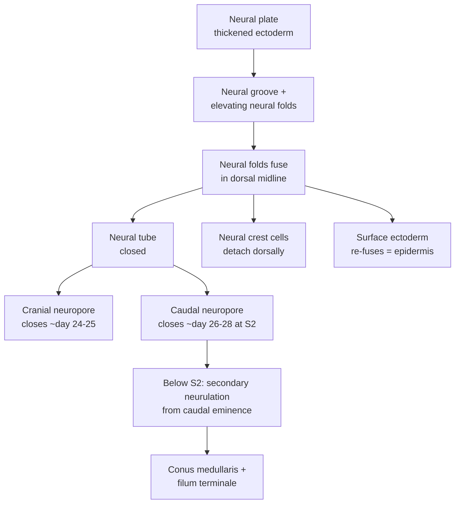
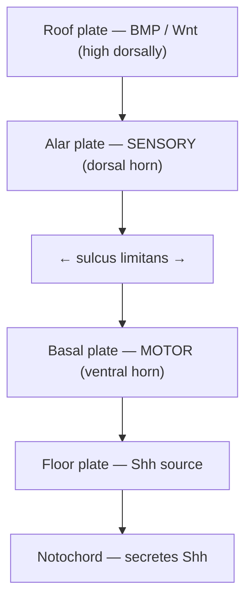
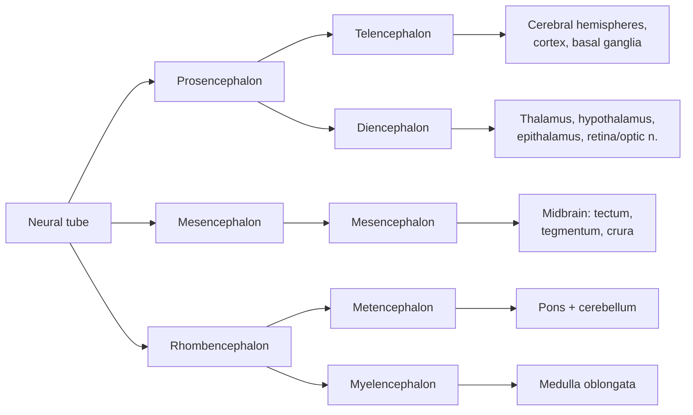

# Development of the Nervous System (Neuroembryology)

A technical reference on how the human nervous system is built — from a flat sheet of ectoderm to a folded cortex of ~86 billion neurons. The organizing theme is that the nervous system is assembled by a small, reusable toolkit of processes — **induction** (one tissue instructing another), **morphogen gradients** (graded chemical signals read out as position), **patterned proliferation**, **directed migration**, and **selective survival** — applied in a strict spatial and temporal sequence. Almost every major congenital malformation is a failure of one of these steps at a definable time, so understanding the normal sequence *is* understanding the pathology.

## Introduction

The entire central nervous system, the peripheral nervous system, the sensory placode–derived organs, the adrenal medulla, most of the pigment cells of the body, and much of the skull and face all trace back to a single embryonic tissue: **ectoderm**. How one sheet of cells produces such diversity — and does so with the reproducibility that lets a neuroanatomist name every nucleus in every person — is the subject of neuroembryology.

Three principles recur throughout this document and are worth holding in mind from the start.

First, **position is encoded chemically before it is expressed structurally**. Long before the spinal cord looks like a spinal cord, cells "know" whether they are dorsal or ventral, rostral or caudal, because they sit at a particular point along overlapping gradients of secreted signalling molecules (Sonic hedgehog, BMPs, Wnts, retinoic acid, FGFs). Each cell reads its coordinates and switches on a corresponding set of transcription factors. Structure follows from this molecular pre-pattern.

Second, **timing is everything**. The same tissue exposed to the same signal produces different outcomes depending on *when* it is exposed and for *how long*. Neurulation, neural-crest emigration, and cortical neurogenesis each occupy narrow, defined windows. A teratogen or nutritional deficiency causes a specific malformation because of *when* it acts, not merely *that* it acts.

Third, **the nervous system is built inside-out and bottom-up in reproducible order**. The cortex is laid down from its deepest layer outward; myelination sweeps from caudal to rostral and from sensory to association pathways over years. These orderly gradients are why development can be staged, and why disruptions produce recognizable syndromes.

This document follows the embryo forward in time: gastrulation and neural induction (week 3); neurulation and the neural crest (weeks 3–4); the patterning of the neural tube in both the dorsoventral and craniocaudal axes; the histogenesis of neurons and glia; the specific stories of spinal cord, cerebellum, and cerebral cortex; the ventricular system; and finally a systematic tour of the congenital malformations, each tied back to the step it disrupts.

## Table of Contents

- [1. Gastrulation, the Notochord, and Neural Induction](#1-gastrulation-the-notochord-and-neural-induction)
- [2. Neurulation: Building the Neural Tube](#2-neurulation-building-the-neural-tube)
- [3. The Neural Crest](#3-the-neural-crest)
- [4. Dorsoventral Patterning of the Neural Tube](#4-dorsoventral-patterning-of-the-neural-tube)
- [5. Craniocaudal Patterning: Vesicles, Derivatives, and Flexures](#5-craniocaudal-patterning-vesicles-derivatives-and-flexures)
- [6. Histogenesis: Making Neurons and Glia](#6-histogenesis-making-neurons-and-glia)
- [7. Development of the Spinal Cord](#7-development-of-the-spinal-cord)
- [8. Development of the Cerebellum](#8-development-of-the-cerebellum)
- [9. Development of the Cerebral Cortex](#9-development-of-the-cerebral-cortex)
- [10. Development of the Ventricular System](#10-development-of-the-ventricular-system)
- [11. Clinical Correlations: Congenital Malformations](#11-clinical-correlations-congenital-malformations)
- [12. Summary and Developmental Timeline](#12-summary-and-developmental-timeline)
- [Sources](#sources)

---

## 1. Gastrulation, the Notochord, and Neural Induction

### 1.1 Gastrulation establishes three germ layers

Nothing neural can happen until the embryo has an axis and three germ layers. Both are products of **gastrulation**, which occurs during the **third week** post-fertilization and converts the two-layered bilaminar disc (epiblast and hypoblast) into a trilaminar disc.

Gastrulation begins with the appearance of the **primitive streak**, a midline groove in the caudal epiblast. Its emergence is the first visible sign of the **craniocaudal (head–tail) and left–right axes**. At the cranial end of the streak the epiblast piles up into **Hensen's node (the primitive node)**, surrounding a depression, the **primitive pit**.

Epiblast cells migrate toward the streak, ingress through it (an epithelial-to-mesenchymal transition), and spread out beneath:

- Cells that displace the hypoblast become the **definitive endoderm**.
- Cells that come to lie between endoderm and epiblast become **mesoderm**.
- Cells that remain in the epiblast become **ectoderm** — the source of both the epidermis and the entire nervous system.

### 1.2 The notochord

From Hensen's node, cells migrate cranially in the midline to form the **notochordal process**, which matures into the **notochord** — a rod of axial mesoderm running along the midline beneath the ectoderm. The notochord is the embryo's primary organizer of the trunk. It defines the body axis, will later be the template around which the vertebral bodies form (persisting only as the **nucleus pulposus** of the intervertebral discs), and — critically for us — it is the **inductor of the overlying neural plate** and, later, the source of the ventralizing signal that patterns the neural tube. At the cranial midline, node-derived cells also form the **prechordal plate**, an important head-organizing centre.

### 1.3 Neural induction and the "default model"

The overlying ectoderm is induced to become **neuroectoderm** — the **neural plate** — by signals from the notochord and node (the mammalian equivalent of Spemann's amphibian **organizer**). The molecular logic is elegant and, initially, counter-intuitive.

Left to itself, ectoderm does not stay "neutral." **Bone morphogenetic proteins (BMPs)**, secreted broadly through the ectoderm, actively drive cells toward an **epidermal (skin)** fate and *suppress* neural fate. Neural induction therefore works not by adding a "make-neural" signal but by **removing the anti-neural (BMP) signal**. The organizer secretes a set of **BMP antagonists** — **Noggin, Chordin, and Follistatin** — that bind BMP proteins in the extracellular space and prevent them from reaching their receptors. Where BMP signalling is blocked, ectoderm follows its **"default" pathway to neural tissue**.

This **default model** is supported by direct experiment: depleting Chordin, Noggin, and Follistatin from amphibian embryos ventralizes the embryo and nearly abolishes the neural plate. In practice the picture is refined — **FGF signalling** also promotes neural fate and helps inhibit BMP, and **Wnt** signalling must be locally suppressed rostrally — but the core idea holds: *neural is the ground state of ectoderm, unmasked by inhibiting BMP*.

The same antagonism (BMP high = epidermis/dorsal; BMP low = neural/ventral) is reused minutes later, in a different geometry, to pattern the dorsoventral axis of the neural tube itself (Section 4).

---

## 2. Neurulation: Building the Neural Tube

**Neurulation** is the folding of the flat neural plate into a hollow **neural tube**, the primordium of the entire CNS. It happens in two distinct ways along the body axis.

### 2.1 Primary neurulation

Primary neurulation builds the neural tube from the level of the brain down to roughly the **second sacral segment**. The sequence is:

1. **Neural plate.** The induced neuroectoderm thickens into a pear-shaped plate, broad cranially (future brain) and narrow caudally (future spinal cord).
2. **Neural groove and neural folds.** The plate's lateral edges elevate as **neural folds**, and its midline sinks as the **neural groove**. Shaping is driven by apical constriction of **median hinge-point** cells (over the notochord) and **dorsolateral hinge-point** cells, plus convergent-extension movements that lengthen and narrow the plate.
3. **Fusion.** The neural folds meet and fuse in the dorsal midline, converting the groove into a closed **neural tube**. As the tube closes, its dorsal-most cells detach as the **neural crest** (Section 3), and the overlying ectoderm re-fuses over the top as future epidermis.

Closure does **not** proceed like a zipper from a single point. It begins in the **future cervical/hindbrain region (around the level of the foramen magnum)** at about **day 22** and proceeds both cranially and caudally, with additional closure sites, leaving temporary openings at each end.

### 2.2 The neuropores and their closure timing

The two transiently open ends are the **neuropores**:

- The **cranial (anterior) neuropore** closes at approximately **day 24–25** (Carnegie stage 11). Its failure produces **anencephaly**.
- The **caudal (posterior) neuropore** closes at approximately **day 26–28** (Carnegie stage 12), around the **S2** level. Its failure produces open **spina bifida (myelomeningocele)**.

These dates matter clinically: because the neuropores close in the fourth week — often **before a woman knows she is pregnant** — the folate that prevents neural tube defects must be present *periconceptionally*, not started at the first prenatal visit.

### 2.3 Secondary neurulation

Below S2, there is **no neural plate stage**. Instead, the caudal portion of the cord forms by **secondary neurulation**: a compact mass of pluripotent mesenchyme at the tail end — the **caudal eminence (caudal cell mass / end-bud)** — condenses, cavitates (forms one or several lumina), and canalizes to produce a **secondary neural tube** that fuses with the caudal end of the primary tube. This process forms the **conus medullaris and filum terminale** (the lower sacral and coccygeal cord). A subsequent phase of **retrogressive differentiation** (partial regression of the tail bud) sculpts the final conus and filum.

Because the two mechanisms are molecularly and mechanically different, they fail differently: **open** NTDs are disorders of primary neurulation, whereas **closed / occult spinal dysraphisms** (tethered cord, lipomyelomeningocele, dermal sinus, filum lipoma) are disorders of secondary neurulation and canalization.

### 2.4 The three primordial layers of the tube wall

Once closed, the wall of the neural tube is a pseudostratified neuroepithelium that soon organizes into three concentric zones — the basis of all later histology:

- **Ventricular (ependymal) zone** — innermost, lining the lumen; the proliferative germinal layer where mitosis occurs.
- **Intermediate (mantle) zone** — post-mitotic neuroblasts that accumulate outside the ventricular zone; becomes the **grey matter**.
- **Marginal zone** — outermost, largely cell-poor; filled by axons and later myelin; becomes the **white matter**.

---

## 3. The Neural Crest

The **neural crest** is often called the **"fourth germ layer"** because of the astonishing range of tissues it produces. As the neural folds fuse, the cells at the crest of the folds undergo an epithelial-to-mesenchymal transition, delaminate, and **migrate** along stereotyped pathways throughout the embryo, differentiating according to where they end up and the signals they meet en route.

### 3.1 Migration pathways (trunk)

In the trunk, crest cells take two main routes:

- A **ventrolateral (ventral) pathway** through the anterior half of each somite's sclerotome. Cells that halt beside the neural tube form the **dorsal root (sensory) ganglia**; those continuing more ventrally form the **sympathetic chain and prevertebral ganglia, the adrenal medulla, and the peri-aortic (para-aortic) plexuses**. The segmental (anterior-half-only) migration is what makes spinal nerves segmental.
- A **dorsolateral pathway** between ectoderm and somite, taken by prospective **melanocytes** that populate the skin.

### 3.2 Derivatives

| Category | Neural crest derivatives |
|---|---|
| **Peripheral neurons** | Dorsal root (spinal) ganglion sensory neurons; autonomic ganglion neurons (sympathetic chain, prevertebral, and parasympathetic/enteric); sensory ganglia of cranial nerves V, VII, IX, X (in part) |
| **Peripheral glia** | Schwann cells (myelinating and non-myelinating) of all peripheral nerves; satellite glial cells of sensory and autonomic ganglia |
| **Endocrine / paraendocrine** | Adrenal medulla chromaffin cells; parafollicular (C) cells of the thyroid; carotid body cells |
| **Pigment** | Melanocytes of skin, hair, choroid, and iris stroma |
| **Craniofacial skeleton & connective tissue** | Most bones and cartilage of the face and skull vault (via **ectomesenchyme** of the cranial crest); dentine-forming odontoblasts; corneal stroma and endothelium; connective tissue of the face |
| **Cardiac** | Aorticopulmonary septum (**cardiac neural crest**); dividing the outflow tract into aorta and pulmonary trunk |
| **Meninges** | Leptomeninges (pia and arachnoid) over the forebrain (from cranial crest) |

A subtlety worth noting: not all melanocytes and not all peripheral glia arise directly from early emigrating crest. **Schwann cell precursors** travelling along peripheral nerves act as a **secondary, later source of melanocytes** and of some autonomic neurons — a reminder that developmental lineage is a branching, revisitable tree rather than a fixed list.

### 3.3 Clinical relevance (neurocristopathies)

Because the crest is so widely distributed, single genetic lesions produce multi-system syndromes called **neurocristopathies**: **Hirschsprung disease** (failure of enteric ganglion colonization → aganglionic megacolon), **Waardenburg syndrome** (pigmentary and hearing defects), **neurofibromatosis type 1**, **CHARGE syndrome**, **DiGeorge / 22q11 deletion** (cardiac outflow and pharyngeal defects), and the neural-crest tumours **neuroblastoma, pheochromocytoma, and melanoma**.

---

## 4. Dorsoventral Patterning of the Neural Tube

Once the tube is closed, its cells must acquire **dorsoventral identity** — dorsal cells become sensory relay neurons, ventral cells become motor neurons. This is achieved by two opposing morphogen gradients emanating from the tube's poles.

### 4.1 The two signalling centres and two gradients

- **Ventral: Sonic hedgehog (Shh).** The **notochord** secretes Shh, which induces the ventral midline of the tube to become the **floor plate**; the floor plate then also secretes Shh. A **ventral-high, dorsal-low gradient of Shh** is established.
- **Dorsal: BMPs and Wnts.** The overlying epidermal ectoderm and then the **roof plate** (the dorsal midline) secrete **BMPs and Wnts**, creating a **dorsal-high gradient**.

Progenitors read their position as the ratio of these opposing signals. **Duration and concentration of Shh exposure** are translated into distinct combinations of transcription factors (the class I / class II homeodomain and bHLH factors — e.g., Nkx6.1, Olig2, Pax6, Dbx). These cross-repress one another to sharpen initially graded signals into **discrete progenitor domains** stacked along the dorsoventral axis, each producing a specific neuron type. A ventral (**pMN**) domain, exposed to high Shh, produces **motor neurons** (the still-more-ventral **p3** domain, under the highest neural-plate Shh, yields V3 interneurons, and the floor plate itself is the ventral-most, non-neuronal cell type); more dorsal domains produce various interneurons; the dorsal-most produce sensory relay (commissural) neurons.

### 4.2 Alar plate, basal plate, and the sulcus limitans

At the level of gross anatomy, this molecular patterning appears as two longitudinal thickenings of the mantle zone on each side, separated by a groove in the wall of the central canal — the **sulcus limitans**:

- **Basal plate (ventral).** Motor. Contains the somatic and visceral **motor** (efferent) neurons. In the spinal cord it becomes the **ventral (anterior) horn**; in the brainstem it houses the motor cranial-nerve nuclei.
- **Alar plate (dorsal).** Sensory. Contains **sensory (afferent) relay** neurons. In the spinal cord it becomes the **dorsal (posterior) horn**; in the brainstem it houses the sensory cranial-nerve nuclei.
- **Floor plate and roof plate.** The thin, non-neuronal ventral and dorsal midline strips. They are organizing centres (Shh and BMP/Wnt sources) and remain nearly cell-cycle-inactive; the floor plate later guides commissural axons across the midline.

The **sulcus limitans is a landmark of enormous practical value**: it separates motor (ventromedial) from sensory (dorsolateral) grey matter along the entire neural tube. When the brainstem's central canal "opens out" into the fourth ventricle (Section 5), the alar and basal plates are splayed laterally, so that in the adult medulla and pons the **motor cranial-nerve nuclei lie medial** to the **sensory nuclei** — a direct anatomical fossil of the embryonic sulcus limitans.

---

## 5. Craniocaudal Patterning: Vesicles, Derivatives, and Flexures

While the tube is patterned dorsoventrally by Shh/BMP, it is patterned **craniocaudally** by a different set of gradients — **retinoic acid, FGFs, and Wnts** (posteriorizing signals) opposed by their antagonists rostrally, read out through nested **Hox** gene expression in the hindbrain and spinal cord and **Otx/Gbx/Pax** codes in the forebrain–midbrain. A key organizer here is the **isthmic organizer (mid–hindbrain boundary)**, which secretes **FGF8 and Wnt1** and patterns the midbrain and cerebellum.

### 5.1 Primary vesicles (~week 4)

The cranial neural tube dilates into **three primary vesicles**:

- **Prosencephalon (forebrain)**
- **Mesencephalon (midbrain)**
- **Rhombencephalon (hindbrain)**

### 5.2 Secondary vesicles (~week 5)

Two of the three subdivide, giving **five secondary vesicles**:

- Prosencephalon → **Telencephalon** + **Diencephalon**
- Mesencephalon → **Mesencephalon** (undivided)
- Rhombencephalon → **Metencephalon** + **Myelencephalon**

### 5.3 Vesicles → adult derivatives → cavity

| Primary vesicle | Secondary vesicle | Major adult derivatives | Cavity (ventricle) |
|---|---|---|---|
| **Prosencephalon** | **Telencephalon** | Cerebral cortex, white matter, hippocampus, amygdala, basal ganglia (caudate, putamen, globus pallidus), olfactory bulb | **Lateral ventricles** |
| **Prosencephalon** | **Diencephalon** | Thalamus, hypothalamus, epithalamus (pineal), subthalamus; retina, optic nerve & optic cup; neurohypophysis (posterior pituitary) | **Third ventricle** |
| **Mesencephalon** | **Mesencephalon** | Midbrain: tectum (superior & inferior colliculi), tegmentum, cerebral peduncles/crura, substantia nigra, red nucleus, CN III & IV nuclei | **Cerebral aqueduct (of Sylvius)** |
| **Rhombencephalon** | **Metencephalon** | **Pons** (ventral) and **cerebellum** (dorsal) | Upper **fourth ventricle** |
| **Rhombencephalon** | **Myelencephalon** | **Medulla oblongata** | Lower **fourth ventricle** → central canal |

### 5.4 Flexures

Because the tube grows faster than the surrounding tissue, it **folds**. Three flexures develop:

- **Cephalic (mesencephalic / midbrain) flexure** — a ventral bend at the midbrain; the first to appear.
- **Cervical flexure** — a ventral bend at the hindbrain–spinal cord junction.
- **Pontine flexure** — a **dorsal** bend at the future pons, in the opposite direction to the other two. It thins the roof of the fourth ventricle and, by splaying the rhombencephalon open like a book, converts the tubular central canal into the diamond-shaped **fourth ventricle** — the event that lays the alar plates lateral to the basal plates in the brainstem (Section 4.2).

---

## 6. Histogenesis: Making Neurons and Glia

### 6.1 The germinal ventricular zone and interkinetic nuclear migration

All CNS neurons and macroglia originate from the **neuroepithelium lining the ventricles** — the **ventricular zone (VZ)**, later supplemented by a second germinal layer, the **subventricular zone (SVZ)**. Early neuroepithelial cells are attached to both the ventricular (apical) and pial (basal) surfaces. Their nuclei shuttle up and down with the cell cycle — **S-phase near the pial side, mitosis at the ventricular surface** — a movement called **interkinetic nuclear migration** that gives the epithelium its "pseudostratified" look.

### 6.2 The neurogenesis-to-gliogenesis switch and radial glia

Early divisions are **symmetric and proliferative** (expanding the progenitor pool). Progenitors then transform into **radial glia** — elongated cells that keep a process spanning the full thickness of the wall from ventricle to pia. Radial glia are the workhorses of histogenesis: they are simultaneously **neural stem cells** (dividing **asymmetrically** to self-renew and produce a neuron or an intermediate progenitor) **and the physical scaffold** along which young neurons climb (Section 9). Neurons are generated first; **gliogenesis** (astrocytes, then oligodendrocytes) follows, and at the end many radial glia themselves translocate and become **astrocytes**. The intrinsic clock inside progenitors, tuned by Notch, FGF, and other signals, drives this **neurons-before-glia** sequence.

### 6.3 Myelination timeline

**Oligodendrocytes** (CNS myelin) and **Schwann cells** (PNS myelin, from neural crest) myelinate axons late and slowly. In humans, cortical oligodendrogenesis begins around **10 gestational weeks**, and CNS myelination begins **prenatally** (unlike rodents), starting in the **caudal brainstem** in the second half of gestation. Myelination then follows two robust rules that persist for years:

- **Caudal → rostral**: brainstem and spinal cord before cerebrum.
- **Sensory → motor → association**: primary sensory and motor pathways myelinate early; association and frontal cortices last.

The most rapid, dramatic phase is the **first two postnatal years**, but myelination of frontal association fibres continues into the **third and fourth decades**, a fact often invoked to explain the protracted maturation of executive function. This late, activity-dependent myelination is also a form of plasticity, not merely a fixed developmental schedule.

---

## 7. Development of the Spinal Cord

The spinal cord is the part of the neural tube that changes least, so it best displays the basic plan.

### 7.1 Grey and white matter

Neuroblasts of the **mantle (intermediate) zone** form the **grey matter**; their pattern follows the alar/basal division:

- **Basal plate → ventral (anterior) horn**: somatic motor neurons. Between T1 and L2/L3 (and at S2–S4), an additional **intermediate horn / intermediolateral cell column** forms from cells straddling the sulcus limitans, giving the **preganglionic autonomic (sympathetic and sacral parasympathetic) neurons**.
- **Alar plate → dorsal (posterior) horn**: sensory relay interneurons and tract cells receiving dorsal-root afferents.

The **marginal zone** fills with ascending and descending axons to become the **white matter columns**; myelination greys it only later.

### 7.2 "Ascent" of the cord (positional change)

At first the spinal cord runs the entire length of the vertebral canal, and spinal nerves exit horizontally. But the **vertebral column and dura grow faster and longer than the cord**, so the caudal end of the cord appears to **"ascend"** relative to the vertebrae — a differential-growth effect, not true migration. Consequences:

- The **conus medullaris** lies around **L1–L3 at birth** (modally already at **L1–L2**). Classic teaching describes further postnatal ascent to the adult **lower border of L1–L2** by ~2 years, but modern imaging and meta-analysis indicate the adult level is essentially reached by term (by ~week 26 of gestation), with only minor postnatal ascent.
- Lumbosacral roots must run downward inside the canal to reach their now-caudal exit foramina, forming the **cauda equina**.
- The stretched **filum terminale** (pial remnant, from the secondary neural tube) anchors the conus to the coccyx.

This ascent is why **lumbar puncture** is performed at **L3–L4 or L4–L5** — below the conus, among the mobile roots of the cauda equina — and why failure of the cord to ascend (**tethered cord**, often from a thickened filum or lipoma of secondary-neurulation origin) presents with progressive neurological and urological deficits.

---

## 8. Development of the Cerebellum

The cerebellum arises from the **dorsal metencephalon**, specifically from the **rhombic lips** — the dorsolateral edges of the alar plate flanking the roof of the fourth ventricle. It is unusual in having **two germinal zones** that produce different neuron classes.

### 8.1 Two germinal sources

- **Ventricular zone (of the fourth-ventricle roof)** → the **GABAergic** neurons: **Purkinje cells**; the Golgi, basket, and stellate interneurons; and the **GABAergic** (interneuron and nucleo-olivary) neurons of the **deep cerebellar nuclei**.
- **Rhombic lip** → the **glutamatergic** neurons: the **granule cells** (via the EGL below), the unipolar brush cells, and the large **glutamatergic projection neurons of the deep cerebellar nuclei** (so the deep nuclei are of dual origin — glutamatergic from the rhombic lip, GABAergic from the ventricular zone). Rhombic-lip cells migrate **tangentially** over the surface to form a transient outer germinal sheet, the **external granular (germinal) layer (EGL)**.

### 8.2 The external granular layer and postnatal amplification

The **EGL is a secondary germinal zone on the cerebellar surface** that continues to proliferate massively **after birth** — the reason the cerebellum is exquisitely vulnerable to perinatal injury and produces the common childhood tumour **medulloblastoma**. Its proliferation is driven by **Sonic hedgehog secreted by the underlying Purkinje cells**. After dividing, each granule-cell precursor extends parallel-fibre axons and then migrates **inward**, past the Purkinje cell layer, guided by **Bergmann glial fibres**, to settle in the **internal granular layer** — the definitive granule-cell layer. The EGL is exhausted around the end of the first to second postnatal year (largely gone by ~11–15 months), and adult cerebellar cortex has its final three-layered structure (molecular, Purkinje, granular).

Cerebellar development thus extends well past birth and depends on the **roof of the fourth ventricle** and its coverings — which is exactly why malformations of that roof (**Dandy–Walker**) and of hindbrain size versus posterior-fossa volume (**Chiari**) are cerebellar/fourth-ventricular problems (Section 11).

---

## 9. Development of the Cerebral Cortex

Corticogenesis is the most elaborate histogenetic program in the body and the one whose failures produce the most striking imaging findings.

### 9.1 Progenitors and the germinal zones

Neurons of the cortex are born in the **ventricular zone (VZ)** and the **subventricular zone (SVZ)** lining the lateral ventricles. The key progenitor is the **apical radial glial cell**, spanning ventricle to pia. It divides asymmetrically to self-renew and to generate either a neuron directly or an **intermediate (basal) progenitor** that divides in the SVZ to yield neurons. In primates (including humans), an expanded **outer subventricular zone (oSVZ)** populated by **basal/outer radial glia** hugely amplifies neuron number and is thought to underlie the **gyrification and expansion** of the human cortex.

### 9.2 Radial migration and the inside-out rule

Post-mitotic neurons do not stay where they are born. They **migrate along the basal processes of radial glia** toward the pia, like climbers on ropes. The first neurons form a **preplate**, which is split by later arrivals into a superficial **marginal zone** (future layer I) and a deep **subplate** (a transient scaffold crucial for thalamocortical wiring). Subsequent waves migrate into the **cortical plate** between them.

The defining rule is **inside-out layering**: **earlier-born neurons occupy the deepest layers (VI, then V)**, and each successive wave of later-born neurons **migrates *past* its predecessors** to settle more superficially (IV, III, II). Thus the cortex is built from the bottom up, and a neuron's birthdate predicts its laminar fate.

### 9.3 Molecular control and the two migration modes

- **Radial (glia-guided) migration** builds the layered **excitatory (glutamatergic) pyramidal** neurons, born locally in the dorsal telencephalon.
- **Tangential migration**: the cortex's **inhibitory (GABAergic) interneurons** are born far away in the **ganglionic eminences** (ventral telencephalon) and migrate **tangentially** into the cortex, then integrate into the layers.

Two molecular systems are of special clinical importance:

- **LIS1 and DCX (doublecortin)** encode microtubule-associated machinery required for the nucleus-and-centrosome movements of migration ("nucleokinesis"). Their loss stalls migration → **lissencephaly / band heterotopia**.
- **Reelin**, secreted by **Cajal–Retzius cells** in the marginal zone, is the **stop/positioning signal**: it tells arriving neurons where to detach from the glial fibre and terminate migration in the correct layer. Without Reelin, layers form in a roughly **inverted** order.

The same regions of ventricular zone also seed the **basal ganglia** (from the ganglionic eminences) and, from the diencephalic wall, the **thalamus** — so a single germinal sheet gives rise to cortex, deep grey nuclei, and their interconnecting interneurons.

---

## 10. Development of the Ventricular System

The **ventricular system is simply the persistent, elaborated lumen of the neural tube** — the fluid-filled space is continuous from the start. As the vesicles expand, the neural canal is remodelled into the adult cavities:

| Neural tube cavity | Adult ventricular derivative |
|---|---|
| Telencephalic vesicles | **Lateral ventricles** |
| Diencephalic cavity | **Third ventricle** |
| Interventricular connections | **Interventricular foramina (of Monro)** — lateral ↔ third |
| Mesencephalic cavity | **Cerebral aqueduct (of Sylvius)** — third ↔ fourth |
| Rhombencephalic cavity | **Fourth ventricle** |
| Caudal neural canal | **Central canal** of the medulla and spinal cord |

### 10.1 Choroid plexus and CSF

The **choroid plexus** — the CSF-producing tissue — forms where a thin, non-neural **ependymal roof** (from the roof plate) is invaginated by vascular pia (**tela choroidea**). Plexuses appear in a set order — **fourth ventricle first, then lateral, then third** — shortly after tube closure.

### 10.2 Opening the fourth ventricle to the subarachnoid space

Initially the ventricular system is a **closed sac**. During the **second to third months**, three apertures perforate the thin roof of the fourth ventricle, connecting the ventricles to the developing **subarachnoid space**:

- the midline **median aperture (foramen of Magendie)**, and
- the paired **lateral apertures (foramina of Luschka)**.

Only after these open can CSF, produced inside the ventricles, circulate over the surface of the brain and be resorbed. **Failure of these apertures to open** (or maldevelopment of the fourth-ventricular roof) causes CSF to accumulate — the mechanism shared by **Dandy–Walker malformation** and one form of congenital hydrocephalus.

---

## 11. Clinical Correlations: Congenital Malformations

Each malformation below is anchored to the developmental step it disrupts and the window in which the insult must act.

### 11.1 Neural tube defects (NTDs) — failure of neurulation (weeks 3–4)

NTDs are the second most common group of congenital anomalies. They divide by **whether the tube failed to close (open, dysraphic)** or closed but was later disturbed (closed).

**Open / non-fused (failure of primary neurulation):**

- **Anencephaly** — failure of **cranial neuropore** closure (~day 24). The forebrain and calvaria fail to form; the exposed neural tissue degenerates (**area cerebrovasculosa**). Incompatible with life; associated with **polyhydramnios** (impaired fetal swallowing) and raised maternal serum/amniotic **α-fetoprotein (AFP)**.
- **Myelomeningocele (open spina bifida cystica)** — failure of **caudal neuropore** closure. Meninges **and neural tissue** herniate through a vertebral arch defect; produces motor/sensory loss below the level, neurogenic bladder/bowel, and is almost always accompanied by **Chiari II** and hydrocephalus. Raised AFP.
- **Meningocele** — herniation of **meninges and CSF only** (cord/roots remain in place); milder.
- **Encephalocele** — herniation of meninges ± brain through a **skull (usually occipital) defect**. Sometimes classified as a **post-neurulation** defect of the closed tube rather than a pure closure failure.

**Closed / occult (skin-covered; disorders of secondary neurulation or bony fusion):**

- **Spina bifida occulta** — failure of the posterior **vertebral arch** (commonly L5–S1) to fuse, with an intact cord and skin. Very common and usually asymptomatic; a **hairy patch, dimple, or lipoma** over the lumbosacral spine is a clue. Normal AFP.
- **Tethered cord, filar lipoma, dermal sinus, lipomyelomeningocele** — disorders of secondary neurulation/canalization; may present with progressive deficits as the child grows.

**Folate and prevention.** Periconceptional **folic acid** supplementation reduces NTD risk by up to ~70%. Folate is required as a one-carbon donor for **nucleotide synthesis** (proliferation of the rapidly dividing neuroepithelium) and for the **methionine/S-adenosylmethionine methylation cycle** that supplies methyl groups for DNA and histone methylation controlling neurodevelopmental gene expression. Deficiency (or genetic hypofunction such as **MTHFR** variants, or **valproate** and other folate antagonists) impairs closure. Because closure is complete by ~day 28, supplementation must begin **before conception**.

### 11.2 Holoprosencephaly — failure of forebrain cleavage (weeks 4–6)

The **prosencephalon fails to divide into two hemispheres** (and the diencephalon into paired structures). Ventral-midline patterning fails, classically from disrupted **Shh signalling** (SHH mutations; also trisomy 13, maternal diabetes, and cholesterol-synthesis defects such as **Smith–Lemli–Opitz**, since cholesterol is needed to activate Shh). Because the same ventral midline patterns the face, holoprosencephaly follows the dictum **"the face predicts the brain"**: severity ranges from **cyclopia and proboscis** (alobar) through **hypotelorism, single central incisor, and cleft lip** (semilobar/lobar). The alobar form shows a single midline **monoventricle**.

### 11.3 Chiari malformations — hindbrain/posterior-fossa mismatch

- **Chiari I** — caudal displacement of the **cerebellar tonsils** >5 mm below the foramen magnum, generally from an **underdeveloped/small posterior fossa** crowding normal hindbrain. Often presents in adolescence/adulthood with occipital headache and, when it obstructs CSF at the foramen magnum, **syringomyelia**.
- **Chiari II (Arnold–Chiari)** — near-universally associated with **myelomeningocele**. The **vermis, brainstem, and fourth ventricle herniate** through the foramen magnum. The favored unifying explanation is the **"unified theory"**: CSF leaks through the open spinal defect during development, the fourth ventricle fails to distend and "inflate" the posterior fossa, so the posterior fossa is **too small**, and the growing hindbrain is squeezed caudally. Obstruction of fourth-ventricular outflow and the aqueduct produces the accompanying **hydrocephalus**.

### 11.4 Dandy–Walker malformation — defect of the fourth-ventricular roof

A triad of **(1) hypoplasia/agenesis of the cerebellar vermis, (2) cystic dilatation of the fourth ventricle** filling an **(3) enlarged posterior fossa** with upward displacement of the tentorium and torcula. It reflects **maldevelopment of the rhombencephalic roof plate**, such that the vermis fails to form and the fourth-ventricular outflow/roof does not develop normally. **Hydrocephalus** is common (~80%). It shares an embryologic theme with Chiari — both are disorders of the **roof of the rhombencephalon and its relationship to the fourth ventricle** — but they differ in that Chiari crowds a small fossa while Dandy–Walker cystically expands a large one.

### 11.5 Hydrocephalus — CSF accumulation

Hydrocephalus is accumulation of CSF under pressure, from imbalance of production, flow, and resorption. It is classified by the **site of the block**:

- **Non-communicating (obstructive)** — block *within* the ventricular system. The commonest congenital cause is **aqueductal stenosis** (narrow cerebral aqueduct), which produces **triventricular** hydrocephalus (lateral + third ventricles dilate, **fourth spared**). Also caused by Chiari II and Dandy–Walker (outflow obstruction) and by tumours.
- **Communicating** — CSF exits the ventricles but is not resorbed (or the subarachnoid apertures never opened), e.g., after **intraventricular haemorrhage** of prematurity or meningitis scarring the arachnoid granulations.

In an infant, before sutures fuse, hydrocephalus enlarges the head with **bulging fontanelles, splayed sutures, and "sunset eyes."** Distinguish from **hydrocephalus ex vacuo** (ventricular enlargement due to *loss* of brain tissue, not raised pressure).

### 11.6 Neuronal migration and organization disorders (weeks 7–20+)

These arise **after** the tube is built, during corticogenesis, when neurons are born and migrate. They are the mechanistic "second half" of Section 9.

- **Lissencephaly ("smooth brain") / agyria–pachygyria** — a severe **migration arrest**: neurons never complete radial migration, leaving a **thick, four-layered cortex with absent or broad gyri**. Classic (type I) lissencephaly is caused chiefly by mutations in **LIS1** (chromosome 17; part of **Miller–Dieker syndrome** with a contiguous deletion), **DCX (doublecortin)**, **TUBA1A**, and others. Because **DCX is X-linked**, the same mutation causes **lissencephaly in hemizygous males** but the milder **subcortical band heterotopia ("double cortex")** in heterozygous females (a ribbon of arrested neurons stranded in the white matter). Presents with severe epilepsy and developmental delay.
- **Heterotopia** — collections of neurons stranded where they do not belong: **periventricular nodular heterotopia** (migration fails to start; classically **FLNA/filamin-A**, X-linked) or **subcortical band heterotopia** (migration stalls midway).
- **Polymicrogyria** — a **late (post-migration) organizational** defect: too many small, fused gyri, from disturbed cortical lamination/organization (genetic, or acquired, e.g., **congenital CMV infection** or ischemia).
- **Schizencephaly** — a full-thickness cleft lined by (usually dysplastic) grey matter connecting ventricle to subarachnoid space; a destructive/organizational defect.

The unifying pathophysiology: whatever the gene, the defect is in the **motors, tracks, or stop-signals of migration** — microtubule/nucleokinesis machinery (LIS1, DCX, tubulins), the guidance scaffold (radial glia), or the Reelin positioning signal — and the phenotype's severity tracks how early and how completely migration is disrupted.

---

## 12. Summary and Developmental Timeline

The nervous system is assembled by an ordered application of a few reusable operations, and its pathology is best understood as failure of a specific operation at a specific time.

| Time (post-fertilization) | Event | Failure → malformation |
|---|---|---|
| **Week 3** | Gastrulation; notochord; **neural induction** (BMP antagonism) → neural plate | Caudal dysgenesis; midline defects |
| **Days 22–28** | **Neurulation**; neuropores close (cranial ~24, caudal ~26–28) | Anencephaly, myelomeningocele, encephalocele |
| **Week 4** | Neural crest emigration | Neurocristopathies (Hirschsprung, etc.) |
| **Weeks 4–5** | 3 → 5 vesicles; flexures | — |
| **Weeks 4–6** | Forebrain cleavage; ventral (Shh) midline patterning | **Holoprosencephaly** |
| **Weeks 5–20** | DV patterning (Shh/BMP); alar/basal plates; brainstem nuclei | Roof-plate defects → **Dandy–Walker / Chiari** |
| **Weeks 7–20+** | Cortical neurogenesis + **radial migration** (inside-out) | **Lissencephaly, heterotopia, polymicrogyria** |
| **Late fetal → years** | Gliogenesis; **myelination** (caudal→rostral, sensory→association) | Dysmyelination; protracted frontal maturation |
| **Fetal (mostly by term)** | Cord "ascent"; conus at ~L1–L2 (minor postnatal change) | **Tethered cord** |

The through-line: **induction sets fate, morphogen gradients set position, patterned proliferation sets number, directed migration sets place, and myelination sets speed** — each in its own window, each with a signature disorder when it fails. A neuroanatomist who can name the step and the week can usually predict both the malformation and why folate, a Shh mutation, or a microtubule gene produced it.

## Sources

- [Neuroanatomy, Neural Tube Development and Stages — StatPearls (NCBI)](https://www.ncbi.nlm.nih.gov/books/NBK557414/)
- [Formation of the Neural Tube — Developmental Biology (NCBI Bookshelf)](https://www.ncbi.nlm.nih.gov/books/NBK10080/)
- [Differentiation of the Neural Tube — Developmental Biology (NCBI Bookshelf)](https://www.ncbi.nlm.nih.gov/books/NBK10034/)
- [The Neural Crest — Developmental Biology (NCBI Bookshelf)](https://www.ncbi.nlm.nih.gov/books/NBK10065/)
- [Neuroanatomy, Neural Crest — StatPearls (NCBI)](https://www.ncbi.nlm.nih.gov/books/NBK547700/)
- [Neural crest — Wikipedia](https://en.wikipedia.org/wiki/Neural_crest)
- [Neurulation — Wikipedia](https://en.wikipedia.org/wiki/Neurulation)
- [Neurulation in the normal human embryo (O'Rahilly & Müller) — PubMed](https://pubmed.ncbi.nlm.nih.gov/8005032/)
- [Spinal neural tube formation and tail development in human embryos (PMC)](https://www.ncbi.nlm.nih.gov/pmc/articles/PMC11620743/)
- [Embryology, Gastrulation — StatPearls (NCBI)](https://www.ncbi.nlm.nih.gov/books/NBK554394/)
- [3rd week of embryonic development — Kenhub](https://www.kenhub.com/en/library/anatomy/embryology-3rd-week-of-development)
- [Embryology — Gastrulation — TeachMeAnatomy](https://teachmeanatomy.info/the-basics/embryology/gastrulation/)
- [Neural induction, the default model and embryonic stem cells — Nature Reviews Neuroscience](https://www.nature.com/articles/nrn786)
- [Neural induction: old problem, new findings, yet more questions — Development](https://journals.biologists.com/dev/article/132/9/2007/43373/Neural-induction-old-problem-new-findings-yet-more)
- [The mechanisms of dorsoventral patterning in the vertebrate neural tube — ScienceDirect](https://www.sciencedirect.com/science/article/pii/S001216060500134X)
- [Wnt won the war: antagonistic role of Wnt over Shh in DV patterning — Developmental Dynamics](https://anatomypubs.onlinelibrary.wiley.com/doi/10.1002/dvdy.22058)
- [Central nervous system: Development and embryology — Kenhub](https://www.kenhub.com/en/library/anatomy/development-of-the-central-nervous-system)
- [Brain vesicle — Wikipedia](https://en.wikipedia.org/wiki/Brain_vesicle)
- [Embryonic Development of the CNS — Anatomy & Physiology 2e (Oregon State)](https://open.oregonstate.education/anatomy2e/chapter/embryonic-development-cns/)
- [Molecular Pathways Underlying Projection Neuron Production and Migration during Cerebral Cortical Development (PMC)](https://www.ncbi.nlm.nih.gov/pmc/articles/PMC4682034/)
- [Normal and Disordered Formation of the Cerebral Cortex (PMC)](https://pmc.ncbi.nlm.nih.gov/articles/PMC6514308/)
- [Rhombic lip — Wikipedia](https://en.wikipedia.org/wiki/Rhombic_lip)
- [Origins, Development, and Compartmentation of the Granule Cells of the Cerebellum (PMC)](https://www.ncbi.nlm.nih.gov/pmc/articles/PMC7843939/)
- [Oligodendrocyte development and the onset of myelination in the human fetal brain — Frontiers in Neuroanatomy](https://www.frontiersin.org/journals/neuroanatomy/articles/10.3389/neuro.05.005.2009/full)
- [Ascent of the conus medullaris in human foetuses: a systematic review and meta-analysis — Scientific Reports](https://www.nature.com/articles/s41598-022-15130-9)
- [Ventricular system — Wikipedia](https://en.wikipedia.org/wiki/Ventricular_system)
- [Neural — Ventricular System Development — UNSW Embryology](https://embryology.med.unsw.edu.au/embryology/index.php/Neural_-_Ventricular_System_Development)
- [Neural tube defects — PubMed (review)](https://pubmed.ncbi.nlm.nih.gov/25032496/)
- [Neural Tube Defects (NTDs) — Cleveland Clinic](https://my.clevelandclinic.org/health/diseases/22656-neural-tube-defects-ntd)
- [Abnormal methylation caused by folic acid deficiency in neural tube defects (PMC)](https://www.ncbi.nlm.nih.gov/pmc/articles/PMC9784971/)
- [Holoprosencephaly: Background, Etiology — Medscape](https://emedicine.medscape.com/article/2060996-overview)
- [Dandy-Walker Malformation — StatPearls (NCBI)](https://www.ncbi.nlm.nih.gov/books/NBK538197/)
- [A unifying hypothesis for hydrocephalus, Chiari, syringomyelia, anencephaly and spina bifida (PMC)](https://pmc.ncbi.nlm.nih.gov/articles/PMC2365936/)
- [Neuronal migration disorders — ScienceDirect / PubMed](https://pubmed.ncbi.nlm.nih.gov/19245832/)
- [Genotype-phenotype correlation in neuronal migration disorders and cortical dysplasias — Frontiers in Neuroscience](https://www.ncbi.nlm.nih.gov/pmc/articles/PMC4439546/)
- [Intragenic deletions/duplications of LIS1 and DCX in lissencephaly and band heterotopia — European Journal of Human Genetics](https://www.nature.com/articles/ejhg2008213)
