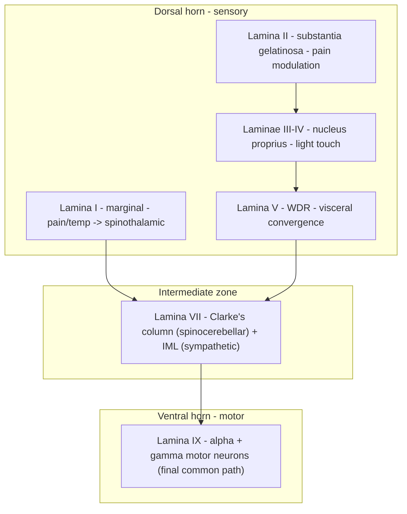
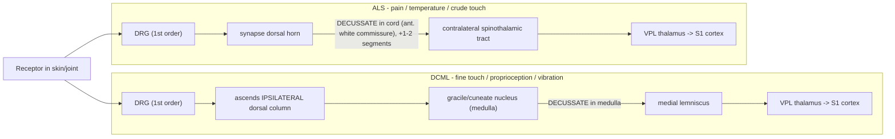
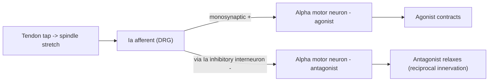

# The Spinal Cord and the Long Tracts

A clinical-neuroanatomy reference on the spinal cord: its external form and internal architecture, the ascending sensory and descending motor tracts that run through its white matter, the reflex circuits built into its gray matter, its blood supply, and the lesion syndromes that follow when specific tracts or territories fail. The organizing idea throughout is that the spinal cord is not a passive cable but a **segmentally organized processor** whose anatomy is legible from the bedside: because each long tract has a known origin, a known level of crossing, and a known position in cross-section, a pattern of deficit can be read backwards to a location.

## Introduction

The spinal cord is the caudal continuation of the brainstem, a roughly cylindrical band of central nervous tissue, about 42–45 cm long in the adult, that occupies the upper two-thirds of the vertebral canal. Through it pass every somatic motor command destined for the trunk and limbs and nearly every somatic sensory signal returning from them, together with the autonomic outflow to the viscera. It is also, in its own right, an integrative organ: it contains the complete circuitry for stretch reflexes, withdrawal reflexes, and — in the form of central pattern generators — the rhythm of locomotion.

What makes the spinal cord so rewarding to study clinically is the **regularity of its wiring**. The gray matter is arranged into a butterfly of nuclei with predictable functions. The white matter is arranged into columns whose tracts occupy fixed, mappable positions and cross the midline at fixed, knowable levels. Because a first-order sensory neuron for pain crosses within a segment or two of entering, while a first-order neuron for fine touch does not cross until the medulla, a single lesion can dissociate one modality from another and split them across the two sides of the body. The classic cord syndromes — Brown-Séquard, syringomyelia, anterior spinal artery syndrome, subacute combined degeneration, tabes dorsalis, poliomyelitis, ALS — are, in the end, just this tract anatomy read out as a clinical picture. This document builds the anatomy first, then uses it to explain each syndrome mechanistically.

## Table of Contents

- [1. External Features and Gross Structure](#1-external-features-and-gross-structure)
- [2. Meningeal Coverings and Spaces](#2-meningeal-coverings-and-spaces)
- [3. Internal Structure: Gray Matter and the Rexed Laminae](#3-internal-structure-gray-matter-and-the-rexed-laminae)
- [4. Internal Structure: The White Matter Columns](#4-internal-structure-the-white-matter-columns)
- [5. Ascending (Sensory) Tracts](#5-ascending-sensory-tracts)
- [6. Descending (Motor) Tracts](#6-descending-motor-tracts)
- [7. Summary Table of the Major Tracts](#7-summary-table-of-the-major-tracts)
- [8. Spinal Reflexes and the Reflex Arc](#8-spinal-reflexes-and-the-reflex-arc)
- [9. Upper vs Lower Motor Neuron Lesions](#9-upper-vs-lower-motor-neuron-lesions)
- [10. Blood Supply of the Spinal Cord](#10-blood-supply-of-the-spinal-cord)
- [11. Clinical Syndromes of the Spinal Cord](#11-clinical-syndromes-of-the-spinal-cord)
- [12. Summary Table of Clinical Syndromes](#12-summary-table-of-clinical-syndromes)
- [Sources](#sources)

---

## 1. External Features and Gross Structure

The spinal cord extends from the **foramen magnum** — where it is continuous with the medulla oblongata — to its tapered lower end, the **conus medullaris**. In the adult it terminates at the level of the **L1–L2 intervertebral disc** (with normal variation from T12 to L3). It is on average about 45 cm long in men and 42–43 cm in women, weighing roughly 30 g.

### Enlargements

The cord is not uniform in diameter. It bears two fusiform **enlargements** where the large limb plexuses attach, reflecting the extra motor neurons and sensory relay cells needed to serve a limb:

- The **cervical enlargement** (spinal segments **C5–T1**, roughly opposite vertebrae C3–T2) supplies the **brachial plexus** and the upper limbs.
- The **lumbosacral (lumbar) enlargement** (segments **L1–S3**, roughly opposite vertebrae T9–T12) supplies the **lumbar and sacral plexuses** and the lower limbs.

### The disproportion between cord segments and vertebral levels

A central fact of spinal anatomy is that **the cord is shorter than the vertebral column**. Early in fetal life the cord fills the whole canal, but the vertebral column subsequently grows faster, so the cord "ascends" relative to the bones. As a result, a given cord segment lies above its correspondingly numbered vertebra, and the nerve roots must travel progressively longer, more oblique, and more vertical courses to reach their exit foramina.

Useful clinical rules of thumb for the relationship of **cord segment to overlying vertebral spine**:

- Cervical: add ~1 to the vertebral number (e.g., C6 segment lies at the C5 spine).
- Upper thoracic (T1–T6): add ~2.
- Lower thoracic (T7–T9): add ~3.
- The **T10–T12 vertebrae** overlie the **entire lumbar cord (L1–L5 segments)**.
- The **L1 vertebra** overlies the **sacral and coccygeal segments** (the conus).

### Cauda equina and filum terminale

Because the cord ends at L1–L2 but the lumbar, sacral, and coccygeal nerve roots must still reach their far-lower exit foramina, these long roots descend nearly vertically below the conus as a bundle resembling a horse's tail — the **cauda equina** (roots of L2 through the coccygeal nerve, bathed in CSF in the lumbar cistern of the subarachnoid space). This is what makes lumbar puncture safe below L2: the needle enters a sac containing mobile nerve roots and CSF but no cord to injure.

From the tip of the conus a delicate, non-neural strand of pia mater — the **filum terminale** — descends. Its upper part (the *filum terminale internum*) runs within the dural sac to about the S2 level; below that the dura invests it as the *filum terminale externum* (coccygeal ligament), which anchors the cord to the dorsal coccyx. The filum tethers and stabilizes the cord; abnormal thickening or shortening produces the **tethered cord syndrome**.

### Surface grooves

In cross-section the cord shows a deep **anterior median fissure** ventrally and a shallow **posterior median sulcus** (continued inward as the posterior median septum) dorsally. Between them, on each side, run the shallow **anterolateral** and **posterolateral sulci**, which mark the lines of attachment of the ventral (motor) rootlets and dorsal (sensory) rootlets respectively. Above the mid-thoracic level a **posterior intermediate sulcus** separates the two dorsal-column bundles (gracile medially, cuneate laterally).

### Spinal nerves and roots

There are **31 pairs of spinal nerves**: **8 cervical, 12 thoracic, 5 lumbar, 5 sacral, and 1 coccygeal**. Each nerve is formed by the union of a **dorsal (posterior) root** and a **ventral (anterior) root**:

- The **dorsal root** carries afferent (sensory) fibers into the cord; its cell bodies lie in the **dorsal root ganglion (DRG)**, a swelling on the root just proximal to its junction with the ventral root. DRG neurons are **pseudounipolar** — a single stem process splits into a peripheral branch (to the receptor) and a central branch (into the cord). Note that the cell body sits *outside* the CNS, which is why disorders of the DRG (e.g., tabes dorsalis, sensory neuronopathies) are technically peripheral yet cause central-tract degeneration.
- The **ventral root** carries efferent fibers *out* of the cord: alpha and gamma motor axons from the ventral horn (all levels) plus preganglionic autonomic axons from the lateral horn (sympathetic T1–L2; sacral parasympathetic S2–S4).

A key exception to the segment–vertebra numbering: in the **cervical region there are 8 nerves but only 7 vertebrae**, so cervical nerves C1–C7 exit *above* their like-numbered pedicle, C8 exits between C7 and T1, and from T1 downward each nerve exits *below* its like-numbered vertebra.

---

## 2. Meningeal Coverings and Spaces

The cord, like the brain, is wrapped in three meninges, continuous with those of the cranium.

- **Pia mater** — the innermost, delicate vascular membrane adherent to the cord surface. It is thickened on each side into the **denticulate ligaments**, a series of ~21 tooth-like extensions that anchor the cord laterally to the dura between successive roots, suspending it within the CSF. Inferiorly the pia forms the filum terminale.
- **Arachnoid mater** — a thin avascular membrane lying against the inner dura. Between pia and arachnoid is the **subarachnoid space**, filled with **cerebrospinal fluid** and traversed by delicate trabeculae and the spinal vessels. Below the conus this space is capacious (the **lumbar cistern**), the target of lumbar puncture.
- **Dura mater** — the tough outer sheath. In the spine there is only a single (meningeal) dural layer; the periosteal layer present in the skull is here represented by the vertebral periosteum. The dural sac extends down to about **S2**.

The **epidural (extradural) space** lies between the dura and the vertebral canal wall; it contains fat and the **internal vertebral venous plexus (of Batson)** and is the site of epidural anesthetic injection. The (potential) **subdural space** lies between dura and arachnoid. Root sleeves of dura and arachnoid follow each nerve root out through the intervertebral foramen and blend with the epineurium.

---

## 3. Internal Structure: Gray Matter and the Rexed Laminae

In cross-section the cord shows a central, roughly **H-shaped (butterfly) core of gray matter** — cell bodies, dendrites, glia — surrounded by **white matter** (myelinated ascending/descending tracts). A small **central canal**, lined by ependyma and containing CSF, runs the length of the cord at the crossbar of the H; it is patent in the fetus but often occluded in the adult.

The relative amount of gray vs white matter varies by level: gray matter is most abundant in the **enlargements** (more motor neurons and interneurons for the limbs), whereas white matter is greatest **cranially** (because the higher one goes, the more ascending fibers have joined and the fewer descending fibers have yet peeled off).

### The gray columns / horns

The gray matter is organized into paired longitudinal columns, seen in section as **horns**:

- **Dorsal (posterior) horn** — sensory. Receives dorsal-root afferents and houses second-order sensory neurons and interneurons.
- **Ventral (anterior) horn** — motor. Contains the large **alpha motor neurons** (to extrafusal muscle) and smaller **gamma motor neurons** (to intrafusal muscle spindle fibers). Somatotopically arranged: **medial** motor neurons supply axial/trunk muscles, **lateral** motor neurons supply the limbs; within the limb pools, **flexors are dorsal and extensors ventral**.
- **Lateral horn** — a small lateral projection present only from **T1 to L2/L3** (sympathetic) and again as a homologous group at **S2–S4** (parasympathetic). Contains preganglionic autonomic neurons.
- **Gray commissure** — connects the two sides across the midline, with the central canal at its center; the crossing sensory fibers of the spinothalamic system run just ventral to it in the **anterior white commissure**.

### Rexed laminae (I–X)

In the 1950s Bror Rexed showed that the gray matter is more precisely organized into **ten cytoarchitectonic layers**, the **Rexed laminae**, numbered from the dorsal tip ventrally (I–IX) plus lamina X around the canal. This scheme has largely replaced the older named-nucleus terminology and maps neatly onto function:

| Lamina | Region / named nucleus | Principal contents and function |
|---|---|---|
| **I** | Posteromarginal nucleus (marginal zone) | Receives Aδ and C nociceptive/thermal afferents; projection neurons of origin of the **lateral spinothalamic tract**. |
| **II** | **Substantia gelatinosa** | Densely packed interneurons; rich in **substance P** and **opioid receptors**; the principal site of **gate-control** modulation of pain. Receives C-fiber input. |
| **III–IV** | **Nucleus proprius** | Relay of light (non-discriminative) touch and position sense; contributes to the spinothalamic and spinocervical systems. |
| **V** | Neck of the dorsal horn | Wide-dynamic-range neurons; nociceptive and visceral convergence — the substrate of **referred pain**; origin of spinothalamic fibers. |
| **VI** | Base of dorsal horn (best developed in enlargements) | Proprioceptive afferents; reflex interneurons. |
| **VII** | Intermediate zone (zona intermedia) | Large lamina containing three key cell groups: the **nucleus dorsalis (Clarke's column)** medially at **C8–L2/L3** — origin of the **dorsal spinocerebellar tract**; the **intermediolateral cell column (IML)** at **T1–L2** — **preganglionic sympathetic** neurons; and many interneurons (including Renshaw cells) linking cord to cerebellum and to motor neurons. |
| **VIII** | Ventral horn (commissural zone) | Interneurons integrating descending (reticulospinal, vestibulospinal) commands and propriospinal traffic onto motor neurons. |
| **IX** | Motor neuron pools within the ventral horn | **Alpha and gamma motor neurons** — the final common path; somatotopically organized (medial = axial, lateral = limb). |
| **X** | Gray matter around the central canal | Commissural interneurons; some crossing fibers; visceral/nociceptive processing. |

The following schematic summarizes the dorsal-to-ventral layering and where the major tracts pick up or deliver their signals:

---

## 4. Internal Structure: The White Matter Columns

The white matter on each side is divided by the horns and rootlets into three **funiculi (columns)**:

- **Posterior (dorsal) funiculus** — between the posterior median septum and the posterolateral sulcus. Almost entirely **ascending**: the dorsal columns (gracile and cuneate).
- **Lateral funiculus** — between the posterolateral and anterolateral sulci. A mixed column carrying both major ascending sensory tracts (lateral spinothalamic, dorsal and ventral spinocerebellar) and the principal descending motor tract (lateral corticospinal), plus rubrospinal and lateral reticulospinal fibers.
- **Anterior (ventral) funiculus** — between the anterolateral sulcus and the anterior median fissure, the two sides communicating across the **anterior white commissure**. Carries the anterior corticospinal, vestibulospinal, tectospinal, medial reticulospinal, and anterior spinothalamic tracts.

Fibers with a common function that travel together form a **tract** (fasciculus). A useful mnemonic principle: tracts are named **origin-to-destination** (e.g., *spino-thalamic* runs from cord to thalamus and is therefore ascending; *cortico-spinal* runs from cortex to cord and is descending).

---

## 5. Ascending (Sensory) Tracts

Somatosensation reaches consciousness by **two anatomically distinct systems** that differ in modality, in where they cross, and therefore in the clinical picture when each is lesioned. A third system (the spinocerebellar tracts) delivers unconscious proprioception to the cerebellum.

### 5.1 The Dorsal Column–Medial Lemniscus (DCML) system

**Carries:** fine (discriminative) touch, two-point discrimination, **conscious proprioception (joint position sense)**, **vibration**, and pressure — the "epicritic," finely localized modalities.

**Three-neuron chain:**
1. **First-order neuron** — DRG cell. Its large, heavily myelinated central branch enters the cord and ascends **ipsilaterally, uncrossed**, in the posterior funiculus all the way to the medulla.
2. **Second-order neuron** — in the **gracile and cuneate nuclei** of the caudal medulla. Its axon (the **internal arcuate fibers**) **decussates in the medulla (the sensory/lemniscal decussation)** and ascends as the **medial lemniscus** to the thalamus.
3. **Third-order neuron** — in the **ventral posterolateral (VPL) nucleus** of the thalamus; projects to the **primary somatosensory cortex (S1, postcentral gyrus)**.

**Somatotopy within the dorsal columns:** fibers add on from the **lateral** side as one ascends, so the arrangement is **medial = lower body, lateral = upper body**:
- **Fasciculus gracilis** (medial) — from **T6 and below** (lower trunk and legs), present at all levels.
- **Fasciculus cuneatus** (lateral) — from **above T6** (upper trunk, arms, neck), appearing only in the upper thoracic and cervical cord.

Because DCML crosses **high (in the medulla)**, a lesion **in the cord** causes an **ipsilateral** deficit below it.

### 5.2 The Anterolateral System (spinothalamic tracts)

**Carries:** **pain and temperature** (lateral spinothalamic tract) and **crude (non-discriminative) touch and pressure** (anterior spinothalamic tract) — the "protopathic," poorly localized modalities.

**Three-neuron chain:**
1. **First-order neuron** — DRG cell with a small, thinly myelinated (Aδ) or unmyelinated (C) fiber. It enters the cord and ascends or descends only **one or two segments in the posterolateral tract of Lissauer**, then synapses in the dorsal horn (laminae I, II, V).
2. **Second-order neuron** — in the dorsal horn. Its axon **crosses the midline within a segment or two, in the anterior white commissure**, then turns rostral in the contralateral anterolateral funiculus as the spinothalamic tract, ascending to the thalamus.
3. **Third-order neuron** — in the **VPL** of the thalamus; projects to **S1**. (Parallel spinoreticular and spinomesencephalic fibers reach the reticular formation, periaqueductal gray, and intralaminar nuclei, mediating the affective/arousal dimension of pain.)

**Somatotopy within the spinothalamic tract:** like the dorsal columns, fibers are added from the medial side, so the **outer (lateral, superficial) fibers are sacral/leg and the inner (medial, deep) fibers are cervical/arm** — a lamination that explains **sacral sparing** in central/intramedullary lesions (which push outward from the center) and early sacral involvement in extramedullary compression.

**Clinical crux:** because the anterolateral system crosses **low, at or near its segment of entry**, a lesion in the cord causes a **contralateral** loss of pain/temperature **beginning one to two segments below** the lesion. This crossing difference — DCML crossing in the medulla, spinothalamic crossing in the cord — is the anatomical engine behind Brown-Séquard's dissociated, split-sided deficits.

### 5.3 The Spinocerebellar tracts (unconscious proprioception)

These carry high-fidelity proprioceptive and cutaneous information from muscle spindles, Golgi tendon organs, and touch/pressure receptors to the **cerebellum** for the moment-to-moment coordination of movement and posture. This information never reaches consciousness. There are four, two for the lower body and two homologues for the upper body:

- **Dorsal (posterior) spinocerebellar tract — Flechsig's tract.** First-order neurons synapse in **Clarke's column (nucleus dorsalis, lamina VII, C8–L2/L3)**; second-order axons ascend **ipsilaterally, uncrossed**, in the dorsolateral funiculus and enter the cerebellum via the **inferior cerebellar peduncle**. Conveys fine proprioception from the **trunk and lower limb** (individual muscle detail).
- **Cuneocerebellar tract** — the **upper-limb homologue** of the dorsal spinocerebellar tract. Afferents from above T6 ascend in the cuneate fasciculus, synapse in the **accessory (lateral/external) cuneate nucleus** of the medulla, and pass **uncrossed** to the cerebellum via the inferior cerebellar peduncle.
- **Ventral (anterior) spinocerebellar tract — Gowers' tract.** Second-order neurons (border cells / spinal border cells of the lumbosacral cord) send axons that **cross the midline in the cord**, ascend in the ventrolateral funiculus, reach the midbrain, then **cross back** and enter the cerebellum via the **superior cerebellar peduncle**. This **"double cross"** (crossing in the cord and re-crossing at the peduncle) means the tract ends up **ipsilateral** to its origin. Conveys whole-limb/postural information about the lower limb (reflecting activity in whole spinal reflex arcs and descending commands).
- **Rostral spinocerebellar tract** — the upper-limb homologue of the ventral spinocerebellar tract (less clinically emphasized).

---

## 6. Descending (Motor) Tracts

Descending pathways are traditionally split into a **pyramidal (corticospinal) system** — voluntary, fractionated movement, especially of the distal limbs — and **extrapyramidal (brainstem) systems** — posture, tone, gross axial and proximal control, and reflexive orienting. All ultimately converge on the ventral-horn motor neurons (the final common path), either directly or via interneurons.

### 6.1 Corticospinal (pyramidal) tract

**Origin:** ~30% from primary motor cortex (M1, area 4), ~30% from premotor/supplementary motor areas (area 6), and ~40% from parietal sensory areas (3,1,2, S1). The giant **Betz cells** of M1 contribute only ~3% of fibers.
**Course:** descends through the internal capsule (posterior limb), cerebral peduncle, pons, and into the medulla as the **pyramids**.
**Decussation and split:** at the **caudal medulla (pyramidal decussation)**, ~**85–90%** of fibers cross to form the **lateral corticospinal tract**, which descends in the lateral funiculus and synapses (largely via interneurons, some directly onto motor neurons) on the **contralateral** ventral horn — controlling **distal limb** muscles and the fine, independent finger/hand movements that are the hallmark of the primate corticospinal system.
The remaining ~**10–15%** stay uncrossed as the **anterior (ventral) corticospinal tract**, descend in the anterior funiculus, and cross **in the cord (anterior white commissure) at the segmental level** to reach mostly axial/proximal motor neurons bilaterally — controlling **trunk and postural** muscles.
**Clinical:** a lesion of the lateral corticospinal tract in the cord gives an **ipsilateral** upper-motor-neuron deficit below it (because these fibers already crossed in the medulla).

### 6.2 Rubrospinal tract

**Origin:** magnocellular **red nucleus** of the midbrain.
**Decussation:** immediately, in the **ventral tegmental decussation** of the midbrain; descends crossed in the lateral funiculus, near the lateral corticospinal tract.
**Function:** **facilitates flexor tone and inhibits extensors** in the upper limb; in humans it is small and largely subsumed by the corticospinal tract, but it is important in the interpretation of **decorticate posturing** (flexor posturing of the arms, attributed to an intact rubrospinal drive released from cortical control).

### 6.3 Reticulospinal tracts

**Origin:** the **reticular formation** of the pons and medulla.
- **Pontine (medial) reticulospinal tract** descends **ipsilateral (uncrossed)** in the anterior funiculus and **facilitates extensor/antigravity tone** and axial posture.
- **Medullary (lateral) reticulospinal tract** descends largely uncrossed (with some crossing) in the lateral funiculus and **inhibits** axial/extensor tone.
**Function:** posture, gross stereotyped movements of trunk and proximal limbs, locomotor initiation, and — clinically important — a major contributor to **muscle tone**; the balance of reticulospinal facilitation/inhibition explains much of the spasticity that follows cortical lesions.

### 6.4 Vestibulospinal tracts

**Origin:** vestibular nuclei of the pons/medulla.
- **Lateral vestibulospinal tract** (from the lateral/Deiters nucleus) descends **ipsilateral, uncrossed**, the full length of the cord in the anterior funiculus; powerfully **facilitates extensor (antigravity) motor neurons** to keep the body upright against gravity. Its unopposed action underlies **decerebrate posturing** (extensor posturing).
- **Medial vestibulospinal tract** (from the medial nucleus) descends bilaterally in the cervical cord only, coordinating **head and neck** position with eye movements (part of the vestibulo-collic reflex).

### 6.5 Tectospinal tract

**Origin:** deep layers of the **superior colliculus** (midbrain tectum).
**Decussation:** crosses in the **dorsal tegmental decussation** of the midbrain; descends contralaterally in the anterior funiculus, reaching only the **cervical cord**.
**Function:** **reflexive orienting of the head and eyes** toward sudden visual (and auditory) stimuli.

---

## 7. Summary Table of the Major Tracts

| Tract | Direction | Modality / function | Origin (1st relay) | Where it crosses | Deficit is on which side (cord lesion)? |
|---|---|---|---|---|---|
| **Fasciculus gracilis / cuneatus (DCML)** | Ascending | Fine touch, vibration, conscious proprioception | DRG → gracile/cuneate nucleus (medulla) | **Medulla** (internal arcuate fibers → medial lemniscus) | **Ipsilateral** (below lesion) |
| **Lateral spinothalamic** | Ascending | **Pain, temperature** | DRG → dorsal horn (laminae I, V) | **Cord**, in anterior white commissure, +1–2 segments | **Contralateral** (below lesion) |
| **Anterior spinothalamic** | Ascending | Crude touch, pressure | DRG → dorsal horn | **Cord**, anterior white commissure | Contralateral |
| **Dorsal spinocerebellar (Flechsig)** | Ascending | Unconscious proprioception, lower limb/trunk | Clarke's column (C8–L2) | **Uncrossed** | Ipsilateral (to cerebellum) |
| **Cuneocerebellar** | Ascending | Unconscious proprioception, upper limb | Accessory cuneate nucleus | Uncrossed | Ipsilateral |
| **Ventral spinocerebellar (Gowers)** | Ascending | Whole-limb/postural proprioception, lower limb | Spinal border cells | **Double cross** (cord, then re-crosses at midbrain) | Net ipsilateral |
| **Lateral corticospinal** | Descending | Voluntary fine movement, distal limbs | Motor/premotor/parietal cortex | **Medulla** (pyramidal decussation, ~85–90%) | **Ipsilateral** (below lesion) |
| **Anterior corticospinal** | Descending | Axial/trunk posture | Cortex | **Cord**, at segmental level | Bilateral/axial |
| **Rubrospinal** | Descending | Facilitates upper-limb flexor tone | Red nucleus (midbrain) | Midbrain (ventral tegmental decussation) | Ipsilateral |
| **Pontine reticulospinal** | Descending | Facilitates extensor/axial tone | Pontine reticular formation | Uncrossed | Ipsilateral |
| **Medullary reticulospinal** | Descending | Inhibits extensor tone | Medullary reticular formation | Mostly uncrossed | Ipsilateral |
| **Lateral vestibulospinal** | Descending | Extensor/antigravity tone, balance | Lateral vestibular (Deiters) nucleus | Uncrossed | Ipsilateral |
| **Tectospinal** | Descending | Reflex head/eye orienting | Superior colliculus | Midbrain (dorsal tegmental decussation) | Contralateral (cervical only) |

---

## 8. Spinal Reflexes and the Reflex Arc

A **reflex** is a stereotyped, involuntary motor response to a sensory stimulus, executed by a hard-wired neural circuit — the **reflex arc**. Its minimal components are: (1) a **receptor**, (2) an **afferent (sensory) neuron**, (3) an **integration center** (one or more synapses in the CNS), (4) an **efferent (motor) neuron**, and (5) an **effector** (muscle or gland). The number of synapses defines the reflex as **monosynaptic** (one) or **polysynaptic** (two or more, involving interneurons).

### 8.1 The sensory apparatus: muscle spindles and Golgi tendon organs

- **Muscle spindle** — an encapsulated bundle of specialized **intrafusal muscle fibers** lying *in parallel* with the ordinary (extrafusal) fibers. It is the receptor for **muscle length and rate of change of length (stretch/velocity)**. Its afferents are the large **Ia** (primary, velocity + length) and **II** (secondary, static length) fibers.
- **Gamma motor neurons** — small ventral-horn motor neurons that innervate the contractile ends of the intrafusal fibers. When a muscle actively shortens, the spindle would go slack and stop signaling; gamma motor neurons contract the spindle's ends to keep it taut and sensitive across the muscle's working range. **Alpha–gamma coactivation** keeps the spindle "on task" during voluntary movement.
- **Golgi tendon organ (GTO)** — a receptor woven into the **tendon**, *in series* with the muscle fibers. It senses **muscle tension (force)** rather than length, via **Ib** afferents.

### 8.2 The stretch (myotatic) reflex

The clinical **deep tendon reflex** (knee jerk, ankle jerk, biceps jerk). Tapping the tendon suddenly **stretches the muscle and its spindles**; the **Ia afferent** fires and makes a **monosynaptic excitatory** connection directly onto the **alpha motor neuron** of the *same* (homonymous) muscle, which contracts to resist the stretch. This is the only common **monosynaptic** reflex in the body and the fastest. Its clinical value is enormous: it tests the entire arc at a specific segmental level (e.g., knee jerk = L3–L4, ankle jerk = S1) and, because descending tracts modulate its gain, its briskness reports on upper-motor-neuron function (hyper-reflexic in UMN lesions, absent in LMN or afferent lesions).

### 8.3 Reciprocal innervation

For the stretch reflex to produce clean movement, the **antagonist** muscle must relax as the agonist contracts. The Ia afferent, besides exciting its own muscle, activates an **inhibitory interneuron (Ia inhibitory interneuron)** that **inhibits the alpha motor neurons of the antagonist**. This principle — one muscle's excitation coupled to its antagonist's inhibition — is **reciprocal innervation** (Sherrington), and it operates in virtually every coordinated movement, not only reflexes.

### 8.4 The inverse myotatic (Golgi tendon) reflex

When muscle tension rises to potentially damaging levels, the **GTO Ib afferent** fires and, via an **inhibitory interneuron**, **inhibits the alpha motor neuron of the same muscle** while facilitating the antagonist — an **autogenic inhibition** that protects the muscle-tendon unit and smooths force output. Because it is **disynaptic/polysynaptic** and opposite in sign to the stretch reflex, it is called the *inverse* myotatic reflex. It also contributes to the **clasp-knife phenomenon** seen in spasticity.

### 8.5 Flexor (withdrawal) reflex and crossed extension

A noxious stimulus to a limb (stepping on a tack) drives **nociceptive afferents** that, through **polysynaptic** chains of interneurons, **excite flexors and inhibit extensors of the stimulated limb**, withdrawing it from harm. In a weight-bearing limb, the same circuitry drives a **crossed extensor reflex** in the *opposite* limb (extensors excited, flexors inhibited) so that the contralateral leg can bear the shifted body weight. This is a purely spinal, multisegmental circuit — the elementary logic of locomotion.

---

## 9. Upper vs Lower Motor Neuron Lesions

Distinguishing an **upper motor neuron (UMN)** lesion from a **lower motor neuron (LMN)** lesion is the single most useful localization exercise in clinical neurology, and it follows directly from the anatomy of the corticospinal tract and the final common path.

- **Upper motor neuron** = the descending pathway from cortex (or brainstem) to the ventral horn — i.e., the **corticospinal tract and its cortical cells**. UMNs are inhibitory, on balance, over the segmental reflex machinery.
- **Lower motor neuron** = the **alpha motor neuron** in the ventral horn (or cranial nerve motor nucleus) and its axon out to muscle — the final common path.

When the **UMN** is lost, the segmental reflex arcs are **released from descending (mainly reticulospinal/corticoreticular) inhibition**, so reflexes run rampant: **spasticity, hyperreflexia, clonus, a positive Babinski sign, loss of superficial reflexes**. When the **LMN** is lost, the muscle is simply **disconnected** from all input: it goes **flaccid, areflexic, and denervated**.

| Feature | Upper motor neuron (UMN) lesion | Lower motor neuron (LMN) lesion |
|---|---|---|
| Weakness | Yes (pyramidal pattern: extensors weak in arm, flexors weak in leg) | Yes (segmental / muscle-specific) |
| **Tone** | **Increased — spasticity** ("clasp-knife") | **Decreased — flaccidity** |
| **Deep tendon reflexes** | **Increased (hyperreflexia), clonus** | **Decreased or absent (areflexia)** |
| **Babinski sign** | **Present (extensor plantar)** | Absent (flexor/normal plantar) |
| **Muscle bulk** | Normal early (later disuse atrophy) | **Marked atrophy** (denervation) |
| **Fasciculations** | Absent | **Present** (denervated motor units) |
| Fibrillations (EMG) | Absent | Present |
| Distribution | Whole limb / below a cord level | Individual muscles / myotome |

The rare and instructive exception is **ALS**, which attacks UMN and LMN **simultaneously**, producing a **mixed** picture (e.g., brisk reflexes in a wasted, fasciculating limb) — a combination that is itself nearly diagnostic (see §11).

---

## 10. Blood Supply of the Spinal Cord

Three longitudinal arteries run the length of the cord, reinforced segmentally.

- **Anterior spinal artery (ASA)** — a **single midline** vessel formed by the union of a branch from each **vertebral artery** near the foramen magnum. It runs in the anterior median fissure and, via central (sulcal) branches, supplies the **anterior two-thirds** of the cord: the ventral and lateral horns, the anterior and lateral funiculi (corticospinal and spinothalamic tracts), and the base of the dorsal horn.
- **Posterior spinal arteries (PSA)** — **paired**, arising from the vertebral (or posterior inferior cerebellar) arteries; they run along the posterolateral sulci and supply the **posterior one-third**: the **dorsal columns** and dorsal horns. Being paired and richly anastomotic, the posterior territory is comparatively protected from ischemia.

These three vessels are too thin to perfuse the whole cord alone and are reinforced by **radicular / radiculomedullary arteries** — branches of segmental vessels (vertebral, ascending/deep cervical, posterior intercostal, lumbar) that enter through the intervertebral foramina along the nerve roots. The largest and most important is the **great anterior radiculomedullary artery — the artery of Adamkiewicz** — which typically arises on the **left between T8 and L1** and provides the dominant supply to the lower thoracic and lumbosacral cord. Its variable, often solitary supply makes the lower cord vulnerable during **aortic surgery/aneurysm repair**, hypotension, or dissection. The peripheral rim of the cord is also fed by a **pial plexus (vasocorona)** derived from all three arteries.

**Watershed zones.** Because segmental reinforcement is sparse in the **mid-thoracic region (~T4–T8)**, this level lies at the junction of the upper (vertebral/cervical) and lower (Adamkiewicz) supplies and is a classic **watershed** — the region most vulnerable to global hypoperfusion. Within a cross-section, the **central gray matter** at the boundary between the ASA sulcal branches and the peripheral pial plexus is a second internal watershed, which is why global ischemia can produce a **central cord** picture.

**Venous drainage** parallels the arteries (anterior and posterior spinal veins) and drains into the valveless **internal (epidural) vertebral venous plexus of Batson**, a route implicated in the hematogenous spread of pelvic tumors and infection to the spine.

---

## 11. Clinical Syndromes of the Spinal Cord

Each syndrome below is best understood as a **map of which tracts/territories are hit** superimposed on the crossing rules established above.

### 11.1 Complete cord transection (transverse myelopathy)

Interruption of **all** ascending and descending tracts at a level (trauma, transverse myelitis, epidural compression). Below the lesion there is:
- **Total loss of all sensation** (both DCML and anterolateral) bilaterally, with a sharp upper sensory level.
- **Bilateral UMN paralysis** (lateral corticospinal tracts) — after an initial period of **spinal shock** (flaccidity and areflexia lasting days to weeks) the picture evolves into the expected **spastic** UMN state.
- **Autonomic failure below the level**: bladder/bowel dysfunction, sexual dysfunction; high (above T6) lesions risk **autonomic dysreflexia**.
- **LMN signs at the level** (segmental death of ventral-horn cells) with UMN signs below.

### 11.2 Brown-Séquard syndrome (cord hemisection)

Damage to **one lateral half** of the cord (penetrating trauma, lateral compression, hemicord MS plaque). The deficits split according to where each tract crosses — the purest clinical demonstration of the crossing rules:
- **Ipsilateral, below the lesion:** **UMN weakness/spasticity** (lateral corticospinal tract, already crossed in the medulla) and **loss of fine touch, vibration, and proprioception** (dorsal columns, not yet crossed).
- **Contralateral, below the lesion:** **loss of pain and temperature**, beginning **1–2 segments below** (spinothalamic fibers cross in the cord within a segment or two of entry).
- **At the level of the lesion:** an ipsilateral band of **LMN signs and complete anesthesia** (destruction of the entering roots / segmental gray matter).
The hallmark is therefore **dissociated and crossed**: motor + touch/proprioception loss on one side, pain/temperature loss on the other.

### 11.3 Central cord syndrome and syringomyelia (dissociated sensory loss)

A lesion **expanding from the center** of the cord — a fluid-filled cavity (**syrinx**, often cervical, associated with Chiari I malformation) or central contusion — first destroys the fibers **crossing in the anterior white commissure**. These are the **second-order spinothalamic fibers**, so the earliest and most characteristic deficit is a **bilateral loss of pain and temperature** with **preservation of touch, vibration, and proprioception** (dorsal columns spared) — the classic **"dissociated" sensory loss** in a **"cape" (suspended, shawl-like) distribution** over the shoulders and arms, corresponding to the affected cervical segments. As the cavity enlarges it engulfs the **ventral horns** (LMN signs, wasting of the hands), then the **lateral corticospinal and dorsal columns** (UMN and posterior-column signs in the legs). **Sacral sparing** is typical because the outermost (sacral) spinothalamic laminations are affected last.

### 11.4 Anterior spinal artery syndrome (anterior cord syndrome)

Infarction of the **anterior two-thirds** of the cord (ASA occlusion, aortic surgery/cross-clamping, dissection, severe hypotension, often at the thoracic watershed). Everything the ASA feeds fails, and the **posterior third (dorsal columns) is spared**:
- **Bilateral UMN paralysis** below the lesion (lateral corticospinal tracts).
- **Bilateral loss of pain and temperature** below the lesion (spinothalamic tracts).
- **Preserved fine touch, vibration, and proprioception** (dorsal columns, PSA territory) — the defining feature.
- **Autonomic dysfunction** (bladder/bowel) and, at the level, LMN signs (ventral horn).
The dissociation here is the **mirror image** of syringomyelia's: DCML spared, everything ventral lost.

### 11.5 Subacute combined degeneration (vitamin B12 deficiency)

Cobalamin deficiency causes demyelination of the **posterior (dorsal) columns and the lateral corticospinal tracts** ("combined" = two systems), classically beginning in the mid-thoracic cord and often with the **spinocerebellar tracts** involved. Because the two most vulnerable systems are dorsal columns + corticospinal:
- **Dorsal column signs:** loss of vibration and proprioception, **sensory (positive Romberg) ataxia**, distal paresthesias.
- **Corticospinal (UMN) signs:** spastic weakness, hyperreflexia, extensor plantars.
- A revealing mixed sign is **absent ankle jerks (from a coexisting peripheral neuropathy) with an extensor plantar (UMN)**.
It is potentially **reversible** with early B12 replacement, which is why recognizing the pattern matters. Nitrous oxide abuse (which inactivates B12) produces an identical picture.

### 11.6 Tabes dorsalis (tertiary neurosyphilis)

Chronic *Treponema pallidum* infection degenerates the **dorsal roots and dorsal (posterior) columns**, especially in the **lumbosacral** cord. The deficit is essentially **pure dorsal-column/dorsal-root**:
- **Loss of proprioception and vibration** → **sensory ataxia**, positive **Romberg sign**, a **"stamping" broad-based gait**.
- **Lightning (lancinating) pains**, loss of deep pain sensation.
- **Areflexia** (the Ia afferent limb of the stretch reflex is destroyed at the dorsal root).
- **Argyll Robertson pupils** (accommodate but do not react to light), and **Charcot (neuropathic) joints** from unperceived repetitive trauma.
Corticospinal tracts and pain/temperature are largely spared, distinguishing it from subacute combined degeneration.

### 11.7 Poliomyelitis

The poliovirus (and related enteroviruses) selectively destroys the **alpha motor neurons of the ventral (anterior) horn** (and brainstem motor nuclei). This is a **pure lower-motor-neuron** disease:
- **Asymmetric flaccid paralysis, areflexia, marked atrophy, and fasciculations**, with **no sensory loss** (dorsal horn and columns untouched) and **no UMN signs**.
Decades later, **post-polio syndrome** may bring new weakness in previously affected muscles.

### 11.8 Amyotrophic lateral sclerosis (ALS / motor neuron disease)

A degenerative disease that attacks the **motor system at both levels simultaneously and selectively** — the **corticospinal (upper) motor neurons** and the **ventral-horn/brainstem (lower) motor neurons** — while **sparing all sensory tracts, the dorsal columns, autonomic function, and (usually) eye movements and sphincters**. The signature is therefore **combined UMN + LMN signs with no sensory deficit**:
- **LMN signs:** wasting, fasciculations, flaccid weakness (e.g., a wasted, twitching hand).
- **UMN signs:** spasticity, hyperreflexia (brisk reflexes *in the same wasted limb*), extensor plantars, spastic dysarthria.
The paradoxical coexistence of atrophy with hyperreflexia in a patient with normal sensation is essentially pathognomonic and is exactly what the two-neuron motor anatomy predicts when both neurons degenerate together.

---

## 12. Summary Table of Clinical Syndromes

| Syndrome | Lesion / cause | Tracts / structures hit | Cardinal deficit pattern |
|---|---|---|---|
| **Complete transection** | Trauma, transverse myelitis | All tracts at a level | Bilateral loss of all sensation + UMN paralysis below; spinal shock then spasticity; sphincter loss |
| **Brown-Séquard (hemisection)** | Penetrating trauma, lateral compression | Half-cord: CST + DC + STT one side | **Ipsi** motor + touch/proprioception loss; **contra** pain/temperature loss (1–2 segments below) |
| **Central cord / syringomyelia** | Central cavity/contusion (Chiari, trauma) | Crossing STT fibers in ant. white commissure (± ventral horns) | **Bilateral dissociated** loss of pain/temp in **cape** distribution; touch/vibration spared; LMN wasting of hands |
| **Anterior spinal artery syndrome** | ASA infarct, aortic surgery, hypotension | Anterior 2/3: CST + STT + ventral horn | Bilateral UMN paralysis + pain/temp loss; **DCML (vibration/proprioception) spared** |
| **Subacute combined degeneration** | Vitamin B12 (or N2O) | Dorsal columns + lateral CST (± spinocerebellar) | Sensory ataxia + spastic paresis; absent ankle jerk with extensor plantar; reversible if treated early |
| **Tabes dorsalis** | Tertiary syphilis | Dorsal roots + dorsal columns | Sensory ataxia, Romberg+, lancinating pains, areflexia, Argyll Robertson pupils, Charcot joints |
| **Poliomyelitis** | Enterovirus | Ventral (anterior) horn motor neurons | **Pure LMN**: asymmetric flaccid paralysis, atrophy, fasciculations; no sensory loss |
| **Amyotrophic lateral sclerosis** | Motor neuron degeneration | Corticospinal (UMN) + ventral horn/brainstem (LMN) | **Mixed UMN + LMN, no sensory loss**; wasting + fasciculations with hyperreflexia |

---

## Sources

- [Neuroanatomy, Spinal Cord — StatPearls (NCBI Bookshelf)](https://www.ncbi.nlm.nih.gov/books/NBK544267/)
- [Anatomy of the Spinal Cord — Neuroscience Online, UT Houston](https://nba.uth.tmc.edu/neuroscience/m/s2/chapter03.html)
- [Rexed laminae — Wikipedia](https://en.wikipedia.org/wiki/Rexed_laminae)
- [Rexed Laminae — ScienceDirect Topics](https://www.sciencedirect.com/topics/neuroscience/rexed-laminae)
- [Neuroanatomy, Substantia Gelatinosa — StatPearls (NCBI)](https://www.ncbi.nlm.nih.gov/books/NBK551522/)
- [The Grey Matter of the Spinal Cord — TeachMeAnatomy](https://teachmeanatomy.info/neuroanatomy/structures/spinal-cord-grey-matter/)
- [The Spinal Cord — Meninges, Vasculature — TeachMeAnatomy](https://teachmeanatomy.info/back/nerves/spinal-cord/)
- [Conus medullaris and cauda equina — Kenhub](https://www.kenhub.com/en/library/anatomy/conus-medullaris-medullary-cone-and-cauda-equina)
- [Neuroanatomy, Conus Medullaris — StatPearls (NCBI)](https://www.ncbi.nlm.nih.gov/books/NBK545227/)
- [Cauda Equina and Conus Medullaris Syndromes — StatPearls (NCBI)](https://www.ncbi.nlm.nih.gov/books/NBK537200/)
- [Spinocerebellar tracts — Wikipedia](https://en.wikipedia.org/wiki/Spinocerebellar_tracts)
- [Neuroanatomy, Spinocerebellar Dorsal Tract — StatPearls (NCBI)](https://www.ncbi.nlm.nih.gov/books/NBK556013/)
- [The Descending Tracts (Pyramidal) — TeachMeAnatomy](https://teachmeanatomy.info/neuroanatomy/pathways/descending-tracts-motor/)
- [The Descending Tracts of the CNS — Geeky Medics](https://geekymedics.com/the-descending-tracts-of-the-central-nervous-system/)
- [Rubrospinal tract — Wikipedia](https://en.wikipedia.org/wiki/Rubrospinal_tract)
- [Neuroanatomy, Tectospinal Tract — StatPearls (NCBI)](https://www.ncbi.nlm.nih.gov/books/NBK549916/)
- [Neuroanatomy, Extrapyramidal System — StatPearls (NCBI)](https://www.ncbi.nlm.nih.gov/books/NBK554542/)
- [Neuroanatomy, Anterior White Commissure — StatPearls (NCBI)](https://www.ncbi.nlm.nih.gov/books/NBK546614/)
- [Neuroanatomy, Spinal Cord Arteries — StatPearls (NCBI)](https://www.ncbi.nlm.nih.gov/books/NBK539889/)
- [Anterior Spinal Artery Syndrome — StatPearls (NCBI)](https://www.ncbi.nlm.nih.gov/books/NBK560731/)
- [Anatomy, Back, Artery of Adamkiewicz — StatPearls (NCBI)](https://www.ncbi.nlm.nih.gov/books/NBK532971/)
- [Brown-Séquard Syndrome — StatPearls (NCBI)](https://www.ncbi.nlm.nih.gov/books/NBK538135/)
- [Syringomyelia — StatPearls (NCBI)](https://www.ncbi.nlm.nih.gov/books/NBK537110/)
- [Subacute combined degeneration of spinal cord — Wikipedia](https://en.wikipedia.org/wiki/Subacute_combined_degeneration_of_spinal_cord)
- [Clinical Manifestation and Management of Amyotrophic Lateral Sclerosis — NCBI Bookshelf](https://www.ncbi.nlm.nih.gov/books/NBK573427/)
- [Anterior Cord Syndrome — Physiopedia](https://www.physio-pedia.com/Anterior_Cord_Syndrome)
