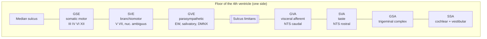
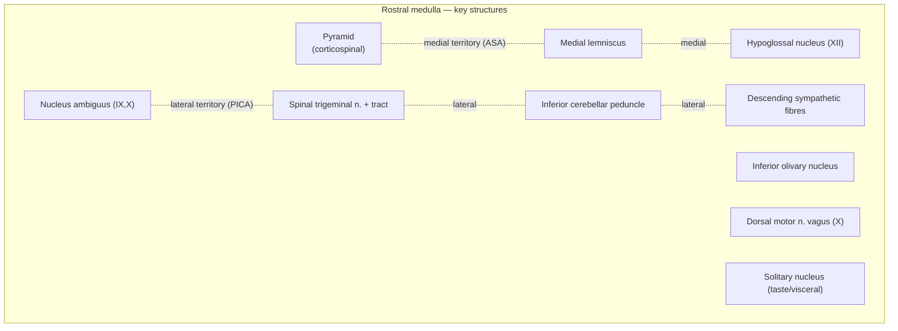
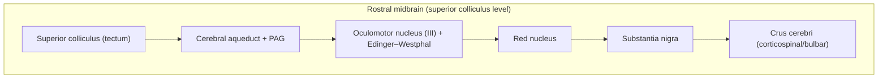
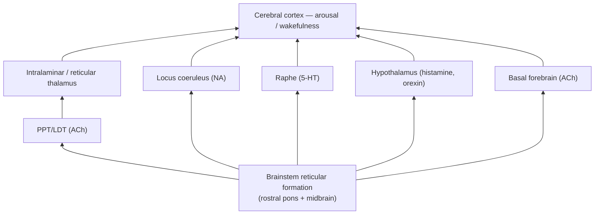

# The Brainstem (Internal Anatomy) and the Reticular Formation

> A clinical-neuroanatomy reference on the internal, cross-sectional organization of the brainstem: the functional cell columns of the cranial nerve nuclei, the level-by-level architecture of the medulla, pons, and midbrain, the long tracts that traverse them, the reticular formation and the ascending reticular activating system, and the classic vascular brainstem syndromes with the anatomy that explains each deficit.

## Introduction

The brainstem is the stalk that connects the forebrain to the spinal cord. In a volume smaller than a thumb it packs the nuclei of ten of the twelve cranial nerves, every ascending and descending long tract that links the cerebrum with the cord, the machinery for eye movement and the vestibulo-ocular reflex, the reticular core that governs arousal and consciousness, and the vital centers for breathing and circulation. Because so much is crowded into so little space, a lesion of even a few millimetres produces a *constellation* of signs rather than a single deficit — and the particular combination is so anatomically specific that a bedside examiner can often localize a stroke to within a millimetre or two before any imaging.

Two organizing principles make the internal anatomy tractable. The first is **developmental**: the sulcus limitans divides the embryonic neural tube into a dorsal (sensory) alar plate and a ventral (motor) basal plate. When the roof plate splays open to form the fourth ventricle, this dorsoventral order is rotated into a **mediolateral** order across the floor — motor nuclei medial, sensory nuclei lateral — and the columns fragment into the seven **functional cell columns** of the cranial nerve nuclei. The second is the **crossed-findings rule**: because the long motor and sensory tracts decussate but the cranial nerves supply structures at their own level, a unilateral brainstem lesion classically produces *ipsilateral cranial nerve signs with contralateral long-tract (body) signs* — the hallmark of an "alternating" or "crossed" brainstem syndrome.

This document builds the picture in layers: a brief external recap, the cell-column scheme, the internal structure of each of the three parts at key transverse levels, the long tracts, the reticular formation and ARAS, and finally the clinical syndromes that tie the anatomy to the patient.

---

## Table of Contents

1. [External Features — A Brief Recap](#1-external-features--a-brief-recap)
2. [The Organizing Principle: Functional Cell Columns of the Cranial Nerve Nuclei](#2-the-organizing-principle-functional-cell-columns-of-the-cranial-nerve-nuclei)
3. [Internal Structure of the Medulla Oblongata](#3-internal-structure-of-the-medulla-oblongata)
4. [Internal Structure of the Pons](#4-internal-structure-of-the-pons)
5. [Internal Structure of the Midbrain](#5-internal-structure-of-the-midbrain)
6. [The Long Tracts Passing Through the Brainstem](#6-the-long-tracts-passing-through-the-brainstem)
7. [The Reticular Formation and the Ascending Reticular Activating System](#7-the-reticular-formation-and-the-ascending-reticular-activating-system)
8. [Clinical Brainstem and Vascular Syndromes](#8-clinical-brainstem-and-vascular-syndromes)
9. [The "Rule of 4" and the Crossed-Findings Principle](#9-the-rule-of-4-and-the-crossed-findings-principle)
10. [Summary](#10-summary)
11. [Sources](#sources)

---

## 1. External Features — A Brief Recap

The brainstem has three parts, from caudal to rostral: the **medulla oblongata**, the **pons**, and the **midbrain (mesencephalon)**. Each connects to the cerebellum by a pair of peduncles (inferior from the medulla, middle from the pons, superior from the midbrain).

### Ventral (anterior) surface

- **Medulla** — Two longitudinal ridges, the **pyramids**, flank the anterior median fissure and carry the corticospinal tracts; at the medulla–cord junction the fibres cross in the visible **decussation of the pyramids (motor decussation)**. Lateral to each pyramid is the oval **olive**, overlying the inferior olivary nucleus. Rootlets of the **hypoglossal nerve (XII)** emerge from the anterolateral (preolivary) sulcus between pyramid and olive; the **glossopharyngeal (IX), vagus (X)** and cranial part of the **accessory (XI)** nerves emerge from the posterolateral (retro-olivary) sulcus behind the olive.
- **Pons** — A broad, transversely ridged convexity (the **basis pontis**) formed by pontine nuclei and transverse fibres funnelling into the middle cerebellar peduncles. The **basilar sulcus** in the midline lodges the basilar artery. The **trigeminal nerve (V)** exits from the lateral pons (a large sensory and small motor root). At the pontomedullary junction, from medial to lateral, emerge the **abducens (VI)**, the **facial (VII)**, and the **vestibulocochlear (VIII)** nerves — the latter two at the cerebellopontine angle.
- **Midbrain** — Two stout columns, the **crura cerebri (cerebral peduncles)**, diverge to enter the cerebrum, separated by the **interpeduncular fossa** (floor perforated by vessels = posterior perforated substance). The **oculomotor nerve (III)** emerges from the medial side of each crus into the fossa.

### Dorsal (posterior) surface and the fourth ventricle

- **Medulla and pons** — Their dorsal surfaces form the floor of the **fourth ventricle**, the diamond-shaped **rhomboid fossa**. In the caudal (closed) medulla the dorsal columns end in the paired **gracile tubercles (clava)** and **cuneate tubercles**, overlying their respective second-order nuclei. Landmarks of the rhomboid floor include the midline **median sulcus**, the paramedian **medial eminence**, the **sulcus limitans** (the persisting embryonic groove separating medial motor from lateral sensory territory), the **facial colliculus** (an elevation over the abducens nucleus and the looping genu of the facial nerve), the **vestibular area** laterally, and, at the caudal apex, the **hypoglossal** and **vagal trigones** overlying those motor nuclei.
- **Midbrain** — The dorsal surface (**tectum**) bears four rounded elevations, the **corpora quadrigemina**: the paired **superior colliculi** (visual reflex, gaze) and **inferior colliculi** (auditory relay). The **trochlear nerve (IV)** is unique — it is the only cranial nerve to emerge from the *dorsal* surface, just below the inferior colliculus, and the only one to decussate before exiting.

---

## 2. The Organizing Principle: Functional Cell Columns of the Cranial Nerve Nuclei

### From plates to columns

In the spinal cord the **alar plate** (dorsal, sensory) and **basal plate** (ventral, motor) are separated by the **sulcus limitans**, and each contains two functional columns (somatic and visceral). In the brainstem the same two plates persist, but two things change:

1. The addition of the **special senses** and of the **branchial (pharyngeal) arch** musculature adds three new functional categories, so the four spinal columns become **seven brainstem columns**.
2. As the central canal opens dorsally into the fourth ventricle, the roof plate splays laterally and the alar plate is rotated **from dorsal to lateral**. The dorsoventral (sensory-over-motor) arrangement of the cord is thereby converted into a **mediolateral** arrangement across the floor: **motor nuclei come to lie medial to the sulcus limitans, sensory nuclei lateral to it.**

### The seven functional columns (medial → lateral)

Working outward from the median sulcus across the floor of the fourth ventricle:

**Motor (efferent), medial to the sulcus limitans**

- **GSE — General Somatic Efferent.** Innervates muscles of somite (myotome) origin — the extraocular muscles and the tongue. Lies closest to the midline. Nuclei: oculomotor (III), trochlear (IV), abducens (VI), hypoglossal (XII).
- **SVE — Special Visceral Efferent (branchiomotor).** Innervates striated muscle derived from the pharyngeal (branchial) arches. Lies just lateral to GSE but migrates ventrally into the tegmentum during development ("branchiomotor migration"). Nuclei: trigeminal motor (V), facial motor (VII), nucleus ambiguus (IX, X, cranial XI).
- **GVE — General Visceral Efferent (parasympathetic preganglionic).** Lies most lateral of the motor columns, adjacent to the sulcus limitans. Nuclei: Edinger–Westphal (III), superior salivatory (VII), inferior salivatory (IX), dorsal motor nucleus of vagus (X).

**Sensory (afferent), lateral to the sulcus limitans**

- **GVA — General Visceral Afferent.** Sensation from viscera (pharynx, larynx, gut, carotid body/sinus). Adjacent to the sulcus limitans. Represented in the caudal (cardiorespiratory) part of the **nucleus of the solitary tract (nucleus tractus solitarius, NTS)**.
- **SVA — Special Visceral Afferent.** Taste (a "visceral" special sense). Represented in the rostral (gustatory) part of the NTS. Fibres from VII, IX, X.
- **GSA — General Somatic Afferent.** Touch, pain, temperature, proprioception from the face and head. The great **trigeminal sensory nuclear complex** (mesencephalic, principal/pontine, and spinal trigeminal nuclei) serves V, with contributions from VII, IX, X for the external ear.
- **SSA — Special Somatic Afferent.** Hearing and equilibrium. The **cochlear** and **vestibular** nuclei of VIII, in the most lateral position (vestibular area / acoustic tubercle).

> Note on convention: some texts collapse SVE into a shared "branchiomotor" column and speak of six columns, and some list the sensory order as GVA–SVA–GSA–SSA lateralward. The functional logic — **motor medial, sensory lateral; somatic nearest the extremes, visceral/special in between** — is the point to retain.

### Table — Cranial Nerve Nuclei by Functional Column

| Functional column | Modality | Nucleus | CN(s) | Brainstem level | Function |
|---|---|---|---|---|---|
| **GSE** | Somatic motor | Oculomotor nucleus | III | Midbrain (sup. colliculus) | Most extraocular muscles; levator palpebrae |
| GSE | Somatic motor | Trochlear nucleus | IV | Midbrain (inf. colliculus) | Superior oblique (crosses; exits dorsally) |
| GSE | Somatic motor | Abducens nucleus | VI | Caudal pons (facial colliculus) | Lateral rectus; horizontal gaze centre |
| GSE | Somatic motor | Hypoglossal nucleus | XII | Medulla (hypoglossal trigone) | Intrinsic + most extrinsic tongue muscles |
| **SVE** | Branchiomotor | Trigeminal motor nucleus | V | Mid-pons | Muscles of mastication, tensor tympani/veli palatini, mylohyoid |
| SVE | Branchiomotor | Facial motor nucleus | VII | Caudal pons | Muscles of facial expression, stapedius |
| SVE | Branchiomotor | Nucleus ambiguus | IX, X, cranial XI | Medulla | Pharyngeal/laryngeal muscles (swallow, phonation) |
| **GVE** | Parasympathetic | Edinger–Westphal nucleus | III | Midbrain | Pupillary sphincter, ciliary muscle (accommodation) |
| GVE | Parasympathetic | Superior salivatory nucleus | VII | Pons | Lacrimal, submandibular, sublingual glands |
| GVE | Parasympathetic | Inferior salivatory nucleus | IX | Medulla | Parotid gland |
| GVE | Parasympathetic | Dorsal motor nucleus of vagus | X | Medulla (vagal trigone) | Thoracic + abdominal viscera |
| **GVA** | Visceral sensation | Nucleus of solitary tract (caudal) | IX, X | Medulla | Carotid sinus/body, pharynx, gut, cardiorespiratory afferents |
| **SVA** | Taste | Nucleus of solitary tract (rostral/gustatory) | VII, IX, X | Medulla | Taste (anterior 2/3, posterior 1/3, epiglottis) |
| **GSA** | Facial somatosensation | Trigeminal sensory complex (mesencephalic / principal / spinal) | V (+ VII, IX, X) | Midbrain → upper cord | Touch, proprioception (mesenceph.); discriminative touch (principal); pain & temperature (spinal) |
| **SSA** | Hearing / balance | Cochlear nuclei | VIII | Pontomedullary junction | Hearing |
| SSA | Hearing / balance | Vestibular nuclei (4) | VIII | Pontomedullary junction | Equilibrium, VOR |

---

## 3. Internal Structure of the Medulla Oblongata

The medulla is described at three transverse levels because its internal pattern reorganizes dramatically over a few millimetres. Its central canal is "closed" caudally and "open" rostrally (roofed by the fourth ventricle).

### 3a. Level of the motor (pyramidal) decussation — caudal, closed medulla

At the junction with the spinal cord the arrangement still resembles the cord, but with one striking feature: **the decussation of the pyramids**. About **75–90% of corticospinal fibres cross the midline here**, sweeping dorsolaterally to become the **lateral corticospinal tract** of the cord; the uncrossed minority continues as the anterior corticospinal tract. Because the crossing fibres physically interrupt the base of the anterior grey column, the ventral horn is disrupted at this level.

Other features: the **gracile and cuneate nuclei** are beginning to appear dorsally (capping their fasciculi); the **spinal nucleus and tract of the trigeminal** occupy the dorsolateral zone (the tract superficial, the nucleus deep to it — this is the substrate for facial pain sensation, carried caudally as low as C2); the central grey surrounds the still-closed central canal.

### 3b. Level of the sensory decussation — mid medulla

Just rostral to the motor decussation the **second great crossing** occurs, this time sensory:

- The **gracile and cuneate nuclei** are now fully formed and receive the first-order fibres of the dorsal columns (fine touch, vibration, conscious proprioception).
- Their second-order axons sweep ventromedially as **internal arcuate fibres**, curving around the central grey, and **cross the midline** as the **sensory (lemniscal) decussation**.
- Having crossed, they turn rostrally and gather into the **medial lemniscus**, a vertically oriented ribbon lying between the two midline raphes, dorsal to the pyramid — the somatotopy is such that lower-limb (gracile) fibres are ventral and upper-limb (cuneate) fibres are dorsal at this level.

This is the anatomical basis of the dorsal-column–medial-lemniscus pathway crossing in the medulla (versus the spinothalamic system, which crossed already in the cord). The spinal trigeminal complex, spinothalamic tract, and the beginnings of the inferior olivary nucleus are also present.

### 3c. Level of the inferior olivary nucleus — rostral, open medulla

This is the classic "medulla cross-section" and the level richest in structures. The fourth ventricle is now open dorsally.

**Ventral (basal) region**
- **Pyramids** — compact corticospinal bundles flanking the anterior median fissure.
- **Inferior olivary nucleus (ION)** — a large, crenated ("crumpled paper bag") sheet of grey matter producing the surface olive. It receives input via the central tegmental tract (from red nucleus, cerebral cortex) and the spino-olivary tract, and projects **olivocerebellar fibres** that cross the midline and enter the cerebellum through the inferior cerebellar peduncle as **climbing fibres** — a key node in motor learning and coordination. Medial and dorsal accessory olivary nuclei accompany it.

**Median region**
- **Medial lemniscus** — the ascending sensory ribbon, dorsal to the pyramid, on either side of the midline raphe.
- **Medial longitudinal fasciculus (MLF)** — paired tracts near the midline just ventral to the ventricular floor, coordinating eye and head movement (see §6).
- **Tectospinal** and other paramedian tracts accompany the MLF.

**Dorsolateral (tegmental) region — the cranial nerve nuclei**
- **Hypoglossal nucleus (XII, GSE)** — paramedian, beneath the hypoglossal trigone; its axons pass ventrally between pyramid and olive to exit in the preolivary sulcus.
- **Dorsal motor nucleus of vagus (X, GVE)** — just lateral to XII, beneath the vagal trigone.
- **Nucleus of the solitary tract (NTS) with the solitary tract (SVA/GVA)** — lateral again, a column of grey with the descending tract at its core; receives taste and visceral afferents.
- **Nucleus ambiguus (SVE)** — deep in the reticular formation, ventrolateral; supplies pharynx and larynx via IX, X, cranial XI. Its deep position explains why it is spared in medial infarcts but struck in lateral (Wallenberg) infarcts.
- **Spinal nucleus and tract of the trigeminal (GSA)** — dorsolateral surface, carrying facial pain and temperature.
- **Vestibular** and **cochlear nuclei (SSA)** — at the lateral angle of the ventricle rostrally.
- **Inferior cerebellar peduncle (restiform body)** — a large fibre mass at the dorsolateral corner conveying spinocerebellar and olivocerebellar input to the cerebellum.
- **Descending sympathetic fibres** (hypothalamospinal tract) run in the lateral tegmentum — their interruption causes the ipsilateral Horner syndrome of Wallenberg.

---

## 4. Internal Structure of the Pons

The pons is sharply divided into a large **ventral (basilar) part** and a smaller **dorsal (tegmental) part**, separated by the transversely running fibres of the trapezoid body.

### 4a. Ventral (basilar) pons

A mixture of descending fibres and grey matter:
- **Pontine nuclei** — scattered masses of neurons that receive **corticopontine** fibres from the entire ipsilateral cerebral cortex.
- **Transverse (pontocerebellar) fibres** — axons of the pontine nuclei that cross the midline and sweep into the contralateral cerebellum via the **middle cerebellar peduncle**, forming the cortico-ponto-cerebellar circuit that lets the cerebellum monitor cortical motor commands.
- **Descending corticospinal and corticobulbar tracts** — broken up into small bundles as they thread between the pontine nuclei and transverse fibres, before regathering into the pyramids caudally.

Because the descending motor tracts lie *ventrally* here and consciousness-supporting tegmentum lies *dorsally*, a bilateral basis pontis infarct produces **locked-in syndrome** (quadriplegia + anarthria with preserved awareness — see §8).

### 4b. Dorsal (tegmental) pons

Continuous with the medullary and midbrain tegmentum, containing the cranial nerve nuclei, long ascending tracts, and reticular formation.

**Caudal pons — the level of the facial colliculus**
- **Abducens nucleus (VI, GSE)** — near the midline, beneath the floor. It functions as the **horizontal-gaze centre**: it contains both motoneurons (to the ipsilateral lateral rectus) and **internuclear neurons** whose axons cross and ascend in the contralateral MLF to the medial-rectus subnucleus of the oculomotor nucleus — yoking the two eyes for conjugate horizontal gaze.
- **Genu (internal knee) of the facial nerve** — axons of the facial motor nucleus loop dorsomedially *around* the abducens nucleus before turning ventrolaterally to exit. This loop plus the abducens nucleus raises the **facial colliculus** on the ventricular floor. A single small lesion here therefore causes both a lateral-rectus/gaze palsy and an ipsilateral lower-motor-neuron facial palsy — **facial colliculus syndrome**.
- **Facial motor nucleus (VII, SVE)** — ventrolateral in the tegmentum.
- **Superior and inferior salivatory nuclei (GVE)** and the caudal **NTS**.
- **Vestibular nuclei (SSA)** at the lateral floor; **cochlear nuclei** straddle the inferior cerebellar peduncle.
- **Trapezoid body** — decussating fibres of the auditory pathway (from ventral cochlear nucleus) running transversely across the tegmentum, marking the boundary between basis and tegmentum. Associated grey matter includes the **superior olivary complex** (medial and lateral superior olives, involved in binaural sound localization) and the nucleus of the trapezoid body. Ascending auditory fibres turn upward as the **lateral lemniscus**.

**Mid–rostral pons — the level of the trigeminal nuclei**
- **Principal (chief/pontine) sensory nucleus of V (GSA)** — discriminative touch from the face.
- **Motor nucleus of V (SVE)** — medial to the principal sensory nucleus; muscles of mastication. The exiting trigeminal fibres separate these two nuclei from the surface.
- The **spinal trigeminal nucleus** continues caudally and the **mesencephalic nucleus of V** (proprioception from muscles of mastication; the only primary sensory neurons inside the CNS) ascends toward the midbrain.
- Long tracts of the tegmentum: the **medial lemniscus** (now flattened and displaced laterally, "tipping over" as it ascends), the **spinal (spinothalamic) lemniscus** lateral to it, the **lateral lemniscus** (auditory) most lateral, and the **MLF** paramedian. The **superior cerebellar peduncle** forms the dorsolateral wall of the upper fourth ventricle and, at the isthmus, decussates.

---

## 5. Internal Structure of the Midbrain

The midbrain is the shortest segment. In cross-section three tiers stack from ventral to dorsal: **crura cerebri → tegmentum → tectum**, with the substantia nigra between crus and tegmentum and the **cerebral aqueduct** (of Sylvius) running through the tegmentum, wrapped in **periaqueductal grey**. Two levels are described.

### 5a. Level of the inferior colliculus (caudal midbrain)

- **Crus cerebri** — the massive ventral fibre columns carrying, from medial to lateral, **frontopontine → corticospinal + corticobulbar (middle 3/5) → temporo-parieto-occipitopontine** fibres. (The clinically vital corticospinal fibres occupy the central portion.)
- **Substantia nigra** — a broad pigmented lamina immediately dorsal to the crus, present throughout the midbrain. Its **pars compacta** contains dopaminergic neurons projecting to the striatum (degeneration → Parkinson disease); its **pars reticulata** is a basal-ganglia output nucleus (GABAergic).
- **Tegmentum** — contains the **decussation of the superior cerebellar peduncles** at this level, the ascending lemnisci (medial, spinal, and — laterally — trigeminal), and the reticular formation.
- **Inferior colliculus** — a large nucleus in the tectum that is the principal midbrain relay of the auditory pathway; it receives the lateral lemniscus and projects via its **brachium** to the medial geniculate body.
- **Trochlear nucleus (IV, GSE)** — indents the ventral periaqueductal grey. Its axons run dorsally and caudally, **cross completely in the superior medullary velum**, and emerge from the dorsal surface below the contralateral inferior colliculus.

### 5b. Level of the superior colliculus (rostral midbrain)

- **Crus cerebri** and **substantia nigra** as above.
- **Red nucleus** — a large, rounded, (in fresh tissue) pinkish mass in the central tegmentum, encircled by the fibres of the superior cerebellar peduncle after they decussate. It has a caudal **magnocellular** part (origin of the modest human **rubrospinal tract**, which crosses in the ventral tegmental decussation) and a rostral **parvocellular** part (relaying cerebellar output to the inferior olive via the central tegmental tract). It is a hub of cerebellar–cortical motor coordination.
- **Oculomotor nucleus (III, GSE)** — a paired complex in the ventral periaqueductal grey; subnuclei innervate the ipsilateral inferior rectus, inferior oblique, medial rectus and the contralateral superior rectus, with a single midline nucleus for both levator palpebrae. Its axons pass ventrally **through the red nucleus and medial substantia nigra** to emerge in the interpeduncular fossa — which is why a paramedian tegmental lesion can combine a III palsy with red-nucleus signs (**Benedikt**) and a more ventral lesion combines III palsy with crus signs (**Weber**).
- **Edinger–Westphal nucleus (GVE)** — the parasympathetic component dorsal to the main III complex; pupillary constriction and accommodation.
- **Periaqueductal grey (PAG)** — the central grey around the aqueduct; a key node in **descending pain modulation** (see §7) and in defensive/autonomic behaviour.
- **Superior colliculus** — a laminated structure in the tectum integrating visual, auditory and somatic input to direct **orienting eye and head movements (saccades, visual tracking, the visual grasp reflex)**; it projects to the cord via the **tectospinal tract** and to the eye-movement centres. Its **brachium** carries retinal and cortical fibres to it and relays to the lateral geniculate/pretectum.
- **Pretectal nuclei** (at the midbrain–diencephalon junction) mediate the **pupillary light reflex**, projecting bilaterally to the Edinger–Westphal nuclei.

---

## 6. The Long Tracts Passing Through the Brainstem

Four tracts must be tracked through all three segments because they define most syndromes.

### Corticospinal and corticobulbar tracts (descending motor)
Originating in the motor cortex, these descend through the **internal capsule → crus cerebri (middle portion) → basis pontis (broken into bundles) → medullary pyramid → pyramidal decussation** (corticospinal) into the lateral corticospinal tract of the cord. **Corticobulbar** fibres peel off at each brainstem level to reach the cranial nerve motor nuclei; most supply their nuclei **bilaterally** (hence upper-motor-neuron lesions spare most cranial muscles) — the important exceptions are the **lower face** (contralateral cortex only → contralateral lower-face weakness in UMN facial palsy) and the **genioglossus** (contralateral). A lesion of the tract *before* its decussation gives **contralateral** limb weakness; this is why brainstem motor deficits are contralateral to the lesion.

### Medial lemniscus (ascending — fine touch, vibration, proprioception)
Fibres arise in the gracile/cuneate nuclei, cross as internal arcuate fibres (**sensory decussation, medulla**), and ascend: paramedian and vertical in the medulla → tilting laterally in the pons → dorsolateral in the midbrain tegmentum → to the **ventral posterolateral (VPL) nucleus of the thalamus**. Because it has already crossed in the medulla, a lesion above the crossing gives **contralateral** loss of vibration/proprioception.

### Spinothalamic tract / spinal lemniscus (ascending — pain, temperature, crude touch)
This system **crossed in the spinal cord** (at each segmental level), then ascends in the lateral funiculus and through the brainstem tegmentum, running laterally, near the spinal trigeminal system, and joining the medial lemniscus rostrally to reach VPL. Its lateral tegmental position makes it vulnerable in **lateral** (Wallenberg-type) lesions, producing **contralateral body** pain/temperature loss, while the adjacent spinal trigeminal system gives **ipsilateral face** loss — the classic *crossed sensory* pattern.

### Medial longitudinal fasciculus (MLF)
A paramedian tract running the length of the brainstem just ventral to the ventricular floor/aqueduct. It **interconnects the vestibular nuclei, the ocular motor nuclei (III, IV, VI), and the cervical cord**, and is the substrate of the **vestibulo-ocular reflex** and of **conjugate horizontal gaze**. Specifically, internuclear neurons of the **abducens nucleus** send axons across the midline and up the contralateral MLF to the **medial-rectus subnucleus of the oculomotor complex**, yoking abduction of one eye to adduction of the other. A lesion of the MLF between the abducens and oculomotor nuclei produces **internuclear ophthalmoplegia (INO)**: on attempted horizontal gaze away from the lesion, the ipsilateral eye **fails to adduct**, while the contralateral abducting eye shows **nystagmus**; convergence (which does not require the MLF) is typically preserved. Bilateral INO is highly suggestive of **multiple sclerosis**; unilateral INO in an older patient suggests a paramedian brainstem lacunar infarct.

---

## 7. The Reticular Formation and the Ascending Reticular Activating System

Beneath and between the discrete nuclei runs the **reticular formation (RF)**, a phylogenetically ancient net of neurons ("reticulum" = little net) extending through the core of the medulla, pons and midbrain. Its neurons have widely branching dendrites and long, richly collateralized axons, letting a single cell influence many targets. Functionally it is organized into **three longitudinal zones**.

### 7a. The three zones (median → lateral)

| Zone | Principal nuclei | Neurons | Chief roles |
|---|---|---|---|
| **Median (raphe)** | Raphe nuclei along the midline | Serotonergic | Mood, sleep–wake modulation, **descending pain control** (raphe magnus), widespread cortical projection |
| **Medial (paramedian)** | Gigantocellular and pontine/caudal reticular nuclei | Large ("effector") cells | Output zone — origin of **reticulospinal tracts**, motor and reflex coordination, ascending arousal projections |
| **Lateral (parvocellular)** | Parvocellular reticular nuclei | Small cells | Association/"input" zone — organizes reflexes; contains **respiratory** and **cardiovascular/vasomotor** premotor circuitry, cranial-nerve reflex coordination |

Interspersed are the classic aminergic/cholinergic cell groups that are functionally reticular even when named separately: the **locus coeruleus** (noradrenaline, dorsal rostral pons), the **pedunculopontine and laterodorsal tegmental nuclei (PPT/LDT)** (acetylcholine), the **ventral tegmental area/substantia nigra** (dopamine), and the raphe (serotonin) — collectively the chemical drivers of arousal.

### 7b. The Ascending Reticular Activating System (ARAS) — arousal and consciousness

The ARAS is the ascending output of the rostral pontine and midbrain reticular formation that maintains **wakefulness, arousal, and cortical readiness**. It sends impulses rostrally by **two routes**:

1. **Dorsal (thalamic) pathway** — cholinergic PPT/LDT input to the **intralaminar and reticular thalamic nuclei**, which in turn project diffusely to the entire cortex, setting cortical excitability and the sleep–wake EEG.
2. **Ventral (extrathalamic) pathway** — monoaminergic and cholinergic projections that bypass the thalamus to reach the **hypothalamus** (and its histaminergic tuberomammillary neurons) and the **basal forebrain** (cholinergic), which then activate cortex directly.

Clinically, the ARAS is the anatomical basis of consciousness as a *level*: a lesion of the **paramedian rostral pontine/midbrain tegmentum or the bilateral thalami** can produce **coma** even when the cortex itself is intact, whereas the ventral pons can be destroyed (locked-in syndrome) with the ARAS, and therefore awareness, entirely spared.

### 7c. Descending modulation of motor function

The medial RF gives rise to two **reticulospinal tracts**:
- **Pontine (medial) reticulospinal tract** — largely uncrossed, *facilitates* extensor/antigravity tone and posture.
- **Medullary (lateral) reticulospinal tract** — *inhibits* the same, under cortical control.
Together they tune muscle tone, posture and locomotion and mediate the postural adjustments that accompany voluntary movement. Loss of cortical drive onto the medullary inhibitory zone contributes to the extensor posturing (**decerebrate rigidity**) seen with upper-brainstem lesions.

### 7d. Autonomic and vital centres

The lateral and medial RF of the medulla and pons house the premotor circuitry for **vital homeostasis**:
- **Respiratory centres** — the **dorsal** and **ventral respiratory groups** of the medulla generate the basic breathing rhythm (the ventrolateral **pre-Bötzinger complex** being the inspiratory pacemaker), tuned by the pontine **pneumotaxic (pontine respiratory group)** and apneustic influences.
- **Cardiovascular / vasomotor centre** — rostral and caudal ventrolateral medulla set sympathetic vascular tone and, with the NTS and dorsal motor nucleus of vagus, mediate the **baroreflex** control of heart rate and blood pressure.
These are the "vital centres" whose failure makes large medullary lesions and tonsillar herniation lethal.

### 7e. Pain modulation — descending analgesia

The RF is central to the **endogenous analgesia** system. The **periaqueductal grey (PAG)** of the midbrain, activated by cortical, hypothalamic and limbic input (and by opioids), excites the serotonergic **nucleus raphe magnus** and the noradrenergic pons; their descending fibres run in the **dorsolateral funiculus** of the cord to the **dorsal horn**, where — together with local enkephalinergic interneurons — they **inhibit the transmission of nociceptive (pain) signals** at the first synapse (a physiological "gate"). This PAG–raphe magnus–dorsal horn axis is the substrate of opioid analgesia and of stimulation-produced analgesia.

---

## 8. Clinical Brainstem and Vascular Syndromes

Brainstem strokes follow the vascular territories: **paramedian (perforating) branches** supply the *medial* structures, and **long circumferential branches** (PICA, AICA, superior cerebellar) supply the *lateral/dorsolateral* tegmentum. This dichotomy generates the classic **medial vs lateral** syndrome pairs, all obeying the crossed-findings rule.

### 8a. Lateral medullary syndrome (Wallenberg / PICA syndrome)

**Vessel:** vertebral artery (in ~80%) or its branch the posterior inferior cerebellar artery (PICA), infarcting the **dorsolateral medulla**.
**Structures and resulting deficits:**
- **Spinal trigeminal nucleus and tract** → *ipsilateral* facial pain/temperature loss.
- **Spinothalamic tract** → *contralateral* body pain/temperature loss (**crossed sensory** pattern).
- **Nucleus ambiguus (IX, X)** → *ipsilateral* dysphagia, hoarseness, absent gag, palatal droop.
- **Vestibular nuclei** → vertigo, nystagmus, nausea/vomiting.
- **Inferior cerebellar peduncle / spinocerebellar fibres** → *ipsilateral* limb ataxia, dysmetria.
- **Descending sympathetic fibres** → *ipsilateral* **Horner syndrome** (ptosis, miosis, anhidrosis).
Notably, the **pyramid and medial lemniscus are spared** (medial territory), so there is **no limb weakness** and vibration/proprioception are preserved — a helpful negative that distinguishes it from the medial syndrome.

### 8b. Medial medullary syndrome (Dejerine / anterior spinal artery syndrome)

**Vessel:** paramedian branches of the **anterior spinal artery** (or vertebral artery), infarcting the **medial medulla**.
**Structures and deficits (the classic triad):**
- **Pyramid (corticospinal tract)** → *contralateral* spastic hemiparesis, **sparing the face**.
- **Medial lemniscus** → *contralateral* loss of vibration and proprioception.
- **Hypoglossal nucleus / nerve (XII)** → *ipsilateral* tongue weakness and wasting; the tongue **deviates toward the lesion** on protrusion.
(Pain/temperature and cerebellar/vestibular function are spared — the mirror image of Wallenberg.)

### 8c. Weber syndrome (superior alternating / medial midbrain)

**Vessel:** paramedian branches of the posterior cerebral / basilar (interpeduncular) arteries, infarcting the **ventral midbrain (crus cerebri)**.
**Structures and deficits:**
- **Oculomotor fascicles (III)** passing through the crus → *ipsilateral* CN III palsy: "down-and-out" eye, ptosis, fixed dilated pupil.
- **Corticospinal fibres in the crus** → *contralateral* hemiparesis (incl. lower face and tongue via corticobulbar fibres).

### 8d. Benedikt syndrome (paramedian midbrain tegmentum)

**Vessel:** paramedian midbrain perforators, lesion in the **tegmentum** (deeper than Weber).
**Structures and deficits:**
- **Oculomotor fascicles (III)** → *ipsilateral* CN III palsy.
- **Red nucleus / superior cerebellar peduncle fibres** → *contralateral* cerebellar ataxia, intention tremor, and choreoathetoid/involuntary movements.
- If the lesion extends ventrally to the medial lemniscus, *contralateral* sensory loss may be added.
(Weber = III + contralateral *pyramidal* signs; Benedikt = III + contralateral *cerebellar/extrapyramidal* signs — the difference is ventral crus versus dorsal tegmentum.)

### 8e. Millard–Gubler syndrome (ventral caudal pons)

**Vessel:** paramedian/short circumferential branches of the basilar artery, lesion in the **ventral caudal pons**.
**Structures and deficits:**
- **Facial nerve fascicles / nucleus (VII)** → *ipsilateral* lower-motor-neuron facial palsy (whole half of the face).
- **Abducens (VI)** (often involved) → *ipsilateral* lateral rectus palsy / convergent squint.
- **Corticospinal fibres** in the basis pontis → *contralateral* hemiparesis (sparing face, since the lesion is below the corticobulbar decussation to VII).

### 8f. Locked-in syndrome (bilateral ventral pons)

**Vessel:** **basilar artery** thrombosis infarcting the **bilateral basis pontis**.
**Structures and deficits:** bilateral destruction of **corticospinal and corticobulbar tracts** → **quadriplegia and anarthria** (loss of speech, horizontal eye movement, facial and bulbar movement). Because the **dorsal tegmentum and ARAS are spared**, the patient is **fully conscious and aware**; because the vertical-gaze/oculomotor centres and their supranuclear pathways above the lesion are spared, the only preserved voluntary movements are **vertical eye movements and blinking**, the sole channel for communication. It is the definitive dissociation of *content* of consciousness (intact) from *motor output* (abolished), and must be distinguished from coma and from the vegetative/unresponsive-wakefulness state.

### 8g. Internuclear ophthalmoplegia (MLF syndrome)

**Vessel/cause:** a paramedian pontine lacunar infarct in the elderly, or a demyelinating plaque in the young (**multiple sclerosis**, classically bilateral).
**Structure and deficit:** a lesion of the **MLF** between the abducens and oculomotor nuclei uncouples the two eyes on horizontal gaze: on gaze *away from* the side of the lesion the **ipsilateral eye fails to adduct** while the **contralateral (abducting) eye shows nystagmus**; **convergence is preserved** (proving the medial rectus itself is intact). The side of the INO is named for the eye that cannot adduct (= side of the lesion).

### Table — Brainstem Vascular Syndromes at a Glance

| Syndrome | Location | Vessel | Ipsilateral signs (CN, level) | Contralateral signs (long tracts, body) |
|---|---|---|---|---|
| **Lateral medullary (Wallenberg)** | Dorsolateral medulla | Vertebral a. / PICA | Facial pain-temp loss (spinal V), Horner, dysphagia/hoarseness (n. ambiguus), ataxia, vertigo | Body pain-temp loss (spinothalamic) |
| **Medial medullary (Dejerine)** | Medial medulla | Anterior spinal a. / vertebral | Tongue palsy, deviates to lesion (XII) | Hemiparesis sparing face (pyramid) + vibration/proprioception loss (medial lemniscus) |
| **Weber** | Ventral midbrain (crus) | PCA/basilar perforators | CN III palsy (down-and-out, dilated pupil) | Hemiparesis incl. lower face & tongue (crus corticospinal/bulbar) |
| **Benedikt** | Midbrain tegmentum | Midbrain perforators | CN III palsy | Cerebellar ataxia + tremor / choreoathetosis (red nucleus, SCP); ± sensory loss |
| **Millard–Gubler** | Ventral caudal pons | Basilar branches | LMN facial palsy (VII) ± lateral rectus palsy (VI) | Hemiparesis sparing face (corticospinal) |
| **Locked-in** | Bilateral ventral pons | Basilar a. | (Bilateral) loss of horizontal gaze, face, bulbar movement | Quadriplegia; consciousness & vertical gaze preserved |
| **Internuclear ophthalmoplegia** | Paramedian pons/midbrain (MLF) | Lacune or MS plaque | Failure of adduction of the eye on the lesion side | Abducting nystagmus of the other eye (convergence spared) |

---

## 9. The "Rule of 4" and the Crossed-Findings Principle

Peter Gates' **"rule of 4"** is a mnemonic scaffold for localizing brainstem strokes at the bedside without memorizing every cross-section.

**Rule 1 — There are 4 midline "M" structures**, all beginning with M, served by paramedian (perforator) arteries:
- **Motor pathway** (corticospinal tract) → contralateral arm/leg weakness.
- **Medial lemniscus** → contralateral loss of vibration/proprioception.
- **Medial longitudinal fasciculus** → ipsilateral INO.
- **Motor nucleus and nerve** (the cranial nerve of that level) → ipsilateral cranial nerve (LMN) signs.

**Rule 2 — There are 4 lateral/side "S" structures**, served by circumferential arteries:
- **Spinocerebellar/cerebellar peduncle** → ipsilateral ataxia.
- **Spinothalamic tract** → contralateral body pain/temperature loss.
- **Sensory nucleus of V** (spinal trigeminal) → ipsilateral facial pain/temperature loss.
- **Sympathetic tract** → ipsilateral Horner syndrome.

**Rule 3 — There are 4 cranial nerves in the medulla (IX, X, XI, XII), 4 in the pons (V, VI, VII, VIII), and 4 above the pons (in/above the midbrain: III, IV — plus the "sensory" special nerves I, II of the forebrain).** Identifying which cranial nerve is affected therefore pins the *level*; identifying whether the deficit is medial (M) or lateral (S) pins the *side of the tegmentum* and hence the vessel.

**Rule 4 — There are 4 motor cranial nerve nuclei in the midline**, and their nerve numbers divide evenly into 12: **III, IV** (midbrain), **VI** (pons), **XII** (medulla) — i.e., the ones whose number divides into 12 lie *medially* (these are the GSE somatic-motor nuclei); the branchiomotor nuclei (V, VII, IX, X) lie *laterally*.

**The crossed-findings principle** unifies all of this. Because the **corticospinal and medial-lemniscus systems decussate below or within the medulla** while a **cranial nerve serves structures at its own level**, a single unilateral brainstem lesion produces **ipsilateral cranial nerve deficits together with contralateral body (limb/trunk) deficits**. When you find an ipsilateral cranial nerve palsy and contralateral hemiparesis or hemisensory loss, the lesion is *in the brainstem*, at the level of the affected cranial nerve, on the side of the cranial nerve palsy. The trigeminal sensory system provides the elegant "crossed" special case: **ipsilateral face, contralateral body** loss of pain and temperature localizes precisely to the lateral medulla (Wallenberg).

---

## 10. Summary

- The brainstem's internal order derives from the embryonic **alar (sensory) and basal (motor) plates**; opening of the fourth ventricle rotates their dorsoventral order into a **mediolateral** one, splitting the cranial nerve nuclei into **seven functional cell columns** — motor medial (GSE, SVE, GVE), sensory lateral (GVA, SVA, GSA, SSA) — arranged around the sulcus limitans.
- The **medulla** is defined by two decussations (motor pyramidal, then sensory lemniscal), the inferior olive, and the caudal cranial nerve nuclei (XII, X, IX, and the spinal trigeminal and vestibular/cochlear nuclei).
- The **pons** splits into a motor **basis** (pontine nuclei, transverse fibres, descending tracts) and a **tegmentum** carrying V–VIII, the facial colliculus (VI + genu of VII), the trapezoid body/auditory relays, and the ascending lemnisci and MLF.
- The **midbrain** stacks crus cerebri, substantia nigra, tegmentum (red nucleus, PAG, III and IV nuclei) and tectum (superior and inferior colliculi) around the aqueduct.
- Four long tracts — **corticospinal/bulbar, medial lemniscus, spinothalamic, and the MLF** — thread through all levels and, through their decussations, generate the **crossed** clinical picture.
- The **reticular formation** (median raphe, medial effector, lateral association zones) drives **arousal via the ARAS**, tunes motor tone via reticulospinal tracts, houses the **respiratory and cardiovascular vital centres**, and mediates **descending pain control** through the PAG–raphe magnus axis.
- The classic **vascular syndromes** (Wallenberg, medial medullary, Weber, Benedikt, Millard–Gubler, locked-in, INO) are direct, predictable read-outs of which medial ("M") or lateral ("S") structures a paramedian or circumferential vessel has infarcted — best remembered through the **rule of 4** and the **ipsilateral-cranial-nerve / contralateral-body** principle.

---

## Sources

- [Cranial nerve nuclei: Anatomy and embryology — Kenhub](https://www.kenhub.com/en/library/anatomy/cranial-nerve-nuclei)
- [Cranial Nerve Nuclei, Functional Columns and Their Development — IIP Series (PDF)](https://iipseries.org/assets/docupload/rsl2024F3D00C319B41CCC.pdf)
- [Formation of the Basal and Alar Plates and Their Derivatives — ISPN Guide](https://ispn.guide/congenital-disorders-of-the-nervous-system-in-children/embryology-of-the-central-nervous-system-in-children-homepage/formation-of-the-basal-and-alar-plates-and-their-derivatives/)
- [Mediolateral organization of brainstem nuclei — Stroke Manual](https://www.stroke-manual.com/mediolateral-organization-of-brainstem-nuclei/)
- [Cross-section of the medulla oblongata: nuclei and tracts — Kenhub](https://www.kenhub.com/en/library/anatomy/medulla-oblongata-tracts-and-nuclei)
- [The Medulla Oblongata — Internal Structure — TeachMeAnatomy](https://teachmeanatomy.info/neuroanatomy/brainstem/medulla-oblongata/)
- [Dorsal column–medial lemniscus pathway — Wikipedia](https://en.wikipedia.org/wiki/Dorsal_column%E2%80%93medial_lemniscus_pathway)
- [Internal arcuate fibers — Wikipedia](https://en.wikipedia.org/wiki/Internal_arcuate_fibers)
- [Pons: Anatomy, nuclei and tracts — Kenhub](https://www.kenhub.com/en/library/anatomy/pons-en)
- [Neuroanatomy, Pons — StatPearls (NCBI Bookshelf)](https://www.ncbi.nlm.nih.gov/books/NBK560589/)
- [Neuroanatomy, Facial Colliculus — StatPearls (NCBI Bookshelf)](https://www.ncbi.nlm.nih.gov/books/NBK555907/)
- [Neuroanatomy, Abducens Nucleus — StatPearls (NCBI Bookshelf)](https://www.ncbi.nlm.nih.gov/books/NBK544265/)
- [Trapezoid body — Wikipedia](https://en.wikipedia.org/wiki/Trapezoid_body)
- [The Midbrain — Colliculi, Peduncles — TeachMeAnatomy](https://teachmeanatomy.info/neuroanatomy/brainstem/midbrain/)
- [Neuroanatomy, Mesencephalon / Midbrain — StatPearls (NCBI Bookshelf)](https://www.ncbi.nlm.nih.gov/books/NBK551509/)
- [Red nucleus: Anatomy and functions — Kenhub](https://www.kenhub.com/en/library/anatomy/red-nucleus)
- [Neuroanatomy, Brainstem — StatPearls (NCBI Bookshelf)](https://www.ncbi.nlm.nih.gov/books/NBK544297/)
- [Neuroanatomy, Reticular Formation — StatPearls (NCBI Bookshelf)](https://www.ncbi.nlm.nih.gov/books/NBK556102/)
- [Reticular formation — Wikipedia](https://en.wikipedia.org/wiki/Reticular_formation)
- [The Ascending Reticular Activating System from Pontine Reticular Formation to the Thalamus — PMC](https://www.ncbi.nlm.nih.gov/pmc/articles/PMC3722571/)
- [Ascending Reticular Activating System — ScienceDirect Topics](https://www.sciencedirect.com/topics/medicine-and-dentistry/ascending-reticular-activating-system)
- [Lateral Medullary Syndrome (Wallenberg Syndrome) — StatPearls (NCBI Bookshelf)](https://www.ncbi.nlm.nih.gov/books/NBK551670/)
- [Medial Medullary Syndrome — StatPearls (NCBI Bookshelf)](https://www.ncbi.nlm.nih.gov/books/NBK560590/)
- [Weber Syndrome — StatPearls (NCBI Bookshelf)](https://www.ncbi.nlm.nih.gov/books/NBK559158/)
- [Millard–Gubler Syndrome — StatPearls (NCBI Bookshelf)](https://www.ncbi.nlm.nih.gov/books/NBK532907/)
- [Locked-in Syndrome — StatPearls (NCBI Bookshelf)](https://www.ncbi.nlm.nih.gov/books/NBK559026/)
- [The rule of 4 of the brainstem (Gates, 2005) — Internal Medicine Journal / Wiley](https://onlinelibrary.wiley.com/doi/full/10.1111/j.1445-5994.2004.00732.x)
- [The rule of 4 of the brainstem — LITFL](https://litfl.com/the-rule-of-4-of-the-brainstem/)
