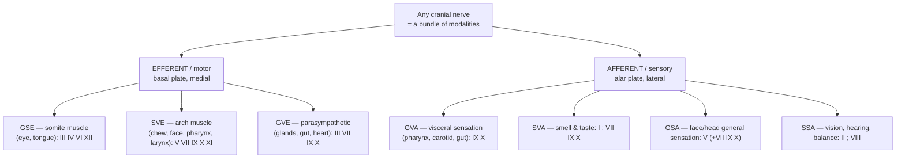
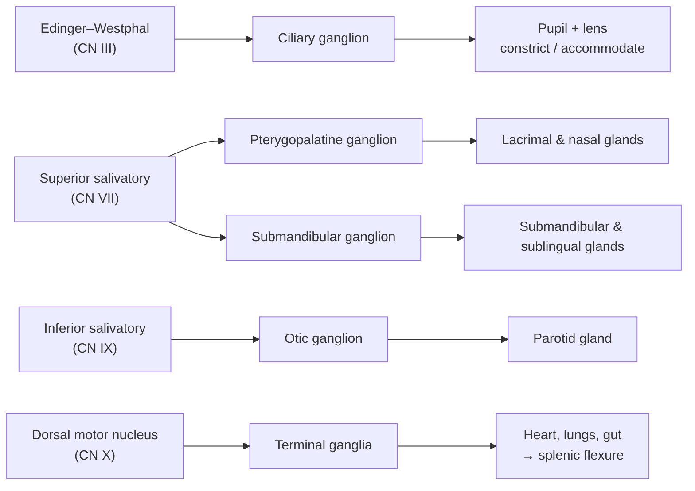

# The Twelve Cranial Nerves

A clinical neuroanatomy reference on the twelve pairs of cranial nerves: the **functional-component scheme** that classifies every fiber they carry, the **columnar organization** of their nuclei in the brainstem, and — for each nerve in turn — its components, nucleus or nuclei, course through the skull, distribution, and the clinical picture produced when it is damaged. The organizing idea is that the cranial nerves are not twelve arbitrary cables but the orderly output and input of a small number of longitudinal functional columns inherited from the segmented embryonic hindbrain, and that almost every "classic" bedside sign follows deductively from knowing which fibers a nerve carries and where they run.

## Introduction

The cranial nerves are the peripheral nerves that emerge directly from the brain and brainstem rather than from the spinal cord. Two of them (I olfactory and II optic) are not true peripheral nerves at all but outgrowths of the forebrain — tracts of the central nervous system wrapped in meninges — while the remaining ten attach to the brainstem and behave like true peripheral nerves with cell bodies in ganglia and motor nuclei. Together they carry the special senses (smell, vision, hearing, balance, taste), the somatic and visceral sensation of the head, the motor control of the eye, face, jaw, palate, pharynx, larynx, tongue, and two large neck muscles, and the cranial (parasympathetic) division of the autonomic outflow to the eye, glands, heart, and gut.

The single most useful conceptual tool for mastering them is the **functional-component scheme**: the recognition that every axon in a cranial nerve belongs to one of seven functional categories (modalities), that each modality has its own dedicated **column** of nuclei running longitudinally through the brainstem, and that a given cranial nerve is simply the bundle of whichever modalities it happens to carry. Once the columns are understood, the location of each nucleus, the grouping of the nerves, and the pattern of deficits after brainstem strokes all become predictable rather than memorized. This document builds that scheme first, presents the master summary table, then works nerve by nerve, and finishes with the key reflex arcs and the rules for distinguishing a lesion inside the brainstem (nuclear) from one along the peripheral nerve.

Cross-references: the gross anatomy of the midbrain, pons, and medulla that houses these nuclei is covered in [The Brainstem](02-anatomy-and-organization.md#5-the-brainstem); the retina-to-cortex visual pathway underlying CN II is detailed in [The Central Visual Pathway](09-sensory-systems.md#25-the-central-visual-pathway); the auditory and vestibular periphery underlying CN VIII is in [Sensory Systems](09-sensory-systems.md); and the corticobulbar/corticospinal control of the motor nuclei is in [Descending Pathways](10-motor-systems.md#4-descending-pathways).

## Table of Contents

- [1. The Functional-Component Scheme: Seven Modalities](#1-the-functional-component-scheme-seven-modalities)
- [2. Cranial Nerve Nuclei as Columns](#2-cranial-nerve-nuclei-as-columns)
- [3. Master Summary Table of the Twelve Nerves](#3-master-summary-table-of-the-twelve-nerves)
- [4. CN I — Olfactory Nerve](#4-cn-i--olfactory-nerve)
- [5. CN II — Optic Nerve](#5-cn-ii--optic-nerve)
- [6. CN III — Oculomotor Nerve](#6-cn-iii--oculomotor-nerve)
- [7. CN IV — Trochlear Nerve](#7-cn-iv--trochlear-nerve)
- [8. CN V — Trigeminal Nerve](#8-cn-v--trigeminal-nerve)
- [9. CN VI — Abducens Nerve](#9-cn-vi--abducens-nerve)
- [10. CN VII — Facial Nerve](#10-cn-vii--facial-nerve)
- [11. CN VIII — Vestibulocochlear Nerve](#11-cn-viii--vestibulocochlear-nerve)
- [12. CN IX — Glossopharyngeal Nerve](#12-cn-ix--glossopharyngeal-nerve)
- [13. CN X — Vagus Nerve](#13-cn-x--vagus-nerve)
- [14. CN XI — Accessory Nerve](#14-cn-xi--accessory-nerve)
- [15. CN XII — Hypoglossal Nerve](#15-cn-xii--hypoglossal-nerve)
- [16. The Cranial Parasympathetic Outflow (III, VII, IX, X)](#16-the-cranial-parasympathetic-outflow-iii-vii-ix-x)
- [17. Key Clinical Reflexes Involving Cranial Nerves](#17-key-clinical-reflexes-involving-cranial-nerves)
- [18. Nuclear/Brainstem vs. Peripheral Nerve Lesions](#18-nuclearbrainstem-vs-peripheral-nerve-lesions)
- [19. Summary](#19-summary)
- [Sources](#sources)

---

## 1. The Functional-Component Scheme: Seven Modalities

Spinal nerves carry only four functional types of fiber: general somatic and general visceral, each in an afferent (sensory) and efferent (motor) version. The head, however, added evolutionary novelties — the special senses and the muscles derived from the **pharyngeal (branchial) arches** — so cranial nerves need **seven** categories. Understanding each is the key to everything that follows.

The three words in each label answer three questions: **general vs. special** (is this a widespread modality also found in spinal nerves, or one unique to the head?), **somatic vs. visceral** (does it relate to the body wall/skeletal structures, or to the gut tube/viscera and their derivatives?), and **afferent vs. efferent** (sensory into the CNS, or motor out of it?).

- **GSE — General Somatic Efferent.** Motor to skeletal muscle derived from **somites** (myotomes), not from pharyngeal arches. In the cranium these are the extraocular muscles and the tongue muscles. Carried by **III, IV, VI, and XII**.
- **GVE — General Visceral Efferent.** Autonomic (here, **parasympathetic**) motor to smooth muscle, cardiac muscle, and glands. These are preganglionic fibers that synapse in a peripheral ganglion. Carried by **III, VII, IX, and X**.
- **SVE — Special Visceral Efferent (branchial motor).** Motor to skeletal muscle derived from the **pharyngeal arches** — the muscles of mastication, facial expression, the palate, pharynx, and larynx, plus sternocleidomastoid and trapezius. "Visceral" only because these muscles arose around the primitive gut tube; the muscle itself is striated and voluntary. Carried by **V, VII, IX, X, and XI**.
- **GVA — General Visceral Afferent.** Sensation from viscera and mucous membranes — the pharynx, larynx, gut, and the walls of the carotid sinus and body. Largely unconscious, feeding reflexes (blood pressure, respiration, the gag). Carried by **IX and X**.
- **SVA — Special Visceral Afferent.** The "chemical" special senses: **smell** and **taste**, treated as visceral because they monitor the environment of the gut tube's entrances. Carried by **I** (smell) and **VII, IX, X** (taste).
- **GSA — General Somatic Afferent.** General sensation — touch, pain, temperature, proprioception — from the skin and deep tissues of the face and scalp, the cornea and eye, and the mucosa of the mouth and much of the head. Carried predominantly by **V**, with small cutaneous contributions from **VII, IX, and X**.
- **SSA — Special Somatic Afferent.** The "physical" special senses arising from ectodermal placodes: **vision, hearing, and balance (equilibrium)**. Carried by **II** (vision) and **VIII** (hearing and balance).

A useful mnemonic distinction: **efferent** columns lie **medial** to the boundary line (sulcus limitans) in the brainstem, **afferent** columns lie **lateral**; and within each, the more "special" or arch-derived components sit toward the middle band. This medial-to-lateral order is not incidental — it is a direct fossil of how the embryonic neural tube folds open at the fourth ventricle, described next.

## 2. Cranial Nerve Nuclei as Columns

In the developing hindbrain the neural tube opens like a book along its dorsal midline, so that the **basal plate** (motor, ventral) and the **alar plate** (sensory, dorsal) come to lie *medial* and *lateral* respectively on the floor of the fourth ventricle, separated by a groove called the **sulcus limitans**. The neuroblasts that form the cranial nerve nuclei sort themselves into discontinuous longitudinal strips — **columns** — one for each functional modality. Although a given column is interrupted into separate nuclei at different rostrocaudal levels, all the nuclei in one column share a single modality. This is the deep reason the seven components exist as a tidy anatomical map. (The gross levels — midbrain, pons, medulla — are laid out in [The Brainstem](02-anatomy-and-organization.md#5-the-brainstem).)

Arranged from the **midline outward**, the motor (basal) columns are:

1. **GSE — somatic efferent column** (most medial): oculomotor nucleus (III), trochlear nucleus (IV), abducens nucleus (VI), hypoglossal nucleus (XII). These lie in a near-continuous paramedian line, which is why their nuclei sit close to the midline at every level.
2. **SVE — branchial (special visceral) efferent column**: trigeminal motor nucleus (V), facial motor nucleus (VII), nucleus ambiguus (IX, X, cranial XI). This column migrates ventrolaterally during development, so its nuclei lie deeper in the tegmentum.
3. **GVE — visceral (parasympathetic) efferent column**: Edinger–Westphal nucleus (III), superior salivatory nucleus (VII), inferior salivatory nucleus (IX), dorsal motor nucleus of the vagus (X).

Crossing the sulcus limitans, the sensory (alar) columns run (from medial to lateral):

4. **GVA + SVA — visceral sensory column**: the **nucleus of the solitary tract (nucleus tractus solitarius, NTS)**. Its rostral part (the "gustatory nucleus") receives **taste (SVA)** from VII, IX, X; its caudal part receives **general visceral afferents (GVA)** — baroreceptor, chemoreceptor, and gut sensation — from IX and X.
5. **GSA — general somatic sensory column**: the **trigeminal sensory nuclear complex** — the mesencephalic nucleus (proprioception), the principal (pontine) sensory nucleus (discriminative touch), and the long spinal trigeminal nucleus (pain and temperature), which receive general sensation from V and, for a small skin territory, from VII, IX, and X.
6. **SSA — special somatic sensory column** (most lateral): the **cochlear nuclei** (hearing) and the **vestibular nuclei** (balance), both served by VIII.

Note that CN I and CN II have **no brainstem nuclei of this columnar type** — they are forebrain tracts (olfactory bulb/cortex; retina→lateral geniculate) and are conventionally added to the SVA and SSA descriptions only by analogy.

## 3. Master Summary Table of the Twelve Nerves

| # | Name | Components | Sensory / Motor / Both | Nucleus / Nuclei | Exit from skull | Main function |
|---|------|-----------|------------------------|------------------|-----------------|---------------|
| I | Olfactory | SVA | Sensory | Olfactory bulb → olfactory cortex (no brainstem nucleus) | Cribriform plate of ethmoid | Smell |
| II | Optic | SSA | Sensory | Retinal ganglion cells → lateral geniculate nucleus (no brainstem nucleus) | Optic canal | Vision |
| III | Oculomotor | GSE, GVE | Motor | Oculomotor nucleus; Edinger–Westphal nucleus (midbrain) | Superior orbital fissure | Moves eye (4 of 6 muscles + levator palpebrae); parasympathetic pupil constriction & accommodation |
| IV | Trochlear | GSE | Motor | Trochlear nucleus (midbrain) | Superior orbital fissure | Superior oblique → depresses & intorts the adducted eye |
| V | Trigeminal | GSA, SVE | Both | Trigeminal sensory complex (mesencephalic, principal, spinal); trigeminal motor nucleus (pons) | V1 superior orbital fissure; V2 foramen rotundum; V3 foramen ovale | Face sensation; muscles of mastication; corneal-reflex afferent |
| VI | Abducens | GSE | Motor | Abducens nucleus (pons) | Superior orbital fissure | Lateral rectus → abducts the eye |
| VII | Facial | SVE, GVE, SVA, GSA | Both | Facial motor nucleus; superior salivatory nucleus; solitary nucleus (rostral); spinal trigeminal (pons) | Internal acoustic meatus → facial canal → **stylomastoid foramen** | Facial expression; taste anterior ⅔ tongue; lacrimal/salivary secretion; stapedius |
| VIII | Vestibulocochlear | SSA | Sensory | Cochlear nuclei; vestibular nuclei (pontomedullary junction) | Internal acoustic meatus (does not exit skull) | Hearing; balance/equilibrium |
| IX | Glossopharyngeal | SVE, GVE, GVA, SVA, GSA | Both | Nucleus ambiguus; inferior salivatory nucleus; solitary nucleus; spinal trigeminal (medulla) | Jugular foramen | Stylopharyngeus; parotid secretion; carotid sinus/body afferents; taste & sensation posterior ⅓ tongue; gag afferent |
| X | Vagus | SVE, GVE, GVA, SVA, GSA | Both | Nucleus ambiguus; dorsal motor nucleus of vagus; solitary nucleus; spinal trigeminal (medulla) | Jugular foramen | Palate/pharynx/larynx muscles; thoraco-abdominal parasympathetics; visceral & taste afferents; gag efferent |
| XI | Accessory | SVE (cranial) / GSE-type (spinal) | Motor | Nucleus ambiguus (cranial root); spinal accessory nucleus C1–C5/6 (spinal root) | **Enters** via foramen magnum, **exits** via jugular foramen | Sternocleidomastoid and trapezius |
| XII | Hypoglossal | GSE | Motor | Hypoglossal nucleus (medulla) | Hypoglossal canal | Intrinsic & extrinsic tongue muscles (except palatoglossus) |

Two mnemonics: for the **names** — *"Oh Oh Oh To Touch And Feel Very Good Velvet, Ah Heaven"* (I–XII); for **motor/sensory/both** — *"Some Say Marry Money But My Brother Says Big Brains Matter More"* (S = sensory, M = motor, B = both, in order I→XII). Note that "cranial nerves with the number 2" — CN II (optic) and CN XII (hypoglossal) — are the only two to leave through a bony **canal** of their own name.

---

## 4. CN I — Olfactory Nerve

**Components:** SVA (special visceral afferent — smell) only.

**Receptor and central connections.** The true olfactory "nerves" are the unmyelinated central processes of **bipolar olfactory receptor neurons** in the olfactory epithelium of the upper nasal cavity. These are among the few neurons that regenerate throughout life. Their axons collect into roughly 15–20 fine bundles (the *fila olfactoria*) that pass up through the **cribriform plate of the ethmoid bone** to synapse in the **olfactory bulb**, in specialized glomeruli, on mitral and tufted cells. The bulb's output travels back along the **olfactory tract** to the primary olfactory (piriform) cortex, amygdala, and entorhinal area. Uniquely among sensory systems, olfaction reaches cortex **without an obligatory thalamic relay** and is strongly linked to memory and emotion via its limbic targets.

**Lesion — anosmia.** Loss of smell is **anosmia** (partial loss, hyposmia). Because taste flavor depends heavily on retronasal smell, anosmic patients characteristically complain that "food is tasteless" although formal taste testing is normal. Causes include the common cold and nasal obstruction (conductive, the commonest), viral damage to the epithelium, and — clinically important — **head trauma shearing the fila olfactoria at the cribriform plate**, and a **subfrontal mass such as an olfactory-groove meningioma**. Because CSF can leak through a fractured cribriform plate, post-traumatic anosmia may accompany CSF rhinorrhoea. Progressive hyposmia is also an early, non-specific feature of Parkinson and Alzheimer disease. Testing is done one nostril at a time with non-irritant odors (coffee, cloves), avoiding ammonia, which stimulates trigeminal (V) nociceptors and can produce a false "smell."

## 5. CN II — Optic Nerve

**Components:** SSA (special somatic afferent — vision) only.

**Nature and course.** The optic nerve is not a peripheral nerve but a **central white-matter tract**: it is an outgrowth of the diencephalon, myelinated by oligodendrocytes, invested by all three meninges, and bathed in CSF within its subarachnoid sheath (which is why raised intracranial pressure produces **papilloedema**). The axons of retinal **ganglion cells** leave the eye, pass through the **optic canal**, and meet at the **optic chiasm**, where the nasal (medial) retinal fibers decussate while temporal fibers remain uncrossed. Beyond the chiasm the fibers become the **optic tract**, most synapsing in the **lateral geniculate nucleus** of the thalamus before the optic radiations carry them to primary visual cortex; a subset diverts to the pretectum (pupillary light reflex) and superior colliculus. The full retina-to-cortex organization is developed in [The Central Visual Pathway](09-sensory-systems.md#25-the-central-visual-pathway).

**Lesion — visual field defects localize the level.** Because of the partial decussation, the *pattern* of field loss pinpoints the lesion:

- **Optic nerve (anterior to chiasm):** monocular visual loss in that eye — a **relative afferent pupillary defect (RAPD)** appears, and if inflammatory (optic neuritis, as in multiple sclerosis) there is painful loss of acuity and colour vision.
- **Optic chiasm (compressed by a pituitary adenoma from below):** the crossing nasal fibers are hit → **bitemporal hemianopia** (loss of both outer half-fields).
- **Optic tract:** **contralateral homonymous hemianopia** (the same-side half-field lost in both eyes).
- **Optic radiations/occipital cortex:** homonymous hemianopia or quadrantanopia, often with **macular sparing** in occipital strokes.

## 6. CN III — Oculomotor Nerve

**Components:** GSE (to extraocular muscles) + GVE (parasympathetic to the pupil and lens).

**Nuclei.** The **oculomotor nucleus** lies in the midbrain at the level of the superior colliculus, ventral to the cerebral aqueduct. Its GSE fibers supply **four of the six extraocular muscles** — superior rectus, medial rectus, inferior rectus, inferior oblique — plus **levator palpebrae superioris** (which raises the eyelid). Dorsal to it sits the **Edinger–Westphal nucleus**, whose GVE preganglionic parasympathetic fibers travel on CN III to the **ciliary ganglion**; postganglionic fibers then supply the **sphincter pupillae** (pupil constriction) and **ciliary muscle** (accommodation for near vision).

**Course.** The nerve emerges from the interpeduncular fossa, passes between the posterior cerebral and superior cerebellar arteries, runs near the **posterior communicating artery**, pierces the dura, travels in the **lateral wall of the cavernous sinus**, and enters the orbit through the **superior orbital fissure**, dividing into a superior division (superior rectus, levator) and an inferior division (the other muscles and the parasympathetic root).

**Lesion — "down and out," ptosis, and the pupil.** A complete third-nerve palsy gives a triad: (1) **ptosis** (drooping lid, from levator palsy); (2) the eye deviated **"down and out"** — abducted by the intact lateral rectus (VI) and depressed/intorted by the intact superior oblique (IV), the only two muscles left working; and (3) a **fixed, dilated ("blown") pupil** with loss of accommodation if the parasympathetic fibers are involved.

The **medical vs. surgical third** distinction turns on the anatomy of those parasympathetic fibers, which run **superficially on the outer surface** of the nerve and derive their blood supply from **pial vessels**, whereas the central GSE fibers depend on the vasa nervorum:

- A **"surgical" third** is caused by **external compression** — most classically a **posterior communicating artery aneurysm**, or uncal herniation. Compression squeezes the superficial pupillary fibers first, so the pupil is **involved (dilated) early**. A painful, pupil-involving third-nerve palsy is a neurosurgical emergency until an aneurysm is excluded.
- A **"medical" third** is caused by **microvascular ischaemia** (diabetes, hypertension), which infarcts the core of the nerve but spares the superficially perfused pupillary fibers → a **pupil-sparing** palsy. These typically recover within about three months.

## 7. CN IV — Trochlear Nerve

**Components:** GSE only. It is the smallest cranial nerve, the **only one to emerge from the dorsal (posterior) surface of the brainstem**, and the only one whose fibers **completely decussate** before exit — so each trochlear nucleus supplies the **contralateral** superior oblique.

**Nucleus and course.** The **trochlear nucleus** lies in the midbrain at the level of the inferior colliculus, just caudal to the oculomotor nucleus. Its axons run dorsally, cross in the superior medullary velum, exit below the inferior colliculus, curve around the midbrain, run in the lateral wall of the cavernous sinus, and pass through the **superior orbital fissure** to reach the **superior oblique** muscle. The tendon of superior oblique hooks through a fibrocartilaginous pulley (the *trochlea*, hence the name) so that the muscle's pull **depresses, intorts, and abducts** the eye — its depressing action is greatest when the eye is **adducted**.

**Lesion — vertical diplopia and the head tilt.** A trochlear palsy causes **vertical (and torsional) diplopia**, worst on looking **down and in** — for example descending stairs or reading, so patients "lose their place" or misjudge steps. The affected eye sits slightly higher (**hypertropia**) and is extorted. The compensatory posture is the classic **contralateral head tilt** (tilting the head *away* from the affected side), which reduces the torsional image mismatch — formalized in the **Parks–Bielschowsky three-step test**. CN IV is especially vulnerable to **head trauma** because of its long, thin, dorsally exposed course around the midbrain.

## 8. CN V — Trigeminal Nerve

**Components:** GSA (all general sensation of the face and much of the head) + SVE (muscles of mastication). It is the **largest** cranial nerve and the great sensory nerve of the face.

**Nuclei.** The **sensory** nuclear complex spans the whole brainstem in three parts: the **mesencephalic nucleus** (midbrain — proprioception from muscles of mastication; uniquely, it contains the primary sensory cell bodies *inside* the CNS), the **principal (pontine) sensory nucleus** (fine/discriminative touch), and the long **spinal trigeminal nucleus** (pain and temperature, descending into the upper cervical cord). The primary sensory cell bodies for touch and pain lie in the **trigeminal (Gasserian/semilunar) ganglion**. The **trigeminal motor nucleus** (SVE, in the pons) supplies the branchial muscles.

**Three divisions.** The nerve leaves the pons, forms the ganglion in Meckel's cave, and splits into three divisions, each with its own foramen:

- **V1 — ophthalmic** (sensory only): forehead, scalp, upper eyelid, **cornea**, dorsum of nose, frontal sinus. Exits via the **superior orbital fissure**.
- **V2 — maxillary** (sensory only): lower eyelid, cheek, upper lip, upper teeth and gums, palate, maxillary sinus. Exits via the **foramen rotundum**.
- **V3 — mandibular** (sensory **and** motor): lower lip, chin, jaw, lower teeth, anterior two-thirds of the tongue (general sensation only — taste is VII), external ear/temple; and **motor to the muscles of mastication** (masseter, temporalis, medial and lateral pterygoids) plus tensor tympani, tensor veli palatini, mylohyoid, and anterior digastric. Exits via the **foramen ovale**.

**Function highlights.** V provides the **afferent limb of the corneal (blink) reflex** and of the **jaw-jerk reflex**, and general sensation for the whole face. A helpful boundary: the **angle of the jaw** is supplied by C2/C3, *not* by V — so numbness sparing the jaw angle suggests a trigeminal, rather than dermatomal, lesion.

**Lesions.**

- **Sensory loss / weak jaw:** a complete V lesion gives hemifacial sensory loss, an **absent corneal reflex** (afferent limb), and, if motor fibers are involved, wasting of masseter/temporalis with the jaw **deviating toward the weak side** on opening (unopposed contralateral pterygoid).
- **Trigeminal neuralgia (tic douloureux):** paroxysms of severe, brief, **electric-shock-like or stabbing** unilateral facial pain, usually in V2/V3, triggered by light, non-noxious stimuli (chewing, talking, a breeze, brushing teeth). The commonest cause is **neurovascular compression** of the root entry zone — most often by the **superior cerebellar artery** — causing focal demyelination and ectopic/ephaptic firing. First-line treatment is **carbamazepine** (or oxcarbazepine); refractory cases may need microvascular decompression. New-onset trigeminal neuralgia in a young patient should prompt investigation for **multiple sclerosis**.

## 9. CN VI — Abducens Nerve

**Components:** GSE only.

**Nucleus and course.** The **abducens nucleus** lies in the **pons**, beneath the floor of the fourth ventricle, where the looping fibers of the facial nerve arch over it (the *facial colliculus*). The nucleus is functionally central to horizontal gaze: it contains both the motor neurons for lateral rectus **and** interneurons that project via the **medial longitudinal fasciculus (MLF)** to the contralateral oculomotor nucleus, yoking the two eyes so they move together horizontally. The nerve then takes an **exceptionally long intracranial course** (second only to the trochlear): it exits at the pontomedullary junction, ascends the clivus, bends sharply over the petrous temporal ridge (through Dorello's canal), traverses the cavernous sinus (running *through* it, next to the internal carotid artery — the only nerve to do so), and enters the orbit via the **superior orbital fissure** to supply the **lateral rectus** (which abducts the eye).

**Lesion — horizontal diplopia and false localization.** A sixth-nerve palsy produces a **medially deviated (adducted) eye** that cannot abduct, with **horizontal diplopia worst on looking toward the affected side**. Because of its long vertical course over the petrous ridge, CN VI is the classic **"false localizing sign"** of **raised intracranial pressure** — it is stretched non-specifically and may be palsied without indicating a lesion at that site. It is distinguished from an intra-axial (nuclear/pontine) problem: damage to the *abducens nucleus* impairs the whole conjugate gaze to that side (a **horizontal gaze palsy**), not just abduction of one eye, because it also takes out the interneurons driving the opposite medial rectus.

## 10. CN VII — Facial Nerve

**Components:** four modalities — **SVE** (muscles of facial expression), **GVE** (parasympathetic to lacrimal, submandibular, and sublingual glands), **SVA** (taste, anterior two-thirds of the tongue), and **GSA** (a small patch of skin around the external ear).

**Nuclei.** The **facial motor nucleus** (SVE, pons) supplies the muscles of facial expression, plus stapedius, stylohyoid, and posterior digastric. The **superior salivatory nucleus** (GVE) sends preganglionic parasympathetics via two routes: through the **greater petrosal nerve** to the **pterygopalatine ganglion** (→ lacrimal gland and nasal/palatine glands) and through the **chorda tympani** to the **submandibular ganglion** (→ submandibular and sublingual salivary glands). Taste (SVA) from the anterior two-thirds of the tongue travels on the **chorda tympani** to the rostral (gustatory) **solitary nucleus**.

**Course.** CN VII leaves the pons at the cerebellopontine angle (alongside VIII), enters the **internal acoustic meatus**, runs through the **facial canal** of the petrous temporal bone (where it forms the *geniculate ganglion*, gives off the greater petrosal nerve and the nerve to stapedius, and is joined by the chorda tympani), and finally emerges from the skull at the **stylomastoid foramen**. It then passes through the **parotid gland** (without innervating it) and splits into its five terminal branches to the face (temporal, zygomatic, buccal, marginal mandibular, cervical).

**Lesion — the crucial upper-motor-neuron vs. lower-motor-neuron distinction.** This is the highest-yield concept in cranial-nerve clinical anatomy. The facial motor nucleus has two functional halves: the part driving the **upper face** (frontalis, orbicularis oculi) receives corticobulbar input from **both hemispheres (bilateral)**, whereas the part driving the **lower face** receives input essentially only from the **opposite (contralateral)** hemisphere.

- **Lower motor neuron (LMN) lesion — Bell's palsy** (or any lesion of the nucleus or the peripheral nerve): paralysis of **all** ipsilateral facial muscles, including the forehead. The patient **cannot wrinkle the forehead or close the eye** on that side, the nasolabial fold flattens, and the corner of the mouth droops. Bell's palsy is an acute, idiopathic (often post-viral, HSV-linked) LMN facial palsy; depending on where along the canal the lesion sits, it may add **hyperacusis** (stapedius), **loss of taste**, and **reduced lacrimation/salivation**.
- **Upper motor neuron (UMN) lesion — e.g., a contralateral stroke:** paralysis of the **lower face only**, with the **forehead spared**, because the forehead's bilateral cortical supply lets the intact opposite hemisphere still drive it. So a stroke patient's mouth droops but they *can* still wrinkle the forehead and close the eye.

**Forehead sparing therefore separates a central (UMN) from a peripheral (LMN) facial palsy** — a distinction that changes the entire diagnostic pathway (stroke work-up vs. Bell's palsy management).

## 11. CN VIII — Vestibulocochlear Nerve

**Components:** SSA only, in two functional divisions — **cochlear** (hearing) and **vestibular** (balance/equilibrium).

**Receptors and nuclei.** Both divisions arise from hair cells in the inner ear. The **cochlear** division carries frequency-coded auditory information from the **spiral (cochlear) ganglion** in the cochlea to the **cochlear nuclei** at the pontomedullary junction; the central auditory pathway then ascends (largely bilaterally) via the superior olive, lateral lemniscus, inferior colliculus, and medial geniculate body to auditory cortex. The **vestibular** division carries head-position and acceleration signals from the semicircular canals and otolith organs, via the **vestibular (Scarpa's) ganglion**, to the four **vestibular nuclei**, which project to the oculomotor nuclei (via the MLF, for the vestibulo-ocular reflex), the spinal cord (posture), and the cerebellum. The nerve travels with VII through the **internal acoustic meatus** and does not exit the skull.

**Lesion — and the conductive vs. sensorineural distinction.** Damage to CN VIII or the cochlea causes **sensorineural hearing loss** and, if the vestibular division is involved, **vertigo, nystagmus, and imbalance**. A slow-growing **vestibular schwannoma (acoustic neuroma)** at the cerebellopontine angle is the classic cause, producing progressive unilateral hearing loss and tinnitus, later compressing V and VII.

Two bedside tuning-fork tests separate the two great categories of hearing loss:

- **Sensorineural loss** (cochlea or nerve): air conduction still better than bone conduction (**Rinne positive**, the normal pattern), and in the **Weber test** the sound **lateralizes to the *normal* ear**.
- **Conductive loss** (outer/middle ear — wax, effusion, otosclerosis): bone conduction is better than or equal to air (**Rinne negative/abnormal**), and Weber **lateralizes to the *affected* ear** (the blocked ear "hears" bone conduction better because it is shielded from masking ambient noise).

## 12. CN IX — Glossopharyngeal Nerve

**Components:** a true mixed nerve carrying five modalities — **SVE** (one muscle: stylopharyngeus), **GVE** (parasympathetic to the parotid gland), **GVA** (carotid sinus and body; pharyngeal and middle-ear mucosa), **SVA** (taste, posterior one-third of the tongue), and **GSA** (general sensation, posterior third of the tongue, oropharynx, and part of the external ear).

**Nuclei and course.** Its **SVE** fibers arise from the rostral **nucleus ambiguus** (→ stylopharyngeus, which elevates the pharynx). Its **GVE** preganglionic fibers arise from the **inferior salivatory nucleus** and reach the **otic ganglion** (via the lesser petrosal nerve) to supply the **parotid gland** for salivation. All its afferents (taste, general, and visceral) end in the **solitary nucleus** (taste/visceral) or the **spinal trigeminal nucleus** (general sensation). The nerve leaves the medulla, exits the skull through the **jugular foramen** (with X and XI), and descends to the tongue, pharynx, and carotid bifurcation.

**Key roles.** IX provides the **afferent limb of the gag reflex** and the sensory arm of the **carotid sinus reflex** (baroreceptor blood-pressure regulation) and **carotid body** chemoreception (oxygen/CO₂). It handles taste and touch of the posterior tongue.

**Lesion.** Isolated IX palsy is rare (it usually accompanies X and XI in jugular-foramen syndromes). It causes **loss of taste and sensation over the posterior third of the tongue**, an **absent gag reflex** (loss of the afferent limb), and possible loss of the carotid-sinus reflex. **Glossopharyngeal neuralgia** — a rarer analogue of trigeminal neuralgia — produces lancinating pain in the throat, tonsil, and ear triggered by swallowing.

## 13. CN X — Vagus Nerve

**Components:** the most extensively distributed cranial nerve, carrying **SVE** (muscles of the palate, pharynx, and larynx), **GVE** (parasympathetic to the thoracic and abdominal viscera as far as the splenic flexure), **GVA** (visceral sensation from pharynx, larynx, and thoraco-abdominal organs, including aortic baro-/chemoreceptors), **SVA** (taste from the epiglottis), and **GSA** (skin of the external ear/auditory canal — the reason ear stimulation can trigger a cough).

**Nuclei.** SVE fibers arise from the **nucleus ambiguus** (→ pharyngeal constrictors, palatal muscles, and — via the laryngeal branches — all intrinsic muscles of the larynx). GVE preganglionic parasympathetics arise from the **dorsal motor nucleus of the vagus** (→ heart, bronchi, gut). Afferents end in the **solitary nucleus** (visceral, taste) and **spinal trigeminal nucleus** (ear sensation).

**Course.** The vagus exits via the **jugular foramen**, descends within the **carotid sheath** into the thorax and abdomen, and gives off — critically — the **superior laryngeal nerve** (its external branch supplies the cricothyroid; internal branch is sensory above the vocal cords) and the **recurrent laryngeal nerve** (supplies all other intrinsic laryngeal muscles). The recurrent laryngeal nerve's asymmetric loop is a favorite exam point: the **left** nerve loops **under the arch of the aorta** (behind the ligamentum arteriosum), the **right** loops **under the right subclavian artery**. The left's much longer thoracic course makes it far more vulnerable.

**Function.** X mediates **phonation, swallowing, and the elevation of the palate**, provides the **efferent limb of the gag reflex** and of the cough reflex, and carries the parasympathetic slowing of the heart and stimulation of gut motility and secretion.

**Lesion.**

- **Central/proximal vagus:** **dysphagia**, nasal regurgitation, a **"nasal" voice**, and on saying "aah" the **palate/uvula deviates *away* from the lesioned side** (the intact side pulls up more strongly). The **gag reflex is lost on the affected side** (efferent limb).
- **Recurrent laryngeal nerve injury:** **hoarseness** and a **breathy voice** from ipsilateral **vocal-cord paralysis** (the cord sits in the paramedian position). This is a well-known complication of **thyroid/parathyroid surgery** and of mediastinal disease; because of its intrathoracic loop, the **left** recurrent laryngeal nerve can be compressed by an aortic aneurysm, an enlarged left atrium, or lung cancer (**Ortner's syndrome**), producing hoarseness as a presenting sign of chest pathology.

## 14. CN XI — Accessory Nerve

**Components:** motor only. Classically described in two roots — a small **cranial root** (SVE, from the nucleus ambiguus) that quickly joins the vagus and is effectively part of CN X, and the functionally important **spinal root** that supplies two large neck muscles. (Modern anatomists increasingly regard the "accessory nerve" proper as the spinal component alone.)

**Nucleus and course — a nerve that goes up before it goes out.** The **spinal accessory nucleus** is a column of motor neurons in the **anterior (ventral) horn of the upper cervical cord, roughly C1–C5/6**. Its rootlets emerge from the *lateral* cord, coalesce, and **ascend through the foramen magnum into the cranium**, then turn and **exit again through the jugular foramen** — the only nerve to enter and then leave the skull. It descends through the neck to supply the **sternocleidomastoid (SCM)** and the **trapezius**.

**Function and lesion.** SCM **turns the head to the *opposite* side** (and, acting together, flexes the neck); trapezius **elevates and stabilizes the scapula/shoulder**. A lesion (commonly iatrogenic — **posterior-triangle lymph-node biopsy or surgery**, where the nerve runs superficially and unprotected) causes **weakness turning the head away from the lesion, drooping of the shoulder, and winging of the scapula**, often with a dull ache. Because SCM rotates the head contralaterally, an SCM weakness impairs turning toward the *opposite* side, while trapezius weakness produces an ipsilateral shoulder droop — a useful pair of signs for localizing the level.

## 15. CN XII — Hypoglossal Nerve

**Components:** GSE only — the somatic motor nerve of the tongue.

**Nucleus and course.** The **hypoglossal nucleus** is a paramedian GSE column in the **medulla**, near the midline beneath the floor of the fourth ventricle (raising the *hypoglossal trigone*). Its axons pass ventrally between the pyramid and the olive, exit the skull through the **hypoglossal canal**, and supply all the **intrinsic** tongue muscles and the **extrinsic** muscles genioglossus, hyoglossus, and styloglossus. (Palatoglossus is the exception — it is a palatal muscle supplied by the vagus.)

**Lesion — "the tongue points at the lesion," and why.** The key muscle is **genioglossus**, which **protrudes** the tongue: each genioglossus pushes the tongue forward and toward the **opposite** side. With both working, their forces balance and the protruded tongue stays midline. If one hypoglossal nerve is damaged, that genioglossus is paralysed, so the intact contralateral genioglossus pushes unopposed — and its push is toward the weak side. The result: on protrusion, **the tongue deviates *toward* the side of the lesion**. An LMN (nuclear or nerve) lesion also shows ipsilateral **atrophy, wrinkling, and fasciculations** of that half of the tongue. By contrast, a **UMN** lesion (supranuclear, e.g., a stroke) deviates the tongue **away** from the lesion (toward the weak side, contralateral to the stroke) with **no** wasting or fasciculation — the mirror-image rule that helps localize.

## 16. The Cranial Parasympathetic Outflow (III, VII, IX, X)

Four cranial nerves carry the **GVE (parasympathetic)** outflow of the head and body. In every case a preganglionic fiber leaves a brainstem nucleus, synapses in a peripheral ganglion, and a postganglionic fiber reaches the target. The four **cranial parasympathetic ganglia** (ciliary, pterygopalatine, submandibular, otic) each belong to one nerve; a common exam trap is that other nerves' fibers may *pass through* these ganglia without synapsing (e.g., sympathetic and sensory fibers hitchhiking through the otic or ciliary ganglion).

| Nerve | Brainstem nucleus | Ganglion | Target |
|-------|-------------------|----------|--------|
| III | Edinger–Westphal | Ciliary | Sphincter pupillae (pupil constriction), ciliary muscle (accommodation) |
| VII | Superior salivatory | Pterygopalatine | Lacrimal gland; nasal & palatine mucous glands |
| VII | Superior salivatory | Submandibular | Submandibular & sublingual salivary glands |
| IX | Inferior salivatory | Otic | Parotid gland |
| X | Dorsal motor nucleus of vagus | Terminal ganglia in/near viscera | Heart (slowing), bronchi, GI tract to splenic flexure (motility, secretion) |

The vagus dominates numerically — it carries roughly three-quarters of all parasympathetic outflow — which is why "vagal tone" is shorthand for the parasympathetic brake on the heart and gut. (This complements the sympathetic outflow described under the [stress response](06-stress-and-fight-or-flight.md).)

## 17. Key Clinical Reflexes Involving Cranial Nerves

Reflex testing is powerful because a reflex has a defined **afferent limb**, a **central connection**, and an **efferent limb** — so the pattern of a lost reflex tells you *which* limb (and thus which nerve or brainstem level) is damaged.

| Reflex | Afferent (sensory) limb | Center | Efferent (motor) limb | What it tests |
|--------|-------------------------|--------|------------------------|----------------|
| **Pupillary light** | **CN II** (optic) → pretectum | Midbrain (pretectal nuclei → both Edinger–Westphal nuclei) | **CN III** (parasympathetic → sphincter pupillae), bilaterally | Optic nerve, midbrain, oculomotor parasympathetics |
| **Corneal (blink)** | **CN V1** (ophthalmic) | Pons (spinal trigeminal nucleus → both facial nuclei) | **CN VII** → orbicularis oculi, **both eyes** | V afferent and VII efferent; pontine integrity |
| **Jaw jerk (masseter)** | **CN V3** (spindle afferents; mesencephalic nucleus) | Pons (trigeminal motor nucleus) | **CN V3** → masseter/temporalis | A *monosynaptic* stretch reflex; brisk = UMN lesion above the pons |
| **Gag (pharyngeal)** | **CN IX** (oropharyngeal mucosa) | Medulla (solitary + spinal trigeminal → nucleus ambiguus) | **CN X** → pharyngeal constrictors | IX afferent, X efferent; medullary/bulbar function |
| **Vestibulo-ocular (VOR)** | **CN VIII** (vestibular, from semicircular canals) | Vestibular nuclei → MLF → ocular motor nuclei | **CN III, IV, VI** → extraocular muscles | Brainstem integrity; "doll's-eye"/caloric testing in coma |

Two clinical uses stand out. First, the **pupillary light reflex is consensual**: light in one eye constricts *both* pupils (because the pretectum projects to both Edinger–Westphal nuclei). Comparing the direct and consensual responses, and swinging a light between the eyes (the swinging-flashlight test for a **relative afferent pupillary defect**), separates an afferent (II) from an efferent (III) problem. Second, the **VOR** is the cornerstone of coma examination: in an unconscious patient with an intact brainstem, turning the head makes the eyes move oppositely ("doll's eyes"); absence of this response, or of caloric responses, signals brainstem failure. The corneal and jaw-jerk reflexes together **localize within CN V** — an absent corneal reflex with a preserved jaw jerk points to the sensory division, and a brisk jaw jerk points *above* the pons.

## 18. Nuclear/Brainstem vs. Peripheral Nerve Lesions

A recurring clinical question is whether a cranial-nerve deficit arises **inside the brainstem** (nuclear or fascicular, "central") or along the **peripheral nerve** ("infranuclear"). Several rules follow directly from the anatomy above.

- **Crossed (alternating) signs localize to the brainstem.** Because long motor and sensory tracts run through the brainstem alongside the cranial-nerve nuclei, a brainstem lesion classically produces an **ipsilateral cranial-nerve palsy plus contralateral limb signs** — the "crossed" syndromes. Examples: **Weber syndrome** (midbrain: ipsilateral CN III palsy + contralateral hemiparesis from the cerebral peduncle); **Millard–Gubler syndrome** (pons: ipsilateral VI and VII palsies + contralateral hemiparesis); **Wallenberg / lateral medullary syndrome** (ipsilateral IX/X signs, facial pain/loss from the spinal trigeminal nucleus + contralateral body pain/temperature loss). A peripheral nerve lesion cannot produce contralateral limb signs.

- **Company kept.** Peripheral nerves travel with named neighbors through shared foramina, so their lesions cluster in **anatomically predictable groups**: **cavernous sinus / superior orbital fissure** (III, IV, V1, VI together, with the pupil); **cerebellopontine angle** (VII and VIII, then V); **jugular foramen** (IX, X, XI — *Vernet syndrome*). A nucleus, by contrast, keeps company with whatever *tracts and other nuclei* lie next to it in the tegmentum — a different signature.

- **Nucleus vs. nerve for a single function.** Damage to a *nucleus* often affects functions that the peripheral nerve later separates, and vice versa. The cleanest example is horizontal gaze: an **abducens nucleus** lesion causes an ipsilateral **conjugate gaze palsy** (both eyes fail to look toward the side), because the nucleus contains interneurons for the opposite medial rectus, whereas an **abducens nerve** lesion causes isolated **failure of abduction of one eye**. Likewise a facial *nucleus/nerve* (LMN) lesion takes the whole hemiface including the forehead, whereas the *supranuclear* (UMN) corticobulbar lesion spares the forehead.

- **UMN vs. LMN quality.** LMN (nuclear or peripheral) lesions bring **flaccid weakness, wasting, and fasciculations** (seen in the tongue for XII, in facial muscles for VII); UMN lesions bring weakness **without wasting**, and the characteristic laterality reversals (tongue and uvula deviate to the opposite pattern; forehead spared for the face).

- **Bilateral corticobulbar disease — pseudobulbar palsy.** Because most motor cranial nuclei have some bilateral cortical input, a *unilateral* hemispheric lesion causes surprisingly little bulbar deficit. **Bilateral** UMN lesions, however, produce **pseudobulbar palsy** — dysarthria, dysphagia, a brisk jaw jerk, and emotional lability — which contrasts with **bulbar palsy** (LMN disease of the medullary nuclei themselves, with wasting, fasciculation, and an absent jaw jerk). Distinguishing them is a classic application of the UMN/LMN rules to the cranial nerves.

## 19. Summary

The twelve cranial nerves become tractable once they are read through the **functional-component scheme**. Every fiber belongs to one of seven modalities — **GSE, GVE, SVE, GVA, SVA, GSA, SSA** — and each modality has a dedicated **column** of nuclei arranged in a fixed medial-to-lateral order across the floor of the fourth ventricle, a fossil of the embryonic basal/alar division. From that scaffold the rest follows: which nucleus a nerve uses, which foramen it takes, what it supplies, and what its lesion looks like.

The high-yield clinical anchors recur throughout: the **medical (pupil-sparing, ischaemic) versus surgical (pupil-involving, compressive) third nerve**, resting on the superficial course of its parasympathetic fibers; the **"down-and-out" eye**, the **trochlear head-tilt**, and the **abducens false-localizing palsy** of the ocular motor nerves; the **forehead-sparing rule** that separates a central (UMN) from a peripheral (Bell's, LMN) facial palsy through bilateral cortical innervation of the upper face; the **trigeminal divisions**, corneal reflex, and neuralgia; the **sensorineural-versus-conductive** logic of the Weber and Rinne tests; the **gag reflex** split between IX (afferent) and X (efferent); the **recurrent laryngeal nerve** and hoarseness; and the two mirror-image deviation rules — the **uvula pulled away** from a vagal lesion and the **tongue pointed toward** a hypoglossal lesion. Finally, **crossed brainstem syndromes**, **foramen-based nerve groupings**, and the **UMN/LMN quality of weakness** provide the localizing framework that separates a lesion of the nucleus deep in the brainstem from one of the peripheral nerve — the practical payoff of the whole columnar scheme.

## Sources

- [Neuroanatomy, Cranial Nerve — StatPearls, NCBI Bookshelf](https://www.ncbi.nlm.nih.gov/books/NBK470353/)
- [Cranial nerves: Anatomy, names, functions and mnemonics — Kenhub](https://www.kenhub.com/en/library/anatomy/the-12-cranial-nerves)
- [Cranial nerve nuclei: Anatomy and embryology — Kenhub](https://www.kenhub.com/en/library/anatomy/cranial-nerve-nuclei)
- [Cranial Nerves Anatomy: Origin, Course & Functions — TeachMeAnatomy](https://teachmeanatomy.info/head/cranial-nerves/summary/)
- [Cranial nerve nuclei, functional columns/components, and their development (PDF)](https://iipseries.org/assets/docupload/rsl2024F3D00C319B41CCC.pdf)
- [Cranial nerves: functional classification of their nuclei and fibres — Semmelweis University (PDF)](https://semmelweis.hu/anatomia/files/2018/10/ak-sgy-cn.pdf)
- [A Synopsis of Cranial Nerves of the Brainstem — Neupsy Key](https://neupsykey.com/a-synopsis-of-cranial-nerves-of-the-brainstem/)
- [Cranial Nerve III Palsy (Oculomotor Palsy) — StatPearls, NCBI Bookshelf](https://www.ncbi.nlm.nih.gov/books/NBK526112/)
- [Pupil-Involved vs. Pupil-Sparing Acquired Oculomotor Nerve Palsy — OptoPrep](https://blog.optoprep.com/pupil-involved-vs.-pupil-sparing-acquired-oculomotor-nerve-palsy)
- [Diagnostic Considerations in an Acquired, Isolated Third Nerve Palsy — American Academy of Ophthalmology](https://www.aao.org/eyenet/article/acquired-isolated-third-nerve-palsy)
- [Trigeminal Neuralgia — StatPearls, NCBI Bookshelf](https://www.ncbi.nlm.nih.gov/books/NBK554486/)
- [Neuroanatomy, Trigeminal Reflexes — StatPearls, NCBI Bookshelf](https://www.ncbi.nlm.nih.gov/books/NBK551641/)
- [Cranial Nerve V: The Trigeminal Nerve — Clinical Methods, NCBI Bookshelf](https://www.ncbi.nlm.nih.gov/books/NBK384/)
- [Bell Palsy — StatPearls, NCBI Bookshelf](https://www.ncbi.nlm.nih.gov/books/NBK482290/)
- [Facial Nerve Palsy — StatPearls, NCBI Bookshelf](https://www.ncbi.nlm.nih.gov/books/NBK549815/)
- [The Facial Nerve (CN VII) — TeachMeAnatomy](https://teachmeanatomy.info/head/cranial-nerves/facial-nerve/)
- [Cranial Nerves IX and X: The Glossopharyngeal and Vagus Nerves — Clinical Methods, NCBI Bookshelf](https://www.ncbi.nlm.nih.gov/books/NBK386/)
- [The Glossopharyngeal Nerve (CN IX) — TeachMeAnatomy](https://teachmeanatomy.info/head/cranial-nerves/glossopharyngeal-nerve/)
- [Recurrent Laryngeal Nerve Injury — StatPearls, NCBI Bookshelf](https://www.ncbi.nlm.nih.gov/books/NBK560832/)
- [Recurrent laryngeal nerve — Wikipedia](https://en.wikipedia.org/wiki/Recurrent_laryngeal_nerve)
- [Physiology, Gag Reflex — StatPearls, NCBI Bookshelf](https://www.ncbi.nlm.nih.gov/books/NBK554502/)
- [Neuroanatomy, Cranial Nerve 12 (Hypoglossal) — StatPearls, NCBI Bookshelf](https://www.ncbi.nlm.nih.gov/books/NBK532869/)
- [Hypoglossal nerve — Wikipedia](https://en.wikipedia.org/wiki/Hypoglossal_nerve)
- [Parasympathetic Innervation to the Head and Neck — TeachMeAnatomy](https://teachmeanatomy.info/head/nerves/parasympathetic/)
- [Neuroanatomy, Ciliary Ganglion — StatPearls, NCBI Bookshelf](https://www.ncbi.nlm.nih.gov/books/NBK553182/)
- [Jaw jerk reflex — Wikipedia](https://en.wikipedia.org/wiki/Jaw_jerk_reflex)
- [Brainstem reflexes — Stroke Manual](https://www.stroke-manual.com/brainstem-reflexes/)
- [Mediolateral organization of brainstem nuclei — Stroke Manual](https://www.stroke-manual.com/mediolateral-organization-of-brainstem-nuclei/)
