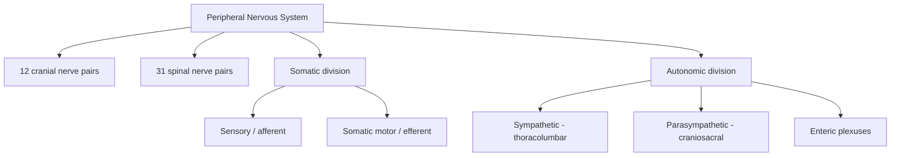
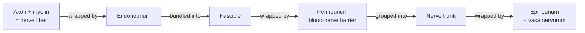
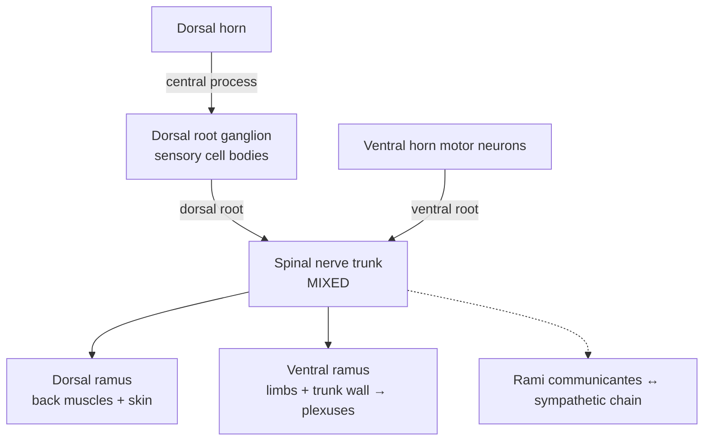
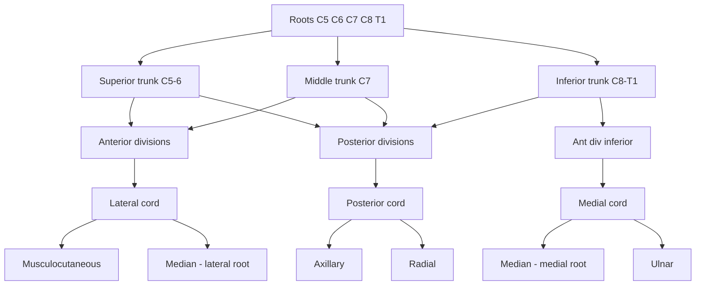
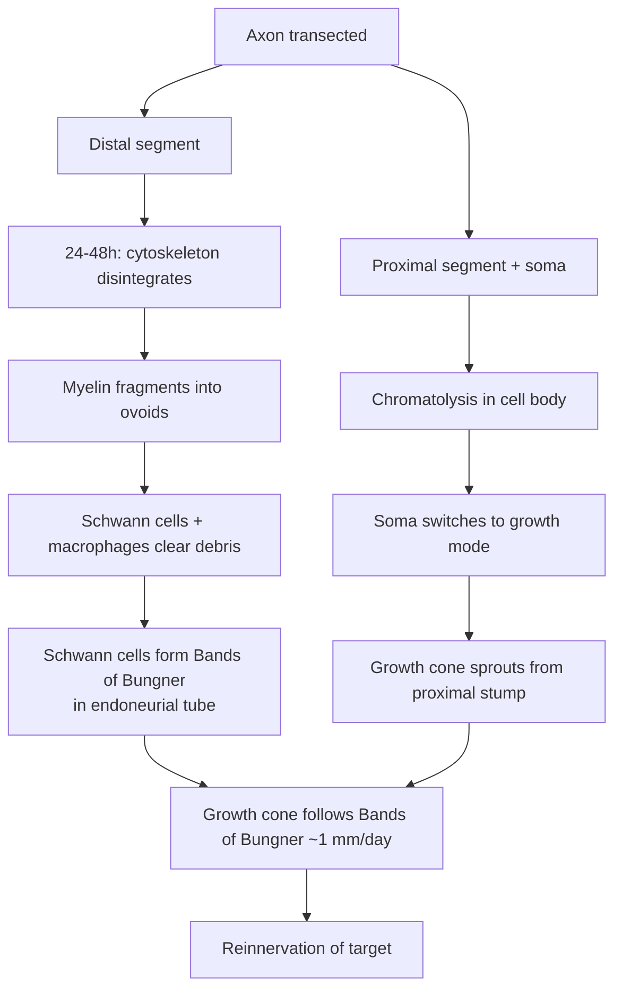

# The Peripheral Nervous System

*A clinical-neuroanatomy reference on the structural organization of peripheral nerves, the spinal
nerves and their plexuses, the segmental logic of dermatomes and myotomes, and the pathology of
nerve injury, degeneration, and regeneration — written to fill the gap left by systems-level
neuroanatomy texts and to serve bedside localization.*

## Introduction

The **peripheral nervous system (PNS)** is everything nervous outside the pial surface of the brain
and spinal cord: the cranial nerves (except the optic nerve, which is a CNS tract), the spinal
nerves and their roots, the ganglia, the plexuses, the named peripheral nerves, and the sensory and
autonomic endings they carry. It is the cabling that connects a centrally computed model of the
world to the receptors that sample it and the muscles and glands that act on it. Where the central
nervous system (CNS) is protected by bone, meninges, and a blood–brain barrier, the PNS is
comparatively exposed — running through fascial planes, around bony prominences, and under
retinacula — which is exactly why peripheral nerves are so often injured and why their lesions
produce such clean, localizable syndromes.

Two facts give clinical neuroanatomy of the PNS its predictive power. First, the PNS is built to a
**segmental plan** inherited from the somites of the embryo: each spinal cord segment supplies a
strip of skin (a dermatome) and a set of muscles (a myotome), and this map is preserved into
adulthood even after the plexuses scramble the fibers. Second, peripheral nerves, unlike central
tracts, **regenerate** — slowly, imperfectly, but genuinely — because Schwann cells and the
endoneurial connective-tissue tubes provide a permissive road for a severed axon to regrow. A
clinician who holds both maps in mind — the segmental (root) map and the peripheral-nerve map — can
usually name the lesion from the pattern of the deficit alone.

This document works from the microscopic to the clinical: the histological architecture of a
peripheral nerve, the classification of nerve fibers by size and speed, the anatomy of a typical
spinal nerve, the dermatome/myotome system, the four great limb plexuses, the classic
mononeuropathies and plexus palsies, and finally the cell biology of Wallerian degeneration,
chromatolysis, and axonal regeneration, closing with an overview of the polyneuropathies.
Quantitative values (fiber diameters, conduction velocities, regeneration rates) are given as
order-of-magnitude textbook anchors; real fibers and real nerves vary.

---

## Table of Contents

1. [Organization of the Peripheral Nervous System](#1-organization-of-the-peripheral-nervous-system)
2. [Microscopic Structure of a Peripheral Nerve](#2-microscopic-structure-of-a-peripheral-nerve)
3. [Classification of Nerve Fibers](#3-classification-of-nerve-fibers)
4. [The Typical Spinal Nerve](#4-the-typical-spinal-nerve)
5. [Dermatomes and Myotomes](#5-dermatomes-and-myotomes)
6. [The Cervical Plexus](#6-the-cervical-plexus)
7. [The Brachial Plexus](#7-the-brachial-plexus)
8. [The Lumbar and Sacral Plexuses](#8-the-lumbar-and-sacral-plexuses)
9. [Common Peripheral Nerve Lesions](#9-common-peripheral-nerve-lesions)
10. [Plexus Injuries: Erb's and Klumpke's Palsies](#10-plexus-injuries-erbs-and-klumpkes-palsies)
11. [Nerve Injury, Degeneration, and Regeneration](#11-nerve-injury-degeneration-and-regeneration)
12. [Why CNS Axons Regenerate Poorly](#12-why-cns-axons-regenerate-poorly)
13. [Peripheral Neuropathies: An Overview](#13-peripheral-neuropathies-an-overview)
14. [Sources](#sources)

---

## 1. Organization of the Peripheral Nervous System

The PNS can be partitioned along three orthogonal axes at once, and it is worth keeping all three
straight because clinicians use them interchangeably.

### 1.1 Cranial versus spinal nerves (by point of exit)

- **12 pairs of cranial nerves** emerge from the brain and brainstem and exit the skull through
  foramina. They are numbered I–XII. Cranial nerve I (olfactory) and cranial nerve II (optic) are
  developmentally CNS outgrowths, not true peripheral nerves — the optic "nerve" is myelinated by
  oligodendrocytes and invested by meninges, which is why it does not regenerate and why optic
  neuritis behaves like a CNS demyelinating lesion. The remaining ten cranial nerves are peripheral.
- **31 pairs of spinal nerves** emerge segmentally from the spinal cord: **8 cervical (C1–C8),
  12 thoracic (T1–T12), 5 lumbar (L1–L5), 5 sacral (S1–S5), and 1 coccygeal.** Note the asymmetry
  that trips up beginners: there are 8 cervical nerves but only 7 cervical vertebrae. Above C7 the
  nerve exits *above* its correspondingly numbered pedicle (C6 nerve exits between C5 and C6); C8
  exits between C7 and T1; from T1 downward each nerve exits *below* its numbered vertebra.

### 1.2 Somatic versus autonomic (by target)

- The **somatic nervous system** carries sensation from skin, muscle, joints, and special senses,
  and motor commands to skeletal muscle. Somatic motor is a single-neuron path from spinal cord to
  muscle.
- The **autonomic nervous system (ANS)** controls smooth muscle, cardiac muscle, and glands, and
  uses a two-neuron efferent chain (preganglionic → postganglionic) with a synapse in a peripheral
  ganglion. Its divisions — **sympathetic** (thoracolumbar, T1–L2/3), **parasympathetic**
  (craniosacral, via CN III, VII, IX, X and S2–S4), and the **enteric** plexuses of the gut — are
  the subject of a separate reference; here they matter because preganglionic autonomic axons are
  the classic **B fibers** and postganglionic autonomic axons are unmyelinated **C fibers**.

### 1.3 Afferent versus efferent (by direction)

- **Afferent (sensory)** fibers carry information toward the CNS; their cell bodies sit in the
  **dorsal root ganglia (DRG)** for spinal nerves, or in cranial sensory ganglia.
- **Efferent (motor)** fibers carry commands away from the CNS; the cell bodies of somatic
  motor neurons are in the ventral horn of the cord.

A **mixed nerve** — which describes essentially every named spinal nerve and most cranial nerves —
carries afferent, efferent, and autonomic fibers together in one cable.

---

## 2. Microscopic Structure of a Peripheral Nerve

A peripheral nerve is not a wire but a cable of cables — thousands of axons bundled and re-bundled,
each level of bundling wrapped in its own connective-tissue sheath. Three named sheaths, from inside
out, are **endoneurium, perineurium, and epineurium**. This layered architecture provides tensile
strength, a controlled fluid environment, and — via the perineurium — a **blood–nerve barrier**
analogous to the blood–brain barrier.

### 2.1 The axon and its Schwann-cell sheath

The functional unit is the **axon** (in the PNS the axon plus its Schwann-cell sheath is often
called a **nerve fiber**). Schwann cells are the PNS glia that myelinate, and they do so in two
patterns:

- **Myelinated fibers.** For larger axons (roughly >1 µm), a single Schwann cell wraps a single
  segment (**internode**) of one axon in a 1:1 relationship, spiraling its plasma membrane into a
  compact myelin sheath. Successive Schwann cells tile the axon with short unmyelinated gaps between
  them — the **nodes of Ranvier** — where voltage-gated Na⁺ channels cluster and the action
  potential regenerates. Conduction leaps node to node (**saltatory conduction**), which is fast and
  metabolically cheap. Contrast with CNS oligodendrocytes, each of which myelinates internodes of
  *many* axons at once.
- **Unmyelinated fibers (Remak bundles).** For small axons (C fibers), a single Schwann cell
  cradles several axons in separate surface grooves without spiraling — a **Remak bundle**. There is
  no myelin and no saltatory conduction; the impulse creeps continuously and slowly.

Every Schwann cell, myelinating or not, sits on a **basal lamina** and is surrounded by endoneurial
collagen. That basal-lamina tube is the structure that survives injury and guides regeneration
(Section 11).

### 2.2 Endoneurium

The **endoneurium** is the delicate connective tissue immediately surrounding each individual nerve
fiber (axon + Schwann sheath). It is made mostly of loosely arranged **type III collagen
(reticulin)** running longitudinally, fibroblasts, resident macrophages, mast cells, and capillaries.
The endoneurium encloses **endoneurial fluid** at a slightly positive pressure — a specialized,
low-protein, CSF-like microenvironment maintained behind the blood–nerve barrier. This fluid
protects the axon and is why raised endoneurial pressure (edema in inflammatory neuropathy, or
compression) is so injurious.

### 2.3 Perineurium

Bundles of nerve fibers are grouped into **fascicles**, and each fascicle is wrapped by the
**perineurium** — the mechanically and physiologically most important sheath. It is a laminated
sleeve of concentric layers of flattened **perineurial cells** joined by tight junctions, alternating
with collagen. These tight junctions constitute the **blood–nerve barrier**, regulating what reaches
the endoneurium and maintaining the endoneurial milieu. The perineurium is the chief bearer of a
nerve's **tensile strength** and is the layer a surgeon must appose to restore fascicular continuity
in a nerve repair.

### 2.4 Epineurium

The **epineurium** is the tough, outermost sheath of dense irregular connective tissue that binds
multiple fascicles into the whole nerve trunk and is continuous with the dura at the root. It
contains the nutrient arteries and the **vasa nervorum** (which anastomose to make peripheral nerves
relatively resistant to ischemia except in vasculitis and diabetes), lymphatics, and fat that
cushions the nerve against pressure. The epineurium is what the surgeon sees and sutures in an
epineurial repair.

---

## 3. Classification of Nerve Fibers

Two overlapping schemes classify peripheral fibers. The **Erlanger–Gasser (A/B/C)** scheme, derived
from compound action-potential recordings (Nobel Prize, 1944), applies to both motor and sensory
fibers and grades them by diameter and conduction velocity. The **Lloyd–Hunt (I/II/III/IV)** scheme
applies only to **sensory (afferent)** fibers and is favored for muscle afferents. The two map onto
each other. The governing principle is simple: **larger diameter → thicker myelin → faster
conduction**, because both the low internal resistance of a fat axon and the long internodes of
heavy myelination speed the saltatory leap.

### 3.1 Table of nerve fiber types

| Fiber (A/B/C) | Sensory (numeral) | Diameter (µm) | Myelination | Velocity (m/s) | Principal function |
|---|---|---|---|---|---|
| **Aα** | Ia, Ib | 12–20 | Heavy | 70–120 | α-motor to skeletal muscle; proprioception — Ia from muscle-spindle primary (annulospiral) endings, Ib from Golgi tendon organs |
| **Aβ** | II | 5–12 | Heavy | 30–70 | Touch, pressure, vibration (skin mechanoreceptors); muscle-spindle secondary (flower-spray) endings |
| **Aγ** | — | 3–6 | Moderate | 15–30 | γ-motor (fusimotor) to intrafusal muscle-spindle fibers; sets spindle sensitivity |
| **Aδ** | III | 1–5 | Thin | 5–30 (~12–30) | "Fast"/sharp, well-localized pain; cold; crude touch |
| **B** | — | ≤3 | Thin | 3–15 | Preganglionic autonomic efferents |
| **C** | IV | 0.2–1.5 | **None** (Remak) | 0.5–2 | "Slow"/dull, poorly localized pain; warmth; itch; postganglionic sympathetic efferents |

### 3.2 Reading the two schemes together

- **Sensory Ia** and **Ib** are both large Aα fibers: Ia signals the *rate and length* change of a
  muscle (dynamic stretch, the afferent limb of the tendon-jerk reflex), Ib signals *tension* via
  Golgi tendon organs.
- **Type II = Aβ**: static muscle length (spindle secondary) plus the discriminative-touch
  submodalities (Merkel, Meissner, Pacinian, Ruffini).
- **Type III = Aδ** and **Type IV = C** are the nociceptive/thermal afferents — the two-fiber basis
  of "first pain" (fast, sharp, Aδ) and "second pain" (slow, burning, C), and the reason a local
  anesthetic or ischemic block that hits small fibers first abolishes pain before touch, while
  pressure block hitting large fibers first abolishes proprioception before pain.

### 3.3 Clinical corollaries of fiber size

Fiber caliber predicts vulnerability. **Compression and demyelination** preferentially hit large,
heavily myelinated fibers (motor, proprioception, vibration lost early) — the picture of carpal
tunnel or a demyelinating polyneuropathy. **Metabolic and toxic axonopathies** (diabetes, alcohol)
hit the longest, smallest fibers first — the distal, length-dependent, "glove-and-stocking" loss of
pain and temperature. **Local anesthetics** block small fibers (C, then B, then Aδ) before large,
which is why pain goes before touch and touch before motor during a block.

---

## 4. The Typical Spinal Nerve

Each of the 31 spinal nerves forms from the union of a **dorsal (posterior) root** and a **ventral
(anterior) root** within the intervertebral foramen, and this union defines the "mixed nerve."

### 4.1 Roots and the dorsal root ganglion

- The **dorsal root** carries **afferent (sensory)** fibers into the cord. Its **dorsal root ganglion
  (DRG)** — a swelling on the root within or just proximal to the intervertebral foramen — houses the
  **pseudounipolar** cell bodies of the primary sensory neurons. A single process leaves each cell
  and divides into a peripheral branch (to the receptor) and a central branch (into the dorsal horn);
  no synapse occurs in the ganglion. Because the DRG sits *outside* the CNS, its neurons are true PNS
  neurons — relevant to why sensory axons of a root avulsion behave differently proximal versus
  distal to the ganglion.
- The **ventral root** carries **efferent (motor)** fibers *out* of the cord — somatic motor axons
  from the ventral-horn α- and γ-motor neurons, and, at T1–L2/3 and S2–S4, preganglionic autonomic
  axons.

### 4.2 The mixed nerve and its rami

Just distal to the DRG the two roots merge into the short **spinal nerve trunk**, which almost
immediately divides into two **rami**:

- The **dorsal (posterior) ramus** — the smaller — turns backward to supply the **deep (intrinsic)
  muscles of the back** and a strip of skin over the posterior trunk in the midline paravertebral
  region. Dorsal rami do **not** enter plexuses and retain a strictly segmental distribution.
- The **ventral (anterior) ramus** — the larger — supplies the **limbs and the anterolateral trunk
  wall.** In the thorax the ventral rami stay segmental as the **intercostal nerves**; in the neck,
  arm, low back, and pelvis the ventral rami interweave into the four great **plexuses** (cervical,
  brachial, lumbar, sacral), where fibers from several segments are redistributed into named
  peripheral nerves.

Two further connections complete the picture: **gray and white rami communicantes** link each
thoracolumbar spinal nerve to the sympathetic chain (white ramus = myelinated preganglionic B fibers
out; gray ramus = unmyelinated postganglionic C fibers back), and small **meningeal (recurrent
sinuvertebral) branches** loop back into the foramen to innervate the dura and posterior longitudinal
ligament — the reason a disc protrusion can be locally painful before it ever compresses a root.

---

## 5. Dermatomes and Myotomes

### 5.1 The segmental principle

Because each spinal cord segment derives from and innervates one embryonic **somite**, a single
spinal nerve supplies a predictable territory of skin and muscle. A **dermatome** is the strip of
skin innervated by the sensory fibers of one dorsal root; a **myotome** is the set of muscles
innervated by the motor fibers of one segment; the analogous bone/joint territory is a **sclerotome**.
Limb growth and rotation stretch the dermatomes into oblique bands down the limbs, but the sequence
is orderly and learnable by landmark.

### 5.2 Key landmark dermatomes

Memorizing a handful of anchors lets you interpolate the rest and localize a radiculopathy:

| Level | Landmark |
|---|---|
| **C2** | Occiput / back of head |
| **C4** | Clavicle / top of shoulder |
| **C5** | Lateral (deltoid) upper arm — "regimental badge" |
| **C6** | **Thumb** and lateral forearm |
| **C7** | **Middle finger** |
| **C8** | **Little finger** and medial hand |
| **T4** | **Nipple** line |
| **T6–T7** | Xiphoid process |
| **T10** | **Umbilicus** |
| **L1** | Inguinal region / groin |
| **L4** | **Knee and medial leg/malleolus** — "L4 hits the floor" (kneeling) |
| **L5** | Dorsum of foot / **big toe** |
| **S1** | **Lateral foot and little toe**; sole and heel |
| **S2–S4** | Perineum / "saddle" area |

### 5.3 Dermatome overlap

Adjacent dermatomes overlap substantially: sensory fibers of one root spill into the territory of
its neighbors above and below. The practical consequence is that **section of a single dorsal root
produces little or no detectable anesthesia** — the neighbors cover the gap — though it may leave a
band of blunted sensation or altered pain. To map a true dermatome experimentally requires the
"remaining-dermatome" method (cutting the roots above and below and testing what one intact root
still supplies). Overlap is why complete sensory loss to pinprick almost always means a *peripheral
nerve* or multi-root lesion, not a single root.

### 5.4 Root pattern versus peripheral-nerve pattern of sensory loss

This distinction is the single most useful bedside discriminator in the PNS:

- A **dermatomal (radicular) pattern** follows the oblique band of one or two roots — e.g. an
  **C7** radiculopathy from a lateral disc herniation blunts sensation over the middle finger,
  weakens elbow **extension** (triceps) and wrist flexion, and depresses the **triceps reflex**,
  cutting across the territories of several peripheral nerves. Root lesions typically also cause
  **radicular (shooting) pain** in the band and are provoked by root tension (straight-leg raise,
  Spurling test).
- A **peripheral-nerve pattern** follows the autonomous zone of one named nerve regardless of
  segment — e.g. a **median nerve** lesion at the wrist numbs the palmar thumb, index, middle, and
  radial ring finger and weakens thumb opposition, crossing several dermatomes but respecting the
  median territory (and sparing the little finger, which is ulnar).

Because plexuses reshuffle root fibers into peripheral nerves, the two maps diverge, and knowing
both lets you localize a lesion to the **root** (before the plexus), the **plexus** itself, or a
**named nerve** (after it).

### 5.5 Myotomes and reflex levels

Most limb muscles draw on two or more segments, so a single-root lesion weakens but rarely paralyzes
a muscle. High-yield myotome/reflex anchors:

| Action | Root(s) | Reflex |
|---|---|---|
| Shoulder abduction | C5 | Biceps (C5–C6) |
| Elbow flexion / supination | C5–C6 | Biceps / brachioradialis |
| Elbow extension | C7 | Triceps (C7) |
| Finger abduction/adduction | T1 | — |
| Hip flexion | L1–L2 | — |
| Knee extension | L3–L4 | Patellar / knee-jerk (L3–L4) |
| Ankle dorsiflexion | L4–L5 | — |
| Great-toe extension | L5 | — |
| Ankle plantarflexion | S1–S2 | Achilles / ankle-jerk (S1) |

---

## 6. The Cervical Plexus

The **cervical plexus** is formed by the ventral rami of **C1–C4**, lying deep to the
sternocleidomastoid. It gives **cutaneous** branches (lesser occipital, great auricular, transverse
cervical, supraclavicular — supplying the skin of the neck, lower face angle, and upper chest/shoulder)
and **muscular** branches, of which the most important by far is the **phrenic nerve**.

### 6.1 The phrenic nerve (C3, C4, C5)

The phrenic nerve arises chiefly from **C4** with contributions from **C3 and C5** — "**C3, 4, 5
keep the diaphragm alive**." It is the sole motor supply to the **diaphragm** (and carries sensory
fibers from the central diaphragm, pericardium, and mediastinal pleura). It descends on the anterior
surface of the anterior scalene, enters the thorax, and runs over the pericardium to the diaphragm.
Clinical points:

- A **high cervical cord lesion above C3** abolishes diaphragmatic drive and is rapidly fatal
  without ventilation; a lesion **below C5** spares the diaphragm — hence the adage that phrenic
  integrity is the difference between an independent breather and a ventilator-dependent patient in
  cervical injury.
- Phrenic irritation (subphrenic abscess, gallbladder, diaphragmatic pleura) produces **referred
  pain to the C3–C4 dermatome over the shoulder tip** — a classic example of the segmental principle
  in referred pain.

The **ansa cervicalis** (C1–C3) supplies the infrahyoid ("strap") muscles; **C1 fibers** hitchhiking
with the hypoglossal nerve supply geniohyoid and thyrohyoid.

---

## 7. The Brachial Plexus

The **brachial plexus** innervates the entire upper limb and shoulder girdle. It is the archetypal
plexus and the one whose five-tier architecture — **Roots → Trunks → Divisions → Cords → Branches**
("**R**ich **T**ourists **D**rink **C**old **B**eer") — must be committed to memory.

### 7.1 The five tiers

- **Roots (5):** ventral rami of **C5, C6, C7, C8, T1.**
- **Trunks (3):** at the base of the neck between the scalenes —
  **Superior** (C5+C6), **Middle** (C7), **Inferior** (C8+T1).
- **Divisions (6):** each trunk splits into an **anterior** and a **posterior** division. As a rule,
  **anterior divisions supply flexor (anterior) compartments; posterior divisions supply extensor
  (posterior) compartments** — the developmental basis for the radial/axillary nerves (posterior)
  being pure "extensor" nerves.
- **Cords (3):** behind pectoralis minor, named for their relation to the axillary artery —
  **Lateral cord** (anterior divisions of superior + middle trunks; C5–C7),
  **Medial cord** (anterior division of inferior trunk; C8–T1),
  **Posterior cord** (all three posterior divisions; C5–T1).
- **Branches (5 terminal):** the nerves that leave the cords.

### 7.2 Brachial plexus summary

| Tier | Components |
|---|---|
| Roots | C5, C6, C7, C8, T1 |
| Trunks | Superior (C5–6), Middle (C7), Inferior (C8–T1) |
| Divisions | Anterior ×3, Posterior ×3 |
| Cords | Lateral (C5–7), Posterior (C5–T1), Medial (C8–T1) |
| Terminal branches | Musculocutaneous, Axillary, Radial, Median, Ulnar |

Selected **pre-terminal** branches worth knowing for localization: **long thoracic nerve** (C5–7, to
serratus anterior — injury → *winged scapula*); **suprascapular nerve** (C5–6, supraspinatus/
infraspinatus); **dorsal scapular** (C5, rhomboids); **thoracodorsal** (C6–8, latissimus dorsi).

### 7.3 The five terminal nerves

| Nerve | Roots | Cord | Key muscles / motor | Sensory territory | Deficit if injured |
|---|---|---|---|---|---|
| **Musculocutaneous** | C5–C7 | Lateral | Biceps, brachialis, coracobrachialis (elbow flexion + supination) | Lateral forearm (as lateral cutaneous n. of forearm) | Weak elbow flexion/supination; lost biceps reflex |
| **Axillary** | C5–C6 | Posterior | Deltoid (abduction 15–90°), teres minor | "Regimental badge" over deltoid | Weak arm abduction; deltoid atrophy — injured in shoulder dislocation / surgical neck of humerus fracture |
| **Radial** | C5–T1 | Posterior | Triceps, brachioradialis, all wrist/finger **extensors**, supinator | Posterior arm/forearm, dorsum of lateral hand | **Wrist drop**; lost extension — injured at the **spiral groove** of humerus |
| **Median** | C6–T1 | Lateral + Medial | Most forearm flexors, thenar muscles, lateral 2 lumbricals ("**LOAF**") | Palmar thumb→radial ½ ring finger | **Carpal tunnel / ape hand**; lost thumb opposition |
| **Ulnar** | C8–T1 | Medial | Flexor carpi ulnaris, medial FDP, most intrinsic hand muscles (interossei, medial lumbricals, hypothenar, adductor pollicis) | Medial 1½ fingers, medial hand | **Claw hand**; injured at the **medial epicondyle** ("funny bone") |

---

## 8. The Lumbar and Sacral Plexuses

The ventral rami of **L1–S4** form the **lumbosacral plexus**, conventionally split into a **lumbar**
part (L1–L4) within psoas major and a **sacral** part (L4–S4) on the posterior pelvic wall. The
**lumbosacral trunk (L4–L5)** carries lumbar fibers down to join the sacral plexus, structurally
linking the two.

### 8.1 The lumbar plexus (L1–L4)

Its major nerves and quick clinical tags:

- **Iliohypogastric / ilioinguinal (L1)** and **genitofemoral (L1–L2)** — lower abdominal wall and
  groin/upper thigh skin; at risk in hernia and appendix surgery.
- **Lateral femoral cutaneous nerve (L2–L3)** — pure sensory to the anterolateral thigh; entrapment
  under the inguinal ligament causes **meralgia paresthetica** (burning lateral-thigh numbness).
- **Femoral nerve (L2–L4)** — the largest branch. Motor to **iliacus, sartorius, pectineus, and
  quadriceps femoris** (hip flexion, **knee extension**); sensory to the anterior thigh and, via its
  continuation the **saphenous nerve**, the medial leg to the medial malleolus. **Deficit:** weak
  knee extension (buckling knee), lost patellar reflex, anterior-thigh/medial-leg numbness.
- **Obturator nerve (L2–L4)** — motor to the **medial (adductor) compartment** (adductor longus/
  brevis/magnus, gracilis, obturator externus → **thigh adduction**); sensory to the medial thigh.
  **Deficit:** weak adduction, medial-thigh numbness; injured in pelvic surgery/childbirth.

### 8.2 The sacral plexus (L4–S4)

- **Superior gluteal nerve (L4–S1)** — gluteus medius/minimus, tensor fasciae latae (hip **abduction**).
  Injury → **Trendelenburg gait** (pelvis drops toward the unsupported side).
- **Inferior gluteal nerve (L5–S2)** — gluteus maximus (hip extension; rising from sitting, climbing).
- **Pudendal nerve (S2–S4)** — motor to the external anal/urethral sphincters and pelvic floor,
  sensory to the perineum; "**S2, 3, 4 keep the pelvic floor off the floor**"; blocked in obstetrics.
- **Sciatic nerve (L4–S3)** — the **largest nerve in the body**, a single sheath actually containing
  two functionally distinct nerves bound together: the **tibial** and **common fibular (peroneal)**
  divisions. It exits below piriformis through the greater sciatic foramen, descends the posterior
  thigh supplying the **hamstrings** (knee flexion), and usually divides at the apex of the popliteal
  fossa.
  - **Tibial nerve (L4–S3):** posterior leg (gastrocnemius, soleus, deep flexors → **plantarflexion,
    toe flexion, inversion**) and, via medial/lateral plantar branches, the sole and intrinsic foot
    muscles. **Deficit:** weak plantarflexion, loss of ankle-jerk, numb sole; entrapment behind the
    medial malleolus = **tarsal tunnel syndrome**.
  - **Common fibular (peroneal) nerve (L4–S2):** wraps the **neck of the fibula** (very superficial,
    easily injured). Divides into **superficial fibular** (fibularis longus/brevis → **eversion**;
    skin of dorsum of foot) and **deep fibular** (tibialis anterior, toe extensors → **dorsiflexion,
    toe extension**; skin of first web space). **Deficit:** **foot drop** with high-stepping
    (steppage) gait, and loss of eversion/dorsiflexion.

---

## 9. Common Peripheral Nerve Lesions

The classic mononeuropathies are worth knowing as complete pictures — motor deficit, characteristic
posture, sensory loss, and typical mechanism/site.

### 9.1 Table of common nerve lesions

| Nerve | Classic site / cause | Motor deficit / sign | Sensory loss |
|---|---|---|---|
| **Radial** | Spiral groove ("Saturday-night palsy," humeral shaft fracture) | **Wrist drop** — lost wrist/finger extension; weak grip (wrist can't stabilize) | Dorsum of first web space |
| **Median (wrist)** | Carpal tunnel (compression under flexor retinaculum) | Weak thumb opposition/abduction; thenar wasting; **"ape hand"**; **hand of benediction** on making a fist | Palmar thumb → radial ½ of ring finger |
| **Median (elbow)** | Supracondylar fracture; pronator teres | Above + weak forearm flexion/pronation | Same as above |
| **Ulnar** | Medial epicondyle groove; Guyon's canal (wrist) | **Claw hand** (esp. of ring & little fingers); +ve **Froment's sign**; interosseous wasting; can't cross fingers | Medial 1½ fingers, medial hand |
| **Axillary** | Shoulder dislocation; surgical neck of humerus | Weak abduction 15–90°; deltoid wasting | Small "regimental badge" over deltoid |
| **Musculocutaneous** | Rare, direct trauma | Weak elbow flexion/supination; lost biceps reflex | Lateral forearm |
| **Long thoracic** | Axillary surgery, trauma | **Winged scapula** (serratus anterior) | — |
| **Femoral** | Pelvic mass, hematoma, hip surgery | Weak knee extension; buckling knee; lost patellar reflex | Anterior thigh, medial leg (saphenous) |
| **Common fibular** | Fibular neck (crossed legs, plaster cast, trauma) | **Foot drop**, steppage gait; lost dorsiflexion/eversion | Dorsum of foot, lateral leg |
| **Tibial** | Tarsal tunnel; popliteal trauma | Weak plantarflexion/inversion; lost ankle-jerk | Sole of foot |
| **Sciatic** | Posterior hip dislocation; misplaced IM injection | Hamstrings + all below-knee muscles; foot flail | Whole leg below knee except medial strip (saphenous) |

### 9.2 The "hand" signs

- **Ulnar claw hand:** at rest, the ring and little fingers hyperextend at the MCP joints and flex
  at the IP joints because the ulnar-innervated medial two lumbricals and interossei are paralyzed
  while the median/radial long flexors and extensors act unopposed. The **"ulnar paradox":** a
  *higher* (elbow) ulnar lesion also knocks out the medial flexor digitorum profundus, so the fingers
  flex *less* and the claw is *less* pronounced than in a distal wrist lesion — a more proximal
  injury produces a less deformed hand.
- **Median "hand of benediction":** on trying to make a fist, the index and middle fingers cannot
  flex (paralyzed lateral FDP/FDS), so they stay extended — a lesion at the elbow. The related **"ape
  hand"** is the flat thenar eminence and adducted thumb (lost opposition) seen at rest.
- **Froment's sign** (ulnar): the patient substitutes flexor pollicis longus (median) for the
  paralyzed adductor pollicis when pinching a sheet of paper, flexing the thumb IP joint.

### 9.3 Entrapment neuropathies and carpal tunnel

An **entrapment neuropathy** is a mononeuropathy caused by chronic mechanical compression where a
nerve passes through a tight anatomical tunnel. The prototype is **carpal tunnel syndrome (CTS)** —
compression of the **median nerve** deep to the **flexor retinaculum** at the wrist. Rising canal
pressure first impairs the large, superficially placed sensory and motor fibers, producing nocturnal
**paresthesia of the radial 3½ digits** (patients "flick" the hand to relieve it), a positive
**Tinel** (tapping) and **Phalen** (wrist-flexion) sign, and, late, **thenar wasting** and lost
opposition. Because the **palmar cutaneous branch** arises *before* the tunnel, sensation over the
thenar eminence itself is **spared** — a neat localizer distinguishing CTS from a proximal median
lesion. Other entrapments: **cubital tunnel** (ulnar at elbow), **Guyon's canal** (ulnar at wrist),
**tarsal tunnel** (tibial at ankle), **meralgia paresthetica** (lateral femoral cutaneous at the
inguinal ligament), and **fibular neck** compression (foot drop).

### 9.4 Sciatica

**Sciatica** is radicular pain radiating down the posterior leg in the distribution of the sciatic
nerve/its roots, most often from an **L4–L5 or L5–S1 disc herniation** compressing the **L5 or S1
root** (not, usually, the sciatic nerve trunk itself). L5 involvement weakens great-toe extension and
foot dorsiflexion and numbs the dorsum of the foot; S1 involvement weakens plantarflexion, depresses
the ankle-jerk, and numbs the lateral foot/sole. The **straight-leg-raise test** reproduces pain by
tensioning the root. A large central disc compressing multiple sacral roots is a surgical emergency —
**cauda equina syndrome** (saddle anesthesia, bladder/bowel dysfunction, bilateral leg weakness).

---

## 10. Plexus Injuries: Erb's and Klumpke's Palsies

Traction injuries of the brachial plexus produce two classic, complementary palsies depending on
which end of the plexus tears.

### 10.1 Erb's palsy (upper plexus, C5–C6)

Excessive **increase in the head–shoulder angle** — a difficult delivery with shoulder dystocia, or
a fall onto the shoulder — tears the **superior trunk (C5–C6)** at **Erb's point**. The
axillary, musculocutaneous, suprascapular, and part of the radial supply fail, so the arm hangs
**adducted, internally rotated, with the forearm pronated and wrist flexed** — the **"waiter's tip"**
posture. Deltoid, biceps/brachialis (lost biceps reflex), and supinator are the losers; hand
function is preserved.

### 10.2 Klumpke's palsy (lower plexus, C8–T1)

Excessive **abduction of the arm** — grabbing an overhead branch while falling, or traction on the
abducted arm in delivery — tears the **inferior trunk (C8–T1)**. The **intrinsic hand muscles**
(supplied by C8–T1 via ulnar and median) are paralyzed, producing a **claw hand**. Because the
**T1 sympathetic** fibers to the head run with this root, an avulsion may also cause an ipsilateral
**Horner's syndrome** (ptosis, miosis, anhidrosis) — a red flag for a proximal, pre-ganglionic root
avulsion with poor prognosis.

---

## 11. Nerve Injury, Degeneration, and Regeneration

When an axon is damaged the nerve responds with a stereotyped sequence: the segment **distal** to the
injury degenerates (**Wallerian degeneration**), the cell body reacts (**chromatolysis**), and — if
conditions allow — the **proximal** stump regrows through the surviving Schwann-cell scaffold. Two
grading systems classify how severe the injury is and therefore how good the prognosis.

### 11.1 Grading: Seddon and Sunderland

**Seddon (1943)** — three grades:

1. **Neurapraxia** — a conduction block from focal **demyelination** with the axon intact (e.g.
   "Saturday-night" radial compression). No Wallerian degeneration; recovery in days to weeks, complete.
2. **Axonotmesis** — the **axon is severed but the connective-tissue sheaths (endoneurial tube)
   remain continuous.** Wallerian degeneration occurs distally; regeneration follows the intact tube,
   so recovery is possible but slow (~1 mm/day) and depends on distance to target.
3. **Neurotmesis** — the **entire nerve, including the sheaths, is transected or disrupted.**
   Spontaneous useful recovery is unlikely; regenerating axons wander without a guiding tube and may
   form a **neuroma**. Requires surgical repair or grafting.

**Sunderland (1951)** refines this into five degrees, mapping the Seddon grades onto how many sheath
layers are disrupted:

| Sunderland | Structures disrupted | Seddon equivalent | Prognosis |
|---|---|---|---|
| **1st degree** | Myelin only (conduction block) | Neurapraxia | Full, weeks |
| **2nd degree** | Axon; endoneurium intact | Axonotmesis | Good, follows the tube |
| **3rd degree** | Axon + endoneurium; perineurium intact | (axonotmesis→neurotmesis) | Incomplete, some misrouting |
| **4th degree** | Axon + endo- + perineurium; only epineurium intact | Neurotmesis | Poor; needs surgery |
| **5th degree** | Complete transection of the whole trunk | Neurotmesis | None without repair |
(A **6th degree**, Mackinnon, denotes a *mixed* pattern of different grades in different fascicles.)

The key clinical inflection is between **2nd and 3rd degree**: if the endoneurial tube is intact
(1st–2nd), axons regrow to their *original* targets and recovery is orderly; once the tube is
breached (3rd+), regenerating axons can enter the wrong tubes and reach the wrong muscles/skin,
giving **imperfect, mis-wired reinnervation** even when regeneration "succeeds."

### 11.2 Wallerian degeneration (distal to the injury)

Named for Augustus Waller (1850), this is the orderly self-destruction and clearance of the axon
*distal* to a transection — a controlled demolition that prepares the endoneurial tube for regrowth.
Sequence (hours to weeks):

1. **Hours:** the distal axon, cut off from the soma's supply of proteins and its axonal transport,
   loses its cytoskeleton. Axonal Ca²⁺ rises and activates calpains; **granular disintegration of the
   axonal cytoskeleton** begins (~24–48 h). This is now known to be an **active, programmed** process
   (the *Wld^S*/SARM1 pathway), not passive wasting.
2. **Days:** the myelin sheath fragments into ovoids ("myelin ovoids").
3. **Schwann cells dedifferentiate,** downregulate myelin genes, proliferate, and — with recruited
   **macrophages** — phagocytose the axonal and myelin debris. Macrophage recruitment (and the
   permissive, growth-supportive Schwann-cell response) is fast and efficient in the PNS.
4. The emptied Schwann cells line up within their basal-lamina tubes as longitudinal columns — the
   **bands of Büngner** — laying the track for regrowth.

### 11.3 Chromatolysis (the cell-body reaction)

The soma of the injured neuron mounts an **axon reaction** within 1–2 days: the cell body **swells**,
the nucleus moves **eccentrically** to the periphery, and the **Nissl bodies (rough ER) disperse and
dissolve** — **chromatolysis** — reflecting a wholesale switch of the biosynthetic machinery from
neurotransmitter production to the **structural proteins** (tubulin, actin, GAP-43) needed to rebuild
an axon. If regeneration succeeds the soma recovers; if the target is never reached, the neuron may
atrophy or die (retrograde degeneration), sometimes with trans-synaptic effects.

### 11.4 Axonal regeneration (proximal stump)

From the proximal stump, the surviving axon sprouts multiple fine **growth cones** — motile,
actin-rich tips studded with filopodia that sample the environment and haul the axon forward. If a
growth cone finds a **band of Büngner**, it is guided down the endoneurial tube toward the original
target, aided by Schwann-cell **neurotrophic factors** (NGF, BDNF, GDNF, CNTF), cell-adhesion
molecules (L1, N-CAM), and the laminin-rich basal lamina. Regeneration advances at roughly **1–3
mm/day** (classically cited as **~1 mm/day**, matching the advancing **Tinel's sign** — the tingling
elicited by tapping over the growing axon front). Because growth is this slow, proximal injuries
(e.g. a brachial plexus lesion) may take a year or more to reach the hand, by which time denervated
muscle may have irreversibly atrophied — a race between axon and end-organ.

When the endoneurial tube is disrupted (Seddon neurotmesis / Sunderland ≥3), growth cones escape the
tube and grow chaotically into scar; the tangle of misdirected axons, Schwann cells, and fibroblasts
forms a **neuroma** — a firm, often exquisitely painful nodule (a **stump neuroma** after amputation,
or **Morton's neuroma** at the interdigital nerve). This is the anatomical basis of neuropathic and
phantom pain and the reason clean surgical coaptation of the sheaths matters.

---

## 12. Why CNS Axons Regenerate Poorly

The contrast with the CNS is instructive and clinically consequential: a severed peripheral nerve can
regrow, but a severed spinal cord tract essentially cannot. The difference is **environmental**, not
an intrinsic inability of neurons to grow — the same neuron that fails to regrow in the cord will
regrow if given a peripheral-nerve graft (the classic Aguayo experiments). Reasons the CNS is
non-permissive:

- **No bands of Büngner.** Oligodendrocytes (unlike Schwann cells) do not dedifferentiate into a
  proliferating, growth-supportive column, and there is no continuous endoneurial basal-lamina tube
  to guide a growth cone.
- **Myelin-associated inhibitors.** CNS myelin and oligodendrocyte debris carry potent
  growth-cone-collapsing molecules — **Nogo-A, myelin-associated glycoprotein (MAG), and
  oligodendrocyte-myelin glycoprotein (OMgp)** — all signaling through the **NgR/p75/RhoA** pathway
  to arrest outgrowth.
- **The glial scar.** Reactive **astrocytes** form a dense scar rich in inhibitory **chondroitin
  sulfate proteoglycans (CSPGs)**, a physical and chemical barrier at the lesion.
- **Slow debris clearance.** Microglial/macrophage clearance of inhibitory myelin debris is far
  slower than PNS macrophage clearance, so inhibitors persist.
- **Weaker intrinsic growth program** in mature CNS neurons compared with PNS neurons.

These are exactly the targets of experimental spinal-cord-repair strategies (anti-Nogo antibodies,
chondroitinase to digest CSPGs, growth-factor delivery, and permissive cellular grafts).

---

## 13. Peripheral Neuropathies: An Overview

"Peripheral neuropathy" is any disorder of peripheral nerve, classified along two axes that together
predict cause, pattern, and electrophysiology.

### 13.1 By distribution

- **Mononeuropathy** — a single named nerve, usually from local compression or trauma (CTS, radial
  palsy, fibular-neck foot drop).
- **Mononeuritis multiplex** — several individual, non-contiguous nerves affected asynchronously;
  classically **vasculitic** or from diabetes, suggesting infarction of the vasa nervorum.
- **Polyneuropathy** — diffuse, symmetric, **length-dependent** dysfunction beginning in the longest
  fibers, hence the **"glove-and-stocking"** distribution starting at the toes and ascending, then
  reaching the fingers — the pattern of most metabolic/toxic neuropathies.
- **Polyradiculopathy / plexopathy** — roots or a plexus rather than named nerves.

### 13.2 By pathology: axonal versus demyelinating

- **Axonal** neuropathies degrade the axon itself; nerve conduction shows **reduced amplitude** with
  relatively preserved velocity, and recovery (if any) is slow. Typical of **diabetes, alcohol,
  uremia, chemotherapy, and B12 deficiency.**
- **Demyelinating** neuropathies strip myelin; conduction shows **markedly slowed velocity,
  conduction block, and temporal dispersion** with preserved amplitude early. Typical of **Guillain–
  Barré syndrome, CIDP, and the demyelinating forms of Charcot–Marie–Tooth.**

### 13.3 Representative disorders

- **Guillain–Barré syndrome (GBS)** — an **acute, immune-mediated demyelinating**
  polyradiculoneuropathy, often post-infectious (*Campylobacter*, viral). It causes rapidly
  ascending, **predominantly motor** weakness with early loss of reflexes and albuminocytologic
  dissociation in the CSF; severe cases threaten respiratory (diaphragm/phrenic) and autonomic
  function. Treated with IVIG or plasma exchange; most recover.
- **Diabetic neuropathy** — the most common polyneuropathy worldwide; typically a **distal symmetric
  sensorimotor, length-dependent, axonal** neuropathy (glove-and-stocking numbness, burning feet,
  loss of ankle-jerks), plus autonomic involvement and a predisposition to entrapments. Drives
  diabetic foot ulceration through the loss of protective sensation.
- **Charcot–Marie–Tooth (CMT)** — the commonest **inherited** neuropathy, a genetically heterogeneous
  group split into **demyelinating (CMT1, e.g. *PMP22* duplication)** and **axonal (CMT2)** forms.
  Slowly progressive distal wasting produces the classic **"inverted-champagne-bottle" legs**, pes
  cavus, hammer toes, and foot drop, with distal sensory loss.

---

## Sources

- [Physiology, Nerve — StatPearls (NCBI Bookshelf)](https://www.ncbi.nlm.nih.gov/books/NBK551652/)
- [Connective Tissues of Peripheral Nerves — NYSORA](https://www.nysora.com/topics/anatomy/connective-tissues-peripheral-nerves/)
- [Histology of the Peripheral Nerves and Light Microscopy — NYSORA](https://www.nysora.com/topics/anatomy/histology-peripheral-nerves-light-microscopy/)
- [Endoneurium: definition, structure and function — Kenhub](https://www.kenhub.com/en/library/anatomy/endoneurium)
- [Perineurium — Wikipedia](https://en.wikipedia.org/wiki/Perineurium)
- [Group A nerve fiber — Wikipedia](https://en.wikipedia.org/wiki/Group_A_nerve_fiber)
- [Classification of peripheral nerve fibres: an historical perspective — PubMed](https://pubmed.ncbi.nlm.nih.gov/779513/)
- [Anatomy, Head and Neck: Brachial Plexus — StatPearls (NCBI Bookshelf)](https://www.ncbi.nlm.nih.gov/books/NBK531473/)
- [Brachial Plexus Anatomy — TeachMeAnatomy](https://teachmeanatomy.info/upper-limb/nerves/brachial-plexus/)
- [Brachial plexus: Anatomy, branches and mnemonics — Kenhub](https://www.kenhub.com/en/library/anatomy/brachial-plexus)
- [The Lumbar Plexus — TeachMeAnatomy](https://teachmeanatomy.info/lower-limb/nerves/lumbar-plexus/)
- [Anatomy, Bony Pelvis and Lower Limb: Thigh Nerves — StatPearls (NCBI Bookshelf)](https://www.ncbi.nlm.nih.gov/books/NBK482225/)
- [Lumbosacral Plexopathy — StatPearls (NCBI Bookshelf)](https://www.ncbi.nlm.nih.gov/books/NBK556030/)
- [Anatomy, Skin, Dermatomes — StatPearls (NCBI Bookshelf)](https://www.ncbi.nlm.nih.gov/books/NBK535401/)
- [Dermatomes: Anatomy and dermatome map — Kenhub](https://www.kenhub.com/en/library/anatomy/dermatomes)
- [Dermatomes and Myotomes — Geeky Medics](https://geekymedics.com/dermatomes-and-myotomes/)
- [Wrist Drop — StatPearls (NCBI Bookshelf)](https://www.ncbi.nlm.nih.gov/books/NBK532993/)
- [Anatomy clinical correlates: Median, ulnar and radial nerves — Osmosis](https://www.osmosis.org/learn/Anatomy_clinical_correlates:_Median,_ulnar_and_radial_nerves)
- [Klumpke paralysis — Osmosis](https://www.osmosis.org/learn/Klumpke_paralysis)
- [Nerve injury — Wikipedia](https://en.wikipedia.org/wiki/Nerve_injury)
- [Current Status of Therapeutic Approaches against Peripheral Nerve Injuries — PMC](https://pmc.ncbi.nlm.nih.gov/articles/PMC6930373/)
- [Neuroscience of Peripheral Nerve Regeneration — PMC](https://pmc.ncbi.nlm.nih.gov/articles/PMC8686930/)
- [Glial inhibition of CNS axon regeneration — PMC](https://pmc.ncbi.nlm.nih.gov/articles/PMC2693386/)
- [Myelin-associated inhibitors of axonal regeneration in the adult mammalian CNS — Nature Reviews Neuroscience](https://www.nature.com/articles/nrn1195)
- [Neuropathy — StatPearls (NCBI Bookshelf)](https://www.ncbi.nlm.nih.gov/books/NBK542220/)
- [Peripheral Neuropathy — NINDS](https://www.ninds.nih.gov/health-information/disorders/peripheral-neuropathy)
- [Peripheral Neuropathy — RCEMLearning](https://www.rcemlearning.co.uk/reference/peripheral-neuropathy/)
