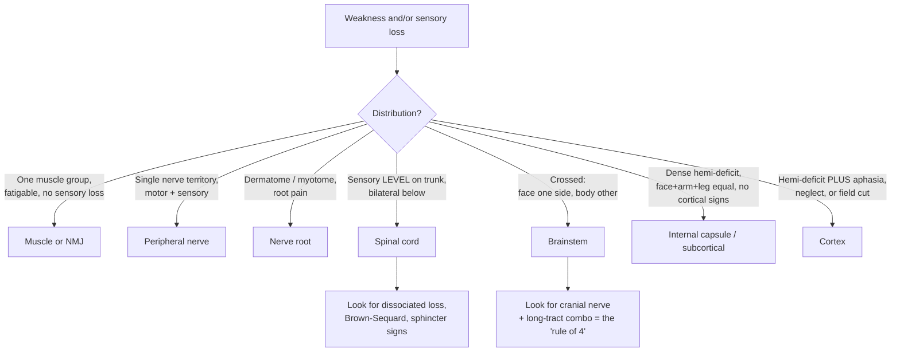
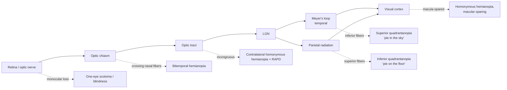

# Clinical Neuroanatomy and Lesion Localization

A reference on the synthesizing "clinical" layer of neuroanatomy: the reasoning that turns static structural knowledge — tracts, nuclei, blood supply, cranial nerves — into bedside inference. The organizing theme is a two-way lens. **Anatomy predicts the deficit**: knowing what a structure does tells you what is lost when it fails. **The deficit localizes the lesion**: the *pattern* of what is lost, and what is spared, pins the damage to a level of the neuraxis and often to a single artery or nucleus. Localization is the discipline of running that inference backward, from signs to site, before ever ordering an image.

> **Clinical disclaimer.** This document is **educational** and written for students of neuroanatomy. It is **not medical advice**, not a diagnostic protocol, and not a substitute for evaluation by a qualified clinician. Localization heuristics are simplifications; real patients have anatomical variation, incomplete or overlapping lesions, and multiple simultaneous processes. Never use this material to diagnose or manage yourself or anyone else. If you are worried about neurological symptoms — especially sudden weakness, speech or vision change, or the "worst headache of life" — seek emergency care immediately.

## Introduction

Classical clinical neuroanatomy poses the patient's problem as **two questions**, and it insists on answering the first before the second:

1. **Where is the lesion?** (localization — an anatomical question)
2. **What is the process?** (pathology — a temporal/etiological question)

The order matters. The *tempo* of onset speaks to mechanism — hyperacute (seconds–minutes) suggests vascular or seizure; subacute (days–weeks) suggests inflammation, infection, or demyelination; chronic and progressive (months–years) suggests neoplasm or degeneration. But mechanism alone cannot tell you *what* is failing. Only the anatomy of the deficit does that. A skilled examiner localizes first — "this is a left posterior-limb internal capsule lesion" — and only then asks which disease strikes that spot in that time course.

The second question — **what is the process?** — is read chiefly from the **time course**, which is why every history begins with onset and evolution:

| Tempo | Typical mechanisms |
|---|---|
| **Hyperacute** (seconds–minutes) | Vascular (ischemic/hemorrhagic stroke), seizure, migraine aura, trauma |
| **Acute** (hours) | Stroke completing, infection, toxic/metabolic |
| **Subacute** (days–weeks) | Inflammatory/demyelinating (MS), infectious (abscess), some tumors |
| **Chronic progressive** (months–years) | Neoplasm, neurodegeneration, chronic compression |
| **Relapsing–remitting** | Demyelination (MS), some channelopathies |

A deficit that is **maximal at onset** favors vascular; one that **marches or spreads** over seconds favors seizure (excitation) or migraine (spreading depression); one that **builds over weeks** favors mass or inflammation. But the tempo never tells you *what structure* is failing — only the anatomy of the deficit does.

The power of localization comes from a single structural fact: the nervous system is **topographically organized and highly crossed**. Body maps are preserved from cord to cortex (somatotopy); pathways decussate at defined levels; and long tracts run in tight, predictable bundles. Because of this, a lesion does not produce "neurological symptoms" in general — it produces a *specific combination* determined entirely by which fibers and nuclei happen to share that piece of tissue. The examiner reads the combination like a fingerprint.

This document builds the localizing framework level by level, cross-referencing the structural docs: development ([16](16-development-and-organization.md)), spinal cord ([17](17-spinal-cord.md)), brainstem ([18](18-brainstem.md)), cranial nerves ([19](19-cranial-nerves.md)), the peripheral nervous system ([20](20-peripheral-nervous-system.md)), and gross anatomy and organization ([02](02-anatomy-and-organization.md)).

## Table of Contents

- [1. The Localization Mindset](#1-the-localization-mindset)
- [2. Upper vs Lower Motor Neuron Lesions](#2-upper-vs-lower-motor-neuron-lesions)
- [3. Sensory Localization](#3-sensory-localization)
- [4. The Internal Capsule and Lacunar Syndromes](#4-the-internal-capsule-and-lacunar-syndromes)
- [5. Cerebrovascular Syndromes by Territory](#5-cerebrovascular-syndromes-by-territory)
- [6. Crossed Brainstem Syndromes](#6-crossed-brainstem-syndromes)
- [7. Cortical Localization and the Aphasias](#7-cortical-localization-and-the-aphasias)
- [8. Apraxia, Agnosia, and Disconnection Syndromes](#8-apraxia-agnosia-and-disconnection-syndromes)
- [9. Visual Pathway Lesions](#9-visual-pathway-lesions)
- [10. Raised Intracranial Pressure and Herniation](#10-raised-intracranial-pressure-and-herniation)
- [11. Disorders of CSF: Hydrocephalus](#11-disorders-of-csf-hydrocephalus)
- [12. Cerebellar and Basal Ganglia Localization](#12-cerebellar-and-basal-ganglia-localization)
- [13. Localization Cheat-Sheet](#13-localization-cheat-sheet)
- [Sources](#sources)

---

## 1. The Localization Mindset

### The levels of the neuraxis

Motor and sensory signals pass through a chain of stations. A deficit can arise at any one, and each level has a *characteristic signature* — because at each level the anatomy bundles different things together. Reading from periphery inward:

**muscle → neuromuscular junction (NMJ) → peripheral nerve → plexus → nerve root → spinal cord → brainstem → subcortical (internal capsule / thalamus / basal ganglia) → cortex**

The single most useful skill is to take the *distribution* of weakness or sensory loss and ask: **what is the smallest set of structures whose damage explains all of the findings and none of the absent ones?** That "one lesion" rule (the principle of parsimony) is the engine of localization.

### Distinguishing signatures at a glance

- **Muscle:** symmetric, proximal, no sensory loss, reflexes preserved until late.
- **NMJ:** *fatigable*, fluctuating weakness (worse with use), ocular/bulbar predilection, pupils spared in myasthenia; no sensory loss (see [20](20-peripheral-nervous-system.md)).
- **Peripheral nerve:** motor **and** sensory loss confined to that nerve's territory; a single nerve = mononeuropathy, many = polyneuropathy (classically "glove-and-stocking," length-dependent).
- **Root:** pain in a **dermatome**, weakness in a **myotome**, loss of the reflex served by that root; often positional/mechanical.
- **Cord:** a **sensory level** across the trunk with everything below it affected bilaterally — the hallmark of myelopathy. Bladder/bowel involvement is a red flag.
- **Brainstem:** the giveaway is a **crossed** deficit — ipsilateral cranial nerve signs with contralateral long-tract signs — plus dizziness, diplopia, dysarthria, dysphagia ("the D's").
- **Subcortical (capsule/thalamus):** a **dense, proportionate** hemi-deficit (face, arm, and leg equally) with *no* higher-cortical signs.
- **Cortex:** deficits are **fractionated** (face + arm out, leg spared, or vice versa) and accompanied by "cortical signs" — aphasia, neglect, apraxia, a homonymous field cut, or focal seizures.

### Localizing rules of thumb

- **Cortical vs subcortical:** cortical signs (language, neglect, visual field defects, higher-order dysfunction) place the lesion at or near cortex. Their *absence* in a hemiplegia points below cortex — the classic clue to a lacune.
- **Crossed findings = brainstem** until proven otherwise. The crossing point tells you the level (see §6).
- **A sensory level = cord.** Nothing else produces a clean horizontal boundary on the trunk.
- **Bilateral, symmetric, distal, length-dependent = peripheral neuropathy.**

### The plexus and the conus/cauda distinction

Two peripheral-level patterns deserve their own mention because they are frequently confused with root or cord disease (see [20](20-peripheral-nervous-system.md)).

- **Plexopathy** sits between root and named nerve. A **brachial** (e.g. Erb's upper-trunk C5–C6 "waiter's tip," or Klumpke's lower-trunk C8–T1 with hand intrinsics and Horner) or **lumbosacral** plexus lesion produces motor and sensory loss spanning **multiple roots and multiple nerves** on one limb — broader than a single nerve, but without the neck/back pain and without the bilateral, below-a-level signs of cord disease. The clue is a deficit that "doesn't fit one root or one nerve."
- **Conus medullaris vs cauda equina.** The cord ends at ~L1–L2 as the **conus**; below it the lumbosacral roots descend as the **cauda equina**. A **conus** lesion (UMN + LMN mix) tends to cause **early, symmetric** bladder/bowel dysfunction, symmetric "saddle" anesthesia, and relatively little limb weakness — because it is a small compact segment. A **cauda equina** lesion (pure LMN, since these are roots) causes **asymmetric**, painful, radicular leg weakness with areflexia and *later*, asymmetric sphincter loss. Early painless retention with symmetric saddle numbness → think conus; severe radicular pain with asymmetric leg findings → think cauda. Either with acute urinary retention is a surgical emergency.

### Two questions worked example

Consider "sudden painless right face-and-arm weakness with inability to speak, in a 70-year-old with atrial fibrillation." **Where:** face+arm > leg + a language deficit localizes to the *left MCA superior-division cortex* — not the capsule (aphasia is cortical) and not ACA (that spares face/arm). **What:** *sudden* onset in a patient with a cardiac embolic source points to an *embolic infarct*. Anatomy answered "where," tempo and risk factors answered "what" — and they are independent inferences that must both be made.

## 2. Upper vs Lower Motor Neuron Lesions

The corticospinal (pyramidal) system is a **two-neuron chain** (see [10](10-motor-systems.md), [17](17-spinal-cord.md)). The **upper motor neuron (UMN)** originates in motor cortex, descends through the corona radiata, internal capsule, cerebral peduncle, pons, and medullary pyramid, decussates at the pyramidal decussation, and synapses in the ventral horn (or on brainstem motor nuclei). The **lower motor neuron (LMN)** — the alpha motor neuron — is the *final common path* from ventral horn (or cranial motor nucleus) to muscle.

Damage to each produces an almost mirror-image picture, and the distinction is one of the highest-yield in all of clinical neurology.

| Feature | Upper Motor Neuron (UMN) lesion | Lower Motor Neuron (LMN) lesion |
|---|---|---|
| Weakness pattern | "Pyramidal" — extensors weak in arm, flexors weak in leg; whole limb/side | Confined to muscles of the affected root/nerve/segment |
| Muscle tone | **Increased** — spasticity (velocity-dependent, "clasp-knife") | **Decreased** — flaccidity |
| Deep tendon reflexes | **Hyperreflexia**, clonus | **Hyporeflexia / areflexia** |
| Plantar response | **Extensor** (Babinski sign positive) | Flexor (normal) or absent |
| Muscle bulk | Preserved (mild disuse atrophy late) | **Marked atrophy** (denervation) |
| Fasciculations | Absent | **Present** (irritated denervating motor units) |
| Superficial reflexes (e.g. abdominal) | Lost | Preserved (unless the segment itself is hit) |
| Time course | "Spinal shock"/flaccidity may precede spasticity by days–weeks | Immediate flaccidity |

**The logic.** The LMN is the only route to muscle; cut it and the muscle is disconnected — flaccid, areflexic, denervated (hence atrophy and fasciculations). The UMN's job is largely *regulatory and inhibitory* over the cord's own reflex machinery. Remove that descending control and the intact spinal reflex arcs are released from inhibition — tone and reflexes go **up**, and the primitive extensor plantar response (Babinski) re-emerges. Atrophy is absent because the LMN and muscle remain connected and alive. The initial flaccidity of "spinal shock" after an acute cord or capsular lesion is a transient loss of segmental excitability; spasticity develops over days to weeks as the circuits reorganize.

### Where the corticospinal tract can be interrupted — and the resulting picture

The same tract gives a *different* localizing story at each level, because of what travels alongside it:

- **Motor cortex (precentral gyrus):** contralateral UMN weakness that is **fractionated** by the homunculus — a small lesion can knock out just the hand or just the face. Often with focal (Jacksonian) seizures or a cortical sign.
- **Corona radiata / internal capsule:** fibers are densely packed, so even a tiny lesion produces a **complete contralateral hemiplegia** affecting face, arm, and leg equally (see §4).
- **Cerebral peduncle (midbrain):** contralateral hemiplegia + ipsilateral CN III palsy = **Weber syndrome** (§6).
- **Pons:** contralateral hemiplegia + ipsilateral CN VI/VII signs; bilateral basis pontis lesions can produce the **locked-in** state.
- **Medullary pyramid / decussation:** contralateral hemiplegia; a lesion at the decussation itself can give the rare "cruciate" pattern.
- **Spinal cord (lateral corticospinal tract):** UMN signs **below** the lesion, *ipsilateral* (the tract has already crossed in the medulla). Combined with LMN signs *at* the level (ventral horn damaged) — a key myelopathy pattern, seen in full in ALS, where UMN and LMN signs coexist without sensory loss.

### The reflex roots — a bedside localizing tool

Because a deep tendon reflex is a monosynaptic loop through specific segments, an *absent* reflex localizes an LMN/root lesion to that segment, while a *brisk* reflex localizes UMN interruption above it. The high-yield map:

| Reflex | Root segment(s) |
|---|---|
| Biceps | C5–C6 |
| Brachioradialis (supinator) | C6 |
| Triceps | C7 |
| Knee (patellar) | L3–L4 |
| Ankle (Achilles) | S1 |

A patient with an absent ankle jerk and lost S1 dermatomal sensation on one side, with calf/plantar-flexion weakness and radiating pain, has an **S1 radiculopathy** — the reflex localizes the segment as precisely as any imaging.

## 3. Sensory Localization

Sensory anatomy is defined by **two parallel systems that decussate at different levels** (see [17](17-spinal-cord.md), [09](09-sensory-systems.md)):

- **Dorsal column–medial lemniscus (DCML):** fine touch, vibration, proprioception. Ascends *ipsilaterally* in the cord, decussates in the **lower medulla** (internal arcuate fibers), then runs as the medial lemniscus.
- **Anterolateral / spinothalamic system:** pain and temperature. Synapses in the dorsal horn, decussates *within one to two segments* in the anterior white commissure, then ascends contralaterally.

This staggered crossing is the source of nearly every localizing sensory sign. The map by level:

| Level | Sensory signature |
|---|---|
| **Peripheral nerve** | Loss in that nerve's cutaneous territory; both modalities; often with pain/paresthesia |
| **Nerve root** | **Dermatomal** band; sharp radicular pain; overlap means single-root loss can be subtle |
| **Cord — posterior columns** | Ipsilateral loss of vibration/proprioception below the level; sensory ataxia, positive Romberg |
| **Cord — dissociated (central/syrinx)** | Bilateral, "**cape**"/suspended loss of pain & temperature with **preserved** touch, from destruction of decussating fibers in the central commissure |
| **Cord — Brown-Séquard (hemisection)** | Ipsilateral loss of touch/vibration/proprioception + ipsilateral UMN weakness; **contralateral** loss of pain & temperature, starting a segment or two below |
| **Cord — sensory level** | Horizontal boundary on the trunk; everything below affected — the defining sign of myelopathy |
| **Brainstem (lateral medulla)** | **Crossed**: ipsilateral face (spinal trigeminal) + contralateral body (spinothalamic) pain/temperature loss |
| **Thalamus (VPL/VPM)** | Contralateral loss of **all** modalities over the whole hemibody (face + limbs + trunk); may evolve into **Déjerine-Roussy** central pain |
| **Cortex (postcentral gyrus)** | Contralateral loss of **discriminative/cortical** sensation — two-point discrimination, stereognosis, graphesthesia, localization — with crude touch and pain relatively preserved; often **sensory neglect/extinction** |

**Dissociated sensory loss** — loss of one modality with sparing of the other in the same region — is a powerful localizer. Because the two systems cross at different places, only lesions that catch one and spare the other produce it: a central cord syrinx (loses pain/temperature, spares dorsal columns), a lateral medullary infarct (crossed dissociation across face vs body), or an anterior spinal artery infarct (loses spinothalamic and corticospinal but spares dorsal columns).

**Brown-Séquard** is the didactic centerpiece because it shows all three tracts obeying their crossing rules at once: motor (crossed already, so ipsilateral), dorsal column (crosses in medulla, so ipsilateral loss below), and spinothalamic (crosses in the cord, so contralateral loss). The pattern *is* the anatomy made visible.

### Cross-sectional cord syndromes

Localizing *within* the cord's cross-section is done by which tracts and horns a lesion respects — each named syndrome is a signature of a vascular territory or a disease that favors particular tissue:

| Cord syndrome | Tracts/regions affected | Signs | Typical cause |
|---|---|---|---|
| **Anterior cord** | Corticospinal + spinothalamic + anterior horns; **dorsal columns spared** | Bilateral weakness + loss of pain/temp below; **vibration/proprioception preserved** | Anterior spinal artery infarct |
| **Central cord** | Central commissure ± medial corticospinal | Cape-like dissociated pain/temp loss; **arms > legs** weakness | Syrinx; hyperextension injury in the elderly |
| **Posterior cord** | Dorsal columns | Loss of vibration/proprioception, sensory ataxia, Romberg positive | **Tabes dorsalis** (neurosyphilis), B12 deficiency |
| **Brown-Séquard** | One half (hemisection) | Ipsilateral motor + dorsal-column loss; contralateral pain/temp loss | Trauma, tumor, MS plaque |
| **Complete transection** | All tracts | Total loss below; spinal shock then spastic paraplegia; sphincter loss | Trauma, transverse myelitis |

**Subacute combined degeneration** (vitamin B12 deficiency) is a favorite exam pattern because it hits *two* tracts selectively — the **dorsal columns** (sensory ataxia, loss of vibration/position) and the **lateral corticospinal tracts** (spastic weakness, upgoing plantars) — while sparing pain/temperature, giving a mixed UMN-plus-sensory-ataxia picture without a discrete sensory level.

### Localizing impaired consciousness

Consciousness requires either **one intact ascending reticular activating system (ARAS)** in the upper brainstem/thalamus **or** enough functioning cortex. Therefore a *focal* lesion causes coma only if it strikes the **brainstem ARAS** (small lesions suffice) or the **bilateral thalami/cortex**; a single hemispheric lesion impairs consciousness only when it is large enough to compress the brainstem (herniation, §10). Pupillary and eye-movement findings then sub-localize within the brainstem — reactive pupils with intact reflexes suggest a metabolic/toxic cause, whereas fixed pupils or lost oculocephalic responses point to structural brainstem damage.

## 4. The Internal Capsule and Lacunar Syndromes

The internal capsule is where the entire motor and much of the sensory output of a hemisphere is funneled into a compact band of white matter between the caudate/thalamus (medially) and the lentiform nucleus (laterally). Its geometry explains its outsized clinical importance.

### Somatotopy

- **Anterior limb:** frontopontine and thalamocortical (anterior thalamic) fibers.
- **Genu:** corticobulbar fibers (to brainstem motor nuclei — face, tongue).
- **Posterior limb:** the crucial one — **corticospinal** fibers (arm, then trunk, then leg from front to back) plus **thalamocortical sensory** radiations and, more posteriorly, optic and auditory radiations.

Because descending fibers that were spread across the whole precentral gyrus are here squeezed into a few millimeters, **a tiny lesion causes a dense, complete contralateral hemiplegia** of face, arm, and leg together — a degree of deficit that would require a massive cortical lesion to reproduce. This is the anatomical reason lacunar strokes "punch above their weight."

### Lacunar syndromes

Lacunes are small (<15 mm) infarcts from occlusion of a single deep penetrating artery (lenticulostriate branches of the MCA, thalamoperforators, basilar perforators), driven chiefly by chronic hypertension and diabetes. Their defining negative feature is the **absence of cortical signs** — no aphasia, neglect, or visual field defect — which is exactly what tells you the lesion is subcortical. The five classic syndromes:

| Lacunar syndrome | Deficit | Usual site |
|---|---|---|
| **Pure motor hemiparesis** (commonest) | Contralateral face+arm+leg weakness, **no** sensory or cortical signs | Posterior limb of internal capsule; or basis pontis |
| **Pure sensory stroke** | Contralateral hemisensory loss, all modalities, no weakness | **Thalamus (VPL)** |
| **Sensorimotor stroke** | Combined hemiparesis + hemisensory loss | Thalamocapsular junction |
| **Ataxic hemiparesis** | Weakness + ipsilateral cerebellar-type incoordination out of proportion | Posterior limb / pons |
| **Dysarthria–clumsy hand** | Facial weakness, dysarthria, clumsy hand | Genu of capsule / pons |

The pairing of *dense deficit* with *clean absence of cortical dysfunction* is itself the diagnosis of a deep small-vessel lesion — a beautiful example of localization by what is spared.

## 5. Cerebrovascular Syndromes by Territory

Stroke is where localization is most immediately consequential, because each artery irrigates a predictable set of structures (see [02](02-anatomy-and-organization.md) for the circle of Willis). The cortical territories map onto the homunculus, which is the key to the "face/arm vs leg" logic.

### Anterior circulation

**Anterior cerebral artery (ACA)** supplies the **medial** surface of the hemisphere — where the **leg and foot** area of the homunculus lives. Occlusion gives **contralateral leg > arm weakness and sensory loss**, with the face and hand largely spared. Involvement of medial frontal/supplementary structures adds **abulia**, transcortical motor aphasia (dominant side), grasp reflex, and **urinary incontinence**.

**Middle cerebral artery (MCA)** supplies the **lateral convexity** — the **face and arm** area of the homunculus, plus the language cortices and, deep, the lenticulostriate perforators. The signature is **contralateral face and arm > leg weakness and sensory loss**. Superior division adds Broca (nonfluent) aphasia; inferior division adds Wernicke (fluent) aphasia or, on the nondominant side, **hemineglect**. A contralateral homonymous hemianopia and **gaze deviation toward the lesion** complete a large MCA stroke. The face/arm vs leg dissociation between MCA and ACA falls directly out of the homunculus: lateral surface = face/hand, medial surface = leg.

### Posterior circulation

**Posterior cerebral artery (PCA)** supplies the **occipital lobe** and medial temporal lobe. The dominant feature is a **contralateral homonymous hemianopia, often with macular sparing** (the occipital pole has collateral MCA supply). Left PCA can produce **alexia without agraphia** (a disconnection, §8); bilateral PCA can cause cortical blindness (± Anton syndrome — denial of blindness) or memory loss. Thalamic (thalamoperforator) branches produce pure sensory stroke or Déjerine-Roussy.

### Deep perforators

**Lenticulostriate** (from MCA) and **thalamoperforator/anterior choroidal** vessels feed the internal capsule, basal ganglia, and thalamus — the lacunar territory of §4.

### Watershed (border-zone) infarcts

Between adjacent arterial territories lie **watershed zones** vulnerable to global hypoperfusion (severe hypotension, carotid stenosis). The **ACA–MCA** border zone (parasagittal) produces the striking **"man-in-a-barrel"** pattern — proximal arm and leg weakness (shoulder/hip in the homunculus) with distal sparing. The **MCA–PCA** posterior border zone produces higher-order visual deficits and transcortical sensory aphasia. Watershed pattern (bilateral, proximal, hemodynamic) points to a *systemic* mechanism rather than a single embolus.

| Territory | Motor/sensory | Higher-function / other |
|---|---|---|
| **ACA** | Contralateral **leg > arm**, face spared | Abulia, incontinence, grasp, transcortical motor aphasia |
| **MCA (total)** | Contralateral **face+arm > leg** | Aphasia (dominant) / neglect (nondominant), hemianopia, gaze toward lesion |
| **PCA** | Usually none (sensory if thalamic) | **Homonymous hemianopia (macular sparing)**, alexia w/o agraphia, visual agnosia |
| **Lenticulostriate** | Dense **face+arm+leg** (pure motor) | **No** cortical signs |
| **Vertebrobasilar** | Crossed / bilateral | Cranial nerves, ataxia, "the D's", coma if reticular |
| **Watershed ACA-MCA** | Proximal **man-in-a-barrel** | Hemodynamic; bilateral if global |

### Bedside classification (Oxford / Bamford)

A purely *clinical* localizing scheme, requiring no imaging, sorts anterior-circulation strokes by three features — (1) higher cortical dysfunction, (2) homonymous hemianopia, (3) motor/sensory deficit of face+arm+leg:

- **TACS (total anterior circulation)** — all three present → large MCA (± ACA) cortical infarct; worst prognosis.
- **PACS (partial anterior)** — two of three, or higher-function deficit alone → a cortical branch occlusion.
- **LACS (lacunar)** — pure motor, pure sensory, sensorimotor, or ataxic hemiparesis with **no** cortical signs and **no** field defect → deep perforator (§4).
- **POCS (posterior circulation)** — cranial nerve palsies with crossed tract signs, cerebellar signs, isolated hemianopia, or bilateral findings → vertebrobasilar territory.

The scheme is really localization distilled to four questions, and its power is that the *presence or absence of cortical signs and a field cut* alone separates a benign-sized lacune from a hemisphere-threatening cortical infarct.

## 6. Crossed Brainstem Syndromes

The brainstem packs long tracts (corticospinal, medial lemniscus, spinothalamic) and cranial nerve nuclei III–XII into a small volume (see [18](18-brainstem.md), [19](19-cranial-nerves.md)). A single vascular lesion therefore catches a cranial nerve *and* a long tract, producing the pathognomonic **"crossed" deficit**: **ipsilateral cranial nerve signs (at the level of the lesion) + contralateral long-tract signs (below it).** The rule for reading them: **the cranial nerve involved tells you the level; the tracts tell you medial vs lateral.**

A useful mnemonic ("**rule of 4**"): 4 midline structures beginning with M (Motor corticospinal, Medial lemniscus, MLF, Motor cranial nuclei III/IV/VI/XII) are hit by **medial/paramedian** (perforator) lesions; 4 lateral structures beginning with S (Spinothalamic, Spinal trigeminal, Sympathetic, Spinocerebellar) are hit by **lateral** (circumferential — PICA/AICA) lesions.

| Syndrome | Level / vessel | Cranial nerve (ipsilateral) | Long-tract / other (contralateral unless noted) |
|---|---|---|---|
| **Weber** | Midbrain, medial (PCA perforators) | **CN III** palsy (down-and-out eye, ptosis, blown pupil) | Hemiparesis (cerebral peduncle) |
| **Benedikt** | Midbrain tegmentum | CN III palsy | Contralateral ataxia/tremor (red nucleus) ± hemiparesis |
| **Parinaud** | Dorsal midbrain (pineal mass) | — | Vertical gaze palsy, convergence-retraction nystagmus, light-near dissociation |
| **Millard-Gubler** | Ventral pons | **CN VI** + **CN VII** (LMN facial) | Hemiparesis (corticospinal) |
| **Wallenberg (lateral medullary)** | Dorsolateral medulla (PICA/vertebral) | Facial pain/temp loss (spinal V), **Horner**, dysphagia/hoarseness (IX/X), vertigo/nystagmus, ipsilateral limb ataxia | **Contralateral body** pain/temp loss (spinothalamic) — a *crossed sensory* dissociation |
| **Medial medullary (Déjerine)** | Medial medulla (ASA/vertebral) | **CN XII** (tongue deviates to lesion) | Hemiparesis (pyramid) + loss of vibration/proprioception (medial lemniscus) |

**Wallenberg** is the archetype worth memorizing whole, because it demonstrates the crossed sensory rule perfectly: the **spinal trigeminal** nucleus serves the *ipsilateral* face while the already-crossed **spinothalamic** tract serves the *contralateral* body — so pain/temperature is lost on the same side of the face and the opposite side of the body. Notably, there is **no limb weakness** (the pyramids are ventral/medial, spared by a lateral lesion), which is itself a strong localizing clue. See [18](18-brainstem.md) for the full brainstem cross-sections.

## 7. Cortical Localization and the Aphasias

Cortical lesions declare themselves through **higher-function deficits** that no subcortical lesion produces. Localization here is by lobe and, for language, by the perisylvian network of the **dominant (usually left) hemisphere**.

### Lobar signatures

- **Frontal:** contralateral UMN weakness (precentral gyrus); **Broca's aphasia** (posterior inferior frontal gyrus, dominant); personality change, abulia, disinhibition, grasp/primitive reflexes (prefrontal); gaze deviation *toward* the lesion (frontal eye field); urinary incontinence (medial).
- **Parietal:** contralateral cortical sensory loss and **extinction**; **hemispatial neglect** (nondominant/right); **Gerstmann syndrome** (dominant/left inferior parietal — angular gyrus): the tetrad of **agraphia, acalculia, finger agnosia, left-right disorientation**; apraxias; inferior quadrantanopia (superior optic radiation).
- **Temporal:** **Wernicke's aphasia** (posterior superior temporal gyrus, dominant); **superior quadrantanopia** ("pie in the sky," Meyer's loop); memory impairment (medial temporal/hippocampus); auditory and complex-visual disturbance.
- **Occipital:** homonymous hemianopia (with macular sparing); cortical blindness if bilateral; visual agnosia and, ventrally, **prosopagnosia**.

### The aphasias

Language is served by a network: **Wernicke's area** (comprehension), **Broca's area** (fluent output), and the **arcuate fasciculus** connecting them. Two questions classify almost every aphasia at the bedside: **Is speech fluent? Is repetition intact?** (Comprehension and naming refine it.)

| Aphasia | Fluency | Comprehension | Repetition | Lesion |
|---|---|---|---|---|
| **Broca (expressive)** | Non-fluent, effortful, telegraphic | Intact | Impaired | Posterior inferior frontal gyrus (dominant) |
| **Wernicke (receptive)** | Fluent, paraphasic, "empty" | Impaired | Impaired | Posterior superior temporal gyrus (dominant) |
| **Conduction** | Fluent | Intact | **Selectively impaired** | **Arcuate fasciculus** |
| **Global** | Non-fluent | Impaired | Impaired | Large perisylvian (both areas) — full MCA |
| **Transcortical motor** | Non-fluent | Intact | **Intact** (spared) | Anterior/superior to Broca (ACA-MCA watershed) |
| **Transcortical sensory** | Fluent | Impaired | **Intact** (spared) | Posterior to Wernicke (MCA-PCA watershed) |
| **Mixed transcortical** | Non-fluent | Impaired | **Intact** (echolalia) | Both watershed zones (isolation of speech area) |

The logic is clean. **Repetition** requires the Wernicke → arcuate → Broca loop. If repetition is *impaired* but the core areas are intact, the connecting tract is cut — **conduction aphasia** (fluent speech, good comprehension, but cannot repeat, with phonemic paraphasias). If repetition is *spared* while everything else fails, the perisylvian loop is intact but **isolated** from the rest of cortex — the **transcortical** aphasias, which is why they map onto watershed territories that ring the MCA core. Broca patients are often frustratingly aware of their errors; Wernicke patients typically are not.

## 8. Apraxia, Agnosia, and Disconnection Syndromes

- **Apraxia** — inability to perform a learned, purposeful movement despite intact strength, sensation, and comprehension. **Ideomotor** apraxia (cannot pantomime "wave goodbye" on command) localizes to the dominant parietal/premotor network. **Ideational** apraxia disrupts the sequencing of a multi-step act.
- **Agnosia** — failure to *recognize* despite intact primary perception. **Visual** agnosia (occipitotemporal), **prosopagnosia** (fusiform face area, right > left), **astereognosis** (parietal, tactile), **anosognosia** (denial of deficit, right parietal), and **auditory** agnosia. The percept reaches cortex but cannot be matched to meaning.

**Disconnection syndromes** arise when the cortical areas are intact but the **white-matter tract linking them is cut** — the deficit is one of communication, not of the modules themselves. Classic examples:

- **Conduction aphasia** — Wernicke↔Broca disconnected (arcuate fasciculus).
- **Alexia without agraphia** — a left PCA infarct destroys the left visual cortex *and* the splenium of the corpus callosum, so visual word-form information from the intact right occipital cortex cannot reach the left-hemisphere language areas. The patient can **write** but cannot **read** what they wrote — pure word blindness.
- **Split-brain / callosal syndromes** — after corpus callosum section, information in one hemisphere cannot transfer; e.g. an object felt in the left hand (right hemisphere) cannot be named (left-hemisphere language).

These are the strongest evidence for the localizationist principle: cognition is built from specialized regions wired by specific tracts, and cutting a wire produces a deficit as specific as destroying a node.

## 9. Visual Pathway Lesions

The visual pathway is the finest localizing instrument in the nervous system: the field defect tells you the site with near-surgical precision, because the retinotopic map is preserved and half the fibers cross at the chiasm (see [09](09-sensory-systems.md) for the pathway). The rules: (1) a lesion **anterior to the chiasm** affects **one eye**; (2) a lesion **at or behind the chiasm** produces a **binocular, homonymous or heteronymous** defect; (3) the **more posterior** the lesion, the **more congruous** (symmetric between the two eyes) the defect; (4) macular sparing suggests occipital pole.

| Site | Field defect | Why |
|---|---|---|
| **Retina / optic nerve** | Monocular loss (scotoma, altitudinal, or total) + **RAPD** | Before any crossing — one eye only |
| **Optic chiasm** (midline, e.g. pituitary) | **Bitemporal hemianopia** | Crossing **nasal** fibers carry the temporal fields |
| Chiasm, lateral compression | Binasal defect (rare) | Uncrossed temporal fibers |
| **Optic tract** | Contralateral **homonymous hemianopia** (incongruous) + contralateral RAPD | Fibers from both eyes, not yet fully sorted |
| **Temporal radiation (Meyer's loop)** | Contralateral **superior** quadrantanopia ("pie in the sky") | Inferior retinal fibers loop through temporal lobe |
| **Parietal radiation** | Contralateral **inferior** quadrantanopia ("pie on the floor") | Superior retinal fibers run through parietal lobe |
| **Occipital (visual) cortex** | Contralateral homonymous hemianopia **with macular sparing** | Dual (MCA+PCA) blood supply to the occipital pole |

The chiasm case is the most famous: because the nasal retinal fibers (which see the *temporal* field) cross there, a central compressing mass — classically a pituitary adenoma pushing up — knocks out both temporal fields, giving **bitemporal hemianopia** (loss of the temporal half of each eye's field — the peripheral vision on both sides; not to be confused with the concentric constriction of true "tunnel vision"). Just millimeters posteriorly, in the tract, the very same visual world produces an entirely different, homonymous defect — a vivid demonstration that in the visual system, *location is everything*.

## 10. Raised Intracranial Pressure and Herniation

### The Monro-Kellie doctrine

The skull is a rigid box containing three roughly incompressible contents — **brain (~80%), blood (~10%), CSF (~10%)**. Their total volume is fixed, so any addition (tumor, hematoma, edema, excess CSF) must be offset by displacement of another compartment (first CSF is shunted to the spinal sac, then venous blood is squeezed out). These buffers are limited: once exhausted, the **pressure–volume curve turns nearly vertical**, and a small further increase in volume causes a steep, decompensating rise in intracranial pressure (ICP). This is why deterioration in mass lesions is often sudden.

### Consequences of raised ICP

- **Headache** (worse lying down / in the morning), **nausea/vomiting**, **papilledema** (swelling of the optic disc from transmitted pressure along the optic nerve sheath — a key fundoscopic sign), and depressed consciousness.
- **CN VI palsy** — a *false localizing sign*; the long intracranial course of the abducens makes it vulnerable to stretch regardless of where the mass is.
- **Cushing reflex** — the ominous triad of **hypertension (widening pulse pressure), bradycardia, and irregular respiration**, a brainstem response to critically raised ICP/impending herniation. It signals a neurosurgical emergency.

### Herniation syndromes

When a pressure gradient develops between compartments, brain tissue is forced across the dural folds or the foramen magnum. Each pattern has a localizing signature:

| Herniation | What moves | Key signs | Structure compressed |
|---|---|---|---|
| **Subfalcine (cingulate)** | Cingulate gyrus under the falx | Often silent; leg weakness if ACA compressed | ACA; commonest type |
| **Uncal (transtentorial, lateral)** | Uncus of temporal lobe over the tentorial edge | **Ipsilateral fixed dilated pupil** ("blown pupil"), then CN III palsy (down-and-out eye), then contralateral hemiparesis; ↓consciousness | **CN III** (parasympathetics on its surface hit first), midbrain, PCA |
| **Central (transtentorial)** | Diencephalon downward through the tentorium | Progressive rostro-caudal decline: small reactive pupils → mid-position fixed; decorticate → decerebrate posturing | Diencephalon/midbrain, perforators (Duret hemorrhages) |
| **Tonsillar ("coning")** | Cerebellar tonsils through foramen magnum | Neck stiffness, Cushing triad, apnea, cardiovascular collapse | **Medulla** — rapidly fatal |
| **Kernohan's notch** | Midbrain pushed against opposite tentorial edge | Hemiparesis **ipsilateral** to the mass (a false localizer) | Contralateral cerebral peduncle |

The **uncal / "blown pupil"** sequence is the highest-yield: the parasympathetic pupilloconstrictor fibers ride on the *outer surface* of CN III, so they are compressed first — producing a dilating, then fixed, pupil **before** the eye movement palsy and **before** the hemiparesis. A unilateral fixed dilated pupil in a deteriorating patient is uncal herniation until proven otherwise. Kernohan's notch is the classic trap: the peduncle contralateral to the mass is crushed against the tentorium, so the hemiparesis appears on the *same* side as the lesion — a false localizing sign.

## 11. Disorders of CSF: Hydrocephalus

CSF is produced by the **choroid plexus** (~500 mL/day), flows lateral ventricles → foramina of Monro → third ventricle → cerebral aqueduct → fourth ventricle → foramina of Luschka/Magendie → subarachnoid space, and is absorbed at the **arachnoid granulations** into the venous sinuses (see [02](02-anatomy-and-organization.md)). Hydrocephalus is an imbalance — accumulation of CSF with ventricular enlargement. The pivotal distinction is **where the block is relative to the ventricular outflow**:

- **Non-communicating (obstructive) hydrocephalus** — block *within* the ventricular system, so CSF cannot reach the subarachnoid space. Classic sites: **cerebral aqueduct stenosis** (dilates lateral + third ventricles, spares fourth), a fourth-ventricle or posterior-fossa tumor, or a colloid cyst at the foramen of Monro. Ventricles *upstream* of the block enlarge; those downstream do not — itself a localizing clue.
- **Communicating hydrocephalus** — CSF exits the ventricles freely but is **not absorbed** (or, rarely, is overproduced) — impaired arachnoid granulations after **subarachnoid hemorrhage** or **meningitis**. All ventricles enlarge together.

Beyond this axis:

- **Hydrocephalus ex vacuo** is not true hydrocephalus — ventricles enlarge *passively* to fill space left by **brain atrophy** (e.g. Alzheimer's), with normal pressure and no obstruction.
- **Normal pressure hydrocephalus (NPH)** is a communicating hydrocephalus of older adults with intermittently normal measured pressure and the classic **Hakim triad**: **gait apraxia ("magnetic," shuffling gait — usually first and most responsive), urinary incontinence, and dementia** — memorably, **"wet, wobbly, and wacky."** It is one of the few *treatable* (shunt-responsive) causes of dementia, which is why recognizing the triad matters. The gait disturbance dominates because the periventricular corticospinal fibers to the legs, stretched by the enlarged ventricles, are affected first.

## 12. Cerebellar and Basal Ganglia Localization

### Cerebellar syndromes

The cerebellum refines movement and, critically, does so **ipsilaterally** — its output crosses (to the contralateral thalamus/cortex) but the corticospinal tract then crosses back, so a hemisphere lesion produces incoordination on the **same side** as the lesion. Localization within the cerebellum turns on **midline vs hemisphere** (see [10](10-motor-systems.md)):

- **Midline (vermis / flocculonodular)** → **truncal ataxia** and **gait ataxia**: a wide-based, staggering, titubating gait and inability to sit or stand steadily, often with nystagmus. The limbs, tested individually lying down, may be near-normal. Seen in the vermian degeneration of chronic alcoholism (anterior vermis → prominent gait ataxia) and in midline tumors (medulloblastoma).
- **Hemispheric (lateral)** → **appendicular (limb) ataxia** on the **ipsilateral** side: **dysmetria** (past-pointing on finger-nose), **dysdiadochokinesia** (impaired rapid alternating movement), **intention tremor**, **dysarthria** (scanning speech), and **hypotonia**.

The localizing value of ataxia: **cerebellar** ataxia persists with eyes open and is *not* worsened much by eye closure; **sensory** ataxia (dorsal column / large-fiber neuropathy) is compensated visually and *worsens dramatically* with eyes closed — the basis of a positive **Romberg sign** (which is a test of *sensory*, not cerebellar, ataxia). Vestibular lesions add vertigo and directional falling. Distinguishing these three is a daily bedside task.

### Basal ganglia movement-disorder localization (brief)

The basal ganglia gate and scale movement through direct/indirect loops (see [10](10-motor-systems.md)). Lesions or degeneration produce characteristic disorders that localize to specific nodes:

| Disorder | Lesion / pathology | Sign |
|---|---|---|
| **Parkinsonism** | Loss of substantia nigra pars compacta (dopamine) | Resting tremor, rigidity, bradykinesia, postural instability |
| **Hemiballismus** | **Subthalamic nucleus** (classically lacunar stroke) | Violent, flinging **contralateral** limb movements |
| **Huntington chorea** | Caudate/putamen (striatal) degeneration | Chorea, cognitive/behavioral decline |
| **Hemidystonia / athetosis** | Putamen / lentiform | Sustained twisting postures, slow writhing |

The general rule: basal ganglia disease produces either **too little movement** (hypokinetic — parkinsonism) or **too much** (hyperkinetic — chorea, ballism, dystonia), *without* weakness, spasticity, or sensory loss — which is how it is distinguished from pyramidal and cerebellar disease.

## 13. Localization Cheat-Sheet

Given a deficit pattern, the likeliest site:

- **Fatigable weakness, ocular/bulbar, no sensory loss** → **NMJ** (e.g. myasthenia).
- **Symmetric proximal weakness, no sensory loss, normal reflexes early** → **muscle** (myopathy).
- **Distal, symmetric, glove-and-stocking sensory loss + weakness** → **peripheral polyneuropathy**.
- **Weakness + sensory loss in one nerve's territory** → **mononeuropathy**.
- **Dermatomal pain + myotomal weakness + lost reflex** → **nerve root (radiculopathy)**.
- **Sensory level on the trunk, bilateral below, bladder involved** → **spinal cord (myelopathy)**.
- **Ipsilateral dorsal-column + motor loss, contralateral pain/temp loss** → **cord hemisection (Brown-Séquard)**.
- **Suspended/cape dissociated pain-temp loss, touch spared** → **central cord (syrinx)**.
- **Crossed: ipsilateral face + contralateral body** → **brainstem** (Wallenberg if lateral medulla).
- **Ipsilateral CN III palsy + contralateral hemiparesis** → **midbrain (Weber)**.
- **Dense contralateral face+arm+leg weakness, NO cortical signs** → **internal capsule / lacune**.
- **Contralateral hemisensory loss alone, all modalities** → **thalamus (VPL)**.
- **Contralateral face+arm > leg weakness + aphasia or neglect** → **MCA cortex**.
- **Contralateral leg > arm weakness + abulia/incontinence** → **ACA cortex**.
- **Homonymous hemianopia with macular sparing, no weakness** → **occipital (PCA)**.
- **Bitemporal hemianopia** → **optic chiasm (pituitary)**.
- **Monocular visual loss + RAPD** → **optic nerve / retina**.
- **Non-fluent speech, good comprehension, poor repetition** → **Broca (dominant frontal)**.
- **Fluent paraphasic speech, poor comprehension, poor repetition** → **Wernicke (dominant temporal)**.
- **Fluent, good comprehension, isolated poor repetition** → **arcuate fasciculus (conduction)**.
- **Agraphia + acalculia + finger agnosia + L-R confusion** → **dominant angular gyrus (Gerstmann)**.
- **Ipsilateral limb dysmetria, intention tremor, dysdiadochokinesia** → **cerebellar hemisphere (ipsilateral)**.
- **Wide-based gait/truncal ataxia, limbs spared** → **cerebellar vermis (midline)**.
- **Unilateral fixed dilated pupil in a deteriorating patient** → **uncal herniation (CN III) — emergency**.
- **Gait apraxia + incontinence + dementia** → **NPH (communicating hydrocephalus)**.
- **Violent flinging of one limb** → **contralateral subthalamic nucleus (hemiballismus)**.

The through-line of every entry: the deficit is never generic. It is the exact readout of which tracts and nuclei shared one piece of tissue — and running that readout backward is the whole art of clinical neuroanatomy.

## Sources

- [Neuroanatomy, Upper Motor Neuron Lesion — StatPearls, NCBI Bookshelf](https://www.ncbi.nlm.nih.gov/books/NBK537305/)
- [Neuroanatomy, Lower Motor Neuron Lesion — StatPearls, NCBI Bookshelf](https://www.ncbi.nlm.nih.gov/books/NBK539814/)
- [Neuroanatomy, Motor Neuron — StatPearls, NCBI Bookshelf](https://www.ncbi.nlm.nih.gov/books/NBK554616/)
- [Upper vs Lower Motor Neurone Lesions — Geeky Medics](https://geekymedics.com/upper-vs-lower-motor-neurone-lesions/)
- [Lacunar Stroke — StatPearls, NCBI Bookshelf](https://www.ncbi.nlm.nih.gov/books/NBK563216/)
- [Lacunar Syndromes — StatPearls, NCBI Bookshelf](https://www.ncbi.nlm.nih.gov/books/NBK534206/)
- [Internal Capsule Stroke — Stanford Medicine 25](https://stanfordmedicine25.stanford.edu/the25/ics.html)
- [Brown-Séquard Syndrome — Wikipedia](https://en.wikipedia.org/wiki/Brown-S%C3%A9quard_syndrome)
- [Brown-Séquard Syndrome overview — ScienceDirect Topics](https://www.sciencedirect.com/topics/medicine-and-dentistry/brown-sequard-syndrome)
- [Lateral Medullary Syndrome (Wallenberg Syndrome) — StatPearls, NCBI Bookshelf](https://www.ncbi.nlm.nih.gov/books/NBK551670/)
- [Weber Syndrome — StatPearls, NCBI Bookshelf](https://www.ncbi.nlm.nih.gov/books/NBK559158/)
- [Benedikt syndrome — Wikipedia](https://en.wikipedia.org/wiki/Benedikt_syndrome)
- [Posterior Cerebral Artery Stroke — StatPearls, NCBI Bookshelf](https://www.ncbi.nlm.nih.gov/books/NBK532296/)
- [Infarction in the territory of the anterior cerebral artery — PMC](https://www.ncbi.nlm.nih.gov/pmc/articles/PMC2714497/)
- [Stroke symptoms and syndromes — STROKE MANUAL](https://www.stroke-manual.com/stroke-symptoms/)
- [Aphasia — StatPearls, NCBI Bookshelf](https://www.ncbi.nlm.nih.gov/books/NBK559315/)
- [Conduction Aphasia — StatPearls, NCBI Bookshelf](https://www.ncbi.nlm.nih.gov/books/NBK537006/)
- [Arcuate fasciculus — Wikipedia](https://en.wikipedia.org/wiki/Arcuate_fasciculus)
- [Visual Pathway and Visual Field Defects — Geeky Medics](https://geekymedics.com/visual-pathway-and-visual-field-defects/)
- [Homonymous Superior Quadrantanopia — StatPearls, NCBI Bookshelf](https://www.ncbi.nlm.nih.gov/books/NBK558982/)
- [Visual pathway lesions — Wikipedia](https://en.wikipedia.org/wiki/Visual_pathway_lesions)
- [Brain Herniation — StatPearls, NCBI Bookshelf](https://www.ncbi.nlm.nih.gov/books/NBK542246/)
- [Subfalcine Herniation — StatPearls, NCBI Bookshelf](https://www.ncbi.nlm.nih.gov/books/NBK536946/)
- [Brain Herniation — Merck Manual Professional Edition](https://www.merckmanuals.com/professional/neurologic-disorders/coma-and-impaired-consciousness/brain-herniation)
- [Cushing Reflex — ScienceDirect Topics](https://www.sciencedirect.com/topics/veterinary-science-and-veterinary-medicine/cushing-reflex)
- [Idiopathic Normal Pressure Hydrocephalus — StatPearls, NCBI Bookshelf](https://www.ncbi.nlm.nih.gov/books/NBK542247/)
- [Hydrocephalus — AMBOSS](https://www.amboss.com/us/knowledge/hydrocephalus)
- [Cerebellar Dysfunction — StatPearls, NCBI Bookshelf](https://www.ncbi.nlm.nih.gov/books/NBK562317/)
- [Truncal ataxia — Wikipedia](https://en.wikipedia.org/wiki/Truncal_ataxia)
- [The Cerebellum & Approach to Ataxia — Clinical Neurology & Neuroanatomy: A Localization-Based Approach (AccessMedicine)](https://accessmedicine.mhmedical.com/content.aspx?bookid=3206&sectionid=267389460)
- [Visual Field Loss and Lesions Along the Visual Pathway — Review of Optometry](https://www.reviewofoptometry.com/article/visual-field-loss-and-lesions-along-the-visual-pathway)
